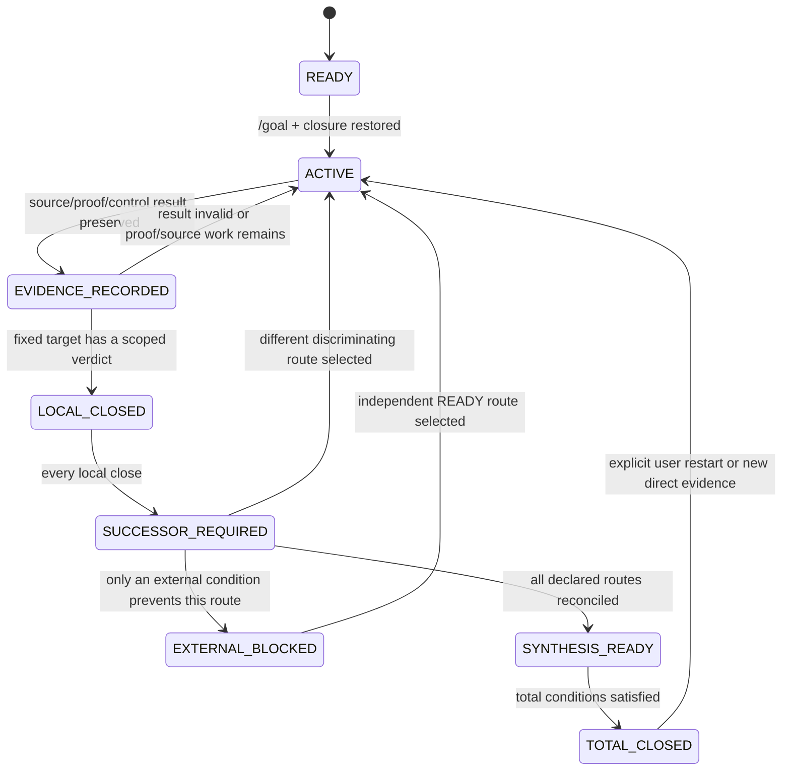

<!-- governance-shard:v2
logical_id: GODEL_ZFC_CONVERGENCE_SOP
shard_id: 003
index: ../哥德尔式ZFC理论精度收敛闭环SOP.md
-->

# 连续执行、局部停止与总完成状态机

## 1. 状态机



`LOCAL_CLOSED` 与 `TOTAL_CLOSED` 不是同义词。只有 `TOTAL_CLOSED` 允许结束由本 SOP 启动的总体工作。

## 2. 局部关闭的合同

一个 target 可以进入 `LOCAL_CLOSED`，当且仅当：

1. target、source/toolchain/calculus、任务输入和结论范围已冻结；
2. 结果、失败或未支付前提有可回读的 audit/proof/run/source evidence；
3. 至少一个相称的正控制、负控制或 DifferentTask control 已检查；
4. 已明确它没有证明什么；
5. `RouteUnitRecord.successor` 已给出，或外部阻塞条件是具体、可验证且不由当前会话凭空解除的。

合法局部 verdict 包括：

| verdict | 只表示什么 | 必须接的动作 |
|---|---|---|
| `SOURCE_CONSUMER_GAP_WITH_SCOPE` | 指定来源未提供所需 consumer/payment | 换 source 或把它登记为 control |
| `MODEL_VARIANT_GAP_WITH_SCOPE` | 指定模型与 fixed H0/calculus 不同 | 换 exact target 或显式构造 translation fragment |
| `TOOLCHAIN_VARIANT_GAP_WITH_SCOPE` | 当前环境不是所需编译器/库版本 | 在有可行外部环境时重放；否则转向可资格化 target |
| `DIAGONAL_PRECONDITION_UNPAID_WITH_SCOPE` | Code/Accept/diag/bridge 中某项未由固定对象支付 | 换 actual interface，或保留有界负结论 |
| `SAME_FULL_Q_REJECTED_WITH_SCOPE` | 冻结映射缺字段或任务不等同 | 记录对应差异，换明确不同的 correspondence route |
| `MACHINE_PROVED_WITH_SCOPE` | 精确 formal theorem 通过指定 kernel | 继续支付上层来源／同一任务义务，不能把内核结果直接升格 |

## 3. successor 选择算法

在 `LOCAL_CLOSED` 后，Master 必须按下面顺序产生下一单位：

1. **同一路线的未付义务：** 若有一项不同 mechanism/source/target 的直接 successor，优先它；
2. **依赖可解锁路线：** 选择能为 M4/M5 或 R4 提供新字段的 READY route；
3. **非饥饿路线：** 若同一路线已经连续收紧而总图无新增 payment，选择另一个 READY route；
4. **外部阻塞旁路：** 若当前路线必须等待固定编译器、访问许可或用户定义，记录阻塞后转到独立 route；
5. **总合成前审计：** 只有全部 route 均有 verdict 时，进入 `SYNTHESIS_READY`。

不得把“再多读一篇相同类型的文章”“再跑一次同一失败命令”“再写一个等价 fixture”当 successor，除非它明确改变第 002 片所要求的判别面。

## 4. 总完成条件

下列条件之外，不得把 `/goal` 标为完成：

### C1 · 实际正闭环

R3 的技术前提、R4 的 exact HoTT bridge、D 的实际 Accept/diag/bridge、M1 的必要 H0Map、M2/M3 的实际 P/Q interface、M4 的 SameFullQ、M5 的 attribution/adequacy 都有版本固定 payment，最终形式 consequence 和来源映射各自经过相称核验。

### C2 · 全路线有界拒绝

每个 declared route 都已获得范围明确的 rejection / underdetermination verdict，并且 successor-discovery 证明没有尚未结算的、已声明的不同判别路线。必须同时保存每条的 `reopen_if`。它不是“所有可能的 ZFC 问题均不存在”。

### C3 · 正式目标不可确定

经过来源与用户合同审计后，bare ZFC 的实际 completion／acceptance interface，或者唯一的 `OriginDone`，仍无法被固定为一个可输入 proof assistant 的目标。此结论必须列出已经查过的 source denominator、为何缺少的字段不可由研究者代造、以及什么新来源或用户决定会重开它。

### C4 · 用户明确暂停或取消

暂停不是数学结论。必须记录当前 `ACTIVE`/`SUCCESSOR_REQUIRED` 路线、所有未支付项和恢复步骤；后续明确恢复后从闭包继续。

## 5. 每单位自我审计清单

在写入 `RouteUnitRecord` 前逐项回答：

- [ ] 这一步的 parent gap 是什么，是否仍属本 SOP 的父结果？
- [ ] 我是推进了 R3/R4/D/M1–M5 哪一项，还是只做了工具／文档工作？
- [ ] 固定 target 是否与上一步真的不同，还是只换了名称？
- [ ] 自己的候选构造是否先于新来源阅读被记录？
- [ ] source、开放源码和 proof assistant 各自支持什么、不能支持什么？
- [ ] 是否区分了对象理论、元理论、宿主实现和数学共同体解释？
- [ ] `OriginDone` 与 `FormalDone` 是否在同一任务合同中，bridge 是否真实支付？
- [ ] 机器运行是否有精确 source、命题、run receipt、负控制和 claim matrix 边界？
- [ ] 局部闭合后 successor 是什么；它改变什么判别面？
- [ ] 此时为什么不能把总目标标成完成？若能，C1–C4 的哪一条完整满足？

## 6. Git 与方案演化

涉及本 SOP 的路线、状态机、路线分母或总完成条件的实质修改，必须在继续下一数学单位前形成精确 Git commit，提交信息使用：

```text
plan-revise(GODEL-ZFC-CONVERGENCE): <变化>; source=<user|evidence|self-audit>
```

单元证据、proof source、run receipt 和 claim matrix 的提交必须与相应 `RouteUnitRecord` 互相链接；不将无关 dirty 文件混入。一个未提交的 worktree 结果可被阅读为候选，但不得成为 version-closed 前提。
