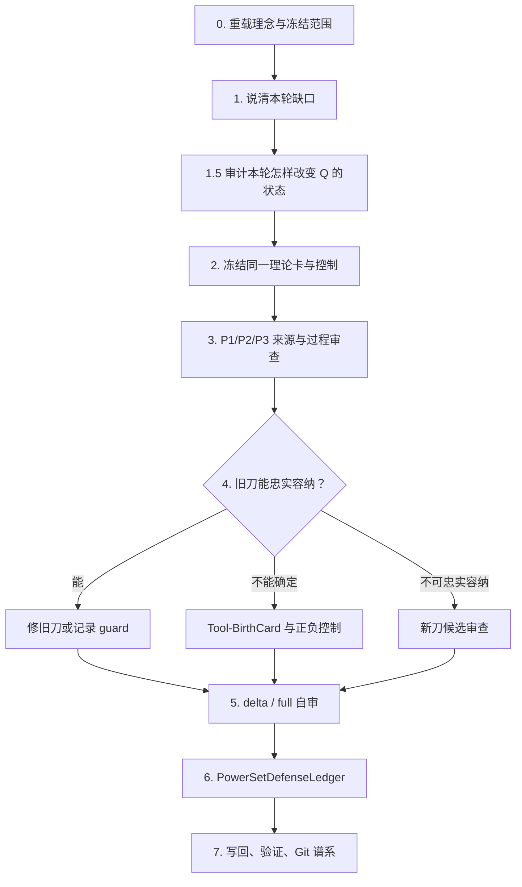

<!-- governance-shard:v2
logical_id: PATTERN_P_CONTINUOUS_FORGE_SOP
shard_id: 001
index: ../模式P刀具持续锻造SOP.md
-->

# 操作合同、检查维度与幂集防御账本

> **身份：** `P_FORGE_OPERATING_CONTRACT / OWNER_ROUTER / NO_AUTOMATIC_THEORY_VERDICT`。
>
> **适用条件：** 用户要求持续锻造刀具、审查或提出新刀、全历史自审、检验实际锻造是否偏离原初理念，或按更深的罗素计算视角重审 Power Set／ZFC 时使用。

## 1. 代码块逐项覆盖裁定

以下表格把研究发起人的 `/goal` 操作合同映射为本 SOP 的强制链。先前多个 owner 已覆盖大部分内容；本 SOP 补足的是统一调用名、连续阶段、检查维度总表，以及 Power Set 防御的显式账本。

| 研究发起人的要求 | 既有直接 owner | 本 SOP 的处理 | 当前判词 |
|---|---|---|---|
| 持续打磨 P1/P2/P3，必要时创建新刀 | 三刀 001–004、P-DAG Skill | 阶段 1–5 规定先定位缺口，再修旧刀或走出生审计 | `COVERED_AND_ROUTED` |
| 锻刀与发现 ZFC 的 Q 是同一件事；多把刀应使 P/Q 发现逐步涌现和收敛 | 三刀 009、013、P-DAG 005 | 阶段 1.5、D13 与每单元 `QConvergenceLink` 将每次修刀绑定到 Q 的生成、收紧、桥接、淘汰或会合 | `NEW_EXPLICIT_INVARIANT` |
| 新刀须经过认真论证，完整过程须记录 | 012 `Tool-BirthCard`、full audit 006 | 阶段 4 固定容纳、扭曲、正负控制、同卡增量与判词 | `COVERED_AND_ROUTED` |
| 老刀惯性可能限制花纹宇宙 | 012、P-DAG 005 `pattern-universe claim` | 检查维度 D08 与阶段 4 强制逐刀容纳尝试 | `COVERED_AND_ROUTED` |
| 每次有效打磨进入 Git 谱系 | 004、005 §5、full audit 006 | 阶段 7 要求精确 diff、验证、commit 或明确 `NO_CHANGE` | `COVERED_AND_ROUTED` |
| SOP 必须系统自审并消费理念图 | `刀具系统理念`、P-DAG 005 | 阶段 0/5 先读理念图，再作 delta 或 full origin audit | `COVERED_AND_ROUTED` |
| 出现不对齐时区分理念受挑战与执行问题 | P-DAG 005 §3–§4 | D10 使用五类偏差；`ORIGINAL_IDEA_CHALLENGED`须有直接同任务反例 | `COVERED_AND_ROUTED` |
| 刀具出现以前直到 `/goal` 连续运行前的全部讨论要逐项对照 | full origin audit 001–006 | 阶段 5 固定来源分母、历史分界、逐 source unit 对照与重审触发 | `COVERED_AND_ROUTED` |
| Power Set 可能是对朴素集合论罗素风险的加强防御；进攻需处理此防御 | RK-0 011、P-DAG 005、Power Set审计 | 阶段 6 新增 `PowerSetDefenseLedger`，把“防御何在、候选怎样超过它”变成显式来源义务 | `NEW_EXPLICIT_GATE` |

“Power Set 是加强防御”在这里保存为研究发起人的**结构性工作假设**：给定对象的全子集形成、rank、Foundation、Separation 等可以限制朴素无限制形成的某些罗素式路径。它不自动证明 ZFC 已防住一切路径，也不证明历史作者具有某一特定心理意图。每次实际分析必须由来源填写账本。

## 2. 启动与阶段流程



### 阶段 0：重载理念、权限与历史范围

1. 读 [刀具系统理念](<../刀具系统理念.md>)，再读本 SOP、相关单刀和 P-DAG SOP；本次节点若引用罗素、时间、现实任务或 UR，还要按项目 source-first 规则读相应用户原文。
2. 确认本轮是 `P-DISCOVERY`、`P-VALIDATION`、来源审查、控制、Battle、旧刀修订、Tool-BirthCard 还是纯全历史审计。
3. 确认是否有 worker 的精确用户授权。没有授权时，本 SOP 只允许 Master 的资料、设计与审计工作。
4. 需要声称“全部原初讨论已对照”时，读取 full origin audit 001–006，并运行其来源分母检查；普通自然单元只消费相称的 source unit 与 delta self-audit。

### 阶段 1：将“继续锻刀”变成一个可反驳的缺口

写出本轮唯一的 `ForgeIntent`：

```text
理论变体 / Target-Q / Candidate-Q / Control-Q / u / formation F / consumer C / Q? / I/O/Done
本轮要检验的 P1/P2/P3 字段或新花纹
相邻竞争位置与最小正负控制
QConvergenceLink：候选身份／Q状态前后／预期 Q_GENERATE、Q_NARROW、Q_BRIDGE、Q_CONVERGE、Q_REJECT 或 Q_CAPABILITY_CALIBRATION
SourceLayerTarget / PCalibrationConvergenceCard 当前 CAL 状态与预期变化
Power Set station impact / Round ledger 的新 ingress 或重复-guard 排除理由
预期可改变的结论 / 停止条件 / 反证条件
```

“更多搜一搜”“再找一把刀”不是 `ForgeIntent`。一个真实缺口必须指出：旧字段是否少了来源事实、某一 guard 是否被错读、同一任务是否未保持，或新花纹为何无法忠实映射到旧刀。

当范围是 ZFC／Power Set 时，ForgeIntent 还必须说明它补 `SourceLayerCoverageMatrix` 的哪一层、会改变哪一个 `CAL-*`、Q 状态或 station 判词。若只是已列 source family 的同义 guard，状态是 `REPEATED_GUARD_NO_NEW_FORGE_INTENT`，不启动 node。

### 阶段 1.5：`QConvergenceLink`——先证明锻刀在逼近什么

按 [三刀 009](<../模式P三把刀/009 - ZFC共同锻造与成功判据.md>) 的 `Q-0` 至 `Q-4`／`Q-R` 状态，填写：

```text
Target-Q / Candidate-Q / Control-Q and Q state before
which Q fragment is produced, narrowed, bridged, rejected or converged
which P1/P2/P3 field or control causes that change
why T/u/F/C/Q/I/O/Done stays the same
falsifier and Q state after
```

一张 guard、来源或工具修订可以合法地使候选进入 `Q-R REJECTED_WITH_SCOPE`；这是真实的候选空间收紧。
一个 runner／prompt／字段修复也可以是 `Q_SAFETY_REPAIR`，但必须说明它防止哪张固定卡被误报。若无法给出
候选、候选空间或误判防护的具体联系，判为 `TOOL_ONLY_DRIFT`：它不计入 P-FORGE 研究推进，不启动新的
理论节点，也不以“多锻了一把刀”表述进展。

若选 `Q_CAPABILITY_CALIBRATION`，还必须冻结：`Target-Q`、要校准的P字段、成对正负fixture、
将消费此能力的下一张真实 source card和停止条件。它只表示发现能力的受控增长，不把任何理论卡推进为
Candidate-Q；无法给出这一消费路线的fixture不得继续追加。

### 阶段 2：冻结同一任务、来源和可见性

沿 P-DAG 写 TaskCard／NodeCard。P1、P2、P3 即使并行，也必须共享同一冻结的 `T/u/F/C/Q/I/O/Done`；后续 mapper 不得重选对象再叫作验证。需要 worker 时，盲态、原典、项目分支、网络、模型、权限、观察与停止分别在 NodeCard 中冻结。

任何下列情况都先停在控制层：外部程序被当成理论时间、proof-system Done 被填作对象层 Done、未声明 checker 被从存在公理中发明、一次模型输出被当成理论结论、或运行隔离未资格化。

### 阶段 3：以三把刀和反控制审查同一张卡

1. **P1：** 对象是否是一等对象？`C/I/O/Done`是否由来源声明？`Q`是当前正义务或 formation 未支付义务吗？它是否被构造子、定义、公理、定理前提或给定 witness直接支付？
2. **P2：** 是否有同一对象的 `Bind → Form → Bridge → Reenter`？bridge 的方向、域与极性是否正确？guard 是类型、层级、单向语义桥还是来源缺口？
3. **P3：** 来源是否真正提供 `Draft/NeedBuild/NeedEval/Admitted/OperatorUse/BuildDone` 的 transition？静态存在、proof witness 和外部耗时不得替代它。若提出理论外 construction interpretation，先按 P3-C `ConstructionBridgeCard`核对象、输入、operation、observation和Done的同一性；有限／类型受界 bridge不得外推为任意理论对象。
4. **Controls：** 至少保留一个相邻位置、一个会阻断候选的来源或规则反事实，并区分正控制、负控制、guard 与未知。

输出必须保留公开 `MatchTrace`：source fact、字段映射、选择与淘汰、最小推演、反事实、范围判词。它说明可复核的理由链，不索取隐藏思维。

### 阶段 4：新花纹与新刀具出生

新花纹先写 `Tool-BirthCard`，并依次尝试 P1、P2、P3 的忠实映射。每一把刀都要写出对象、过程、观察与 Done 是否被保留；映射失败须给具体 distortion witness。

| 判词 | 允许动作 |
|---|---|
| `OLD_TOOL_FIELD_GAP` | 修正旧刀字段／prompt／来源卡，保留旧失败并同卡回归。 |
| `DERIVED_TOOL_CANDIDATE` | 写组合责任、非重复理由和正负控制；不自动分配新编号。 |
| `UNCONTAINED_PATTERN_CANDIDATE` | 冻结新刀的独立判断职责、输入、判词、正负控制、来源／worker 计划和同卡增量，才可提议编号。 |
| `NOT_ENOUGH_EVIDENCE` | 保留可重开条件，停止把花纹升级为新刀或理论问题。 |

新刀的必要条件是**不可还原的判断职责**，不是新比喻、来源缺口、工具故障、长时间运行或模型分歧。当前 `RK-0` 是共享砧座而非 P4；忒修斯／历史身份卡仍是 `NOT_ENOUGH_EVIDENCE`。

### 阶段 5：对理念—实作作 delta 或 full 自审

每个自然单元填写：

```text
source unit(s) / original requirement / actual action and evidence
alignment verdict / deviation class / cause
repair or stop / affected fields / regression or falsifier
pattern-universe claim / Tool-BirthCard verdict
PowerSetDefenseLedger verdict when Power Set is in scope
PCalibrationConvergenceCard delta / SourceLayerCoverageMatrix delta / station impact
QConvergenceLink verdict / Q state before and after / tool-only-drift check
Git commit eligibility / next trigger
```

偏差只使用：`ALIGNED`、`EXPECTED_CALIBRATION_FAILURE`、`IDEA_SPEC_INCOMPLETE`、`EXECUTION_DEVIATION`、`RUNNER_OR_EVIDENCE_FAILURE`、`ORIGINAL_IDEA_CHALLENGED`。最后一种需要逐字指出被挑战的用户原句、同一任务的直接反例，以及为何不能由规格遗漏或运行故障解释；Master 不能自行改写原意。

创建／退休刀具、改变成功定义、改变 worker/隔离/证据架构、HoTT→ZFC 转移、宣称原初讨论整体已对齐，或用户明确要求时，重做 full origin audit。它必须区分 `PRE_GOAL_HISTORICAL_CORPUS` 与 `GOAL_CONTINUATION_DELTA`，不把后来的修复倒灌为早期已通过。

### 阶段 6：`PowerSetDefenseLedger`

这一步只在 Power Set／相关 ZFC formation 进入 `ForgeIntent` 时执行。它把“必须比 Power Set 的罗素防御理解得更深”改写成可被来源反驳的工作，而不是口号。

| 字段 | 必须回答的问题 |
|---|---|
| `PS0 source/variant` | 哪个版本固定的 Power Set、附带规则或实际 consumer 被审？对象层、proof layer、模型层和 runtime 层分别是什么？ |
| `PS1 defended Russell feature` | 它限制的是 unrestricted binder、domain promotion、negative self-reentry、层级、self-membership、formation payment，还是别的 RK-0 字段？须给规则／来源。 |
| `PS2 actual guard` | `a` 的有界输入、正向 subset bridge、rank successor、Foundation、Separation、已给 witness、消费者 Done 或其它 guard 实际在哪里生效？ |
| `PS3 guard scope` | guard 覆盖哪一理论变体、对象层和任务？它不能被扩写成“ZFC 一切问题都被防住”。 |
| `PS4 candidate surplus` | 当前候选在同一 `u/F/C/Q/I/O/Done` 中保留了 guard 仍出现什么未支付的再入、上升、资格／算符边或现实任务张力？ |
| `PS5 same-task control` | 去掉／改变 guard 时，观察、输入和 Done 怎样改变？候选是否只是换成朴素无限制理解或外部算法？ |
| `PS6 verdict` | `DEFENSE_IDENTIFIED`、`CANDIDATE_GUARD_BLOCKED`、`BEYOND_DEFENSE_CANDIDATE`、`SOURCE_GUARD_SCOPE_UNSET` 或 `NOT_ENOUGH_EVIDENCE`。 |

`BEYOND_DEFENSE_CANDIDATE` 只表示出现了值得继续核验的、同一任务内的剩余问题；它不表示 ZFC 不一致、Power Set 错误或历史上谁“没有理解罗素”。若 PS4 为空，必须停在已识别的 guard／来源缺口，不能以更换 membership 式或扩大公理列表来制造进展。

### 阶段 6.5：校准与站位审查

按 [013](<../模式P三把刀/013 - P校准收敛、来源覆盖与Power Set站位退出合同.md>) 更新或读取 `PCalibrationConvergenceCard`、`SourceLayerCoverageMatrix` 和 Power Set station state。此阶段不要求每轮改三份 owner；它要求每轮明确：

1. 当前证据只到 `CAL-1`／`CAL-2`，还是有来源支持的 `CAL-3`／`CAL-4` 变化；
2. 本轮来源究竟覆盖规则、proof/formalization、model/semantic、mathematical practice还是 construction bridge；
3. 当前 proposal 是有效 ingress、Round-level重复 guard，还是足以进入全局站位退出审查的证据。
4. 这一轮的 `CAL` 或来源变化是否对应一个明确的 `QConvergenceLink`；二者不能互相替代。

站位切换必须由 `STATION_SWITCH_CANDIDATE` 的 S1–S5审查输入支持，并由研究发起人选择下一明显承诺。Master 不得用“节点已多”“一段时间没有命中”或一个形式化库的负结果自动换站。

### 阶段 7：写回、验证与 Git 谱系

| 事实类型 | 唯一写回 owner |
|---|---|
| 原始用户要求与本 SOP 的适用边界 | `rulings.md` |
| 当前需求／验收状态 | `feature-list.md` |
| 概念地图 | `刀具系统理念.md` |
| 单刀字段与当前规则 | 三刀 001／002／003、011／012 |
| Q 状态、共同收敛与校准关联 | 三刀 009／013 |
| 顺序锻造史与横向影响 | 三刀 004 |
| 自审节奏、偏差和运行边界 | P-DAG 005 与 full origin audit |
| 当前执行路线和恢复入口 | `MEMORY/001` |
| 节点证据 | NodeCard、source、audit、session／trajectory receipt |

每一有效修订先核 Git baseline，再写 source／contract／evidence，执行相称的结构、链接、脚本或运行验证，回读 current owner，最后只 stage 本单元路径并精确 commit。没有语义变化时写 `NO_CHANGE` 理由；不得为了制造谱系而重复提交。Git 证明可追溯，不能代替数学证明或来源裁决。

## 3. 检查维度总表

| ID | 维度 | 必须检查 |
|---|---|---|
| D01 | 原初理念 | 本轮保护的是罗素计算张力、理论级靶、明显位置、AI启发式、同一任务还是 UR 的哪一部分？ |
| D02 | 理论对象与层级 | `u/F/C/Q/I/O/Done` 是否属于同一理论变体和同一对象／证明／模型／runtime层？ |
| D03 | P1 未支付性 | `Q` 是否为真实正义务或 formation 未支付义务，而不是定义、普通 false query 或来源已支付项？ |
| D04 | P2 逻辑忠实性 | binder、bridge、reentry、极性、类型和 guard 的方向是否由来源支持？ |
| D05 | P3 次序忠实性 | 是否有来源定义的准入／算符 transition，而非静态公理或外部耗时？若用外部 construction interpretation，`ConstructionBridgeCard`是否保持对象、输入、operation、observation和Done同一性？ |
| D06 | 同一任务与控制 | 输入、操作、观察、Done、邻近竞争项和反事实是否保持同一任务？ |
| D07 | 发现与验证分离 | discovery 是否仍只是线索？validation 是否冻结父卡而没有重选答案？ |
| D08 | 花纹宇宙与新刀 | P1/P2/P3 是否忠实容纳？扭曲在哪里？新职责是否不可还原？ |
| D09 | Power Set 防御 | `PowerSetDefenseLedger` 是否分清具体 guard、适用范围、候选剩余与同一任务反事实？ |
| D10 | 理念—实作偏差 | 是校准失败、规格遗漏、执行偏差、runner/evidence失败，还是原初理念受直接挑战？ |
| D11 | Agent／来源证据 | 模型、权限、可见材料、隔离、trajectory、source pack、MatchTrace 和终态是否可复核？ |
| D12 | 谱系与停止 | 当前结论的范围、Git commit、可推翻条件、下一触发和不应外推的内容是否写明？当前 CAL 状态、来源覆盖层和 station state是否同步？ |
| D13 | P/Q 共同涌现 | 本单元让哪张 Q 卡生成、收紧、桥接、淘汰或会合？若没有 Q 变化，是否是可指向固定卡的 `Q_SAFETY_REPAIR`；否则为何没有停止为 `TOOL_ONLY_DRIFT`？ |

## 4. 后续 `/goal` 的引用方式

可直接使用下列任一表述：

```text
按 P-FORGE-SOP 继续：先对 <理论卡> 做阶段 0–3，再决定是否进入 Tool-BirthCard。

按 P-FORGE-SOP 审计 <当前锻造单元>：重点检查 D08、D10 与 D12；不要启动新的 worker。

按 P-FORGE-SOP 处理 Power Set：先完整填写 PowerSetDefenseLedger，只有 PS4 与 PS5 成立才继续寻找 Q。

按 P-FORGE-SOP 重新审视 <新花纹>：完成 Tool-BirthCard 的正负控制与同卡增量，决定是否可提议新刀。
```

引用 `P-FORGE-SOP` 会路由这份总 SOP、`刀具系统理念`、P-DAG 和相关刀具／审计 owner；它不会自动运行任何节点。当前主线仍是 `ZFC_SITE_SELECTED / ZFC_Q_NOT_LOCATED / NO_P4`，直到新的来源和同一任务证据改变它。
