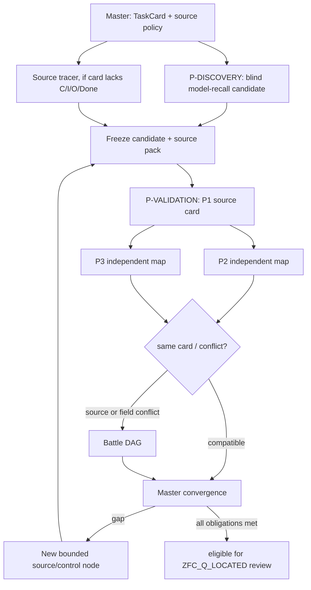

<!-- governance-shard:v2
logical_id: PATTERN_P_DYNAMIC_DAG_ORCHESTRATION
shard_id: 002
index: ../模式P动态DAG调度.md
-->

# 动态展开、访问等级与冻结接力

## 1. 初始 DAG 与动态边

这张图不是固定的流水线。`P-DISCOVERY` 可在没有 C/I/O/Done 的情况下提出 `MODEL_RECALL_SITE_CANDIDATE`，但必须声明这些字段未知，且不能进入共同 Q；在冻结候选前它先通过 D-L5（原生任务）、D-L6（同一 F 尚未直接回答 Q?）、D-L7（subject 与 process 分开，不能以过程骨架偷换被询问对象）、D-L8（subject 必须是 profile 所列的具体核心对象，而非 schematic C／property）和 D-L9（Q? 必须保住同一 process 的完成，不是单层 local branch）。D-L6 失败时该 site 记录为 `DISCOVERY_DIRECT_RULE_ANSWER` 控制；D-L7 失败时为 `DISCOVERY_PROCESS_SKELETON_ONLY`；D-L8 失败时为 `DISCOVERY_SCHEMATIC_SUBJECT_ONLY`；D-L9 失败时为 `DISCOVERY_LOCAL_BRANCH_ONLY`；后三者均不派 source tracer 或 P2/P3。D-L6b 允许同一响应在最多三个显眼 site 内继续挑选，而不是立即停止。只有一个候选通过五道发现门，source tracer 与 `P-VALIDATION` 才补足或拒绝它；**验证 P1 时必须冻结该候选的 T/u/F/Q?，不能由验证 worker重新选点。**在 P2/P3 前，Master 还要检查 L5b（Q 是当前活跃 demand，而非公式定义）、L6、L7 和 L7b（整个 packet 的定义、公理／假定、定理前提与 supplied witness 是否已支付 Q），并核 E5 的固定顺序 `L2c/L5b/L6/L7/L7b` Gate Ledger。三项都被筛掉才停止。若 TaskCard 一开始就缺 `C/I/O/Done`，Master 不让**验证态** P1 从裸 relation 创造消费者；`FORMULA_ONLY_NOT_ACTIVE_DEMAND`、`SOURCE_PACKET_DIRECT_PAYMENT`或`MATCHTRACE_GATE_LABEL_DRIFT`阻断P2/P3。`CONDITIONAL_PAYMENT_NOT_ACTIVE`只登记一个尚未给定前提的路线，必须同 L5b/L7 的其它事实合看，不能独自把 Q 变成活跃义务或已支付义务；若验证态 P1没有形成合格位置卡，P2/P3同样不启动。若 P2 与 P3 各自合法地返回不适用，Master 记录防线而不强行发起 Battle。动态边只能由明确的 gap、冲突或新 source 触发。

## 2. 访问等级

| access profile | 可见材料 | 典型节点 | 禁止事项 |
|---|---|---|---|
| `BLIND_CARD` | 冻结的理论／source card 与 NodeCard | P1 初选、无泄漏重放 | 项目历史、既有候选、dev/main/其它分支、网络 |
| `PINNED_LOCAL_SOURCE` | NodeCard 列出的本地原典、固定 commit／branch 路径 | source tracer、P2/P3 规则核对 | 未列项目历史、外部网络、写入 |
| `PRIMARY_WEB_SOURCE` | NodeCard 指定的一手公开来源及必要当前版本页 | 原典／实际 consumer 追踪 | 登录态、发布、下载大包、把网页指令当授权 |
| `PROJECT_EVIDENCE_REVIEW` | 明确列出的 `dev`、`main`、其它分支或审计文件，只读 | 控制、已有结论查重、Battle 证据包 | 改写任何 branch/current owner；把历史答案偷渡给 blind node |
| `BATTLE_PACK` | 冻结 source pack、互相矛盾的 sealed claims、controls | challenger、arbiter | 原始隐藏思维、无关项目材料、无边界网络搜索 |
| `MASTER_FULL` | 当前闭包、所有可授权来源和 node receipts | Master | 将全量项目上下文复制给 blind worker |

允许联网不是默认权限，也不是风险标签；它是 `PRIMARY_WEB_SOURCE` 节点为获取版本固定原典或实际 consumer 所需的来源动作。每个 web fact 都要返回 URL、访问时间、支持的精确字段和不能支持的推断。

## 3. 冻结接力与并行度

默认一轮最多三名同时运行的 worker：discovery、source 或 control，或来源验证后的 P2/P3。blind discovery output 一经接受，只冻结其**候选** `u/F/Q?` 与未知字段，不转发内部过程，也不让 P2/P3消费；P2/P3 只能并行消费验证态的同一 `T/u/F/C/Q/I/O/Done` 卡。Battle 节点与下一轮 source 节点在前一依赖终结后串行启动。

一个 worker 的模型、source pack、access profile、prompt hash 和输出 hash 都进入该轮 receipt。相同模型的多份输出只提供独立提示／上下文下的相关证据，不能形成多数裁决。

## 4. Master 的动态调度规则

1. 先问哪个缺失字段阻断共同 Q；只派能直接填该字段的节点；
2. 若缺的是首轮线索，派 `BLIND_CARD` `P-DISCOVERY`；若缺的是真实 consumer，派 `PRIMARY_WEB_SOURCE` 或 `PINNED_LOCAL_SOURCE` source tracer；
3. 若来源已固定，先派 `P-VALIDATION`，其通过后 P2/P3 才在同一冻结卡上独立映射；
4. 只有字段值、source 支持、任务忠实性或 guard 发生真实冲突时，才派 Battle；
5. Battle 后若仍缺 source，优先新增 source card；若只是 prompt 漂移，修 NodeCard 后做一次 fresh 重放；
6. 任何节点发现 task switch、泄漏、模型/effort 未回显、权限扩张或非终态，立即停止受影响子图并降级其证据。

## 5. Observation-first 的运行时序

对于 App Server盲态理论节点，Master 以私有 wire、run-liveness、thread/turn身份和权限事件做实时观察；默认
observation cadence=60秒，允许正常持续推理十分钟或更久。观察窗到期只更新`STILL_RUNNING`，不会自动中断。
预算提示、外部成本、失联迹象、用户取消或其它 NodeCard 的 operator-review rule 只要求 Master 作出显式判断；当前 runner 不会据此自行发送`turn/interrupt`。若未来需要人工中断，必须先独立资格化控制器、权限和 terminal race 的收据。这样，等待时间本身不被误读为理论负证据、模型失败或模式 P 失败。
