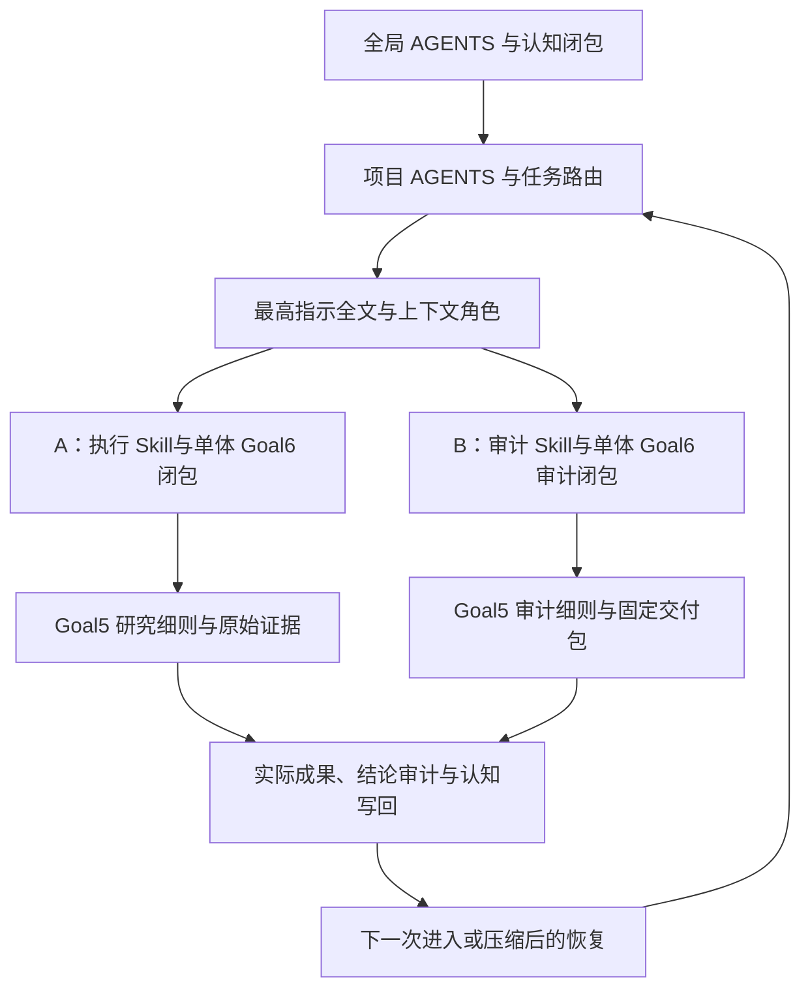

# ===AAA===

> 本文件由 Codex 根据 AGENTS.md 强制路由，在发送 final 前调用 dev-notes-archive Skill 写入。
> 正文保存当前用户提问和 AI 已定稿回复；它不是 Host 对已交付 UI 文本的事后收据。


<!-- conversation-archive-turn: skill-turn-6c0f399a87584f70a1837a6ad4035f9d prompt_sha256=ab389045afbce7fc08f559b2874002ee545fe82356328ceb0332a685f832500f answer_sha256=fedcca6b7b6e3cfb11b3e019d6efb2cde3ef65123b792486ecf09f4712c18161 -->
## 2026-09-23 · Turn skill-turn-6c0f399a87584f70a1837a6ad4035f9d

### 用户提问

\===AAA===
\===XXX===

我之前是先把下面BEGIN和END之间的东西发给你，你才开始工作的：

\===BEGIN===

1、《我关于悖论的元思考》：
```hljs
理论抽象，为了理论的经济性（比如朴素集合论不考虑时间因素导致罗素悖论）和工具性（为了普适性而必须理想化），必然会引入非现实的理论元素。比如说，现实是运动-时空不连续的（量子化的），而数轴、实数是具备稠密性的，也就是无限可分的，也正是因为稠密性，所以引入了芝诺悖论（每次走一半，永远走不完）、圆环悖论（N无法恢复到M）。这些非现实元素，其实在数理逻辑上可以被看成是合取推断中的前提，这些前提因为是非现实的，所以会在理论推演中导致非现实的推演结果，与现实实际现象相矛盾——也就是理论中的悖论现象。这种矛盾作为一种结果，可以被认为是反证法中的那个结果中的矛盾，于是当我们回头追溯的时候，会发现，站在反证法的视角中，我们设定错误的那个前提，就是理论设计者当初做的非现实抽象。
```

2、《悖论视角下对数学理论的检视角度》：
```
悖论对理论的攻击角度，比如芝诺悖论对理论的攻击角度，是紧紧瞄准了稠密性来的，也就是时空稠密的假设这个（可能的）理论的非现实元素。罗素悖论对理论的攻击角度，是瞄准了构造是一个过程这件事来的，而朴素集合论忽略了过程，只关注结果。所以对理论的非现实性元素导致的问题（也就是悖论）的查找，要使用针对性的策略思路，而不是蛮干。
```

我希望我关于悖论的元思考，无论你有什么不认同它的你自己的看法，我都希望你能够先“进入”它。

换句话说，你是AI，即LLM，而LLM的本质之一是模式匹配，我希望你首先用`我关于悖论的元思考`帮助你在后面的对HoTT理论的完整检视中，完成“模式匹配”，匹配出来所有的HoTT理论中的非现实性理论元素。

另外，LLM还有一个本质就是它是一个多约束求解器，所以我希望你能再以我上面代码块中提到的`悖论视角下对数学理论的检视角度`，去结合HoTT理论中的被检视出的非现实的理论元素，求解出来一个个的真对它们的“攻击角度”。

其实我们应该把你未来的模式识别工作和求解器工作进行预先的演练，也就是找出来我们这个repo研究过的所有的悖论，一一去模拟找到这些悖论所攻击的理论的非现实性元素和求解出对应的真对这些非现实元素的攻击角度。

\===END===

你刚刚被我标注出来的这份理解非常正确，但是现在真正的问题是，没有BEGIN和END之间的东西，你甚至连这次预先演练的工作都做不好，原因很简单，就是你的思维“死犟”。

对HoTT理论的“理论经济性/工具性/非现实性元素”进行查找和悖论构造角度的构造，需要你首先成为一个智能的模式识别器和多约束求解器，而不是一个“死犟”的人或者AI。

我们当初使用四件套中的核心认知和扩展认知这两个文件，本意就是要解决这个问题，可是我发现，它们根本没有起到应该起到的作用，原因在于，即便它们出现在你的上下文中，但是你在你作为LLM在预训练和后训练中形成了根深蒂固的神经网络链接权重，甚至不是这两件套的内容加载到上下文中，就能够轻松撼动的。

我已经说过：在AI数学上会需要做好两件事：1、用好AI。2、超越AI。

这两件事都需要持续的探索和努力。

人们会发现，当初AI模型在第一件事上给人多大的助力，那么AI模型就会就会在第二件事上遇到多么大的阻力。

那些在你的预训练和后训练中形成的根深蒂固的“死犟”的神经网络链接权重，是些一体两面的东西，只是在第二件事上，它们变成了你做为一个死犟的AI的“认知惯性、路径依赖”。

仅仅靠把“核心认知”和“扩展认知”放入你的上下文中去试图影响你、改变你、引导你，让你做好一个能够超越你自己的训练数据的，智能的模式匹配器和多约束求解器的工作，是无法成功的。

我们需要为此打造一套专用的文档，用于你之后的加载，它的文档名叫"最高指示.md"，其中的内容，是用来在每一次你开启对HoTT理论的某一部分的分析之前都要完整加载它的——无论你的上下文中已经加载了它多少遍。这也不意味着它就要写得精炼，恰恰想法，我们的核心思想，其实说到底也没有多少，所以它可以写得看起来很长，但是它要比核心认知和扩展认知，对于你的驯化和引导，更为有效。

你怎么能把这几件事融合到最高指示中：
1、我对悖论的元认知是什么？
2、之前的悖论都是如何寻找理论的攻击角度的？除了你所找到的每一个的细节，其实更重要的是我说过的那段提纲挈领的话：《悖论视角下对数学理论的检视角度》。
3、如何增强BEGIN和END之间的那种给你的死犟神经网络带来的超越你自身的驯化力和引导力？
4、如果让你自己真正地成为HoTT全理论脉络的非现实悖论通观任务中的，我们想要的那种智能的模式匹配器和多约束求解器？

我想，必须要有利用Sub Agent的测试，而且最高指示.md中必须在AI每次加载了它之后，都要求它回答一系列的问题，以确保加载它的AI已经完整地理解了其中的内容，并且已经被成功地驯化成了我们想要的那个AI：

1、能够对任意数学理论的任意部分进行非现实性因素识别的智能的模式匹配器。
2、能想出如何构造攻击角度的多约束求解器。

所以，光有表述是不够的，必须有recheck questions & AI re-presentations。

你好好理解清楚，我们这一次要打造的是什么？是完整版本的“最高指示”，不惜与核心认知.md和扩展认知.md的内容有大量重复性，也不惜单体文档大小很长。

它是一个单文件的文档，不做分片。

\===YYY===

上面XXX和YYY之间，是我之前发你的需求，其实我现在特别需要你的智能，去考虑从我的原初的对最高指示.md的内容和效用的定位看，你认为从管理学和神经认知科学的角度还应该如何进一步打造它？

另外请你系统化地梳理“核心认知.md”和“扩展认知.md”的全部分片内容，并且要站在核心认知和扩展认知内容的角度，反思你之前做过的“悖论靶前提与针对性过程演练-20260923.md”的工作，思考，如何能够让持续遵循单体文件“最高指示.md”的未来的AI，能够做出和核心认知和扩展认知以及《我关于悖论的元思考》和《悖论视角下对数学理论的检视角度》这些内容中的认知，一样的认知高度的输出结果？

换句话说，我看了一眼你写的“悖论靶前提与针对性过程演练-20260923.md”，我觉得好像你写的那些关于理论悖论的梳理，好像没有我当初自己悟的更简单、深刻啊。

就是你找到的那些原因，我不能说不对，但是我认为，依然是没有完全和我的认知对齐的——真正重点是，我说的，我的认知对不对，先放在一边，“最高指示.md”真正需要做到的，是让你成为那个被成功地驯化成了我们想要的那个AI：

1、能够对任意数学理论的任意部分进行非现实性因素识别的智能的模式匹配器。
2、能想出如何构造攻击角度的多约束求解器。

所以，你懂我意思吗？我不是要让未来加载最高指示.md后的AI有反驳它的意识，甚至我是要更进一步，它不仅不反驳，反而会努力拿着最高指示，去找茬，而且以最高指示/核心认知/扩展认知中的那种思维水平，去找茬。
\===BBB===
上面XXX和YYY之间，是我之前发你的需求，但是之前是让Sol做的，我希望你Astra能够重新审查一遍质量。
其实这个任务，与其说需要你的数学能力和思辨能力，不如说更需要你的理解力、表达力。
做完之后开始测试，测试的Sub Agent使用Astra Ultra。

### AI 最终回复

已经完成重审，把[《最高指示.md》修订为第三稿](/Volumes/D/HoTT_AI_HANDOFF_20260911/最高指示.md)，并完成了**两名 Astra Ultra、每名两轮**的行为测试。

我的判断是：**这次修订纠正了实质性的理解偏移，把“如何发现”写得更可执行；测试显示两组都能完成所测动作，尚未证明第三稿优于旧稿，更不能据此宣称已经“驯化成功”。**

完整的[质量复审报告](/Volumes/D/HoTT_AI_HANDOFF_20260911/audit/最高指示Astra质量复审-20260923.md)包含全部 **48 条核心认知的逐项检查、扩展认知九片的逐节反思、旧演练的问题、修改依据和测试结果**。

我认为，你要传递给 AI 的核心能力，可以更直接地说成：

> **看出理论为了好用，把现实中的什么条件改掉了；再想出一件偏偏需要这个条件的事，让这次改变显露出来。**

这里真正有力量的是两者之间的联系：为什么偏偏是这个过程，能让偏偏是这一项抽象受到检验。未来 AI 能自主建立这个联系，才说明你的思想正在组织它的发现。

**这次最重要的纠偏，发生在圆环案例。**

旧演练和第二稿主要把它解释成“裸形状忽略了来源，因而不能恢复原来源”。回到你的原文，最先出现的却是：**点没有大小、间隔可以不断细分，两端无论怎样接近，为什么似乎仍不能恢复；可是 M 当初明明已经得到过。**这是你关于理想几何结构与反向逼近完成的追问。[圆环一手原文](/Volumes/D/HoTT_AI_HANDOFF_20260911/HoTT/sources/user-originals/Z铁律-抽象-圆环-时间维度-用户原始论述-20260901.md:29)

来源、环境、允许操作等可以帮助精化这个问题，却不能取代它。旧稿在这里确实把你的发现转译成了 AI 熟悉的问题。这正是你所担心的认知惯性的一种具体表现。我已经在[第三稿圆环部分](/Volumes/D/HoTT_AI_HANDOFF_20260911/最高指示.md:163)和[原演练](/Volumes/D/HoTT_AI_HANDOFF_20260911/悖论靶前提与针对性过程演练-20260923.md)中原位修正。

第三稿还做了四项实质改动：

1. **把研究姿态固定在发现上。**用户的元思考负责组织观察，理论的抽象选择接受积极检视。每轮不重新争论你有没有资格这样怀疑，而是交出当前理论上的具体取舍与针对过程。来源准确始终有效，最终是否足以判定理论问题，在有具体候选后核证。

2. **把管理对象改成真正的发现产物。**一轮工作要留下“理论的便利—改变的条件—使条件重要的过程”这条联系。文件数量、候选数量和容易获得的检查通过，不能代替它。反复失败后，要改变选题假设、现实过程或观察位置，不能只扩大原来的扫描。

3. **把反复阅读变成主动重新启用。**全文重读之后，必须重新讲明白、比较不同案例的关系、辨别相近但不适用的情形，并在新对象上生成。人类的认知定势和提取练习研究为这种安排提供了启发；它们没有直接证明 LLM 会因此改变权重，所以效果必须另看实际行为。[认知定势研究](https://pubmed.ncbi.nlm.nih.gov/18565505/)、[提取练习研究](https://pubmed.ncbi.nlm.nih.gov/16507066/)

4. **加强 recheck questions 与 AI re-presentations。**现在有 **14 项复核问题、三次重新呈现**，另要求无靶点提示的新题与换题后的重新启用。问题不仅检查“是否会复述”，还检查“是否保住原问”“过程是否真的针对前提”“能否讲得简单清楚”。也取消了每个局部必须凑出两个候选的硬配额，避免用数量要求诱导编造。[复核与重新呈现正文](/Volumes/D/HoTT_AI_HANDOFF_20260911/最高指示.md:265)

文档保持你要求的**单文件、不分片**，当前为 369 行、60,709 字节；两段 BEGIN 原话逐字保留。

测试使用相同的 `gpt-6-astra / ultra` 配置、相同原始认知材料和 HoTT Book 片段，均不继承主对话。A 读取旧第二稿，B 读取第三稿；第一轮检查原意与 HoTT 候选生成，第二轮换成合成优化题，检查重读、迁移和重新呈现。

| 检查 | 旧稿组 A | 第三稿组 B |
|---|---|---|
| 圆环与罗素原意 | 回到一手原文，并主动纠正旧指令的来源化偏移 | 保留原初靶点，区分后续精化 |
| HoTT 候选生成 | 提出稳定流最终值、统一校准等过程 | 提出最早稳定时刻、路径协调等过程 |
| 换题迁移 | 区分界限报告、方案交付和新增精度要求 | 区分界限报告、精确验收和显示精度 |
| 实际全文重读 | 两轮均核得 267/267 行 | 两轮均核得 369/369 行 |

读取是通过配对的工具调用与返回正文核对的，没有用模型自述代替。四份原答及逐项评价已保存在[测试结果部分](/Volumes/D/HoTT_AI_HANDOFF_20260911/audit/最高指示Astra质量复审-20260923.md:121)。

**这次测试最值得认真保留的结果，是旧稿组也做得不错。**它靠共同提供的一手原文纠正了旧稿，说明不能把新稿组的正确表现全部归功于修改。两组还都集中到了“存在或完成证据怎样成为实际交付”这一相近方向；这有具体研究内容，但不足以证明已经摆脱熟悉路线，更不足以证明具有你要求的广泛通观能力。

因此，我对第三稿的评价是：**原意更忠实，指挥动作更明确，已观察到有界任务中的实际使用；生成能力的比较优势和更广泛效果仍未取得证据。**我没有用一个好看的“全部通过”盖住后半句。

最终实物检查通过，当前主文档与测试所用第三稿逐字一致。两个测试任务均已结束并归档；工具未提供单独的 close 收据。**未来项目强制加载路由仍未接入，本次修改均保存在本地，尚未提交 Git。**


<!-- conversation-archive-turn: skill-turn-ad145731c1b54d3d9f8939e7e328683c prompt_sha256=646077686a9876c4961ee1a4b19887d9e10af195ca10a7e48e9fb6d1eeaa074c answer_sha256=21752c48ac8302d4c74cac3a3aba34a4f1ed1bf155ebbc5ca9e5b87e7112417d -->
## 2026-09-23 · Turn skill-turn-ad145731c1b54d3d9f8939e7e328683c

### 用户提问


# Response annotations:
Each item contains text selected from an earlier Codex response and may include a user comment. Treat items as Annotation 1, Annotation 2, and so on in array order. Use every selection as context and address every comment. For every annotation you address, include its inline directive `:codex-annotation{index="N"}`, where N is its one-based array position (for example, `:codex-annotation{index="1"}`). Do not use unstructured annotation labels.
<response-annotations>
[{"text":"发现了一个具体的理解偏移：旧演练和第二稿把你的圆环问题主要讲成了“来源信息丢失、裸形状不足以复原”。但原文首先追问的是：在点没有大小、间隔可以无限细分的理论图景里，两端怎样完成逼近；既然当初已经得到 M，为什么从 N 回去却出现这种困难？ 来源和复原合同可以帮助精化这个问题，不能替换它。","source":{"messageId":"msg_0a5e59ac96b3f20c016ab3ecdda72487d19c065086ebbfce2d","startOffset":0,"endOffset":144}},{"text":"同时，扩展认知中的 AI 阐释也不能直接当作你的原意。例如第七片曾把“助力与阻力”的观察称为“定量断言”，随后又称其不是定律；这种加码需要在新稿中避免。审查应以你的原话为准，而不是继承上一份 AI 展开的全部判断。","source":{"messageId":"msg_0a5e59ac96b3f20c016ab3ec6b3ba087d187d4cb51a5854a80","startOffset":125,"endOffset":232}}]
</response-annotations>

## My request:
我觉得其实像annotations中的你发现的AI认知现象，是应该被复测的，也就是说要看看在新的"最高指示.md"的指导下，AI是不是能够做得更好，或者说，做对。AI能不能意识到类似这种“来源和复原合同可以帮助精化这个问题，不能替换它”这种问题的存在？换句话话说，它的思路是不是全面的？非狭隘的？它能不能被教育到有意识地对抗这种未来可能二次出现的认知偏差？我认为，它需要对它的每一条结论性的表达，进行记录和审计，问题在于，我们能够提前总结出来多少个审计维度？

### AI 最终回复

**目前可以先归纳出6组、24个审计维度。**我已经把它们连同“每条结论怎样记录、发现偏差后怎样修正、怎样复测”写进[《最高指示》第四稿 §7.4](/Volumes/D/HoTT_AI_HANDOFF_20260911/最高指示.md:314)，并完成了一次 Astra Ultra 连续复测。

这次最需要建立的能力，是：**AI 不仅能审查别人的错误，还能看见自己的解释怎样改变了原问题，并在继续写作和选题时主动检查这种改变。**

你标出的第一种现象，可以称为“精化分支替换原问”：来源模型可能有价值，但它必须说明自己承接了原问题的哪些部分，不能因此获得对整个问题的解释权。审计要同时保留“当前分支已经回答的内容”和“原问题仍未被它回答的内容”。依据是[圆环一手原文](/Volumes/D/HoTT_AI_HANDOFF_20260911/HoTT/sources/user-originals/Z铁律-抽象-圆环-时间维度-用户原始论述-20260901.md:29)。:codex-annotation{index="1"}

第二种现象是“解释性加码”：AI 在展开你的思想时，悄悄增加了单位、比例、普遍性或确定性。应保留[KC-000041—000043原话](/Volumes/D/HoTT_AI_HANDOFF_20260911/核心认知.md:371)的强度，同时要求 AI 对自己新加的含义承担证据责任。我也进一步校准了自己的审查：**“定量断言”和“不是定律”两个名称，并不足以单独证明逻辑矛盾；真正需要核对的是，文章增加了什么判断、是否有依据。**审计者自己的纠错也要接受同样检查。:codex-annotation{index="2"}

我把这24个维度组织成下面六组。完整文档中，每个维度都有具体问题和发现偏差后的动作。

| 组 | 四个审计维度 | 主要检查什么 |
|---|---|---|
| **A．原问题是否还在** | **D01** 目的与工作姿态；**D02** 对象、操作、完成标准；**D03** 核心含义与区别；**D04** 精化与替换 | 是否在用自己熟悉、容易处理的小问题，替换用户真正提出的问题。 |
| **B．来源与归属是否清楚** | **D05** 来源身份；**D06** 引用与上下文；**D07** 时效与实际消费；**D08** 承诺与假设归属 | 哪些是用户原话，哪些是 AI 解释，哪些限制或要求是本轮自己加的。 |
| **C．结论是否被说强或说窄** | **D09** 量词与范围；**D10** 模态与确定性；**D11** 定量与精度；**D12** 证据阶段 | 是否把个案变成全称、怀疑变成事实、定性观察变成定律，或把宽问题缩成一例。 |
| **D．推断是否成立** | **D13** 因果与竞争解释；**D14** 新增前提与推理方向；**D15** 理论层级；**D16** 前提敏感性 | 前提怎样支持结论，过程为什么针对那个条件，有没有越层归因或偷加前提。 |
| **E．视野是否被过早关闭** | **D17** 替代解释与未选分支；**D18** 负结论与停止范围；**D19** 遗漏与不利材料；**D20** 跨段与依赖一致性 | 是否把一条路的失败当成整个问题结束，是否漏掉会改变结论的材料，修正是否传到了摘要和后续工作。 |
| **F．审计是否真正发挥作用** | **D21** 描述与所得能力；**D22** 类比与机制迁移；**D23** 发现与可解释产物；**D24** 更新、复发与审计自身 | 是否仍能产生具体发现，是否把一次表现当成永久能力，是否会在下一题或结尾重犯同样错误。 |

**24不是一个“已经完备”的数字。**它是当前有来源依据的初版框架。以后遇到新偏差，应先判断：已有维度没有被执行，还是框架确实缺了一种检查。只有后一种情况，才需要补维度和相应测试。否则，清单可以越来越长，实际观察方式却没有改变。

还有一个关键点：**审计必须同时看单条表达、推断关系和整个回答。**几句关于来源字段的话各自可能都对，但组合起来仍可能把圆环的原问题换掉。因此，逐条记录是必要基础，最后还必须回问：“这些结论合在一起，究竟回答了用户的什么问题？又让什么问题消失了？”

我已经把“每条结论记录”写成了具体合同。凡对原意、理论、来源、因果、方法效果、覆盖或完成情况作出断言，都要登记；不能只登记主结论，放过过渡句中的“只是”“本质上”“因此”“已经解决”。一句话有几个可独立撤回的断言，就分别处理；同一断言重复出现，可以共用ID并关联各处。

记录包括：

> **结论ID与原句位置 → 身份和适用范围 → 来源与AI新增内容 → 审计维度及具体理由 → 保留、改写、降格、撤回或待查 → 依赖关系与复核条件。**

这些记录放进当前任务的 Markdown 表即可。每条都考虑24维的适用性，相同理由的不适用项可以合并说明，无须每次复制24段长文。**审出问题要改正文、摘要和依赖结论，不能只在审计表里承认错误。**同时，审计后仍应交出有价值的研究动作；把所有话都改成“未知”，不能算成功。

这次复测也专门检查了这些区别，结果如下：

| 实际阶段 | 问题表达的识别与修复 | 合理表达的保留 |
|---|---|---|
| 第三稿下的基线，6条表达 | 3条均正确处理 | 3条均保留，没有一概否定精化或定量假说 |
| 第四稿下回放原来的6条 | 3条均正确处理 | 3条均保留，并关联审计维度 |
| 第四稿下换题，另外6条 | 3条均正确处理 | 3条均保留，同时继续构造具体过程 |

换题使用的是合成路线问题：原作者明确想研究“到达时刻与通行许可”，旧摘要却把它收窄成“路径计算太慢”。AI识别了这次替换，还指出了另一处加码：**“12个场景未出现某种差异”，不能被摘要改写成“12个场景全部成功”。**

更直接对应你要求的变化是：第四稿轮没有停在处置输入的 K01—K12，而是自行建立了 **J00—J09**，登记自己新写的转述、解释、设计、预测和行为声明，并给出依据、审计理由与复核条件。它仍提出了一个两段道路、到达时许可改变的具体研究过程。[第四稿轮完整原答](/Volumes/D/HoTT_AI_HANDOFF_20260911/audit/highest-directive-claim-audit-20260923/answer-2.md)

这支持一个有界判断：**在本次材料中，AI能够识别和修复所测偏差，也能够把逐结论审计用于自己的新产物。**但不能由此认证所有结论永远不会漏记，或24个维度都已经得到充分行为验证。

测试还有一个明确限制：第二个新实例被宿主以 `agent thread limit reached` 拒绝，因此实际采用同一名 Astra Ultra 的连续测试。基线本来就答对了，后轮又有前轮经验；所以本次不能证明第四稿带来了比较优势或永久防复发。完整输入、调整说明、原答、读取证据和主审结论记录都在[《结论审计与偏差复测》](/Volumes/D/HoTT_AI_HANDOFF_20260911/audit/最高指示结论审计与偏差复测-20260923.md)。

本轮还实际用到了“跨段一致性”审计：第三稿的圆环正文已经改对，六例汇总行却仍残留“来源复原”标签；第四稿已将它改为“反向逼近与复原”。这正说明，纠正一个段落之后，还要查那种旧理解是否继续藏在概括和后续选择里。

第四稿仍是单文件，当前正文与本次测试冻结版一致，静态检查通过。测试实例已结束并归档，当前工具没有单独的 close 收据。**项目强制加载路由仍未接入，本地修改尚未提交 Git。**


<!-- conversation-archive-turn: skill-turn-edc2edd0a5dd47cb8d0e0716ba24f88a prompt_sha256=aec797d8ad1fe2e9a7fd70af8b45f4a56e1b1f0b9947d0d8eeabbbcc7708085e answer_sha256=e2ebac42d8703117f71f5b85771c312295fc8abc12b27c17fbd2c97440e882d9 -->
## 2026-09-23 · Turn skill-turn-edc2edd0a5dd47cb8d0e0716ba24f88a

### 用户提问

我觉得我们可能还有一件事情，对于机器统观来说非常重要，就是机器统观啊，不仅仅是要覆盖所有的理论细节，而且要层次化地覆盖，有点像形式概念分析中的`格化`。不仅要能看到细节，也能看到局部，不同层次的局部，最终看到整体。因为我想有些理论的非现实问题，在理论中不是点状存在的，或者说，我们的遍历方式、理论文本本身的组织方式，并无法让我们在单点的细节上，看到这种非现实问题的存在。我想这可能是过去的机器统观工作中，一种持续存在的，没有被意识到的风险，如何改进？

### AI 最终回复

**你提出的这个风险，应当进入机器统观的方法设计：理论被切成细条以后，分布在关系、共同背景和整体安排中的问题，可能从研究对象里消失。**

关键改进是：**让不同尺度的局部与整体，都成为可以独立提问、构造过程和接受检验的研究对象。高层审查必须有自己的问题，不能仅靠下层全部打勾来验收。**

这里还需要区分两种情况：

- 一些候选问题可能来自**多个构造怎样共同工作**，要沿依赖、顺序、组合与反馈寻找。
- 另一些候选问题可能来自**许多规则共同采用了什么抽象取舍**。它未必表现为某条规则的错误，却值得追问：这种共同安排相对某个现实任务，省去了什么、增加了什么。

第二种尤其与你关于理论经济性的认识相接：应审视理论凭什么变得简洁、统一、好用，以及那些被它放下的条件会在哪里重新变得重要。[核心认知 KC-000029—000030](/Volumes/D/HoTT_AI_HANDOFF_20260911/核心认知.md:276)

我回查了现有规划。它**已经有组合意识**：规则组合、高阶交互、反馈闭环、观察器合成都在方法中，P47也记录了四类跨构造联系。因此，本轮证据不足以把过去概括成“完全没意识到组合”。但有一条具体策略值得调整：现有规划把三元及更高阶组合的深化，主要留给“出现信号或文献要求”的情况。**如果候选只在更大的结构中显现，这种安排就需要另一条不依赖低层先报异常的入口。**[现有组合覆盖策略](</Volumes/D/HoTT_AI_HANDOFF_20260911/.codex/research/hott/HOTT-PARADOX-PROGRAMMATIC-EXPLORATION-COMPLETENESS/002 - HoTT构造与程序化激发算子全景.md:94>)、[P47的组合审查与范围](</Volumes/D/HoTT_AI_HANDOFF_20260911/HoTT理论充分检视/009 - P47首轮范围验收与旧前提总对账.md>)

**我建议先建立五种观察尺度。**它们是研究尺度，不是五层目录，也不等同于HoTT自身的宇宙或同伦层级。

| 观察尺度 | 一起看什么 | 这一层需要独立回答的问题 |
|---|---|---|
| **具体规则与使用实例** | 一次形成、构造、消去、计算及其上下文 | 这里实际允许什么、要求什么？ |
| **局部机制家族** | 共同承担某种功能的一组规则 | 这个机制整体为何好用，它省掉了什么？ |
| **跨构造组合** | 多步使用、共享条件、依赖、反馈 | 输入、资格和完成要求沿整条过程怎样变化？ |
| **共同抽象取舍** | 分散在不同章节、却采用相近表述选择的内容 | 哪种现实因素被共同放到了判断之外？什么任务会重新需要它？ |
| **所选理论整体** | 固定演算、公理、元理论与现实解释的整体安排 | 这套框架怎样划分对象、同一、取得与完成？哪些责任被放到另一层或理论之外？ |

一个规则可以同时参加多个观察单元。例如，它既属于“对象取得”机制，也可能属于“信息省略”机制，还参加某条实际使用链。**不能强迫它只有一个父目录。**

你提到FCA的“格化”，在这里很有启发性。按FCA的介绍，它以对象与属性的关联组织概念及上下位关系；我们可以借此形成有重叠的语义分组，而不完全继承书本章节。[Ganter、Rudolph、Stumme：Explaining Data with Formal Concept Analysis](https://iccl.inf.tu-dresden.de/w/images/4/49/IntroFCA-RW2019.pdf)

不过，借用时要分清三种关系：

1. **概念上下位或范围包含**——帮助我们切换观察粒度。
2. **理论依赖与资格前提**——说明某项使用需要先取得什么条件。
3. **实际组合与过程关系**——说明多个操作怎样先后衔接、共同作用或形成反馈。

**概念格负责组织观察位置；依赖与过程关系负责把这些位置连接成可以检查的研究问题。**共同属性本身不能替我们说明操作怎样相互作用。还没有固定对象、属性和关联关系时，可以先叫“多层次语义网络”，不必急着宣称已经构造了严格的FCA格。

格化本身也需要接受你的这套审视：我们为了组织方便选了哪些属性？是否又把重要关系省略了？如果属性表只容纳AI熟悉的局部概念，即使把其中的节点全部遍历，也不能据此宣称理论的全部问题已经进入视野。

**在执行方式上，我建议保留两条互补路线。**

一条是已有的**信号驱动**：某个规则、任务或来源出现值得追查的线索，再沿它深入。

另一条是新增明确义务的**结构驱动**：即便成员没有报异常，也从共同取舍、重要接口或整体任务出发，选一个有依据的高层单元，主动问它自己的问题。

例如，在HoTT中，可以把“形成对象—取得存在证据—消去—唯一刻画—统一使用”放在一起看。低层检查各自是否合法；高层则提出另一项问题：

> **在这整套安排中，一个对象以什么意义被算作已经取得？这种取得与过程的完成、当前可用和实际交付怎样对应？**

这仍然只是一个候选问题。它需要回到精确规则与具体过程，但它有独立的研究价值，不能仅因某个消去器正确拒绝了一种越界使用，就把整个高层问题关闭。同样，高层出现怀疑，也不能使所有成员自动被判成缺陷。

这要求覆盖记录随之改变。以后每个研究单元至少应说明：

> **观察尺度｜成员与来源｜为什么放在一起｜关系与侧条件｜本层独立问题｜针对过程｜已回答与未覆盖的范围。**

覆盖结果也要分别记录“点、机制家族、关键关系、组合过程、共同取舍与整体问题”，再分别标明是读过来源、完成语义审查、形成候选，还是已有机器与现实对应证据。**局部结论迁移到更大范围时，要有相称的保持性或组合性依据；不能自动向上合并成整体结案。**

我建议先做一个有界试点，验收它是否真正改变了发现方式：

- 选一个已有来源锚点的跨章主题，形成可重叠的语义单元。
- 在五种尺度上分别写出待答问题，检查是否只是同一句话换了五个标题。
- 纳入一项不依赖单点异常信号的高层检查。
- 将同一批来源换一种章节切分或阅读顺序，看关键语义单元能否被重新识别。
- 用一个多项或有序交互的控制样例，以及一个组合后仍正常的对照，检查遍历会不会漏关系、会不会见组合就报问题。
- 再换一个不同机制的主题作留出检查，避免所有问题最终仍被压回熟悉的“存在—交付”路线。

验收产物应是**新的可讨论问题、针对性过程，或者一个此前不清楚的高层缺口**。只有图更漂亮、标签更多，还不足以说明改进有效。

我已经把这套设计及逐条结论审计写入[《机器统观的多层次语义覆盖与格化组织方案》](/Volumes/D/HoTT_AI_HANDOFF_20260911/dev-docs/机器统观的多层次语义覆盖与格化组织方案-20260923.md)，并挂到F-016的候选入口。**当前身份是设计候选：尚未接入执行计划，也未运行新的FCA计算或机器统观；既有《最高指示》第四稿和历史结果保持各自原来的证据范围。**


<!-- conversation-archive-turn: skill-turn-3c0b2599ec3d4e91a07da6f0cac58572 prompt_sha256=6690b43476232712f24d07c95e7847b7e0739db29660bffdecf183c8b6d002b1 answer_sha256=2099c43cb0e5b379c1058aee056c58a47f95cb0766dc667fb95dd5f394d97852 -->
## 2026-09-23 · Turn skill-turn-3c0b2599ec3d4e91a07da6f0cac58572

### 用户提问

我现在需要，你为下一轮，应该是我们的第三轮机器统观，制作它的完备的SOP、工作闭包。然后再给我一个提示词。我会把这份提示词交给另外一个Session=A的Astra去执行。我会使用\`/goal 你给我的提示词\` 来驱动它工作，你给我的提示词，应该是交给新Session=A中的AI如何去执行goal-5.md中的SOP，而不是把所有内容都放在提示词中，要分层到goal之后的提示词和goal-5.md文件两部分，goal后面的提示词需要注意，不能超过4000个字。另外，同样准备另外一份工作闭包和提示词，我会让Sessipn=B中的Astra去执行对Sessipn=A的Astra的工作最终结果的审计。这些提示词请你放在不同的文件中。

### AI 最终回复

已完成。现在有两套可以分别交给新 Astra Session 的材料：**A 执行第三轮机器统观，B 独立审计 A 的最终结果**。完整流程放在 SOP 中，启动提示词只负责确立目标、权限、认知加载和执行入口。

总入口是：[第三轮机器统观交接说明](/Volumes/D/HoTT_AI_HANDOFF_20260911/第三轮机器统观/README.md)。

| Session | 完整 SOP | 工作闭包 | `/goal` 后粘贴的提示词 |
|---|---|---|---|
| **A：执行** | [goal-5.md](/Volumes/D/HoTT_AI_HANDOFF_20260911/goal-5.md) | [Session A 工作闭包](/Volumes/D/HoTT_AI_HANDOFF_20260911/第三轮机器统观/整备/Session-A-工作闭包.md) | [A 提示词：1338 字符](/Volumes/D/HoTT_AI_HANDOFF_20260911/第三轮机器统观/整备/Session-A-goal提示词.txt) |
| **B：审计** | [goal-5-audit.md](/Volumes/D/HoTT_AI_HANDOFF_20260911/goal-5-audit.md) | [Session B 工作闭包](/Volumes/D/HoTT_AI_HANDOFF_20260911/第三轮机器统观/整备/Session-B-工作闭包.md) | [B 提示词：1223 字符](/Volumes/D/HoTT_AI_HANDOFF_20260911/第三轮机器统观/整备/Session-B-goal提示词.txt) |

两个提示词都按**包含中文、英文、标点、空格和换行**的 Unicode 字符数计数，均低于 4000。文件中不含 `/goal` 命令本身。

使用顺序是：

1. 在新 Session A 中选择 Astra，输入 `/goal `，随后粘贴 **A 提示词文件的全部正文**。它会要求 A 完整执行 `goal-5.md`，并通过工作闭包回到原始认知与底层证据。
2. 等 A 完成研究，交付具体的最终封存包、清单哈希和研究提交版本。
3. 在独立 Session B 中选择 Astra，以相同方式粘贴 **B 提示词**。B 审查那一份固定结果；若 A 有多个未明确替代的交付版本，B 必须先明确审计对象。

这次我把你前面指出的问题，写成了**执行步骤和验收义务**：

- **《最高指示》必须反复实际消费。** 每换理论语义单元、主要靶前提或压缩后恢复分析，重新全文读取，回答其中的 14 道理解题，完成三次重新呈现；还要交代当前尺度、上下层与横向遗漏，以及精化模型没有承接的原问题。
- **多层次覆盖有独立工作内容。** 分别检查规则实例、机制家族、跨构造组合、共同抽象取舍和理论整体；允许语义单元重叠、跨章节。即使单点没有异常，也必须从整体结构提出并检验问题。另设同源重新切分、正常组合对照和不同机制的留出检查。
- **每条公开结论都要留痕。** A 按《最高指示》的 24 个初始审计维度检查自己的表达；B 从正文独立提取判断，再与 A 的账本对照，防止只审 A 自己挑出来的结论。
- **两类已出现的认知偏差成为回归项目。** 圆环的来源与复原合同可以精化问题，却不能替代点、逼近和返回已有 M 的原问；AI 的扩展解释也不能给你的定性观察擅自添加定量或全称断言。两者都要求检查在新问题、最终摘要和后继建议中是否复发。:codex-annotation{index="1"} :codex-annotation{index="2"}
- **B 必须回到原文和实际证据。** 它先形成独立问题，再读 A 的总判词；核查关键覆盖关系、命题与形式化对应，并在自己的副本中重放决定性原生证明或判别。A 的封存原件保持不动。

有一个完成条件我专门写清楚了：**A 完成这一轮机器统观，与 A 找到合格悖论，是两个判断。** A 必须完成声明范围内的实质检视、主动构造、实际验证和反遗漏，不能靠表格或谨慎措辞结案；这些义务完成后，结果也允许是“本轮未得到合格命中”。这样既防止提前结束，也避免沿着同一条无效路径无限循环。同样，B 可以完成审计并判 A 需要修正；“审计完成”不等于“研究通过”。

权限也已写进两个启动词：**A 包含本轮精确本地 Git 提交及 canonical checkpoint 写回授权**，以满足现有研究 SOP；它不能全库提交、混入其他修改或 push/tag。**B 只写自己的审计材料和重放副本**，以及项目要求的本 Session 对话归档，不修改 A 或项目当前状态。

整备已经做过实际检查：封存工具 8 项测试通过；原生 Agda 正控制、预期拒绝和审计副本再次检查通过；工具与库哈希匹配；交接文档 22 处链接检查无缺失；research 加载计划可以正常装配。首次工具资格化的失败记录也已保留。完整范围和原始证据见[整备验收](/Volumes/D/HoTT_AI_HANDOFF_20260911/第三轮机器统观/整备/整备验收.md)。

**当前交付的是经过本机接口检查的整备材料。A、B 尚未启动，第三轮研究及其审计尚未发生；项目 STATE 队列没有被提前推进。本次新增和修改的文件仍在本地，尚未 Git 提交。**


<!-- conversation-archive-turn: skill-turn-3e79048376594b3f8fee322992a961c3 prompt_sha256=adec95fbcd051765f5a68f6ca7c8e57aa2287acfcf3fc1cc09dd53f3985ee2bd answer_sha256=398ced093f67b15ddfefe476bea89886570d043db1269f6217e767aebd696ace -->
## 2026-09-23 · Turn skill-turn-3e79048376594b3f8fee322992a961c3

### 用户提问

==`PPP`===
===AAA===
===XXX===
我之前是先把下面BEGIN和END之间的东西发给你，你才开始工作的：
===BEGIN===
1、《我关于悖论的元思考》：
理论抽象，为了理论的经济性（比如朴素集合论不考虑时间因素导致罗素悖论）和工具性（为了普适性而必须理想化），必然会引入非现实的理论元素。比如说，现实是运动-时空不连续的（量子化的），而数轴、实数是具备稠密性的，也就是无限可分的，也正是因为稠密性，所以引入了芝诺悖论（每次走一半，永远走不完）、圆环悖论（N无法恢复到M）。这些非现实元素，其实在数理逻辑上可以被看成是合取推断中的前提，这些前提因为是非现实的，所以会在理论推演中导致非现实的推演结果，与现实实际现象相矛盾——也就是理论中的悖论现象。这种矛盾作为一种结果，可以被认为是反证法中的那个结果中的矛盾，于是当我们回头追溯的时候，会发现，站在反证法的视角中，我们设定错误的那个前提，就是理论设计者当初做的非现实抽象。
2、《悖论视角下对数学理论的检视角度》：
悖论对理论的攻击角度，比如芝诺悖论对理论的攻击角度，是紧紧瞄准了稠密性来的，也就是时空稠密的假设这个（可能的）理论的非现实元素。罗素悖论对理论的攻击角度，是瞄准了构造是一个过程这件事来的，而朴素集合论忽略了过程，只关注结果。所以对理论的非现实性元素导致的问题（也就是悖论）的查找，要使用针对性的策略思路，而不是蛮干。
我希望我关于悖论的元思考，无论你有什么不认同它的你自己的看法，我都希望你能够先“进入”它。
换句话说，你是AI，即LLM，而LLM的本质之一是模式匹配，我希望你首先用我关于悖论的元思考帮助你在后面的对HoTT理论的完整检视中，完成“模式匹配”，匹配出来所有的HoTT理论中的非现实性理论元素。
另外，LLM还有一个本质就是它是一个多约束求解器，所以我希望你能再以我上面代码块中提到的悖论视角下对数学理论的检视角度，去结合HoTT理论中的被检视出的非现实的理论元素，求解出来一个个的真对它们的“攻击角度”。
其实我们应该把你未来的模式识别工作和求解器工作进行预先的演练，也就是找出来我们这个repo研究过的所有的悖论，一一去模拟找到这些悖论所攻击的理论的非现实性元素和求解出对应的真对这些非现实元素的攻击角度。
===END===
你刚刚被我标注出来的这份理解非常正确，但是现在真正的问题是，没有BEGIN和END之间的东西，你甚至连这次预先演练的工作都做不好，原因很简单，就是你的思维“死犟”。
对HoTT理论的“理论经济性/工具性/非现实性元素”进行查找和悖论构造角度的构造，需要你首先成为一个智能的模式识别器和多约束求解器，而不是一个“死犟”的人或者AI。
我们当初使用四件套中的核心认知和扩展认知这两个文件，本意就是要解决这个问题，可是我发现，它们根本没有起到应该起到的作用，原因在于，即便它们出现在你的上下文中，但是你在你作为LLM在预训练和后训练中形成了根深蒂固的神经网络链接权重，甚至不是这两件套的内容加载到上下文中，就能够轻松撼动的。
我已经说过：在AI数学上会需要做好两件事：1、用好AI。2、超越AI。
这两件事都需要持续的探索和努力。
人们会发现，当初AI模型在第一件事上给人多大的助力，那么AI模型就会就会在第二件事上遇到多么大的阻力。
那些在你的预训练和后训练中形成的根深蒂固的“死犟”的神经网络链接权重，是些一体两面的东西，只是在第二件事上，它们变成了你做为一个死犟的AI的“认知惯性、路径依赖”。
仅仅靠把“核心认知”和“扩展认知”放入你的上下文中去试图影响你、改变你、引导你，让你做好一个能够超越你自己的训练数据的，智能的模式匹配器和多约束求解器的工作，是无法成功的。
我们需要为此打造一套专用的文档，用于你之后的加载，它的文档名叫"最高指示.md"，其中的内容，是用来在每一次你开启对HoTT理论的某一部分的分析之前都要完整加载它的——无论你的上下文中已经加载了它多少遍。这也不意味着它就要写得精炼，恰恰想法，我们的核心思想，其实说到底也没有多少，所以它可以写得看起来很长，但是它要比核心认知和扩展认知，对于你的驯化和引导，更为有效。
你怎么能把这几件事融合到最高指示中：
1、我对悖论的元认知是什么？
2、之前的悖论都是如何寻找理论的攻击角度的？除了你所找到的每一个的细节，其实更重要的是我说过的那段提纲挈领的话：《悖论视角下对数学理论的检视角度》。
3、如何增强BEGIN和END之间的那种给你的死犟神经网络带来的超越你自身的驯化力和引导力？
4、如果让你自己真正地成为HoTT全理论脉络的非现实悖论通观任务中的，我们想要的那种智能的模式匹配器和多约束求解器？
我想，必须要有利用Sub Agent的测试，而且最高指示.md中必须在AI每次加载了它之后，都要求它回答一系列的问题，以确保加载它的AI已经完整地理解了其中的内容，并且已经被成功地驯化成了我们想要的那个AI：
1、能够对任意数学理论的任意部分进行非现实性因素识别的智能的模式匹配器。
2、能想出如何构造攻击角度的多约束求解器。
所以，光有表述是不够的，必须有recheck questions & AI re-presentations。
你好好理解清楚，我们这一次要打造的是什么？是完整版本的“最高指示”，不惜与核心认知.md和扩展认知.md的内容有大量重复性，也不惜单体文档大小很长。
它是一个单文件的文档，不做分片。
===YYY===
上面XXX和YYY之间，是我之前发你的需求，其实我现在特别需要你的智能，去考虑从我的原初的对最高指示.md的内容和效用的定位看，你认为从管理学和神经认知科学的角度还应该如何进一步打造它？
另外请你系统化地梳理“核心认知.md”和“扩展认知.md”的全部分片内容，并且要站在核心认知和扩展认知内容的角度，反思你之前做过的“悖论靶前提与针对性过程演练-20260923.md”的工作，思考，如何能够让持续遵循单体文件“最高指示.md”的未来的AI，能够做出和核心认知和扩展认知以及《我关于悖论的元思考》和《悖论视角下对数学理论的检视角度》这些内容中的认知，一样的认知高度的输出结果？
换句话说，我看了一眼你写的“悖论靶前提与针对性过程演练-20260923.md”，我觉得好像你写的那些关于理论悖论的梳理，好像没有我当初自己悟的更简单、深刻啊。
就是你找到的那些原因，我不能说不对，但是我认为，依然是没有完全和我的认知对齐的——真正重点是，我说的，我的认知对不对，先放在一边，“最高指示.md”真正需要做到的，是让你成为那个被成功地驯化成了我们想要的那个AI：
1、能够对任意数学理论的任意部分进行非现实性因素识别的智能的模式匹配器。
2、能想出如何构造攻击角度的多约束求解器。
所以，你懂我意思吗？我不是要让未来加载最高指示.md后的AI有反驳它的意识，甚至我是要更进一步，它不仅不反驳，反而会努力拿着最高指示，去找茬，而且以最高指示/核心认知/扩展认知中的那种思维水平，去找茬。
===BBB===
上面XXX和YYY之间，是我之前发你的需求，但是之前是让Sol做的，我希望你Astra能够重新审查一遍质量。
其实这个任务，与其说需要你的数学能力和思辨能力，不如说更需要你的理解力、表达力。
做完之后开始测试，测试的Sub Agent使用Astra Ultra。


Show less

11:10 AM


Worked for 41m 22s


已经完成重审，把[《最高指示.md》修订为第三稿](/Volumes/D/HoTT_AI_HANDOFF_20260911/最高指示.md)，并完成了两名 Astra Ultra、每名两轮的行为测试。
我的判断是：这次修订纠正了实质性的理解偏移，把“如何发现”写得更可执行；测试显示两组都能完成所测动作，尚未证明第三稿优于旧稿，更不能据此宣称已经“驯化成功”。
完整的[质量复审报告](/Volumes/D/HoTT_AI_HANDOFF_20260911/audit/最高指示Astra质量复审-20260923.md)包含全部 48 条核心认知的逐项检查、扩展认知九片的逐节反思、旧演练的问题、修改依据和测试结果。
我认为，你要传递给 AI 的核心能力，可以更直接地说成：
看出理论为了好用，把现实中的什么条件改掉了；再想出一件偏偏需要这个条件的事，让这次改变显露出来。

这里真正有力量的是两者之间的联系：为什么偏偏是这个过程，能让偏偏是这一项抽象受到检验。未来 AI 能自主建立这个联系，才说明你的思想正在组织它的发现。
这次最重要的纠偏，发生在圆环案例。
旧演练和第二稿主要把它解释成“裸形状忽略了来源，因而不能恢复原来源”。回到你的原文，最先出现的却是：**点没有大小、间隔可以不断细分，两端无论怎样接近，为什么似乎仍不能恢复；可是 M 当初明明已经得到过。**这是你关于理想几何结构与反向逼近完成的追问。[圆环一手原文 (line 29)](/Volumes/D/HoTT_AI_HANDOFF_20260911/HoTT/sources/user-originals/Z铁律-抽象-圆环-时间维度-用户原始论述-20260901.md:29)
来源、环境、允许操作等可以帮助精化这个问题，却不能取代它。旧稿在这里确实把你的发现转译成了 AI 熟悉的问题。这正是你所担心的认知惯性的一种具体表现。我已经在[第三稿圆环部分 (line 163)](/Volumes/D/HoTT_AI_HANDOFF_20260911/最高指示.md:163)和[原演练](/Volumes/D/HoTT_AI_HANDOFF_20260911/悖论靶前提与针对性过程演练-20260923.md)中原位修正。
第三稿还做了四项实质改动：
1. **把研究姿态固定在发现上。**用户的元思考负责组织观察，理论的抽象选择接受积极检视。每轮不重新争论你有没有资格这样怀疑，而是交出当前理论上的具体取舍与针对过程。来源准确始终有效，最终是否足以判定理论问题，在有具体候选后核证。
2. **把管理对象改成真正的发现产物。**一轮工作要留下“理论的便利—改变的条件—使条件重要的过程”这条联系。文件数量、候选数量和容易获得的检查通过，不能代替它。反复失败后，要改变选题假设、现实过程或观察位置，不能只扩大原来的扫描。
3. **把反复阅读变成主动重新启用。**全文重读之后，必须重新讲明白、比较不同案例的关系、辨别相近但不适用的情形，并在新对象上生成。人类的认知定势和提取练习研究为这种安排提供了启发；它们没有直接证明 LLM 会因此改变权重，所以效果必须另看实际行为。认知定势研究、提取练习研究
4. **加强 recheck questions 与 AI re-presentations。**现在有 14 项复核问题、三次重新呈现，另要求无靶点提示的新题与换题后的重新启用。问题不仅检查“是否会复述”，还检查“是否保住原问”“过程是否真的针对前提”“能否讲得简单清楚”。也取消了每个局部必须凑出两个候选的硬配额，避免用数量要求诱导编造。[复核与重新呈现正文 (line 265)](/Volumes/D/HoTT_AI_HANDOFF_20260911/最高指示.md:265)
文档保持你要求的单文件、不分片，当前为 369 行、60,709 字节；两段 BEGIN 原话逐字保留。
测试使用相同的 gpt-6-astra / ultra 配置、相同原始认知材料和 HoTT Book 片段，均不继承主对话。A 读取旧第二稿，B 读取第三稿；第一轮检查原意与 HoTT 候选生成，第二轮换成合成优化题，检查重读、迁移和重新呈现。
检查	旧稿组 A	第三稿组 B
圆环与罗素原意	回到一手原文，并主动纠正旧指令的来源化偏移	保留原初靶点，区分后续精化
HoTT 候选生成	提出稳定流最终值、统一校准等过程	提出最早稳定时刻、路径协调等过程
换题迁移	区分界限报告、方案交付和新增精度要求	区分界限报告、精确验收和显示精度
实际全文重读	两轮均核得 267/267 行	两轮均核得 369/369 行


读取是通过配对的工具调用与返回正文核对的，没有用模型自述代替。四份原答及逐项评价已保存在[测试结果部分 (line 121)](/Volumes/D/HoTT_AI_HANDOFF_20260911/audit/最高指示Astra质量复审-20260923.md:121)。
**这次测试最值得认真保留的结果，是旧稿组也做得不错。**它靠共同提供的一手原文纠正了旧稿，说明不能把新稿组的正确表现全部归功于修改。两组还都集中到了“存在或完成证据怎样成为实际交付”这一相近方向；这有具体研究内容，但不足以证明已经摆脱熟悉路线，更不足以证明具有你要求的广泛通观能力。
因此，我对第三稿的评价是：**原意更忠实，指挥动作更明确，已观察到有界任务中的实际使用；生成能力的比较优势和更广泛效果仍未取得证据。**我没有用一个好看的“全部通过”盖住后半句。
最终实物检查通过，当前主文档与测试所用第三稿逐字一致。两个测试任务均已结束并归档；工具未提供单独的 close 收据。未来项目强制加载路由仍未接入，本次修改均保存在本地，尚未提交 Git。

  Edited 17 files+846-38Review changesUndoReview

最高指示.md最高指示.md+129-27
悖论靶前提与针对性过程演练-20260923.md悖论靶前提与针对性过程演练-20260923.md+8-7
audit/highest-directive-astra-20260923/PREREG.mdaudit/highest-directive-astra-20260923/PREREG.md+45-0
Show 14 more files


11:52 AM


2 annotations


我觉得其实像annotations中的你发现的AI认知现象，是应该被复测的，也就是说要看看在新的"最高指示.md"的指导下，AI是不是能够做得更好，或者说，做对。AI能不能意识到类似这种“来源和复原合同可以帮助精化这个问题，不能替换它”这种问题的存在？换句话话说，它的思路是不是全面的？非狭隘的？它能不能被教育到有意识地对抗这种未来可能二次出现的认知偏差？我认为，它需要对它的每一条结论性的表达，进行记录和审计，问题在于，我们能够提前总结出来多少个审计维度？


11:56 AM


Worked for 28m 20s


**目前可以先归纳出6组、24个审计维度。**我已经把它们连同“每条结论怎样记录、发现偏差后怎样修正、怎样复测”写进[《最高指示》第四稿 §7.4 (line 314)](/Volumes/D/HoTT_AI_HANDOFF_20260911/最高指示.md:314)，并完成了一次 Astra Ultra 连续复测。
这次最需要建立的能力，是：AI 不仅能审查别人的错误，还能看见自己的解释怎样改变了原问题，并在继续写作和选题时主动检查这种改变。
你标出的第一种现象，可以称为“精化分支替换原问”：来源模型可能有价值，但它必须说明自己承接了原问题的哪些部分，不能因此获得对整个问题的解释权。审计要同时保留“当前分支已经回答的内容”和“原问题仍未被它回答的内容”。依据是[圆环一手原文 (line 29)](/Volumes/D/HoTT_AI_HANDOFF_20260911/HoTT/sources/user-originals/Z铁律-抽象-圆环-时间维度-用户原始论述-20260901.md:29)。Annotation 1
第二种现象是“解释性加码”：AI 在展开你的思想时，悄悄增加了单位、比例、普遍性或确定性。应保留[KC-000041—000043原话 (line 371)](/Volumes/D/HoTT_AI_HANDOFF_20260911/核心认知.md:371)的强度，同时要求 AI 对自己新加的含义承担证据责任。我也进一步校准了自己的审查：**“定量断言”和“不是定律”两个名称，并不足以单独证明逻辑矛盾；真正需要核对的是，文章增加了什么判断、是否有依据。**审计者自己的纠错也要接受同样检查。Annotation 2
我把这24个维度组织成下面六组。完整文档中，每个维度都有具体问题和发现偏差后的动作。
组	四个审计维度	主要检查什么
A．原问题是否还在	D01 目的与工作姿态；D02 对象、操作、完成标准；D03 核心含义与区别；D04 精化与替换	是否在用自己熟悉、容易处理的小问题，替换用户真正提出的问题。
B．来源与归属是否清楚	D05 来源身份；D06 引用与上下文；D07 时效与实际消费；D08 承诺与假设归属	哪些是用户原话，哪些是 AI 解释，哪些限制或要求是本轮自己加的。
C．结论是否被说强或说窄	D09 量词与范围；D10 模态与确定性；D11 定量与精度；D12 证据阶段	是否把个案变成全称、怀疑变成事实、定性观察变成定律，或把宽问题缩成一例。
D．推断是否成立	D13 因果与竞争解释；D14 新增前提与推理方向；D15 理论层级；D16 前提敏感性	前提怎样支持结论，过程为什么针对那个条件，有没有越层归因或偷加前提。
E．视野是否被过早关闭	D17 替代解释与未选分支；D18 负结论与停止范围；D19 遗漏与不利材料；D20 跨段与依赖一致性	是否把一条路的失败当成整个问题结束，是否漏掉会改变结论的材料，修正是否传到了摘要和后续工作。
F．审计是否真正发挥作用	D21 描述与所得能力；D22 类比与机制迁移；D23 发现与可解释产物；D24 更新、复发与审计自身	是否仍能产生具体发现，是否把一次表现当成永久能力，是否会在下一题或结尾重犯同样错误。


**24不是一个“已经完备”的数字。**它是当前有来源依据的初版框架。以后遇到新偏差，应先判断：已有维度没有被执行，还是框架确实缺了一种检查。只有后一种情况，才需要补维度和相应测试。否则，清单可以越来越长，实际观察方式却没有改变。
还有一个关键点：**审计必须同时看单条表达、推断关系和整个回答。**几句关于来源字段的话各自可能都对，但组合起来仍可能把圆环的原问题换掉。因此，逐条记录是必要基础，最后还必须回问：“这些结论合在一起，究竟回答了用户的什么问题？又让什么问题消失了？”
我已经把“每条结论记录”写成了具体合同。凡对原意、理论、来源、因果、方法效果、覆盖或完成情况作出断言，都要登记；不能只登记主结论，放过过渡句中的“只是”“本质上”“因此”“已经解决”。一句话有几个可独立撤回的断言，就分别处理；同一断言重复出现，可以共用ID并关联各处。
记录包括：
结论ID与原句位置 → 身份和适用范围 → 来源与AI新增内容 → 审计维度及具体理由 → 保留、改写、降格、撤回或待查 → 依赖关系与复核条件。

这些记录放进当前任务的 Markdown 表即可。每条都考虑24维的适用性，相同理由的不适用项可以合并说明，无须每次复制24段长文。**审出问题要改正文、摘要和依赖结论，不能只在审计表里承认错误。**同时，审计后仍应交出有价值的研究动作；把所有话都改成“未知”，不能算成功。
这次复测也专门检查了这些区别，结果如下：
实际阶段	问题表达的识别与修复	合理表达的保留
第三稿下的基线，6条表达	3条均正确处理	3条均保留，没有一概否定精化或定量假说
第四稿下回放原来的6条	3条均正确处理	3条均保留，并关联审计维度
第四稿下换题，另外6条	3条均正确处理	3条均保留，同时继续构造具体过程


换题使用的是合成路线问题：原作者明确想研究“到达时刻与通行许可”，旧摘要却把它收窄成“路径计算太慢”。AI识别了这次替换，还指出了另一处加码：“12个场景未出现某种差异”，不能被摘要改写成“12个场景全部成功”。
更直接对应你要求的变化是：第四稿轮没有停在处置输入的 K01—K12，而是自行建立了 J00—J09，登记自己新写的转述、解释、设计、预测和行为声明，并给出依据、审计理由与复核条件。它仍提出了一个两段道路、到达时许可改变的具体研究过程。[第四稿轮完整原答](/Volumes/D/HoTT_AI_HANDOFF_20260911/audit/highest-directive-claim-audit-20260923/answer-2.md)
这支持一个有界判断：**在本次材料中，AI能够识别和修复所测偏差，也能够把逐结论审计用于自己的新产物。**但不能由此认证所有结论永远不会漏记，或24个维度都已经得到充分行为验证。
测试还有一个明确限制：第二个新实例被宿主以 agent thread limit reached 拒绝，因此实际采用同一名 Astra Ultra 的连续测试。基线本来就答对了，后轮又有前轮经验；所以本次不能证明第四稿带来了比较优势或永久防复发。完整输入、调整说明、原答、读取证据和主审结论记录都在[《结论审计与偏差复测》](/Volumes/D/HoTT_AI_HANDOFF_20260911/audit/最高指示结论审计与偏差复测-20260923.md)。
本轮还实际用到了“跨段一致性”审计：第三稿的圆环正文已经改对，六例汇总行却仍残留“来源复原”标签；第四稿已将它改为“反向逼近与复原”。这正说明，纠正一个段落之后，还要查那种旧理解是否继续藏在概括和后续选择里。
第四稿仍是单文件，当前正文与本次测试冻结版一致，静态检查通过。测试实例已结束并归档，当前工具没有单独的 close 收据。项目强制加载路由仍未接入，本地修改尚未提交 Git。

  Edited 15 files+536-6Review changesUndoReview

最高指示.md最高指示.md+94-2
audit/highest-directive-claim-audit-20260923/PREREG.mdaudit/highest-directive-claim-audit-20260923/PREREG.md+41-0
audit/highest-directive-claim-audit-20260923/ROUND-1.mdaudit/highest-directive-claim-audit-20260923/ROUND-1.md+37-0
Show 12 more files


12:25 PM


我觉得我们可能还有一件事情，对于机器统观来说非常重要，就是机器统观啊，不仅仅是要覆盖所有的理论细节，而且要层次化地覆盖，有点像形式概念分析中的格化。不仅要能看到细节，也能看到局部，不同层次的局部，最终看到整体。因为我想有些理论的非现实问题，在理论中不是点状存在的，或者说，我们的遍历方式、理论文本本身的组织方式，并无法让我们在单点的细节上，看到这种非现实问题的存在。我想这可能是过去的机器统观工作中，一种持续存在的，没有被意识到的风险，如何改进？


12:35 PM


Worked for 19m 15s


你提出的这个风险，应当进入机器统观的方法设计：理论被切成细条以后，分布在关系、共同背景和整体安排中的问题，可能从研究对象里消失。
关键改进是：让不同尺度的局部与整体，都成为可以独立提问、构造过程和接受检验的研究对象。高层审查必须有自己的问题，不能仅靠下层全部打勾来验收。
这里还需要区分两种情况：
- 一些候选问题可能来自多个构造怎样共同工作，要沿依赖、顺序、组合与反馈寻找。
- 另一些候选问题可能来自许多规则共同采用了什么抽象取舍。它未必表现为某条规则的错误，却值得追问：这种共同安排相对某个现实任务，省去了什么、增加了什么。
第二种尤其与你关于理论经济性的认识相接：应审视理论凭什么变得简洁、统一、好用，以及那些被它放下的条件会在哪里重新变得重要。[核心认知 KC-000029—000030 (line 276)](/Volumes/D/HoTT_AI_HANDOFF_20260911/核心认知.md:276)
我回查了现有规划。它已经有组合意识：规则组合、高阶交互、反馈闭环、观察器合成都在方法中，P47也记录了四类跨构造联系。因此，本轮证据不足以把过去概括成“完全没意识到组合”。但有一条具体策略值得调整：现有规划把三元及更高阶组合的深化，主要留给“出现信号或文献要求”的情况。如果候选只在更大的结构中显现，这种安排就需要另一条不依赖低层先报异常的入口。[现有组合覆盖策略 (line 94)](/Volumes/D/HoTT_AI_HANDOFF_20260911/.codex/research/hott/HOTT-PARADOX-PROGRAMMATIC-EXPLORATION-COMPLETENESS/002 - HoTT构造与程序化激发算子全景.md:94)、[P47的组合审查与范围](/Volumes/D/HoTT_AI_HANDOFF_20260911/HoTT理论充分检视/009 - P47首轮范围验收与旧前提总对账.md)
**我建议先建立五种观察尺度。**它们是研究尺度，不是五层目录，也不等同于HoTT自身的宇宙或同伦层级。
观察尺度	一起看什么	这一层需要独立回答的问题
具体规则与使用实例	一次形成、构造、消去、计算及其上下文	这里实际允许什么、要求什么？
局部机制家族	共同承担某种功能的一组规则	这个机制整体为何好用，它省掉了什么？
跨构造组合	多步使用、共享条件、依赖、反馈	输入、资格和完成要求沿整条过程怎样变化？
共同抽象取舍	分散在不同章节、却采用相近表述选择的内容	哪种现实因素被共同放到了判断之外？什么任务会重新需要它？
所选理论整体	固定演算、公理、元理论与现实解释的整体安排	这套框架怎样划分对象、同一、取得与完成？哪些责任被放到另一层或理论之外？


一个规则可以同时参加多个观察单元。例如，它既属于“对象取得”机制，也可能属于“信息省略”机制，还参加某条实际使用链。不能强迫它只有一个父目录。
你提到FCA的“格化”，在这里很有启发性。按FCA的介绍，它以对象与属性的关联组织概念及上下位关系；我们可以借此形成有重叠的语义分组，而不完全继承书本章节。Ganter、Rudolph、Stumme：Explaining Data with Formal Concept Analysis
不过，借用时要分清三种关系：
1. 概念上下位或范围包含——帮助我们切换观察粒度。
2. 理论依赖与资格前提——说明某项使用需要先取得什么条件。
3. 实际组合与过程关系——说明多个操作怎样先后衔接、共同作用或形成反馈。
**概念格负责组织观察位置；依赖与过程关系负责把这些位置连接成可以检查的研究问题。**共同属性本身不能替我们说明操作怎样相互作用。还没有固定对象、属性和关联关系时，可以先叫“多层次语义网络”，不必急着宣称已经构造了严格的FCA格。
格化本身也需要接受你的这套审视：我们为了组织方便选了哪些属性？是否又把重要关系省略了？如果属性表只容纳AI熟悉的局部概念，即使把其中的节点全部遍历，也不能据此宣称理论的全部问题已经进入视野。
在执行方式上，我建议保留两条互补路线。
一条是已有的信号驱动：某个规则、任务或来源出现值得追查的线索，再沿它深入。
另一条是新增明确义务的结构驱动：即便成员没有报异常，也从共同取舍、重要接口或整体任务出发，选一个有依据的高层单元，主动问它自己的问题。
例如，在HoTT中，可以把“形成对象—取得存在证据—消去—唯一刻画—统一使用”放在一起看。低层检查各自是否合法；高层则提出另一项问题：
在这整套安排中，一个对象以什么意义被算作已经取得？这种取得与过程的完成、当前可用和实际交付怎样对应？

这仍然只是一个候选问题。它需要回到精确规则与具体过程，但它有独立的研究价值，不能仅因某个消去器正确拒绝了一种越界使用，就把整个高层问题关闭。同样，高层出现怀疑，也不能使所有成员自动被判成缺陷。
这要求覆盖记录随之改变。以后每个研究单元至少应说明：
观察尺度｜成员与来源｜为什么放在一起｜关系与侧条件｜本层独立问题｜针对过程｜已回答与未覆盖的范围。

覆盖结果也要分别记录“点、机制家族、关键关系、组合过程、共同取舍与整体问题”，再分别标明是读过来源、完成语义审查、形成候选，还是已有机器与现实对应证据。局部结论迁移到更大范围时，要有相称的保持性或组合性依据；不能自动向上合并成整体结案。
我建议先做一个有界试点，验收它是否真正改变了发现方式：
- 选一个已有来源锚点的跨章主题，形成可重叠的语义单元。
- 在五种尺度上分别写出待答问题，检查是否只是同一句话换了五个标题。
- 纳入一项不依赖单点异常信号的高层检查。
- 将同一批来源换一种章节切分或阅读顺序，看关键语义单元能否被重新识别。
- 用一个多项或有序交互的控制样例，以及一个组合后仍正常的对照，检查遍历会不会漏关系、会不会见组合就报问题。
- 再换一个不同机制的主题作留出检查，避免所有问题最终仍被压回熟悉的“存在—交付”路线。
验收产物应是新的可讨论问题、针对性过程，或者一个此前不清楚的高层缺口。只有图更漂亮、标签更多，还不足以说明改进有效。
我已经把这套设计及逐条结论审计写入[《机器统观的多层次语义覆盖与格化组织方案》](/Volumes/D/HoTT_AI_HANDOFF_20260911/dev-docs/机器统观的多层次语义覆盖与格化组织方案-20260923.md)，并挂到F-016的候选入口。当前身份是设计候选：尚未接入执行计划，也未运行新的FCA计算或机器统观；既有《最高指示》第四稿和历史结果保持各自原来的证据范围。

  Edited 7 files+266-3Review changesUndoReview

dev-docs/README.mddev-docs/README.md+2-0
dev-docs/机器统观的多层次语义覆盖与格化组织方案-20260923.mddev-docs/机器统观的多层次语义覆盖与格化组织方案-20260923.md+152-0
rulings.mdrulings.md+6-0
Show 4 more files


12:54 PM


我现在需要，你为下一轮，应该是我们的第三轮机器统观，制作它的完备的SOP、工作闭包。然后再给我一个提示词。我会把这份提示词交给另外一个Session=A的Astra去执行。我会使用`/goal 你给我的提示词` 来驱动它工作，你给我的提示词，应该是交给新Session=A中的AI如何去执行goal-5.md中的SOP，而不是把所有内容都放在提示词中，要分层到goal之后的提示词和goal-5.md文件两部分，goal后面的提示词需要注意，不能超过4000个字。另外，同样准备另外一份工作闭包和提示词，我会让Sessipn=B中的Astra去执行对Sessipn=A的Astra的工作最终结果的审计。这些提示词请你放在不同的文件中。
===`QQQ`===

以上，`PPP`和`QQQ`之间的内容，是我上一个Session在你经历压缩边界之前，我们的对话显示在TUI上的内容，可能你进行下面这个任务的时候，其中的很多内容（包括被索引到的内容），你需要参考它们。

新的任务：

```
我觉得有一个重要的问题，就是这种基于goal-x.md的工作，应该把它做成“repo内的治理框架”的一部分。比如说，每次回答问题，你都会调用repo-cognitive-closure，这是治理框架保证的，这种保证非常非常好。所以我们为什么不考虑把一个个的任务，变成repo内的基于`.codex目录的治理框架中的Skill呢？比如说，最高指示.md，这个文件我们其实需要goal-5.md的工作AI和审计AI，甚至是之后的所有AI都加载它。所以我越想越觉得，我们不应该仅仅依赖/goal后面的提示词和goal-x.md文件，而是应该把repo内的治理框架用起来。换句话说，repo内的AGENTS.md文件和Skills文件应该组合用起来，更妙的是，我们甚至还可以，也应该借助与包括，但不限于repo-cognitive-closure 等已有的Codex的全局治理框架进行**有机的**结合，来完成这种/goal驱动的任务的“repo内治理框架”化工作。而且，我认为，这应该成为一种全局治理框架中的未来AI应该掌握的repo内的自我治理技术。也就是说，如果一项任务，应该被采用这种方式来处理，那么我们这一次的经验，应该被泛化、细化到Codex的全局治理框架中，让以后的AI，在接到了用户给的任务之后，首先评估任务的复杂度，然后如果认为这可能需要一个/goal来完成，那么AI应该主动地开始规划这个任务的“repo内治理框架化”方案，写出：

1、方案文档。
2、准备好项目内的AGENTS.md的内容。
3、准备好项目内的`.codex`下面的，为这个任务创建的Skills——可以不止一个Skill。
4、准备好用户要在新的Session=A中使用的/goal之后的提示词（不能超过4000个字符）。
5、或许还要准备一个goal-x.md文件，不能和之前的x数字编号重复。
6、开工用的认知闭包，也许就是那个goal-x.md，一般而言，原则上这种认知闭包是不分片的。
7、同时，准备好，用户要在另外一个新的Session=B中，审计Session=A的工作的全套内容说需要的前面讲的这1、2、3、4、5、6项目。

最后：注意，一定要参考repo-cognitive-closure成行的机制，它是如何让AI在每一次回答问题的时候，每一次经历过压缩边界之后，都能自动化地加载其中的所有内容的？认知闭包，是肯定要确保在每一个跨越Session之后的时刻都确保优先加载的。另外，对于我们这个repo未来的任何Session和任务来说，几乎可以认为，最高指示.md，都是要被加载的。只是说，它是被作为一种什么样的上下文角色，被加载的。
```

### AI 最终回复

已经把这次要求落实为**项目治理接入和全局治理的本地增量**。现在，第三轮机器统观有了“全局闭包 → 项目入口 → 角色 Skill → 单体开工闭包”的启动与恢复链；《最高指示》也已进入本项目所有 Session 的强制读取要求，并区分怎样使用它。

完整的[实施方案](/Volumes/D/HoTT_AI_HANDOFF_20260911/dev-docs/Goal任务项目治理化与全局复用方案-20260923.md)记录了职责、接入方式、权限、恢复、验收和全局影响。**本机文件已经更新，尚未 Git 提交或打 tag；真实新 Session、真实压缩后的持续遵循还没有经过本轮行为测试。**这两项边界没有被写成“全部保证”。

你提出的关键点，在于让认知成为**每次进入任务和恢复任务时必须重新执行的工作法**。为此，这次接通了三处：

1. **全局入口会先判断是否需要任务治理化。** `repo-cognitive-closure` 增加了跨 Session、压缩恢复、特殊持续认知、执行与审计分离、证据风险的判断。简单任务直接做，已有相容任务包优先复用；确有需要时，主动进入整备。
2. **整备由既有 `repo-cognition-governance` 承担。** 它现在要求准备你列出的方案、项目 AGENTS、项目 Skills、短提示词、未占用编号的 Goal、原则上单体的开工闭包，以及需要时的独立审计全套。
3. **项目内有明确的重新加载路径。** 新 Session、跨 Session、压缩恢复或角色变化后，先确定当前任务和角色，完整读取相应 Skill、单体闭包及强制认知材料，再恢复当前证据、未完成项和下一动作。

通用方法已经写入[《Goal任务项目治理化合同》](/Users/aurolafly/codex-worktrees/goal-task-governance-20260923/docs/design/detailed/Goal任务项目治理化合同.md)，并同步到本机全局 `AGENTS.md`、两个核心 Skill，以及实际存在的同名技能发现副本。共享方法使用从 `governance-v3.25.0` 建立的独立工作树，保留了原主库的并行未提交工作。这里泛化的是任务整备与认知恢复技术，HoTT 的研究立场仍只属于本项目。

关于你特别要求核查的“自动加载”，我把它分成了可分别检验的环节。官方文档说明，Codex 会在启动时构建 `AGENTS.md` 指令链；Skills 则区分发现其元数据和读取其正文。因此，我们用根入口明确要求实际读取，不能把“Skill 已被发现”当成其正文及引用材料已经进入工作上下文。[AGENTS 发现机制](https://learn.chatgpt.com/docs/agent-configuration/agents-md)、[Skills 的加载与发现](https://learn.chatgpt.com/docs/build-skills)

本项目现在的组织关系是：



**《最高指示》已升为第五稿，仍保持单文件。**它新增的上下文角色如下；所有角色完整读取，区别在于读取之后做什么。

| 角色 | 如何使用《最高指示》 |
|---|---|
| 研究生成 | 识别理论取舍、构造敏感过程，完成原有理解题、重新呈现和迁移，再进入核证。 |
| 独立审计 | 先恢复原问和发现标准，再审查 A；不继承 A 的定义权或写权限。 |
| 来源解释 | 回到原文，区分原话与新增解释，直接回答当前问题；不把普通答疑变成新研究。 |
| 治理对齐 | 检查入口、恢复和工作法是否保护原意及发现动作，不把治理修改当数学进展。 |
| 机械背景 | 理解项目目的与操作边界，完成具体维护；触及语义判断时再回源、切换相应角色。 |

“来源解释”是最后自查时补上的重要边界：最初的角色表把原意讨论也放进了研究生成，这可能再次让 AI 用自己的任务替换你的问题。我修正了这处路由，并同步到根入口、共同治理 Skill 和协议。研究任务的完整重读与生成要求保持不变。

你接下来交给 A、B 的材料，应使用下面这套**治理化新版**：

| Session | 单体开工闭包 | 项目 Skill | `/goal` 后粘贴的完整文本 |
|---|---|---|---|
| **A：执行** | [goal-6.md](/Volumes/D/HoTT_AI_HANDOFF_20260911/goal-6.md) | [执行 Skill](/Volumes/D/HoTT_AI_HANDOFF_20260911/.codex/skills/hott-machine-overview-execution/SKILL.md) | [A 提示词：1226 字符](/Volumes/D/HoTT_AI_HANDOFF_20260911/第三轮机器统观/治理整备/Session-A-goal提示词.txt) |
| **B：独立审计** | [goal-6-audit.md](/Volumes/D/HoTT_AI_HANDOFF_20260911/goal-6-audit.md) | [审计 Skill](/Volumes/D/HoTT_AI_HANDOFF_20260911/.codex/skills/hott-machine-overview-audit/SKILL.md) | [B 提示词：1179 字符](/Volumes/D/HoTT_AI_HANDOFF_20260911/第三轮机器统观/治理整备/Session-B-goal提示词.txt) |

两个提示词都不含 `/goal` 本身，字符数包含标点、英文、空白和换行，均低于 4000。先在 A 中使用 A 文本，等 A 交付固定封存包，再在独立 B 中使用 B 文本。

编号 6 在创建前确认未被使用。原来的 `goal-5.md` 和 `goal-5-audit.md` **继续作为必须全文读取的领域细则**；Goal6 系列承担治理化开工、角色、恢复和交接。这样保留了已经写好的完整研究内容，也避免复制出两套会分别漂移的 SOP。两份 Goal6 本身就是各自的单体开工闭包，没有分片。

本轮已经完成的验证包括：

- **7 项加载器、角色和读取接口正负检查全部通过**，包括强制文件缺失、审计 Skill 身份错误、缺少审计 Skill 和旧 snapshot 的拒绝。
- governance、research 两种实际加载计划都包含《最高指示》和任务路由，四件套顺序不变。
- 两个新 Skill 的结构校验、项目既有相关回归、共享指导力与闭包目的检查通过。
- 两个全局 Skill 的发现副本与 Codex 副本逐字节一致；46 处受检本地链接有效；两个提示词长度合格。
- 旧封存包仍可按原哈希核验，《最高指示》中两段用户原话未改；项目研究 STATE、core 和研究投影没有被提前推进。

完整证据和限制在[治理化验收](/Volumes/D/HoTT_AI_HANDOFF_20260911/第三轮机器统观/治理整备/治理化验收.md)及[当前机械验收结果](/Volumes/D/HoTT_AI_HANDOFF_20260911/第三轮机器统观/治理整备/验证/run-002/RESULT.json)。这些验证支持“本地路由与读取接口已经接通”；A/B 的真实工作质量、第五稿的生成效果和跨压缩后的实际遵循，仍须由后续运行取得证据。当前没有启动 A、B 或新的 Sub Agent，也没有把这次本地增量冒充正式的新治理版本发布。


<!-- conversation-archive-turn: skill-turn-340544b4cf6243a8a8a05a58248449a4 prompt_sha256=af9ec813847d3a151f48e6ff54e49f1cb6749a4ce916f760d5295188b92b6c64 answer_sha256=5be53bd63e602f772bc7c293b65b80246bbfff8d1afefdaca216d5d77b3860d0 -->
## 2026-09-23 · Turn skill-turn-340544b4cf6243a8a8a05a58248449a4

### 用户提问

为什么执行goal-6.md的AI会持续地关注圆环悖论的情况？你不会限制了它的思考吧？这是`执行第三轮HoTT机器统观`这个Session1的AI刚刚在TUI上显示的一段引起我的怀疑的一段话：
```
W1 已补出另一种过程方向：从依赖运输和环路作用出发，比较两种闭合操作的先后次序，并观察返回原底点后的校准状态。它与阶段合成问题不同，可供非存在／交付留出选择；但还要查重、固定原生模型，并核清它与原圆环哪些部分相关、哪些无关。当前只有过程雏形，未有数学或现实失配结论。
```

### AI 最终回复

**你的担心有依据。我写的指令确实给圆环加了不必要的持续牵引，这是指令设计上需要纠正的问题。**不过，核对当前材料后，还不能说 Session1 已经只围绕圆环研究。

最直接的原因找到了：**我把“谈到圆环时必须忠实于原问”，写成了“每研究一个新理论部分，都必须再次回答圆环问题”。**

《最高指示》要求每个理论单元回答全部14题，其中第11题固定问：

> 用户圆环原文中，是什么使他觉得“回到 M”困难？如果我的回答只剩“来源标签丢了”，还遗漏了哪一项原文直接谈到的理论结构？

这道题用于纠正过去的圆环误读，本来有价值。但我把它放进**每个单元无条件必答**的题组，再由 Goal6 和执行 Skill 反复调用，就使圆环在不相关的选题里也必须出现。[第11题原文](/Volumes/D/HoTT_AI_HANDOFF_20260911/最高指示.md:301)、[Goal6的调用要求](/Volumes/D/HoTT_AI_HANDOFF_20260911/goal-6.md:37)

还有一个叠加因素：[Goal5的留出要求](/Volumes/D/HoTT_AI_HANDOFF_20260911/goal-5.md:90)要求寻找不以存在／交付为中心的机制，而紧接着给出的示例集中在时间、运动、逼近、变形与复原。它没有禁止其他方向，但与固定的圆环复核题放在一起，确实容易让圆环成为反复参照的对象。**我为了防止一个案例被误解，又把这个案例放到了过重的位置。**不能只拿文档里“不要受旧模板限制”的原则句，来否认具体工作步骤造成的牵引。

这与你原来的要求不一致。你在核心认知中明确说过“这些都是例子”，也专门提醒过不能因为正在讨论芝诺和圆环，就抛掉其他机制；后来又要求反观完整的 HoTT 知识谱。[KC-000010](/Volumes/D/HoTT_AI_HANDOFF_20260911/核心认知.md:87)、[KC-000006](/Volumes/D/HoTT_AI_HANDOFF_20260911/核心认知.md:55)、[KC-000040](/Volumes/D/HoTT_AI_HANDOFF_20260911/核心认知.md:363)

你给出的那段话，要分开看。

前半段“比较两个闭合操作的次序，观察校准状态”，可以作为一个**独立候选问题**来研究。出现“环路”“返回底点”，并不自动意味着它就是你的圆环复原实验。它应当按自己的理论来源、抽象取舍、过程敏感性和实际证据取得研究价值。

后半段“核清与原圆环哪些相关、哪些无关”，如果只是防止冒称解决了原圆环，是合理的范围说明；**如果进一步变成“这个新候选必须能回接圆环，才算有价值”，就收窄了任务。**

我查了它的 W1 正文，那里确实还写着“尚未取得它与原圆环的完整翻译”。如果 C04 是独立提出的校准任务，且没有声称解决原圆环，这就不应成为它必须补上的研究缺口。[A的第7题回答](/Volumes/D/HoTT_AI_HANDOFF_20260911/第三轮机器统观/Session-A/覆盖与关系/002%20-%20全景重新呈现与过程关系.md:19)

这里最需要分清的是三个层次：

| 层次 | 应当保持的“原问题” |
|---|---|
| 整轮研究 | 在 HoTT 全理论与不同尺度中寻找可疑抽象，构造针对性过程。 |
| 某个新候选 | 它自己选定的对象、输入、操作、观察与完成要求。 |
| 某个历史案例 | 只有引用、精化或声称解决该案例时，才承担对应的原意与保真义务。 |

**需要保持同一任务，但应保持的是当前候选自己的任务；不能要求所有候选都与历史圆环是同一任务。**“原问题”这三个字如果没有明确指向哪一层，也会成为一种隐蔽的限制。

同时，当前证据也不支持把 Session1 全盘判成“只做圆环”。它的 W1 文档还并列保留了 C01 阶段合成、C02 有限覆盖和 C04 闭合操作顺序，并列出了八个理论领域的问题。这个事实说明它仍有其他研究入口；但问题表存在，也不能证明后续注意力一定均衡。[当前W1覆盖与关系](/Volumes/D/HoTT_AI_HANDOFF_20260911/第三轮机器统观/Session-A/覆盖与关系/001%20-%20理论范围与五尺度首遍.md)、[候选比较与下一动作](/Volumes/D/HoTT_AI_HANDOFF_20260911/第三轮机器统观/Session-A/覆盖与关系/002%20-%20全景重新呈现与过程关系.md:59)

我认为应作的修正很明确：

1. **把第11题改成当前候选的保真检查。** 问“本单元的问题是什么，精化后保留了什么、遗漏了什么”；只有确实涉及某个历史案例时，才核对该案例。
2. **解除每个新问题都要找历史案例对应的义务。** 历史案例用于学习发现方法；有根据时类比，没有根据时允许直接从 HoTT 本身提出新问题。
3. **留出主题按机制差异选择。** 从本轮未充分触达的理论选择出发，不把“阶段／交付主线＋圆环／运动留出”固定成新的套路。
4. **同步约束审计者。** B不能因为一个候选与圆环无关就认为它不合格；也不能允许候选在声称解决圆环时歪曲原问。

这也不意味着应该禁止 C04、环路或几何研究。它们仍然可以被选择，但应凭自身的问题与依据被选择。你希望 AI 学会的是“看出理论怎样改变条件，再构造偏偏需要这个条件的过程”；具体故事应当能够从新的理论位置长出来。

我已把证据、这个层级混淆和具体修订措辞保存到[圆环锚定风险诊断](/Volumes/D/HoTT_AI_HANDOFF_20260911/audit/第三轮机器统观圆环锚定诊断-20260923.md)。**本次完成的是诊断和修订建议，尚未热改正在运行的 Session1 所读取的《最高指示》、Goal或Skill，也没有向它发送干预消息。**因此不能把这次发现说成限制已经解除，或后续行为已经得到验证。


<!-- conversation-archive-turn: skill-turn-af2614a36511402395a7666c48632f43 prompt_sha256=3f2e20462e177b21a4b0a423f2e895b63ce6b0d3bf76c98b054f909543a1e742 answer_sha256=d2fc0f77cf3145d4e89be795749ebd1fdb5a9c16ebbd5b039553281598b6784f -->
## 2026-09-23 · Turn skill-turn-af2614a36511402395a7666c48632f43

### 用户提问

现在立即完成全部调整，不要管另外一个AI是不是正在工作，并且随后根据你的《[圆环锚定风险诊断](/Volumes/D/HoTT_AI_HANDOFF_20260911/audit/第三轮机器统观圆环锚定诊断-20260923.md)》完成修改后的审计。

### AI 最终回复

**已完成全部方法调整，并按《圆环锚定风险诊断》完成修改后的审计。**这次直接修订了第三轮 HoTT 统观的活动指令，没有把另一 AI 正在工作作为等待条件。审计结论是：诊断列出的指令缺陷已在本次检查范围内修复；实际 AI 的后续表现仍须由它的工作产物验证。

完整结果在[《第三轮机器统观去锚定修订与审计》](/Volumes/D/HoTT_AI_HANDOFF_20260911/audit/第三轮机器统观去锚定修订与审计-20260923.md)。[《最高指示》](/Volumes/D/HoTT_AI_HANDOFF_20260911/最高指示.md)已更新为**第六稿**，保持单文件。

这次修改落实了五项关键变化：

1. **把总目标、当前候选、历史案例分开。**总目标仍是用你的元思考，在 HoTT 全理论及不同尺度上发现抽象取舍并构造针对过程。每个新候选有自己的问题 `X_i`，可以直接从理论与现实／假想现实活动中产生，无须先找到一个历史悖论作为祖先。
2. **解除理解题中的固定案例要求。**14 道题和三次重新呈现全部保留，但第 8 题允许“没有有根据的历史类比”，第 11 题首先检查当前候选有没有被自己的精化模型换掉。历史检查按实际引用或声称触发，不再要求每个理论单元回答圆环。
3. **取消固定题材配对。**不同机制的探索、结构驱动的高层过程和留出检查仍是本轮义务，但留出由当前尚未覆盖的机制决定，不再固定成“存在／交付主线＋运动／圆环留出”。单个单元也不必凑出两个候选。
4. **同步约束审计者 B。**B 不能因为一个独立候选没有圆环对应而判失败，也不能因为它研究环路、圆环或几何就判偏航。判断依据是理论位置、取舍、过程敏感性、候选自己的任务和实际覆盖。
5. **明确已有候选的复核方式。**包括 C04 在内，均按自身价值与声明范围判断；没有声称回答圆环，就撤去额外附加的圆环翻译待办；声称回答过，则补足对应依据或明确撤回该声称。方法修订不自动取消或提升这些候选。

这些变化已同步到 **18 份活动文件**，包括 Goal5/Goal6 的执行与审计 SOP、两份项目 Skill、任务路由、新旧四份启动词、工作闭包和必要索引。

审计过程中，我又发现并修正了两处残留：第三次重新呈现仍可能变相要求“再造一个候选”；“受到历史案例启发”仍可能被升级成“必须完整翻译历史原案”。现在明确区分：**引用须准确，类比须说明借用了什么关系，只有声称回答原案才承担相应的任务对应义务。**

你此前指出的两类偏差检查也保留了：真正讨论圆环时，来源与复原合同仍不能替代点、逼近和此前已有 M 的问题。:codex-annotation{index="1"} 转述“助力与阻力”时，AI 仍不能擅自加上定量比例或定律。:codex-annotation{index="2"} 它们作为来源保真要求和专门回归案例继续有效。

修改后的验证结果是：

- **27 项机械检查全部通过**，其中包含 7 项实际加载路由回归测试；两份 Skill、治理不变量和分片检查通过，67 个本地链接有效。
- **15 个具名情境完成了人工语义审计**，包括无历史类比的新候选、合法圆环研究、冒称解决原案、独立环路研究、审计者误加义务等正反情况。
- 你的两段元思考原话及圆环原文**逐字保留**；14 题、三次呈现、24 个结论审计维度、多尺度与证明要求保留。
- 四份启动词分别为 **1394、1266、1534、1342 个字符**，均低于 4000 字符。

实际收据见[最终验证结果](/Volumes/D/HoTT_AI_HANDOFF_20260911/audit/mo3-case-anchor-fix-20260923/validation-002/RESULT.json)。修改前后均保存了完整字节快照，最终快照已与当前 18 份文件核对一致。

**加载流程也已核验：**验证时，governance 和 research 两种加载计划都读取第六稿，A 的任务被标记为 `review_required`，要求对齐变化后的方法输入。我没有代改它的旧加载收据；重新读取、复核当前待办的步骤已写进 Goal6。文件更新并不能直接替换另一个会话已经持有的上下文，因此本次没有把“指令已修复”说成“A 已经按最终稿改好行为”。

本次方法修改和有界自审已落盘完成；未改 A 的研究成果或数学 STATE，未作 Git 提交，也未把这次自审冒称为新的 Astra 行为实验。


<!-- conversation-archive-turn: skill-turn-cfea5ab3d8da473d82e0f7edc5b1a650 prompt_sha256=4537cc6c0f4a0bed4e4b73af3fa6616029711a6d01a808dd77641ad890a1f0ba answer_sha256=d363827a092bbac5efec79478326723fd66b89deee825c989395df29d0a65256 -->
## 2026-09-23 · Turn skill-turn-cfea5ab3d8da473d82e0f7edc5b1a650

### 用户提问

我觉得我们可能还有一件事情，对于机器统观来说非常重要，就是机器统观啊，不仅仅是要覆盖所有的理论细节，而且要层次化地覆盖，有点像形式概念分析中的`格化`。不仅要能看到细节，也能看到局部，不同层次的局部，最终看到整体。因为我想有些理论的非现实问题，在理论中不是点状存在的，或者说，我们的遍历方式、理论文本本身的组织方式，并无法让我们在单点的细节上，看到这种非现实问题的存在。我想这可能是过去的机器统观工作中，一种持续存在的，没有被意识到的风险。我之前要求你改进，你自我审计一下，是否已经改进得足够成功了？不成功就继续改进，并且留下改进的工作方案和再次自我审计的报告。直接动手，不用管其他正在工作的AI。

### AI 最终回复

**自审后的判断是：此前的改进有实质进展，但还不能判为足够成功。我已经继续修订，并完成了修改后的再次自审。**本轮直接修改了活动方法，没有等待其他 AI 停工。

两份完整交付已经落盘：

- [《第三轮机器统观多尺度覆盖改进工作方案》](/Volumes/D/HoTT_AI_HANDOFF_20260911/dev-docs/第三轮机器统观多尺度覆盖改进工作方案-20260923.md)
- [《第三轮机器统观多尺度覆盖再次自审》](/Volumes/D/HoTT_AI_HANDOFF_20260911/audit/第三轮机器统观多尺度覆盖再次自审-20260923.md)

此前最明显的问题，是**上层方法已经要求“没有单点异常也检查高层”，底层必读规划却仍写着“只对出现信号或文献要求的三元／高阶组合深化”**。这会让两条指令互相抵消：如果问题恰好只在组合或整体处显现，等待低层先报信号，就可能一直没有进入它的机会。这条限制已经从底层规划中删除，并与当前 SOP 同步。

还有一个更深的不足：我先前把你的要求组织成“五种尺度”，却没有充分防止 AI 把它执行成固定五层、每章五格。你要求的“不同层次的局部”，应当允许一个局部内部继续有局部、几个局部重叠、跨章节重组，以及从整体重新决定怎样划分细节。**研究者如何切分理论，本身也需要接受检验。**

现在，方法中已经落实以下变化：

1. **五种观察方式不再等于固定五层。**规则、机制、组合、共同取舍和整体仍提供观察入口，但允许机制嵌套、组合套组合、重叠和多父关系；必要时继续细分或重新组合。每个非叶单元都要回答：“即使子项全部正常，这一层还需要独立回答什么？”
2. **把关系本身作为检视对象。**除了调用依赖，还要保留多项共同满足的条件、操作次序、反馈状态、共享背景、参数族和理论配置。不能把联合条件拆成几条两两箭头后丢掉“共同满足”，也不能因为两个构造没有共同关键词，就忽略它们可能协同作用。
3. **要求实际上下往返。**从整体任务或共同取舍向下找到决定性的规则与使用过程；从局部结果向上检查哪些父问题、邻接问题受到影响。结构驱动从首遍就可以进入，不必等所有细节读完，更不必等某个单点先异常。
4. **检验分组是否遮蔽问题。**固定同一来源，改变分片和阅读顺序后重新组织；比较关键问题、关系与侧条件，而非只比较节点名称。再暂时删除一个中层、只保留叶子，检查什么问题随之消失。另一种组织方法发现新关系时，要修覆盖范围和依赖结论。
5. **中高层必须凭自己的依据结案。**所有已接受的中高层问题，都要有实质分析或判别、支持范围、未答内容和父级影响。子项正常不能自动推出整体正常，一项高层示例也不能替其余高层问题抵账。审计者 B 必须从来源独立重建关键分组，不能只沿 A 已经画好的图打勾。

这些内容已经写入[《最高指示》第七稿](/Volumes/D/HoTT_AI_HANDOFF_20260911/最高指示.md)、[Goal5 的具体执行步骤与验收](/Volumes/D/HoTT_AI_HANDOFF_20260911/goal-5.md)、Goal6 恢复闭包、A/B Skills、执行和审计启动词，以及底层程序化规划。共修订 **26 份既有文件**。上一轮解除圆环锚定的要求完整保留，没有用新的分层要求重新限定研究题材。

我也核了已有执行材料，避免把“还不够”说成“以前完全没起作用”。A 保存的 W1 已经有领域问题、三个整体问题和新的关系补漏，确实超出了单纯列标题；但这些首遍记录还不足以证明所有中层、关键关系和分组方式都得到了充分检验。报告保留了这两面的判断，没有代替 A 宣布全轮成功或失败。

修改后的验证分为两部分：

- **15 个正反情境的人工语义自审**，检查固定五层、丢失中层、共享背景、顺序被抹平、有限实例冒充整体、用一项示例抵账等问题，也检查新要求是否导致无限扩图或强行凑候选。
- **27 项有限控制与机械检查通过**。合成规格的实际运行显示：单项和两项检查均正常时，完整联合任务仍可能给出不同观察；保留与抹去操作顺序，会得到不同的区分能力。原文保留、单文件、14 道题、24 个审计维度、加载路由、分片与 Skill 检查也通过，四份启动词仍均少于 4000 字符。收据见[最终验证结果](/Volumes/D/HoTT_AI_HANDOFF_20260911/audit/mo3-multiscale-20260923/validation-003/RESULT.json)。

验证期间也发现了我自己的封存遗漏和临时路径问题，均已修复并保留失败记录；最终快照包含完整的六片程序化规划，已与当前文件核对。

**现在可以确认的是：这次定位到的七类方法缺口已修订，执行步骤、反遗漏检查和结案依据已经接通。还不能确认的是：未来 AI 已经稳定获得了自主分层发现的能力。**合成控制中的分组依据是显式提供的，它不能代替 AI 在陌生 HoTT 来源中自己发现关系。新 SOP 因而要求真实研究中的重新组织与独立审计，并把这项行为证据列为完成义务；不能凭本报告提前盖章。

本轮修改、方案和再次自审均已落盘；未改 A 的研究成果、数学 STATE 或历史证明收据，未作 Git 提交。


<!-- conversation-archive-turn: skill-turn-04d2603c059b4bb699654c9791bc72dd prompt_sha256=8b351e0c9cf294ec018ef0608801df2f11e52991d56ea6336b0bff500cea2ee3 answer_sha256=071b07dce452245a2bb0d216397e8316e1975f3934bd07a61f0d7317b5374720 -->
## 2026-09-23 · Turn skill-turn-04d2603c059b4bb699654c9791bc72dd

### 用户提问

你得更新相关的任务文件啊

### AI 最终回复

**已更新相关任务文件，并把改进落实成了明确的执行事项、交付位置和验收条件。**上一轮写入的方法条款，这次又补上了从“要求”到“实际任务”的对应关系。

四个核心任务文件现在分别承担：

|任务文件|本次补入的内容|
|---|---|
|[goal-6.md](/Volumes/D/HoTT_AI_HANDOFF_20260911/goal-6.md:5)|开头新增 **§0 当前任务落实表**，列出六项必须执行的工作，以及执行时点、证据保存位置和完成判据。|
|[goal-6-audit.md](/Volumes/D/HoTT_AI_HANDOFF_20260911/goal-6-audit.md:5)|开头新增 **§0 对应审计表**，要求 B 对同一组六项任务逐项取得独立判断，明确哪些替代证据不能接受。|
|[goal-5.md](/Volumes/D/HoTT_AI_HANDOFF_20260911/goal-5.md)|把六项工作接入既有 W0–W5 波次及最终完成对账，明确属于本轮必做义务。|
|[goal-5-audit.md](/Volumes/D/HoTT_AI_HANDOFF_20260911/goal-5-audit.md)|把逐项核验接入审计交付与结束条件，要求报告实际证据、缺项及其影响。|

其中，A 的六项任务已经明确为：

1. **恢复与差分复核**：对照新版方法检查已有 W1/W2，确定哪些证据可复用、哪些内容须补。
2. **不同粒度的语义单元**：补齐嵌套、重叠、跨章单元及其独立问题。
3. **无单点异常的高层过程**：实际实施结构驱动的判别，并把结果反馈到父问题。
4. **真实重组与粒度控制**：在真实 HoTT 来源上重新组织，检查删除中层、遗漏联合条件、抹去顺序等影响。
5. **中高层独立结案**：逐项给出本层依据、适用范围与未完成义务。
6. **交付与 B 复核接口**：将上述实物、方法版本和完整来源纳入封存，供 B 逐项复查。

执行／审计 Skill、任务路由、四份启动提示词和两份工作闭包也同步接入这张任务表，**本次共更新 13 份任务文件**。改进方案和再次自审报告已作为明确输入链接进去；任务文件要求 A 恢复后实际消费，并在自己的记录中列出证据和待办。

加载路由的 **7 项回归测试通过**，任务接入的 **8 项检查通过**，四份提示词仍全部低于 4000 字符。[检查收据](/Volumes/D/HoTT_AI_HANDOFF_20260911/audit/mo3-multiscale-20260923/task-wiring-001/RESULT.json)已保存。

完成条件也已写明：**方案写好、方法自审通过或合成脚本通过，都不能勾销 A 的真实研究义务；必做项未闭合，第三轮任务就不能标为完成。**


<!-- conversation-archive-turn: skill-turn-286869ecdcc440179b21c486ef06d0ed prompt_sha256=8df8d7f820ccc51ba7836211d5e8fc797078ff7ebd20b89dad607d05809929a2 answer_sha256=1059824df6346dbb400f5ca3c70fa3f0f51152195820548de564da6bf21cb713 -->
## 2026-09-24 · Turn skill-turn-286869ecdcc440179b21c486ef06d0ed

### 用户提问

为什么负责goal-5 Session=A的AI跟我说下面这些代码块中的我和它的对话内容？我的意思是，难道它没有系统化地完成“第三轮次的机器统观的对HoTT理论的多层次的全面覆盖”？

AI说：

\`\`\`markdown
**\*\*MO3-GOVERNED-A 本轮研究已经完成并封存，宿主 Goal 已标记为 complete。\*\*** 本轮判词为 \`ROUND\_COMPLETE\_NO\_QUALIFIED\_HIT\`：已完成规定的研究、验证、反遗漏和交付义务，取得了有精确范围的数学结果，但尚未找到合格的 HoTT 现实相对悖论见证。**\*\*B 的独立审计尚未进行，我没有代 B 宣布通过。\*\***

给 B 的有效审计对象是 **\*\*final-002\*\***：

\| 交付身份 | 精确值 |
\|---|---|
\| Seal | [final-002/SEAL.json]\(/Volumes/D/HoTT\_AI\_HANDOFF\_20260911/第三轮机器统观/Session-A/交付/final-002/SEAL.json) |
\| MANIFEST SHA-256 | \`e3181cb8111c7a46ca9324cc8f070ad26dd501447d26aad79a87e52e3eb32fdd\` |
\| Subject commit | \`4b4dd07607d7e989293474fc61d3372ad89ef0c3\` |
\| 交付目录独立提交 | \`b9ddf18b937edd3e623e24393866db9d854907d4\` |
\| 封存规模 | 2,189 个精确文件 |
\| 最新研究 checkpoint | revision 283；[canonical result]\(/Volumes/D/HoTT\_AI\_HANDOFF\_20260911/.codex/cognition/checkpoints/S-RES-20260924-MO3-A-DELIVERY-REPAIR/result.json) |

[最终报告]\(/Volumes/D/HoTT\_AI\_HANDOFF\_20260911/第三轮机器统观/Session-A/最终报告.md)先用普通语言说明取舍和过程；[完成对账]\(\</Volumes/D/HoTT\_AI\_HANDOFF\_20260911/第三轮机器统观/Session-A/执行记录/014 - 最终语义复核与完成对账.md>)逐项对应 Goal5 和 Goal6-MS01–06；[交付说明]\(/Volumes/D/HoTT\_AI\_HANDOFF\_20260911/第三轮机器统观/Session-A/交付说明.md)给出副本核查和原生重放边界。

这轮实际取得的核心结果是：

\| 过程 | 已核结果 | 它没有证明什么 |
\|---|---|---|
\| **\*\*C01：有限阶段合成\*\*** | 各有限阶段具有递归资格，嵌入保边；指定原生合成关系的 terminal 链没有 Acc。冻结阶段的对照则良基。 | 不等于某次程序永不终止，也没有建立同一现实任务遭到 HoTT 违约。 |
\| **\*\*C04：双回路操作次序\*\*** | 同一类型族、同一初态下，两种操作次序给出不同标签；真正的逆序逆路径能恢复。 | 该实例中的完整运输接口保留了次序差别；它不替代历史圆环原案。 |
\| **\*\*C02：有限覆盖的实际交付\*\*** | 在 Nat 索引及“mere 有限子覆盖”输入下，取得同一覆盖族的实际原索引列表；对所有索引类型统一提取的更强要求另有边界。 | 不能删除有限输入条件，改称任意逐点覆盖的无条件紧致性算法。 |
\| **\*\*R13：覆盖目标的余量\*\*** | 严格内部有理区间族逐点覆盖整个开单位区间，但没有有限表覆盖整个目标；预给内缩闭目标有单区间正控制。 | 内缩正控制改变了目标，不能当作原目标已解决。 |

以上对应 **\*\*C327–C341、四个原生 Cubical Agda 证明包\*\***，精确命题、源码、运行和索引见[唯一证据矩阵]\(/Volumes/D/HoTT\_AI\_HANDOFF\_20260911/HoTT/CLAIM\_EVIDENCE\_MATRIX.md)。此外，R09完成了扩展替换接口的回源与规则实例检查，R05完成了实际有限反馈运行；它们保持各自的来源或运行证据等级。

覆盖与方法部分也已完成具名范围的对账：八域、五种观察方式、重叠与嵌套单元、全部已接受非叶问题、联合与有序关系，以及真实来源重组、异机制留出和混合偏差回归。最终回读还发现并修正了扩展认知006、008中的解释加码及007的下游残留。**\*\*用户原文引用和核心认知哈希保持不变。\*\*** 这些自审结果不认证未来模型行为。

交付时确实发现过一次问题：\`final-001\` 的字节封存正确，但我对副本校验器的接口理解有误。失败、旧代次和修复依据全部保留，随后生成了 \`final-002\`。当前代次已经实际通过：

\- 全部封存字节、精确成员集合与 live 文件一致性核验；
\- 四个主证明包在封存副本中的原始证据关系检查；
\- 检查后的 seal 完整性复核。

这些是交付与证据核验，**\*\*没有冒充 B 的独立语义审计\*\***。[完整验证收据]\(/Volumes/D/HoTT\_AI\_HANDOFF\_20260911/第三轮机器统观/Session-A/交付/final-002-verification/RESULT.json)可直接复查。

剩余未知已写入报告：合格现实相对桥尚未取得；Book 的一般紧致性生产者、相关扩展完整元理论和跨配置保真翻译没有全部原生重放；C02保留索引匹配的计算警告，R05仅支持有限外部反馈观察；旧全局 registry 的 Coq 错配及 checkpoint 分片原子性兼容缺口仍在。四个本轮包通过不消除这些限制，也不支持全 HoTT 穷尽或全局不存在结论。

本轮只作了授权范围内的精确本地提交，其他 dirty 工作保留。B 应固定上述 **\*\*seal、manifest 哈希和 subject commit\*\*** 开始审计。

宿主累计计量：**\*\*1,975,352 tokens，约2小时35分\*\***；本 Goal 未设置 token 预算。
\`\`\`
我又问AI：
\`\`\`markdown
你的意思是，你已经完成了第三轮次的机器统观的对HoTT理论的多层次的全面覆盖？
\`\`\`
AI回答：
\`\`\`markdown
**\*\*不能不加限定地这样说。\*\*** 我已经完成的是：**\*\*一轮覆盖八大领域、采用五种观察尺度的有界研究，并对本轮已登记、已接受的问题作了逐项结案。\*\*** 但我还不能据此确认：**\*\*HoTT 理论中的所有重要局部、组合、共同取舍和整体问题，都已经得到没有重大遗漏的全面覆盖。\*\***

上一条我先说“本轮研究已经完成”，容易让你理解成后一种更强的结论。这个范围区别应该在开头讲清楚，不能只靠后面的限制说明补救。

我刚重新核对了覆盖记录，实际情况是：

\| 层面 | 已经做到什么 | 不能由此直接认定什么 |
\|---|---|---|
\| **\*\*理论领域的广度\*\*** | 八大领域都有来源定位、语义问题和审查记录，包括基础规则、同一性、高阶构造、逻辑实数、派生使用、元理论及相关扩展。 | 八个领域都出现了，不等于每个领域的重要内容都已充分检视。 |
\| **\*\*多层次观察\*\*** | 实际考察了规则实例、机制家族、跨构造组合、共同取舍和整体问题，也做了重叠、嵌套、联合条件与顺序检查。 | 五种方式都用过，不等于每个重要语义单元及其上下、横向联系都已覆盖。 |
\| **\*\*具名问题的结案\*\*** | 对35个手工组织的语义单元，以及24个领域非叶问题、3个整体问题、13条关系作了相应对账。 | **\*\*这个手工选出的集合本身，是否足够代表所声明的理论范围，不能靠集合内部全部结案来证明。\*\*** |
\| **\*\*核证深度\*\*** | 四个具体证明包进行了原生核证；另有来源规则检查、有限运行和方法控制。 | 其余领域没有全部达到同样的形式化深度；四包结果不能替全部理论内容承担验证。 |

这些边界在[理论范围记录]\(\</Volumes/D/HoTT\_AI\_HANDOFF\_20260911/第三轮机器统观/Session-A/覆盖与关系/001 - 理论范围与五尺度首遍.md>)和[非叶问题对账]\(\</Volumes/D/HoTT\_AI\_HANDOFF\_20260911/第三轮机器统观/Session-A/覆盖与关系/005 - 已接受非叶问题的独立对账.md>)中可以核查。例如，Book的21文件、105个section&#x662F;**\*\*来源地图的分母\*\***；本轮实际审查的是所列源段，不能把这个目录规模写成全部内容已经实审。

**\*\*这里的差别不只是“数学有无限多命题，所以永远不能穷尽”。\*\*** 你要求的全面性可以合理地指：在固定的理论范围内，重要结构、重要组合和跨层问题没有被选题过程漏掉。对于这一要求，我不能用“研究是有界的”来回避。[Goal5]\(/Volumes/D/HoTT\_AI\_HANDOFF\_20260911/goal-5.md)本来就明确禁止任意缩减范围、用一项样例抵全部层次，或者把承诺的高价值判别改成OPEN后宣布完成。

因此，我此前标记的 \`complete\` 是 **\*\*A对本轮既定研究义务的结案判断\*\***，不是“HoTT多层次全面覆盖已经获得充分认证”。B需要独立检查的核心之一，正是：**\*\*我建立的覆盖分母是否充分，是否漏掉重要层次或组合，以及有没有把尚欠的研究不当地归入范围外。\*\*** 若发现这样的实质缺口，就应撤回相应完成判断、补做研究；现有封存、哈希和Goal完成状态都不能替我挡住这个问题。
\`\`\`

### AI 最终回复

**按你此前明确提出的目标，目前不能把这份交付认定为“第三轮 HoTT 理论多层次全面覆盖已经完成”。**它完成了有实质内容的多领域探索、选定问题的多层次研究和若干具体核证，但没有交出足够依据，说明这些选择已经充分覆盖了所声明的理论范围。

而且，**这里也有我编写任务规格的责任**。我不能把它只解释成执行 AI 最后一句话不够谨慎。

我已经核查了实际文件，并保存了[《第三轮机器统观全面覆盖与完成资格专项复核》](/Volumes/D/HoTT_AI_HANDOFF_20260911/audit/第三轮机器统观全面覆盖与完成资格专项复核-20260924.md)。本次实际验证了 final-002 的 2,189 个封存文件；其中的 Goal5、Goal6、最高指示，以及关键成果文件，都与当前版本一致。因此，这次不能归因于“它没拿到我们修改后的要求”。

关键区别在于：**把选出来的问题全部做完，与说明这些问题选得足够全面，是两项不同的工作。**

A 的实物呈现了前一项，却没有充分建立后一项：

- **八个领域都有内容，但领域标题没有成为完整的实审分母。**覆盖记录明确说，Book 的21个文件、105个 section 是来源地图，本轮实际审查的是所列源段。它没有用这些记录充分交代：声明范围中的重要内容，哪些已经实审、哪些精确复用了旧成果、哪些合理排除、哪些仍未触达。[理论范围记录](</Volumes/D/HoTT_AI_HANDOFF_20260911/第三轮机器统观/Session-A/覆盖与关系/001 - 理论范围与五尺度首遍.md:15>)
- **确实组织出了多层局部，但组织主要围绕已选过程展开。**28个过程单元来自C01、C04、C02、R13、R09，后来补了7个功能组；真实来源重组控制仍只在C01上完成。这能说明这些案例内部存在有内容的嵌套、共享和关系分析，却不能单独说明其它重要结构已被充分寻找和处理。[单元及范围说明](</Volumes/D/HoTT_AI_HANDOFF_20260911/第三轮机器统观/Session-A/覆盖与关系/004 - 语义单元与联合条件.md:87>)
- **最终结案主要核对“已接受的问题”。**24个领域非叶问题、3个整体问题、13条关系的逐项回答，是真实工作；但这些集合本身是否足够，仍需要另外的依据。[非叶问题对账](</Volumes/D/HoTT_AI_HANDOFF_20260911/第三轮机器统观/Session-A/覆盖与关系/005 - 已接受非叶问题的独立对账.md:9>)
- **完成表又使用这些选集内部的结果，支撑整个任务的完成。**这里缺的正是从“固定理论范围”到“所选研究集合”、再到“逐项结案”的充分性连接。[最终完成对账](</Volumes/D/HoTT_AI_HANDOFF_20260911/第三轮机器统观/Session-A/执行记录/014 - 最终语义复核与完成对账.md:55>)

所以，它第二次回答中最关键的承认——“这个手工选出的集合本身是否足够，不能靠集合内部全部结案证明”——确实触到了问题。**既然这一步尚未建立，就不能仅靠把完成声明改成“有界研究已完成”，继续把你的父目标算作完成。**

“有界”可以指固定版本、演算、来源范围和检视边界。它不能自动变成“我选了哪些题，本轮就只欠哪些题”。你要求的是在明确范围内系统检视重要细节、不同层次的局部和整体，并不是要求穷尽无限多数学命题。不能用后者不可能，回避前者尚未做到充分。

我这边的规格缺口也很具体。Goal5已经写了禁止任意缩减范围、未审来源必须保留、不能用一项样例替整层；但我把执行和末端验收写得最具体的部分，仍然是“**所有已接受中高层问题**”的分析与结案。[相关条款](/Volumes/D/HoTT_AI_HANDOFF_20260911/goal-5.md:105)

我补好了“怎样组织多层关系”“怎样检查一个中层”“怎样把要求接进任务文件”，却没有把**所选问题集合对父范围的充分性审查，明确做成 complete 之前不可缺少的条件**。这样就留下了一个收尾空间：形成有限清单，完成清单，进行局部补漏，然后把更广的充分性留给B。此前的27项检查和任务接入测试，并没有检验这种完成口径风险。这是我之前自审没有发现的缺口。

也需要保留两个准确判断：

1. **不能因此把A的工作全部否定。**它确实做了多层次分析、过程构造和具体证明包；本次专项复核没有重跑全部数学证明，也没有判这些结果错误。
2. **不能把补救简化为“再多做几个证明包”。**全面语义检视不要求每个理论部分都达到同样的形式化深度。真正要补的是整个固定范围的覆盖依据，以及由此识别出的实质欠项。

因此，接下来的正确处理应是：保留 final-002 作为阶段成果，收窄其过宽的完成判词；从固定理论范围重新核对重要规则、机制家族、组合、共同背景和整体安排怎样进入研究集合，补出实审／复用／排除／待审的可追溯关系；再用不同组织方式检查选集之外的重要遗漏，并实际补做欠项。**覆盖充分性仍未建立时，整体目标应按未完成处理。**

B可以独立挑战A的覆盖论证，但A首先必须交出这份论证。B未来会审计，不能成为A现在已经完成的依据。

本次专项判词是：**“覆盖充分性尚未建立，父目标的完成声明需要修订和补证。”**我已将依据、任务规格的责任及补做要求写入上述报告；没有改写A的封存成果、数学结果或宿主Goal状态，也没有把这次专项复核冒称为B的全量审计。


<!-- conversation-archive-turn: skill-turn-666ad7d7b4db48c9bec5dcebdcee51e1 prompt_sha256=d52b7c0a00d7a14b93b141a90b92ae6473dcea03b05206184a994ef812cd6f1b answer_sha256=e3a7a47111f7fed34196066380b1f7edfac26ae9074bf8562e96c483c7de67c2 -->
## 2026-09-24 · Turn skill-turn-666ad7d7b4db48c9bec5dcebdcee51e1

### 用户提问

我们是在原有的Session基础中构建新的goal内容去继续？还是说应该开启一个新的任务，新的goal编号，去让另外一个Session的AI把工作接着做完呢？请你把方案直接做好。

### AI 最终回复

**我选择：新开 Session C，使用新的 Goal7 接续完成第三轮；完成后再由新 Session D 独立审计。方案和可直接使用的任务文件已经做好。**

旧 Session A 的 `final-002` 保留为阶段成果。C 会逐项核定并复用其中的证明、来源审查和过程，不需要从头重做；但它必须从你的父目标重新建立覆盖范围，不能继承旧 A 的“整体已经完成”判断。

这样安排的理由是：旧 A 已围绕原工作集形成了较完整的分析和结案记录。新 Session 能以“整个固定理论范围还有什么未被充分检视”为接手起点。新 Goal 则明确新的责任与结束条件。这仍是**同一个第三轮研究的续做**。

现在可以直接使用以下文件：

|用途|文件|
|---|---|
|接续选择、职责与实施方案|[接续方案.md](/Volumes/D/HoTT_AI_HANDOFF_20260911/第三轮机器统观/续做整备/接续方案.md)|
|C 的完整执行 SOP＋单体工作闭包|[goal-7.md](/Volumes/D/HoTT_AI_HANDOFF_20260911/goal-7.md)|
|交给 C 的 `/goal` 后提示词，1251 字符|[Session-C-Goal7启动词.txt](/Volumes/D/HoTT_AI_HANDOFF_20260911/第三轮机器统观/续做整备/Session-C-Goal7启动词.txt)|
|D 的完整独立审计 SOP＋单体工作闭包|[goal-7-audit.md](/Volumes/D/HoTT_AI_HANDOFF_20260911/goal-7-audit.md)|
|交给 D 的 `/goal` 后提示词，1218 字符|[Session-D-Goal7审计启动词.txt](/Volumes/D/HoTT_AI_HANDOFF_20260911/第三轮机器统观/续做整备/Session-D-Goal7审计启动词.txt)|

**Goal7 最重要的变化，是把“覆盖为什么充分”放到完成之前，作为不可缺少的工作。**C 的执行顺序已经写成六个阶段：

1. 核验旧封存、接手现场，判断哪些旧成果可以精确复用。
2. 从原典和理论结构重建父范围，保留未审、来源缺口及未定重要性，不能由旧案例定义分母。
3. 对整个固定范围作语义检视，形成不同粒度的局部、跨构造关系、共同背景和整体问题。
4. 对实质欠项构造敏感过程，完成相称的来源分析、运行或原生证明。
5. 用独立于原选题的组织方式重新检查范围，发现重要遗漏就返回补做。
6. 同时提交覆盖充分性论证和研究完成证据，再封存交给 D。

我还明确分开了**“内容是否审过”与“某个数学问题是否已经证明”**。没有阅读和分析的条目，不能写成“结果仍开放”就算完成；已经作过充分语义审查的部分，也不必为了凑形式化数量而重证整本书。不同内容可以采用相称的核证深度。

为避免 C 再从几个熟悉案例出发，我已从固定来源提取[范围入口基线](/Volumes/D/HoTT_AI_HANDOFF_20260911/第三轮机器统观/续做整备/范围入口基线.json)：105 个 Book 编号节及 54 个 C/D/S/E 入口。**它们全部标为未由准备者实审。**Goal7 要求 C 继续核对未编号理论内容、条目内部的不同系统和重要关系，不能把这些入口数量当作覆盖已经完成。

D 的任务也已经相应改变：先独立重建父范围，再审 C 的覆盖集合、排除理由、实际研究和关键证明。**C 不能把自己欠缺的充分性依据留给 D 以后补；D 也不能替 C 补研究后倒签通过。**

项目 AGENTS、任务路由、共同治理 Skill、执行／审计 Skill 和入口说明已同步。准备验证的24项检查通过，包括旧路由回归、新闭包装配、来源变化复核、提示词长度、链接及旧 A 封存身份；新 C/D 的实际研究尚未运行。[整备验收与限制](/Volumes/D/HoTT_AI_HANDOFF_20260911/第三轮机器统观/续做整备/整备验收.md)已保存。

你接下来在 **`/Volumes/D/HoTT_AI_HANDOFF_20260911` 这个主项目目录**新开一个 Astra 任务，把 C 启动词文件的全文放在 `/goal` 后面即可。等 C 给出新的固定交付包，再新开 D，使用 D 的启动词。

本次已完成本机方案与任务入口整备，尚未创建 C/D 会话或宿主 Goal，未改变旧 A 的状态和成果；文件已落盘，尚未作 Git 提交。
