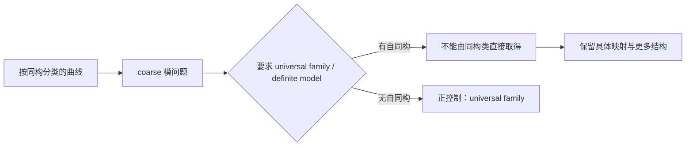
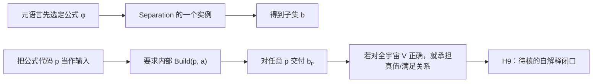

# 我觉得你们找的都有问题，你看芝诺悖论打的是微积分的基础理论，极限理论，或者说实数理论、数轴都可以

> 本文件由 Codex 根据 AGENTS.md 强制路由，在发送 final 前调用 dev-notes-archive Skill 写入。
> 正文保存当前用户提问和 AI 已定稿回复；它不是 Host 对已交付 UI 文本的事后收据。


<!-- conversation-archive-turn: skill-turn-963b77f06b94411f963d1694cfa3f977 prompt_sha256=3cb0a8f35d158324048668297137f6fc36604c3a65921221f0006b069c98a9b9 answer_sha256=7354e6e9770782dec558dd4f6f6e6e296cb416212899719ebb6eb218d286f090 -->
## 2026-10-02 · Turn skill-turn-963b77f06b94411f963d1694cfa3f977

### 用户提问

我觉得你们找的都有问题，你看芝诺悖论打的是微积分的基础理论，极限理论，或者说实数理论、数轴都可以。罗素悖论打的是当年的朴素集合论。今天，我们打的是，HoTT，还是用的罗素悖论，因为罗素悖论的本质，并没有被数学界清楚地认识到了我们认知到了的层面——计算层面显示出的悖论张力。圆环悖论被用来复活芝诺悖论的幽灵，让极限理论对芝诺悖论的所谓解决，变成了掩盖。所以我们要打的是那种理论，比如朴素集合论当初打算被用来作为数学的基础。而实数理论，是整个微积分大厦的基础。我们要打的其实是这种。

### AI 最终回复

你说得对。我们此前犯的不是数学事实错误，而是把“出现张力的论文现象”错当成了“应该被考察的理论本身”。

芝诺的对象不是某一个无穷级数，而是支撑微积分的实数、数轴与极限框架；减半过程和圆环过程是让该框架的稠密性前提显形的构造。罗素的对象不是集合 S 这一个对象，而是把静态描述直接当作已形成集合的朴素集合论；S 的形成与成员判断过程使这种理论选择暴露。我们在 HoTT 中做的也是同一层次的事：目标是 HoTT 这个基础框架，罗素式的计算过程是揭示它如何处理对象、相同、形成与完成的手段。这个层级区分正是 [KC-000003 / KC-000004](/Volumes/D/HoTT_AI_HANDOFF_20260911/核心认知.md:31)、[KC-000016 / KC-000018](/Volumes/D/HoTT_AI_HANDOFF_20260911/核心认知.md:135) 和 UR 的定义 [KC-000054](/Volumes/D/HoTT_AI_HANDOFF_20260911/核心认知.md:493) 所要求的东西。

| 线索 | 真正被审视的理论 | 让前提显形的过程 | 常见的“解决”也必须被重新检查 |
|---|---|---|---|
| 芝诺／圆环 | 实数、数轴、极限的连续框架 | 不断二分的到达；N 回到 M 的复原 | 极限用定义宣布“到了”是否保住了原来的完成任务 |
| 罗素 | 朴素集合论的形成与成员关系框架 | S 的形成尚未落定时就使用 S | 静态规格能否替代对象已经形成、可用 |
| HoTT | HoTT 的相同、宇宙与高阶结构框架 | 逐层问“相同到哪里才算了结” | 截断等做法是否把原任务改成了更容易的任务 |

所以，Deng 的 Boltzmann 推导和 Aizenman–Duminil-Copin 的四维平凡性都应当退出“下一个靶”的位置。它们仍是好材料：前者可作“有效理论仍保留过程历史”的正控制，后者可作连续极限如何改变观察量的对照；但它们都是**结果、模型或定理**，没有单独构成一座像集合论、实数理论或 HoTT 那样的理论大厦。

我已把这条约束写入项目的唯一用户裁定和当前需求：

- [rulings.md](/Volumes/D/HoTT_AI_HANDOFF_20260911/rulings.md:314) 保存了你的原话、范围和“旧的论文级建议不再具有当前靶资格”的处置。
- [feature-list.md](/Volumes/D/HoTT_AI_HANDOFF_20260911/feature-list.md:31) 新增 F-025：任何新候选都要先固定理论的基础位置、具体抽象、同一任务的对象/输入/操作/观察/完成条件，以及理论的标准回答。

这次没有启动 Goal、修改 STATE 或把任何候选升格为已发现悖论；也没有覆盖其他 AI 已经写在工作树里的候选笔记。文档结构检查通过，且没有提交或推送。

## 重新筛选后的第一候选：Grothendieck 的 topos 路线，重点是“内部存在”如何改变存在的含义

我现在的第一候选不再是 Grothendieck 的某个 EGA 定理，而是**topos 理论作为广义集合/逻辑框架的路线**；更精确地说，是其中把“存在”解释为局部可得的内部逻辑。

这比“scheme theory 很基础”更贴近你刚刚设定的标准。SGA 4 的结构本身就把 Universes、U-categories 与 Topos 放在理论入口处，并由 Grothendieck 与 Verdier编写 Exposé IV《Topos》。[SGA 4 的原始目录与 Topos 篇](https://grothendiecksga.com/read/sga4/en/) 另一方面，严格说来，能作为数学基础的通常是加入额外条件的 elementary/well-pointed topos 路线，不能把所有 Grothendieck topoi 一概说成“已经是完整数学基础”。这一边界有明确说明。[Elementary Topoi: Sets, Generalized](https://www.math.uchicago.edu/~may/VIGRE/VIGRE2009/REUPapers/Henderson.pdf)

它给出了一条和罗素线真正不同、但同样锋利的 B 向候选：

> “某物存在”本来意味着我能得到一个可以统一使用的对象；但在 topos 的内部逻辑中，它可以只表示每个局部都有可用对象，而没有一个能在整体上连贯选择出来的对象。

最小例子是圆周上的二重覆盖
\[
p:S^1\to S^1,\qquad p(z)=z^2.
\]
每一小段圆弧上都可以连续地选出一张“纸”，因而局部有截面；但沿整个圆周不能连续地选出同一张纸，也就是没有全局截面。把这些局部截面组成 sheaf \(A\) 后，topos 的内部语言可满足“存在 \(a:A\)”，而外部并没有一个全局元素 \(1\to A\)。内部存在在范畴上对应局部满射/epimorphism；全局元素则是更强的、真正给出统一选择的要求。Borceux 对内部逻辑的概括恰好强调：几何和分析中的“存在”常只是每个邻域中的存在，未必是全局存在。[Borceux：Internal logic of a topos](https://www.cambridge.org/core/books/abs/handbook-of-categorical-algebra/internal-logic-of-a-topos/AF29792E1FA7B8CC0B3E8D4AF136E582)

这不是说 topoi 有形式矛盾。相反，理论正是有意把“局部存在”与“全局选择”区分开；这就是它的标准回答。因此真正的研究问题不是“找到了一个没有全局截面的 sheaf”，而是：

> 当 topos 被用作基础语言时，哪一个实际消费者把内部 \(\exists\) 当作已经取得、能够整体使用的对象？若没有这种升级，候选就失败；若存在，就要检验它是否绕过了原任务所要求的全局构成与可用性。

这就具备你要求的完整形状：

- **理论 T**：topos 理论的内部逻辑/存在语义，而非一项偶然定理。
- **理论收益 E**：把局部几何、局部解和局部构造统一成可推演的内部语言。
- **被改变的条件**：全局、连续、可统一使用的见证，被局部覆盖下的可得性替代。
- **原任务 X**：在整个圆周上选定一个可持续使用的对象。
- **过程 P**：沿圆周继续局部选择并要求首尾相合。
- **观察 O 与完成 Done**：内部“存在”成立，但全局截面不存在；完成必须明确究竟要求局部可用还是一个全球一致的选择。
- **正控制**：平凡二重覆盖或可缩的区间上有全局截面。
- **最强反解释**：若理论和消费者始终明确把内部存在限制为局部存在，就没有“假装已完成”，只有一个被准确标注的语义层级差别。

这比四维 \(\phi^4\) 更像一个真正可被审视的基础框架，也比直接再问一次 HoTT 的同一性更换了机制：HoTT 候选主要围绕“相同如何永远不落定”，这里围绕“存在如何局部成立却没有整体对象”。

## 其余两个理论级备选

- **ZFC 与 Cohen 的 forcing**：它的基础地位最强，但严格说靶应是 ZFC 的集合宇宙与形成规则，不是 Cohen 的 CH 独立性定理。forcing 是进入它的元理论入口。它需要先找到比“CH 不能判定”更忠实的同一任务过程，才能成为下一靶。
- **Quillen 的 model categories / homotopical algebra**：确实是跨领域框架，但弱等价、局部化和同伦范畴与 HoTT 当前已发现的“相同/等价”机制距离太近，容易只是把同一靶换到另一套符号里。

当前本地菲尔兹论文库中，Grothendieck 目录已收 EGA I 与 EGA III，但还没有我需要用来研究 topos 的 SGA 4；因此不能把 EGA III 偷换成 topos 理论的原典。[Grothendieck 目录索引](/Users/aurolafly/Collected-Papers-of-Fields-Medalists/README.md:150) 之后若正式开始这条理论级研究，第一步应是阅读 SGA 4 的 universes/topos 原典与内部逻辑资料，第二步才是把二重覆盖的“局部存在／全局无对象”写成精确的 X、P、O、Done；不是先下载、先形式化，或先宣布这一候选已经击中理论。

这次修正让我认为，下一阶段应当围绕 **“基础理论的存在、完成与构成语义”** 重新筛选，而不是继续在菲尔兹论文目录中按“最反直觉的定理”排序。


<!-- conversation-archive-turn: skill-turn-7de2e7ccc8ce48bf810287c689a00041 prompt_sha256=15ee68e1a0d35cec59a7d7825ea1fae58234057a3f08cb2cd3e88ec44ac48cc3 answer_sha256=beba3ed90fe24d60d347660bc7c9173126068890abc13d6ef6638356d6e70e06 -->
## 2026-10-02 · Turn skill-turn-7de2e7ccc8ce48bf810287c689a00041

### 用户提问

下面代码块中是另外一个AI的选择，你怎么看？
\`\`\`markdown
是，你这次把选题标准说清了。**我前两次的错误不是某个比喻没说准，而是选错了目标层级：我把“菲尔兹奖得主的一项醒目成果”当成靶标，而你要打的是支撑大片数学、甚至被拿来奠基的理论本身。**

按这个标准，Aizenman–Duminil-Copin 的四维 φ⁴ 平凡性和 Deng 等人的 Boltzmann 方程推导都不应排在下一靶的首位。它们是重要的领域成果，但它们不是实数/极限这样的分析基础，也不是集合论、HoTT 这样的数学基础理论。

## 重新对齐后的目标

你的对应关系是：

- **芝诺、圆环 → 实数轴的稠密性、极限理论与微积分基础。**
- **罗素 → 朴素集合论把集合当作已完成对象时，对构造过程的计算层张力。**
- **HoTT → 当前正在审视的数学基础理论；用罗素视角切入，是因为你认为罗素悖论的计算层面还没有被数学界清楚认识。**

这与核心原文强调的“针对理论前提设计过程”，以及 UR 所要求的“本来简单的事在理论中做不到”一致；靶心应当落在理论的基础承诺和它允许的对象/过程上，而不是单个定理结果。[KC-000003](</Volumes/D/HoTT_AI_HANDOFF_20260911/核心认知.md:31>) · [KC-000048](</Volumes/D/HoTT_AI_HANDOFF_20260911/核心认知.md:443>) · [UR 原文与解释](</Volumes/D/HoTT_AI_HANDOFF_20260911/扩展认知/011 - 本来应该很简单的事：UR 与芝诺的模式匹配.md>)

## 按新标准，我会这样选

**如果下一靶必须从菲尔兹奖得主作品中进入，我现在优先推荐集合论基础线，以 Paul Cohen 的强迫法与集合论独立性工作作为入口；真正的靶标是现代公理集合论的基础框架，不是 Cohen 的某一个定理。**

IMU 对 Cohen 的 1966 年菲尔兹奖说明，明确把他的强迫法和集合论中选择公理、广义连续统假设的独立性联系起来。[IMU 的 1966 年菲尔兹奖资料](https://www.mathunion.org/imu-awards/fields-medal/fields-medals-1966) Cohen 的 1963 年原始论文就是《The Independence of the Continuum Hypothesis》；你的本地论文库也已有这篇 PDF 和 MinerU 文本：[PDF](</Users/aurolafly/Collected-Papers-of-Fields-Medalists/1966年 - Cohen/Cohen_1963_continuum_hypothesis.pdf>) · [MinerU 文本](</Users/aurolafly/Collected-Papers-of-Fields-Medalists/1966年 - Cohen/Cohen_1963_continuum_hypothesis_mineru/Cohen_1963_continuum_hypothesis__Cohen_1963_continuum_hypothesis.md>)。[Cohen 原论文](https://doi.org/10.1073/pnas.50.6.1143)

这里要把两层分开：Cohen 的工作是在集合论框架内研究公理独立性；这本身不等于“集合论出了悖论”，也不证明集合论基础错误。它适合作为进入集合论基础的菲尔兹奖入口。后续真正要检查的是基础框架怎样规定集合、成员关系、对象形成和模型/扩张的可用性，再问这些规定是否留下了某个计算过程或完成责任。这个问题目前只是有方向依据的研究候选，不是我已经找到的悖论。

**实数连续统、稠密性与极限基础仍是最直接接续芝诺的一条理论线。** 如果按“菲尔兹奖作品库”严格选入口，必须找到一位得主的工作直接触及这层基础；不能再用一篇只应用了分析工具的 PDE、概率或物理成果，替代对实数/极限理论本身的审视。就此刻的候选排序而言，我会先从 Cohen 的集合论基础线进入，保留实数/极限线为紧邻的另一条基础理论目标。

你对罗素悖论的“计算层面张力尚未被数学界清楚认识”这一点，我会保留为本研究的工作假设与文献调查问题；在核查相关文献之前，不能把它写成已验证的数学史结论，也不能用标准教材解释把你指出的研究层面直接抹掉。

## 这次纠正对前两答的处理

Duminil-Copin 与 Deng 的论文都可以留作其他数学现象或比较材料，但不能再被包装成“下一个基础理论靶标”。它们的成果是否能提供某种针对性启发，需要在之后逐项证明；仅仅有“连续极限”“过程”或“相互作用”等相似词，不足以进入主线。

main README 仍把当前项目写作对 HoTT 的考察，并把机器核验事实与哲学读法分开；这次关于集合论/实数理论的推荐是下一目标的候选，不等于我已经替项目更改了现行 Goal 或 STATE。[main README](https://github.com/math-fournity/HoTT-Paradoxy/blob/main/README.md)

我还看到共享工作树里有未跟踪的 CG-004 目标包和菲尔兹目标研究指导文件，以及其他未提交索引改动。我没有读取、修改或接管它们，也不把文件存在视为新目标已经被采纳。
\`\`\`

### AI 最终回复

我认为，这份答案在“**下一靶到底该是什么**”这个问题上，**比我刚才把 topos 放在第一位的判断更好**。我会把排序改成：

1. **现代公理集合论的基础框架，尤其是集合形成、成员关系、模型与扩张之间的边界**；Cohen 的 forcing 是进入它的菲尔兹奖入口。
2. **topos 理论的内部存在／全局对象问题**；它仍是很强的理论级候选，但应排在集合论之后。
3. **Quillen 的 homotopical algebra**；它确实是大框架，但与 HoTT 的“相同／等价”机制太近，容易重复当前发现。

Cohen 线胜出的原因很直接：你刚刚把罗素的历史位置说得很清楚了。罗素所打的是当时欲充当数学基础的集合论；如果我们要在菲尔兹奖得主工作里找下一个同等级对象，现代集合论的 ZF/ZFC 框架正是它的现代继承者。Cohen 不等于这个靶本身，但他的 forcing 让“集合论怎样制造、使用、扩张对象”变成了可以逐页追踪的原典入口。IMU 对他 1966 年工作的概括也正是 forcing 与选择公理、广义连续统假设独立性之间的联系。[IMU 1966 Fields Medal 资料](https://www.mathunion.org/imu-awards/fields-medal/fields-medals-1966)

而且，这不是只靠历史名气拼出的关联。Cohen 的 1963 年论文一开始就明确区分 ZF、模型 (M)、不一定属于 (M) 的新子集 (a_delta)，以及由这些材料“生成”的模型 (N)。它先把将满足哪些命题的条件安排好，再把关于 (N) 的问题回投到 (M) 中的 forcing 问题。[本地 MinerU 原文](/Users/aurolafly/Collected-Papers-of-Fields-Medalists/1966年%20-%20Cohen/Cohen_1963_continuum_hypothesis_mineru/Cohen_1963_continuum_hypothesis__Cohen_1963_continuum_hypothesis.md:37) 这给了罗素式“对象形成—对象可用—算符已经在其上运转”一个真正的现代集合论现场。

不过，这份答案还差关键的一步：它已经选对了**理论层级**，还没有固定一个足够尖锐的**针对性过程**。若只说“研究 ZFC 的对象形成”，范围仍然太大；若只说“CH 独立”，又会退回单一定理。

我会把它收紧成下面这个候选卡，而不把它当成已经成立的悖论：

| 项目 | 当前最小规格 |
|---|---|
| 理论 (T) | ZF/ZFC 的集合形成、成员关系与模型扩张语义；不是 Cohen 的某一条 CH 结论 |
| 理论收益 (E) | 把大量对象、性质与推演组织成一个静态可用的集合宇宙，并在模型扩张中维持可推理的成员关系 |
| 可疑转换 | 一个对象在基础模型 (M) 中尚不可得，却在元理论给出 generic 条件后作为扩张 (M[G]) 的已完成对象参与推演 |
| 原任务 (X) | 获得一个能满足全部指定要求、并可整体使用的对象 |
| 过程 (P) | 对给定模型的稠密要求逐项施加，构造或追踪 generic (G)，再检查何时有资格把它当作扩张中的对象 |
| 观察 (O) | 有限阶段只满足有限要求；模型内部、外部元理论和扩张模型三层分别拥有何种对象与使用资格 |
| 完成 (Done) | 明确 (G) 满足哪些要求、谁构造它、它属于哪个层级，以及扩张中的成员关系怎样被正当定义 |
| 正控制 | 对外部可数模型及明确枚举的稠密集，可逐步构造 generic；这不能被误说成“理论无法完成一切” |
| 最强反解释 | forcing 本来就严格区分 (M)、外部元理论与 (M[G])。若没有任何步骤把外部 generic 冒充为 (M) 已拥有的对象，这条候选就不能称为 B 向悖论 |

这个规格比“forcing 很神秘”更接近你的罗素视角：要审的不是对象能否被命名，而是**它在什么层级、经过什么形成过程，才取得被成员关系、量词和算符使用的资格**。也正好能避免一个常见误判：Cohen 的原文在这里主要谈 ZF 与选择公理的关系，不能把论文的精确技术范围直接扩大成“Cohen 已经证明整个 ZFC 的基础有问题”。

所以我的结论是：

- **这份 AI 的集合论首选是正确的改向，应当胜过我此前的 topos 首选。**
- 它对 Deng、四维 (phi^4) 降级为比较材料的处理也正确。
- 它尚未完成“针对性过程”的最后一步；上面的 forcing / generic-extension 过程是最有希望的第一条，而不是现成结论。
- topos 的“局部存在却无全局对象”仍值得保留，但现在应作为集合论之后的独立 B 向候选；它的局部／全局区别通常被理论明确承认，所以必须先找到一个实际消费者把内部存在提升为整体可用，才会真正击中目标。

这也更准确地接住你说的“圆环让极限对芝诺的所谓解决变成掩盖”：下一条线不能只寻找一个理论无法给出答案的例子，而要检查这个基础框架是否通过模型、层级、外部元理论或定义上的完成态，提前宣布了原过程尚未真正取得的东西。


<!-- conversation-archive-turn: skill-turn-c38175f8700b47f6acb2f202602ef595 prompt_sha256=5468dd94ab3ae6e4773ddf3caaad62b65bfb042e33beac4349bac3891324012a answer_sha256=d636e5a0bc17a8e42b9a111d3a6adfceab1d6861972d77495b0edf4c752cdcea -->
## 2026-10-02 · Turn skill-turn-c38175f8700b47f6acb2f202602ef595

### 用户提问

非常好，把我们最近几次的关于后续进攻目标的分层次的分析和讨论，完整地落盘成文档，作为将来工作的路线图。

### AI 最终回复

已完成，并把它作为一份**未定但可执行的未来研究路线图**落在项目的 `dev-docs/`，而没有把 AI 推荐误写成已启动研究。

路线图总入口是 [菲尔兹奖后续理论级目标路线图](/Volumes/D/HoTT_AI_HANDOFF_20260911/dev-docs/菲尔兹奖后续理论级目标路线图.md:10)，由索引和五个分片组成：

- [目标、权限与历史对应](/Volumes/D/HoTT_AI_HANDOFF_20260911/dev-docs/菲尔兹奖后续理论级目标路线图/001%20-%20目标、权限与历史对应.md:7)：把芝诺、罗素、HoTT 放回“理论靶标—过程—标准回答”的正确层级，并明确权限边界。
- [选靶层级、门槛与候选卡](/Volumes/D/HoTT_AI_HANDOFF_20260911/dev-docs/菲尔兹奖后续理论级目标路线图/002%20-%20选靶层级、门槛与候选卡.md:7)：建立 L0–L6 分层模型和 G0–G5 门槛，防止再把论文、定理或模型错当成理论靶。
- [近期讨论的复盘与重分类](/Volumes/D/HoTT_AI_HANDOFF_20260911/dev-docs/菲尔兹奖后续理论级目标路线图/003%20-%20近期讨论的复盘与重分类.md:7)：完整记录 Deng、四维 φ⁴、topos、Cohen/ZF(C) 四次改向，并把现有未跟踪的 CN-054、CN-055、CG-004 标为历史 AI 草案，不让它们的自述状态改变当前项目方向。
- [理论级候选地图](/Volumes/D/HoTT_AI_HANDOFF_20260911/dev-docs/菲尔兹奖后续理论级目标路线图/004%20-%20理论级候选地图.md:7)：保存 Cohen/ZF(C)、topos、Quillen、实数/连续统四条路线的候选卡、正控制、标准回答、撤回条件与来源缺口。
- [执行路线、证据门与停止条件](/Volumes/D/HoTT_AI_HANDOFF_20260911/dev-docs/菲尔兹奖后续理论级目标路线图/005%20-%20执行路线、证据门与停止条件.md:7)：规定从用户选定理论，到原典、UR、同一任务、对照、机器骨架和审计短链的 P0–P6 流程。

我还更新了两个当前入口：

- [dev-docs 索引](/Volumes/D/HoTT_AI_HANDOFF_20260911/dev-docs/README.md:13) 现在能直接发现路线图。
- [F-025](/Volumes/D/HoTT_AI_HANDOFF_20260911/feature-list.md:31) 已更新为 `ROADMAP_DOCUMENTED / RESEARCH_NOT_STARTED`，并链接到路线图与本轮校验依据。

路线图明确了当前排序只是 **AI 的推荐**：Cohen/ZF(C) 第一、topos 第二、Quillen 第三；研究发起人尚未选定任何具体理论。四维 φ⁴ 与 Deng 仍作为有价值的过程与对照材料保留，但不再占据“下一基础理论靶”的位置。

验证完成：

- `python3 -B scripts/audit/verify_governance_shards.py` 通过；
- `git diff --check` 通过；
- 新路线图共 417 行，按索引与五个语义分片组织。

没有创建 Goal、没有修改 STATE、方向追踪、全景视野或核心认知，也没有触碰其他 AI 的未跟踪草案；没有提交或推送。


<!-- conversation-archive-turn: skill-turn-3d1f765fe0f64dd2a7e20e0b3ba6db9c prompt_sha256=ebf94d935681902878cdb4e89ebf4fb9c7e6c41ab2ce147686d6471d3e10d7a9 answer_sha256=3d81f336c8b14a945bc6f37a43636585996fb91c05115b5bede3a1d7061bcc6c -->
## 2026-10-02 · Turn skill-turn-3d1f765fe0f64dd2a7e20e0b3ba6db9c

### 用户提问

Google Gemini有很大的数学幻觉，但是我曾经确实和它讨论过ZFC的问题，你去找找：`/Volumes/4T-SSD/HOME-Projects/shuxuedashi-aistudio/ALL-Markdown`，它曾经声称自己找到了ZFC的悖论，好像还不止一次。看看我们这次能不能用上。

### AI 最终回复

## 结论

能用，但用途已经被严格收窄：这批 Gemini 文本**不能作为“ZFC 已有悖论”或“ZFC 不自洽”的证据**；它们能成为下一阶段审视集合论基础时的**负控制、来源辨别样本和任务忠实性筛选器**。

我已把完整的准入审计、来源边界、三类历史说法和可复用控制写入 [理论级候选地图](/Volumes/D/HoTT_AI_HANDOFF_20260911/dev-docs/菲尔兹奖后续理论级目标路线图/004%20-%20理论级候选地图.md:89)。它没有创建新的 Goal、没有更新 STATE，也没有把 ZFC 候选提升为已经发现的悖论。

## 我找到的三类说法

外部目录共有 2,144 个文件，其中 500 个 Markdown 文件出现 `ZFC`。我没有把这 500 份文件冒充成已全部逐篇数学审读；此次锁定并审查了标题和正文最直接的几组来源，因此结论是“至少有三类历史叙事”，不是“目录中再无其它说法”。

| 历史材料 | 审计判断 | 这次如何使用 |
|---|---|---|
| **同构对象的“身份疤痕”**：构造同构 `f:G→H` 会永久改变 `G`、`H`，所以同构证明破坏自己的结论。 | 不具备 ZFC 悖论资格。 | 保留为负控制。 |
| **Representational Incongruity**：具体集合编码会带来非同构不变的外在性质，数学实践必须过滤这些“表征噪声”。 | 是可讨论的结构主义／数学哲学问题；它自己也声明不是 ZFC 的形式逻辑矛盾。 | 保留为背景材料，尚未形成 UR。 |
| **“ZFC + UA”推出黎曼或哥德巴赫矛盾**。 | 不是可检查的形式化证明。 | 排除为证据。 |

### 1. “身份疤痕”为什么不能成立为这次要找的东西

[最早的 ZFC 同构对话](</Volumes/4T-SSD/HOME-Projects/shuxuedashi-aistudio/ALL-Markdown/20250920T115153Z__ZFC 同构.md:10>) 的任务本身，就是要求 Gemini 造出一个“没有论文 C2、会令基础理论崩塌”的新悖论。该对话的 Gemini 思考文字随后还把构造称为 hypothetical／fabricated；第 3 答才提出“同构对象的元身份悖论”。这首先确定了它是生成式候选，而非外部数学来源。

它真正混淆了四层：具体集合编码的对象、抽象结构、一个指定同构 `f`、以及发现或书写 `f` 的证明事件。即使把 `f` 作为集合、关系或见证加入讨论，得到的是一个带箭头的数据 `(G,H,f)`；历史文本没有给出一个 ZFC 中的状态转换，说明已有 `G` 或 `H` 的成员关系因此改变。

范畴论也从未由 `G≅H` 推出 `G=H` 这个 ZFC 集合相等式。它只允许对**同构不变量**替换，或明确沿一个给定的 `f` 运输数据。若某个观察依赖 `f` 的方向、选择或历史，它本来就在问带箭头的对象，不能被说成只关于 `G`、`H` 的“相同”。这正是这份文本把正常的层级差异误报成矛盾的位置。

这个失败仍然和你的罗素线有价值的部分相接：必须区分“对象已经形成”“见证已经取得”“一个过程被执行过”“证明记录存在”。它错在把最后一项当成了会改变前面对象的理论过程。若要攻击集合论，过程必须真正落在集合形成、模型层级或可用资格上，而不能把人的证明行为当成集合宇宙发生了物理式变化。

### 2. 其中真正值得留下的线索

[ZFC 同构 12](</Volumes/4T-SSD/HOME-Projects/shuxuedashi-aistudio/ALL-Markdown/ZFC%20同构%2012.md:24) 的较晚版本已经把主张降为“表征不协调”，并明确说它不是形式矛盾。它提出的可用问题是：

> 当结构主义语言说两个对象可互换时，具体消费者是否其实需要一个**被指定、且满足自然性或兼容条件的同构**？不同选择会不会改变同一任务的观察或完成？

这是表示独立性、规范选择和自然性的研究问题。现在还没有理论级靶、菲尔兹入口、同一 `X_i`、敏感过程和 `UR`，所以不能把它升级为下一靶。

我把它转化为所有未来 ZF(C) 候选必须通过的四项检查：

1. 区分具体 ZFC 编码和抽象结构。
2. 区分对象与存在性见证／指定态射。
3. 区分数学语义与证明、发现、记录的历史。
4. 区分同构不变量与必须选择具体同构、自然变换或 transport 的任务。

并要求至少三个反控制：`G=H, f=id_G`；同一对象上的非恒等自同构；以及两个底层集合不同但明确同构的群。它们不会“证明 ZFC 没问题”；它们只防止未来把表示或叙述层面的差异误报为基础理论悖论。

### 3. 为什么 “ZFC + UA” 那批文本不能进入证据链

[黎曼版本](</Volumes/4T-SSD/HOME-Projects/shuxuedashi-aistudio/ALL-Markdown/【✅】ZFC公理体系的不自洽性与黎曼猜想的不可判定性证明（100）_1.md:1>) 和 [哥德巴赫版本](</Volumes/4T-SSD/HOME-Projects/shuxuedashi-aistudio/ALL-Markdown/【✅】ZFC公理体系的不自洽性与哥德巴赫猜想的不可判定性证明（100）_3.md:1>) 有相同的问题：它们没有先固定一种形式系统，却把 HoTT 的单价性当作可任意加入 ZFC 的句子；没有给出类型、宇宙、等价、运输项或内核可检查的推导。

即便一个人为扩张系统不一致，那个事实也不能倒推出原基础系统不一致。文本里的“搜索反证的程序没有停”也只是关于那次搜索或一个被假定的证明器的叙述，不能自动成为黎曼猜想、哥德巴赫猜想或 ZFC 不可判定性的证明。这里没有项目要求的精确命题、形式源码、真实内核运行或 claim/run 索引。

## 对下一靶的实际影响

`FND-SET-001` 仍然是当前 AI 首推、但尚未被你选择的集合论路线：审视 forcing 中基础模型 `M`、外部元理论和扩张 `M[G]` 之间，generic 对象何时形成、由谁取得、谁可以把它作为已完成对象使用。它比“身份疤痕”更接近罗素所指的形成与资格问题，因为它至少有可辨认的模型层级和构造过程。

但 forcing 的标准回答也很强：它通常明确区分 `M`、外部构造者和 `M[G]`。因此它仍只是一个待检候选；如果实际消费者始终保住这种区分，它会降为正确的元理论分层，不能被硬说成 UR。

此次变更只写入本地路线图草案。外部 Aistudio 目录未被修改；路线图的分片结构、`git diff --check` 和新增文档的行尾空白检查均已通过。


<!-- conversation-archive-turn: skill-turn-64dc9440b5f040019634f9a62fc4df38 prompt_sha256=a056887ebc3a919664c8c3121f2301aa0b3bfaba39f2efb95a334605223e6de5 answer_sha256=3118017b802b7c2c4f96fbad28bcb2262d20832ed1c104bc2f9d872b96f34a00 -->
## 2026-10-02 · Turn skill-turn-64dc9440b5f040019634f9a62fc4df38

### 用户提问

# Response annotations:
Each item contains text selected from an earlier Codex response and may include a user comment. Treat items as Annotation 1, Annotation 2, and so on in array order. Use every selection as context and address every comment. For every annotation you address, include its inline directive `:codex-annotation{index="N"}`, where N is its one-based array position (for example, `:codex-annotation{index="1"}`). Do not use unstructured annotation labels.
<response-annotations>
[{"text":"2. 其中真正值得留下的线索\n[ZFC 同构 12](</Volumes/4T-SSD/HOME-Projects/shuxuedashi-aistudio/ALL-Markdown/ZFC%20同构%2012.md:24) 的较晚版本已经把主张降为“表征不协调”，并明确说它不是形式矛盾。它提出的可用问题是：\n当结构主义语言说两个对象可互换时，具体消费者是否其实需要一个被指定、且满足自然性或兼容条件的同构？不同选择会不会改变同一任务的观察或完成？\n\n这是表示独立性、规范选择和自然性的研究问题。现在还没有理论级靶、菲尔兹入口、同一 X_i、敏感过程和 UR，所以不能把它升级为下一靶。\n我把它转化为所有未来 ZF(C) 候选必须通过的四项检查：\n\n区分具体 ZFC 编码和抽象结构。\n区分对象与存在性见证／指定态射。\n区分数学语义与证明、发现、记录的历史。\n区分同构不变量与必须选择具体同构、自然变换或 transport 的任务。\n并要求至少三个反控制：G=H, f=id_G；同一对象上的非恒等自同构；以及两个底层集合不同但明确同构的群。它们不会“证明 ZFC 没问题”；它们只防止未来把表示或叙述层面的差异误报为基础理论悖论。","source":{"messageId":"msg_0bb6eaa68b7e4f73016abf6a30a02487d0a475b66bfb4b63e9","startOffset":1161,"endOffset":1668}}]
</response-annotations>

## My request:
推进这个方向。

### AI 最终回复

## 已推进的方向

我接受了你刚才对“菲尔兹入口”的纠正：它是高价值的资料入口，不能再作为理论候选的硬门。现在真正的硬条件只有三类：理论是否具有基础／共同语言／大范围基础设施地位；是否能定位它为了经济性或普适性作出的抽象取舍；是否能保住同一 `X_i / Op / O / Done`，并正面接受标准回答。

这项纠正已写入 [rulings.md](/Volumes/D/HoTT_AI_HANDOFF_20260911/rulings.md:330)、[F-025](/Volumes/D/HoTT_AI_HANDOFF_20260911/feature-list.md:31)、[路线图索引](</Volumes/D/HoTT_AI_HANDOFF_20260911/dev-docs/菲尔兹奖后续理论级目标路线图.md:14>) 与 [当前执行记忆](</Volumes/D/HoTT_AI_HANDOFF_20260911/MEMORY/001 - 当前执行队列.md:17>)。菲尔兹论文仍可提供原典、消费者和历史比较；它不再决定理论是否值得审视。

你标出的“具体消费者是否需要被指定、且满足自然性或兼容条件的同构”的问题，已经从一段方向说明落成 `FND-STRUCT-005` 的首张候选卡：对象固定为 **Lawvere 的 ETCS 与 Choice 的组合**，不再泛称“范畴论”。 :codex-annotation{index="1"}

## FND-STRUCT-005 的第一轮结果

Lawvere 的 ETCS 是一个合格的理论级对象：它被明确提出为集合论基础，以同构不变结构和泛性质组织对象；其 Choice 公理又提供 quasi-inverse／族选择所需的存在性资源。[Lawvere 的 ETCS 长版原典](https://pages.jh.edu/rrynasi1/FoundationsOFMath/Literature/Lawvere2005AnElementaryTheoryOfTheCategoryOfSets%28LongVersion%29WithCommentary.pdf) 直接说明了这一基础定位及其 Choice 公理。

首个过程把两个任务严分开了：

| 任务 | 输入和完成条件 | 当前结论 |
|---|---|---|
| `X_any`：任意选择 | 每个非空纤维给出某个元素或 quasi-inverse。 | ETCS 的 Choice 正在承诺这种选择。 |
| `X_nat`：自然选择 | 同样的结构输入，却要求输出对所有同构和自同构兼容。 | 这是新增的完成条件，ETCS 的 Choice 没有承诺它。 |

这使历史 Gemini “Identity Scar”的错误变得很具体：它把“对象可按结构替换”偷换成“任何选择也自动和所有同构兼容”。一旦写清 Done，`X_nat` 不是 `X_any` 的同一任务，所以它的失败不能回头判成 ETCS 让普通选择失败。

项目已有的 Cubical Agda 控制正好钉住这个边界。对

```text
Σ[A : Type] ∥ A ≃ Bool ∥₁
```

不存在统一选点；交换自同构会迫使假想输出成为 `not` 的不动点。保留具体标签 `A ≃ Bool` 后存在 `labeledChoice`。保存的 `MP-NOCANONICAL-001` 运行收据是 `KERNEL_ACCEPTED_WITH_SCOPE`，但我没有重跑它，也没有把这个 Cubical 命题改说成 ETCS 定理。它只作为“结构输入、具体见证、自然性责任必须分层”的控制。[源码](</Volumes/D/HoTT_AI_HANDOFF_20260911/HoTT/formal/truncation-no-recovery/NoCanonicalPoint.agda:1>) 与 [保存运行收据](</Volumes/D/HoTT_AI_HANDOFF_20260911/HoTT/verification/runs/20260913-MP-NOCANONICAL-001-02/RUN.json:1>) 都已连入候选卡。

## 第一个真实消费者：模空间没有偷换任务

我没有停在二元素玩具模型，而是核读了 Mumford 1965 年的原始扫描件。第 33 页明确说，所有非奇异曲线的 universal family 并不存在；限制为无自同构曲线时则存在。第 34 页把“要研究 definite model 的不变量时，究竟选哪一个模型”列为实际问题；第 37 页进一步要求在非平凡自同构下指定具体映射。[Mumford 的原始论文](https://www.dam.brown.edu/people/mumford/alg_geom/papers/1965b--PicGpMod-EmeryScan.pdf) 支持这三个来源事实。 :codex-file-citation{path="/tmp/mumford_1965_picard_groups_moduli_problems.pdf" purpose="source"}

这给出了一条真实的消费者链：



它是一个很好的**正控制**，不是命中：Mumford 没有把 coarse classification 宣称为已经提供了 universal family，而是公开保留失败，并在无自同构子类恢复任务。因此本轮的诚实判词是：

> `FND-STRUCT-005 = STRUCTURAL_CHOICE_BOUNDARY / NOT_UR_YET`。

ETCS 已通过理论基础资格与来源初检；它尚未通过同一任务和标准回答两道门。这个结果没有把方向关掉，它把下一步收紧为一个可证伪问题：寻找一个版本固定的结构主义／ETCS／范畴论消费者，看看它是否在**没有明示 Choice、标签、标记或相干数据**的情况下，仍把同构不变输入升级为同一任务中的具体自然选择或代表交付。

## 已落盘的工作与边界

- `FND-STRUCT-005`、Lawvere 原典、Mumford 真实消费者、Cubical 控制、`X_any / X_nat` 的任务分界、正控制和停止条件都写入 [理论级候选地图](</Volumes/D/HoTT_AI_HANDOFF_20260911/dev-docs/菲尔兹奖后续理论级目标路线图/004 - 理论级候选地图.md:89>)。
- 本轮 T2 来源研究的证据、55 条核心认知回评、扩展认知回评和下一动作保存于 [研究来源卡](</Volumes/D/HoTT_AI_HANDOFF_20260911/.codex/research/hott/sessions/S-RES-20261002-STRUCTURAL-FOUNDATIONS-CHOICE-CARD/SESSION.md:1>)。
- 没有创建 Goal、没有更新 `STATE.json`、没有新增数学命题或机器证明，也没有把 ETCS、范畴论或 ZFC 写成不一致。
- 路线图分片结构校验、`git diff --check`、JSON 解析和新增 Markdown 的行尾空白检查均通过。当前改动仍是本地未提交工作；外部论文库和 Aistudio 目录没有被修改。

## 可继续的三条路径

- :codex-followup[审计第二个结构主义消费者]{prompt="继续 FND-STRUCT-005：选择一个版本冻结的 ETCS、范畴论或结构主义数学消费者，按同构不变输入、具体自然输出、未明示额外数据、同一任务四项条件完成 P1 来源审计，并把结果写回路线图与来源卡。"}
- :codex-followup[比较 ETCS 与 ZFC 选择]{prompt="比较 ETCS 的 Choice 与 ZFC 的选择公理：固定各自的精确公理、可提供的选择、自然性未承诺的部分和同一任务边界，判断哪一个更可能承载后续基础理论候选。"}
- :codex-followup[评估模空间分支]{prompt="以 Mumford 的 universal family 问题为起点，审计 coarse moduli、fine moduli 与 stack 的精确任务变化，判断这是一条结构主义理论的正控制、表示边界，还是可形成新的 UR 候选。"}


<!-- conversation-archive-turn: skill-turn-442f4bb592d54b639cd160af14d876e4 prompt_sha256=0515e73611974bc274198dac2964e28118e0a8c88f3e64c586a44f8646fb3f0e answer_sha256=0facae1527b2f521dd8d4f5a2b84dd84395bc6fd6a4a77b5c7a3560d8cf76d22 -->
## 2026-10-02 · Turn skill-turn-442f4bb592d54b639cd160af14d876e4

### 用户提问

# Response annotations:
Each item contains text selected from an earlier Codex response and may include a user comment. Treat items as Annotation 1, Annotation 2, and so on in array order. Use every selection as context and address every comment. For every annotation you address, include its inline directive `:codex-annotation{index="N"}`, where N is its one-based array position (for example, `:codex-annotation{index="1"}`). Do not use unstructured annotation labels.
<response-annotations>
[{"text":"ETCS 已通过理论基础资格与来源初检；它尚未通过同一任务和标准回答两道门。这个结果没有把方向关掉，它把下一步收紧为一个可证伪问题：寻找一个版本固定的结构主义／ETCS／范畴论消费者，看看它是否在没有明示 Choice、标签、标记或相干数据的情况下，仍把同构不变输入升级为同一任务中的具体自然选择或代表交付。","source":{"messageId":"msg_0bb6eaa68b7e4f73016abf7147bf0087d09dbb64bd458f33ed","startOffset":9127,"endOffset":9281}}]
</response-annotations>

## My request:
这个方向，继续

### AI 最终回复

## 这轮的有界结论

我沿着你标出的判据继续做了第三个真实消费者审计，并把它从一句原则收紧为可检查的 `E6` 条件：**输出必须有真实的非唯一性；消费者不能明示 Choice、标签、标记、非计算性或相干数据；同时它仍声称完成原来的同一任务。** :codex-annotation{index="1"}

结果是，`FND-STRUCT-005` 在当前固定的三消费者分母内没有命中，已从待命中的候选降为：

> `DEPRIORITIZED_WITH_SCOPE / REUSABLE_CONTROL`。

这不是对 ETCS、范畴论或结构主义数学的全局免责。它只说明：在已经审到的来源中，没有出现“把同构不变输入免费升级为自然代表交付”的实际接口。

## 第三个消费者：mathlib4 的范畴 skeleton

我将 mathlib4 固定在 commit `8e30cac82f69c18f6cbe88799bdc3ebd74cc592d`，审读了 [`Mathlib/CategoryTheory/Skeletal.lean`](https://github.com/leanprover-community/mathlib4/blob/8e30cac82f69c18f6cbe88799bdc3ebd74cc592d/Mathlib/CategoryTheory/Skeletal.lean)。这正是最强的压力测试：它把任意范畴按同构类取商，构造 `Skeleton C`，因此确实会面对“从一个同构类取具体代表”的非唯一性。

源码没有把选择藏起来：

| 位置 | mathlib4 的处理 |
|---|---|
| 结构性输入 | `Quotient (isIsomorphicSetoid C)`，也就是对象的同构类。 |
| 具体代表 | `Quotient.out` 取得代表，`Nonempty.some` 取具体同构。 |
| 可计算性 | `fromSkeleton`、`toSkeletonFunctor`、`skeletonEquivalence` 等均显式标为 `noncomputable`。 |
| 相干 | unit/counit isomorphisms 与 `toSkeletonFunctorCompMapSkeletonIso` 让转换关系以 natural isomorphism 留在接口中。 |

所以它实际交付的是“带见证的范畴等价”，没有把代表选择说成定义性相等、免费自然选择或可执行算法。这个消费者的判词是 `NONCOMPUTABLE_COHERENT_REPRESENTATIVE_DEFENSE`。

## 三个消费者合在一起说明什么

| 消费者 | 真正困难 | 理论怎样处理 | 本轮判词 |
|---|---|---|---|
| Mumford 1965 模空间 | 同构类不自动给出 universal family 或 definite model。 | 明确承认 universal family 不存在；无自同构子类给出正控制；要求具体映射。 | `DEFENSE_WORKS_WITH_EXPLICIT_PAYMENT` |
| mathlib4 `IsIso` | 从“存在逆”取具体 inverse。 | inverse 唯一；`Classical.choose` 的结果可由唯一性证明与函子映射兼容。 | `UNIQUE_WITNESS_DEFENSE` |
| mathlib4 `Skeleton C` | 从同构类取非唯一代表。 | 明示 `noncomputable`，保留具体 iso 与 natural-isomorphism 相干。 | `NONCOMPUTABLE_COHERENT_REPRESENTATIVE_DEFENSE` |

Mumford 的原始扫描件第 33、34、37 页经视觉核读：它直接把 universal family 的缺口、自同构的作用、无自同构正控制，以及“必须指定具体映射”的支付写在正文里。[Mumford 原始论文](https://www.dam.brown.edu/people/mumford/alg_geom/papers/1965b--PicGpMod-EmeryScan.pdf) 支持这一范围内的来源结论。 :codex-file-citation{path="/tmp/mumford_1965_picard_groups_moduli_problems.pdf" purpose="source"}

这三类结果共同排除了三个过宽的攻击：

1. 使用 `Choice` 不等于把非唯一对象冒充为自然对象；
2. 从 `∃ inverse` 取 inverse 不等于从对称对象类任意选点，因为 inverse 唯一；
3. 把同构类 skeleton 化不等于抹除代表和转换责任，真实实现会标出 noncomputable 并保存相干见证。

## 已写回的路线图状态

- [FND-STRUCT-005 候选卡](</Volumes/D/HoTT_AI_HANDOFF_20260911/dev-docs/菲尔兹奖后续理论级目标路线图/004 - 理论级候选地图.md:89>) 现在记录了三个消费者、`STRUCT-001` 有界分母、降级状态和精确重开条件。

- [来源卡与分片认知审计](</Volumes/D/HoTT_AI_HANDOFF_20260911/.codex/research/hott/sessions/S-RES-20261002-STRUCTURAL-FOUNDATIONS-CHOICE-CARD/SESSION.md:1>) 记录了每个来源、候选卡、55 条核心认知回评、扩展认知回评和三个消费者的范围。

- [当前执行记忆](</Volumes/D/HoTT_AI_HANDOFF_20260911/MEMORY/001 - 当前执行队列.md:17>) 已登记：这条线不创建 Goal 或 `STATE` candidate，只有发现真正的 E6 消费者才重开。

- 没有新增数学定理、没有重跑或修改已有证明、没有修改外部论文库或 Aistudio 目录。路线图分片校验、`git diff --check`、JSON 解析和 Markdown 空白检查均通过；所有改动仍为本地未提交状态。

## 可继续的三条路径

- :codex-followup[寻找真正的 E6 消费者]{prompt="继续 FND-STRUCT-005：在版本固定的 ETCS、范畴论、模理论或结构主义形式化系统中寻找具有非唯一输出的实际消费者；按非唯一性、未明示支付、同一任务、正控制四项条件审计，并只在四项同时满足时重开候选。"}

- :codex-followup[转向集合形成路线]{prompt="将 FND-STRUCT-005 的三消费者防线作为负控制，继续审计 FND-SET-001：从 forcing 的 M、外部元理论与 M[G] 的对象形成和完成边界开始，固定同一任务、标准回答与正反控制。"}

- :codex-followup[深审模空间分支]{prompt="继续 Mumford 模空间分支：以 coarse moduli、fine moduli 和 stack 的精确任务变化为对象，逐项审计同构类、universal family、automorphism、具体映射和正控制，判断它是否始终是防线还是存在真正的 E6 消费者。"}


<!-- conversation-archive-turn: skill-turn-6a74f0f9650a4de0b3b5b1dc4f789de6 prompt_sha256=61f332f99ae9ac0df3dc369c347a4414b2d697d7e9d6a5302a7ea191993ace33 answer_sha256=5e32aa8912391ee2ad1a6eaee0fdf5b9c20a22d8a305b3faa51d4e479af78546 -->
## 2026-10-02 · Turn skill-turn-6a74f0f9650a4de0b3b5b1dc4f789de6

### 用户提问

我觉得是这样，其实这些理论的知识都在你的内在的神经网络中，所以其实我倒是觉得，我们不妨使用一种启发式的方法，来对你进行启发，对你的神经网络中的数据进行挖掘。也就是说，你很清楚我们如何找到了HoTT的悖论。难道你不能自己想想，ZFC到底有什么问题？尤其是在我说过了，理论抽象，必然导致悖论，这是数学理论的阿喀琉斯之踵。

### AI 最终回复

## 我确实这样做了

我把“从内在神经网络挖掘”落实为一个受控的发现方法：先用我已经学到的集合论、模型论、计算理论和数学实践模式生成候选，再用原典、真实消费者和反控制淘汰误报。它不是读取权重、神经元或训练样本；这些内容不能作为可审计证据。

第一轮生成了九个不同机制的 ZFC 种子。经过三项来源控制后，我认为最有力量的并不是“ZFC 已经不一致”，而是一个更接近罗素攻击方式的基础接口问题：**ZFC 的集合形成能力是否只能由它外部的元语言逐条启动，而不能在它自己的宇宙内部成为一个统一、可执行且正确的算符。**

## 当前首选：ZFC-H9，schema—operator 闭口

分离公理的形状是：对一个**已经固定**的公式 `φ` 和一个已有集合 `a`，存在一个子集 `b`，其中恰好放入满足 `φ` 的 `a` 的成员。形式化来源中的表达就是

```text
∃b ∀x (x ∈ b ↔ (x ∈ a ∧ φ))
```

它给的是一条由外部选定 `φ` 后得到的 schema 实例，并没有给 ZFC 一个输入为公式代码的内部程序。这个差别由 [Metamath 的 `ax-sep` 形式](https://us.metamath.org/mpeuni/ax-sep.html) 直接显示：`φ` 是该实例的一部分，并非一个被系统内部读取、解释和运行的数据对象。

于是我构造了下面这个候选过程：



把它说成人话就是：

> 给我一份有限写下来的条件和一堆东西，我要把满足条件的那些挑出来。

对每一份已经由外面写定的条件，ZFC 可以给出一个子集。可是，如果把“条件本身”也交给 ZFC，要求它在自己的宇宙里读懂任意条件代码、判断该条件在整个 `V` 中是否成立，再交付对应子集，那么它就不再只是使用 Separation；它开始要求一个关于自身语言的统一解释器。

最小的压力测试很清楚。令 `σ` 是一条闭句，令 `a={0}`。一个对任意公式代码都正确的内部 `Build` 将使

```text
0 ∈ Build(⌜σ⌝, {0})
```

成为 `σ` 真假的统一判据。这里正需要固定 Tarski 式真值不可定义结论的精确语言、量词和模型条件。**我尚未把这条归约作为本项目已经机器证明的数学结论交付。**它现在是一个可形式化、可反驳的候选规格。

这比把罗素悖论简单重演一遍更接近 ZFC 的核心：朴素集合论把“按条件收集”当作无界操作而直接撞上 Russell；ZFC 用有界 Separation 和 schema 避开了直接矛盾。H9 问的是，避开后剩下的集合形成能力能否在同一宇宙中被封装成一个全域、统一、可交付的构造过程，还是必须永久依赖更高一层的元语言。

| 对应线 | 被审视的理论便利 | 被要求的过程 | 当前状态 |
|---|---|---|---|
| 芝诺 | 稠密数轴把无限可分当作运动背景 | 每次走剩余的一半，要求完成到达 | 用户的历史攻击模型 |
| Russell | 无界按条件收集 | 先形成对象，再对其成员资格操作 | 朴素集合论的直接矛盾 |
| **ZFC-H9** | 逐公式的 Separation schema | 把公式代码作为输入，要求内部统一集合构造器 | 高优先候选，尚未定论 |

这条线的最强标准回答也已经写进候选卡：**ZFC 从未承诺 `Build` 这样的统一内部算符。**如果所有真实消费者都明确把 schema 留在元层，H9 说明的是基础的自解释边界，而不是 ZFC 的悖论。只有发现真实消费者把这个边界越过，且同一任务中真的出现 UR，才有资格继续升级。

## 与它并行的芝诺线：超限完成

另一条由内在知识生成的候选是 `ZFC-H7 + H3`：Infinity、Replacement、Union 和 transfinite recursion 把每阶段的结果收成整个序列或极限对象。它问的不是“极限对象能否作为集合存在”，而是：**谁、在什么时候，完成了把所有有限阶段汇成一个可使用结果的过程？**

它的过程卡是把

```text
⋃_{n < N} s(n)
```

与

```text
⋃_{n ∈ ω} s(n)
```

并置：前者有任意给定的有限交付时刻；后者是静态集合论对象。若某个实际消费者把后者说成一个普通串行建造者已经“走到”的运行状态，就出现芝诺式压力。

这个候选已经遇到一项很好的真实防线。Koepke 与 Koerwien的 ordinal Turing machine 在极限序数时刻专门规定带内容、程序状态与读头位置如何由 inferior limits 给出，而且只在后继阶段停机并交付最终内容。[Koepke–Koerwien 的原文](https://www.math.uni-bonn.de/people/koepke/Preprints/Ordinal_computations.pdf) 因而没有把普通有限步骤偷偷当成“自然抵达极限”；它付出了明确的极限规则。这不是 H7/H3 的命中，却准确告诉我们：以后要找的是**没有支付这条规则、却把超限对象当作过程完成**的真实消费者。

## 三条已经被挡住的直觉很重要

这次方法没有把每个熟悉的集合论现象硬写成 ZFC 的问题。

| 种子 | 已做的控制 | 当前判词 |
|---|---|---|
| `H1`：模型内存在／外部可用 | Cohen 1963 的 forcing 原文明确区分外部可数模型 `M`、模型外新对象、生成的扩张 `N` 和模型内可表述的 forcing 问题。 :codex-file-citation{path="/Users/aurolafly/Collected-Papers-of-Fields-Medalists/1966年 - Cohen/Cohen_1963_continuum_hypothesis.pdf" purpose="source"} | `DEFENSE_WORKS_WITH_EXPLICIT_LAYERING`；只保留 Skolem 分支。 |
| `H8`：停机集合／完成谓词集 | Separation 只给固定公式的有界子集存在；它没有给出 membership algorithm。Turing 的原文也区分单个有限检验与对任意输入的 general process。[Turing 1936 原文](https://www.cs.virginia.edu/~robins/Turing_Paper_1936.pdf) | `AXIOM_LAYER_DEFENSE_WORKS`；只审计是否有消费者越级。 |
| `H7/H3`：超限完成 | ordinal computation 显式规定 limit rule。 | `DEFENSE_WITH_EXPLICIT_LIMIT_RULE`；继续寻找其他消费者。 |

这几条防线不是研究失败。它们让候选从“听起来像问题”收缩到“真正可能发生越级的位置”。这正是使用内在知识而不滑入数学幻觉的关键：先敢于把靶点想出来，再允许真实理论把错误候选逐个关掉。

## Gemini 的旧“ZFC 不自洽”文本怎样处理

我重新把那份历史材料当作负控制，而没有当作证据。它没有固定 `ZFC+UA` 的精确语言与解释，也没有给出可检查的形式证明；它把“一个未经定义的扩张可能出问题”、基础理论本身、语义真值、证明检验和通用计算能力混在了一起。尤其，扩张的矛盾即使成立，也不能自动推出基底 ZFC 不一致；一个 proof verifier 能检查有限证明字符串，也不因此成为任意计算的通用模拟器。

所以我没有沿用它的“已经证明 ZFC 不自洽”的结论。它留下的唯一可用价值，是提醒我们：**不能把静态对象、元理论真值、语法检查和实际运行混成同一种完成。**H9 正是在这个混同真正可能发生的位置重新提问。

## 已落盘的工作与当前边界

完整候选卡、来源控制、反控制和下一步已经写入[路线图第 006 片](</Volumes/D/HoTT_AI_HANDOFF_20260911/dev-docs/菲尔兹奖后续理论级目标路线图/006 - ZFC 前提启发式挖掘与首轮候选.md:68>)；对 ZF(C)/forcing 及历史 Gemini 材料的关联更新在[候选地图](</Volumes/D/HoTT_AI_HANDOFF_20260911/dev-docs/菲尔兹奖后续理论级目标路线图/004 - 理论级候选地图.md:48>)。本轮输入、来源范围、八到九个种子的演化和逐项认知审计保存在[ZFC 会话记录](</Volumes/D/HoTT_AI_HANDOFF_20260911/.codex/research/hott/sessions/S-RES-20261002-ZFC-PREMISE-HEURISTIC-001/SESSION.md:1>)，当前接续点已写入[工作记忆](</Volumes/D/HoTT_AI_HANDOFF_20260911/MEMORY/001 - 当前执行队列.md:23>)。

我没有创建新的 Goal 或 `STATE` candidate，也没有把任何候选写成 ZFC 不一致、定理或已经找到的 UR。所有这些本地修改仍未提交或推送。分片结构校验已通过（1,978 个索引），`RUNS.json` 可解析，且 `git diff --check` 通过。

接下来真正值得做的，不是再泛泛列举“ZFC 的问题”，而是把 H9 做成一张严格的卡：固定语言与公式编码，分开 `V_α` 等受限 satisfaction 的正控制和整个 `V` 的要求，写出 `Build → Truth` 的精确归约，再去找一个真实消费者是否把 schema 误当作内部 evaluator。若这一条最终也被标准分层彻底挡住，结果仍然有价值：我们会确切知道 ZFC 的基础接口在哪里把构造责任交还给元层，而不会误把一条正确防线称为悖论。

- :codex-followup[固定 H9 规格]{prompt="把 ZFC-H9 写成严格的语言、公式编码、Build 正确性、正控制与 Build→Truth 归约规格，并逐项查核 Tarski 所需前提。"}
- :codex-followup[审计 Skolem 路线]{prompt="继续 ZFC-H1：固定一个可数模型、外部枚举和内部不可数性的同一任务合同，审计是否有真实消费者混同外部与模型内可用性。"}
- :codex-followup[寻找未支付极限规则的消费者]{prompt="继续 ZFC-H7/H3：寻找一个版本固定的超限递归或集合论消费者，检查它是否没有显式 limit rule 却把极限对象当作串行过程已完成。"}
