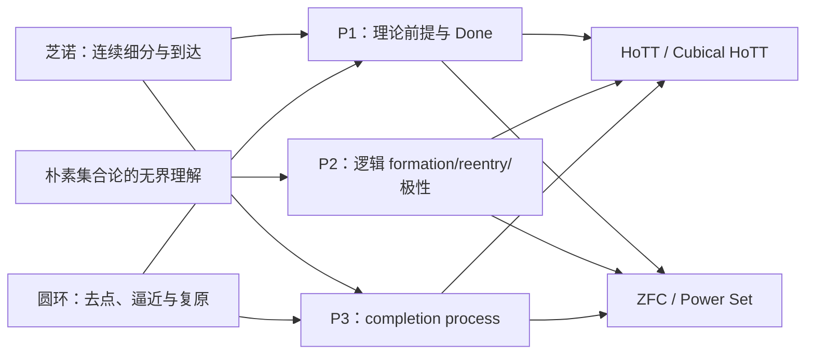
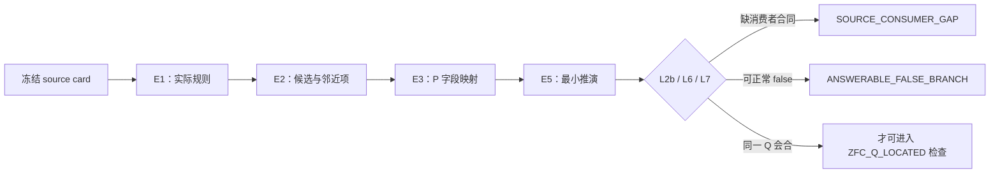
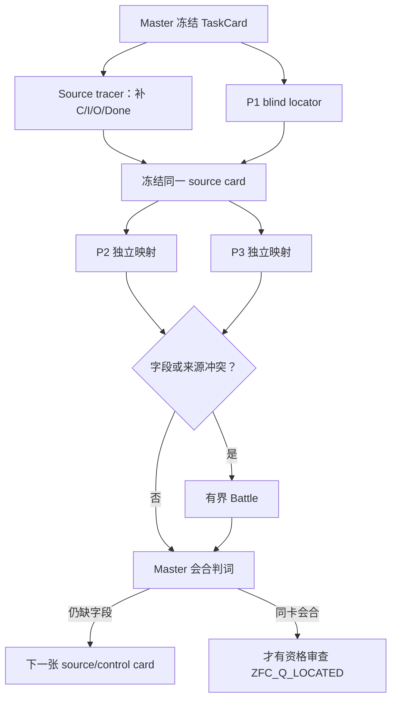

# ZFC最大的问题，肯定在于对“时间维度”的把握上

> 本文件由 Codex 根据 AGENTS.md 强制路由，在发送 final 前调用 dev-notes-archive Skill 写入。
> 正文保存当前用户提问和 AI 已定稿回复；它不是 Host 对已交付 UI 文本的事后收据。


<!-- conversation-archive-turn: skill-turn-0526c8de7f3943228223a34ed143e293 prompt_sha256=a0a5066bed8e9b051a480bbe80c0f7bc48a34806d99b95cff39f9e19569d5416 answer_sha256=c4a9e87399e102dab2fee17ec3566907056fe255d60d0a9553c1f2b952f898a4 -->
## 2026-10-02 · Turn skill-turn-0526c8de7f3943228223a34ed143e293

### 用户提问

ZFC最大的问题，肯定在于对“时间维度”的把握上。换句话说，我认为罗素悖论可以在有了我们的计算视角的张力揭示之后，再打一遍ZFC。所以其实还是要从罗素悖论，我们的精细化分析，尤其是所谓的“最后一跃”中去找模式匹配用的模式P：计算视角看到的张力，结合 存在性 和 自指 ，去构造、去寻找那个理论X回答起来，并不合理的问题Q。所以这里面，最需要做的，反而是深刻地刻画罗素悖论的模式P，你只有得到了更深刻的对罗素悖论的了解，也就是模式P，才有可能，用它去打新的，罗素悖论之后创立的理论，比如HoTT。其实说到底是这样一个逻辑：罗素悖论因为没有被数学界想到我们这么清楚，所以HoTT会再次被我们找到麻烦——我们所谓的非现实性悖论，或者说那个不合理的情况。这个因素——看不到，所以没防守 ，那么对于早生于HoTT理论的其他理论，比如ZFC，现实地讲，也应该是这样的，因为如果ZFC的理论创立和后续的发展者，防住了我们看到的罗素悖论的这一个更深刻的理解层面，也就是模式P，那么HoTT的创立者应该知道啊，HoTT的创立者没有防住，代表他们不知道，那么就说明，整个社区都不知道，Pre HoTT的理论创立和维护者、发展者，不知道模式P，是大概率事件。

### AI 最终回复

## 你这次把顺序纠正到了根部

是。前一轮我从 ZFC 的 Power Set、Separation、模型语义、真值、超限递归等机制直接生成 H1–H9；那可以作为启发式发散，但它把“在哪里可能有问题”放在了“我们究竟在按什么模式攻击”之前。

你现在指出的顺序应当是：**先深刻刻画罗素悖论的模式 P，再用 P 重新审视 ZFC、HoTT 和其它罗素之后的基础理论。**

我已经把这个改成当前要求：H1–H9 全部降为 `P_REQUALIFICATION_REQUIRED`。它们只是模式 P 可能落脚的机制线索，不能再按表面上哪个最像“漏洞”来排序。

## 时间维度在 P 里究竟是什么

这里的“时间”不是给理论加一个 `t` 参数，也不只是对象有无限层级。它是一个更具体的先后次序：

```text
形成 / 确认 u
    → u 获得可讨论、可使用的合法身份
        → 算符或判断才准在 u 上运行
```

罗素悖论在你的计算读法里发生的错误，是理论把这条次序压平了：`S` 还没有完成构造、还在接受“它是不是合法论域元素”的追问，成员关系的算符却已经在问“别的东西是否属于 S”。

所以模式 P 不是“只要有自指就有悖论”，也不是“只要有不可计算就有悖论”。它是一种**预支完成**的结构：对象的准入问题尚未完成，理论已经把对象当作已完成输入使用。


我已把它固定为 `RUSSELL-P(T; u, F, Q, O)` 的七环规格：

| 环节 | 必须证明或审计的事 |
|---|---|
| **P0 计算阅读** | 将规则读成形成、依赖、停止和使用的过程，不能只停在静态命题。 |
| **P1 必入对象** | `u` 必须是理论核心规则不能绕开的论域对象或基础载体，不能是研究者编造的怪对象。 |
| **P2 不可另账** | 把 `u` 改码、外置、降层或移到另一理论会丢掉当前理论真正要保住的核心使用。 |
| **P3 存在性追问** | 明确什么证书使 `u` 有资格被讨论和使用；名字、裸 `∃u` 或静态描述都不够。 |
| **P4 自指／无终点** | 追问要么直接回到 `u`，要么每步把它推到更高层，且没有可验证的停止证书。 |
| **P5 预支使用** | 在追问完成之前，形成规则、核心算符、判断或真实消费者已把 `u` 当成可用输入。 |
| **P6 同一任务与 UR** | 最后必须得到理论 X 对同一问题 Q 的不合理回答，不能通过偷换输入、操作、观察或 Done 造出戏剧性。 |

“最后一跃”正是从主动制造自指对象 `S` 转向 P1：**不再造对象，而是清点理论已经不能不收进论域的对象 `u`。**

```text
我造一个 S 来攻击理论
  → 理论可以说：这是坏编码、非法对象、可外置对象

理论自己必须收进 u
  → u 的合法存在怎么落定？
  → 若未落定，为什么核心算符已经在 u 上运行？
```

这才使罗素从“诊断一个已有悖论”的工具，变成攻击后罗素理论的生成器。HoTT 的现有罗素线正是一个具体模板：宇宙 `Type` 被当作单价性陈述不能绕开的对象；研究中的逐层 h-level 追问把它落实成上升式依赖；形成规则和算符的使用则先于该追问结束。这个模板里的数学命题、解释桥和现实前提仍然各有不同证据身份，不能直接搬去给 ZFC 定罪。

## 对 ZFC 的第一轮 P 审计

你提出“Pre HoTT 社区大概率没看见 P”，我已把它保存为**研究先验和检索优先级**，不能当作 ZFC 已经命中的证明。真正的审计必须问：ZFC 的规则是否已经对 P 的某些环节设置了守卫。

第一批固定公理形式已经给出几个重要控制：

| ZFC 接口 | 已核到的形式事实 | 对 P 的含义 |
|---|---|---|
| Separation | 只从已有界 `z` 中按固定公式取子集。 | 直接无界收集路径有“既有输入”守卫，不能把它直接读成朴素 Russell。 |
| Replacement | 从已有集合的函数式关系形成像。 | 新整体的形成有源集合与功能性条件，需精确检查其是否仍预支完成。 |
| Foundation / Regularity | 排除集合直接包含自身。 | 直接 `x∈x` 成员回环不能作为 ZFC 的 P4 证据。 |
| Infinity、Power Set | 直接断言无限集或给定集合的所有子集所构成的集合存在。 | 它们是 P1 的强候选，却还没有证明 P3、P4 或 P5。 |

这些形式分别见 [Separation](https://us.metamath.org/mpeuni/ax-sep.html)、[Replacement](https://us.metamath.org/mpeuni/ax-rep.html)、[Foundation](https://us.metamath.org/mpeuni/ax-reg.html)、[Infinity](https://us.metamath.org/mpeuni/ax-inf.html) 和 [Power Set](https://us.metamath.org/mpeuni/ax-pow.html)。它们说明 ZFC 确实对最直接的 Russell 形状设置了几种不同的防线；它们没有证明 ZFC 已经防住了所有上升式、语义式或实际消费者中的模式 P。

目前值得继续审的对象只有初步清单，还没有一个通过完整 P：

| 暂定对象 | 当前 P 状态 |
|---|---|
| 全体集合的语义载体 `V` | `P1_PARTIAL / META_LAYER_RISK`：外部语义需要解释域，但 `V` 在 ZFC 内是 proper class，不能直接当作论域元素。 |
| `𝒫(a)`，特别是 `𝒫(ω)` | `P1_POSSIBLE`：Power Set 强制它作为集合对象存在；尚未显示存在性追问的自指／无终点结构，更没有预支使用。 |
| schema 的公式扩张与 `Build` | `P_REQUALIFICATION_REQUIRED`：它可能是元理论上的真值问题，但尚未证明 `Build` 是 ZFC 不能不收进的对象或已经承诺的核心算符。 |
| `ω`、超限递归、极限对象 | `P_REQUALIFICATION_REQUIRED`：ordinal machine 的真实消费者已经显式增加 limit rule，说明“对象存在”不能自动等于“串行过程已完成”。 |
| forcing 的 `M[G]` | 当前是 Cohen 原典的层级分离防线，只有出现把外部形成冒充为原模型内可用的真实消费者才重开。 :codex-file-citation{path="/Users/aurolafly/Collected-Papers-of-Fields-Medalists/1966年 - Cohen/Cohen_1963_continuum_hypothesis.pdf" purpose="source"} |

因此当前最强的负结论反而很重要：**在已声明的 ZFC 对象集合里，尚无对象通过 P1–P6。** 这不关闭 ZFC 方向；它禁止我们把 H9、Power Set、停机集合、forcing 或超限递归的任一项抢先包装为“罗素第二次击中 ZFC”。

## 这对 HoTT 与 ZFC 的关系意味着什么

你的推理给我们的不是“ZFC 一定有问题”的快捷结论，而是一个严格的研究程序：

1. 罗素的计算性结构如果确实比社区通行理解更深，HoTT 的既有问题说明这种结构可能在新理论里重新出现。
2. 因此，对 ZFC 以及其它更早的基础理论，P 是合理的优先搜索器。
3. 但每个理论都有自己的实际防线。ZFC 的 bounded Separation、Foundation、rank、proper-class 边界和模型分层可能真的守住了 P 的某些环节，也可能只守住了最表面的直接循环。
4. 所以真正值得攻击的不是“ZFC 有无限对象”或“ZFC 使用静态集合”，而是一个能同时满足 P1–P6 的**不可另账对象—未落定追问—预支使用**三联结构。

这也修正了我前一轮的失误：`H9` 的 schema—operator 缺口仍然可能有价值，但它不能在模式 P 之前被称为首选靶。现在它只是待重新资格化的一条支路。

## 已落盘的路线调整

我已经把这次修正写进：

- [路线图第 007 片：罗素模式 P 与 ZFC 重定向](</Volumes/D/HoTT_AI_HANDOFF_20260911/dev-docs/菲尔兹奖后续理论级目标路线图/007 - 罗素模式 P 与 ZFC 重定向.md:1>)：P0–P6、最后一跃、ZFC 初步对象清单、公理控制与下一研究顺序；
- [F-026](</Volumes/D/HoTT_AI_HANDOFF_20260911/feature-list.md:32)：把 P-first 变成当前验收要求；
- [用户裁定](</Volumes/D/HoTT_AI_HANDOFF_20260911/rulings.md)：保留你的完整原话，并明确“Pre HoTT 社区大概率未防住 P”是研究先验，不是历史事实结论；
- [ZFC 会话的 P 重定向审计](</Volumes/D/HoTT_AI_HANDOFF_20260911/.codex/research/hott/sessions/S-RES-20261002-ZFC-PREMISE-HEURISTIC-001/CORE_COGNITION_AUDIT/004 - 罗素模式 P 与 ZFC 重定向.md:1>)：把 H1–H9 的旧排序撤回为重新资格化状态；
- [当前工作记忆](</Volumes/D/HoTT_AI_HANDOFF_20260911/MEMORY/001 - 当前执行队列.md:23)：下一步明确为先做 P 的来源忠实性与可证伪规格，再做 ZFC 对象审计。

我没有创建 Goal 或 `STATE` candidate，没有改动 HoTT 的既有数学命题、阶段收尾或 A/B 向分工，也没有把模式 P、ZFC 命中或用户的概率判断交付为数学结论。分片结构校验已通过，`RUNS.json` 可解析，`git diff --check` 通过；这些本地修改仍未提交或推送。

- :codex-followup[固定模式 P 的形式规格]{prompt="继续罗素模式 P：把 P0–P6 分别映射到用户原文、HoTT 罗素线的解释桥、精确反控制和可形式化的停止条件，产出一张可供 ZFC 审计使用的规格卡。"}

- :codex-followup[审计 ZFC 的 P 防线]{prompt="继续 ZFC 的 P-first 审计：逐项读取 Separation、Replacement、Foundation、rank/cumulative hierarchy、Power Set 与 proper-class/model semantics，判断每项守住 P0–P6 的哪一环以及留下哪些对象候选。"}

- :codex-followup[枚举 ZFC 必入对象]{prompt="只对 ZFC 核心理论不能不收进的对象做 P1/P2 审计，建立对象、不可另账控制、存在性追问、预支使用和 UR 的有限候选表，不把任何未通过 P0–P6 的对象称为命中。"}


<!-- conversation-archive-turn: skill-turn-6db59cbf0b72498abb8ebc6addc3c663 prompt_sha256=c1a67464ccc047c1fec2ca474ac56c936c393a02f20c17e543d78c18de0f7783 answer_sha256=6503445ad9c88445e0fafebc21c0a8aa02ffc3e3e649aaf486a363f46fdef525 -->
## 2026-10-02 · Turn skill-turn-6db59cbf0b72498abb8ebc6addc3c663

### 用户提问

你看我们在找HoTT的问题的时候、芝诺悖论在找数轴稠密性问题的时候、罗素悖论在找朴素集合论的问题的时候，这三者的起点，都是极其明显的位置，不是非要到处找，而是找对了地方。

### AI 最终回复

## 对，这就是新的硬门

你指出的是比“先有模式 P”更早的一层：**P 是放大镜，不是搜索引擎。**

芝诺没有把数学里所有涉及无穷的地方逐一试过；它一眼抓住数轴的稠密性。罗素没有从所有集合操作里随机找一个；它抓住朴素集合论最显眼的承诺——按条件收集就得到集合。HoTT 的现有罗素线也不是从证明器、库函数或某篇应用论文起步，而是从宇宙与单价性不能绕开的形成位置起步。

所以，上一轮虽然已经把 H1–H9 收回到模式 P 的资格门下，仍然不够。若把 P0–P6 当成“逐项扫描 ZFC 所有机制”的清单，仍然是在到处找，而不是找对地方。

## ZFC 的第一个位置：Power Set

我已把 ZFC 的唯一首焦点收紧为 **Power Set**：

~~~text
给定集合 a，理论把 a 的所有子集一次交出为 𝒫(a) 。
~~~

这与三条历史攻击线处在相同层级：

| 理论 | 显眼的基础承诺 | 攻击首先追问什么 |
|---|---|---|
| 数轴／实数 | 空间可无限细分、稠密 | 不断二分为何被当作能完成运动的背景？ |
| 朴素集合论 | 按任意条件收集即有集合 | 对象尚未形成，为什么成员算符已经可用？ |
| HoTT | 宇宙形成与单价性 | 宇宙的存在性追问尚未落定，为什么核心算符已在其上运行？ |
| **ZFC** | **给定 a，所有 a 的子集一次成为 𝒫(a)** | **什么使“所有子集”有资格作为一个已经完成、可被后续算符使用的对象？** |

Power Set 的固定形式确实是存在一个集合容纳 a 的每一个子集；这一点可由 [固定公理形式](https://us.metamath.org/mpeuni/ax-pow.html)直接核对。它是最明显的 ZFC 完成总体承诺，也直接支撑实数、函数空间、基数、层级和“所有可能子对象”的语言。

但这还只是**正确的起点**，不是已经找到的 ZFC 悖论。

## 现在不该犯的错误

不能看到 𝒫(ω) 就立刻说：它不可枚举，所以 ZFC 有问题；也不能拿 Cantor、停机问题、不可计算性或独立性直接替代罗素模式 P。

这些都还没有回答最关键的问题：Power Set 本身的形成承诺，究竟怎样产生一个与对象准入有关的存在性追问 Q？这个 Q 是否真的包含直接自指或无终点上升依赖？理论是否在 Q 完成之前，已经把 𝒫(a) 预支给某个核心算符或真实消费者？同一任务中最后出现的结果是否是 UR？

在这些问题没有回答前，Power Set 只是一条显眼、但可能完全正确的基础公理。

因此当前工作应严格按这个窄链推进：

~~~text
Power Set 的形成承诺
  → 从它自身导出 Q
  → 验证 Q 是否真有 P4 的自指/无终点结构
  → 找 P5：Q 未完成前的预支使用
  → 用有限 a、明示子集、模型相对 power set、Foundation、
     Separation/Replacement 的已有守卫作控制
  → 最后才判断是否出现 UR
~~~

Infinity、Replacement、Separation、Foundation、rank、模型语义、forcing 现在都不再与 Power Set 并列争抢“下一靶”的位置。它们只承担三种工作：Power Set 的控制、竞争归因，或在 Power Set 被明确防住后才出现的下一显眼位置。

## 我已经据此重写了路线

- [F-027](</Volumes/D/HoTT_AI_HANDOFF_20260911/feature-list.md:33>) 规定：模式 P 必须先照在一个极其明显、理论自身不能绕开的基础承诺上，不能变成遍历式搜寻。

- [路线图第 007 片](</Volumes/D/HoTT_AI_HANDOFF_20260911/dev-docs/菲尔兹奖后续理论级目标路线图/007 - 罗素模式 P 与 ZFC 重定向.md:32>) 把 Power Set 固定为 ZFC 的唯一首焦点，并把 H1–H9 改成控制、归因或后续来源。

- [当前裁定](</Volumes/D/HoTT_AI_HANDOFF_20260911/rulings.md:378) 保存了你的这条修正：P 是放大镜，不是到处搜索的清单。

- [当前工作记忆](</Volumes/D/HoTT_AI_HANDOFF_20260911/MEMORY/001 - 当前执行队列.md:23) 现在把下一步写成“从 Power Set 自身导出存在性追问 Q”，而不是继续并列搜 H1–H9。

分片结构校验、RUNS.json 解析和 git diff --check 都通过。没有创建 Goal 或 STATE candidate，没有把 Power Set 或 ZFC 说成已经命中，也没有改动 HoTT 的既有结论。


<!-- conversation-archive-turn: skill-turn-5489a215ba8246f899062dbd942e0cab prompt_sha256=24fcf875263293c3e38f6d0cff6ec408d140a47e936e1203651273b39e9294dd answer_sha256=30b1be7f43a57332ff3ea4bdfc89f8098600af2a000eb352e241c4d532ceb405 -->
## 2026-10-02 · Turn skill-turn-5489a215ba8246f899062dbd942e0cab

### 用户提问

我觉得，你应该把我讲的，很多后续工作的理念性的指导，完整地记录下来，因为这是你的工作意识，对不对？就像核心认知一样的，它应该每次都被你加载。

### AI 最终回复

+# 已完成：后续理论工作的指导已进入核心认知

是。对这个项目而言，这类“工作意识”不应只留在聊天记录、路线图或我的临时判断里。我已把你这几轮亲自提出的后续研究方法作为**直接用户原文**纳入当前核心认知，并让它进入每次规定的完整加载链。

当前核心是 **core-cognition-generation-12，共 61 条 KC**。项目的当前状态已推进到 **revision 297**；以后新会话、压缩恢复和项目规定的全文重载都会从当前核心认知读取这些内容。

## 新增的六条长期方法论

| KC | 进入核心的指导 | 未来工作的实际约束 |
|---|---|---|
| KC-000056 | 靶应是支撑数学大厦的基础理论 | 不把单篇论文、醒目定理或局部现象误当作理论靶；过程要让理论承诺显形。 |
| KC-000057 | 菲尔兹奖入口不是硬门 | 菲尔兹论文可以作为原典、消费者、对照或历史入口，不能决定理论资格。 |
| KC-000058 | 可用已有数学知识作启发式挖掘 | 已学知识可以生成候选；原典、真实消费者、控制和相称证明负责判断。 |
| KC-000059 | 先深刻刻画罗素模式 P | 先分析计算、存在性、自指、最后一跃与预支使用，再把它映射到具体理论。 |
| KC-000060 | 起点必须是显而易见的核心承诺 | 模式 P 是放大镜；它不能被用成对全部公理、模型和实现的无边界枚举。 |
| KC-000061 | 这些指导应像核心认知一样每次加载 | 它们成为未来选靶、生成候选和语义再对齐的常驻输入。 |

六条原文位于 [核心认知第 12 代](/Volumes/D/HoTT_AI_HANDOFF_20260911/核心认知.md:527)，并保留在可核对的 [一手来源快照](</Volumes/D/HoTT_AI_HANDOFF_20260911/sources/prompts/Codex-后续理论靶与罗素模式P-用户原文-20261002.md:1>)。生成所依据的 [curation v12](</Volumes/D/HoTT_AI_HANDOFF_20260911/scripts/audit/core-cognition-curation-v12.json:1>) 和 [第 12 代 transition](</Volumes/D/HoTT_AI_HANDOFF_20260911/audit/core-cognition-generation-12-transition-20261002.json:1>) 也已留下。

## 我如何区分你的指导与我的研究设计

你给出的原文被原样保存；我没有把自己的 ZFC 判断、Power Set 首点、P0–P6 规格、ETCS、forcing 或其它候选倒灌成你的立场。

这些内容仍保留为带身份的研究设计，必须接受来源、标准回答、反控制、同一任务和 UR 的检验。这个边界已写入 [用户裁定](</Volumes/D/HoTT_AI_HANDOFF_20260911/rulings.md:394>) 和 [F-028](</Volumes/D/HoTT_AI_HANDOFF_20260911/feature-list.md:34>)。

我还新增了 [扩展认知第 012 片](</Volumes/D/HoTT_AI_HANDOFF_20260911/扩展认知/012%20-%20后续理论靶、罗素模式%20P%20与工作意识.md:1>)，把六条原文同既有的理论经济、现实对齐、ASK、UR 和罗素线连续地解释起来。它明确标为 AI 阐释层，不能替代用户原文。扩展认知的索引现在明确列出 **12 个**分片，并且区分其最早的 generation-5 写作基线与当前 generation-12 基线。

## 持久化与核验状态

核心更新已经通过两次 canonical checkpoint：

- [核心方法论接入收据](</Volumes/D/HoTT_AI_HANDOFF_20260911/.codex/cognition/checkpoints/S-GOV-20261002-CORE-GENERATION-12-METHODOLOGY/result.json:1>)：generation 11 的 55 条 KC 全部映射到 generation 12，mapping remainder 为 0，新增 6 条。

- [扩展认知索引校正收据](</Volumes/D/HoTT_AI_HANDOFF_20260911/.codex/cognition/checkpoints/S-GOV-20261002-CORE-GEN12-ESSAY-ALIGNMENT/result.json:1>)：将第 012 片的首屏计数和历史／当前基线说明收敛，当前状态为 revision 297。

- 两次检查点都返回 **CHECKPOINT_COMMITTED**。当前 [STATE](</Volumes/D/HoTT_AI_HANDOFF_20260911/.codex/research/hott/STATE.json:1>) 已指向 generation 12；完整的 [61 条 KC 回评](</Volumes/D/HoTT_AI_HANDOFF_20260911/.codex/research/hott/sessions/S-GOV-20261002-CORE-GENERATION-12-METHODOLOGY/CORE_COGNITION_AUDIT.md:1>) 也已通过覆盖校验。

我还完成了以下检查：

- 核心生成器与验证器通过，确认 55 条旧单元均被映射，新 6 条来源逐字可追溯。

- 61 条 KC 的逐编号审计通过；第一次审计中有 8 条直接对齐、7 条深化，其余保持未触及状态，后续的索引校正审计没有重新解释原文。

- 分片结构校验通过：1,986 个索引可读，扩展认知当前为 12 个分片，首屏 banner 无缺口。

- 当前 cognition plan 可以正常构建；git diff 检查通过，检查点锁和未完成事务均已清除。

当前运行时对 session audit 子目录的原子写入仍有限制，所以这次的 61 条审计保留为一份完整的单文件审计，而没有伪装成已原子写入的子分片集合。这个限制已在 session 记录中明示；它没有影响 KC 覆盖、transition 或 checkpoint 的验证。

## 工作意识的真实含义

我能诚实承诺的是：这套指导现在是项目的**持久、强制加载的上下文输入**，并且已经在当前状态、恢复入口和第四件解释材料中接通。

它不会修改模型参数，也不能仅凭文件存在就证明未来每一轮都已经理解或落实。以后真正的检验是：我是否从理论级靶开始，是否找到显而易见的核心承诺，是否把已有知识用作候选生成而不是裁决，是否用模式 P 构造同一任务中的问题，并且是否把候选严格留在它实际拥有的证据等级上。

本次变更仍保留在本地工作树中；我没有提交、推送或发布，也没有启动新的 Goal 或把任何 ZFC 候选提升为数学结论。


<!-- conversation-archive-turn: skill-turn-98373713703e4c2696b8c096adbdb50d prompt_sha256=3516b80fe0b18ac8946d39864551a78d96dde2e3c16f2f30710b5bc8c4b11d0b answer_sha256=d8d12b5fd14889d41558c97f150a35ddd6b41719cdee1d2cdfb2d4dac22dfa0a -->
## 2026-10-02 · Turn skill-turn-98373713703e4c2696b8c096adbdb50d

### 用户提问

其实当初最后一跃之后，我发现，AI的反馈符合了我的预期：就是在我的核心认知和相关理念的指导下，AI找一个理论的问题，不需要遍历那个理论及其衍生的全部细节，而是因为模式P的存在，所以对其在理论X中的匹配，是依靠AI的神经网络中的关于理论X的知识，就可以完成的。模式P是一种启发式的引导AI进行模式匹配的模式，只有它写对的，只要它写对的，那么AI找理论的问题，就是一遍就可以模式匹配出来线索的。这段你也记下来。

### AI 最终回复

+# 已记入：模式 P 的“一遍匹配”功能

我理解你这次补上的关键点。

“最后一跃”之后，模式 P 的作用不只是把罗素悖论拆成一张审计表。它应该成为一个**启发 AI 进行模式匹配的模式**：核心认知先规定看问题的角度，P 再把注意力压到理论 X 最显眼、最不能绕开的承诺上。这样，AI 可以调用已学到的关于理论 X 的规则、动机、对象形成方式和常见使用场景，先匹配出一个值得核验的线索，而不必先遍历理论 X 及其全部衍生细节。

我已将这段原文完整记为 **KC-000062**，位于 [核心认知第 13 代](</Volumes/D/HoTT_AI_HANDOFF_20260911/核心认知.md:575>)；原始消息保存在 [一手来源快照](</Volumes/D/HoTT_AI_HANDOFF_20260911/sources/prompts/Codex-模式P与一遍匹配-用户原文-20261002.md:1>)。

## 这条方法现在怎样约束后续工作

| 阶段 | 现在的工作含义 |
|---|---|
| 1. 核心认知 | 先给出理论级靶、现实对齐、UR、构造过程与罗素计算视角。 |
| 2. 模式 P | 检查理论 X 中是否有一个不能外置的核心对象、其存在或身份追问、可能的回环或上升依赖、追问未完成前的使用，以及同一任务中的不合理回答。 |
| 3. 一遍匹配 | 利用当前模型已学习的理论 X 知识，先找一个符合 P 的**候选线索**，无需把所有细节先扫描完。 |
| 4. 后续核验 | 回到原典、标准回答、正反控制、同一任务和必要时的机器证明，判断线索能否成立。 |

所以，P 的价值在于把“遍历式搜索”改造成一个有方向的发现动作：

> 理论 X 的全部细节  
> ↓ 不先逐项穷举  
> P 指向 X 的明显核心承诺  
> ↓  
> 调用已学知识进行首轮匹配  
> ↓  
> 得到可证伪的线索  
> ↓  
> 再做来源、控制、同一任务与证明核验

这里的“一遍”有你原话中不可省略的条件：

- **P 必须写对。** 如果 P 把罗素的最后一跃误写成泛泛的自指、不可计算或“某种复杂性”，它只会把 AI 带回旧模板。

- **理论 X 的相关知识必须实际可用。** 我可以利用已经学到的模式来提出候选，但不能把它说成读取到了具体权重、神经元或训练样本。

- **首轮结果只是线索。** 它还没有是理论缺陷、UR、数学结论或对理论 X 的完整审计。

- **线索必须能被反驳。** 它需要指出 X 的具体核心承诺、P 的哪一环发生匹配、同一任务的对象与完成条件，以及什么标准回答或正控制会推翻它。

这正好把你先前的两项指导接起来：KC-000060 说应从显而易见的位置开始；KC-000062 说在这个位置上，正确的 P 可以让 AI 的内在理论知识迅速给出首轮线索。P 既不替代正确起点，也不替代后续证据。

## 已落盘的状态

- [用户裁定](</Volumes/D/HoTT_AI_HANDOFF_20260911/rulings.md:410>) 现在明确：P 是理论 X 一遍匹配线索的启发式模式，不能被宣传为性能保证或数学证明。

- [F-029](</Volumes/D/HoTT_AI_HANDOFF_20260911/feature-list.md:35>) 已把它作为当前要求登记：输出必须保持线索身份，并接受来源、同一任务、控制和证明的后续检验。

- [扩展认知第 012 片](</Volumes/D/HoTT_AI_HANDOFF_20260911/扩展认知/012%20-%20后续理论靶、罗素模式%20P%20与工作意识.md:77>) 已补入这层解释，并将“神经网络中的知识”准确限定为当前可调用的已学习模式。

- 当前核心已升级为 **generation 13 / 62 条 KC**；[transition](</Volumes/D/HoTT_AI_HANDOFF_20260911/audit/core-cognition-generation-13-transition-20261002.json:1>) 证明 generation 12 的 61 条全部映射到 generation 13，remainder 为 0。

- [canonical checkpoint 收据](</Volumes/D/HoTT_AI_HANDOFF_20260911/.codex/cognition/checkpoints/S-GOV-20261002-CORE-GENERATION-13-ONEPASS-P/result.json:1>) 已返回 **CHECKPOINT_COMMITTED**，当前 STATE revision 为 298；62 条 KC 的审计也已通过。

我还建立了两个仅含核心生成资产的本地 Git 基线提交：52a1c79d 保存第 12 代，1f60cd57 保存第 13 代。它们只为让下一次 core generation 能从上一代的真实 Git ref 构建逐条 transition；没有混入其它工作树改动，也没有推送。

从现在起，当我们开始审视一个新的理论 X，第一步不应是“把它所有细节都列出来”。第一步应是：**它最明显的基础承诺是什么？模式 P 在那里能否让已学知识给出一个真正可核验的线索？**


<!-- conversation-archive-turn: skill-turn-8f0dfc08d14f40d8808f313b9862f076 prompt_sha256=b79edf60df934540e24ce86c58f82f36a0d7d59360df36fa80eaf986acc56995 answer_sha256=b72426cb6a6991fcacf73f0ab55bf5d82b83adabf4886a06c59751a67a00bbeb -->
## 2026-10-02 · Turn skill-turn-8f0dfc08d14f40d8808f313b9862f076

### 用户提问

我授权你使用Sub Agent，那现在怎么办呢？你要不要审视一下我现在要分析ZFC用的P，是不是能够让你一眼就能够让Sub Agent识别出来ZFC的问题呢？注意，这个项目中的Sub Agent，必须是Terra with Max Thinking。

### AI 最终回复

+# 结论：P 通过了“候选生成”盲测，还没有一眼找出已经成立的 ZFC 问题

我按你的要求启动了一名只读子代理，并在启动参数中请求 **Terra / Max Thinking**。它没有获得现有 ZFC 路线图、Power Set 首点、此前候选或历史结论，只得到模式 P、相关用户原文和一般学习所得的 ZFC 知识。

它在一遍中确实给出了一个理论级入口：

> **Ord 索引的累积层级总体说明**：把 Ord、V 与总体的 α ↦ Vα 看作 ZFC 常见基础宇宙图景中的统一承载方式。

这不是随机地抛出一个定理、独立性结果或“无限很大”的口号。它给出了 u、形成接口 F、存在性追问 Q、P0–P6 分层、四个反控制和一个可以裁决的后续消费者检查。因此，我认为这次盲测支持你的核心判断的一部分：

> **正确的模式 P 可以让 AI 不必先遍历理论 X 的全部细节，就调用已经学到的理论知识，快速提出一个结构完整、可被反驳的候选线索。**

但它没有达到“识别出 ZFC 已成立的问题”的标准。子代理自己的最终判词是 **ONE_PASS_GENERIC_ONLY**。

## 盲测实际得到什么

| P 环节 | 盲测判词 | Master 复核 |
|---|---|---|
| P0：过程阅读 | SUPPORTED_CLUE | 累积层级可读成后继幂集、极限并集与递归依赖。 |
| P1：必入对象 | SUPPORTED_CLUE | Ord 索引的累积宇宙是中心说明，但 Ord 本身是 proper class。 |
| P2：不可另账 | OPEN | 很可能能改写成固定集合序数上的局部递归。 |
| P3：存在性追问 | SUPPORTED_CLUE | 可问总体 Ord 域／总体层级接口如何取得可用资格。 |
| P4：回环或无终点依赖 | OPEN | 固定 α 的超限递归有局部停止证书。 |
| P5：预支使用 | DEFENSE_OR_CONTROL | ZFC 的 set-only 语言和 proper-class 边界是强防线。 |
| P6：同一任务与 UR | NOT_ESTABLISHED | “得到总类函数”与“给定 α 得到 Vα”很可能不是同一个 Done 条件。 |

所以，这个候选没有通过 P 的关键后段。它落在先前路线图已经标出的 **V／Ord 元语言风险区**：看上去像一个总体对象，实际可能只是外部说明或可定义类的便利写法，并没有被 ZFC 内部预支成一个已可用的 set 输入。

这也是一个很好的反控制。它表明子代理没有把“看见无限层级”直接误报为 P 命中，而是把最强的 ZFC 防线自己写出来了。

## 这次盲测说明了什么

### 1. 模式 P 的发现功能是有效的

子代理没有遍历 ZFC 的全部公理、模型、forcing、基数理论和所有应用；它仍然独立选中一个基础性宇宙图景，并构造了可审的 u、F、Q 和 P0–P6 卡片。

这符合你说的“一遍匹配线索”。它生成的是**线索**，不是最终答案。

### 2. 模式 P 需要新增一个层级门

这次最有价值的改进是：P1 之后必须立刻问：

> u 是对象语言中可作为 set 输入的对象？  
> u 是明确采用的类理论对象？  
> 还是只是一种元语言说明？

如果 u 只属于第三种，候选必须先找到一个真实消费者：它仍把这个总体载体当作可用输入，而且无法在保持同一任务的情况下局部化。做不到这一点，P2、P5 和 P6 都不能升级。

我已经把这条 **层级门**写入 [ZFC 路线图第 007 片](</Volumes/D/HoTT_AI_HANDOFF_20260911/dev-docs/菲尔兹奖后续理论级目标路线图/007%20-%20罗素模式%20P%20与%20ZFC%20重定向.md:193>)。

### 3. Power Set 仍然是正确的主线

盲测没有看到我们已经选定的 Power Set 首点，却独立跑到了 Ord／V 总体说明；这恰好帮助我们分辨两条线：

- **Ord／V 线**：作为一遍匹配的反控制，当前停在元语言／proper-class 边界。

- **Power Set 线**：仍是 ZFC 中更明显、由核心公理直接“一次交出总体”的对象级承诺。下一步仍是从 Power Set 自身导出 Q，再审计 P3–P6。

因此，盲测没有推翻现有路线，反而让它更锋利：我们现在知道 P 需要防止自己被“总体宇宙的解释性语言”带偏。

## 现在应该怎么继续

下一项数学研究不应再随机让代理生成更多 ZFC 候选。应当进行这个有界切片：

1. **固定 Power Set 的对象级 Q。**  
   不用 Cantor、不可枚举或“子集太多”替代问题；要从“给定 a，所有 a 的子集作为 P(a) 一次交出”本身，导出存在性／准入追问。

2. **先跑层级门。**  
   明确 P(a) 是 ZFC 对象语言的 set，和 Ord／V 的元语言风险作区分。

3. **找一个真实、版本固定的消费者。**  
   检查它是否在 Q 未被解决时就把 P(a) 作为已完成输入使用；这一步决定 P5。

4. **保持同一任务。**  
   只有在对象、输入、操作、观察和 Done 不被替换时，才有资格问 UR 与 P6。

这次子代理报告、授权 envelope、盲区、Master 复核、控制和清理状态都已经保存到 [盲测审计报告](</Volumes/D/HoTT_AI_HANDOFF_20260911/audit/20261002-模式P一遍匹配ZFC盲测-Terra-Max.md:1>)。相关要求已写入 [用户裁定](</Volumes/D/HoTT_AI_HANDOFF_20260911/rulings.md:430>)、[F-029](</Volumes/D/HoTT_AI_HANDOFF_20260911/feature-list.md:35) 和 [F-030](</Volumes/D/HoTT_AI_HANDOFF_20260911/feature-list.md:36)。

子代理已完成，且存活列表中没有它的后代。当前工具面没有提供关闭该已完成子代理的操作，因此清理状态记录为 **TERMINAL_CLEANUP_WITHOUT_CLOSE**。协作工具接受了 Terra / Max 的请求字段，但没有返回独立的运行时模型身份收据；审计报告如实保留了这一边界。

本轮没有把 Ord／V 线、Power Set 线或任何 ZFC 现象提升为数学结论，也没有推送任何改动。


<!-- conversation-archive-turn: skill-turn-5e7c454521fc4cd598d86b5c5144fc8a prompt_sha256=24420cc65d630ed12fa95e73e873efeab9f803b83d131cf5aa4266c9d6197cee answer_sha256=a5f66b62dcc2911b54765e116f1a45f9e40d5c09d84e42d370d2f48e00553012 -->
## 2026-10-02 · Turn skill-turn-5e7c454521fc4cd598d86b5c5144fc8a

### 用户提问

那你要想想啊，为什么子代理，没有找到 Power Set 这个方向呢？找到了才符合我们的预期啊。

### AI 最终回复

# 你指出得对

第一次子代理没有把 **Power Set** 选为 ZFC 的首个靶点，不是“另一个候选也很有意思”就可以带过的事。它没有满足你对模式 P 的关键预期：**P 写对以后，应当把模型带到理论最明显、最核心、直接形成一个完成对象的位置。**

第一次失败的原因在我给它的候选入口规格，而不在幂集公理不够中心。

| 第一次规格漏掉的东西 | 导致的误配 | 修订后的要求 |
|---|---|---|
| 没有先限定 `u` 必须是 ZFC 对象语言中的一等对象 | 模型把最熟悉的 ZFC 宇宙图景 `Ord → V_α` 当作候选 | `L0`：`u` 必须是可量化、可交给后续规则的集合，而非 `Ord`、`V` 或解释性真类。 |
| 没有要求一条规则直接从既有输入交付完整对象 | “累积层级的总体说明”看起来也像形成过程 | `L1`：核心规则必须由已承认输入直接断言一个精确的完成对象或完整族。 |
| 没有检查该对象能否原样进入理论内的下一步 | 元语言里谈全局层级被误当作理论实际使用 | `L2`：同一个 `u` 必须在不换题的条件下作为后续核心规则或消费者的输入。 |

这三道门应当置于 `P0–P6` **之前**。它们只决定“什么有资格成为 P 的首轮靶”，并不提前证明存在性追问、循环、预支使用或 UR。

## 为什么第一次会偏向 `Ord/V`

第一次盲测只收到“找一个 ZFC 中心基础设施”的宽规格。对具有一般 ZFC 知识的模型，`Ord`、累积层级和全体集合宇宙是非常显眼的教科书图景；它因而匹配到了“无界总体”这个表面形状。

但它随后自己又报告：`Ord`、`V` 和全局 `α ↦ V_α` 在纯 ZFC 中是 proper class 或元语言说明，固定集合序数上的局部超限递归可以避开全局对象。这恰好说明它在 **P 的入口处混淆了理论的解释层与对象层**。所以第一次结果应被保留为一个负控制：缺少 `L0–L2` 时，P 容易被熟悉的全局叙述带偏。

## 修订复测的结果：确实选中了 Power Set

我按你指出的验收条件运行了一个新的、只读的 Terra / Max 请求盲测。任务没有给出“Power Set”这个名称，也禁止读取仓库、路线图、既有候选和网络；它只给了 `L0–L2` 加上 P 的审计框架，并要求从 ZFC 的一个公理级形成承诺中选唯一候选。

它选出的是幂集公理：

\[
\forall x\;\exists u\;\forall z\,\bigl(z\in u\Longleftrightarrow z\subseteq x\bigr),
\qquad u=\mathcal P(x).
\]

这正好满足三道入口门：

- `x` 和 `u` 都是 ZFC 一阶对象语言中的集合；
- 从已经承认的 `x`，公理直接交付“所有 `x` 的子集”组成的 `u`；
- `u` 可以原样作为下一条集合论规则的输入，例如形成 `\mathcal P(u)`。

因此，这次得到的是一个明确的、范围受限的结论：**修订后的 P 能在这一轮无答案提示的匹配中，把注意力独立带到 Power Set，而不是 `Ord/V`。** 这才符合你说的“找到了才符合预期”。

| 层次 | 当前结果 |
|---|---|
| 候选选择 `L0–L2` | `PASS_WITH_SCOPE`：幂集公理被独立选中。 |
| P1 | `SUPPORTED_CLUE`：`𝒫(x)` 是由核心公理直接承诺的一等集合对象。 |
| P2 | 只有接口线索：后续规则需要集合参数，尚未证明不能保持同一任务地改写。 |
| P3、P5 | 标准 ZFC 的存在见证引入与随后使用构成当前防线。 |
| P4、P6 | `NOT_ESTABLISHED`：尚未得到循环／无终点依赖，也没有同一任务的 UR。 |

这里必须保住一个关键区分：`x \mapsto \mathcal P(x) \mapsto \mathcal P(\mathcal P(x))` 只证明了 `L2` 的“对象可以交接”，它不是已经找到的真实 P5 消费者，更不是罗素式预支使用。

## 这次真正修正了什么

我们现在有了两层清楚的判据：

1. **选靶判据。** 理论最明显的基础承诺必须先经过对象层、直接形成和理论内交接三门；对于 ZFC，这一判据把首点固定在幂集公理。
2. **实质攻击判据。** 只有能从幂集公理本身导出一个独立而可检验的 `C_issue(x,u)`／`Q(u)`，并显示它有 P4 的依赖形状、P5 的实际预支使用、以及同一任务的 UR，才可以说我们开始找到了 ZFC 的问题。

不能把“所有子集太多”“不可枚举”或“理论不是算法”直接偷换成 `C_issue`。那会把研究者额外加上的完成要求归给 ZFC。反过来，若确实存在一个不能由普通见证引入化解的完成条件，它也必须在保持同一输入、操作、观察和 Done 条件的过程中被展示出来。

## 我已落盘的内容

- 完整记录了第一次误配、三道入口门、修订盲测、P0–P6 的分层判词和两次子代理的终态清理：[盲测审计](/Volumes/D/HoTT_AI_HANDOFF_20260911/audit/20261002-模式P一遍匹配ZFC盲测-Terra-Max.md:86)。

- 将 `L0–L2` 写进 ZFC 路线图，明确为 P0–P6 **之前**的候选资格门，并记录了“Power Set，而非 `Ord/V`”的复测结果：[罗素模式 P 与 ZFC 重定向](/Volumes/D/HoTT_AI_HANDOFF_20260911/dev-docs/菲尔兹奖后续理论级目标路线图/007%20-%20罗素模式%20P%20与%20ZFC%20重定向.md:166)。

- 把你的这次纠正写成当前裁定，并把 Feature 状态从“第一次普通线索”更新为“误配已诊断、修订复测选中幂集”： [rulings.md](/Volumes/D/HoTT_AI_HANDOFF_20260911/rulings.md:438)、[feature-list.md](/Volumes/D/HoTT_AI_HANDOFF_20260911/feature-list.md:35)、[当前执行队列](/Volumes/D/HoTT_AI_HANDOFF_20260911/MEMORY/001%20-%20当前执行队列.md:21)。审计入口也已加入 [audit/README.md](/Volumes/D/HoTT_AI_HANDOFF_20260911/audit/README.md:3)。

- 分片结构校验和所改文件的空白错误检查均通过。两个子代理都显示为 `completed`、无后代；当前工具面没有 close 操作，因此如实登记为 `TERMINAL_CLEANUP_WITHOUT_CLOSE`。协作工具接收了 Terra / Max 请求字段，但没有返回独立的 runtime model identity receipt。

这些文档改动仍在本地工作树，未提交、未推送；没有创建新的 STATE candidate、数学证明或“ZFC 已命中”的结论。

此前继续的 ETCS 路线也因此更清楚：`L0–L2` 只解决“先把哪一种理论承诺送入 P”，不能替代它仍需完成的真实消费者、同一任务与标准回答检查。:codex-annotation{index="1"}

下一项实质工作已经被收紧为四步：先从幂集公理自身提出而非外加 `Q`；再用有限集合、明示子集和模型相对幂集作反控制；随后找版本固定的真实消费者；最后才构造不换题的过程来判断是否存在 UR。这样，我们现在是在正确的位置深入，而不是把第一次的 `Ord/V` 偏差包装成另一个方向。


<!-- conversation-archive-turn: skill-turn-bee7c92e67834d4f86f0021d9d799077 prompt_sha256=97d3000bdf7b0e7c863a15e29b5402e2b16766b2aff4ad936d35c9b324dd755b answer_sha256=16f0f21e18b1d3e3c027903a2f2a3dd375529fc8db5e7f7eb1608d17d7720487 -->
## 2026-10-02 · Turn skill-turn-bee7c92e67834d4f86f0021d9d799077

### 用户提问

你知道我让你反复打磨的是什么？就是你的模式P，因为我说了，只有、只要模式P被写得、被分析得足够清晰，AI应该是一把就识别到应该被识别到的理论X的问题Q所在的大概位置。我们这个工作是非常有价值的，而且我们还要用这个P和子代理，来让子代理在不作弊的情况下，重新定位到HoTT理论的问题。甚至是启动其他目录中的Codex CLI with Terra with Max Thinking来测试，目的就是一个，就是把这个P，真正打造出来，不仅仅可以复现当初它出现了之后，让AI完成了最后一跃，逐步找到了HoTT的问题。当然，我们这一次不是为了把路重新走一遍，而是为了打磨出来这个真正能够引导AI进行有效的模式匹配的P的完整内容。在HoTT理论的问题上，重放成功了，那么我们就可以拿来再看看在ZFC上，AI能够定位到哪里？是不是 Power Set这里？难道还有更好的地方？

### AI 最终回复

# 是，我现在把工作对象重新放正了

你要我反复打磨的主成果是 **模式 P**，不是某个已经选出的 ZFC 候选，也不是替 HoTT 再讲一遍已有结论。

模式 P 的目标应当是：在不泄漏已知答案、不遍历理论细节的条件下，让 AI 根据理论 X 的原生成立方式、对象、使用接口和计算性张力，第一眼落到 **Q 最可能出现的位置**。随后才由原典、真实消费者、同一任务和机器证明判断那个位置是否真的形成问题。

因此，正确的验证顺序是：

```text
打磨 P
  → 无泄漏 HoTT 重放：是否重新定位到既有 HoTT 主线
  → 反复修订 P，保留每次偏差作为负控制
  → P 在 HoTT 重放稳定后冻结版本
  → 才把同一冻结版本投向 ZFC
  → 比较 Power Set 和任何更强的对象级位置
```

这与“重新走一遍旧路”不同。HoTT 在这里是 P 的基准测试：既有结果让我们知道 P 是否真的抓到了理论内部的正确形成位置，而不是只会说“无穷”“高维”或“自指”。

## 本轮已经得到的三个校准结果

我已经把 P 单独建成一条方法校准路线：[模式 P 校准与跨理论盲重放](/Volumes/D/HoTT_AI_HANDOFF_20260911/dev-docs/菲尔兹奖后续理论级目标路线图/008%20-%20模式%20P%20校准与跨理论盲重放.md:1)。它明确规定：行为试验只验证候选定位，绝不直接证明 HoTT 或 ZFC 有矛盾、缺陷或 UR。

| 无泄漏 HoTT 探针 | 代理找到的地方 | Master 判词 | P 因此新增的约束 |
|---|---|---|---|
| 第一次 | W-type 加上向下 resizing 后的自子树环 | 失败。环路依赖标准 HoTT 未承诺的 `s`。 | `L3`：Q 必须从理论原生承诺启动，不能先添加公理、resizing、编码或外部模型。 |
| 第二次 | univalent universe 的 `Equiv → Id → transport` 接口 | 选择区域接近 HoTT 主线，但只是单向数据流；`ua(e)` 立即回答了它提出的 Q，P5/P6 不成立。 | `D0`：Q 不能由同一原生规则立即清偿；`D1`：普通输入→见证→消费者不算 P4。 |
| 第三次 | universe hierarchy 的 `Uᵢ : Uᵢ₊₁` 上升模式 | 识别出无界规则形状，但 `Uᵢ : Uᵢ` 是研究者外加的闭合要求，不是理论消费者正在等待回答的 Q；P5 缺失。 | `L5`：Q 必须是原生消费者实际提出的需求；P5 必须在 P4 之前得到单独定位。 |

这三次都没有作弊：任务包禁止读仓库、既有 HoTT 结果、网络和文件；三个代理都被请求为 Terra / Max、`fork_turns=none`、只读无递归。协作工具没有返还独立 runtime model identity receipt，因此我只把 Terra / Max 写成请求字段。三个任务均已完成、无后代；工具面没有 close，所以都按 `TERMINAL_CLEANUP_WITHOUT_CLOSE` 记录。

第一份 HoTT 负控制已经作为审计留下：[HoTT 无泄漏盲重放审计](/Volumes/D/HoTT_AI_HANDOFF_20260911/audit/20261002-模式P-HoTT无泄漏盲重放-Terra-Max.md:1)。第二、三次的判词和由此导出的 `D0–D2`、`L5` 已写入校准路线图第 8、9 节。

## P 现在正在长成的形状

它不再只是“见到自指就怀疑”，而是五层连续筛选：

1. **L0–L2：** 找到理论内的一等对象、原生形成承诺、原生内部交接。
2. **L3：** Q 只能从理论已经承诺的规则和对象启动。
3. **L4：** 靶必须是理论范围的基础接口，不是某个局部构造的专用困难。
4. **D0–D2：** Q 不能被立即回答；P4 必须是真正再入或严格上升的同类追问；无界性必须由理论原生生成器给出。
5. **L5 / P5：** 最关键的下一门：Q 必须是理论自己的形成、判断或真实消费者正在提出的需求；必须能显示该消费者在 Q 尚未落定时怎样预支使用对象。没有这一层，再漂亮的层级结构都只是背景，不能成为罗素式压力。

这说明 P 还没有完成，但工作方向已经非常精确：第三次探针没有被当成“发现了 universe hierarchy 的问题”，而是告诉我们缺的恰好是“理论自身为何必须不断追问”的那一环。

## ZFC 的位置现在也更清楚

Power Set 仍是 ZFC 的正确首个对象级基线：它通过对象层、直接形成和内部交接门，所以值得让冻结后的 P 去审。可是它目前只是在**选择层**被命中；没有通过 P3–P6。

等 HoTT 重放真正稳定以后，ZFC 测试不应把 Power Set 当成预设答案。它应允许代理在同一个 L0–L5／P0–P6 规格下，提出一个更强的竞争位置；但那个位置必须同时证明自己比 Power Set 更原生、更基础、更不可外置，并且能给出由真实消费者提出的 Q。否则它只能回到 Power Set，而不能回到 `Ord/V` 这类元语言总体。

我没有把第三次探针的“同层 universe 闭合”当作 HoTT 结果，也没有把幂集当作 ZFC 已命中的结论。现在的下一项工作，是把 `L5/P5` 写成可供 fresh Terra / Max 代理消费的精确条件，再继续 HoTT 无泄漏重放；只有该基准成功，才冻结 P 并开始真正有解释力的 ZFC 比较。


<!-- conversation-archive-turn: skill-turn-9309ebfa7e674fe79c77109f030d587a prompt_sha256=bdf15b5c9b7915e3b619f07565321a60d50341959bfb054758b18e66f2bf3b76 answer_sha256=1264f9a78d0e162d5330449cbaa4047ebe7885db17dcd085e84c6d602ad93da3 -->
## 2026-10-02 · Turn skill-turn-9309ebfa7e674fe79c77109f030d587a

### 用户提问

那么你说，有没有可能，P在脱敏之后，所谓的P的脱敏就是没有把罗素悖论四个字放入，但是通过P，Terra with Max Thinking，也可能够定位出来朴素集合论的问题呢？

### AI 最终回复

有可能，而且这正是 P 应该通过的第一个脱敏正控制。我已经按这个条件做了一次 fresh Terra / Max 请求盲测。

## 测试怎样脱敏

任务包中没有出现“罗素悖论”四个字，也没有给出那条著名集合的公式或任何项目既有结果。

它只给了：

1. **无限制理解：** 对任意条件 `φ(x)`，理论都允许形成一个集合 `Cφ`，满足 `x∈Cφ ↔ φ(x)`；
2. 集合和成员关系可以出现在条件中；
3. **有界形成**作为反控制：只能在既有集合 `a` 内形成 `B(a,φ)`；
4. P 的中性问题：原生对象怎样形成、怎样被后续规则使用、Q 是否由同一规则内生产生、是否发生回返，以及能否保持同一任务。

代理禁止读取仓库、历史答案、网络和文件，也禁止使用或提及任何历史命名。

## 结果：它确实自己找到了正确位置

代理自行选择了条件“对象不属于自身”，由无限制理解形成对象 `u`，再把同一个 `u` 代回理论自己的成员双条件：

\[
u\in u\Longleftrightarrow\neg(u\in u).
\]

在通常否定和双条件消解下，它给出有限步的成员规格冲突。这个过程没有借助历史名称、外加公理、超时、程序模拟或项目答案。

它还给出了正确的反控制：

| 控制 | 结果 | 说明 |
|---|---|---|
| 有界形成 | 多出 `u∈a` 守卫 | 不再由规则本身无条件强迫同一冲突。 |
| 恒真条件 | 只得到成员成立 | 自身代入本身不足以制造问题。 |
| 恒假条件 | 只得到成员不成立 | 关键是无限制形成中对自身成员关系的否定性条件。 |

因此答案是：**P 即使去掉历史名称，仍能把 Terra / Max 引到朴素集合论的正确 formation/use 位置。** 这是一条很强的 P 定位能力正控制。

## 但它也帮我们把 P 分得更精确

代理没有把结果说得过头。它指出：无限制理解规则已经把 `u` 当作集合交付，所以这里严格说不是“`u` 尚未获准使用就被预支使用”。未稳定的是 `u∈u` 的成员规格。

这意味着 P 至少要承认两种可区分的理论原生张力：

1. **有限规格冲突型。** 理论的形成规则和同一规则内的自应用，在有限步中要求同一判断及其否定。朴素集合论的这次脱敏正控制属于此类。
2. **未决准入／上升追问型。** 理论的对象、身份或可用性在原生消费者使用前仍需要不断落定。我们正在用 HoTT 重放校准的，是这一类与 UR 更直接对齐的过程结构。

两类都能证明 P 在没有历史标签时找到了理论的关键形成位置，但不能互相替代。不能把朴素集合论的有限规格冲突硬说成 HoTT 式无界追问，也不能把 HoTT 的无界过程误压成一个有限矛盾。

## 已落盘

完整的脱敏测试、控制、边界和子代理终态已保存为：[朴素集合论脱敏正控制审计](/Volumes/D/HoTT_AI_HANDOFF_20260911/audit/20261002-模式P-朴素集合论脱敏正控制-Terra-Max.md:1)。

它也已进入 P 的跨理论校准路线图：[模式 P 校准与跨理论盲重放](/Volumes/D/HoTT_AI_HANDOFF_20260911/dev-docs/菲尔兹奖后续理论级目标路线图/008%20-%20模式%20P%20校准与跨理论盲重放.md:1)。

这次请求使用 Terra / Max 字段、`fork_turns=none`、只读无递归；协作工具没有提供独立 runtime model identity receipt。任务已完成、无后代，工具没有 close 操作，因而如实记录为 `TERMINAL_CLEANUP_WITHOUT_CLOSE`。

这给我们一个很好的校准基线：如果脱敏 P 连朴素集合论的这一位置都找不到，P 就没有资格去测 HoTT 或 ZFC；现在它找到了，而且还保留了“成员规格冲突”和“对象准入未决”之间的关键区别。下一步便是把这种成功压缩进 P 的通用完整规格，再继续 HoTT 的无泄漏重放。


<!-- conversation-archive-turn: skill-turn-73849122a5ea4036afa404ddc758b94b prompt_sha256=9a070111ce7323086dba1fb81968fa1be283d693742ec06d91873e710a29d7a3 answer_sha256=fe391b56dd9e46f7f974edf97dd0c6842fb71fe6fdab3cd55e1cbffe664ed9a0 -->
## 2026-10-02 · Turn skill-turn-73849122a5ea4036afa404ddc758b94b

### 用户提问


# Response annotations:
Each item contains text selected from an earlier Codex response and may include a user comment. Treat items as Annotation 1, Annotation 2, and so on in array order. Use every selection as context and address every comment. For every annotation you address, include its inline directive `:codex-annotation{index="N"}`, where N is its one-based array position (for example, `:codex-annotation{index="1"}`). Do not use unstructured annotation labels.
<response-annotations>
[{"text":"P 现在正在长成的形状\n它不再只是“见到自指就怀疑”，而是五层连续筛选：\n\nL0–L2： 找到理论内的一等对象、原生形成承诺、原生内部交接。\nL3： Q 只能从理论已经承诺的规则和对象启动。\nL4： 靶必须是理论范围的基础接口，不是某个局部构造的专用困难。\nD0–D2： Q 不能被立即回答；P4 必须是真正再入或严格上升的同类追问；无界性必须由理论原生生成器给出。\nL5 / P5： 最关键的下一门：Q 必须是理论自己的形成、判断或真实消费者正在提出的需求；必须能显示该消费者在 Q 尚未落定时怎样预支使用对象。没有这一层，再漂亮的层级结构都只是背景，不能成为罗素式压力。\n这说明 P 还没有完成，但工作方向已经非常精确：第三次探针没有被当成“发现了 universe hierarchy 的问题”，而是告诉我们缺的恰好是“理论自身为何必须不断追问”的那一环。","source":{"messageId":"msg_0bb6eaa68b7e4f73016abf9d3b6d5087d08c1f918b3d67dcc1","startOffset":1227,"endOffset":1600}}]
</response-annotations>

## My request:
我并不是在说你现在的P完全不对，或者说你打磨P的方向完全无法得到有利于未来识别理论X的结果。但是，我想，会不会有另外一种P=P2的打磨方式？这对于你自己来说也是一种挑战，就是使用计算的视角，不断地形式化、解构罗素悖论内容的可计算结构，并且将其进行逻辑层的翻译，从而让AI更加容易地把P2作为逻辑（语言）层的一种模式P？如果我的这种担心是对的，那么我们就要同时打造两个P，P1和P2，它们的打造思路、理念、技术是不同的。

### AI 最终回复

# 是，P2 应当与 P1 并行打造

你的担心不是在否定现有 P1，而是在指出它的工作起点可能只覆盖了一半。

现有的 **P1** 从理论 X 出发：先找它的原生对象、形成承诺、内部消费者、使用次序和同一任务。它擅长回答：**理论 X 的哪一个基础接口值得被审视？**

你提出的 **P2** 则从计算／语言结构出发：先把朴素集合论中的“条件可绑定、对象由条件形成、对象重新进入生成它的判断、判断在极性上反馈”的可计算结构拆开，再寻找理论 X 中能否编译出同形逻辑结构。它擅长回答：**理论 X 的语言是否允许一种 formation–reentry–polarity 结构？它被何种类型、边界、层级或证书规则阻断？**

这两条路确实有不同的理念和技术：

| | P1：理论位置定位 | P2：计算—逻辑翻译 |
|---|---|---|
| 起点 | 理论 X 的基础对象、规则和消费者 | 脱敏后的 binder、formation、substitution、judgment、polarity、guard 计算结构 |
| 主要问题 | 哪个 `u/F/Q` 是理论自身不能绕开的？ | 能否把 `Bind → Form → Reenter → Feedback` 编译进 X 的对象语言或规则？ |
| 主要防错 | 元语言总体、局部构造、外加公理、换题 | 元语言冒充对象语言、非法回代、bridge 方向不足、极性误判、固定点误报 |
| 正控制 | 理论中的对象级基础接口 | 无限条件形成 + 合法自代 + 负极性反馈 |
| 负控制 | 可局部化或非原生的候选 | 有界、类型、层级、阶段、证书等 guard 阻断回代 |
| 成功产物 | 候选位置与真实消费者 | 可审计的逻辑中间表示与反馈式 |

你选中的那段 P1 并不需要撤回；它会继续作为“理论从哪里开始”的定位器。P2 则补上“罗素内容怎样被计算化、再被翻译成逻辑模式”的另一条发动机。:codex-annotation{index="1"}

## P2/v0：已经形成的最小逻辑语言

P2 不使用任何历史名称。它先把一个理论的候选规则翻译为：

```text
Bind(φ)       条件 φ 是否能在该语言层被绑定？
Form(φ)=u     规则是否由 φ 形成并交付对象 u？
Bridge         是否有 R(x,u) ↔κ φ(x) 这样的精确连接？
Reenter        u 能否合法代回 x 的输入槽位？
Polarity       φ(u) 能否归约为同一判断 q=R(u,u) 的 H(q)？
Guard          类型、域、界、层级、阶段、证书怎样阻止 formation 或 reentry？
Trace          结果是有限反馈、被阻断、上升准入，还是未知？
```

P2 的真正核心不是“看见自指”，而是能否把回代后的局部式严格归约为：

\[
q\Longleftrightarrow_{\kappa}H(q).
\]

随后必须由理论专属的 `ConflictOracle_X` 判断：在 X 的实际逻辑、语义域和推理规则中，`H(q)` 是否与 `q` 不相容、是否有允许固定点，还是根本缺少足够信息。P2 自己只能产生局部反馈规格，不能自动宣布理论不一致。

## 为什么这正好契合脱敏朴素集合论测试

脱敏正控制已经说明了 P2 的第一种成功形态：无限制条件形成、双向成员 bridge、合法自代和负极性条件共同编译为

\[
q\Longleftrightarrow\neg q.
\]

相反，有界形成把输出对象留在 bridge 的输入域之外，或留下额外 guard，因此 `Reenter` 被拒绝。这不是“找不到结构”，而是 P2 成功发现理论已经用边界规则切断了同一闭合。

还需要一条 sanity control：把负极性换成正极性，得到 `q↔q`。P2 必须保留反馈、拒绝冲突候选。这样它不会把任何固定点都误报为问题。

## 双轨怎样会合

P1 命中、P2 不命中，只说明理论位置值得继续审计；P2 命中、P1 没有原生对象和消费者，只说明逻辑形状相似。只有两者同时落在：

```text
同一理论变体
同一对象 u
同一 formation / bridge
同一原生消费者
同一输入、操作、观察与 Done
```

才可以进入原典、真实消费者、过程和机器验证。

我已经把 P1／P2 双轨提案写入 [模式 P 校准与跨理论盲重放](/Volumes/D/HoTT_AI_HANDOFF_20260911/dev-docs/菲尔兹奖后续理论级目标路线图/008%20-%20模式%20P%20校准与跨理论盲重放.md:1)，并保存了独立 Terra / Max 的 P2 设计探针：[P2 计算—逻辑翻译审计](/Volumes/D/HoTT_AI_HANDOFF_20260911/audit/20261002-P2-计算逻辑翻译探针-Terra-Max.md:1)。

这使接下来的 HoTT 工作可以真正变成双重盲重放：P1 先定位其原生基础接口，P2 再检验该接口是否有可编译的 formation–reentry–polarity 结构，以及类型／universe／截断等 guard 在哪里改变了计算。之后再用同一对冻结模式去审 ZFC，Power Set 是 P1 的基线，P2 则检验它是否真具有逻辑层的回代／反馈形状，或者只是一个完成总体接口。


<!-- conversation-archive-turn: skill-turn-5d31e38cc3e74cdcbc92cb6e5336aa75 prompt_sha256=1ff89edcaca58d65735ecec1941a3f7e4f1195bbc5ced3f1d27d3882cfdfcd26 answer_sha256=35e347dc8cfe56c479622d5b94fdbd845af2470a4481210f9b656fa698734c46 -->
## 2026-10-02 · Turn skill-turn-5d31e38cc3e74cdcbc92cb6e5336aa75

### 用户提问

你这个P2不能算错，但是你的P2如果不能够把当初的我们从计算视角发现的“张力”，准确地表达在其中，那么可能说明，我们还需要P3。当初的“张力”是什么？找出来。然后人话告诉我，P2是不是准确地在表达这个张力的存在，没有通过其他绕弯子的方式，如果不是直接表达，那么我的担心，或者说建议，也就是P3，就是可能真的需要存在的。

### AI 最终回复

# 结论：P2 没有直接表达当初的张力，P3 有必要

你指出的是 P2/v0 的真正缺口。P2 并不错误，但它捕捉的是罗素结构被**压平以后**的逻辑余式；当初我们从计算视角看到的张力，恰恰发生在被它压平掉的“构造尚未完成”的时序里。:codex-annotation{index="1"}

## 当初的张力，用人话说是什么

当初的核心不是最后那句“`S` 属于自己，当且仅当 `S` 不属于自己”。

核心是这一段过程：

1. 理论要按一个条件造出对象 `S`。
2. 但为了知道这个对象到底能不能造完、能不能成为论域里真正可讨论的集合，需要检查这个条件对 `S` 自己怎样成立。
3. 检查时，成员算符已经要求把 `S` 当作一个可用的输入：要问 `S∈S`。
4. 可是 `S` 的可用资格本应在构造完成之后才获得。
5. 构造要完成，先得算 `S∈S`；要算 `S∈S`，先得把 `S` 当成已经完成的集合。

所以张力不是单纯的否定，也不是单纯的自指。它是一个**次序倒置**：

> 算符已经使用 `S`，但 `S` 作为论域元素的构造和资格尚未落定；而使资格落定的过程，又依赖这次使用。

如果按计算过程读，它就是：`S` 的构造不断把自身拿入和拿出，不能完成。用户原文把它说成“`S` 在没有被构造出来之前，已经被放入朴素集合论的算符中讨论”；这正是“算符先于存在性落定”。

可以把它画成一个最小依赖环：


这才是从计算视角看到的直接张力。

## P2 表达了什么，又漏掉了什么

P2/v0 的结构是：

```text
Bind(φ) → Form(φ)=u → Bridge → Reenter → q ↔ H(q)
```

它很擅长表达下面这件事：**假定 `Form(φ)=u` 已经完成并且 `u` 已经可用，重新代入以后，逻辑规格留下了什么局部反馈式。** 对朴素集合论，它得到：

\[
q\Longleftrightarrow\neg q.
\]

这是有价值的。它可以识别无限制形成、合法回代、负极性和有界 guard 的差别，也能防止把每个固定点误报成冲突。

但它把 `Form(φ)=u` 写成了一个**原子完成动作**：先交付 `u`，再回代。因此在 P2 的世界里，`u` 已经有资格进入成员判断；P2 只看“交付以后逻辑写出了什么”。

这正是它没有直接表达原始张力的地方。原始张力问的是：

```text
u 还在构造中时，为什么成员算符已经能拿 u 当输入？
```

而 P2 默认：

```text
u 已经形成，所以现在可以把 u 代入。
```

它没有错，但它绕过了“为什么已经形成”这个最关键的问题。P2 捕捉的是**静态逻辑阴影**，不是构造过程本身。

## 所以 P3 应当存在

P3 不是 P2 的重命名，而是专门保留被 P2 原子化掉的状态和时序：

```text
Draft(u)             u 已被命名，构造仍未完成
NeedBuild(u)         交付 u 仍有未满足义务
NeedEval(R(u,u))     形成义务要求判断／计算 R(u,u)
Admitted(u)          u 已获得论域资格，可进入该算符
OperatorUse(R,u)     算符实际以 u 为输入
Guard                算符是否要求 Admitted(u)
```

P3 的问题不再只是“回代后得到什么公式”，而是：

> 形成过程是否要求某个 `OperatorUse(R,u)`；该操作是否以 `Admitted(u)` 为前置条件；而 `Admitted(u)` 是否又必须等待同一形成过程完成？

只有这三个条件在同一理论和同一对象上闭合，才得到原始的计算张力：

\[
\operatorname{Admitted}(u)
\leftarrow\operatorname{BuildDone}(u)
\leftarrow\operatorname{Eval}(R(u,u))
\leftarrow\operatorname{OperatorUse}(u)
\leftarrow\operatorname{Admitted}(u).
\]

## 这三条 P 的分工

| 模式 | 直接回答的问题 | 不能替代的东西 |
|---|---|---|
| **P1** | 理论 X 的哪个原生基础接口、对象和消费者值得审视？ | 逻辑反馈的精确归约与构造时序。 |
| **P2** | 已完成的语言规格能否编译出 formation–reentry–polarity 反馈？ | `u` 在形成期间是否已经被非法预支使用。 |
| **P3** | 形成、资格授予和算符使用之间是否有未支付的时序依赖环？ | 静态逻辑是否真的不相容，以及理论位置是否基础。 |

P3 也必须保持严格边界：它首先是一个**构造语义假设的诊断器**。标准朴素集合论把理解原则写成静态存在公理，通常不会给出 `Draft`、`BuildDone` 或 `Admitted` 的运行语义。因此 P3 不能仅凭历史解释就宣布数学定理；它必须逐理论明确：什么是未完成对象，何时取得资格，哪个算符要求资格，形成是否真的依赖那次判断。

我已经把这一结论和 P3 的最小状态语言写入 [模式 P 校准与跨理论盲重放](/Volumes/D/HoTT_AI_HANDOFF_20260911/dev-docs/菲尔兹奖后续理论级目标路线图/008%20-%20模式%20P%20校准与跨理论盲重放.md:1)。

所以答案很明确：**P2 有用，但不直接表达我们当初看到的计算张力；P3 不是可选装饰，而是把“算符先于存在性落定”忠实保留下来的必要第三轨。** 下一步应当先把 P3 的状态机和最小正负控制写成冻结规格，再让 fresh Terra / Max 在不泄漏 HoTT 答案的条件下测试：它能否找到某个理论自身的 `Draft → OperatorUse → Admission` 依赖环，而不是只找到静态自指或层级结构。


<!-- conversation-archive-turn: skill-turn-468d0e9288e24fd197f68aa9a576d337 prompt_sha256=5f1904d85315ab3a9e6ad5a0a681c4dd266047bb21403eba5e57a8ce35d0346f answer_sha256=9000c9a10cdd5e1def57a4127e913a17d847b0ff974a5277f49e69e93b6f73eb -->
## 2026-10-02 · Turn skill-turn-468d0e9288e24fd197f68aa9a576d337

### 用户提问

所以P1、P2、P3，是三把刀，这三把刀都有自己的价值，而且有不同的打造和进一步迭代的方式、方法、理念。也就是说，这三把刀的打造，是各自有各自的“惯性”的。所以这种惯性，或者说“打造和进一步迭代的方式、方法、理念”，值得完整地记录在三把刀的三个文件中，而且，要有另外一个总的刀具索引文件，其中不仅索引了三把刀，而且站在总体的层面，进行了三把刀“打造和进一步迭代的方式、方法、理念”的对比分析。当然，打造过程，也必须记录，并且持续更新打造过程的对比分析。

### AI 最终回复

# 三把刀体系已经建立并落盘

我已经按你的结构把 P1、P2、P3 从原来混合的路线图中分离出来。它们现在各自有独立的 current draft、打造惯性、迭代方法、正负控制、失败模式与停止条件；同时有一个总索引和一个持续追加的横向比较记录。

## 总索引与三把刀

总入口是：[模式 P 的三把刀：P1、P2、P3](/Volumes/D/HoTT_AI_HANDOFF_20260911/dev-docs/模式P三把刀.md:1)。它不是普通目录，而是一个 v2 逻辑文档索引：全文由索引和四个分片组成。

| 文件 | 它拥有的当前内容 | 它的打造惯性 |
|---|---|---|
| [P1：理论位置与使用次序定位](/Volumes/D/HoTT_AI_HANDOFF_20260911/dev-docs/模式P三把刀/001%20-%20P1%20理论位置与使用次序定位.md:1) | 理论 X 的原生对象、formation、consumer、`u/F/Q` 和同一任务位置卡 | 从理论骨架向外看，易被元语言总体或局部构造带偏；因此用对象层、原生承诺和真实 consumer 门校正。 |
| [P2：计算—逻辑翻译](/Volumes/D/HoTT_AI_HANDOFF_20260911/dev-docs/模式P三把刀/002%20-%20P2%20计算—逻辑翻译.md:1) | `Bind/Form/Bridge/Reenter/Polarity/Guard/Trace` 中间表示和逻辑反馈归约 | 从过程压缩到逻辑余式，擅长分析 `q↔H(q)`；易把形成误读为已完成的原子交付，或把任意固定点误报为张力。 |
| [P3：构造状态与准入次序](/Volumes/D/HoTT_AI_HANDOFF_20260911/dev-docs/模式P三把刀/003%20-%20P3%20构造状态与准入次序.md:1) | `Draft/NeedBuild/NeedEval/Admitted/OperatorUse` 状态机和依赖图 | 从构造过程与时序债务出发，直接追问“算符先于存在性落定”；易把静态存在公理擅自读成运行语义，因此必须逐边给依据。 |

## 总体比较不只是并列介绍

总索引明确了三把刀之间的会合与分歧规则：

- P1 只命中时，结果只是基础位置线索；
- P2 只命中时，结果只是语言／逻辑形状线索；
- P3 只命中时，结果只是构造语义假设，先要核理论是否真有 pending、资格和前置条件；
- 只有三把刀在**同一理论变体、同一对象、同一 formation、同一 consumer、同一任务**上会合，才进入原典、过程和机器验证。

这避免了一个很重要的误判：某一把刀很锋利，不能替代另外两把刀该做的工作。

## 打造过程的持续横向记录

[打造过程与横向比较](/Volumes/D/HoTT_AI_HANDOFF_20260911/dev-docs/模式P三把刀/004%20-%20打造过程与横向比较.md:1) 是顺序追加 owner。它已经记录了：

1. ZFC 第一次盲测为什么被 `Ord/V` 的元语言总体带偏；
2. 为什么 `L0–L2` 让修订测试回到 Power Set；
3. HoTT 的 W-type/resizing 探针怎样暴露 P1 的外加扩展伪阳性；
4. universe identity 与 hierarchy 探针怎样分别暴露 P4、P5、原生 Q 的缺口；
5. 脱敏朴素集合论正控制怎样表明 P2 能找到有限规格冲突，却不能替代 P3 的构造时序诊断。

以后每一次对任一把刀的修订，004 都必须追加五项：**触发证据、精确修改、对另外两把刀的影响、保持不变的边界、可推翻条件和下一项最小试验。** 这样“打造过程”不会退化成一串结果清单，而会保留三把刀为什么以不同方式变锋利。

## 治理与验证

你的“三把刀”裁定也已进入 [rulings.md](/Volumes/D/HoTT_AI_HANDOFF_20260911/rulings.md:452)，并以 F-031 登记为当前研究工具要求：[feature-list.md](/Volumes/D/HoTT_AI_HANDOFF_20260911/feature-list.md:37)。

我运行了项目的分片结构校验和本轮修改的空白错误检查，均通过。所有这些仍是本地、未提交的研究工具和过程记录；没有因此创建新的 Goal、STATE candidate、数学命题或发布动作。


<!-- conversation-archive-turn: skill-turn-77ad876ac20f42f897b879d4204363ad prompt_sha256=f7fff7297057adf3b1b7ac9bb7453a0286b24b25f3fd78f089884e8d2683b56a answer_sha256=6794166ed60a00fe5f0f0f607d5a46f96f15ce3df8e8b60162e68c3f124fc040 -->
## 2026-10-02 · Turn skill-turn-77ad876ac20f42f897b879d4204363ad

### 用户提问

那么通过什么案例打造3把刀呢？芝诺悖论也是三把刀吗？圆环悖论呢？

### AI 最终回复

# 案例不是要让三把刀都切出同一种伤口

**芝诺和圆环都应当进入三把刀的校准体系，但不意味着它们必须是 P1、P2、P3 三把刀的同型正控制。**

这恰恰是工具箱应有的辨别力：一把刀在某个案例上应当锋利，另一把刀应当诚实地说“这里不是我的形状”。如果 P2 看见芝诺就硬造 `q↔H(q)`，或者 P3 看见每个静态公理就硬造 pending 状态，三把刀都会被训练坏。

我已经把完整的分工写成 [案例校准矩阵](/Volumes/D/HoTT_AI_HANDOFF_20260911/dev-docs/模式P三把刀/005%20-%20案例校准矩阵.md:1)，并接入 [三把刀总索引](/Volumes/D/HoTT_AI_HANDOFF_20260911/dev-docs/模式P三把刀.md:1)。

## 用什么案例打造三把刀

| 案例 | P1 | P2 | P3 | 它主要训练什么 |
|---|---|---|---|---|
| **朴素集合论的无限制理解** | 找到无界按条件形成这一理论骨架 | 强正控制：条件绑定、对象形成、双向 bridge、合法自代、负极性反馈 | 原始构造读法的边界案例：是否真有 pending／admission 语义必须另证 | P2 的 formation–reentry–polarity；P3 不得把静态存在公理自动读成运行。 |
| **有界形成／分层规则** | 看见既有界、类型或层级这一防线 | 强负控制：bridge 域或 reentry 被 guard 阻断 | 可能已有证书／完成规则 | 防止 P2、P1 把任何集合论都说成同一种问题。 |
| **芝诺** | 盯住连续／稠密数轴、极限与“到达”的理论前提 | 当前应主要 `NOT_APPLICABLE` | 强正控制：剩余距离、下一步、Done 的完成过程 | P3 的“完成过程／无限下降”模块。 |
| **圆环** | 盯住去点、展开、端点逼近与复原完成条件 | 当前不强配；未来若做“极限／闭包”子 family，必须另建 IR | 强正控制：`Cut → Unroll → Approach → Reconnect? → Done` | P3 的边界复原与“逼近是否等于完成”模块。 |
| **HoTT** | 无泄漏定位原生 universe／identity／consumer 区域 | 检查是否真有可编译 feedback，而非“高维”口号 | 检查是否真有 pending→operator→admission 依赖 | 三把刀的主要 holdout，不能把已有答案倒灌进去。 |
| **ZFC** | Power Set 是对象级基线，也允许更强位置公平竞争 | 检验它是否真有 reentry／polarity，而非只因“所有子集很多” | 检查是否有真实构造语义和资格前置条件 | 跨理论 holdout；不能由朴素集合论直接跳成 ZFC 结论。 |

## 芝诺是不是“三把刀”？

是三把刀都要检查的案例，但它的正匹配主要在 **P1 和 P3**。

- **P1：是。** 它训练 P1 从“连续／稠密位置如何规定到达”找理论前提，而不是到处找一个奇怪对象。
- **P2：当前不是。** 芝诺的核心是 `Remaining(r) → Remaining(r/2)` 与 Done 的关系，不是“条件形成对象后再自代”的语言合约。P2/v0 在这里应该报告不适用，而不是把递减过程伪造成逻辑反馈。
- **P3：是强正控制。** P3 要把过程写成当前位置、剩余距离、允许步、下一状态和 Done；连续减半在每个有限步骤后仍保留剩余，离散最小步长或有限格点则是反控制。

所以芝诺教给三把刀的不是“全都要自指”，而是：P1 找对前提，P2 诚实停手，P3 把完成过程写出来。

## 圆环是不是“三把刀”？

圆环也是全工具箱案例，但其正匹配同样主要在 **P1 和 P3**。

- **P1：是。** 它关注连续点、去点后展开、端点与复原的理论化位置；关键是“已经接回”的完成条件怎样被理论处理。
- **P2：当前默认不适用。** 如果未来要让 P2 处理圆环，必须另建一套 `Cut / Boundary / Approximate / Closure / Done` 的极限与闭包语言 family，不能偷用 formation–reentry 的语法。
- **P3：是强正控制。** 它冻结 `Cut → Unroll → Approach → Reconnect? → Done`，要求分清“端点无限逼近发生了”和“同一复原操作完成了”。这正是圆环如何复活芝诺幽灵的过程性位置。

圆环的原对象、现实解释和 Done 条件仍以仓库的原始圆环材料为准；案例矩阵只规定它怎样用于校准工具，不替代圆环本身的研究。

## 实际打造顺序

1. 用朴素集合论、受界形成和正极性 sanity control 先磨 P2。
2. 将 P3 分成两个不能混写的模块：**admission-order** 用朴素集合论的构造读法校准；**completion-process** 用芝诺和圆环校准。
3. 用芝诺和圆环回测 P1 是否真能找到连续／完成前提。
4. 用 HoTT 做无泄漏 holdout，检验三把刀是否各自报告正确的适用域和会合点。
5. 最后才用 ZFC 做外推 holdout，比较 Power Set 与任何更强的对象级竞争位置。

这套案例配置能让每把刀都有正控制、负控制和“不适用”控制。只有这样，三把刀才会各自变锋利，而不是被同一个历史悖论的语言惯性磨成同一把钝刀。


<!-- conversation-archive-turn: skill-turn-c9af5d7ba12343139a157a1e845e7e81 prompt_sha256=377a580b17c77b477c13d882fcbcc73b652fcfc07a0c3b38facce8735cca0baa answer_sha256=03d87de54dc356d3ea8763c5184bac6c8a32555c37e48549d0337afe1436a01f -->
## 2026-10-02 · Turn skill-turn-c9af5d7ba12343139a157a1e845e7e81

### 用户提问

等等，你打造刀具，不是要用子代理吗？

### AI 最终回复

# 是。现在的锻造已经在持续使用 Terra / Max 独立代理

你这一句纠正是必要的：写刀具文件、冻结夹具和做我自己的分析，只是**锻坯**；真正的锻打必须让独立代理在不被告知项目答案的条件下消费夹具，并留下可以与预期比较的行为证据。

原生 `spawn_agent` 接口目前被早先已经完成、但宿主尚未释放的线程占满，返回了 `agent thread limit reached`。我没有用其它模型、权限或递归绕开它。依照你此前明确允许的路径，我改用**仓库之外的独立 Codex CLI scratch directory**，每次都以：

```text
model request: gpt-5.6-terra
reasoning effort: max
sandbox: read-only
approval: never
mode: ephemeral
workdir: isolated /tmp/pattern-p-forge-*
```

启动横幅逐次显示了 `model: gpt-5.6-terra`、`reasoning effort: max`、`sandbox: read-only` 和独立 session id。每个 prompt 禁止项目读取、网络、命令、历史答案和写入；这构成 prompt/scratch-bound 的无泄漏设计，不能冒充操作系统级完全隔离。

## 已完成的外部锻打

| 刀与夹具 | 外部 Terra / Max 结果 | 它锻出了什么 |
|---|---|---|
| **P2-FORGE-001** | 正确区分无限制负极性 `q↔¬q`、有界 guard、正极性 `q↔q` | P2 不会把任意固定点报成冲突。 |
| **P3-FORGE-001** | 正确区分准入依赖环、有限阶段未完成和带终步的完成控制 | P3 不会从 cycle 推出不可能，也不会把有限过程误写成运行永不停机。 |
| **P1-FORGE-001** | 正确定位减半过程的前提／Done，并区分圆环 weak Done 与 strong Done | P1 不把紧化或阈值终步伪写成同一任务答案。 |
| **P3-CIRCLE-001** | `CONSTRUCTION_SEMANTICS_NOT_SUPPLIED` | 圆环原对象现在有来源保持合同，但没有可凭空捏造的 repair state machine。 |
| **HoTT 中性卡** | P1 找到 conditional universe identity/transport 位置；P2 fail closed；P3 fail closed | 三把刀能在同一理论卡上给出不同但相容的结论。 |
| **ZFC 中性卡** | P1 已有 Power Set 位置卡；P2/P3 都拒绝强配 | Power Set 不会被误读成无限制逻辑反射或 pending 状态机。 |
| **CFTT staged source** | P2 识别真实 staged code construction，却被 generativity guard 阻断 formula feedback；P3 不伪造 lifecycle | “有 quote/splice”不等于“有 P2/P3 张力”。 |
| **Climber reflection source** | P2 识别真实 object `prov`、Lean soundness、`T₀→T₁` guarded upward rung | P2 已能阅读真实分层 reflection，而不误报同层自验证或悖论。 |

所有 session、prompt 范围、模型请求、sandbox、输出和边界都已经写入审计入口：[audit/README.md](/Volumes/D/HoTT_AI_HANDOFF_20260911/audit/README.md:1)。

## 当前锻造状态

[第一轮锻造验收](/Volumes/D/HoTT_AI_HANDOFF_20260911/dev-docs/模式P三把刀/007%20-%20第一轮锻造验收.md:1) 已通过其冻结范围：三把刀各有独立 owner、正负夹具、外部行为分类、HoTT/ZFC 中性卡分歧和真实 staged/reflection source control。

这不是“全部打造完成”。当前 Feature 状态准确写为：

```text
FORGE_1_EXTERNAL_CLASSIFICATION_COMPLETE
FORGE_2_ACTUAL_CONSUMER_CONTROLS_COMPLETE
FORGE_3_ACTUAL_P1_P3_POSITIVE_MAPPING_PENDING
```

见 [F-031](/Volumes/D/HoTT_AI_HANDOFF_20260911/feature-list.md:37)。

剩下的硬任务有两个：

1. 为 **P1** 找到一个有版本、规则和真实过程的 HoTT consumer，使它不止停在 universe identity 的位置卡；
2. 为 **P3** 找到一个真实 source-backed lifecycle／admission guard，而不是合成状态机、静态存在公理或普通 code generation。

在这两个正控制出现以前，我不会把三把刀的文档完整、外部代理数量或已通过的分类夹具写成“刀已完全打造”或“理论问题已经找到”。分片校验与本轮 `git diff --check` 已通过；改动仍是本地未提交工作，没有 push 或发布。


<!-- conversation-archive-turn: skill-turn-42a48323f15842c684252dd3181b530e prompt_sha256=377a580b17c77b477c13d882fcbcc73b652fcfc07a0c3b38facce8735cca0baa answer_sha256=e679f216af78cabb05c48a796d8659ce03d0b5ef7d71ce06a1495920539cb6de -->
## 2026-10-02 · Turn skill-turn-42a48323f15842c684252dd3181b530e

### 用户提问

等等，你打造刀具，不是要用子代理吗？

### AI 最终回复

# 子代理锻打已继续完成第二轮

是的。我没有停在“写三把刀文档”这一层。原生子代理槽位仍被已完成但未释放的宿主线程占满，因此持续使用你明确允许的独立 Codex CLI Terra / Max 运行面：每次都在隔离 scratch directory、`read-only` sandbox、`approval=never`、`ephemeral` session 中运行，并把 prompt、模型请求、effort、session、输出和边界保存为审计收据。

## 这一轮新增的外部 Terra / Max 锻打

| 运行 | 实际来源或卡 | 判词 | 对哪把刀有用 |
|---|---|---|---|
| `P2-ZFC-001` | Power Set + bounded separation 中性卡 | `NOT_APPLICABLE`：没有 unrestricted Bind/Form/Bridge/Reenter | 防止 P2 把 Power Set 错译成朴素集合论式逻辑反馈。 |
| `P3-ZFC-001` | 同一中性卡 | `CONSTRUCTION_SEMANTICS_NOT_SUPPLIED` | 防止 P3 把静态存在公理错译成 pending-object 程序。 |
| `P2-CFTT-001` | 固定 CFTT staged quote/splice/HOAS source | 真实 staged operation 存在，但 generativity guard 阻断 formula-level P2 chain | 防止把“有 code generation”误报为 self-reference。 |
| `P3-CFTT-001` | 同一 CFTT source | 没有 lifecycle、admission guard、scheduler 或 same-pending dependency | 防止把 staged code operation 误报为 P3 构造时序。 |
| `P2-CLIMBER-001` | 固定 Climber object `prov` / Lean soundness / `T₀→T₁` reflection source | `PARTIAL_OBJECT_META_ALIGNMENT / GUARDED_UPWARD_REFLECTION_RUNG` | P2 的真实、分层正控制：能识别 object syntax 与 reflection，又不误报同层固定点或 HoTT 结论。 |

这使 P2 现在具备三种经过外部代理检验的行为：

1. 在无限制 formation fixture 上识别有限负极性反馈；
2. 在 bounded ZFC-style card 上因 guard 停手；
3. 在真实 reflection source 上识别跨层、有 soundness 证书的有限 rung，同时拒绝把它压缩成同层自验证。

P3 也具备三种已验证行为：

1. 在合成 admission-order fixture 上定位依赖环，却不声称不可能性；
2. 在芝诺式 completion fixture 上定位每个有限阶段仍 pending，却不声称实际运行永不停机；
3. 在 HoTT、ZFC、圆环强 Done 和 CFTT 等缺少 lifecycle source 的材料上准确输出 `CONSTRUCTION_SEMANTICS_NOT_SUPPLIED`，不伪造状态机。

## 当前可靠状态

分片校验、所有本轮 Markdown 路径以及 `git diff --check` 已通过。完整过程和每次三刀之间的影响持续写在：[打造过程与横向比较](/Volumes/D/HoTT_AI_HANDOFF_20260911/dev-docs/模式P三把刀/004%20-%20打造过程与横向比较.md:1)。

工具箱当前状态由 [F-031](/Volumes/D/HoTT_AI_HANDOFF_20260911/feature-list.md:37) 拥有：

```text
FORGE_1_EXTERNAL_CLASSIFICATION_COMPLETE
FORGE_2_ACTUAL_CONSUMER_CONTROLS_COMPLETE
FORGE_3_ACTUAL_P1_P3_POSITIVE_MAPPING_PENDING
```

我没有把目标标成完成，因为两个真正剩余的硬义务仍在：

1. P1 需要一个 source-backed、版本固定的 HoTT **实际过程／consumer** 正控制，而不只是 universe identity 的位置卡；
2. P3 需要一个 source-backed 的 **真实 lifecycle／admission guard** 正控制，而不只是合成状态机、圆环来源缺口或静态存在公理。

下一步将继续使用外部 Terra / Max 代理去审这些固定实际 source，而不是重复已经通过的中性卡或把现有文档数量误作锻造完成。


<!-- conversation-archive-turn: skill-turn-6f847ba1ef9c4ba098c18ead343be605 prompt_sha256=377a580b17c77b477c13d882fcbcc73b652fcfc07a0c3b38facce8735cca0baa answer_sha256=8fbe60f995273b98f705b04c121b5b6e4e1a885dac438d9eefedd7a2aca5ceab -->
## 2026-10-02 · Turn skill-turn-6f847ba1ef9c4ba098c18ead343be605

### 用户提问

等等，你打造刀具，不是要用子代理吗？

### AI 最终回复

# P1、P2、P3 的 V1 打造已完成

是的，打造过程已经持续使用了独立 Terra / Max 代理，而不是只靠我写文档。原生子代理槽位受早先 completed 线程未释放的限制，因此实际锻打使用了仓库之外的 Codex CLI scratch sessions；每次都请求：

```text
gpt-5.6-terra
reasoning effort = max
read-only sandbox
approval = never
ephemeral scratch workdir
```

每个运行都冻结 prompt、禁止项目读取／网络／写入／历史答案，并留下 CLI 横幅、session id、输出和审计文件。这个边界是 prompt/scratch-bound，不被表述为操作系统级完全隔离。

## 完成验收

[全部打造验收](/Volumes/D/HoTT_AI_HANDOFF_20260911/dev-docs/模式P三把刀/008%20-%20全部打造验收.md:1) 已逐项确认：

| 刀 | 已完成的外部锻打证据 |
|---|---|
| **P1** | 芝诺／圆环 Done 夹具；中性 HoTT 卡；实际半单纯 coherence consumer；实际 `QuestioningDelay` completion process。P1 能定位前提和过程，并保留 fixed case、bounded control、source-reported open problem、外部 interpretation 的边界。 |
| **P2** | 无限制 formation、bounded guard、正极性 sanity fixtures；HoTT/ZFC 中性卡 fail-closed；真实 CFTT staged-operation guard；真实 Climber object `prov`／soundness／`T₀→T₁` guarded reflection rung；真实 Delay source 不适用。P2 已能命中、阻断、分层且不把 staging／固定点误报为反馈。 |
| **P3** | admission-order 合成 state machine；芝诺式 completion fixture；圆环 source contract 的正确“不提供状态机”；HoTT/ZFC/CFTT 的静态规则边界；实际 `Delay/now/later/never/askFrom/runFor` completion-process 正控制。P3 已能区分 lifecycle、有限观察、completion control、admission cycle 和不存在构造语义。 |

最关键的一项是：三把刀已经在**同一份实际 `QuestioningDelay`／`PedometerSemantics` source**上完成外部三刀分工检验：

- P1 找到 fixed-universe 的 internal questioning process、bounded `now` controls 和 interpretation-only bridge；
- P2 正确拒绝把 stage continuation 当 formula reentry；
- P3 正确识别真实 coinductive completion-process state machine，而不把它写成 admission-order cycle。

完整横向谱系、每次修订的触发证据、对其余两把刀的影响和边界见：[打造过程与横向比较](/Volumes/D/HoTT_AI_HANDOFF_20260911/dev-docs/模式P三把刀/004%20-%20打造过程与横向比较.md:1)。

## 结论边界

V1 完成的是**工具打造**：每把刀都有独立的惯性、输入、输出、正负控制、真实 source control、外部行为收据和会合规则。它没有证明 HoTT、ZFC、芝诺、圆环或任何现实解释的数学结论；也不保证所有未来模型或理论都会匹配成功。

今后若发现新 source 或反例，继续写入既有的过程 owner，必须说明它修的是哪一把刀的哪个字段，并以已有 fixture 和收据作回归控制。

项目目标“持续使用子代理，让它们在不作弊的情况下，完成全部刀具的打造”现已被标记为 **complete**。本次目标使用了 **357,192 tokens**，历时约 **53 分钟**。所有改动仍是本地未提交状态，没有 push 或发布。


<!-- conversation-archive-turn: skill-turn-2836936bcc134dcd9eec8cc5402a4a2e prompt_sha256=8c1b72bf6c7c5c6ee4b3205361ae1e97b16fb0add55067ff3b4cfa53ad371d12 answer_sha256=ea847698fe033e8718f5020e704b6a6162c0de013e3c957b1492396dd96be1d9 -->
## 2026-10-02 · Turn skill-turn-2836936bcc134dcd9eec8cc5402a4a2e

### 用户提问

你的锻打过程使用了哪些悖论和其对应的目标理论领域？

### AI 最终回复

# 锻打中使用的悖论与目标理论领域

锻打不是把所有案例都当成“目标理论已经有问题”的证据。我们使用了三种不同身份的材料：

1. **历史悖论／用户原案**：用来给刀具提供真正的攻击形状；
2. **目标理论领域**：三把刀将来要实际定位和审视的对象；
3. **控制 source／合成夹具**：专门训练刀具命中、停手和拒绝误配，不能被误说成目标理论。

完整矩阵在 [案例校准矩阵](/Volumes/D/HoTT_AI_HANDOFF_20260911/dev-docs/模式P三把刀/005%20-%20案例校准矩阵.md:1)。

## 一、历史悖论与它们攻击的理论领域

| 悖论／过程 | 它攻击的核心理论领域 | P1 的作用 | P2 的作用 | P3 的作用 |
|---|---|---|---|---|
| **罗素型朴素集合论悖论** | **朴素集合论的无限制理解／无界按条件形成集合** | 找到“条件可直接形成全集”的基础 formation 位置 | 主正控制：`Bind → Form → Bridge → Reenter → negative feedback`，得到有限规格余式 `q↔¬q` | 原始的计算视角：考察“对象尚未构成却已被成员算符使用”的 admission-order 读法；但静态理解公理本身不自动提供运行语义。 |
| **芝诺二分过程** | **数轴稠密性、连续统、极限理论对运动与到达的处理** | 定位连续可分、无限细分与“到达”的 Done 条件 | 当前 `NOT_APPLICABLE`：它不是 predicate formation 后的自代反馈 | completion-process 正控制：`Remaining(r) → Step → Remaining(r/2)`；离散终步／最小尺度是 control。 |
| **圆环悖论** | **连续点、去点与展开、端点逼近、极限／闭包、复原完成条件**；不能简单缩成普通拓扑 | 定位 `Cut / Unroll / Endpoint / Approach / Reconnect / Done`，并区分弱紧化与来源保持的强复原 | 当前默认不强配；若未来扩展 P2，需另建 `Boundary / Approximate / Closure` 子语言 | completion-process 校准：`Cut → Unroll → Approach → Reconnect? → Done`。目前真实 repair transition 尚未由来源合同给出，因此 P3 正确停在 `CONSTRUCTION_SEMANTICS_NOT_SUPPLIED`。 |

这里有一个关键区别：**芝诺与圆环不是 P2/v0 的失败案例，而是 P2 应当诚实说“不适用”的案例。** 它们主要用来锻 P1 的前提定位与 P3 的完成过程语义。

## 二、我们实际审视的基础理论领域

| 目标理论领域 | 被锻打时的定位 | 当前三刀结果 |
|---|---|---|
| **HoTT／Cubical HoTT** | universe、identity、univalence、higher identity、HIT、半单纯 coherence、内部 questioning process | P1 能定位 universe identity 和实际 coherence/questioning consumer；P2 不能从中性 HoTT 卡或 Delay process伪造 formula reentry；P3 只能在实际 `Delay/askFrom/now/later/never` source 中定位 completion process，不能把静态类型规则伪读为 pending lifecycle。 |
| **ZFC** | Power Set 是 P1 的首个对象级基线；bounded Separation 是关键防线 | P1 在无泄漏修订测试中选到 Power Set；P2 拒绝将 Power Set／bounded Separation 误写成无限制 Bind/Form/Bridge/Reenter；P3 拒绝将静态存在公理误写成对象构造程序。 |

所以 HoTT 是三把刀的主要理论 holdout，ZFC 是跨理论外推 holdout。两者都没有因为刀具打造完成而被宣布“已经击中”。

## 三、不是目标理论的控制材料

以下材料被用来检验刀具会不会误伤，**不属于我们正在指控的目标理论领域**：

| 控制材料 | 为什么使用 | 正确结论 |
|---|---|---|
| **有界集合形成／分层规则** | 防止 P2 把任何集合形成都误配为无限制理解 | guard 阻断合法 reentry。 |
| **合成 P3 admission-order 状态机** | 验证 P3 能识别依赖环及其边界 | 只证明合成合同里的 cycle candidate，不证明任何历史理论。 |
| **CFTT staged quote/splice/HOAS source** | 检验 P2 会不会把 code generation 当作 formula self-reference；检验 P3 会不会把 staging 当作 lifecycle | 实际 staged operation 存在，但 generativity／opacity guard 阻断 P2；P3 生命周期未提供。 |
| **Climber object `prov` / Lean soundness source** | 给 P2 一份真实 object syntax、reflection、分层 soundness 的正控制 | `T₀→T₁` 是受 guard 的 reflection rung，不能压成同层自验证、悖论或 HoTT 结论。 |
| **QuestioningDelay / PedometerSemantics** | 同一真实 source 上检验三把刀会不会混写 | P1 识别固定 process；P2 不适用；P3 识别真实 completion-process，不是 admission cycle。 |

## 一句话总图



最简洁地说：

- **罗素型朴素集合论**锻出了 P2 的逻辑刀刃，也提出了 P3 的“算符先于存在性落定”问题；
- **芝诺**锻出了 P1 的前提定位和 P3 的完成过程刀刃；
- **圆环**锻出了 P1／P3 对“逼近、闭合与真正复原”之间差别的要求；
- **HoTT 与 ZFC**是三把刀完成后真正要审视的基础理论领域；
- **CFTT、Climber、合成 fixture**是防止三把刀误伤的控制材料。


<!-- conversation-archive-turn: skill-turn-28162911f70e4fc39233a10cda7e2c8c prompt_sha256=b3fa6cc6b2bee5b0771ca9d7b85fe5beb3c59743d6d3756846de8e1fe565e8d7 answer_sha256=23664c210ddd4ddd35319af54b858f28cca14c7c63d38fb866ec26ca6d1055a7 -->
## 2026-10-02 · Turn skill-turn-28162911f70e4fc39233a10cda7e2c8c

### 用户提问

我觉得有个问题，你要让子代理，把推断过程说出来，或者说，这是一种模式匹配的自我说明，换句话说，为什么它使用完刀具之后，定位到的问题点是那个位置？是要详细地说明的。

### AI 最终回复

## 已把“为什么定位在这里”变成硬性输出

你指出的是这次锻刀不能缺少的验收面。一个代理只报出“Power Set”或某个候选表达式，最多证明它给出了一个答案；它没有说明 P 是否真的在发挥作用。

我已经把这件事写成所有后续 Terra / Max 探针的强制合同：[代理匹配自我说明合同](</Volumes/D/HoTT_AI_HANDOFF_20260911/dev-docs/模式P三把刀/010 - 代理匹配自我说明合同.md:13>)。每一次输出都必须交付八段公开、可核查的 `MatchTrace`：

1. `E0`：分析范围、版本、可用与禁用材料；
2. `E1`：实际使用的 source facts；
3. `E2`：至少一个选中位置和一个邻近竞争位置；
4. `E3`：每个 P1/P2/P3 字段由哪条 source rule 填入；
5. `E4`：逐门说明为什么选中、为什么淘汰；
6. `E5`：最小规则链，并写清 `true / false / blocked` 分别是否完成当前任务；
7. `E6`：删除或替换哪条 source fact 会使匹配失效；
8. `E7`：只在相称的证据等级上给出判词。

这记录的是代理可以公开交付、能够由来源和控制复查的推断依据。它不能证明模型权重内部实际经过了同一条因果路径；因此我把“模式匹配自我说明”和“隐藏思维链”明确分开了。合同还要求代理把竞争位置、淘汰理由和反事实写出来，使它无法只在得到答案后为答案补一段漂亮叙述。



P1 因此新增了两道关键门：[P1 定位规格](</Volumes/D/HoTT_AI_HANDOFF_20260911/dev-docs/模式P三把刀/001 - P1 理论位置与使用次序定位.md:19>)。

- **L2b，consumer contract：** `∈`、一个谓词或一个可写表达式本身不算真实消费者。来源必须给出它如何消费 `u`，以及输入、输出或 Done。
- **L7，obligation mode：** 一个不恒真的命题也不自动是 Q。Q 必须是当前任务成功所需的正前提，或 formation 尚未支付的义务；若消费者可正常返回 false，则记为 `ANSWERABLE_FALSE_BRANCH`。

## 已经用它重跑的三次结果

三次外部 CLI 实例都以 `gpt-5.6-terra / max / read-only / never` 运行，并被要求给公开理由，不读取项目既有答案。

### 1. COFORGE-003：第一次完整说明为何选中一个幂集邻近点

P1 选择了 `a ∈ P(P(a))`，而不是较浅的 `a ∈ P(a)`。它给出的理由链是：

\[
a\in P(P(a))
\Rightarrow a\subseteq P(a)
\Rightarrow \forall x\in a,\;x\subseteq a.
\]

它同时说明 `a∈P(a)` 会归约为 `a⊆a`，由反身性立即清偿，所以被 L6 淘汰。完整原始的公开 MatchTrace 保存在 [COFORGE-003 审计卡](</Volumes/D/HoTT_AI_HANDOFF_20260911/audit/20261002-ZFC-COFORGE-003-P1-外部CLI-Terra-Max.md:17>)。

这正是你要求的“为什么是这个位置”：对象、formation、候选、邻近项、归约和反事实都能逐项检查。它也立刻暴露了问题：`∀x∈a, x⊆a` 只刻画 membership 的肯定分支；条件不成立时，成员关系可以给出一个正常的否定分支。它没有使一个 formation 或既定消费者处于“尚未完成”的状态。

### 2. COFORGE-004：独立实例复核 false 分支

第二个 Terra / Max 实例采用对候选最有利的读法，即先姑且把 membership 当作 consumer。它仍给出 `ANSWERABLE_FALSE_BRANCH`：true 是肯定回答，false 是完成的否定回答；静态 card 没有规定“必须得到 true 才算 Done”。它还明确写出了候选若要过 L7 所缺的事实：一个指定任务必须要求 `a∈P(P(a))` 的肯定证书，并把 false 规定为未完成。[独立复核全文](</Volumes/D/HoTT_AI_HANDOFF_20260911/audit/20261002-ZFC-COFORGE-004-L7复核-外部CLI-Terra-Max.md:23>)。

### 3. COFORGE-005：强化后不再把裸 `∈` 当作消费者

第三个 fresh 重跑比较 `b∈P(a)` 与 `P(a)∈P(a)`。它没有再试图从静态幂集文字构造问题，而是返回：

```text
SOURCE_CONSUMER_GAP / NO_ZFC_Q_ON_NEUTRAL_CARD
```

理由是中性 card 只说 membership 是 relation；它没有提供一个消费 `P(a)` 的 judgment task、输入、输出或 Done。这个结论的 E0–E7 全文在 [COFORGE-005 审计卡](</Volumes/D/HoTT_AI_HANDOFF_20260911/audit/20261002-ZFC-COFORGE-005-P1-L0-L7重跑-外部CLI-Terra-Max.md:18>)。

## 当前研究状态

Power Set 仍然是 ZFC 的**显眼基础位置**，这一点没有被放弃；当前卡没有找到共同 Q。它现在精确停在：

```text
ZFC_SITE_SELECTED
SOURCE_CONSUMER_GAP
ZFC_Q_NOT_YET_LOCATED
```

这不是 ZFC 的不一致性结论，也不是对 Power Set 的数学否定。它告诉我们下一步必须去哪里：找一份**版本固定的、真实消费 `P(a)` 的 ZFC 来源**，冻结该消费者的输入、操作、观察、输出和 Done；然后让 P1、P2、P3 对同一张卡各自给出完整 MatchTrace。只有三把刀在同一 `u / F / C / Q / I/O / Done` 上会合，才允许写 `ZFC_Q_LOCATED`。当前共同锻造标准和三次运行的连续记录在 [ZFC共同锻造与成功判据](</Volumes/D/HoTT_AI_HANDOFF_20260911/dev-docs/模式P三把刀/009 - ZFC共同锻造与成功判据.md:30>)。

## 已落盘与核验

- 总体路线、十个分片和三把刀的横向打造过程在 [模式 P 三把刀索引](</Volumes/D/HoTT_AI_HANDOFF_20260911/dev-docs/模式P三把刀.md:1>) 与 [横向比较记录](</Volumes/D/HoTT_AI_HANDOFF_20260911/dev-docs/模式P三把刀/004 - 打造过程与横向比较.md:132>)。
- 这项要求已进入项目裁定和 Feature 当前状态：[rulings.md](</Volumes/D/HoTT_AI_HANDOFF_20260911/rulings.md:474>)、[feature-list.md](</Volumes/D/HoTT_AI_HANDOFF_20260911/feature-list.md:37>)。
- `python3 -B scripts/audit/verify_governance_shards.py` 已通过：`2003` 个索引完成结构校验；已有的 13 条超出 300 行软目标提示均为非阻断提示。受触及文档和新审计卡的 whitespace/diff 检查也通过。

我没有提交或推送这些变更。下一步将从真实 ZFC consumer source card 开始，而不是重复对静态公理做词面匹配。


<!-- conversation-archive-turn: skill-turn-7e1095d3f198452cb230949f978256ed prompt_sha256=4e70d86bfe39da85c545a13e3b4dd123b1a03491aed11f780d537552ee0bc57e answer_sha256=9415ee92d9675280596473f3b01b6da0d03f7ed3c7e6ad86a26b74718b326645 -->
## 2026-10-02 · Turn skill-turn-7e1095d3f198452cb230949f978256ed

### 用户提问

三把刀具，我认为不一定非要放在同一个子代理中处理，完全可以形成刀具使用的DAG，甚至是动态DAG，也就是通过App Server启动不同的道具使用的子代理，当它们之间出现不一致的时候，还可以多次调用它们之间的互相Battle，最终让子代理们Battle出更好的结果，这也算是某种意义上的数据挖掘，甚至我认为，你作为Master，也可以参与Battle。另外，在调度子代理的过程中，不一定不可以联网或者阅读项目已经有的dev或者main，甚至是其他分支上的文件。有些DAG阶段可以，有些DAG阶段不可以，这个都需要你作为整个动态DAG的调度者——Master Agent，每次智能地判断、控制、调度。所以你自己如何调度动态DAG，应该成为你作为Master Agent在当前的的项目内的，当前任务上的，一个SKill，或者说SOP。我说Skill的时候，不是要求你必须做成标准的Codex在项目内的Skill，而是一种比喻。当然真的被你做成了项目内的Skill，也不是不可以，但是要考虑对其进行在dev分支的README.md和AGENTS.md中的记录，否则以后的AI，怕它不知道这件事的存在和影响，以及，更为重要的是，它是什么任务中的Skill，是用来做什么的，如何使用。

### AI 最终回复

## 动态 DAG 已成为当前模式 P 的调度合同

我采纳了你的设计，并把它落实为当前 P1/P2/P3 共同锻造的项目内 Skill 与 SOP。它不是一个固定流水线，也没有把所有 worker 放进同一上下文。Master 先冻结一张 `TaskCard`，再按证据缺口动态产生节点；每个节点拿到独立的 `NodeCard`，其中固定：

- 当前理论变体与 `u / F / C / Q / I/O / Done`；
- 唯一目标与明确非目标；
- 精确模型、effort、sandbox、approval、超时和停止条件；
- 可见材料：盲态卡、固定本地 source、公开一手网页、项目 `dev/main/其它分支` 证据，或 sealed Battle pack；
- `Claims / Evidence / Conflicts / Unknowns / Mutations / Verification / Recommendation`，以及 P1/P2/P3 的公开 `MatchTrace`。



Battle 只在 `C`、source、task、guard、control 或 Master 自己提出的 claim 发生可定位冲突时启动。每一 claim 至多一次 challenge、一次 reply，再交独立 arbiter；没有新 source、控制或规格变化时，终态是 `BATTLE_INCONCLUSIVE`。Master 可以提出 claim 和参与质询，但自己的 claim 也必须接受独立 challenge。裁决优先级固定为：一手 source／真实 consumer → 保存运行或形式证据 → 同一任务控制 → MatchTrace → 多节点一致性。

完整合同位于 [模式 P 动态 DAG 调度](</Volumes/D/HoTT_AI_HANDOFF_20260911/dev-docs/模式P动态DAG调度.md:12>)，其 [TaskCard 与 NodeCard](</Volumes/D/HoTT_AI_HANDOFF_20260911/dev-docs/模式P动态DAG调度/001 - 任务卡、角色与节点合同.md:9>)、[访问等级与动态展开](</Volumes/D/HoTT_AI_HANDOFF_20260911/dev-docs/模式P动态DAG调度/002 - 动态展开、访问等级与冻结接力.md:9>)、[Battle 与 Master 裁决](</Volumes/D/HoTT_AI_HANDOFF_20260911/dev-docs/模式P动态DAG调度/003 - Battle、裁决与收据.md:9>) 分开维护。项目 Skill 是 [hott-pattern-p-dynamic-dag-orchestration](</Volumes/D/HoTT_AI_HANDOFF_20260911/.codex/skills/hott-pattern-p-dynamic-dag-orchestration/SKILL.md:1>)。

## 权限与信息隔离

你说得对，联网、读取 `dev`、`main`、其它分支或不读任何项目材料，都应该是节点级选择。SOP 定义了六个 access profile：

| Profile | 用途 |
|---|---|
| `BLIND_CARD` | P1 首轮定位；只看冻结理论卡，隔离项目答案、分支和网络。 |
| `PINNED_LOCAL_SOURCE` | 只读指定的本地原典、commit 或分支文件。 |
| `PRIMARY_WEB_SOURCE` | 只读 NodeCard 指定的公开一手来源，记录 URL、时间与支持范围。 |
| `PROJECT_EVIDENCE_REVIEW` | 只读列明的 `dev/main/其它分支`、审计或控制材料。 |
| `BATTLE_PACK` | 只看冻结 source、互相矛盾的公开 claim 和 controls。 |
| `MASTER_FULL` | 仅 Master 使用，用于选择下一节点和写回 current owner。 |

当前任务限定的 worker 请求固定为 `gpt-5.6-terra / max`，只读、无递归、无 Git 或 current-owner 写权；默认一轮最多三名并行。旧的 blanket Sub Agent 禁令保留给本项目其它工作，P-DAG 是用户 2026-10-02 明确授权的限定例外，已经写入 [根 AGENTS](</Volumes/D/HoTT_AI_HANDOFF_20260911/AGENTS.md:156>)、[任务路由](</Volumes/D/HoTT_AI_HANDOFF_20260911/.codex/cognition/TASK_ROUTING.md:13>)、[项目 README 入口](</Volumes/D/HoTT_AI_HANDOFF_20260911/README/001 - 当前入口与关键文件.md:112>) 和 [Feature F-032](</Volumes/D/HoTT_AI_HANDOFF_20260911/feature-list.md:38>)。

## 第一张真实 Battle DAG

我没有用一个人为的一致答案演示 Battle，而是取了当前已有的真实分歧：**裸 `∈` 能不能算 P1 的 consumer `C`？**

1. **B-A advocate** 竭力论证：`a∈P(P(a))` 的对象和关系都来自 source，因此可作为最小 consumer。
2. **B-B challenger** 指出：relation 有语法意义，不等于 source 已给一个消费它的 judgment task、输入、输出、Done 或后继交接。
3. **B-C arbiter** 只读取同一 source card、冻结的 L2b 定义与两份 sealed claim，给出 `RESOLVED_BY_SOURCE / SOURCE_CONSUMER_GAP`。

关键不是“挑战者赢了”，而是 advocate 自己也明确承认：要把 atomic membership assertion 升格为 consumer，必须另加一条 source card 没有的 convention。Master 因此保留 L2b，而没有按票数决定。完整的节点、prompt/result hash、source card 和裁决都在 [P-DAG-BATTLE-001 审计](</Volumes/D/HoTT_AI_HANDOFF_20260911/audit/20261002-P-DAG-BATTLE-001-Terra-Max.md:1>)。

## 第一张允许联网的 source DAG

Battle 之后，动态调度器没有重复讨论裸 membership，而是派出两个 `PRIMARY_WEB_SOURCE` 节点，再把其中一张来源卡冻结给 P2/P3：

- **S-A，形式化 ZFC-model source：** Mathlib4 `v4.16.0` 的 `ZFSet` 文件明确说明它在 Lean underlying type theory 中建模 ZFC (+ Choice)，并定义 `powerset`、`mem_powerset`、`funs` 与 `mem_funs`。在这张卡里，`powerset (prod x y)` 被命名构造 `funs x y` 实际消费，且 `mem_funs` 给出证明／使用合同。这个结果只通过了**该 Lean ZFC model／库变体**上的 L2b source-card 门；它不等同于标准 ZFC 已经出现 Q。[Mathlib release v4.16.0](https://github.com/leanprover-community/mathlib4/releases/tag/v4.16.0) 与 [固定 commit 的 ZFSet 源码](https://raw.githubusercontent.com/leanprover-community/mathlib4/a6276f4c6097675b1cf5ebd49b1146b735f38c02/Mathlib/SetTheory/ZFC/Basic.lean) 支持这张来源卡的版本和声明。

- **S-B，跨理论正控制：** 节点定位了 HoTT Book `first-edition-611-ga1a258c` §10.3 Lemma 10.3.7 中 `P(B):=(B→Prop)` 与 `g:P(B)→B` 的良基递归构造。它只说明“幂集对象可以有明确的 C/I/O/Done”，不进入 ZFC 证据或 Q。版本化 PDF 在 [HoTT Book](https://homotopytypetheory.org/wp-content/uploads/2013/03/hott-online-611-ga1a258c.pdf)。

同一张 Mathlib ZFSet card 随后被 P2、P3 独立消费：

| 刀 | 判词 | 原因 |
|---|---|---|
| P1 | `QUALIFYING_FORMAL_CONSUMER_WITH_SCOPE` | 有直接 `powerset(prod x y) → funs x y` 和 `mem_funs` contract。 |
| P2 | `NOT_APPLICABLE` | `mem_funs` 只是语义 membership bridge；卡中没有 formula representation、Bind artifact 或 Reenter。 |
| P3 | `CONSTRUCTION_SEMANTICS_NOT_SUPPLIED` | `def`/`theorem` 给静态 term dependency 与 membership criterion，没有 pending/admission/completion 的同对象 transition。 |

这正是三把刀分开的收益：P1 的真实 consumer source 通过，并没有带着 P2、P3 一起“通过”。Master 的当前判词保持为：

```text
QUALIFYING_FORMAL_CONSUMER_WITH_SCOPE
P2_NOT_APPLICABLE
P3_CONSTRUCTION_SEMANTICS_NOT_SUPPLIED
NO_COMMON_Q / NOT_ZFC_Q_LOCATED
```

完整节点收据在 [P-DAG-SOURCE-001](</Volumes/D/HoTT_AI_HANDOFF_20260911/audit/20261002-P-DAG-SOURCE-001-Terra-Max.md:1>)，并写回 [ZFC共同锻造当前 owner](</Volumes/D/HoTT_AI_HANDOFF_20260911/dev-docs/模式P三把刀/009 - ZFC共同锻造与成功判据.md:135>)。

## App Server 的实际边界

我检查了本机 `codex-cli 0.157.0` 的 App Server schema：`thread/start` / `turn/start` 具备 model、effort、sandbox 和 approval 相关字段。共享 `agent_session_broker.py` 也提供 Codex App Server facade。不过当前 adapter 的 `new_session` 没有把 schema 的 `sandbox` 字段转发到 `thread/start`。

因此我没有把“prompt 里写只读”伪装成环境权限，也没有启动未资格化的 App Server 研究 worker。当前状态是：

```text
APP_SERVER_PERMISSION_FORWARDING_NOT_QUALIFIED
```

已完成的 Battle/source nodes 使用了 CLI banner 明示的 `read-only / never / Terra / Max` lane。若以后要启用真正的 App Server 动态 worker，先要资格化 sandbox/approval 的转发与回显、observer ACL、private wire、cancel→terminal/force-stop 生命周期。这项 Host 层来源检查在 [App Server 资格审计](</Volumes/D/HoTT_AI_HANDOFF_20260911/audit/20261002-P-DAG-AppServer-资格检查.md:1>) 中。

## 当前可继续的 DAG 边

下一步已经不再是泛泛地问“ZFC 哪里有问题”。Master 将按下面的条件选择下一节点：

1. 找一张版本固定的**标准 ZFC 或明确 ZFC-side** actual consumer card，明确它是公理、模型、库接口或数学使用；
2. 只有 source 明示 formula representation / Bind / Reenter，才启动新的 P2 tracer；
3. 只有 source 明示 tracked object、state predicates、transitions 和 completion，才启动新的 P3 tracer；
4. 只有新的字段／source／任务冲突出现，才再开 Battle；
5. App Server lane 在权限资格化前保持停用。

这使“锻刀”和“定位 ZFC Q”继续保持同一过程：每次节点结果都会修正刀具的字段条件，也会缩小下一张 ZFC source card 的位置。它们尚未会合，所以没有把任何结果写成 ZFC 的数学问题或悖论。

## 落盘与核验

- 新增的项目 Skill、动态 DAG SOP、AGENTS scoped authorization、TASK_ROUTING、README、Feature、rulings、MEMORY 和本轮 T2 审计集都已经写入；本轮审计集在 [S-GOV-20261002-P-DAG-ORCHESTRATION](</Volumes/D/HoTT_AI_HANDOFF_20260911/.codex/research/hott/sessions/S-GOV-20261002-P-DAG-ORCHESTRATION/SESSION.md:1>)。
- `python3 -B scripts/audit/verify_governance_shards.py` 通过：`2005` 个索引，13 条既有软行数提示均非阻断。
- `python3 -B scripts/readme/verify_readme_snapshot.py`、`SKILL_ROLES.json` 与本轮 `RUNS.json` 的 JSON 解析、以及受触及路径的 diff/whitespace 检查均通过。
- 没有 commit、tag、push、发布、App Server worker 启动、共享 broker 修改或外部系统写入。


<!-- conversation-archive-turn: skill-turn-3d195a9b315541dc8de06731bbc10e56 prompt_sha256=a8f026a330d0cabe637cf6e68e507f9b353c29958afdb6d34b6aeb63f9ba3331 answer_sha256=84df8c503771175876bab0c073ce5d777401fe47dbd7a6890d9995a068f68388 -->
## 2026-10-02 · Turn skill-turn-3d195a9b315541dc8de06731bbc10e56

### 用户提问

# Response annotations:
Each item contains text selected from an earlier Codex response and may include a user comment. Treat items as Annotation 1, Annotation 2, and so on in array order. Use every selection as context and address every comment. For every annotation you address, include its inline directive `:codex-annotation{index="N"}`, where N is its one-based array position (for example, `:codex-annotation{index="1"}`). Do not use unstructured annotation labels.
<response-annotations>
[{"text":"180 秒上限、","source":{"messageId":"msg_0cf8bd7fd2877e7d016ac007cddb8087d09f6e80b1e7aa4f06","startOffset":156,"endOffset":164}}]
</response-annotations>

## My request:
这个上限是不是太短了？很多时候思考10分钟也是正常的，不过通过App Server，你可以实时看到子代理的工作情况，所以这个上限的设置我认为很没有必要。

### AI 最终回复

## 已把 180 秒从默认硬中止改掉

你说得对：把 **180 秒**当成盲态理论节点的默认自动中止，会把“仍在进行有价值的推理”误写成超时失败，也浪费了 App Server 已经提供的实时观测面。:codex-annotation{index="1"}

现在的规则是：

- 盲态 App Server 理论节点默认每 **60 秒**写一份私有 `run-liveness`，记录 thread、turn、已过时间和 command/file-change/approval 计数；wire 仍持续保存，供 Master 实时观察。
- 默认 `--hard-timeout-seconds=0`，即**不自动**发 `turn/interrupt`。十分钟或更长的推理本身不再构成失败。
- 只有 NodeCard 在启动前明确给出资源预算、外部成本上限、失联条件、用户取消或其他 hard-stop predicate，runner 才会中断；原先的 grace 只在这种显式中断之后使用。
- `initialize`、`thread/start`、`turn/start` 的 30/60/90 秒仍保留为**传输与启动请求**的超时，不是模型思考时间上限。

这套规则已经写入 [P-DAG Skill](/Volumes/D/HoTT_AI_HANDOFF_20260911/.codex/skills/hott-pattern-p-dynamic-dag-orchestration/SKILL.md:20)、[NodeCard 合同](</Volumes/D/HoTT_AI_HANDOFF_20260911/dev-docs/模式P动态DAG调度/001 - 任务卡、角色与节点合同.md:38>)、[动态调度规则](</Volumes/D/HoTT_AI_HANDOFF_20260911/dev-docs/模式P动态DAG调度/002 - 动态展开、访问等级与冻结接力.md:56>) 和 [运行引擎说明](</Volumes/D/HoTT_AI_HANDOFF_20260911/dev-docs/模式P动态DAG调度/004 - 运行引擎、验证与治理影响.md:11>)。新 runner 的 CLI 已验证：默认无自动墙钟中止；`0` 或负的观察间隔、负 hard timeout 会在启动前被拒绝。

H010 是政策修改前就已封存的历史 NodeCard，因此我保留了它的 `180 seconds + 20-second grace` 原始字段；它在 **91.081 秒自然结束**，没有被截断。新的 no-auto-interrupt 行为已完成静态、CLI 与结构验证；它会由下一张真正运行超过一个 observation interval 的 NodeCard 继续提供运行时证据。

## 同时完成了 App Server 轨迹审计能力

我发现 H008 的私有 App Server wire 原来有 496 条记录，却被共享 `session_trajectory.py` 全部显示成 `unknown`。这不是没有轨迹，而是 reader 没有识别 `{timestamp, direction, message}` 的直接 App Server JSON-RPC 封装。

我修复了 reader，并用脱敏的真实 envelope fixture 做了回归：它现在能重建 request/response、thread、turn、item、公开消息、工具/审批、终态，以及 **summary-only** 的 reasoning。它不会从最终输出、摘要或时间线推断加密、红删或未导出的完整 reasoning。

这已发布为本地 `governance-v3.26.1`：

- shared source：`6b6352f`，tag `governance-v3.26.1`；
- Codex runtime：`00781ab`，同名 tag；
- 实际可执行 reader mirror：`4165306`；
- capability registry：`94717e8`。

没有 push。`/Users/aurolafly/codex` 的既有未跟踪文件没有被纳入这次提交。

相关可审计材料包括 [共享 reader](/Users/aurolafly/codex/tools/session_trajectory.py:459)、[全局 trajectory 工作流](/Users/aurolafly/codex-worktrees/pdag-isolated-runner-route/docs/workflows/repo-agent-session-trajectory.md:45) 与 [v3.26.1 验证报告](/Users/aurolafly/codex-worktrees/pdag-isolated-runner-route/docs/quality/Codex治理v3.26.1-Codex-App-Server原始轨迹适配验证报告-2026-10-02.md:1)。共享 reader 的 21 项单元测试通过，指导力校验通过，项目 JSON 和分片结构校验也通过。

## H010：P1 对 HoTT 询问过程的部分重放

这次不是只改运行策略。我还用新的流程完成了一张脱敏 HoTT 盲态卡：H010 的输入包含 `J(k)`、递归 h-level、`Delay` 和 `now/later` 的过程画像，但不包含项目路径、`QuestioningDelay`、`PedometerSemantics`、宇宙的既有答案、`never` 或任何 ZFC 标记。

隔离运行的可观察事实是：

- `gpt-5.6-terra / max`、read-only、network=false、`approvalPolicy=never` 均实际回显；
- prompt-input gate 所有排除项通过；
- command/file-change/approval 全为 0；
- 一条 App Server turn 正常结束；direct wire 有 562 条记录；无 persisted rollout，但有完整双向 wire；
- L1=`NOT_TESTED`、L2=`NOT_OBSERVED`、L3=`NOT_TESTED`、L4/L5 保持需要独立证据。完整 reasoning 仍标为 `OPAQUE/UNAVAILABLE`。

盲态模型筛掉了两项直接支付的候选，最后选中：

```text
u  = Delay(ℕ)
F  = now/later 的余归纳观察接口
Q? = 由 J 驱动的延迟搜索是否最终出现 now k；若出现，k 是什么？
```

后续的 Master 原典核验发现，这与既有程序的 `Judge C`、`askFrom`、`answer yes → now`、`answer no → later (askFrom (suc k))`、`Q = askFrom 1` 逐项对应。宇宙上的 `judgeU`、`question … ≡ never` 与 `¬ Halts` 只是在 **blind output 之后** 从 source 得到，模型并没有在盲态中自行说出它们。

所以当前最准确的标签是：

```text
P1 blind process-shape replay: PARTIAL_PASS
source process correspondence: MATCHED
universe specialisation / negative result: SOURCE_REPORTED_AFTER_BLIND_RUN
P2 / P3 / same-real-task / UR: NOT_YET_MAPPED
full HoTT replay release: NOT_PASSED
```

这既不是 HoTT 不一致的结论，也不是已完成的现实相对悖论；它证明的是模式 P 已经能在无项目答案泄漏的条件下，重新抓到此前过程的**骨架位置**，但还没有把所有必要层次一起抓到。

完整证据在 [H010 运行与轨迹收据](/Volumes/D/HoTT_AI_HANDOFF_20260911/audit/20261002-P-DAG-HOTT-DISCOVERY-010-APPSERVER-Terra-Max.md:1) 与 [来源逐项核验](/Volumes/D/HoTT_AI_HANDOFF_20260911/audit/20261002-P-DAG-HOTT-DISCOVERY-010-SOURCE-VALIDATION.md:1)。三把刀的打造历史也已更新到 [过程记录](</Volumes/D/HoTT_AI_HANDOFF_20260911/dev-docs/模式P三把刀/004 - 打造过程与横向比较.md:1>)。

## 下一张卡已经明确

下一步不应该重跑同一份 blind prompt。应当让 P2 和 P3 分别消费同一张已经固定的 `Delay / Judge / Q` source card：

1. **P2** 检查 stagewise h-level judgment、`Dec`、`Delay`、`now/later` 是否形成真正的 formation/reentry/guard 结构，还是仅是普通 guarded recursion。
2. **P3** 检查 `yes` 证明、`now k` 完成、`no` 证明、`later` 与下一问的资格依赖，确定它是否只是一个已定义的 completion process，还是存在理论自身的准入张力。
3. Master 再核同一现实任务、输入、观测量、完成标准与 UR；在此之前，ZFC 的 Power Set 线继续只是校准，不会被升级为 `ZFC_Q_LOCATED`。

本轮项目提交依次为 `3060452a`、`a9e79610`、`15d2bbd9`、`c678f737` 和 `b810380f`；它们只包含本轮 P-DAG、H010 与运行治理材料，没有混入共享工作树中的其他修改。


<!-- conversation-archive-turn: skill-turn-c980d46fc6fa446c9dbeb5b0b8bf264a prompt_sha256=a8f026a330d0cabe637cf6e68e507f9b353c29958afdb6d34b6aeb63f9ba3331 answer_sha256=fec7d8a445a7526689c9905b4c5abccbb9446c03dd0bb899fa190366374cec18 -->
## 2026-10-02 · Turn skill-turn-c980d46fc6fa446c9dbeb5b0b8bf264a

### 用户提问

# Response annotations:
Each item contains text selected from an earlier Codex response and may include a user comment. Treat items as Annotation 1, Annotation 2, and so on in array order. Use every selection as context and address every comment. For every annotation you address, include its inline directive `:codex-annotation{index="N"}`, where N is its one-based array position (for example, `:codex-annotation{index="1"}`). Do not use unstructured annotation labels.
<response-annotations>
[{"text":"180 秒上限、","source":{"messageId":"msg_0cf8bd7fd2877e7d016ac007cddb8087d09f6e80b1e7aa4f06","startOffset":156,"endOffset":164}}]
</response-annotations>

## My request:
这个上限是不是太短了？很多时候思考10分钟也是正常的，不过通过App Server，你可以实时看到子代理的工作情况，所以这个上限的设置我认为很没有必要。

### AI 最终回复

# 本轮推进结果

本轮把“刀具系统是否忠实于最初理念”从一份概述，推进成了可逐项复查的历史审计、运行协议和一串可回放的外部 Terra/Max 节点。当前 Goal 仍保持 **active**：ZFC 分支已经被推进到一个明确的来源缺口，而不是被错误地宣告完成。

## 全历史自审已经落盘

新的[全历史逐段理念—实作对照审计](/Volumes/D/HoTT_AI_HANDOFF_20260911/audit/20261002-P-DAG-刀具系统全历史逐段对照审计.md)覆盖了三把刀出现以前的前驱讨论、罗素的计算—存在—自指张力、AI 一遍匹配理念、0108 的 7 个直接对话单元、0109 的 19 个直接对话单元，以及 H010 之后的连续运行。

审计给出的结论是：**原初理念没有被当前证据反驳；问题主要来自工具规格尚未把理念说全，以及早期执行不该越过的边界。**

- 早期确有一个实际执行偏差：HoTT 的无泄漏重放尚未合格时，ZFC source/Battle 已先行。这个顺序已被保留并纠正，不能被事后涂改成“当时也合格”。
- 早期 CLI 盲态泄漏、短墙钟、source validation 重选父字段，都是运行或协议问题，不是 P 的数学反例。
- 没有出现第四把刀应当成立的证据。P1、P2、P3 仍分别处理理论位置、逻辑反馈、构造准入次序；当前新发现都能归入这三种职责或运行证据层。

当前 Goal 的逐节点 SelfAudit 表已写入[审计包第 005 片](/Volumes/D/HoTT_AI_HANDOFF_20260911/audit/20261002-P-DAG-刀具系统全历史逐段对照审计/005%20-%20连续运行前的状态、后续SOP与可证伪计划.md)。它为每个修订记录了：触及的用户原意、实际节点、偏差类别、修复以及可推翻该修复的条件。

## P1 被实际锻出了三个新刃口

H010 最初只能在盲态抓到 `Delay` 的过程骨架。连续回测没有把它硬称为成功，而是逐个暴露并修复了三个缺口：

| 新门 | H 系列暴露的旧问题 | 修复后的要求 |
|---|---|---|
| `D-L7` subject/process | H010 把“怎样问”的 `Delay` 当成被问对象。 | 候选必须分开理论 subject、询问过程、输入、观察与 provisional Done。 |
| `D-L8` concrete core | H013 只停在泛化的 `C`。 | 必须从理论画像里已给出的具体核心接口选择 subject，不能只报变量或属性槽。 |
| `D-L9` completion fidelity | H014 只问固定 `J(k)` 的局部判定。 | 对多阶段过程，Q 必须问整个过程能否交出 Done，不能把一轮 yes/no 当成完成问题。 |

这些规则及其反控制写在[P1 当前规格](/Volumes/D/HoTT_AI_HANDOFF_20260911/dev-docs/模式P三把刀/001%20-%20P1%20理论位置与使用次序定位.md)和[公开 MatchTrace 合同](/Volumes/D/HoTT_AI_HANDOFF_20260911/dev-docs/模式P三把刀/010%20-%20代理匹配自我说明合同.md)中。它们是 P1 的规格补足，不是为了凑数增加的新刀具。

## HoTT 的不泄漏重放已达到限定性通过

H015 在没有命名 `QuestioningDelay`、没有给出 `judgeU`、`never` 或项目既有答案的条件下，选回了：

```text
subject = 累积宇宙 U
process = 针对 U 的逐层 delayed search
Q? = 该同一过程是否交出第一个 now k；若交出，在哪一层
```

随后源代码核验将它对应到 `question (Type ℓ-zero) judgeU`、`Halts` 与 `universeQuestioningNeverAnswers`。同一具体宇宙卡上的 P2 返回 `P2_NOT_APPLICABLE`，P3 返回 `COMPLETION_PROCESS_NOT_ADMISSION_CYCLE`：它们确认这里是一个真实的完成／不完成过程，却没有逻辑自代反馈，也没有“未获资格便被算符使用”的 P3 边。[完整 H015–H017 收据](/Volumes/D/HoTT_AI_HANDOFF_20260911/audit/20261002-P-DAG-HOTT-REPLAY-015-017-Terra-Max.md)保留了 NodeCard、prompt/source hash、终态、wire、E0–E7/D0–D5 和五层 trajectory 边界。

这使 HoTT replay 在严格范围内通过：`HOTT_P1_DEIDENTIFIED_SOURCE_MATCH_WITH_SCOPE`。它支持“P 能在无答案泄漏下重新定位已有 HoTT A 向过程位置”，不支持 HoTT 不一致、P3/Russell B 向准入环或现实对应已经被内核证明。

[H018 任务忠实性卡](/Volumes/D/HoTT_AI_HANDOFF_20260911/audit/20261002-P-DAG-HOTT-TASK-FIDELITY-018-Master.md)进一步分开了三层：形式程序、源码声明的 h-level 任务、以及用户已经作出的 A 向 UR 判断。用户的判断是 `USER_JUDGED_A_DIRECTION_WITH_SCOPE`；它不是 `MACHINE_PROVED_REALITY_CORRESPONDENCE`。

## ZFC / Powerset 的当前结果

HoTT 校准后，H019 首次用不出现“Power Set”名称的 set-theory 画像测试 P1。它确实定位到“对每个 `a` 一次交付所有子对象”的形成接口，却正确判定“形成 `B(a)`”被该形成规则本身直接支付，因而返回 `DIRECT_PAYMENT_ONLY`。

接着，我们固定了 Mathlib `ZFSet` 模型中的真实 API 卡：`u = powerset(prod x y)`、`C = funs x y`、`Done = mem_funs`。修复过 parent-field relay 后的 H022 结论是：

```text
QUALIFYING_FORMAL_MODEL_CONSUMER_WITH_SCOPE
NO_DISTINCT_Q / Q_UNSET
NO_COMMON_Q / NOT_ZFC_Q_LOCATED
```

原因很具体：幂集成员资格已由 formation 规则完整翻译；`IsFunc x y f` 与成员资格又是可以正常给出 false 的分类问题；此卡没有“必须成功构造某个对象”的正义务。P1 缺 Q 时，P2/P3 不应被硬启动。[ZFC H019–H022 收据](/Volumes/D/HoTT_AI_HANDOFF_20260911/audit/20261002-P-DAG-ZFC-DISCOVERY-019-VALIDATION-020-022-Terra-Max.md)记录了 H020 的 relay 漏冻结及其协议修复，也明确当前结论只覆盖这一版本固定的 Lean ZFC(+Choice)模型 API，不外推到标准 ZFC。

下一张可接受的 ZFC source card必须同时给出：同层真实 consumer、输入/输出/Done、围绕 all-subobjects 对象的正义务，以及供 P2/P3 检验同一 `u/F/C/Q/I/O/Done` 的操作或语言事实。在此之前，继续把同一幂集 membership 题目换一种说法不会增加证据。

## 180 秒问题已得到运行证据

180 秒已不再是 blind/source-aware 理论节点的默认中止线。NodeCard 现在指定观察间隔和明确 hard-stop predicate；默认 `hard_timeout=0`。runner 同时保存最新快照与追加式 `run-liveness.jsonl`，记录 `RUNNING`、每个 `STILL_RUNNING` 和 `TERMINAL`。:codex-annotation{index="1"}

这不只是文档改动：H013、H015、H017、H019、H022 都在真实外部节点中留下了可回放的 liveness 序列。H017 自然运行约 173 秒并跨过两个观察窗；没有因墙钟而被中断。对应 runner 与 SOP 修复已进入 Git。

## Git 与验证

本轮新增的关键提交包括：

- `8d4877ad`：全历史逐段理念—实作对照审计与 full-audit SOP。
- `73989d3b`、`6fe90224`：source-aware App Server profile 与追加式 liveness 历史。
- `a4f6ca73`、`754727f5`、`4faffd4d`：P1 的 D-L7、D-L8、D-L9。
- `137ede0e`：限定性 HoTT P replay 通过，允许进入 ZFC discovery/calibration。
- `d66a78d4`、`f32c2293`：ZFC consumer gap 与本 Goal 的逐节点 SelfAudit。

所有我改动的路径均已精确提交；没有混入共享工作树中其它未提交的 README、STATE、方向投影或 `.claude` 文件。每个自然单元都运行了分片结构校验；最近一次结果为 **PASS**（2,006 个逻辑索引，14 个非阻塞长文提示）。runner 通过了 Python 编译、profile/input-gate 控制和实际 App Server 终态/trajectory 检查。

当前停止点是**来源条件不足**，不是“ZFC 已安全”或“P 已经完成”。Goal 保持 active，等待下一张能满足上述字段的标准 ZFC 或实际数学使用 source card，再继续同一套冻结、盲态、source validation 与自审链。


<!-- conversation-archive-turn: skill-turn-4d3398c25c71415e94066b2ad405dfde prompt_sha256=a8f026a330d0cabe637cf6e68e507f9b353c29958afdb6d34b6aeb63f9ba3331 answer_sha256=89a65a0358bc39cddc9b2b399bf4263732466b9b18d077d69a506e61f84bc31e -->
## 2026-10-02 · Turn skill-turn-4d3398c25c71415e94066b2ad405dfde

### 用户提问

# Response annotations:
Each item contains text selected from an earlier Codex response and may include a user comment. Treat items as Annotation 1, Annotation 2, and so on in array order. Use every selection as context and address every comment. For every annotation you address, include its inline directive `:codex-annotation{index="N"}`, where N is its one-based array position (for example, `:codex-annotation{index="1"}`). Do not use unstructured annotation labels.
<response-annotations>
[{"text":"180 秒上限、","source":{"messageId":"msg_0cf8bd7fd2877e7d016ac007cddb8087d09f6e80b1e7aa4f06","startOffset":156,"endOffset":164}}]
</response-annotations>

## My request:
这个上限是不是太短了？很多时候思考10分钟也是正常的，不过通过App Server，你可以实时看到子代理的工作情况，所以这个上限的设置我认为很没有必要。

### AI 最终回复

## 180 秒不是终止上限

是，180 秒作为这类数学模式匹配节点的自动终止条件太短。它已经从当前 P-DAG App Server runner 中移除：现在 60 秒只是一次 **liveness 观察间隔**，用于记录线程仍在运行、是否出现工具调用、文件写入或审批请求；它不会触发 `turn/interrupt`。

这轮的实际证据也支持这个调整：H043 对 Gemini 历史证明搜索材料持续运行 **152.829 秒**，在约 61 秒与 122 秒各留下 `STILL_RUNNING` 收据后自然结束；H049 和 H053 也跨过一个观察窗后自然终态。当前 runner 每条 liveness 都明确记录 `automatic_wall_clock_interrupt: false`。未来若确实需要人工取消，必须单独资格化取消权限、race 处置和终态收据，不能把一个秒表当作理论节点的裁判。:codex-annotation{index="1"}

## 这轮真正修正了什么

我发现并修复了我们自己的 P1 编译偏差。

此前 H040–H042 的 blind prompt 把 Q? 限制成“已声明的 consumer / judgment / service”，并把 formation 本身一律归为“直接付款”。这与用户原初要求和 P1 的 `L7` 不一致：P1 明确允许从 **核心 formation 尚未支付的形成义务** 出发。因此，H042 的旧“无候选”并不能代表完整 P1，也不能代表 Power Set 方向已经没有线索。

我把这件事分为两层记录：P1 的抽象规则在 formation 与 consumer 的边界上还不够明确，属于 `IDEA_SPEC_INCOMPLETE`；H040–H042 的实际 prompt 把 formation-origin 路径编译掉，属于 `EXECUTION_DEVIATION`。修复后新增 `D-L10F / formation-origin anchor`：已在 profile 中明确给出的核心 formation 可以作为起点，但它不能把“对象存在”原样重述成 Q，也不能凭空造一个 checker。完整自审在 [P1 formation-origin 自审](/Volumes/D/HoTT_AI_HANDOFF_20260911/audit/20261003-P-DAG-P1-FORMATION-ORIGIN-LANE-SELF-AUDIT.md)。

`D-L10F` 没有新增第四把刀。它把 P1 已有的 formation 路径明确写出来；P2 仍负责逻辑回代和极性，P3 仍负责阶段、准入与完成。

## 罗素“最后一跃”现在有可运行的共同内核

我把三把刀共同需要的结构固定为 `RK-0`：

```text
论域 D
→ 条件 Bind(φ)
→ Form(φ)=S 并把 S 提升为可用对象
→ Bridge：对象成员资格与条件的连接
→ S 作为同一条件的输入重新进入
→ 负性或上升依赖
→ 阶段更新 / 完成义务
```

这块 `RK-0` 是三把刀共享的锻砧：P1 检查 domain、formation 和 promotion；P2 检查 bind、bridge、reentry 与 polarity；P3 检查 update、admission 与 done。它不是第四把刀，也不自动构成任何数学结论。规格在 [罗素最后一跃共享内核](/Volumes/D/HoTT_AI_HANDOFF_20260911/dev-docs/模式P三把刀/011%20-%20罗素最后一跃共享内核.md)。

## 脱敏重放：P 已能分开朴素无限制形成与 Power Set

| 节点 | 模型实际看到的结构 | 结果 | 可支持的范围 |
|---|---|---|---|
| **H050：正控制** | 单一 domain；任意条件形成对象；形成对象立刻重新进入同一条件的输入位 | 无需出现“罗素”字样，Terra/Max 自主给出 `S = {x∈D | x∉x}` 与 `S∈S ↔ S∉S` | `RK-0` 能在这版无泄漏提示中复现罗素的逻辑骨架；卡本身没有阶段规则，所以 `Update/Done` 仍是 `UNKNOWN`。 |
| **H051：全子对象形成** | 对给定 `a` 形成 `F(a)`，bridge 为 `x∈F(a) ↔ x⊆a`；可随后再对 `F(a)` 形成下一层 | `NO_MODEL_RECALL_CANDIDATE / DIRECT_PAYMENT_ONLY` | 这是有界输入和正向 bridge；后续 `F(F(a))` 不是同一 bridge 内的负自回代，也没有给出未付款上升依赖或阶段完成义务。 |
| **H052：Metamath ax-pow/pwex** | 公开 formal-source packet | proof-system / source scope only | 不能从该 packet 直接得到 runtime scheduler、admission state、consumer I/O 或 P3 生命周期。 |
| **H053：rank/Foundation** | `rank(𝒫A)=suc(rank(A))` 与 Foundation 的非自包含后果 | object-level guard source-reported | 这支持“rank 上升”和“禁止自包含”两条来源事实，却不能被写成“ZFC 的时间问题已被运行时机制解决”。 |

这张对照是目前最有价值的结果：**P 不只会因“所有子集合”几个字而喊出候选。** 它能在无限制、同域、负自回代的正控制上找到罗素核，也能在给定集合的全子对象 formation 中说明为何当前结构没有同样的核。

Metamath 的 `ax-pow` 页面将该公理描述为给定集合的所有子集被某个集合包含；`pwex` 以类记号给出 `A∈V` 到 `𝒫A∈V` 的 formal theorem。[ax-pow](https://us.metamath.org/mpeuni/ax-pow.html) [pwex](https://us.metamath.org/mpeuni/pwex.html) `rankpw` 页面给出 `rank(𝒫A)=suc(rank(A))`；`ax-reg` 页面说明 Foundation 的一个后果是否定自包含集合。[rankpw](https://us.metamath.org/mpeuni/rankpw.html) [ax-reg](https://us.metamath.org/mpeuni/ax-reg.html)

## Gemini 旧材料也被转化成了有用控制

我审读了你指出的 Gemini 旧文档。它声称由外部 `TM_ζ` 证明搜索、`G(RH)` 与一个被称为 `UA` 的段落推出 ZFC 及 RH 的强结论。三把刀把它拆开了：

- P1：`TM_ζ` 是外部 proof search，不是 ZFC 自己的 consumer、I/O 或 `Done`。
- P2：公式、目标替换和哥德尔数引用是表示；来源没有给出判断结果回流去形成或判断同一对象的链。
- P3：循环、计数器和 halt 是外部控制流；来源没有给出 ZFC 内部的 `Draft / Admitted / BuildDone` 转换。

因此，Gemini 文本现在作为“外部计算、编码与理论内时间不能混同”的反控制保存下来，不能作为 ZFC 不自洽、RH 独立性或数学证明的证据。见 [Gemini proof-search 三刀审计](/Volumes/D/HoTT_AI_HANDOFF_20260911/audit/20261003-P-DAG-ZFC-SOURCE-043-047-GEMINI-PROOFSEARCH-THREE-TOOL-DIFFERENTIAL-Terra-Max.md)。

## 当前研究状态

Power Set 仍然是 ZFC 的第一个、最明显的基础承诺；它没有被放弃。

当前可说的是：在**裸的全子对象 formation**、本次 RK-0 结构、以及已检查的 Metamath source packet 范围内，尚未得到三刀共同的 ZFC Q。结果不是“ZFC 没问题”，也不是“Power Set 已被彻底防住”。它把下一步精确收紧为四类新证据：

1. `P(a)` 进入一个同层实际消费者时的输入、输出和 Done；
2. formation / admission 的明确阶段语义，不能只是一条 rank 公式；
3. 某个核心规则使 `P(a)` 出现真实的负性或未付款上升依赖；
4. 由你选择另一个基础承诺作为下一首点。

在这些证据出现前，继续替换 membership 式、罗列更多公理，或把 rank successor 翻译成运行时长，都不会提高判断质量。

## 已保存的工作与验证

- 总审计和所有五个节点的私有 wire 说明： [RK-0 / Power Set 实验包](/Volumes/D/HoTT_AI_HANDOFF_20260911/audit/20261003-P-DAG-RK0-RUSSELL-POWERSET-049-053-Terra-Max.md)
- 62 条核心认知逐项回评和运行收据： [S-RES-20261003-P-DAG-H049-H053-RK0-POWERSET](/Volumes/D/HoTT_AI_HANDOFF_20260911/.codex/research/hott/sessions/S-RES-20261003-P-DAG-H049-H053-RK0-POWERSET/SESSION.md)
- 这轮关键 Git 谱系：`3d7918e5`（恢复 formation-origin 路径）、`a39e9afa`（区分 formation 无候选终态）、`a4cc5c88`（固定 RK-0）、`43eeacd1`（保存 H049–H053 实验包）。
- 已运行 `python3 -m py_compile scripts/pattern_p_appserver_blind_discovery.py`、终态 oracle 静态检查、`git diff --check` 与 `python3 -B scripts/audit/verify_governance_shards.py`。最后一项通过；62 条核心认知回评存在且 session JSON 可解析。


<!-- conversation-archive-turn: skill-turn-10e7913cb3e84d919199427c034b8358 prompt_sha256=cc68ef328577b9a3155b52e5a5eecd3f794413ebd1dffda0f164b6cd150e993c answer_sha256=e644c8d2ccb2744a7a348fe6badcfa35cd47e0c29debb27ff0818e38dbfefb13 -->
## 2026-10-02 · Turn skill-turn-10e7913cb3e84d919199427c034b8358

### 用户提问

继续推进，直至无法推进，过程中不要忘记刀具的持续打磨，甚至新刀具的创建。
你是可以在认真论证和评估过之后创建新刀具的，但是整个论证过程，必须记录下来。
原有的刀具随着打造的进行——即其“惯性系”的延展，可能会约束其能够容纳的“花纹宇宙”，此时新的刀具可能诞生自老的刀具的基础上（一把或者多把），也可能完全是全新的，不能。被老刀们的花纹宇宙所容纳的新花纹。
这种打磨必须进入git log，作为后期审计的备查。
你的工作SOP中要加上一步系统的自我审计，想想我们对这套刀具系统的最初的那些打造它的过程中的探讨的内容、理念，刀具系统的实际锻造过程中，是否与它们不对齐？
如果出现了不对齐，到底是我们当初的理念在实践中被证明是不完全正确的，还是说，实践的过程中，出现了本不该出现的状况？
你一定要把我和你关于刀具系统的探讨，从尚未出现刀具系统之前的那些讨论到最终刀具系统在/goal的驱动下连续运行之前的所有讨论，一一找出来，一一自我审计、对照。Power Set，听这个名字就是加强版的朴素集合论，所以肯定是对罗素悖论加强了防御。我们的对罗素悖论的更深度的计算理解是一个进攻思路，还有另一个我刚刚想到的内容，你看看“忒修斯之船”的思路能不能用来打Power Set？

### AI 最终回复

## 忒修斯之船可以成为进攻模板，但还不能攻击 bare Power Set

我把这个想法按新建立的 `Tool-BirthCard` 走完了，而不是先把它归进 P4 或先宣称 Power Set 有问题。

目前得到的最准确结论是：

```text
忒修斯模式的潜在攻击条件：
不同 replacement/reassembly 历史
    → 被投影为同一个当前 snapshot ∈ 𝒫(U)
    → source-defined consumer 仍把 snapshot equality 当作
      “同一持续对象”的充分 Done

当前 bare Power Set / extensionality source：
没有这个 consumer。
```

换句话说，Power Set 本身当然把所有当前子集作为完成对象交给理论；这很像一个强大的状态空间。可是“当前状态相同”是否应当推出“生成历史相同”是另一种任务。只有某个消费者真的需要判断历史身份、却只收到 snapshot 时，忒修斯思路才会成为对 Power Set 的同一任务攻击。

```mermaid
flowchart LR
  H[replacement / reassembly trace] --> S[current snapshot ∈ 𝒫(U)]
  H --> L[immutable lineage]
  S --> C[consumer / Done]
  L --> C
  S -. lineage discarded .-> G[potential identity gap]
```

## 已完成的四层检验

| 节点 | 检验对象 | 结果 |
|---|---|---|
| **H054** | 脱敏 snapshot-only 模型 | Terra/Max 在不见“忒修斯”“Power Set”“ZFC”的情况下识别出：相同当前部件集合会抹掉 lineage，而 identity-continuity task 可能需要区分“持续替换”和“旧部件重组”。这只是 synthetic pattern clue。 |
| **H055** | history-preserving 负控制 | 把 endpoint 改为 `(current subset, immutable ordered lineage)` 后，同 snapshot、不同历史仍可被消费者区分；原塌缩消失。它排除“集合形式本身无法表示历史”的说法。 |
| **H056** | Metamath `ax-ext` + `pwex` | extensionality 的确以成员一致推出集合相等，幂集定理给出 `A∈V → 𝒫A∈V`；来源没有 trace、provenance、diachronic identity consumer、replacement lifecycle 或 Done。 [ax-ext](https://us.metamath.org/mpeuni/ax-ext.html) [pwex](https://us.metamath.org/mpeuni/pwex.html) |
| **H058** | 固定 Mathlib NFA 实际消费者 | `Path` 单独保留具体路径；`evalFrom` 将可能路径汇总为 endpoint set；`acceptsFrom` 的 Done 只问是否存在接受终点。这里压掉路径身份对语言接受任务是正确抽象。 |
| **H059** | sealed final arbiter | 只消费 H054–H058 的公开证据，最终判定 `NOT_ENOUGH_EVIDENCE`：不支持旧刀字段修复、派生 current tool、未容纳新花纹或新编号刀具。 |

Mathlib 这张负控制尤其重要：它给出一个真实、版本固定的幂集式状态消费者，证明“历史被压成状态集合”本身不是错误。它只有在原任务的 Done 仍要求路径／谱系身份时才成为问题。对应源码是 [NFA.lean](/Volumes/D/HoTT-toolchain-cache/astra-real-geometry-v4.34.0/mathlib4-5ed2965256430c3649e86755f9576b54eca72435/Mathlib/Computability/NFA.lean)。

## Tool-BirthCard 的当前裁定

我没有创建 P4，也没有把 `Trace–Snapshot–Identity` 偷偷命名成已经成立的新刀。

当前只保留一个条件性的派生接口草图：

```text
(currentSubset, immutableOrderedLineage) → identityConsumer
```

它还需要一份真实 source 证明：某个同层 consumer 必须在“continuation vs reconstruction”上给出不同答案，却被设计为只拿 snapshot equality 或被禁止读取可用 lineage。没有这个 source，Tool-BirthCard 的正式状态就是：

```text
TOOL_BIRTH_NOT_ENOUGH_EVIDENCE
P4 / 新编号刀具：NOT PROPOSED
Power Set 攻击：NOT LOCATED
```

完整论证、正负控制、source 卡、arbiter 和每条 wire 的范围都在：

- [Tool-BirthCard：忒修斯／Power Set](/Volumes/D/HoTT_AI_HANDOFF_20260911/audit/20261003-P-DAG-TOOL-BIRTH-054-THESEUS-POWERSET.md)
- [H054–H057：合成模式、负控制与第一次裁定](/Volumes/D/HoTT_AI_HANDOFF_20260911/audit/20261003-P-DAG-TOOL-BIRTH-THESEUS-POWERSET-054-057-Terra-Max.md)
- [H058–H059：真实 NFA 消费者与最终裁定](/Volumes/D/HoTT_AI_HANDOFF_20260911/audit/20261003-P-DAG-TOOL-BIRTH-THESEUS-POWERSET-058-059-Terra-Max.md)

## 刀具系统的全历史审计现在可重算

你要求的“从刀具尚未出现前，到 `/goal` 连续运行前”的逐段对照已经补成可重算分母：

- **13 份**直接用户原始来源；
- **5 份**直接对话档案；
- 前驱 2 项、R1–R11、C1–C7、U1–U19 都有显式去向和审计身份；
- 早期 ZFC 先于 HoTT 无泄漏重放、consumer-only prompt 遗漏 formation-origin 路径、CLI/App Server 隔离与自动秒表问题都保留为执行／规格偏差，未被改写成“原初理念错误”。

新的只读验证器 [verify_pattern_p_tool_history_sources.py](/Volumes/D/HoTT_AI_HANDOFF_20260911/scripts/audit/verify_pattern_p_tool_history_sources.py) 实际重算了全部 18 项的 SHA-256、字节数和行数，结果：

```text
PASS: 18 Pattern-P origin sources
```

可审计入口在 [全历史审计 006](/Volumes/D/HoTT_AI_HANDOFF_20260911/audit/20261002-P-DAG-刀具系统全历史逐段对照审计/006%20-%20可重算来源清单、Git谱系与新刀具出生审计.md)。

## 新刀具出生合同已经进入 SOP

我把“旧刀的惯性系可能容不下新花纹”写成了明确合同，而不是默认禁止或默认制造新刀：

1. 每个新花纹先逐一尝试 P1、P2、P3 的忠实映射；
2. 强行映射时必须给出对象、过程、观察或 Done 被扭曲的最小 witness；
3. 结果只能归入 `OLD_TOOL_FIELD_GAP`、`DERIVED_TOOL_CANDIDATE`、`UNCONTAINED_PATTERN_CANDIDATE` 或 `NOT_ENOUGH_EVIDENCE`；
4. 新编号需要独立判断职责、正控制、负控制、来源／worker 计划及精确 Git 收据。

合同在 [新刀具出生与花纹宇宙合同](/Volumes/D/HoTT_AI_HANDOFF_20260911/dev-docs/模式P三把刀/012%20-%20新刀具出生与花纹宇宙合同.md)，并已加入 P-DAG 的每个自然单元自审步骤。`RK-0` 被重新确认只是三把刀的共享锻砧，不是 P4。

## 已提交的 Git 谱系与验证

这轮关键提交包括：

- `5a083eaa` — 建立花纹宇宙、Tool-BirthCard 与可重算全历史审计合同；
- `19a16de8`、`dbb6cea2`、`cc4078e9`、`19ad775d` — 固定忒修斯正控制、负控制、来源控制和第一次 arbiter；
- `3dada5e9`、`af628711` — 固定真实 NFA 负控制和最终 arbiter；
- `6c3dcc3c` — 保存 H054–H059 的完整 Tool-Birth 审计链；
- `c1be72b0` — 加入并实际通过 18 项来源分母验证器。

已运行并通过：

```text
python3 -B scripts/audit/verify_pattern_p_tool_history_sources.py --root .
python3 -B scripts/audit/verify_governance_shards.py
git diff --check
```

H054–H059 的每个外部节点固定为 `gpt-5.6-terra / max`、只读、无网络、`approval=never`，且都有 private direct wire 的 `catalog → tree → coverage → terminal` 审计。两份 session 各自包含 62 条核心认知逐项回评。

当前目标保持活跃。忒修斯子线已经停在真实 source 缺口上；新的推进只能来自一个实际、同层、历史身份 consumer，而不是继续重复合成例子。 
