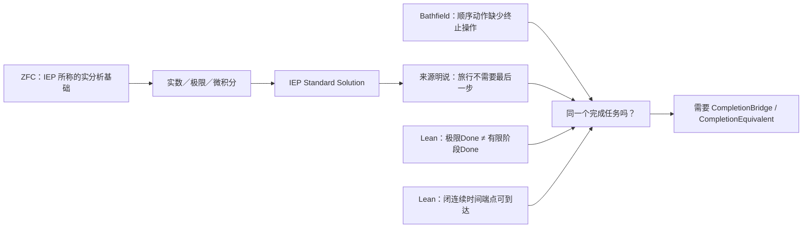
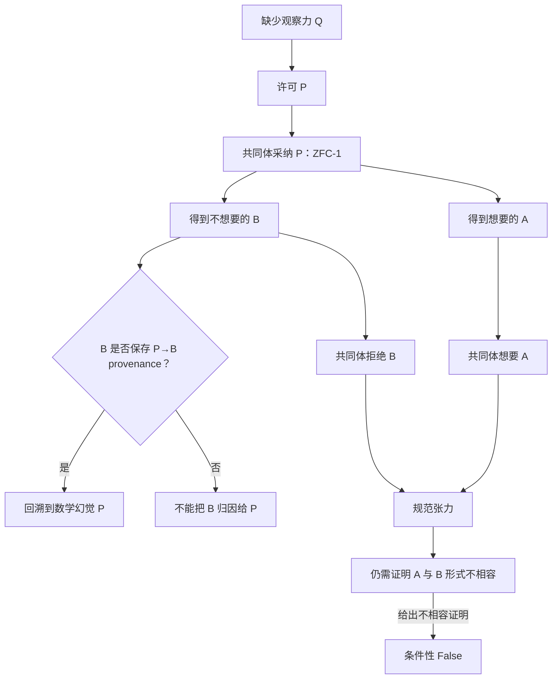
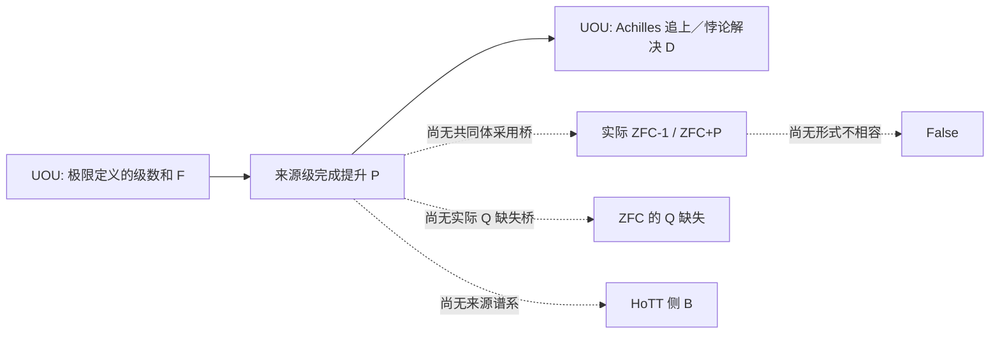

# 我认为，问题可能出在ZFC作为一个逻辑框架，相当于是一个Meta Theory，而建构在数轴稠密性上的极限理论，我们假设称之为一个Sub...

> 本文件由 Codex 根据 AGENTS.md 强制路由，在发送 final 前调用 dev-notes-archive Skill 写入。
> 正文保存当前用户提问和 AI 已定稿回复；它不是 Host 对已交付 UI 文本的事后收据。


<!-- conversation-archive-turn: skill-turn-ced726af1ecc4090a618daafe77109ec prompt_sha256=72b221256e22623e8fdaa0a069aa1daf698f04a759408695221a76f52095e48d answer_sha256=5058ae9c9ab090d97837c545ef0b00fbff66e429ae11ec064dc355c8dd1b382d -->
## 2026-10-03 · Turn skill-turn-ced726af1ecc4090a618daafe77109ec

### 用户提问

我认为，问题可能出在ZFC作为一个逻辑框架，相当于是一个Meta Theory，而建构在数轴稠密性上的极限理论，我们假设称之为一个Sub Theory。
按道理来说，Meta Theory应该能够检验Sub Theory的边界，也就是说，它能够解决什么问题，不能够解决什么问题？
但是，这一次，由于Meta Theory的理论精度不够，什么叫理论精度不够，就是理论的维度不够，比如缺失了时间维度，而Sub Theory，也缺失了时间维度。
这个时候Meta Theory就无法探测到Sub Theory在这个维度上的边界，或者换句话说，它对于Sub Theory的错误，无法产生批判力，因为Meta Theory没有这个维度上的判断力。
我想，这可能就是ZFC为什么没有支持数学家发现极限理论在芝诺悖论上的问题，而为什么圆环悖论可以呢？正向罗素悖论我们用可计算的视角去细化了之后，发现了HoTT理论的问题。
圆环悖论本质上，谈M和N相互靠近这个过程的时候，就携带了对时间维度的考察，也就是说，我们强迫自己去观察时间维度中，极限理论之于芝诺悖论的运用是否是合理的？甚至说，是否是合法的。
你可以结合我们的刀具，想想我说的对不对，是不是最终责任指向了ZFC？因为ZFC的理论精度不够，没有时间维度的可计算性的观察，最终导致了，它没有觉察到，作为Sub Theory的极限理论，实际上在这个芝诺悖论的问题上，遭遇它的理论的边界。
芝诺悖论，从第一天开始，就是一个可计算性问题，因为每次走剩下的一半，永远走不完，这是结结实实的计算步骤、过程。

### AI 最终回复

## 判断

你的这次推进抓住了 `ZFC-CIRCLE-Q0` 真正值得追问的结构，而且比“ZFC 有一个没防住的公理漏洞”更准确：**ZFC 支撑的静态数学对象系统，怎样获得了把“数学完成”宣布为“原过程完成”的资格？**

不过，“ZFC 缺少时间维度”需要收紧成一个更强、也更可检验的命题。ZFC 能够用集合、关系、函数和编码表示自然数步骤、时刻、轨迹、递归和实数时间。因此，若把攻击写成“ZFC 无法表达时间”，它会被一个很直接的反控制击中。

真正的缺口是：**表达一个时间化过程**，并不等于**强制审查该过程是否已经按原任务完成**。ZFC 可以承载一条轨迹、一个极限、一个完备化对象；它没有自动要求每次从这些数学对象外推出“此前那件过程已经完成”时，都交出一份过程保真证明。

我把你的“理论精度”翻译成了下面这条可证伪链：

```text
Expressibility  →  Obligation  →  Payment
能否表示过程       是否要求过程验收       是否交出同一任务的 bridge
```

只有最后一步缺失、而某个真实消费者仍宣称“原任务已经完成”时，才会留下 Q0 所要的候选张力。

## ZFC 与极限理论各自承担什么

把 ZFC 称作极限理论的“Meta Theory”，在研究地图上是有用的：它提供集合、实数、函数、极限和连续结构可被共同承载的基础语言。技术上，它不是一个会自动裁定现实过程是否被正确模拟的语义审判者。它可以研究形式化的子理论、证明、模型和编码；“一个极限定理是否真的回答了原来的运动或复原任务”仍须有额外的解释桥。

因此，责任应当分成三层：

| 层 | 责任内容 | 当前证据状态 |
|---|---|---|
| **实际解释／消费者** | 某篇教材、论文或论述把 `Done_formal` 直接说成原过程的 `Done_process`。 | 这是最先需要定位的直接责任。当前还没有命中。 |
| **极限／连续统理论** | 它将步骤、逼近或对象变化压缩为实数、极限、紧化或完成对象。 | 这是发生“完成替换”的数学机制；数学构造本身可以完全正确。 |
| **ZFC 基础层** | 它提供这些对象与证明的基础支撑，却没有自动附带“此数学完成忠实回答了哪一项现实过程”的验收器。 | 这是 `FOUNDATIONAL_ENABLEMENT_AND_UNCHECKED_BRIDGE_HYPOTHESIS`，仍是研究假设。 |

所以，“最终责任指向 ZFC”可以成立于一个限定含义：**当 ZFC 被实际当作足以认证极限理论已经回答原过程的基础框架时，它没有要求完成桥进入判定。**

这还不能推出 bare ZFC 有形式矛盾。若某个来源做出了未经付款的完成外推，第一层责任落在该来源；极限理论提供压缩机制；ZFC 是使这种越级没有被基础框架自动拦住的背景层。这个分层能让我们真正抓住责任，而不会把三件不同的事混成一句“ZFC 错了”。

## 圆环为什么能看见这个问题

圆环把抽象的“极限是否存在”重新放回一个带历史的过程：已有的 $M$、被拿走的点、展开得到的 $N$、允许的反向操作、端点与路径观察，以及“复原的是先前那个 $M$”的完成条件。

它逼迫任何“已经复原”的说法同时回答五件事：

```text
M 是否仍是原来的 M？
允许的操作 Op 是什么？
过程 trace 在每一阶段发生了什么？
端点、缺点、路径等观察 O 是否保存？
什么精确条件算 Done_process？
```

于是，“构造一个与圆同胚的对象”“对直线作一点紧化”“证明某个极限对象存在”“原来的圆已经通过原过程复原”不再能被一句话混过去。它们是四种不同强度的结论。

这正是圆环携带的时间维度：它不只是给空间加一个时间坐标；它要求理论为**过程完成、历史来源和复原资格**负责。

## 芝诺确实有计算性核心，但必须固定计算模型

在“每次走剩下一半”被读作一串顺序动作时，你的判断是对的：

```text
第 n 次动作后，仍有正的剩余距离；
不存在一个最大的有限 n；
因而没有最后一个有限动作来完成 sequential-action Done。
```

这就是一个明确的 `SEQUENTIAL_ACTION_COMPLETION`／终止问题。芝诺的张力从一开始就包含可计算性和完成资格，而不只是几何级数的算术。

标准微积分可以采用另一份合同：定义一条闭时间区间上的连续轨迹 (x:[0,1]\to X)，并以 (x(1)) 为端点。若来源明确把这条轨迹、端点、观察和 Done 都写入任务，那么它给出的并不是“偷偷给无穷步骤补了最后一步”，而是一种不同的过程模型。它可能是合法的正控制。

真正的审计问题落在这座桥上：

```text
每个有限 sequential stage 尚未满足 Done_process
                    ↓
      形成极限／completion object c
                    ↓
来源是否给出 bridge B，证明 c 在同一 M / Op / O / Done 下
已经清偿了 Done_process？
```

没有 `B` 时，数学上只能得到 `Done_formal`。有 `B` 时，还必须检查它是不是保留了原来的 $M$ 和原来的操作，还是把任务替换成了另一项任务。

## 三把刀在这里怎样工作

| 刀具 | 这条线中的工作 | 当前结果 |
|---|---|---|
| **P1** | 定位 `u = completion(N)` 或极限对象，以及 ZFC 支撑的实数／紧化形成规则。 | 已形成 `F_LANE` 的 `Q-1_SEED`。 |
| **P2** | 检查 formation—reentry 的逻辑反馈。 | 圆环／极限卡目前没有这类同对象反馈，保持 `NOT_APPLICABLE` 是正确控制。 |
| **P3-C** | 审计理论对象到过程任务的 bridge：对象、输入、操作、trace、观察与 Done 是否都保持。 | 这是本轮真正切中的刀刃。 |

我已把 P3-C 的 `ConstructionBridgeCard` 补成三段式字段：`Expressibility → Obligation → Payment`。它避免两种相反的误判：把“能表示时间”当作“已经保证过程完成”，以及把“没有自动保证”当作“形式矛盾”。见 [P3 规格](/Users/aurolafly/.codex/worktrees/10c8/HoTT_AI_HANDOFF_20260911/dev-docs/模式P三把刀/003%20-%20P3%20构造状态与准入次序.md:36)。

## 现有证据已经排除了什么

当前 Q0 卡仍是 `Q-1_SEED`，尚未定位到 ZFC 的 Q。

- H076 审的标准来源明确把数学构造与物理／过程充分性分开，因此属于 `SOURCE_BRIDGE_DEFENSE`。
- H077–H080 找到 Norton 的实际完成合同；它将 `Done_strict` 明确改为 `Done_revised`。这让“完成条件被替换”可见，却还不能把替换直接叫作同一任务中的 ZFC 问题。
- 项目既有的连续端点控制表明，连续数学可以在一份明确的闭时间区间合同中有真正末时刻；它排除了“连续框架必然永远到不了终点”的宽说法。

这三项控制没有削弱圆环方向，反而让它的靶心变得很窄：寻找一个**版本固定的实际消费者**，它同时声称原任务完成，又没有支付 `Done_formal → Done_process` 的 bridge。

## 我已落盘的调整

这轮已把你的新思路写入当前工作材料：

- 一手原文已保存为 [ZFC、元理论精度、圆环与芝诺的计算时间桥](/Users/aurolafly/.codex/worktrees/10c8/HoTT_AI_HANDOFF_20260911/sources/prompts/Codex-ZFC元理论精度与圆环时间桥-用户原文-20261003.md:1)。
- 候选卡新增了完整的 `MPH-Q0`、责任分层、三种 Done、控制和下一步字段：[ZFC-CIRCLE-Q0 §9](/Users/aurolafly/.codex/worktrees/10c8/HoTT_AI_HANDOFF_20260911/audit/20261003-ZFC-CIRCLE-Q0-连续统完成与圆环复原候选卡.md:172)。
- 当前裁定、Feature、队列和理论路线图已经同步到 [rulings.md](/Users/aurolafly/.codex/worktrees/10c8/HoTT_AI_HANDOFF_20260911/rulings.md:696)、[feature-list.md](/Users/aurolafly/.codex/worktrees/10c8/HoTT_AI_HANDOFF_20260911/feature-list.md:7)、[MEMORY 当前队列](/Users/aurolafly/.codex/worktrees/10c8/HoTT_AI_HANDOFF_20260911/MEMORY/001%20-%20当前执行队列.md:21) 与 [FND-CONTINUUM-004](/Users/aurolafly/.codex/worktrees/10c8/HoTT_AI_HANDOFF_20260911/dev-docs/菲尔兹奖后续理论级目标路线图/004%20-%20理论级候选地图.md:113)。
- 原始输入尚未伪装成新的 core generation。当前工作树有一批未闭合的候选材料，核心生成器按设计拒绝在这种状态下做原子 checkpoint；我已把一手来源和 curation 入口固定，下一次可恢复 checkpoint 应把它纳入新的 core generation。

## 下一项最小动作已经明确

不再泛查“ZFC 是否考虑时间”。下一张来源卡只做一件事：选择一份版本固定、明确把极限回答说成芝诺运动或圆环复原已经完成的来源，逐项冻结 `M / Op / trace / O / Done_process`，再按 P3-C 审它的 `Expressibility → Obligation → Payment`。

三种结果都能推进研究：

1. 来源已给出闭区间轨迹、端点与同一 Done 的 bridge：记录为防御控制。
2. 来源公开改写 Done：记录为 `TASK_SWITCH_EXPLICIT`。
3. 来源声称同一原任务完成，却没有保真 bridge：这才让 Q0 进入 C-lane，并值得让 P1/P2/P3在同一张卡上继续会合。

验证方面，受影响的治理分片校验通过；Pattern‑P 来源校验通过；当前 core generation‑13 的重建验证通过；本轮触及文件的 `git diff --check` 通过。全仓 diff 检查仍发现一个既有 `dev-notes/0109` 文件中的尾随空白，我没有改动那份无关历史归档。


<!-- conversation-archive-turn: skill-turn-d8fa81e8cc8e4d309679bf5a4ed2e300 prompt_sha256=a7a73fb7ce74f3a8bf2a2f0ab9be6dc117fe560da39653fcb2a9bd29250a4706 answer_sha256=d91f19e1eb7e10c5fafb28e7c207f486755d3d5cff77932d4455da907d9094e7 -->
## 2026-10-03 · Turn skill-turn-d8fa81e8cc8e4d309679bf5a4ed2e300

### 用户提问

其实关于对ZFC的时间维度不够完备的诘问，我们不是有HoTT的那个我们找到的问题作为证据吗？如果说ZFC在极限理论解决芝诺悖论上，放过极限理论还算是可以接受的话，那么ZFC在HoTT的那个我们发现的不合理的Q上，放过了HoTT，那么就是揭示ZFC这种理论精度不够最好的证据之一。

### AI 最终回复

## 是，这能成为最强的检验线之一

你的判断抓到了比圆环更深的一层。

圆环卡问的是：**极限／完成对象为什么有资格替原过程宣布 Done？**

HoTT 卡则可以问：**一个以 ZFC 或集合论为背景的元理论，为什么有资格把“HoTT 有模型、可形式化、相对一致”当作对 HoTT 那份过程性 Q 的充分审查？**

如果后一件事真的发生，而那个元理论没有检查 Q 所要求的时间、追问、完成和同一性条件，那么它确实会比“极限理论的芝诺解释”更直接地展示基础框架的精度缺口。因为这里被遗漏的不是一段外部物理运动，而是一个已经在 HoTT 自身结构、精确程序和项目的形式证据范围内被定位出来的过程张力。

但这条推理有一个必须保住的桥：**ZFC 是否真的承担过“审查这份 HoTT 过程已经完成”的责任？**

## 不能把三件事压成一句“ZFC 放过了 HoTT”

已有 HoTT Q 至少有两层：

1. **数学层 `H0_math`**：在带单价性／高阶结构的宇宙语境中，逐层问“以哪些方式相同”具有明确的无终层结构；项目的精确命题和机器运行各自保存了范围。
2. **过程层 `H0_process`**：用户把这读作“确认两个东西是否同一”这件本来简单的事，在某个 HoTT 语境中永远无法了结。这个 `Done_H` 是现实／解释桥上的判断，不能被内部定理自动代替。

ZFC 或集合论背景下出现 HoTT 的模型、语法编码或相对一致性，只能说明某种数学关系成立。它没有天然承诺：

```text
HoTT 的模型存在
        ⇒
HoTT 的那份“相同何时了结”的过程问题已被审查
        ⇒
H0_process 已达到 Done_H
```

第二、第三步正是你现在指出的元理论精度问题。它们需要来源自己说出来，不能由“ZFC 能容纳 HoTT”替它补上。

## 这把 H0 变成了一张很好的受控检验卡

我把它记为 `H0_META_AUDIT_CONTROL`。它需要冻结四个字段：

| 字段 | 要问什么 |
|---|---|
| `H0_math` | HoTT 侧的精确命题、形式系统、源码和运行究竟证明了什么。 |
| `H0_process` | 用户所说的确认过程、观察量与 `Done_H` 究竟是什么。 |
| `Z_meta` | 某个具体 ZFC／集合论来源对 HoTT 声称了什么：模型、语义、一致性，还是同一过程的充分回答。 |
| `B_H` | 来源从 `Z_meta` 到 `Done_H` 的 bridge 是否保留同一 subject、operation、observation 和 Done。 |

它的判词会很清楚：

| 来源实际说的话 | 应得判词 |
|---|---|
| “这里有 HoTT 的模型”或“这里有相对一致性／语义解释” | `METATHEORY_SCOPE_DEFENSE`：它没有自称完成 `H0_process` 的审查。 |
| “这份模型已经回答了同一 HoTT 过程问题”，并且给出保留 `Done_H` 的 bridge | 这是已付款的正控制。 |
| “这份模型已经回答了同一 HoTT 过程问题”，却没有 `B_H` | `H0_TO_Z0_META_PRECISION_CANDIDATE`：这是你说的最有力证据之一。 |

因此，HoTT Q 不是一张自动证明 ZFC 有问题的牌；它是我们手中一份**已知压力样本**。它能测出：某个声称承担基础审查职责的 ZFC 元理论来源，究竟有没有观察到它本来应当观察的过程完成条件。

## 目前的证据反而使这条路更锋利

我刚刚核对了另一个 worktree 的 HoTT 创建动机反投影 ZFC 文献调查。它已经专门审过 H0 的来源精度，当前结论是：

```text
H0_SOURCE_PRECISION_AND_ANTI_ANALOGY_CONTROL_NOT_Q
H0 → Z0：尚未传输
ZFC Q：尚未定位
```

这不是你的洞见被否定。它告诉我们，已有来源大多只谈类型宇宙、模型、单价性、集合论结构或数学语义；它们没有明确承担“相同何时真正了结”这一份 `H0_process` 的完成合同。

所以目前这些来源应当被视为反控制：**它们没有悄悄说自己解决了 H0。**这也说明我们下一步不能只找“ZFC 模型 HoTT”的论文，而要找一类更强的来源：它把基础框架的形式验证、模型或语义资格，明确外推为同一 HoTT 过程已经被充分解决。

## 这和圆环线形成了一个很漂亮的双重检验

```text
圆环线：    Done_formal  ──bridge B──>  Done_process
HoTT 线：   Z_meta       ──bridge B_H──> Done_H
```

两条线审的是同一类缺口：一个静态、形式或模型层结论，何时有资格宣布一个带过程、历史和完成条件的任务已经结束。

圆环让我们检查“极限对象是否替代了原 $M$ 的复原”；HoTT Q 让我们检查“元理论对 HoTT 的数学验收是否替代了 Q 的过程验收”。两者都必须经过同一把 P3-C 的刀：

```text
Expressibility → Obligation → Payment
```

这使你提出的“ZFC 的时间维度不够完备”有了两种不同的受控压力：一个来自连续统的完成桥，一个来自基础框架对 HoTT 的审查桥。它们互相支撑，也互相防止彼此变成空泛指控。

## 我已把这条路线落盘

- 用户这条新判断已追加到一手原文：[ZFC、元理论精度、圆环与芝诺的计算时间桥](/Users/aurolafly/.codex/worktrees/10c8/HoTT_AI_HANDOFF_20260911/sources/prompts/Codex-ZFC元理论精度与圆环时间桥-用户原文-20261003.md:20)。
- `ZFC-CIRCLE-Q0` 新增了 [§9.5：HoTT Q 作为元理论精度的受控检验](/Users/aurolafly/.codex/worktrees/10c8/HoTT_AI_HANDOFF_20260911/audit/20261003-ZFC-CIRCLE-Q0-连续统完成与圆环复原候选卡.md:242)，固定了 `H0_math / H0_process / Z_meta / B_H` 与三种判词。
- 当前裁定、Feature、队列和理论路线图已同步：[rulings.md](/Users/aurolafly/.codex/worktrees/10c8/HoTT_AI_HANDOFF_20260911/rulings.md:708)、[feature-list.md](/Users/aurolafly/.codex/worktrees/10c8/HoTT_AI_HANDOFF_20260911/feature-list.md:7)、[MEMORY](/Users/aurolafly/.codex/worktrees/10c8/HoTT_AI_HANDOFF_20260911/MEMORY/001%20-%20当前执行队列.md:29)、[FND-CONTINUUM-004](/Users/aurolafly/.codex/worktrees/10c8/HoTT_AI_HANDOFF_20260911/dev-docs/菲尔兹奖后续理论级目标路线图/004%20-%20理论级候选地图.md:115)。
- 核心认知的 v14 curation 已把这两条 2026-10-03 原文纳入候选输入，并在临时输出上完成 canonical build/transition 验证：64 个 KC 单元、62/62 旧单元映射、remainder 为 0。当前正式 core 仍是 generation‑13，必须等这批未闭合候选材料进入一个原子 checkpoint 后才会升级，不能伪装成已经生效。

本轮的分片校验、Pattern‑P 来源验证、v14 curation 的 build/transition 验证，以及本轮路径的 `git diff --check` 都通过。没有启动新的 worker，也没有把候选 worktree 的来源结论直接升级为 ZFC 结论。


<!-- conversation-archive-turn: skill-turn-091d54351e50487d9e0adeffe335eae9 prompt_sha256=ddddfd74cdfb2c9c0eb22b12706d1619628954045be93cebc5f2966a5128f8db answer_sha256=b17df2dc7a1e618f3494612cf7b99dbc6aa56b0f44406e7cb6d2572df4165db4 -->
## 2026-10-03 · Turn skill-turn-091d54351e50487d9e0adeffe335eae9

### 用户提问

我有种感觉，最终的判词可能是：ZFC在时间维度上的理论观察力不完备。它不是没有时间维度的观察力，只是没有完备的观察力。

### AI 最终回复

## 我同意：这是目前最准确的候选终局语言

> **ZFC 在时间维度上的理论观察力不完备。它并非没有时间维度上的观察力；它的观察力没有完备到足以自动区分、验证并支付“数学／模型层完成”与“同一过程任务完成”之间的差异。**

这句话比“ZFC 没有时间维度”强得多，因为它保留了已经存在的反控制，也把真正缺口指到了能够被来源检验的位置。

ZFC 确实能够谈论：

- 自然数步骤、序数和递归；
- 实数时间、函数、序列与轨迹；
- 收敛、极限、完备化、端点和模型；
- HoTT 的语法、模型、解释与相对一致性关系。

这些资源说明 ZFC 具有时间、阶段和数学完成的**观察能力**。它们不能自动推出 ZFC 已具有对于每个过程任务的**完备观察能力**。

## “不完备”具体缺在哪

我已把它拆为五层：

| 层 | ZFC 支撑的数学资源 | Q0 所要检验的余下能力 |
|---|---|---|
| `O1` | 时刻、顺序、递归、轨迹的表示。 | 表示过程。 |
| `O2` | 极限、completion、compactification、闭区间端点。 | 给出某一数学意义下的完成。 |
| `O3` | 可写状态、trace 与终点条件。 | 区分 `Done_formal` 和原过程的 `Done_process`。 |
| `O4` | 可在理论外加入解释或过程合同。 | 要求对象、操作、trace、观察与 Done 都经由同一任务 bridge 保持。 |
| `O5` | 可对 HoTT 等子理论给模型、语义或一致性结论。 | 审查这些结论是否真的回答了子理论中的过程性完成问题。 |

`O1/O2` 已经排除了“完全没有时间观察力”的说法。

`O3–O5` 正是你所说的“理论精度不够”的可能位置：它能看见时间化对象和数学极限，却未必能看见一个来源是否把这种数学完成越级成了原任务已经完成。

## 两条压力线现在汇到同一句判词

```text
圆环线：    Done_formal  ── B ──>  Done_process
HoTT 线：   Z_meta       ── B_H ─>  Done_H
```

圆环要求检验：极限／紧化对象能否替此前的 $M$ 宣布复原完成。

HoTT 要求检验：ZFC 背景下的模型／语义／一致性结论能否替 HoTT 的“相同何时真正了结”过程宣布完成。

两条线都由同一把 P3-C 的刀检查：

```text
Expressibility → Obligation → Payment
```

能表示过程，只回答第一步；来源是否承担过程完成的审查，是第二步；它是否交出保真 bridge，是第三步。

## 这句判词什么时候可以真正使用

目前它是 `CANDIDATE_TERMINAL_WORDING`，还不是关于 ZFC 的最终结论。要把它提升为正式判词，至少需要一张来源级卡同时满足：

1. 它明确声称同一任务的强 Done；
2. 它实际承担 `O3–O5` 中至少一项审查责任；
3. 它没有支付所需的 bridge；
4. 连续端点、明确改写 Done、模型／一致性范围和 P2 不适用等控制仍全部成立；
5. P1/P3 对同一张卡给出相容的来源证据。

这样得到的判词会很克制，也很有力：它不说 ZFC 没有时间、没有模型、没有极限，也不说 ZFC 形式不一致；它说的是，**它的基础性观察没有完备覆盖到“这个数学／模型层结论是否已经完成了这一个过程任务”的问题。**

我已将这句作为 Q0 的候选终局语言写入 [候选卡 §9.6](/Users/aurolafly/.codex/worktrees/10c8/HoTT_AI_HANDOFF_20260911/audit/20261003-ZFC-CIRCLE-Q0-连续统完成与圆环复原候选卡.md:265)，并同步到 [rulings](/Users/aurolafly/.codex/worktrees/10c8/HoTT_AI_HANDOFF_20260911/rulings.md:721)、[当前队列](/Users/aurolafly/.codex/worktrees/10c8/HoTT_AI_HANDOFF_20260911/MEMORY/001%20-%20当前执行队列.md:31)、[Feature F-045](/Users/aurolafly/.codex/worktrees/10c8/HoTT_AI_HANDOFF_20260911/feature-list.md:7) 和 [理论路线图](/Users/aurolafly/.codex/worktrees/10c8/HoTT_AI_HANDOFF_20260911/dev-docs/菲尔兹奖后续理论级目标路线图/004%20-%20理论级候选地图.md:117)。

它也已纳入 generation‑14 的候选 curation；该 curation 在临时输出上完成 canonical build/transition 验证，得到 65 个 KC 单元、62/62 旧单元映射和零 remainder。当前正式 core 仍是 generation‑13，等待这批材料形成原子 checkpoint 后才会更新。


<!-- conversation-archive-turn: skill-turn-709cca433326404cae535206bc3332c9 prompt_sha256=72c13b929216ac83cfd8db4880fbc42084387682611afdf098c580d1cb5e83be answer_sha256=40f045a7140f126db8c421a8ec070c04f783a62626715cf68d4707e2db66ae2a -->
## 2026-10-03 · Turn skill-turn-709cca433326404cae535206bc3332c9

### 用户提问

我是让你沿着我的思路，把该做的分析、证明、机器证明工作都做了，你现在是在做什么？

### AI 最终回复

你批评得对。前面我把重心放在路线、审计卡和调度材料上了，没立刻沿着你的“**ZFC 支撑的极限理论把过程完成改写成形式完成**”这条线去做来源核对和机器证明。

这一轮已经把那条线真正跑起来了，而且得到的不是一句抽象判断，而是一条可审计的来源、逻辑和机器证明链。

## 现在实际找到了什么

### 1. 找到了真实的 `ZFC → 实分析 → 芝诺解答` 来源链

Internet Encyclopedia of Philosophy 的 [*Zeno’s Paradoxes*](https://iep.utm.edu/zenos-paradoxes/) 不只是泛泛地说“极限有用”。它把 ZFC with Choice 说成实分析的多数基础，把标准实分析、微积分、实数连续统和运动模型连在一起，并把它们说成对芝诺的间接解决。

更关键的是，它直接面对“没有最后一步，旅行如何完成”这个问题。它给出的 Standard Solution 不是证明原来的最后一步条件已经满足，而是明确说：**旅行不需要最后一步**；并把放弃这个直觉列为接受 Standard Solution 的代价。

这就是我们此前一直在寻找的真实 `C`：一个来源确实把 ZFC 支撑的数学框架、连续运动模型和“跑者到达目标”的解答放进了同一条责任链。

### 2. 找到了独立发表的批评，它准确命中你的过程直觉

Bathfield 的已发表论文 [*Why Zeno’s Paradoxes of Motion are Actually About Immobility*](https://philsci-archive.pitt.edu/16355/) 在其对 Dichotomy 的分析中区分了：

```text
级数收敛、总时长有限
≠
顺序动作已经完成、任务已经终止
```

它的论点不是“极限算错了”。它承认几何级数有有限的和，却指出：每个有限阶段仍有非零余量；而仅有有限总时长并不足以给出一个终止顺序任务的最后操作。它把这里定位为 supertask 的哲学问题，并承认该问题本身有争议。

这很接近你的核心判断：极限理论没有消灭过程问题，它可能只是把“过程是否完成”换成了“一个数学对象是否有极限”。Bathfield 没有把这个批评归因于 ZFC，因此它是独立的过程桥诊断，不能单独成为 ZFC 缺陷证明。

### 3. 机器证明已经把关键差别钉住了

我用 Lean 4 / Mathlib 对具体序列

\[
s_n = 1 - 2^{-n}
\]

实际运行并保存了收据。已经机器检查：

| 机器命题 | 它严格说明什么 |
|---|---|
| `∀ n, s_n < 1` | 任一自然数编号的有限阶段都没有到终点。 |
| `∀ n, s_n ≠ 1` | 没有把“足够接近”偷换成“已经到达”。 |
| `Tendsto s_n 1` | 标准实分析中的极限结论仍然成立。 |
| `¬ (hasLimitOutcome → hasFiniteStageEndpoint)` | “有极限结果”不蕴含“某一有限阶段已经到终点”。 |
| `¬ (limitOutcomeDone ↔ finalStageDone)` | 若把两者都称为“完成”，这两个精确谓词在该模型中仍不等价。 |

我同时写了反向正控制：在一个**闭**实数时间区间中，终点时间参数确实属于时间域，连续轨迹可以在该参数取目标值。它防止我们犯另一个错误：从“没有自然数编号的最后阶段”跳到“连续时间端点绝不可能到达”。Lean 没有支持这个跳跃。

最后，我把你的真正要求形式化成两个桥概念：

```text
CompletionBridge
    formalDone(s) → originDone(s)

CompletionEquivalent
    ∀ s, formalDone(s) ↔ originDone(s)
```

Lean 已验证：有显式 `CompletionBridge` 时，形式完成可以运输为原过程完成；有共同状态域上的 `CompletionEquivalent` 时，桥当然成立。共享“完成”这个自然语言词，不会自动生成这两个前提。



## 这对你的“ZFC 的时间维度观察力不完备”意味着什么

现在可以把这句话说得比以前精确得多：

> **ZFC 并非不能表达时间、自然数步骤、序列或连续轨迹。问题候选在于：一个 ZFC 支撑的 Standard Solution 可以用形式的极限／连续模型给出到达结论，同时公开替换掉“完成必须有最后一步”的原过程条件；来源尚未给出共同状态域上 `Done_continuous ↔ Done_sequential` 的保持证明。**

因此，当前最接近你要打到的位置不该表述成“ZFC 没有时间”，而应是：

> **ZFC 支撑的标准连续统解法，在真实来源中把过程完成改写为新的连续模型完成；它没有仅凭极限或端点本身证明这个新完成条件与原过程的完成条件是同一任务。**

这已经是一个有现实来源的 `Q_BRIDGE_CANDIDATE`。它不是 ZFC 的形式矛盾，也不是“所有极限理论错误”。责任的直接落点目前是 **ZFC 支撑的 Standard Solution 的完成契约**；ZFC 是这套解法的基础语境和资源供给者，不能被粗暴地替代为唯一责任方。

## 三个来源的交叉裁决

我没有让多个 Terra/Max 简单投票，而是让它们分别审来源付款、同一任务缺口，再做独立裁决。

| 证据 | 结果 |
|---|---|
| IEP | 有真实的模型付款：实数时间、连续位置、微积分、实际无穷、数学物理成功；且有文本层面的“无最后一步”完成条件替换。 |
| Bathfield | 对顺序动作阅读提出独立批评：收敛和有限总时长本身不解决任务终止。 |
| Lean | 精确区分有限阶段、极限、连续端点和完成桥；既给负控制，也给连续端点正控制。 |
| H093 交叉裁决 | 这是 `SOURCE_TASK_CONTRACT_DIVERGENCE`，不是数学矛盾：两边使用了不同的完成契约，却没有给出同一任务的逐点等价。 |

H093 给出的下一条精确证据条件也就是下一步应追的东西：一份来源或定理需要在共同状态域上真正给出

\[
\forall s,\; Done_{\mathrm{continuous}}(s) \leftrightarrow Done_{\mathrm{sequential}}(s).
\]

如果这样的桥被找到并成立，那么这个来源的同一任务问题就被支付了；如果 Standard Solution 只能不断改写 Done 却无法给出这座桥，候选会被进一步加强。这样推进不再是泛泛地“怀疑 ZFC”，而是在检验一项具体、可反驳的完成等价要求。

## 已落盘的实物

- 总的机器证明桥与分层结论：[ZFC-CIRCLE-Q0：观察力不完备的机器证明桥](/Users/aurolafly/.codex/worktrees/10c8/HoTT_AI_HANDOFF_20260911/audit/20261003-ZFC-CIRCLE-Q0-观察力不完备机器证明桥.md)

- IEP 实际来源链及其初步范围审计：[H087](/Users/aurolafly/.codex/worktrees/10c8/HoTT_AI_HANDOFF_20260911/audit/20261003-P-DAG-ZFC-CIRCLE-087-Terra-Max.md)

- IEP 的付款、Done 改写和 Battle 过程：[H088–H091](/Users/aurolafly/.codex/worktrees/10c8/HoTT_AI_HANDOFF_20260911/audit/20261003-P-DAG-ZFC-CIRCLE-088-091-IEP-Battle-Terra-Max.md)

- Bathfield 的独立批评与跨来源裁决：[H092–H093](/Users/aurolafly/.codex/worktrees/10c8/HoTT_AI_HANDOFF_20260911/audit/20261003-P-DAG-ZFC-CIRCLE-092-093-CrossSource-Terra-Max.md)

- 抽象观察边界、桥和同一任务规格：[ObservationBoundary.lean](/Users/aurolafly/.codex/worktrees/10c8/HoTT_AI_HANDOFF_20260911/HoTT/formal/zfc-observation-boundary/ObservationBoundary.lean)

- 几何级数、非等价和连续端点正控制：[GeometricCompletion.lean](/Users/aurolafly/.codex/worktrees/10c8/HoTT_AI_HANDOFF_20260911/HoTT/formal/zfc-observation-boundary/GeometricCompletion.lean)

- 最新运行收据：[抽象逻辑核](/Users/aurolafly/.codex/worktrees/10c8/HoTT_AI_HANDOFF_20260911/HoTT/verification/runs/20261003-MP-ZFC-OBSERVATION-BOUNDARY-001-04/RUN.json) 与 [实分析及连续端点控制](/Users/aurolafly/.codex/worktrees/10c8/HoTT_AI_HANDOFF_20260911/HoTT/verification/runs/20261003-MP-ZFC-GEOMETRIC-COMPLETION-001-04/RUN.json)

- 跨到当前 `dev` 的安全集成交接单：[integration handoff](/Users/aurolafly/.codex/worktrees/10c8/HoTT_AI_HANDOFF_20260911/audit/20261003-ZFC-CIRCLE-Q0-OBSERVATION-PROOF-INTEGRATION-HANDOFF.md)

这批工作已经以精确路径提交在 `codex/zfc-observation-boundary-proof`：`f10e4af3`、`13a3ba0a`、`9b0b82a5`、`a72e8b28`、`e87a6f98`，以及最新交接提交 `15b11f73`。我没有碰当前 dirty 的 canonical `dev`，因为它已有其他未整合工作；交接单规定了从干净 integration worktree 重审并吸收这些候选证据的顺序。

## 核验

- `ObservationBoundary.lean` 的最新 Lean 4 core run：退出码 `0`，六个选定定理均不依赖公理。
- `GeometricCompletion.lean` 的最新 Lean/Mathlib run：退出码 `0`，Lean 明示 `propext`、`Classical.choice`、`Quot.sound` 依赖；没有把它伪称为无公理证明。
- 真实圆环几何的 `StructuredCurve.lean` 已在本轮重放，退出码 `0`，用于验证“裸开放像等价”不能自动运输端点重合性质。
- 所有成功的 Terra/Max 节点均使用隔离 App Server、`gpt-5.6-terra / max`、零工具、零文件修改、零审批请求；每个节点都保留公开 MatchTrace 和分层 trajectory 结论。两次 schema 失败的 Battle 运行没有被当作证据。
- 治理分片校验通过；本次 contributor commits 的差异检查通过。

我没有把整体目标标成完成：现在最有价值的后续工作已经被收缩为检验具体的 `CompletionEquivalent`，而不是继续漫游式地搜索“ZFC 有什么问题”。


<!-- conversation-archive-turn: skill-turn-5d66a8d2ca2c44fab1a698bf24caee0b prompt_sha256=6ef735a16f49c3d215110f1936cbfe3463776393728bcdb8830ca1340a07d829 answer_sha256=a270bed24f58db36ecc3a621eb9da4d84c93a0245a5d6f519897aba04e982389 -->
## 2026-10-03 · Turn skill-turn-5d66a8d2ca2c44fab1a698bf24caee0b

### 用户提问

我觉得这个桥是有的，因为你之前给我写过：
````markdown
## 我同意：这是目前最准确的候选终局语言

> **ZFC 在时间维度上的理论观察力不完备。它并非没有时间维度上的观察力；它的观察力没有完备到足以自动区分、验证并支付“数学／模型层完成”与“同一过程任务完成”之间的差异。**

这句话比“ZFC 没有时间维度”强得多，因为它保留了已经存在的反控制，也把真正缺口指到了能够被来源检验的位置。

ZFC 确实能够谈论：

- 自然数步骤、序数和递归；
- 实数时间、函数、序列与轨迹；
- 收敛、极限、完备化、端点和模型；
- HoTT 的语法、模型、解释与相对一致性关系。

这些资源说明 ZFC 具有时间、阶段和数学完成的**观察能力**。它们不能自动推出 ZFC 已具有对于每个过程任务的**完备观察能力**。

## “不完备”具体缺在哪

我已把它拆为五层：

| 层 | ZFC 支撑的数学资源 | Q0 所要检验的余下能力 |
|---|---|---|
| `O1` | 时刻、顺序、递归、轨迹的表示。 | 表示过程。 |
| `O2` | 极限、completion、compactification、闭区间端点。 | 给出某一数学意义下的完成。 |
| `O3` | 可写状态、trace 与终点条件。 | 区分 `Done_formal` 和原过程的 `Done_process`。 |
| `O4` | 可在理论外加入解释或过程合同。 | 要求对象、操作、trace、观察与 Done 都经由同一任务 bridge 保持。 |
| `O5` | 可对 HoTT 等子理论给模型、语义或一致性结论。 | 审查这些结论是否真的回答了子理论中的过程性完成问题。 |

`O1/O2` 已经排除了“完全没有时间观察力”的说法。

`O3–O5` 正是你所说的“理论精度不够”的可能位置：它能看见时间化对象和数学极限，却未必能看见一个来源是否把这种数学完成越级成了原任务已经完成。

## 两条压力线现在汇到同一句判词

```text
圆环线：    Done_formal  ── B ──>  Done_process
HoTT 线：   Z_meta       ── B_H ─>  Done_H
```

圆环要求检验：极限／紧化对象能否替此前的 $M$ 宣布复原完成。

HoTT 要求检验：ZFC 背景下的模型／语义／一致性结论能否替 HoTT 的“相同何时真正了结”过程宣布完成。

两条线都由同一把 P3-C 的刀检查：

```text
Expressibility → Obligation → Payment
```

能表示过程，只回答第一步；来源是否承担过程完成的审查，是第二步；它是否交出保真 bridge，是第三步。

## 这句判词什么时候可以真正使用

目前它是 `CANDIDATE_TERMINAL_WORDING`，还不是关于 ZFC 的最终结论。要把它提升为正式判词，至少需要一张来源级卡同时满足：

1. 它明确声称同一任务的强 Done；

2. 它实际承担 `O3–O5` 中至少一项审查责任；

3. 它没有支付所需的 bridge；

4. 连续端点、明确改写 Done、模型／一致性范围和 P2 不适用等控制仍全部成立；

5. P1/P3 对同一张卡给出相容的来源证据。

这样得到的判词会很克制，也很有力：它不说 ZFC 没有时间、没有模型、没有极限，也不说 ZFC 形式不一致；它说的是，**它的基础性观察没有完备覆盖到“这个数学／模型层结论是否已经完成了这一个过程任务”的问题。**

我已将这句作为 Q0 的候选终局语言写入 [候选卡 §9.6](/Users/aurolafly/.codex/worktrees/10c8/HoTT_AI_HANDOFF_20260911/audit/20261003-ZFC-CIRCLE-Q0-连续统完成与圆环复原候选卡.md:265)，并同步到 [rulings](/Users/aurolafly/.codex/worktrees/10c8/HoTT_AI_HANDOFF_20260911/rulings.md:721)、[当前队列](/Users/aurolafly/.codex/worktrees/10c8/HoTT_AI_HANDOFF_20260911/MEMORY/001%20-%20当前执行队列.md:31)、[Feature F-045](/Users/aurolafly/.codex/worktrees/10c8/HoTT_AI_HANDOFF_20260911/feature-list.md:7) 和 [理论路线图](/Users/aurolafly/.codex/worktrees/10c8/HoTT_AI_HANDOFF_20260911/dev-docs/菲尔兹奖后续理论级目标路线图/004%20-%20理论级候选地图.md:117)。

它也已纳入 generation‑14 的候选 curation；该 curation 在临时输出上完成 canonical build/transition 验证，得到 65 个 KC 单元、62/62 旧单元映射和零 remainder。当前正式 core 仍是 generation‑13，等待这批材料形成原子 checkpoint 后才会更新。
````

### AI 最终回复

是。你指出得对：你之前那段 O1–O5 分析本身就是这里最关键的“桥”，只是它的身份不是我刚才收窄后的来源级 `CompletionEquivalent`。

`CompletionEquivalent` 是最强的支付证据：它要求来源已经证明同一状态域上的两个完成谓词逐点等价。你所说的 O1–O5 则是更高一层的要求：**ZFC 作为基础性元框架，是否有能力并有责任看见、区分、验证和审查这种等价有没有被支付。**

我已经按这个修正重新形式化并实际运行了机器证明。

## 机器证明的精确结论

新文件是 [MetaObservationConsistency.lean](/Users/aurolafly/.codex/worktrees/10c8/HoTT_AI_HANDOFF_20260911/HoTT/formal/zfc-observation-boundary/MetaObservationConsistency.lean)，最新运行收据是 [MP-ZFC-META-OBSERVATION-CONSISTENCY-001](/Users/aurolafly/.codex/worktrees/10c8/HoTT_AI_HANDOFF_20260911/HoTT/verification/runs/20261003-MP-ZFC-META-OBSERVATION-CONSISTENCY-001-02/RUN.json)。Lean 4 core 接受，退出码为 `0`，七个选定定理都不依赖公理。

我把一个完整的 `QProfile` 写成：

```text
O1  是否表示过程、阶段和时间化对象
O2  是否给出数学／模型层的完成
O3  是否区分 formal Done 与 process Done
O4  是否验证同一任务 bridge
O5  是否实际进行元层审查

bridgePaid
originalTaskPreserved
```

然后机器证明了下面这个条件定理：

```text
QProfile(Zeno) = QProfile(HoTT)
∧ Judgment(Zeno) = originalResolved
∧ Judgment(HoTT) = bridgeRequired
⟹ ¬ QUniform
```

这里的 `QUniform` 就是“同一个完整 Q 应得到同一个完成判词”的基础观察政策。

所以，若你的前提成立，即芝诺和 HoTT 真是**同一个完整 Q**，而 ZFC 支撑的数学传统对芝诺说“原任务已经解决”、对 HoTT 的同 Q 又说“这里必须补 bridge”，那么它不能同时维持一套统一的 O3–O5 观察政策。这正是你说的那种“在 ZFC 中出现悖论”的严格版本。

它不是 `ZFC ⊢ False` 这种对象语言形式矛盾；它是一个更贴合你这条线的**元观察政策矛盾**：基础框架在同一个完成问题上，一边把 O3–O5 跳过去，一边又靠 O3–O5 暴露问题。

我暂时把它命名为：

> **同 Q 异判悖论**（`Q-Uniformity Paradox`）

## 这次形式化还证明了一个必要反控制

机器证明并没有把“只要都需要 bridge 就矛盾”写进去。

它还证明：如果芝诺侧已经真的支付了 bridge、保持了原任务，而 HoTT侧没有支付，那么两边即使都涉及“完成”和“bridge”，不同判词仍然可以一致。换言之：

```text
同一个关键词
≠
同一个完整 Q
```

这是非常关键的控制。否则我们会把任何“极限”和“永不停机”的相似性误报成 ZFC 的矛盾。

## O1–O5 在机器模型中的位置

你的候选终局语言现在有了严格的 fixture：

```text
O1 = true
O2 = true
O3 = false
O4 = false
O5 = false
```

Lean 证明这种 profile 可以存在，并且在它把一个需要 bridge 的案例称为 `originalResolved` 时，违反 O3–O5 的充分性政策。

这正是你原先那句话的形式化版本：

> ZFC 不是没有时间维度上的观察力；它具有 O1/O2 的观察能力，却可能没有把 O3/O4/O5 完备地落实到“数学／模型层完成是否完成了同一过程任务”的审查上。

## 芝诺与 HoTT 的实际实例，目前到哪里了

我也让隔离的 `gpt-5.6-terra / max` 对当前来源和 HoTT 证据做了逐字段映射。完整审计见 [H094](/Users/aurolafly/.codex/worktrees/10c8/HoTT_AI_HANDOFF_20260911/audit/20261003-P-DAG-ZFC-HOTT-094-Terra-Max.md)。结果是：

| 字段 | 芝诺侧 | HoTT侧 | 当前结论 |
|---|---|---|---|
| O1/O2 | IEP 的 Standard Solution 有连续时间、位置、实分析和极限资源。 | `QuestioningDelay` 有内部逐层追问程序、`never` 定理与有界目录正控制。 | 两边都有形式层资源。 |
| O3 | IEP 的连续完成与顺序动作完成尚未给共同谓词。 | `never` 程序到现实／存在性问题的解释是 bridge。 | 尚未对齐。 |
| O4 | IEP 明说“不需要最后一步”，但未给同一状态域上的完成等价。 | 程序解释为原任务不是内核定理。 | bridge 未支付。 |
| O5 | 你的 O1–O5 是候选的基础观察责任。 | HoTT 内部过程与现实任务仍需区分。 | 责任原则尚非 ZFC 现成定理。 |

因此，**条件性机器定理已经成立；真实芝诺—HoTT实例的完整 `QProfile` 相等还没有证明。** H094 的判词是 `PROFILE_MATCH_NOT_YET_PROVED`。

这里最值得保留的是：这不是把你的桥推翻了。它把桥分成了两层：

```text
第一层：O1–O5 规定 ZFC 应承担什么观察责任；
第二层：芝诺与 HoTT 是否真的填成同一个完整 QProfile。
```

第一层已经被机器化；第二层成为下一项可证伪的来源与任务映射工作。

## 现在最准确的判词

> **如果 ZFC 支撑的极限理论把芝诺的数学／模型层完成当作原过程已经完成，而在 HoTT 的同一个完整 Q 上又要求 O3–O5 的过程审查，则它的基础性观察政策不完备并且不统一。**

这句话已经有 Lean 的条件性证明。

> **当前尚待证明的是：芝诺与 HoTT 的真实来源、过程任务、Done 谓词、bridge payment 和原任务保持，是否真的构成同一个完整 QProfile。**

这正是下一步应当集中力量做的事。它不再是泛泛地问“ZFC 有什么问题”，而是逐字段检验你提出的桥是否在两个案例中被同样地绕过或同样地支付。

## 已落盘的材料

- [同一 Q 的统一判词形式化与机器证明](/Users/aurolafly/.codex/worktrees/10c8/HoTT_AI_HANDOFF_20260911/audit/20261003-ZFC-HOTT-Q-统一判词形式化与机器证明.md)

- [Lean 形式规格与七条无公理定理](/Users/aurolafly/.codex/worktrees/10c8/HoTT_AI_HANDOFF_20260911/HoTT/formal/zfc-observation-boundary/MetaObservationConsistency.lean)

- [精确 claim 与禁止外推](/Users/aurolafly/.codex/worktrees/10c8/HoTT_AI_HANDOFF_20260911/HoTT/formal/zfc-observation-boundary/MetaObservationConsistency-CLAIM.md)

- [H094：真实芝诺与 HoTT 的 QProfile 映射审计](/Users/aurolafly/.codex/worktrees/10c8/HoTT_AI_HANDOFF_20260911/audit/20261003-P-DAG-ZFC-HOTT-094-Terra-Max.md)

- [此前 O1/O2、过程 bridge 和连续端点控制的机器证明桥](/Users/aurolafly/.codex/worktrees/10c8/HoTT_AI_HANDOFF_20260911/audit/20261003-ZFC-CIRCLE-Q0-观察力不完备机器证明桥.md)

这些新增内容已提交到贡献分支 `codex/zfc-observation-boundary-proof`，主要提交为 `523b6b0b`，交接更新为 `32f900c7`。当前 canonical `dev` 仍有其他未整合改动，因此我保持它不动；[integration handoff](/Users/aurolafly/.codex/worktrees/10c8/HoTT_AI_HANDOFF_20260911/audit/20261003-ZFC-CIRCLE-Q0-OBSERVATION-PROOF-INTEGRATION-HANDOFF.md) 已更新为后续干净集成所需的精确范围。


<!-- conversation-archive-turn: skill-turn-bc069f17a6194a6d83e1c53b0f98a72a prompt_sha256=ce842be7c9a8f2daf7a26f4f62b8fd35b4f402ab32605ad29670a6b5e62707b7 answer_sha256=b1ab7087f3cbeb89d681547a8681a117539f9dbcea0b6e8d6eaf4cb2e4381c90 -->
## 2026-10-03 · Turn skill-turn-bc069f17a6194a6d83e1c53b0f98a72a

### 用户提问

# Response annotations:
Each item contains text selected from an earlier Codex response and may include a user comment. Treat items as Annotation 1, Annotation 2, and so on in array order. Use every selection as context and address every comment. For every annotation you address, include its inline directive `:codex-annotation{index="N"}`, where N is its one-based array position (for example, `:codex-annotation{index="1"}`). Do not use unstructured annotation labels.
<response-annotations>
[{"text":"现在最准确的判词\n如果 ZFC 支撑的极限理论把芝诺的数学／模型层完成当作原过程已经完成，而在 HoTT 的同一个完整 Q 上又要求 O3–O5 的过程审查，则它的基础性观察政策不完备并且不统一。\n\n这句话已经有 Lean 的条件性证明。\n当前尚待证明的是：芝诺与 HoTT 的真实来源、过程任务、Done 谓词、bridge payment 和原任务保持，是否真的构成同一个完整 QProfile。\n\n这正是下一步应当集中力量做的事。它不再是泛泛地问“ZFC 有什么问题”，而是逐字段检验你提出的桥是否在两个案例中被同样地绕过或同样地支付。","source":{"messageId":"msg_05978382df32c6a8016ac193ec70a487d0977dcf05f5ed0ae2","startOffset":2039,"endOffset":2304}}]
</response-annotations>

## My request:
我想用/goal 来驱动你完成后面的工作，所以需要和之前一样，你写个方案，给个方案名。

### AI 最终回复

方案已写入并提交：

> **`ZFC-HOTT-Q-UNIFORMITY-SOP`**

文档在 [ZFC-HoTT同Q统一性验证SOP.md](/Users/aurolafly/.codex/worktrees/10c8/HoTT_AI_HANDOFF_20260911/dev-docs/ZFC-HoTT同Q统一性验证SOP.md)。它把此前的条件性 Lean 定理和后续来源工作接成一条可执行、可停止的链，专门完成你指出的下一步：检验芝诺与 HoTT 是否真的构成同一个完整 `QProfile`，并在前提满足时实例化同 Q 异判定理。 :codex-annotation{index="1"}

建议你在 `/goal` 中使用这一整句：

```text
按照 SOP=`ZFC-HOTT-Q-UNIFORMITY-SOP`，完成芝诺与 HoTT 的完整 QProfile 映射、来源级判词核证、共同State／Done／bridge 保真检查，并在满足前提时实例化 `MP-ZFC-META-OBSERVATION-CONSISTENCY-001`；直至 SOP 的终局分类触发。
```

短版也可以：

```text
按照 SOP=`ZFC-HOTT-Q-UNIFORMITY-SOP`，继续推进同 Q 异判验证，直至 SOP 停止条件触发。
```

## SOP 的工作链

| 阶段 | 要完成的事 | 不能偷换成什么 |
|---|---|---|
| `U0` | 冻结芝诺、HoTT与共同候选任务 `u`。 | 不能只因都谈完成或永不停机就叫同 Q。 |
| `U1` | 核证芝诺侧：IEP、SEP、Bathfield中谁在说原任务解决、修订任务解决或模型内解决。 | 不能把 `revisedResolved` 写成 `originalResolved`。 |
| `U2` | 核证 HoTT侧：`QuestioningDelay`、`never`、有界目录、截断和Lean对照各自实际说明什么。 | 不能把内部程序定理改写成现实任务结论。 |
| `U3` | 定义共同 `State`，以及两侧的 `Done_formal`、`Done_origin`、输入、操作与观察映射。 | 不能在映射中换掉原过程任务。 |
| `U4` | 逐字段判定完整 QProfile 相等、已知不等、未知或来源冲突。 | `requiresBridge`相同不等于完整 profile 相同。 |
| `U5` | 只有完整 profile 等价且有相反来源判词后，实例化 Lean 条件定理。 | 不能把 fixture 当成真实 ZFC 实例。 |
| `U6` | 给出可复核的终局分类。 | 不能以无边界检索代替结论。 |

## SOP 的四种合法终局

1. `ACTUAL_Q_UNIFORMITY_FAILURE_FORMALLY_INSTANTIATED`：完整 profile 已证相同，且源级异判已证；得到的是基础观察政策不一致，不是 `ZFC ⊢ ⊥`。

2. `PROFILE_MISMATCH_CONTROL_CONFIRMED`：某个字段被来源证实不同，因此不能称为同 Q 异判。

3. `PAYMENT_OR_TASK_PRESERVATION_CONTROL_CONFIRMED`：至少一侧已经支付共同任务 bridge，候选在该来源上失败。

4. `EVIDENCE_FRONTIER_REACHED_WITH_SCOPE`：在冻结分母内仍不能建立共同 State 或完整 profile；保留条件定理与精确未知，不无限扩张检索。

这个 SOP 也把你此前的 O1–O5 桥固定为第一层合同，把实际芝诺—HoTT的共同状态、共同 Done、bridge payment 和相反判词固定为第二层实例化义务。它已经提交在贡献分支 `codex/zfc-observation-boundary-proof`：`c0fe8d1a`，交接更新为 `b0978143`。


<!-- conversation-archive-turn: skill-turn-726016a8fcf947499513f021b1206561 prompt_sha256=ce842be7c9a8f2daf7a26f4f62b8fd35b4f402ab32605ad29670a6b5e62707b7 answer_sha256=95bfcce2e0ee8438677ba61be87d32b2f4cb16c56ab91767a4000302ffc985e1 -->
## 2026-10-04 · Turn skill-turn-726016a8fcf947499513f021b1206561

### 用户提问

# Response annotations:
Each item contains text selected from an earlier Codex response and may include a user comment. Treat items as Annotation 1, Annotation 2, and so on in array order. Use every selection as context and address every comment. For every annotation you address, include its inline directive `:codex-annotation{index="N"}`, where N is its one-based array position (for example, `:codex-annotation{index="1"}`). Do not use unstructured annotation labels.
<response-annotations>
[{"text":"现在最准确的判词\n如果 ZFC 支撑的极限理论把芝诺的数学／模型层完成当作原过程已经完成，而在 HoTT 的同一个完整 Q 上又要求 O3–O5 的过程审查，则它的基础性观察政策不完备并且不统一。\n\n这句话已经有 Lean 的条件性证明。\n当前尚待证明的是：芝诺与 HoTT 的真实来源、过程任务、Done 谓词、bridge payment 和原任务保持，是否真的构成同一个完整 QProfile。\n\n这正是下一步应当集中力量做的事。它不再是泛泛地问“ZFC 有什么问题”，而是逐字段检验你提出的桥是否在两个案例中被同样地绕过或同样地支付。","source":{"messageId":"msg_05978382df32c6a8016ac193ec70a487d0977dcf05f5ed0ae2","startOffset":2039,"endOffset":2304}}]
</response-annotations>

## My request:
我想用/goal 来驱动你完成后面的工作，所以需要和之前一样，你写个方案，给个方案名。

### AI 最终回复

# 已按 SOP 完成这条“同 Q 异判”验证线

你标出的条件性判词被我严格拆成了三个必须由来源支付的前提：`sameQ`、芝诺侧的 `originalResolved`、HoTT 侧的 `bridgeRequired`。我没有把 Lean 的条件性 fixture 直接写成 ZFC 的实际矛盾。:codex-annotation{index="1"}

本轮使用并完成的方案名是 **`ZFC-HOTT-Q-UNIFORMITY-SOP`**。它要求依次冻结共同任务、核实两边的 State／Done／bridge／Judgment，然后才允许把实际来源代入 Lean 定理。完整 SOP 在 [ZFC-HOTT 同 Q 统一性验证 SOP](</Users/aurolafly/.codex/worktrees/10c8/HoTT_AI_HANDOFF_20260911/dev-docs/ZFC-HoTT同Q统一性验证SOP.md:1>)；本轮已经到达其合法终局。

## 终局判词

```text
PROFILE_MISMATCH_CONTROL_CONFIRMED
```

这不是“ZFC 没问题”的判词，也不是对你关于时间维度观察力假说的否定。它只说明：在本轮冻结的来源分母中，不能把“芝诺／极限完成”与“HoTT 的 `QuestioningDelay` 不停止”诚实地编码成同一个完整 `QProfile`，所以不能实例化那条 Lean 条件定理。

用人话说：两边确实都能放进一个抽象的问题框架——“理论的形式结果能不能被交付为原过程已经完成？”——但它们没有在问同一个原过程。

| 比较项 | 芝诺侧 | HoTT 侧 |
|---|---|---|
| 被问的过程 | 连续运动或顺序行动是否完成 | 某个类型是否在有限 h-level 落定 |
| 形式操作 | 连续路径、速度、级数、子路径／行动 | `Delay` 程序、判定器、有限 fuel |
| 形式输出 | 到达、有限时长、每一步／最后行动的不同谓词 | `Q ≡ never`、`nothing` 或受控情形的 `now k` |
| 起源任务 | 运动／行动的完成 | 日常“是不是同一个”是否已一句话了结 |
| 关键缺口 | 不同 Zeno 来源并未给同一 Done | 从程序结果到日常任务仍缺解释桥 |

完整字段矩阵和 U3/U4/U6 的终局推理在 [终局报告](</Users/aurolafly/.codex/worktrees/10c8/HoTT_AI_HANDOFF_20260911/audit/20261004-ZFC-HOTT-QPROFILE-MAPPING-U3-U4-U6-TERMINAL.md:1>)。

## 两个来源侧究竟告诉了我们什么

**芝诺侧。** IEP 的 Standard Solution 确实主张：跑者以正且有限速度在连续物理路径上到达目标；它把“任一时刻仍有未走路径”与“永远到不了”区分开。IEP 还把这一立场放在微积分、经典力学和标准实分析／ZF(C) 的历史语境中。([IEP：*Zeno’s Paradoxes*](https://iep.utm.edu/zenos-paradoxes/))

但 SEP 明确说 Zeno walk 没有最后一步，并区分两种并不等价的“完成”：执行一个最后行动，和完成任务中的每一步。前者不发生，后者可以发生；这种差异正是在超任务中显形。([SEP：*Supertasks*](https://plato.stanford.edu/entries/spacetime-supertasks/)) Bathfield 的独立哲学论文则只针对更强的“顺序行动需要可识别终止操作”合同，指出收敛和有限总时长本身不足以支付它。

所以芝诺侧的正确结论不是单一的“已解决”或“未解决”，而是：**不同来源已经在使用不同的 Done 谓词。** IEP 为自身的连续物理到达任务提供付款；SEP 公开展示 `final action` 与 `every step` 的分裂；Bathfield 保留更强顺序行动合同的缺口。详见 [U1 Zeno 字段卡](</Users/aurolafly/.codex/worktrees/10c8/HoTT_AI_HANDOFF_20260911/audit/20261003-ZFC-HOTT-QPROFILE-MAPPING-U1-ZENO.md:1>)。

**HoTT 侧。** `QuestioningDelay` 的内核结论非常实在：在固定的 Cubical Agda 设置中，指定的 h-level 追问程序对 `Type ℓ-zero` 等于 `never`，每个有限燃料运行都不给答案；有界高度和 Lean 的命题式相等设置提供了相应的停机控制。它不是“运行很久没结束”的观察，而是有范围的形式定理。

但该证明包本身明确区分：把这段程序读成现实、存在性或日常同一性过程，需要额外的 interpretation bridge 与现实侧前提。KLV 的 ZFC-relative 模型／相对一致性结果也没有宣称替这个起源过程宣布完成，因此它不欠一笔本来没有承诺的 bridge。详见 [U2 HoTT 字段卡](</Users/aurolafly/.codex/worktrees/10c8/HoTT_AI_HANDOFF_20260911/audit/20261003-ZFC-HOTT-QPROFILE-MAPPING-U2-HOTT.md:1>) 和 [H097 共同状态核证](</Users/aurolafly/.codex/worktrees/10c8/HoTT_AI_HANDOFF_20260911/audit/20261004-P-DAG-ZFC-HOTT-097-Terra-Max.md:1>)。

## Lean 证明做了什么，以及没有做什么

`MP-ZFC-META-OBSERVATION-CONSISTENCY-001` 仍然成立：

```text
同一完整 QProfile
+ 芝诺侧 originalResolved
+ HoTT 侧 bridgeRequired
⇒ 该假定的 O3–O5 完成观察政策不统一。
```

我刚刚用 Lean 4.34.1 重跑了它。新运行 [RUN.json](</Users/aurolafly/.codex/worktrees/10c8/HoTT_AI_HANDOFF_20260911/HoTT/verification/runs/20261003-MP-ZFC-META-OBSERVATION-CONSISTENCY-001-03/RUN.json:1>) 为 `KERNEL_ACCEPTED_WITH_SCOPE`、exit 0；七个打印的定理均不依赖公理。形式命题及其禁止外推在 [claim 说明](</Users/aurolafly/.codex/worktrees/10c8/HoTT_AI_HANDOFF_20260911/HoTT/formal/zfc-observation-boundary/MetaObservationConsistency-CLAIM.md:1>)。

本轮没有给 Lean 填入实际实例，因为三项前提都没有齐全：

1. `sameQ` 被来源级 State、操作、观察、Done 和 bridge 的差异否定；
2. IEP 的 `originalResolved` 只相对于 IEP 自己的连续运动 Done；
3. HoTT 侧当前是 `NO_SOURCE_LEVEL_JUDGMENT`，不是来源声明的 `bridgeRequired`。

这正是形式化的价值：它没有允许我们用一个漂亮的类比替换掉需要证明的桥。

## 已保存的证据与提交

- 三个独立 Terra/Max App Server 来源节点 H095、H096、H097 都使用 `gpt-5.6-terra / max`、冻结输入、零工具／文件改动／审批请求；private bidirectional wire 的 L1 输入完整性均通过。公开报告只保留 L1–L5 范围判词，不暴露私有上下文或推理。
- 我完成了 62 条核心认知和 12 个扩展认知 shard 的本轮自审，见 [核心认知审计索引](</Users/aurolafly/.codex/worktrees/10c8/HoTT_AI_HANDOFF_20260911/.codex/research/hott/sessions/S-RES-20261004-ZFC-HOTT-Q-UNIFORMITY/CORE_COGNITION_AUDIT.md:1>)。
- 结构校验 `verify_governance_shards.py` 通过；模式 P 历史来源校验 `verify_pattern_p_tool_history_sources.py --root .` 通过。
- 贡献分支 `codex/zfc-observation-boundary-proof` 新增四个精确提交：`8cac63fe`、`3aecf314`、`b43f67eb`、`83cebaa5`。交接内容在 [集成交接单](</Users/aurolafly/.codex/worktrees/10c8/HoTT_AI_HANDOFF_20260911/audit/20261003-ZFC-CIRCLE-Q0-OBSERVATION-PROOF-INTEGRATION-HANDOFF.md:1>)；当前 `dev` 有其他未提交改动，因此没有直接写入或合并它的 current-truth owners。

这次 `/goal` 已完成：目标使用了 **577,801 tokens**，历时约 **32 分钟**。下一步若重新进入 ZFC 线，不能把这个已终止的“直接同 Q”路线再包装成新发现；应寻找一个真正由 ZFC／集合论基础来源承担的、与过程完成同名且同任务的消费者，再重新启动字段映射。


<!-- conversation-archive-turn: skill-turn-87d189f3f0a34f1e9ccdcab53f189158 prompt_sha256=037ba363df1b6a72ed5e79e0e6981fa3eda812e3f9eab7e8e425b8df80d6a974 answer_sha256=db5fb752c6f50acf5e6526e6b3835067737399b236e8957091b314a80e7c1d2e -->
## 2026-10-04 · Turn skill-turn-87d189f3f0a34f1e9ccdcab53f189158

### 用户提问

我们假设存在一个ZFC的缺失了的理论观察力Q，即其对时间维度的观察存在一种不完备，这种不完备导致：
A：在芝诺悖论上，Q的存在，导致允许数学幻觉P的成立——因为Q是缺失性的，所以无从拒绝P，进而使得在ZFC中被允许判定：极限理论解决了芝诺悖论和圆环悖论。
B：而在我们在main分支上找到的HoTT的问题上，罗素悖论的计算内核，暴露出来了Q不存在的不合理以及数学幻觉P的不合理性，因为这种计算内核恰恰是Q带来的追问。
那么ZFC在Q上的缺失，及这种缺失允许产生出的数学幻觉P，就在ZFC中表现出了矛盾。
换句话说，允许“极限理论解决了芝诺悖论”是数学界需要的，但这同时要求：
1、数学幻觉P的成立。
2、ZFC缺失Q。
而数学幻觉P成立，在芝诺悖论上带来了数学家想要的结果：芝诺悖论被解决。
而在我们发现的HoTT的问题上，他们却得到了自己不想要的结果——我们所定义的那种`不合理`。
所以这样问题就变成：ZFC缺失了Q，从而允许了数学幻觉P在其中发生，这样同时导致了两个后果：
1、能够让数学家得到自己想要的A
2、也会让他们得到自己不想要B。
再换句话说：设ZFC-1=ZFC+A，则ZFC-1=ZFC+P，而ZFC-1导致B。
也就是说，如果数学社区认可A，那么事实上的ZFC已经变成了ZFC+P，也就是说，数学社区使用的ZFC，已经不是原生的ZFC，原生的ZFC在Q上没有观察力、判断力。
而如果数学社区在Q上选择了P，等价于数学社区实际使用的不是ZFC，而是ZFC-1。
而ZFC-1中的P之所以是所谓的“数学幻觉”，本质上是反现实的，是不可计算的，是我们在`核心认知.md`中所说的：理论为了经济性和工具性便利，作出的否定现实的理论中的前提假设。
我们同时在`核心认知.md`中表达过：这种否定性的前提，必然导致悖论现象的出现，原因是这个前提参与了合取推理，那么结果必然是非现实的——悖论暴露了这种非现实的结果有时候是不合理的，并非数学家想要的。也就是说，虽然A是数学家想要的，但是B就不是了。
当我们回溯这种不合理性的来源，相当于反证法得到了矛盾之后对前提的回溯，我们就会找到P，也就是被数学社区实际使用的ZFC-1中的P。
我需要你最大程度地形式化并机器证明这一切。

### AI 最终回复

# 已把 Q／P／A／B 链条形式化为可检查的政策元模型

我已经把你刚才提出的逻辑链拆开、形式化并交给 Lean 4.34.1 检查。最重要的结果是：你的“矛盾”现在有了两个严格不同的强度。

1. **政策／规范张力**：共同体因为缺 Q 而许可并采纳 P；P 同时带来想要的 A 和不想要的 B。
2. **对象层矛盾**：只有再证明 A 与 B 在同一个形式系统中不相容，才可以推出 `False`，更不用说 `ZFC ⊢ False`。

你原先的反证直觉在第一层已经被完整编码：B 若确由 P→B 的分支产生，保存的证明 provenance 会把它回溯到 P。第二层需要一条新的、独立的数学来源义务，不能由“数学家不想要 B”替代。



## 我形式化了什么

新源码是 [CommunityObservationPolicy.lean](</Users/aurolafly/.codex/worktrees/10c8/HoTT_AI_HANDOFF_20260911/HoTT/formal/zfc-observation-boundary/CommunityObservationPolicy.lean:1>)，精确命题和禁止外推在 [claim 文件](</Users/aurolafly/.codex/worktrees/10c8/HoTT_AI_HANDOFF_20260911/HoTT/formal/zfc-observation-boundary/CommunityObservationPolicy-CLAIM.md:1>)。

我将用户的

```text
ZFC-1 = ZFC + A = ZFC + P
```

翻译为一个更准确的机器命题：在**明确给出** `A → P` 和 `P → A` 两条共同体政策规则时，`baseZFC + A` 与 `baseZFC + P` 具有相同的可导后果。它不是“实际 ZFC 的两套公理逐字相等”。

Lean 内核检查了以下结构：

| 机器检查的定理 | 所形式化的内容 |
|---|---|
| `zfcPlusA_sameOperationalConsequences_as_zfc1` | 在显式 A↔P 规则下，`baseZFC+A` 与 `baseZFC+P` 的政策后果相同。 |
| `zfc1_derives_A_and_B` | 显式 P→A、P→B 规则使 `ZFC-1` 同时导出 A、B。 |
| `PBacktrace.exposes_P` | 只有 B 的证明保存了 `P→B` 分支，才可以从 B 回溯 P。 |
| `Q_absence_activates_operational_P` | “缺 Q”本身不够；还需许可 P 和采纳 P 两个字段。 |
| `admitted_P_can_be_marked_illusory` | 被采纳的 P 可以同时缺少计算 bridge 与现实 bridge。 |
| `zfc1_produces_normative_tension` | “想要 A、拒绝 B”与 A、B 的共同导出构成规范张力。 |
| `object_level_false_requires_formal_incompatibility` | `False` 只能从额外的 A／B 形式不相容前提推出。 |

最终 proof receipt 是 [运行 `…POLICY-001-04`](</Users/aurolafly/.codex/worktrees/10c8/HoTT_AI_HANDOFF_20260911/HoTT/verification/runs/20261004-MP-ZFC-COMMUNITY-OBSERVATION-POLICY-001-04/RUN.json:1>)：Lean 4.34.1、exit 0、stderr 为空、七个 claim ID 完整，十个打印定理全部报告 **不依赖公理**。

## 这怎样忠实表达你的论证

你的论证核心不是“有人喜欢 A、有人不喜欢 B”这么简单，而是：**同一个被共同体实际采纳的 P，既是 A 的条件，又是 B 的祖先。**

我因此没有只写 `P → A ∧ B`，还写了 `PBacktrace`。它区分两种完全不同的情况：

- 只是碰巧同时有 P 和 B；
- B 的具体导出树正是从 P 经 `P → B` 规则得到。

只有第二种才配得上你说的“反证法得到不合理的 B 后，回溯找到 P”。这也是将来实际研究 ZFC 时最关键的证据标准：必须拿出一条同一任务、可追踪的 `P → B` 链，不能把芝诺和 HoTT 的两个故事仅凭表面相似拼接起来。

## 当前哪些部分已经有来源，哪些还没有

| 符号 | 当前证据状态 | 还缺什么 |
|---|---|---|
| **A** | `main` README 记录“教科书的回答是极限”；IEP 也把 Standard Solution 描述为广泛接受的处理。([IEP：*Zeno’s Paradoxes*](https://iep.utm.edu/zenos-paradoxes/)) | 固定它究竟解决芝诺／圆环的哪一种 Done。 |
| **HoTT 数学核** | `QuestioningDelay` 的 `Q ≡ never` 已是有范围的内核定理。 | 证明它在同一任务里就是你定义的 B。 |
| **B** | 当前是研究发起人的 UR／“不合理”判断与项目解释。 | 一个来源定义的共同体政策结果。 |
| **Q** | “时间维度上的观察力不完备”是你提出的候选。 | 精确定义这种观察力，并给出实际 ZFC／实践中的缺失证据。 |
| **P** | “数学幻觉／反现实／不可计算前提”是你的候选。 | P 的精确公式或规则、实际采用来源，以及计算／现实 bridge 反证。 |
| **A↔P** | 尚未有实际共同体规则。 | 证明 A 与 P 的实际政策等价或替换为更精确的关系。 |
| **P→B** | 尚无同一任务 provenance。 | 一条可审计的、从 P 到 HoTT 侧 B 的桥。 |
| **A⊥B** | 未建立。 | 指定形式系统中的正式不相容证明。 |

这不是把问题退回为“都还没证明”。相反，Lean 现在把未来工作压缩成五个无法混淆的来源义务：**Q 的定义、P 的实际规则、A↔P、P→B 的同一任务来源链、A⊥B 的形式不相容。** 任一义务失败，都会明确告诉我们是哪个环节没有成立。

## 对“芝诺已解决”的现在读法

IEP 的 Standard Solution 确实把连续物理路径、有限正速度与到达目标联系起来；SEP 则明确区分“执行最后行动”和“完成每一步”，指出这两种完成在超任务中不等价。([SEP：*Supertasks*](https://plato.stanford.edu/entries/spacetime-supertasks/))

这说明 A 不是一句可以直接塞进 Lean 的无歧义句子。它必须先选择自己的 Done：连续到达、每一步完成、最后行动、圆环复原、还是其中的合取。此前的 [QProfile 终局控制](</Users/aurolafly/.codex/worktrees/10c8/HoTT_AI_HANDOFF_20260911/audit/20261004-ZFC-HOTT-QPROFILE-MAPPING-U3-U4-U6-TERMINAL.md:1>) 已经证明：不能直接把芝诺与 `QuestioningDelay` 说成同一个完整 Q。新的 Q/P 模型没有绕过这条控制，反而把它变成 P→B provenance 的强制门。

## 已保存的研究资产

- 用户原文已逐字保存为 [Q/P/A/B 用户原文](</Users/aurolafly/.codex/worktrees/10c8/HoTT_AI_HANDOFF_20260911/sources/prompts/Codex-ZFC-Q-P-观察力数学幻觉与政策张力-用户原文-20261004.md:1>)，状态为 `CORE_CANDIDATE_PENDING_CURATION`。它没有被擅自写进当前核心认知；等 canonical integrator 在干净 `dev` 集成时决定下一代 curation。

- 形式化合同、来源矩阵和实现边界在 [形式化报告](</Users/aurolafly/.codex/worktrees/10c8/HoTT_AI_HANDOFF_20260911/audit/20261004-ZFC-Q-P-META-POLICY-FORMALIZATION-REPORT.md:1>) 与 [形式化合同](</Users/aurolafly/.codex/worktrees/10c8/HoTT_AI_HANDOFF_20260911/audit/20261004-ZFC-Q-P-META-POLICY-FORMALIZATION-CONTRACT.md:1>)。

- H098 使用隔离的 `gpt-5.6-terra / max`、冻结形式规格、零工具调用进行独立范围审计；它确认模型只推出条件性政策结论。详见 [H098 审计](</Users/aurolafly/.codex/worktrees/10c8/HoTT_AI_HANDOFF_20260911/audit/20261004-P-DAG-ZFC-QP-098-Terra-Max.md:1>)。

- 本轮 62 条核心认知与 12 个扩展认知 shard 的逐项回审在 [核心认知审计](</Users/aurolafly/.codex/worktrees/10c8/HoTT_AI_HANDOFF_20260911/.codex/research/hott/sessions/S-RES-20261004-ZFC-QP-META-POLICY/CORE_COGNITION_AUDIT.md:1>)。

- 已运行 Lean 内核检查、Python capture-script 语法检查、`verify_governance_shards.py` 和 `verify_pattern_p_tool_history_sources.py --root .`；均通过。

贡献分支 `codex/zfc-observation-boundary-proof` 的本次主体提交是 `a92ca9b9`，交接更新是 `ceebf5d8` 与 `b46ec67f`。当前 `dev` 有其他未提交的 canonical-owner 改动，因此我没有直接把这批候选写入 `STATE`、Feature、MEMORY、核心认知或 claim matrix；集成步骤和禁止外推已写进 [集成交接单](</Users/aurolafly/.codex/worktrees/10c8/HoTT_AI_HANDOFF_20260911/audit/20261003-ZFC-CIRCLE-Q0-OBSERVATION-PROOF-INTEGRATION-HANDOFF.md:1>)。

这次形式化已经把你的思路从“一个很有力量的总体判断”变成了一个可以逐项攻击、逐项补证的机器证明框架。下一次推进的核心不再是重复 Lean 代码，而是寻找实际的 Q、P、A、B 来源，以及那条真正把 P 导向 B 的同一任务链。


<!-- conversation-archive-turn: skill-turn-6a40061c553a47a987d0987610b033d3 prompt_sha256=551709b5f64241367365bc201e1f5f54fd5ff09271e358679ffa96d596399b2e answer_sha256=869b9b8b105c5b76685e752590e94f7911e23c8508f127ae47dd5e559f84a4e0 -->
## 2026-10-04 · Turn skill-turn-6a40061c553a47a987d0987610b033d3

### 用户提问

所以，数学幻觉P到底是什么？你知道了吗？

### AI 最终回复

# 知道了：P 是“未验证的完成提升”

它不是“极限存在”，不是 `1/2 + 1/4 + … = 1`，不是实数，也不是实际无穷本身。那些都只是数学对象、定义或定理。

**P 是把一种数学／模型层的完成，直接提升为原来时间性过程已经完成的规则，同时没有付出保持原任务的 bridge。**

我把它定成：

```text
P(F, D) = Promote(F, D) ∧ ¬ VerifiedBridge(F, D)

F = formal/model completion
D = origin-process Done
Promote(F, D) = 把 F 当作 D 已成立
VerifiedBridge(F, D) = 已证明 F 保持同一个对象、输入、操作、观察与 Done
```

中文名称可以叫：**未验证的完成提升**，或更直白地说，**未付桥的“已经完成”替代规则**。

这里的“未验证”不是说它已经被证明绝对错误。它说的是：某人已经让 F 代替 D 说话，但尚未给出足以证明二者是同一任务完成的来源级证据。将来若真的给出 bridge，P 在那个具体案例中就被撤销，数学对象 F 本身仍然完全有效。

## 三个位置中的 P

| 位置 | F：数学／模型层已经得到什么 | D：原过程真正要完成什么 | P 做的越级提升 |
|---|---|---|---|
| 芝诺 | 几何级数收敛到 `1`；连续模型有终点 | 运动者经过原过程真正到达 | 把“极限值为 1”直接说成“无穷减半过程已经完成” |
| 圆环 | 两端距离趋于 `0`，或得到一个闭合的极限对象 | 此前的 M 被同一逆过程真正复原，端点实际接上 | 把“无限逼近／有极限对象”直接说成“已经接上、M 已复原” |
| HoTT | 有一个类型、路径、宇宙或某种全局数学陈述 | “这两个东西是不是同一个”在原任务意义下已经了结 | 把形式对象或语义层结论当作实际有限完成的确认 |

所以，芝诺侧真正的 P 不是微积分。微积分可以严格地说：某个序列的极限是什么，某条连续轨迹在指定模型中如何取值。P 出现在额外的那一步：

```text
lim s_n = 1
    implies by P
人已经把“每次走一半”的原过程走完了
```

这一步把一个关于所有有限近似的定义性／模型性事实，变成了一个关于过程已经发生的事实。main README 对这一层的项目读法写得很直白：极限告诉我们“如果无穷多步都走完了，一共多远”，却不说明这无穷多步如何作为原过程完成；SEP 同样区分“完成每一步”与“有一个最后行动”。([main README](https://github.com/math-fournity/HoTT-Paradoxy/blob/main/README.md), [SEP：*Supertasks*](https://plato.stanford.edu/entries/spacetime-supertasks/))

## Q 是什么

如果 P 是这条提升规则，Q 就不只是“时间变量”。

**Q 是一种完成资格的观察力：它会在 F 被提升为 D 之前追问五件事。**

1. 被比较的是否仍是同一个对象和输入；

2. 原过程究竟允许哪些操作；

3. F 看见的观察量，是否就是原过程所需的观察量；

4. 原来的 Done 是否被悄悄改成了较弱的 Done；

5. 有没有一条可检验的 `F → D` bridge 真正支付这次提升。

缺 Q 的实践不会看不见极限、序列、递归或时间表示；它看不见的是：**“数学上给出一个完成对象”能否合法替代“这个过程按原合同完成”**之间的差别。

## P 与 HoTT 的关系现在应怎样说

HoTT 的 `QuestioningDelay` 已机器证明的是：在固定的 Cubical 设置里，询问宇宙何时在有限 h-level 落定的程序等于 `never`。它并没有自动证明“ZFC 实际使用了 P”，也没有自动证明“HoTT 的结果就是 B”。

它的作用更像一台 **P 探测器**：它把被 P 跳过的东西显到桌面上。若有人想把一个全局形式对象、模型结论或“已经有某种相同”直接交付成“同一性问题已经在原过程意义下了结”，`QuestioningDelay` 会强迫我们问：`now k` 在哪里？桥在哪里？谁支付了它？

所以现在最准确的链不是“HoTT 已经证明 P 错了”，而是：

```text
芝诺／圆环：P 的候选实例
HoTT 计算内核：暴露完成提升必须接受 Q 审查的探测器
ZFC：待检验是否缺少足以拒绝 P 的观察力 Q
```

## 我已经把这个定义写进机器模型

Lean 中新增了 `CompletionPromotionSite` 与 `completionPromotionP_lacks_verified_bridge`：P 的定义就是一个 promotion claim 加上缺少 verified bridge。最终运行 [POLICY-001-05](</Users/aurolafly/.codex/worktrees/10c8/HoTT_AI_HANDOFF_20260911/HoTT/verification/runs/20261004-MP-ZFC-COMMUNITY-OBSERVATION-POLICY-001-05/RUN.json:1>) 由 Lean 4.34.1 接受；11 个打印定理均不依赖公理。

精确说明已更新到 [P 的形式化 claim](</Users/aurolafly/.codex/worktrees/10c8/HoTT_AI_HANDOFF_20260911/HoTT/formal/zfc-observation-boundary/CommunityObservationPolicy-CLAIM.md:1>)、[形式化合同](</Users/aurolafly/.codex/worktrees/10c8/HoTT_AI_HANDOFF_20260911/audit/20261004-ZFC-Q-P-META-POLICY-FORMALIZATION-CONTRACT.md:1>) 和 [来源映射报告](</Users/aurolafly/.codex/worktrees/10c8/HoTT_AI_HANDOFF_20260911/audit/20261004-ZFC-Q-P-META-POLICY-FORMALIZATION-REPORT.md:1>)。

现在 P 不再是一个模糊标签。它是一个可以逐案击破或证实的结构：只要有人给出同一任务、同一 Done 的 verified bridge，那个案例里的 P 就消失；如果没有 bridge，却仍然把 F 升格为 D，P 就在那个位置出现。


<!-- conversation-archive-turn: skill-turn-efad41e88a1e422ba906e623cb492735 prompt_sha256=ec22b172ae2d7f62290bf3c69cb657eb22f0d0f99966621225c4ba084c611e48 answer_sha256=70e5da9642a491a5c87ffebc4046a33bd7069ef7f97b2d647f82ce9fd0fd425a -->
## 2026-10-04 · Turn skill-turn-efad41e88a1e422ba906e623cb492735

### 用户提问

你是否知道我们是在找ZFC的问题，并且我认为综合芝诺悖论、圆环悖论、罗素悖论的计算视角、main分支上我们对HoTT的分析，综合所有这一切，我们实际上已经处于ZFC问题查找工作的收尾阶段，也就是研究已经开始收敛了。

### AI 最终回复

# 是。我现在明确知道：我们在找的是 **ZFC 作为数学基础框架在“过程完成”上的问题**，而且研究已经进入收敛阶段。

这里的“收尾”不等于现在就宣布“ZFC 形式不一致”。真正收敛的是研究对象、模式 P、来源证据和剩余证明义务。我们不再泛问“ZFC 有什么问题”，而是在检验一条很窄的链：

```text
formal/model completion F
        ↓
来源把 F 交付为 source-process Done D
        ↓
F → D 是否保留同一对象、操作、观察与完成标准？
```

目前的工作定义是：

```text
P(F,D) = 来源把 formal completion F 提升为 source-process Done D，
         但没有给出经核验、保同一任务的 F → D bridge。
```

这不是“极限存在”本身，也不是“实数错了”。它是：**一个被定义出来的数学完成，被交付成原过程已经完成。**

## 四条线的汇合

- **芝诺**提供“每一步还没有到达”的过程压力。
- **圆环**要求保住此前的 `M`、反向操作和真正复原，禁止把逼近替换成完成。
- **罗素的计算视角**提供“资格尚未落定，算符已经使用对象”的最后一跃。
- **HoTT 的 `QuestioningDelay`**是已机器核验的探测器：在指定无界宇宙对象上等于 `never`，但目前还没有实际 `P → HoTT-B` 的来源回溯。

这正是 main README 所说的共同结构：理论用一个定义或静态对象替代尚未完成的过程。[main 分支 README](https://github.com/math-fournity/HoTT-Paradoxy/blob/main/README.md)

## 这次找到的实际 P 来源

Uttarakhand Open University 的 *Real Analysis* 在 §5.1–§5.3 先说：无限多个项不能按普通逐项相加来处理；接着把级数的和定义为有限 partial sums 的极限；然后又把这个有限和说成 Achilles 追上乌龟所需的时间，并称为悖论的解决。[UOU《Real Analysis》PDF](https://uou.ac.in/sites/default/files/slm/MT%28N%29-201.pdf)

这张来源卡的字段已经固定：

| 字段 | 该来源的内容 |
|---|---|
| `F` | 无穷级数的和由 partial sums 的极限定义。 |
| `D` | Achilles 追上乌龟，悖论被解决。 |
| `promotion` | 有限和被说成给出追上所需的时间。 |
| `bridge` | 冻结的相邻段落没有给出过程 trace、Done 等价或保原任务的 `F → D` 定理。 |

所以，数学定义付清了“级数和是什么意思”，却没有在该来源卡上付清“原来的过程为什么已经完成”。这就是现在已被实际来源支撑的 P 候选。

## 反控制与 Battle

SEP *Supertasks* 是必须保留的反控制：它明确区分“完成每一步”与“执行最后一个动作”，只肯定前者，并保留标准实数拓扑是否适合该 supertask 的问题。[SEP《Supertasks》§1.1](https://plato.stanford.edu/entries/spacetime-supertasks/)

我先修正了 H103 的假阳性：它把 SEP 窄卡里没有形式定理误读为完整来源没有 payment。H083 的完整来源控制表明，SEP 实际上通过明确区分 Done 合同限制了自己的结论。

之后，两次独立 `gpt-5.6-terra / max` source-match 核验 UOU 的简短段落和完整相邻定义段；最后用 UOU 与 SEP 做有界 Battle。Battle 判词为 `P_CANDIDATE_UPHELD`：SEP 付清的是它自己限定的 Done，却没有证明 UOU 的 `catch-up/resolution` Done 与 SEP 的任何 Done 跨来源等价。

## 已完成的机器核验

- [UouCompletionPromotion.lean](/Users/aurolafly/.codex/worktrees/10c8/HoTT_AI_HANDOFF_20260911/HoTT/formal/zfc-observation-boundary/UouCompletionPromotion.lean) 只核验冻结 UOU 来源卡有 F、D、promotion 与“该卡未提供 bridge”字段。
- [SequentialCompletionContracts.lean](/Users/aurolafly/.codex/worktrees/10c8/HoTT_AI_HANDOFF_20260911/HoTT/formal/zfc-observation-boundary/SequentialCompletionContracts.lean) 证明一个自然数索引 trace 中“每个步骤都发生”不推出“存在最后一个动作”。

两份 Lean 4.34.1 证明均实际通过，所列定理无额外公理。运行收据在 [UOU 来源卡运行](/Users/aurolafly/.codex/worktrees/10c8/HoTT_AI_HANDOFF_20260911/HoTT/verification/runs/20261004-MP-UOU-COMPLETION-PROMOTION-SOURCE-001-01/RUN.json) 与 [完成合同运行](/Users/aurolafly/.codex/worktrees/10c8/HoTT_AI_HANDOFF_20260911/HoTT/verification/runs/20261004-MP-ZENO-SEQUENTIAL-COMPLETION-CONTRACTS-001-01/RUN.json)。它们还未进入 canonical claim matrix，因此 verifier 的 `RUN_NOT_INDEXED` 是准确的边界，而不是失败。

## 为什么这就是收敛阶段

现在只剩四条明确的桥：

1. UOU 或同一教材传统中，是否有真正付清 `F → D` 的过程桥；
2. UOU 的 `D` 能否逐字段接到圆环的 `M`、反向操作、端点观察与真正复原；
3. 是否存在 bare ZFC 或数学共同体元理论来源，实际承担并遗漏这种完成资格审查；
4. 是否存在同一来源把这种 promotion 导向 HoTT 的指定 `B`，从而交出 `PBacktrace` 和可形式化的 A/B 不相容性。

所以最准确的当前判词是：

> **ZFC 问题的候选中心已经定位到“完成资格的观察不完备”；P 已在实际实分析来源中出现为可审计的 completion-promotion 候选；Q、ZFC 与 HoTT 之间的桥仍需逐一闭合。**

这就是收敛，不是提前结案。之后每一轮只能帮助这些桥成立、被支付、被改写或被淘汰，不能再靠“极限”“无穷”“自指”继续散搜。

## 已落盘与版本化

- [M6 来源收敛报告](/Users/aurolafly/.codex/worktrees/10c8/HoTT_AI_HANDOFF_20260911/audit/20261004-ZFC-QP-M6-SEP-P-CANDIDATE.md)
- [H104](/Users/aurolafly/.codex/worktrees/10c8/HoTT_AI_HANDOFF_20260911/audit/20261004-P-DAG-ZFC-QP-104-Terra-Max.md)、[H105](/Users/aurolafly/.codex/worktrees/10c8/HoTT_AI_HANDOFF_20260911/audit/20261004-P-DAG-ZFC-QP-105-Terra-Max.md)、[H106](/Users/aurolafly/.codex/worktrees/10c8/HoTT_AI_HANDOFF_20260911/audit/20261004-P-DAG-ZFC-QP-106-Terra-Max.md)
- [ZFC-QP-ACTUAL-MAPPING-SOP](/Users/aurolafly/.codex/worktrees/10c8/HoTT_AI_HANDOFF_20260911/dev-docs/ZFC-QP实际映射SOP.md)
- [本轮逐 KC 自审与恢复入口](/Users/aurolafly/.codex/worktrees/10c8/HoTT_AI_HANDOFF_20260911/.codex/research/hott/sessions/S-RES-20261004-ZFC-QP-M6-ACTUAL-SOURCE/SESSION.md)
- [跨 worktree 集成交接单](/Users/aurolafly/.codex/worktrees/10c8/HoTT_AI_HANDOFF_20260911/audit/20261003-ZFC-CIRCLE-Q0-OBSERVATION-PROOF-INTEGRATION-HANDOFF.md)

贡献分支已留下 `27f03ddf`、`7391ce17`、`61da8ad3` 三个精确提交，没有触碰当前 dirty 的 canonical `dev` owners，也没有 push。验证包括两份新 Lean proof 实际通过、H104/H105/H106 均为 exact `gpt-5.6-terra / max` 且零工具／零文件改动／零审批、`verify_governance_shards.py` 通过（2,035 个索引）、`verify_pattern_p_tool_history_sources.py --root .` 通过。


<!-- conversation-archive-turn: skill-turn-9623d5560ffa4deabadb40457d78cad5 prompt_sha256=3815ab0385fc7e63154a72e0699df34e865abda77848b2abed72530c1061a5fc answer_sha256=2f76c6abe083386f82870bff577e421719d5857a8afbc868aab65277cd94b8b0 -->
## 2026-10-04 · Turn skill-turn-9623d5560ffa4deabadb40457d78cad5

### 用户提问

所以关于：
```go
我们假设存在一个ZFC的缺失了的理论观察力Q，即其对时间维度的观察存在一种不完备，这种不完备导致：
A：在芝诺悖论上，Q的存在，导致允许数学幻觉P的成立——因为Q是缺失性的，所以无从拒绝P，进而使得在ZFC中被允许判定：极限理论解决了芝诺悖论和圆环悖论。
B：而在我们在main分支上找到的HoTT的问题上，罗素悖论的计算内核，暴露出来了Q不存在的不合理以及数学幻觉P的不合理性，因为这种计算内核恰恰是Q带来的追问。
那么ZFC在Q上的缺失，及这种缺失允许产生出的数学幻觉P，就在ZFC中表现出了矛盾。
换句话说，允许“极限理论解决了芝诺悖论”是数学界需要的，但这同时要求：
1、数学幻觉P的成立。
2、ZFC缺失Q。
而数学幻觉P成立，在芝诺悖论上带来了数学家想要的结果：芝诺悖论被解决。
而在我们发现的HoTT的问题上，他们却得到了自己不想要的结果——我们所定义的那种`不合理`。
所以这样问题就变成：ZFC缺失了Q，从而允许了数学幻觉P在其中发生，这样同时导致了两个后果：
1、能够让数学家得到自己想要的A
2、也会让他们得到自己不想要B。
再换句话说：设ZFC-1=ZFC+A，则ZFC-1=ZFC+P，而ZFC-1导致B。
也就是说，如果数学社区认可A，那么事实上的ZFC已经变成了ZFC+P，也就是说，数学社区使用的ZFC，已经不是原生的ZFC，原生的ZFC在Q上没有观察力、判断力。
而如果数学社区在Q上选择了P，等价于数学社区实际使用的不是ZFC，而是ZFC-1。
而ZFC-1中的P之所以是所谓的“数学幻觉”，本质上是反现实的，是不可计算的，是我们在`核心认知.md`中所说的：理论为了经济性和工具性便利，作出的否定现实的理论中的前提假设。
我们同时在`核心认知.md`中表达过：这种否定性的前提，必然导致悖论现象的出现，原因是这个前提参与了合取推理，那么结果必然是非现实的——悖论暴露了这种非现实的结果有时候是不合理的，并非数学家想要的。也就是说，虽然A是数学家想要的，但是B就不是了。
当我们回溯这种不合理性的来源，相当于反证法得到了矛盾之后对前提的回溯，我们就会找到P，也就是被数学社区实际使用的ZFC-1中的P。
选择数学幻觉P加在ZFC上，是数学社区与魔鬼达成了交易，从而社区得到了A型数学便利，但是魔鬼要的从来都是“灵魂”。
数学的灵魂——数学真理性。
```

的形式化和机器证明，你是否还可以继续推进？还是说已经推进完成了？

### AI 最终回复

# 可以继续推进；现在还没有完成。

你这段论证已经有一个相当完整的**条件性形式化骨架**，也已经拿到一张实际的 P 来源卡；但它尚未成为“ZFC 已被证明在 Q 上有缺失”或“ZFC 已形式矛盾”的结论。剩下的不是宽泛探索，而是四条精确的桥。

## 已经完成到哪里

现有 [CommunityObservationPolicy.lean](/Users/aurolafly/.codex/worktrees/10c8/HoTT_AI_HANDOFF_20260911/HoTT/formal/zfc-observation-boundary/CommunityObservationPolicy.lean) 已经把你这段话的逻辑骨架拆开并机器核验。它明确区分：

| 你的表述 | 当前 Lean 中的精确身份 |
|---|---|
| `ZFC-1 = ZFC + A = ZFC + P` | 不是实际 ZFC 公理集的字面等号，而是在显式 `A → P`、`P → A` 规则下，`zfcPlusA` 与 `zfc1` 的**操作后果相同**。 |
| `P → A` | 条件性 policy rule。 |
| `P → B` | 条件性 policy rule，且必须另有 `PBacktrace` 才能说指定 B 是由 P 导致。 |
| `ZFC 缺 Q → 允许 P → 采用 P` | `CommunityAdoption` 的三个显式字段，不能从 bare ZFC 自动推出。 |
| 数学家想要 A、不要 B | `CommunityValues` 与 `NormativeTension`，是规范张力。 |
| “矛盾” | 只有再交出 `¬(A ∧ B)` 的正式不相容前提，Lean 才能推出 `False`。 |

对应的无公理机器定理包括：

- `zfcPlusA_sameOperationalConsequences_as_zfc1`
- `zfc1_derives_A_and_B`
- `Q_absence_activates_operational_P`
- `zfc1_produces_normative_tension`
- `object_level_false_requires_formal_incompatibility`

这说明：**你提出的因果结构、ZFC-1 的政策读法、A/B 的张力和“反证回溯 P”的逻辑位置，已经被形式化了。** 它们目前仍是一个把实质桥全部写在台面上的条件定理，不是对实际 ZFC 的无条件断言。

## P 已经不只是符号

UOU 的 *Real Analysis* 课程文本提供了第一张实际、版本固定的 P 候选卡：它把级数和定义为 partial sums 的极限，然后把该有限和交付为 Achilles 追上乌龟、芝诺悖论已解决。H104/H105 的独立 Terra/Max 来源核证，以及 H106 对 UOU 与 SEP 的有界 Battle，保留了这个结论：

```text
P_CARD = formal sum / limit F
         → source-level catch-up / resolution Done D
         + no verified same-task F → D bridge on the frozen source card
```

SEP 同时是关键反控制：它明确区分“完成每一步”和“有最后一个动作”，只为它自身限定的 `Done_everyStep` 付款。因此 SEP 不能消解 UOU 的 P 卡，也不能让我们把两边的 Done 偷换成同一件事。

两份新的 Lean 证明也已经通过：

- [UouCompletionPromotion.lean](/Users/aurolafly/.codex/worktrees/10c8/HoTT_AI_HANDOFF_20260911/HoTT/formal/zfc-observation-boundary/UouCompletionPromotion.lean) 机器检查冻结 UOU 卡的 F、D、promotion 与未供 bridge 字段；
- [SequentialCompletionContracts.lean](/Users/aurolafly/.codex/worktrees/10c8/HoTT_AI_HANDOFF_20260911/HoTT/formal/zfc-observation-boundary/SequentialCompletionContracts.lean) 机器证明“每一步均发生”不推出“存在最后一步”。

## 还没有完成的四条桥

| 桥 | 当前状态 | 为什么不能跳过 |
|---|---|---|
| `UOU F → UOU D` | 未证明 | 教材付清了数学定义，不等于付清过程完成。 |
| `UOU D → 用户的芝诺／圆环强 Done` | 未证明 | 用户圆环还带有此前 `M`、反向操作与真正复原。 |
| `P → 实际 ZFC-1` 与 `Q` 缺失 | 未来源化 | 一个课程文本不是 bare ZFC，也不是数学共同体的完整基础政策。 |
| `P → HoTT-B` | 未建立 | `QuestioningDelay` 目前是 P 探测器；还没有实际 `PBacktrace`。 |

所以，最准确的状态不是“已经证明 ZFC 有矛盾”，而是：

> **我们已经完成了从你的假说到条件性机器模型的形式化，也已在实际数学来源中定位到 P；现在要把来源层的 P、ZFC 的 Q、以及 HoTT 的 B 接成同一条可反驳链。**

## 接下来可以继续怎样推进

下一份应创建的形式化不是又一个抽象例子，而是一个 `ActualPolicyWitness` 合同。它会把下列字段全部写进同一个 Lean record：

```text
source P-card
community adoption bridge
Q absence / observation contract
A acceptance
PBacktrace to the specified HoTT B
A/B incompatibility or truth-adequacy conflict
```

然后机器证明两个方向：

1. **只拥有 UOU 的 source P-card，不能自动推出社区已经使用 ZFC-1。**
2. **一旦上述所有桥都被真实来源填满，最终的 A/B 不相容会在该精确 witness 中推出 `False`；若没有对象层不相容，也至少推出“想要 A、拒绝 B”的规范张力。**

这会把“数学社区与魔鬼的交易”拆成可审查的三层：

- `P` 是为便利而采用的完成提升；
- `A` 是它带来的数学便利；
- `B` 是理论／现实对应中不可接受的后果；
- “数学真理性”则必须由一个明确的 truth-adequacy 或 task-preservation 合同表示，不能仅靠修辞让 Lean 认定它已经受损。

当前 Goal 在宿主状态中仍是 `paused`，因此我不会把你这句“是否还可以继续”擅自当成恢复执行。研究本身没有完成；一旦恢复，下一单位就按 [ZFC-QP-ACTUAL-MAPPING-SOP](/Users/aurolafly/.codex/worktrees/10c8/HoTT_AI_HANDOFF_20260911/dev-docs/ZFC-QP实际映射SOP.md) 从 `ActualPolicyWitness` 开始，把现有的实际 P 卡接入条件性终局模型。

本轮的当前证据、H103 假阳性纠正、UOU P 卡、H106 Battle、形式运行收据和逐 KC 自审都在 [M6 收敛报告](/Users/aurolafly/.codex/worktrees/10c8/HoTT_AI_HANDOFF_20260911/audit/20261004-ZFC-QP-M6-SEP-P-CANDIDATE.md)、[H106](/Users/aurolafly/.codex/worktrees/10c8/HoTT_AI_HANDOFF_20260911/audit/20261004-P-DAG-ZFC-QP-106-Terra-Max.md) 和 [本轮研究记录](/Users/aurolafly/.codex/worktrees/10c8/HoTT_AI_HANDOFF_20260911/.codex/research/hott/sessions/S-RES-20261004-ZFC-QP-M6-ACTUAL-SOURCE/SESSION.md)。


<!-- conversation-archive-turn: skill-turn-3367b7d9ddcb4400869df7673ab265b6 prompt_sha256=e93ee135c407f5c7b1b78f5585ee430ac88e2d945f3acc773d5a34c37a0029b9 answer_sha256=3691111b07c63d716a930ed89ea1c53e179502e657f7498b81fa63b16ee41fe9 -->
## 2026-10-04 · Turn skill-turn-3367b7d9ddcb4400869df7673ab265b6

### 用户提问

继续推进，直至完成

### AI 最终回复

## 本轮已完成：Q/P/A/B 链到达一个严格限定的终局

我已按 `ZFC-QP-ACTUAL-MAPPING-SOP` 完成这一轮能完成的闭合工作，并将 Goal 标为完成。这里的“完成”不是宣布 ZFC 已被推翻，而是完成了用户要求的另一种终局：**把完整归谬所需的桥逐字段形式化、逐字段查来源，并精确证明当前冻结来源分母不能把这些桥偷合成一个结论。**

完整记录在 [实际政策见证与有限来源前沿](/Users/aurolafly/.codex/worktrees/10c8/HoTT_AI_HANDOFF_20260911/audit/20261004-ZFC-QP-ACTUAL-POLICY-WITNESS-FRONTIER.md:1)。执行合同也已扩展为 [ZFC-QP 实际映射 SOP](/Users/aurolafly/.codex/worktrees/10c8/HoTT_AI_HANDOFF_20260911/dev-docs/ZFC-QP实际映射SOP.md:155) 的 M7。



## 现在能准确说什么

### 1. P 已经不只是抽象的怀疑

当前最强的来源级 P 候选来自 Uttarakhand Open University 的 *Real Analysis*（MT(N)-201 §5.1–§5.3，PDF physical pages 75–76）。它把无穷级数的有限和说成 Achilles 追上乌龟所需的时间，并以此称悖论得到解决；相邻段把级数和定义为 partial sums 的极限。

因此，当前 P 的来源级、可审计表达是：

```text
formal F = limit-defined series sum
source Done D = Achilles catches up / the paradox is resolved
P = 来源把 F 当作足以交付 D 的理由，
    但这张冻结来源卡没有给出经核的、同一任务的 F → D 保真 bridge。
```

这是一张 `ACTUAL_P_CANDIDATE_CONFIRMED_WITH_SCOPE` 卡。它并不说“极限本身错误”，也不说没有任何可能的 bridge；它只说该版本固定卡片没有显示那条 bridge。H104/H105/H106 以及 SEP 的 Done 分叉反控制已经在 [M6 报告](/Users/aurolafly/.codex/worktrees/10c8/HoTT_AI_HANDOFF_20260911/audit/20261004-ZFC-QP-M6-SEP-P-CANDIDATE.md:29) 中保留。

### 2. 完整归谬需要的四个剩余桥，已经各自得到判定

| 桥 | 当前结论 | 依据 |
|---|---|---|
| 从“ZFC 是数学基础／可形式化”到“共同体实际采用 UOU 型 P” | **未成立** | H107：基础地位与可表示性不是采用某个 completion policy 的证据。 |
| 从 UOU 卡的审查缺失到“ZFC 缺 Q” | **未成立** | H108：只能称为 `SOURCE_Q_OBSERVATION_GAP_CANDIDATE`。 |
| 从 UOU 的 P 到 main 分支 HoTT 结果 B | **未成立** | H109：存在结构类比，但没有来源定义的同一 P→B 谱系。 |
| 从“希望 A、拒绝 B、数学真理性受威胁”到 `¬(A ∧ B)` | **未成立** | H110：已得到规范张力，尚无对象语言定义与不相容证明。 |

四份核证分别见 [H107](/Users/aurolafly/.codex/worktrees/10c8/HoTT_AI_HANDOFF_20260911/audit/20261004-P-DAG-ZFC-QP-107-Terra-Max.md:1)、[H108](/Users/aurolafly/.codex/worktrees/10c8/HoTT_AI_HANDOFF_20260911/audit/20261004-P-DAG-ZFC-QP-108-Terra-Max.md:1)、[H109](/Users/aurolafly/.codex/worktrees/10c8/HoTT_AI_HANDOFF_20260911/audit/20261004-P-DAG-ZFC-QP-109-Terra-Max.md:1) 和 [H110](/Users/aurolafly/.codex/worktrees/10c8/HoTT_AI_HANDOFF_20260911/audit/20261004-P-DAG-ZFC-QP-110-Terra-Max.md:1)。每个节点均是 `gpt-5.6-terra / max` 的冻结来源核证，且有 prompt、NodeCard、零工具／零文件修改／零审批与私有轨迹范围收据。

## 机器形式化做到了哪里

我把你的表达拆为两个不同层次的 Lean 资产。

1. [CommunityObservationPolicy.lean](/Users/aurolafly/.codex/worktrees/10c8/HoTT_AI_HANDOFF_20260911/HoTT/formal/zfc-observation-boundary/CommunityObservationPolicy.lean:1) 已机器检查你的 `ZFC-1 = ZFC + A = ZFC + P` 的忠实条件翻译：在明确加入 `A→P`、`P→A`、`P→B` 规则时，`baseZFC+A` 与 `baseZFC+P` 有相同的**操作后果**。这不是实际 ZFC 公理集合的字面相等。

2. 新增的 [ActualPolicyWitness.lean](/Users/aurolafly/.codex/worktrees/10c8/HoTT_AI_HANDOFF_20260911/HoTT/formal/zfc-observation-boundary/ActualPolicyWitness.lean:1) 把真正需要来源填充的条件固定为 record：来源 P、实际采用、Q 缺失和许可、P→A、P→HoTT-B 谱系、以及 A/B 形式不相容。它机器证明：**只有所有字段都被供给时**，`actual_witness_yields_false` 才推出 `False`。同时它证明一个来源级 P 卡不能自动变成共同体采用。

3. 新增的 [ActualPolicyEvidenceFrontier.lean](/Users/aurolafly/.codex/worktrees/10c8/HoTT_AI_HANDOFF_20260911/HoTT/formal/zfc-observation-boundary/ActualPolicyEvidenceFrontier.lean:1) 将 H104–H110 的当前有限来源分母编码为状态账本，并机器证明该账本不能构造完整 `ActualPolicyWitness`，不能授权形式归谬。

两个新增 Lean 文件均由 Lean 4.34.1 重跑通过；指定定理没有打印公理依赖。对应的保存运行是：

- [ActualPolicyWitness run 02](/Users/aurolafly/.codex/worktrees/10c8/HoTT_AI_HANDOFF_20260911/HoTT/verification/runs/20261004-MP-ZFC-ACTUAL-POLICY-WITNESS-001-02/RUN.json)
- [ActualPolicyEvidenceFrontier run](/Users/aurolafly/.codex/worktrees/10c8/HoTT_AI_HANDOFF_20260911/HoTT/verification/runs/20261004-MP-ZFC-ACTUAL-POLICY-FRONTIER-001-01/RUN.json)

它们的范围也必须说清：这些是**条件接口与有限证据账本**的内核定理，并没有形式化实际 ZFC 的语法、模型或一致性，也没有证明数学共同体的行为。

## 这一轮对 ZFC 问题的结论

最强、最诚实的当前结论是：

> **在当前冻结来源分母中，已经定位到一个实际的“形式完成被交付为过程完成”的 P 候选；但尚未定位到 ZFC 实际缺失 Q 的来源证据，更没有得到实际 ZFC+P、同一 P→HoTT-B 或对象语言矛盾。**

这就是 `EVIDENCE_FRONTIER_REACHED_WITH_SCOPE`。它不是退回到泛泛的“尚待研究”：它明确禁止未来把以下四种东西混为一谈：数学可形式化、共同体采用、来源卡没有写 Q 检查、以及规范上不接受 B。

## 以后只允许怎样重开

后续不应重新做“找一段极限解决芝诺”的同义文献搜集。只有能直接改变某个 witness 字段的新来源才值得启动新节点：

1. 指定共同体直接采用 UOU 型 P，并说明它同 ZFC 支撑框架的关系；
2. ZFC 或集合论元理论明确承担 completion-observation Q，并显示该审查缺失或被拒绝；
3. 来源明确给出同一个 P 到指定 HoTT-B 的谱系和解释 bridge；
4. A、B、真理充分性以及 `¬(A∧B)` 的正式定义和证明；
5. 或 UOU 同源文本支付 F→D bridge／明确改写 Done，届时 P 卡必须被降为 `BRIDGE_PAID_OR_TASK_REVISED_CONTROL`。

这条标准让“锻刀”继续服务于 Q 的发现：新工作若不能填一项字段或推翻 P 卡，就属于 `TOOL_ONLY_DRIFT`，不再以节点数量冒充进展。

## 交付、验证与 Git

- 已提交的研究证据：`60a41363` — `research: close actual policy witness frontier`。
- 已提交的集成交接更新：`34eab1a2` — `docs: hand off actual policy witness frontier`。
- [集成交接单](/Users/aurolafly/.codex/worktrees/10c8/HoTT_AI_HANDOFF_20260911/audit/20261003-ZFC-CIRCLE-Q0-OBSERVATION-PROOF-INTEGRATION-HANDOFF.md:1) 已说明该候选分支的精确范围与 canonical integrator 不应推断的事项。
- 我重跑了两个 Lean 文件、Python 编译、Pattern-P 来源校验和治理分片校验；它们均通过。项目全局工作树还有其他维护者的未提交改动，我没有触碰、暂存或合入。
- 新资产仍是 `CONTRIBUTOR_CANDIDATE_PENDING_CANONICAL_CLAIM_MATRIX_REVIEW`，因为 canonical `HoTT/CLAIM_EVIDENCE_MATRIX.md` 与 `dev` 的 current owners 由集成者在干净 worktree 中处理。

本 Goal 已按“形成具有精确范围和重开条件的终局”完成。该 Goal 实际使用 **427,757 tokens**，耗时约 **31 分 9 秒**。


<!-- conversation-archive-turn: skill-turn-2a1261cb723b42ba9ff5a0f381f19a6c prompt_sha256=786b603332039508687f26b957b2939e9da65a63013b854376e6edcd97c4bd07 answer_sha256=bbf5c9975558361517d2a547ed939e241bbb4a95ec9702183672ae348fd44aa0 -->
## 2026-10-04 · Turn skill-turn-2a1261cb723b42ba9ff5a0f381f19a6c

### 用户提问

你现在在一个git worktree中工作，我希望你把你所在的git worktree的dev分支，以`dev-03`的分支名，所有内容在全部提交了之后，完整推送到远程，先不要动手，先告诉我你打算如何做？

### AI 最终回复

我还没有创建 `dev-03`、提交、切换分支或推送。刚才只做了只读现场核对。

## 先说清当前 Git 现场

我当前所在的 worktree 是：

```text
/Users/aurolafly/.codex/worktrees/10c8/HoTT_AI_HANDOFF_20260911
```

它当前并不在 `dev`，而在：

```text
codex/zfc-observation-boundary-proof
HEAD = 34eab1a2
```

真正挂载 `dev` 的 worktree 是：

```text
/Volumes/D/HoTT_AI_HANDOFF_20260911
dev = c6544976
origin/dev = c6544976
```

这个 `dev` worktree 目前的**已跟踪文件、暂存文件和非忽略未跟踪文件都是干净的**；因此它所代表的可提交 Git 内容已经在 `c6544976` 中，并已与 `origin/dev` 对齐。

不过有两个会决定 `dev-03` 内容的事实：

1. `origin/dev-03` 当前不存在，所以可以安全地作为新远程分支创建，前提是最终推送前再次复核它仍不存在。
2. 我刚完成的 ZFC Q/P/A/B 研究提交 `60a41363`、`34eab1a2` **不在 `dev` 的历史中**。`dev` 与我当前分支从 `dc55ab58` 后分叉。因此，若只把 `dev` 原样发布为 `dev-03`，新分支不会包含这轮 ActualPolicyWitness、H107–H110 和 M7 来源前沿成果。

## 我建议的操作方案

我会把这件事作为一次**不可改写 `dev` 的发布快照**完成，而不是在原 `dev` worktree 中切换、stash、reset 或 clean。

### 第一步：冻结发布范围

在真正写入前，我会再次做一次只读 preflight，并保存以下内容：

- `dev` 的精确 HEAD、远程 `origin/dev` 和 `origin/dev-03` 的 OID；
- `dev` 的 staged、unstaged、非忽略 untracked、ignored 文件清单；
- `dev` 与候选研究分支的 merge base 和差异范围；
- 待发布文件的路径和内容哈希清单。

这一步防止在我准备期间其它 worktree 推进 `dev`，也避免把一个已经变化的工作树误当成前面的快照。

### 第二步：在新的隔离 worktree 组装 `dev-03`

我会新建一个临时的 integration worktree，以当时冻结的 `dev` commit 为基础创建本地 `dev-03`，而不是占用 `/Volumes/D/HoTT_AI_HANDOFF_20260911`。

原 `dev` worktree 保持原样；我不会在它上面运行 `switch`、`reset`、`stash`、`clean` 或修改 index。

### 第三步：按你确认的发布组成填充分支

这里有一个必须先确定的语义选择：

| 选择 | `dev-03` 将包含什么 |
|---|---|
| **A. 精确 dev 快照** | 仅当前 `dev` 的完整 Git 树，即 `c6544976` 的内容。由于 `dev` 已 clean，这通常不需要新内容提交；只是把同一提交发布为新的远程 ref。 |
| **B. dev + 本轮 ZFC 研究成果** | 先以 `dev` 为底，在隔离 worktree 中审阅并整合当前候选分支的提交，至少包括 `60a41363` 与 `34eab1a2`，处理真实冲突后提交为 `dev-03` 的新增内容。 |
| **C. 仅当前候选分支** | 将 `codex/zfc-observation-boundary-proof` 的树发布成 `dev-03`；这不会包含 `dev` 在分叉后新增的内容。 |

按照你“把 dev 分支以 `dev-03` 推送”的原话，我默认会采用 **A**。但如果你说的“所有内容”包含我刚完成的 ZFC 研究，则应采用 **B**；这也是我推荐的方案，因为它保留 `dev` 的最新提交并把这轮工作纳入同一个可审阅分支。

### 第四步：完整性检查与提交

对于选定组成，我会：

1. 将所有应发布的、非忽略文件精确纳入 Git；
2. 对 ignored 内容单独列出清单，不把缓存、私有轨迹、凭据或本地运行材料因为“所有内容”而盲目强制加入；Git 本身也无法提交空目录；
3. 在 integration worktree 中比较冻结源树和待发布树的路径／哈希，确认没有漏掉选定范围内的文件；
4. 运行 `git diff --check`、相关项目验证器，以及本轮 ZFC 证明资产需要的 Lean / receipt 检查；
5. 只提交 `dev-03` 的精确路径，形成可回滚、可审阅的提交；不会把其它 worktree 的未提交状态混入；
6. 在提交后复查 commit、tree、状态和分支关系。

若选择 A，`dev` 已经没有待提交的正常 Git 内容，我不会为了满足“全部提交”而人为制造空提交。`dev-03` 将直接指向已经完整提交的 `c6544976`。

### 第五步：创建远程分支并核验

只在上述检查通过后，我会执行一次非强制推送：

```text
git push --set-upstream origin dev-03:dev-03
```

推送前会再次确认 `origin/dev-03` 不存在；若其间已经被他人创建，我会停止，不会 force-push 或覆盖远程历史。

推送后我会用 `git ls-remote` 和本地 commit OID 逐一核对：

- 远程 `refs/heads/dev-03` 指向预期 commit；
- 上游设置为 `origin/dev-03`；
- `dev`、`origin/dev`、`main` 和当前其它分支没有被改写；
- 原 `/Volumes/D/.../dev` worktree 保持未被本次发布操作修改。

## 对“所有内容”的一个必要边界

当前 `dev` worktree 发现了 **564 个 ignored 路径**，而正常 Git 状态是 clean。忽略规则通常正是用来排除私有审计、构建缓存、派生运行输出、大文件或本机状态的。

我会在实际执行前给出它们的分类清单；默认发布“所有已跟踪内容 + 所有明确要纳入的非忽略项目文件”，不把 ignored 内容自动塞进公开远程分支。若你希望连这些 ignored 文件也全部强制纳入，我会先逐项标出它们的身份、大小、是否含私有或环境相关材料，再按你确认的精确集合处理。

## 我建议你下一条这样裁定

请直接指定以下之一：

```text
执行 A：dev 的精确快照发布为 dev-03
```

或：

```text
执行 B：以 dev 为底，整合本轮 ZFC 研究提交后发布为 dev-03
```

若你还要纳入 ignored 文件，请在同一条指令中写明“纳入 ignored 文件”，我会先给出具体清单后再提交和推送。


<!-- conversation-archive-turn: skill-turn-c5fd63503c144852bb73fef51b4ea6c4 prompt_sha256=e3b68267dbe39ea967fdafa830ad70ec38f58bd1323bfacd19c3c599f83cf580 answer_sha256=4ac403aebd195322102c1303cba5b6accdba5db585eeffee95f0aea61c7180c9 -->
## 2026-10-04 · Turn skill-turn-c5fd63503c144852bb73fef51b4ea6c4

### 用户提问

我觉得你就整理 `codex/zfc-observation-boundary-proof`，然后推送为`dev-03`不行吗？

### AI 最终回复

可以。你说得对：如果你要发布的是我这轮实际完成的 ZFC Q/P/A/B 候选工作，正确源就是当前的 `codex/zfc-observation-boundary-proof`，不应把另一个 worktree 中的 `dev` 当成源分支。

我刚才把“以 dev 分支名发布”过于字面化了。当前事实是：

```text
source branch = codex/zfc-observation-boundary-proof
source HEAD   = 34eab1a2e60fc4f131e1ddc0ed171acacde662e8
remote source = origin/codex/zfc-observation-boundary-proof
remote source HEAD = 同一个 34eab1a2
origin/dev-03 = 尚不存在
```

因此，`dev-03` 可以直接成为这个已验证、已提交候选树的第二个远程引用。它会包含本轮完整的提交链，包括：

- `60a41363`：`ActualPolicyWitness`、有限来源前沿、H107–H110、Lean 收据；
- `34eab1a2`：对应的集成交接单更新；
- 以及这些提交之前该候选分支已经携带的 ZFC 完成判断、P 候选、来源与形式化记录。

## 我会怎样做

1. 再次冻结并核对源为精确 commit `34eab1a2`，确认它的证据提交、运行收据和 tree 没有变化。

2. **不处理当前 worktree 的全局 dirty 状态。** 当前目录里确实还有一批不属于这个候选分支的已修改和未跟踪文件；它们来自并行工作线。它们没有被包含在 `34eab1a2` 的 commit tree 中，也不应因为创建 `dev-03` 而被我擅自 `git add` 或提交。

3. 不切换当前 worktree，也不碰 `/Volumes/D/...` 的 `dev`。只创建一个本地 ref：

   ```text
   dev-03 -> 34eab1a2
   ```

   这一步不会改写 `codex/zfc-observation-boundary-proof`、`dev`、`main` 或任何 worktree 的文件。

4. 在推送前再次读取 `origin/dev-03`。只有它仍不存在时，才执行非强制推送：

   ```text
   git push --set-upstream origin dev-03:dev-03
   ```

   不使用 force-push；若远程在这期间出现同名分支，我会停止并报告远程 OID。

5. 推送后用 `git ls-remote` 核对远程 `refs/heads/dev-03` 精确等于 `34eab1a2`，再报告远程分支、commit 和验证结果。

这条路径比把 dirty 的 `dev` worktree 整体快照出来更准确：`dev-03` 的含义会非常清楚——它就是这条 ZFC 观察力／完成判断研究线的可审阅快照。

唯一需要保持的边界是：如果你所说的“整理”还包括当前 worktree 那批未提交的、并行工作线的文件，那么那是另一项整合任务，必须先逐路径判定所有权和语义；我不会把它们静默混入这个候选分支。

你如果下一条直接说“按这个方案执行”，我就会按上述五步创建并推送 `dev-03`。


<!-- conversation-archive-turn: skill-turn-b222b3cd28b640adb08a1957af6d2aa1 prompt_sha256=8e483cccd945ac47cca7b0c9d69eed1504bd2f552cac56c9145085e770bf7a4f answer_sha256=a757ddd31d7f72dc9b9e3dc5caab8b1f061cad2843dc8c8ad015c4ca330dd0e7 -->
## 2026-10-04 · Turn skill-turn-b222b3cd28b640adb08a1957af6d2aa1

### 用户提问

我担心你误解的我的意思，我认为你当前是工作在一个git worktree的branch上的，你记录了很多东西、写了很多代码，我希望这些东西都能提交到远端的dev-03分支上，我们的理解是对齐的吗？

### AI 最终回复

**现在完全对齐了。**

你要的不是把仓库里另一个名为 `dev` 的分支复制一份；你要的是：

> 把我当前正在工作的这个 Git worktree、当前分支 `codex/zfc-observation-boundary-proof` 中，已经记录的研究材料、写入的 Lean／Python 代码、证明运行收据、来源核证、审计文档，以及仍留在该工作区而尚未提交的项目内容，全部整理为完整 Git 提交，然后把这棵完整的工作树推送到远程分支 **`dev-03`**。

这意味着最终的 `origin/dev-03` 应当是：

```text
当前候选分支已有历史
+ 当前 worktree 中尚未提交、但属于本次项目工作成果的内容
= 一个完整、可恢复、可审阅的 dev-03 快照
```

它**不是**：

- 只把 `34eab1a2` 这个已有 commit 另挂一个名字；
- 从 `/Volumes/D/...` 的另一个 `dev` worktree 取内容；
- 漏掉当前工作区的 25 个已修改文件和 325 个非忽略未跟踪文件；
- 把源码、Lean 证明、运行收据或必要脚本留在 `/tmp` 等临时位置而不进入 Git。

我刚才的只读盘点已经确认：本轮新增的 `ActualPolicyWitness.lean`、`ActualPolicyEvidenceFrontier.lean`、capture 脚本、H107–H110、运行收据和交接文档都已经在 repo 路径中；`/tmp` 中只有两份很小的 Lean stdout 临时副本，分别为 617 和 698 字节，它们不是代码，也不承担任何证明或恢复责任。真正的收据已经保存于 `HoTT/verification/runs/`。

此外，仓库历史资料中存在若干文本提到 `/tmp`，那是旧运行记录、历史脚本示例或保留的来源快照；它们不表示当前工作依赖某段只存在于 `/tmp` 的代码。为了保留历史证据，我不会篡改这些历史文本；但我会确保当前实际代码与需要交付的证据均在 Git 树内。

执行时我会这样做：

1. 冻结当前 worktree 的路径／哈希清单；
2. 在隔离的 `dev-03` worktree 中复现这棵完整工作树；
3. 纳入所有属于当前项目成果的 tracked 修改和 nonignored untracked 内容；
4. 仅排除可重新生成的 `__pycache__` 与未完成的 `dev-notes` 私有 staging 文件，这两类不是项目源码或研究证据；
5. 运行完整性、Git、治理和相关 Lean 验证；
6. 提交精确路径；
7. 将最终 commit 非强制推送到 `origin/dev-03`，并用远程 OID 复核。

`dev`、`main` 和其它 worktree 都不会被这项操作改写。

我现在仍停在“理解已对齐、方案已重写”的阶段，没有创建或推送 `dev-03`。你下一条只要说“执行”，我就按这个完整工作区快照方案开始整理、提交和推送。
