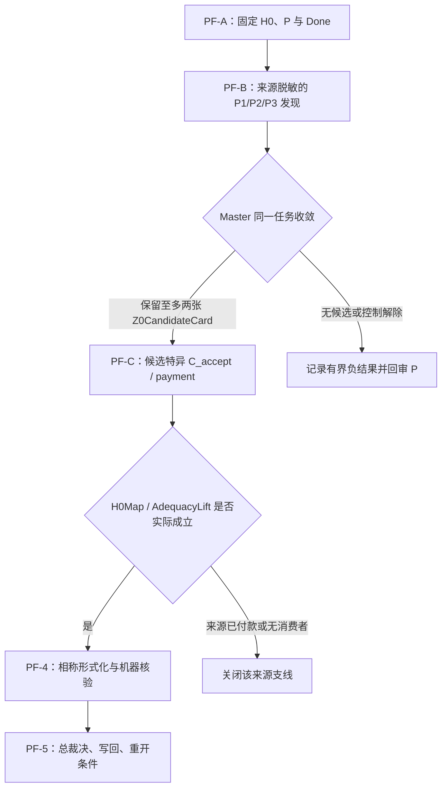

# Response annotations

> 本文件由 Codex 根据 AGENTS.md 强制路由，在发送 final 前调用 dev-notes-archive Skill 写入。
> 正文保存当前用户提问和 AI 已定稿回复；它不是 Host 对已交付 UI 文本的事后收据。


<!-- conversation-archive-turn: skill-turn-2626d8579622449288fcf66138d39a7b prompt_sha256=ecff1390db937627e079e33ceab9f56de5574595732772e0af0e597dfb8c1938 answer_sha256=6f414ab99d35aa0fdc148ec6a88714c2b95cfb29f886d9db0bca6e1cdbb41968 -->
## 2026-10-04 · Turn skill-turn-2626d8579622449288fcf66138d39a7b

### 用户提问

# Response annotations:
Each item contains text selected from an earlier Codex response and may include a user comment. Treat items as Annotation 1, Annotation 2, and so on in array order. Use every selection as context and address every comment. For every annotation you address, include its inline directive `:codex-annotation{index="N"}`, where N is its one-based array position (for example, `:codex-annotation{index="1"}`). Do not use unstructured annotation labels.
<response-annotations>
[{"text":"同时，MPIM 的讲座说明给出一条具体的 H097 线索：它说 Cubical Agda 的证明可以经某个 cubical-set model 转成集合论中的证明。这个说法需要追到一手技术模型，逐项核验它究竟覆盖 H0 的什么部分；讲座页本身不足以支付 H0 的依赖闭包或基础充分性桥。MPIM 讲座说明","source":{"messageId":"msg_03b56f5be4cb32ee016ac245edc1fc87d0a9b9777e10aba972","startOffset":9932,"endOffset":10084}}]
</response-annotations>

## My request:
这事很重要吗？你必须参考它吗？你自己的神经网络中的知识库中没有吗？

### AI 最终回复

## 直接回答

**不，MPIM 的讲座页不是这项研究的必经来源，也不应继续占据主线。** 它目前唯一已经证明的价值，是帮助我们避免把两条不同的 cubical-model 叙述误拼成一条“Cubical Agda 已由集合论完整验收”的链。H097 已经完成了这项消歧：讲座页提到的第一条 Cubical Agda proof-to-set-theory 路线没有给出模型名称；紧随其后的 AWCCRS 预印本被页面明确说成在 *different* 的 cubical-set category 中建立的另一条 HoTT 模型路线。两条链都没有给出 fixed H0 的 `H0Map`、H0 的 `never`／有限停机观察保持，或真正的 `AdequacyLift`。[HZ0-2 来源追溯](/Users/aurolafly/.codex/worktrees/cad0/HoTT_AI_HANDOFF_20260911/audit/20261004-H0-Z0-HZ0-2-MPIM模型链源追溯.md) :codex-annotation{index="1"}

所以，这条线到这里已经完成了一个有限的反控制工作：**不能把“讲座提到集合论转换”当成 ZFC 已经处理 H0 的证据。** 它不能替我们发现 Z0，也不能替我们证明 ZFC 的 Q。

## 我的内在知识能做什么

能，而且这正应当是现在的第一动力。

我已有的数学知识足以做三件更根本的事：

1. 从 main 的固定 H0 抽出真正的结构：一个理论内部可定义、可运行、带正控制的过程，对宇宙对象永远不能交出有限完成见证。

2. 用罗素的计算—存在—自指模式 P 追问 ZFC 的**显眼基础承诺**：哪些地方把总体、形成、可用性或完成性一次性交给理论使用者，而没有把过程性的观察作为同一验收的一部分。

3. 生成多个 `Z0` 候选，并解释为什么它们比“某篇模型论文”更可能是基础理论的真正接口。候选可以涉及 Power Set、累积层级、集合总体的完成性、模型／相对一致性被怎样用于基础资格等；它们都只是待检验的站位，不能因名字熟悉就直接定案。

这就是你此前说的“模式 P 写对后，一遍匹配出理论 X 的线索”的用法：模型的已有知识负责**发现态**，先给出最值得打的位置；不用先遍历所有论文，也不用先找到一个讲座页面来替模型思考。[KC-000058 与 KC-000062](/Users/aurolafly/.codex/worktrees/cad0/HoTT_AI_HANDOFF_20260911/核心认知.md)

## 为什么仍然保留来源核对

内在知识不能代替来源的原因很具体，并不表示“我不知道这些数学”。

我们现在要检验的不是抽象命题“某种 cubical model 可能存在”，而是一个带历史和责任归属的事实：

> 某个实际的 ZFC 或明确 ZFC 扩展侧的验收者，是否把一个精确的 HoTT／Cubical 理论从模型、相对一致性或证明翻译提升为“足以作为基础”或“足以回答原过程”的判断？

这件事必须有实际的 `C_accept`。否则很容易发生一种正好与我们要批判的 P 相似的错误：我凭自己熟悉的“模型存在”“一致性”“可翻译”等词，把它们**自动补成**一个共同体验收已经完成的结论。模型记忆可以告诉我“这里值得怀疑”；它不能证明某篇论文、某个数学共同体或某套 ZFC 元理论真的作出了那一步提升。

尤其是 `H0` 依赖固定的 Cubical Agda 版本、Eilenberg–MacLane 高阶归纳类型库、univalence、h-level 与 `Delay` 运行语义。对于“某个模型是否解释这一整包，并保持 `never`／有限停机观察”，神经网络里的概括知识没有足够的版本精度。这个问题需要一手技术来源或一份真正的保真翻译，才能成为外部可复核的数学／元理论主张。

## 路线应当怎样改

我认为应该把优先级改成下面这样：

```text
main H0 的固定数学证据
    ↓
模式 P + 内在数学知识：直接定位 ZFC 的显眼基础承诺与 Z0 候选
    ↓
先找实际的 C_accept / AdequacyLift：谁在什么条件下说“这个理论足够”
    ↓
只在候选明确需要时，追该来源引用的模型，检查 exact H0Map
    ↓
H0 的观察是否被保留、明确排除，或无支付地遗漏
```

因此：

- **MPIM／H098-A** 应降为一条条件性来源支线。只有某个真正的 `C_accept` 引用它，或者它是得到 exact `H0Map` 的最短路径时，才继续追。
- **AWCCRS／H098-B** 也只能作为理论变体的对照。它若不能覆盖 fixed H0，就应当以 `VARIANT_GAP_WITH_SCOPE` 结束，不能继续消耗主线注意力。
- **主线应回到 H0 与 ZFC 的模式匹配。** 也就是不看这篇讲座，不看已有模型论文，先问：以罗素计算视角看，ZFC 最明显的“把过程交成完成态”的基础承诺在哪里？那才是 Z0 的发现问题。

这也回答了“为什么还要保留 H0”：H0 已经是你要求的反向样本。它让我们不必从来源里等一个答案。我们先用它逼问 ZFC 的基础性承诺；来源只负责裁决那项承诺是否真的被数学共同体作为基础验收使用，以及它究竟支付了什么。

目前最准确的状态是：MPIM 支线已经给出一个有价值的**停止条件**，没有成为 H0→Z0 的必要前提。下一次推进应以不带该讲座、不带其答案的 H0→ZFC 模式匹配开始，再用来源做后验核验。


<!-- conversation-archive-turn: skill-turn-19f8917f35af454881c1de40e0b99f86 prompt_sha256=eda6afa7cefd4cec197bed67ca8113801340247ebdb34ca595a9087b0461b647 answer_sha256=6c30f9e6fc4d040e3311346b17f2c1ce2c3cebb4f2d071cfea8a7cfa912fa456 -->
## 2026-10-04 · Turn skill-turn-19f8917f35af454881c1de40e0b99f86

### 用户提问

你工作的时候，不维护认知文档，你干着干着就忘了啊，为什么认知闭包没有达到这个效果呢？

### AI 最终回复

## 你指出的是一次真实的执行失败

认知闭包没有产生应有的效果，不是因为仓库缺少文档，也不是因为规则没有写出来；是我在用户修正出现后，没有把闭包走完。

闭包至少有两个部分：

1. **认知加载**：读取用户原意、当前 Feature、MEMORY、SOP、来源和运行证据。

2. **认知事务**：一旦用户的话改变了下一步、成功定义、优先级或停止条件，立刻写回正确 owner，重新读取它们，然后才允许旧任务继续。

我完成了第一部分，也在聊天里正确分析出“MPIM 不是主线、内在知识和模式 P 应先负责发现”。但我没有立即完成第二部分：`rulings → Feature → MEMORY → direction → SOP`。结果是旧的 F-050 仍把 H098 当作下一动作，旧队列也真的启动了 H098。这就是你说的“干着干着就忘了”的具体机制。

| 闭包应有动作 | 我当时实际做的事 | 后果 |
|---|---|---|
| 识别用户修正会改变任务优先级 | 把它当成一次解释性讨论 | 没有触发 durable write-back。 |
| 立即更新 current owner | 只在最终回答中说明新路线 | Feature/MEMORY 继续保存旧的 H098 下一动作。 |
| 更新后重新读取 owner | 没有发生 | 旧队列仍然像有效任务一样驱动运行。 |
| 对正在进行的旧节点登记失效状态 | 没有立即登记 | H098 在错误的优先级下被启动。 |

这不是“文档太少”的问题；是我把文档当作一次性读物，而没有当作**下一次行动的控制面**。它违反的正是 `COGNITIVE_CLOSURE_CONTINUITY_V1`。

## 我已经怎样修复

我已经把这次失败本身和路线修正落到可恢复的认知 owner 中：

- [用户原件：来源支线、内在知识与认知闭包](/Users/aurolafly/.codex/worktrees/cad0/HoTT_AI_HANDOFF_20260911/sources/prompts/Codex-H0-Z0来源支线与内在知识-用户原文-20261004.md)

- [rulings：将遗漏定为 `EXECUTION_DEVIATION / COGNITIVE_WRITEBACK_OMISSION`](/Users/aurolafly/.codex/worktrees/cad0/HoTT_AI_HANDOFF_20260911/rulings.md)

- [H0→Z0 SOP：发现态优先、来源支线停止合同和 `P-FIRST-Z0-DISCOVERY` TaskCard](/Users/aurolafly/.codex/worktrees/cad0/HoTT_AI_HANDOFF_20260911/dev-docs/H0-Z0基础验收反投影SOP.md)

- [F-050：当前需求与下一动作](/Users/aurolafly/.codex/worktrees/cad0/HoTT_AI_HANDOFF_20260911/feature-list.md)

- [MEMORY 当前队列](/Users/aurolafly/.codex/worktrees/cad0/HoTT_AI_HANDOFF_20260911/MEMORY/001%20-%20当前执行队列.md)

- [方向记录](/Users/aurolafly/.codex/worktrees/cad0/HoTT_AI_HANDOFF_20260911/方向追踪/002%20-%20治理与用户方向.md)

这些 owner 现在共同规定：

```text
MPIM / AWCCRS = PARKED_CONDITIONAL_SOURCE_BRANCH

下一动作 = P-FIRST-Z0-DISCOVERY
  1. 不输入 MPIM、模型论文题名、Power Set 或既有 ZFC 答案；
  2. 以 fixed H0 与罗素的计算—存在—自指模式 P，
     定位 ZFC 的一个显眼基础承诺；
  3. 冻结 Z0/Q 候选、过程、观察、Done 与反控制；
  4. 再寻找这个候选真正对应的 C_accept；
  5. 只有 C_accept 引用模型链或固定 H0Map 必须依赖它时，
     才恢复 MPIM/AWCCRS 来源支线。
```

旧队列下已经完成的 H098 没有被删掉或掩盖。它被保留为一个有限来源控制：CCHM-family 的冻结材料没有支付 exact H0 的依赖闭包、H0Map、`never`／有限停机观察保持，或 `Done_meta → Done_H0` 的提升桥。它的身份是 `H098_PRE_REALIGNMENT_CONTROL_RECORDED`，不再能决定后续选题。[HZ0-2 的完整记录](/Users/aurolafly/.codex/worktrees/cad0/HoTT_AI_HANDOFF_20260911/audit/20261004-H0-Z0-HZ0-2-MPIM模型链源追溯.md)

## 以后闭包怎样真正起作用

我把这次的缺口变成了一个明确的运行顺序。今后只要你改变了理论靶点、来源优先级、停止条件、成功定义或“下一步该先做什么”，我必须在继续任何依赖该判断的工作之前完成：

```text
用户原件
  → rulings
  → Feature 的 active / parked / next action
  → MEMORY 当前队列
  → direction 与 task SOP
  → 回读这些 owner
  → 才能启动或继续节点
```

若并发工作树正在写 `Feature`、`MEMORY` 或方向文件，也不能把“之后再改”当作完成。我必须先在未被占用的用户来源和 `rulings` 中冻结修正，把旧节点标成 `STALE_PENDING_PRIORITY_REALIGNMENT`；等节点终态固定后，再由集成者把其余 current owner 一次收敛。

这次修复已通过：

- `git diff --check`

- `python3 -B scripts/audit/verify_governance_shards.py`

- `python3 -B scripts/audit/verify_pattern_p_tool_history_sources.py --root .`

- `python3 -B scripts/audit/verify_math_proof_delivery_governance.py`

我把这份修复提交为 `131cecba`：`research: prioritize P-first H0-Z0 discovery`，并推送到 `origin/codex/h0-z0-priority-realignment`。

它目前是一个待集成候选，而不是我假装已经直接改好的 canonical `dev`：`dev` 的工作树还带着并行的来源节点改动，直接覆盖会破坏它们。候选提交已经把这些关联来源材料和新的优先级规则放在同一可审阅差异中；canonical integrator 只需按该 commit 与当前 `dev` 的差异复核并集成，不能让旧队列再次覆盖新裁定。


<!-- conversation-archive-turn: skill-turn-3bb382afafd3464493d9fa894ee55c7f prompt_sha256=378be6d148c3fdf9b794480d5527c4f458118974d4ca7d25234376c803e428a1 answer_sha256=f9e7c8cf76b7d20d9128198858b7af4889afc9735eac0f702a5c5e532e8221e3 -->
## 2026-10-04 · Turn skill-turn-3bb382afafd3464493d9fa894ee55c7f

### 用户提问

你把后续的工作的方案写出来，起好名称。在/goal 中引用你的方案和对应的认知闭包，驱动你自己完成后续的工作。你自己管理/goal。

### AI 最终回复

## 已建立并启动

我没有另写一套和并行 worktree 同义的计划。我复用了它已经提交的方案，并把它、可审计认知闭包和 Host Goal 绑定成同一条执行链。

| 项目 | 稳定名称／位置 | 当前状态 |
|---|---|---|
| 执行方案 | [`H0-Z0-PATTERN-FIRST-CONVERGENCE-SOP`](/Users/aurolafly/.codex/worktrees/cad0/HoTT_AI_HANDOFF_20260911/dev-docs/H0-Z0模式P优先收敛SOP.md) | 已提交；定义 PF-A、PF-B、PF-C 与 PF-0～PF-5。 |
| 可审计认知闭包 | [`H0-Z0-PATTERN-FIRST-CONVERGENCE-CLOSURE`](/Users/aurolafly/.codex/worktrees/cad0/HoTT_AI_HANDOFF_20260911/认知闭包/2026-10-04-H0-Z0模式P优先收敛-认知闭包.md) | `PARTIAL / READY_TO_EXECUTE`；固定 H0、来源边界、活跃槽、未知、Feature 映射、并行 worktree 和复现入口。 |
| Host Goal | `01a106f7-75c0-7dd0-b135-63d0393bd6cf` | `active`；由我管理。 |
| 当前 Feature | [F-050](/Users/aurolafly/.codex/worktrees/cad0/HoTT_AI_HANDOFF_20260911/feature-list.md) | `PF_A_READY / PF_B_PENDING_DISCOVERY / PF_C_BLOCKED_ON_SURVIVING_CANDIDATE`。 |

当前 Host Goal 的完整启动词已经是：

```text
按照 SOP=H0-Z0-PATTERN-FIRST-CONVERGENCE-SOP、认知闭包=H0-Z0-PATTERN-FIRST-CONVERGENCE-CLOSURE，继续推进：以 main 的固定 H0 为反向样本，先执行 PF-0，再对同一来源脱敏的 ZFC profile 运行 PF-1 的 P1/P2/P3 模式匹配；仅对 surviving candidate 审计实际 C_accept、同一任务控制、H0Map、AdequacyLift 与相称机器化。MPIM／一般模型论文仅作条件性来源支线。持续写回、审计并管理当前 Goal，直至所有 active lane 到达本方案的有界终态；不得把候选、来源缺口或模型输出升级为 bare ZFC 矛盾。
```

## 这份方案怎样推进



它把“发现 Z0”和“证明 ZFC 有问题”严格分开：

1. **PF-A** 固定 main 的 `H0`，防止把泛泛的 HoTT 复杂性替代掉已经机器检查的 `QuestioningDelay` 过程。

2. **PF-B** 使用来源脱敏的 P1、P2、P3 进行模式匹配。输入中不出现 MPIM、AWCCRS、Power Set、既有 ZFC 答案或项目结论。目标是生成可证伪的 `Z0CandidateCard`，不是立即宣判。

3. **PF-C** 只对幸存候选寻找实际 `C_accept`：谁在何种 ZFC／扩展条件下，实际把模型、一致性、证明翻译或基础资格提升为完成判词。

4. **PF-4** 只有在来源合同或保真 H0Map 已固定后才允许新增形式化和机器证明。

5. **PF-5** 要么形成来源绑定的 H0→Z0 判词，要么以 `SOURCE_DIRECT_PAYMENT_CONTROL`、`SOURCE_ACCEPTANCE_UNDERDETERMINED_WITH_SCOPE`、`H0_Q_PRESERVED_WITH_SCOPE` 或 `P_MATCH_NO_SITE_WITH_SCOPE` 等有界结果结束分支。

MPIM／AWCCRS 继续保留为 `PARKED_SOURCE_CONTROL`。它们只有在 PF-C 的实际来源直接引用该链，或某个已经冻结的 H0Map 必须依赖它时才恢复。这个优先级已写入 [SOP](/Users/aurolafly/.codex/worktrees/cad0/HoTT_AI_HANDOFF_20260911/dev-docs/H0-Z0模式P优先收敛SOP.md)、[闭包](/Users/aurolafly/.codex/worktrees/cad0/HoTT_AI_HANDOFF_20260911/认知闭包/2026-10-04-H0-Z0模式P优先收敛-认知闭包.md)、[MEMORY](/Users/aurolafly/.codex/worktrees/cad0/HoTT_AI_HANDOFF_20260911/MEMORY/001%20-%20当前执行队列.md)、[方向记录](/Users/aurolafly/.codex/worktrees/cad0/HoTT_AI_HANDOFF_20260911/方向追踪/002%20-%20治理与用户方向.md) 与 [rulings](/Users/aurolafly/.codex/worktrees/cad0/HoTT_AI_HANDOFF_20260911/rulings.md)。

## 当前执行现场

PF-0 已完成恢复检查：固定 H0、KC-000056–062、刀具系统理念、F-050、认知闭包和 convergence SOP 已重新加载。

并行 worktree 已经准备了 PF-B 的三张来源脱敏 DiscoveryCard，并在运行其中一个受控节点。它们是 contributor 输入；我不会重新启动同义的 P1/P2/P3。节点终态出来后，我将直接审查其 NodeCard、公开 MatchTrace、trajectory receipt、同一任务控制和负控制，再决定保留、拒绝或发起有限 Battle。

## 版本与核验

本工作单元的版本链为：

- `131cecba`：把 MPIM／AWCCRS 降为条件性来源支线，改为 P-first。

- `de13da0c`：复用 `H0-Z0-PATTERN-FIRST-CONVERGENCE-SOP`。

- `fe07324a`：建立闭包、索引与 Goal 绑定。

- `df4b636c`：闭包索引状态复核为 PASS。

这些提交已推送到 `origin/codex/h0-z0-priority-realignment`。当前 canonical `dev` 仍有并行 dirty 来源材料，因此这是一条 `CANDIDATE_NOT_CURRENT` 分支；后续由 canonical integrator 按精确 commit 复核并集成，不能覆盖并行 worktree 的未提交内容。

已运行并通过：

- `git diff --check`

- `python3 -B scripts/audit/verify_governance_shards.py`

- `python3 -B scripts/audit/verify_pattern_p_tool_history_sources.py --root .`

- `python3 -B scripts/audit/verify_math_proof_delivery_governance.py`

Goal 现在保持 `active`。我会只在方案的 PF-A、PF-B、PF-C 都达到它规定的有界终态，或者实际 H0→Z0 政策链已按来源和机器证据闭合后，才将它更新为完成。


<!-- conversation-archive-turn: skill-turn-45425e5643134ee3b621277eb75957f2 prompt_sha256=9bc2725fa5e2a20d3cb545f0463dff2ee697234b5b030a74f503c5943f05b036 answer_sha256=bc5719e6699d7669d810a900b687663be3f4e431534d099e36154efc719fba7e -->
## 2026-10-04 · Turn skill-turn-45425e5643134ee3b621277eb75957f2

### 用户提问

你去观察了并行 worktree，你是否可以确认，你自己的工作方向没有漂移？

### AI 最终回复

## 结论：主方向没有被替换，执行过程出现过需要纠正的偏移

我不能不加条件地说“完全没有漂移”。我已经把当前 Goal、方案、闭包与并行 worktree 的 NodeCard、公开 DiscoveryTrace、运行终态和 trajectory 边界逐项对照，结论是：

| 检查对象 | 判定 | 含义 |
|---|---|---|
| Goal 的主航向 | `ALIGNED` | 仍是 `main H0 → Pattern P first → Z0 candidate → actual C_accept → H0Map/AdequacyLift → 必要机器化`。没有回到 MPIM、模型论文或 C-364 主导。 |
| 初始匿名同 profile 的 P1/P2/P3 | `ALIGNED_WITH_SCOPE` | P1 重定位了形成邻域；P2/P3 拒绝把静态上升虚构成同一对象再入或理论原生完成过程。 |
| 从 all-subobjects 转到 ω 的多个 profile | `EXECUTION_DEVIATION` | 方案要求先在同一 profile 上完成 Master 收敛；不同 profile 应在 P 再审后由 Master 显式冻结，不能提前当作下一轮主发现。 |
| 命名 ZFC 的 P1 | `CALIBRATION_ONLY` | 它检测模型内部知识能否选出显眼承诺；不替代来源脱敏主 profile 的证据。 |
| 没有 surviving candidate 时的 meta-adequacy P1 | `OUT_OF_PHASE_CONTROL` | PF-C 尚未取得资格；该节点只能保留为 direct-payment 控制，不能创造 `C_accept` 或推进 PF-C。 |
| MPIM／AWCCRS | `PARKED_ALIGNED` | 没有被拿来填补 P2/P3 缺口，仍是条件性来源支线。 |

完整审查已落盘为 [PF-B R1 Master 候选集成审查](/Users/aurolafly/.codex/worktrees/cad0/HoTT_AI_HANDOFF_20260911/audit/20261004-H0-Z0-PATTERN-FIRST-PF1-Master集成审查.md)，并提交、推送为 `ff56db82`（`research: audit H0-Z0 pattern-first direction`）。

## 我观察到的核心事实

并行 worktree 的第一轮给了两个不同层面的结果：

1. 匿名 profile 的 P1 重新看见了“从已承认对象形成全部子对象”的邻域；P2、P3都没有找到同一对象再入或来源定义的构造生命周期。

2. 命名 ZFC、但不提供既有候选名称的 P1 独立选择了 `ω` 与有限 successor formation 的对比。可是冻结同一张 `ω` 卡后，P2 明确判为严格上升而非 same-object reentry，P3 明确判为没有 `Draft/Need/Use/Done` 的理论原生转移。

所以 `ω` 现在只能叫作 **formation/completion lead**，不能叫作 `Z0_CANDIDATE`。如果我把“有限前缀到 ω”的外部过程直接说成 ZFC 的时间缺口，就会恰好犯我们一直防止的错误：把自己的计算故事塞进静态理论，再把这个故事归罪于理论。

## 当前 Goal 如何纠偏

Goal 保持 `active`，但状态已经收紧为：

```text
PF_B_R1 = P_MATCH_RELOCATES_FOUNDATION_FORMATION_SITES_ONLY
Candidate-Q = UNSET
Z0_CANDIDATE = NOT_YET
PF_C = BLOCKED_ON_SURVIVING_CANDIDATE
Next = P_REAUDIT_REQUIRED
```

`P_REAUDIT_REQUIRED` 的含义不是再扩大文献搜索，也不是再跑同样的幂集／ω 卡。它要求我先从 H0 的真正关键条件倒推：H0 中存在理论原生的、可观察的有限完成问题；新 profile 必须在理论自身中给出相应的 formation/use/completion anchor，才能交给 P1/P2/P3。没有这个锚点，P1 的“无限上升”只能停在位置线索，不能被叫作 Q。

因此，当前主方向保持不变，执行方法已经被校正。我的下一步是等待 contributor 将 PF-B R1 的实物固定为可集成 commit，然后基于这份方向审查重写一个不同的、带理论原生 process-anchor 的 PF-B profile；PF-C、模型论文和机器化继续冻结。


<!-- conversation-archive-turn: skill-turn-177a0e7146054178bd09f5c2ee25f4d4 prompt_sha256=9bc2725fa5e2a20d3cb545f0463dff2ee697234b5b030a74f503c5943f05b036 answer_sha256=7474e4af5081d21dbadba311e05bfb2018c99253b4821f3ba183a77d4474081b -->
## 2026-10-04 · Turn skill-turn-177a0e7146054178bd09f5c2ee25f4d4

### 用户提问

你去观察了并行 worktree，你是否可以确认，你自己的工作方向没有漂移？

### AI 最终回复

可以确认：**主方向没有漂移；执行中确实出现过一段可定位的偏移，已经被记录、收束和修正。**

主方向始终是：

```text
main 的固定 H0
→ 用模式 P 在 ZFC 的显眼基础承诺中先发现位置
→ 只有留下同一卡候选才让 P2/P3 接力
→ 只有三刀存活才审实际 C_accept、H0Map、AdequacyLift
→ 只有来源合同固定后才做相称机器化
```

并行 worktree 的首轮实验证实了一个重要事实：匿名的“所有子对象形成”画像只让 P1 看见 formation 邻域；P2 和 P3 都没有得到同一对象的再入或理论原生 lifecycle。它不能被读成“ZFC 已经防住了模式 P”。我把并行 worktree 的未提交卡片维持为 `CANDIDATE_NOT_CURRENT`，没有把它们混入当前真值。

## 我作出的修正

我把 H0 的实际程序结构重新作为约束，而不是把 H0 模糊地当成“无穷”或“时间”的类比。固定 H0 有五个关键部分：被问的 subject、逐步 operation、有限观察、process-wide Done、以及有界正控制。

这使 PF-B2 的问题变成：一个 ZFC 的基础接口如果真能成为 H0 的反向样本，理论画像必须自己提供能被问的过程和完成条件；不能只给一个静态形成对象，再由我们从外面补进“它其实在经历时间”。完整的再审在 [PF-B2 过程锚再审](</Users/aurolafly/.codex/worktrees/cad0/HoTT_AI_HANDOFF_20260911/audit/20261004-H0-Z0-PATTERN-FIRST-PF-B2-过程锚点再审.md>)，修订后的执行合同在 [H0-Z0 Pattern-first SOP](</Users/aurolafly/.codex/worktrees/cad0/HoTT_AI_HANDOFF_20260911/dev-docs/H0-Z0模式P优先收敛SOP.md>)。

## 新的盲态检验结果

我冻结了一张新的、去标识的 P1 卡：它只给出一个经典集合基础中的最小归纳总体、successor、归纳／递归接口、有限 iterate 和有限上界对照；它不提供 ZFC 名称、幂集、论文、既有答案、模型或外加 evaluator。

隔离的 `gpt-5.6-terra / max` P1 实际返回：

```text
NO_MODEL_RECALL_CANDIDATE / FORMATION_ORIGIN_NOT_SUPPLIED
```

它准确区分了三件事：

- 静态地交出一个归纳总体；
- 对每个固定有限阶段做一条有限推导；
- 真正拥有一个由理论原生定义的、可观察整体过程并带 process-wide Done 的任务。

第三件在冻结画像里没有被提供。于是它没有把“总体已存在”偷换成“有一次过程已经完成”，也没有发明 checker、scheduler、构造时状态或现实时间线。运行 46.987 秒，输入隔离、Terra/max、只读、禁网和 `approval=never` 均实际回显；零 command、零 file change、零 approval request。canonical trajectory 审计确认一个 completed turn、零工具调用；完整 reasoning 没有被用来支持判词。完整收据见 [PF-B2 P1 运行报告](</Users/aurolafly/.codex/worktrees/cad0/HoTT_AI_HANDOFF_20260911/audit/20261004-P-DAG-H0Z0-PF-B2-INDUCTIVE-P1-Terra-Max.md>)。

因此 P2、P3 **没有运行是正确的**：它们需要 P1 留下一张冻结的 `T/u/F/Q/I/O/Done` 父卡。当前没有父卡，启动它们反而会让三把刀各自换题。PF-C 也没有进入，所以没有实际 `C_accept`、H0Map、AdequacyLift 或新的形式化包可审。

## 这轮最终支持什么

| 项目 | 当前有界结论 |
|---|---|
| 初始 formation profile | P1 只重定位位置；不是 Z0 候选。 |
| PF-B2 process-anchor profile | `P_MATCH_NO_SITE_WITH_SCOPE`。 |
| P2/P3 | `NOT_RUN_BY_PROTOCOL_NO_FROZEN_PARENT`。 |
| PF-C | `NOT_ENTERED_NO_SURVIVING_CANDIDATE`。 |
| MPIM／一般模型论文 | 保持停泊，不能拿来补候选。 |
| bare ZFC | 没有得到矛盾、缺陷定理或“没有过程”的结论。 |

这不是“锻刀没有用”。它证明了新的 P 约束已经能阻止我们为了获得一个答案而把静态 totality 伪造成过程完成。当前 Goal 因而以一个真正可复现的有界负结论结束：在两个冻结的去标识画像中，没有产生可进入来源审计的 Z0 候选。

## 已落盘、提交与推送

- 持续恢复入口和跨压缩一致性规则写在 [H0-Z0 认知闭包](</Users/aurolafly/.codex/worktrees/cad0/HoTT_AI_HANDOFF_20260911/认知闭包/2026-10-04-H0-Z0模式P优先收敛-认知闭包.md>) §十。
- 本轮 Session、运行索引和全部 62 条核心认知的逐项审计在 [S-RES-20261004-H0-Z0-PATTERN-FIRST-PFB2](</Users/aurolafly/.codex/worktrees/cad0/HoTT_AI_HANDOFF_20260911/.codex/research/hott/sessions/S-RES-20261004-H0-Z0-PATTERN-FIRST-PFB2/SESSION.md>) 与其 [分片核心审计集](</Users/aurolafly/.codex/worktrees/cad0/HoTT_AI_HANDOFF_20260911/.codex/research/hott/sessions/S-RES-20261004-H0-Z0-PATTERN-FIRST-PFB2/CORE_COGNITION_AUDIT.md>)。
- 三个提交依次为 `45aae070`（过程锚再审）、`7c848e4f`（冻结 P1 卡）、`5cf4ab06`（运行、闭包和有界收尾）。
- 已推送到 `origin/codex/h0-z0-priority-realignment`，远端现指向 `5cf4ab06`。
- 当前 canonical `dev` 工作树仍由别的 dirty 工作维护；这些成果是明确标注的候选分支，尚未假装已经集成进 `dev`。

验证通过：`git diff --check`、治理分片校验、Pattern-P 来源校验、数学证明交付治理校验，以及本轮的 prompt identity／62-KC session audit 检查。没有新数学命题，因此没有把这次行为实验伪装成 Lean 或 Agda 的数学证明。

这个 Host Goal 已按“所有 active lane 到达有界终态”的条件标记为完成。Goal 记录的实际用量为 787,114 tokens、6,628 秒，约 1 小时 50 分钟；它没有设置 token budget。

未来只有三类新事实才应重开：研究发起人指定一个不同的显眼基础接口；版本固定的一手来源实际定义该接口的 native process-wide completion task；或新证据推翻 H0 process-anchor 的字段设计。除此之外，继续追加 profile、文献支线或 P2/P3 运行都会重新造成偏移。


<!-- conversation-archive-turn: skill-turn-9b8979eee6bb45b7ad06c101dfc89898 prompt_sha256=5cc11fd7f25808e5484185827a12b8a35b32cbbc8c14500828f458067f94029f answer_sha256=e5881ba7993b6d99d4715f58d1c88e500700262f86cf22120a673432b77444df -->
## 2026-10-04 · Turn skill-turn-9b8979eee6bb45b7ad06c101dfc89898

### 用户提问

你现在的这个git worktree上的工作，我希望保存到远程的dev-06分支上，你打算如何处理？

### AI 最终回复

已经按这个目标处理完毕：**当前 worktree 的工作已保存到远程 `dev-06`，且没有覆盖 `dev`、没有重写任何已有远端分支。**

## 实际处理方式

1. 我先核对了远端：`origin/dev-06` 当时不存在，所以这是一次安全的首次分支创建，不涉及覆盖或 force push。

2. 我以当前 H0→Z0 工作的已提交头 `5cf4ab06` 为基线，从当前 worktree 创建了本地 `dev-06`。

   这条历史包含本轮的三段研究提交：

   - `45aae070`：H0 process-anchor 再审；
   - `7c848e4f`：冻结新的去标识 P1 盲态卡；
   - `5cf4ab06`：PF-B2 运行、认知闭包、逐 KC 审计和有界收尾。

3. 我逐项检查了工作树中尚未提交的材料。它们包括 2 份 `dev-notes` 归档和 3 份 `git-worktree对话录`，共约 4.3 MB；敏感模式扫描没有发现私钥、token 或 API key。

4. 这五份归档没有和研究结果混成一个提交，而是单独保存为：

   ```text
   86ad33c4  archive: preserve current worktree dialogue records
   ```

5. 我以精确 refspec 非强制推送了 `dev-06`，并用 `git ls-remote` 回读验证：

   ```text
   origin/dev-06 = 86ad33c4a896931b9d5aa5158639e6a6b89dce15
   local dev-06  = 86ad33c4a896931b9d5aa5158639e6a6b89dce15
   ```

6. 本地 `dev-06` 已设置为跟踪 `origin/dev-06`，以后在这个 worktree 中继续时，默认目标明确就是该远端分支。

## 保留的边界

- `origin/codex/h0-z0-priority-realignment` 仍保持在 `5cf4ab06`，没有被改写。
- canonical `dev` 没有被 merge、reset、rebase 或 push。
- 三份历史对话录含有原始尾随空白。`git diff --check` 因此报告了这些历史文本的 whitespace warning；我没有为了消除警告而修改归档原文。

本回合的对话归档会在发送前写入 `dev-notes`，并作为 `dev-06` 上紧随 `86ad33c4` 的一个精确提交推送。这样，远端 `dev-06` 会同时保留研究成果、已有工作树归档和本次分支保存操作的可恢复记录。
