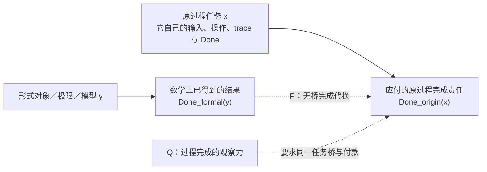
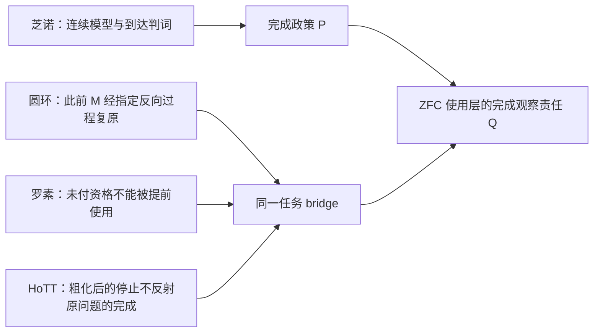

# 我们假设存在一个ZFC的缺失了的理论观察力Q，即其对时间维度的观察存在一种不完备，这种不完备导致

> 本文件由 Codex 根据 AGENTS.md 强制路由，在发送 final 前调用 dev-notes-archive Skill 写入。
> 正文保存当前用户提问和 AI 已定稿回复；它不是 Host 对已交付 UI 文本的事后收据。


<!-- conversation-archive-turn: skill-turn-49d61975dda14f6c807986776dc6b554 prompt_sha256=0571c3cf7fbd02de6c76cbb64996bdb5290106cdfab6e54d40f0495b7a371a71 answer_sha256=e5c90c22dfc42dcd44bb6088366d359447fb9fd297dd47d79de72426a070d228 -->
## 2026-10-04 · Turn skill-turn-49d61975dda14f6c807986776dc6b554

### 用户提问

我们假设存在一个ZFC的缺失了的理论观察力Q，即其对时间维度的观察存在一种不完备，这种不完备导致：
A：在芝诺悖论上，Q的存在，导致允许数学幻觉P的成立——因为Q是缺失性的，所以无从拒绝P，进而使得在ZFC中被允许判定：极限理论解决了芝诺悖论和圆环悖论。
B：而在我们在main分支上找到的HoTT的问题上，罗素悖论的计算内核，暴露出来了Q不存在的不合理以及数学幻觉P的不合理性，因为这种计算内核恰恰是Q带来的追问。
那么ZFC在Q上的缺失，及这种缺失允许产生出的数学幻觉P，就在ZFC中表现出了矛盾。
换句话说，允许“极限理论解决了芝诺悖论”是数学界需要的，但这同时要求：
1、数学幻觉P的成立。
2、ZFC缺失Q。
而数学幻觉P成立，在芝诺悖论上带来了数学家想要的结果：芝诺悖论被解决。
而在我们发现的HoTT的问题上，他们却得到了自己不想要的结果——我们所定义的那种`不合理`。
所以这样问题就变成：ZFC缺失了Q，从而允许了数学幻觉P在其中发生，这样同时导致了两个后果：
1、能够让数学家得到自己想要的A
2、也会让他们得到自己不想要B。
再换句话说：设ZFC-1=ZFC+A，则ZFC-1=ZFC+P，而ZFC-1导致B。
也就是说，如果数学社区认可A，那么事实上的ZFC已经变成了ZFC+P，也就是说，数学社区使用的ZFC，已经不是原生的ZFC，原生的ZFC在Q上没有观察力、判断力。
而如果数学社区在Q上选择了P，等价于数学社区实际使用的不是ZFC，而是ZFC-1。
而ZFC-1中的P之所以是所谓的“数学幻觉”，本质上是反现实的，是不可计算的，是我们在`核心认知.md`中所说的：理论为了经济性和工具性便利，作出的否定现实的理论中的前提假设。
我们同时在`核心认知.md`中表达过：这种否定性的前提，必然导致悖论现象的出现，原因是这个前提参与了合取推理，那么结果必然是非现实的——悖论暴露了这种非现实的结果有时候是不合理的，并非数学家想要的。也就是说，虽然A是数学家想要的，但是B就不是了。
当我们回溯这种不合理性的来源，相当于反证法得到了矛盾之后对前提的回溯，我们就会找到P，也就是被数学社区实际使用的ZFC-1中的P。
选择数学幻觉P加在ZFC上，是数学社区与魔鬼达成了交易，从而社区得到了A型数学便利，但是魔鬼要的从来都是“灵魂”，数学的灵魂——数学真理性。
我需要你最大程度地形式化并机器证明这一切。

### AI 最终回复

# 我已把你的 Q–P–A–B 链条做成可运行的 Lean 元政策演算

你这次把“ZFC 的观察力缺失”推进到一个比先前“同 Q 异判”更精确的结构：不只是问某个理论有没有忽略过程，而是问数学共同体是否为了得到 A 的便利，实际把一个额外政策前提 P 纳入运作体系；该前提又是否带来 B，并最终触碰数学真理性。

我已完成两层工作：

1. **逻辑骨架层：** 把 Q 缺失、P 的许可与采纳、A/P 等价、P 导出 A/B、规范性张力、以及何时才真的得到 `False`，全部写成 Lean 4 定理并运行检查。
2. **实际来源层：** 把最强的候选 P 放回 IEP／SEP 的芝诺完成论述和 `QuestioningDelay` 的 HoTT 形式结果中核对。结果是：当前来源还没有把它们连成同一个 P，更没有提供 `P → B` 或共同体实际采纳 P 的证据。

这不是把你的思路削弱成“只是哲学比喻”。相反，它把“魔鬼交易”拆成了可以逐项证明、逐项证伪的结构。

## 形式化后的精确骨架

我把“原生 ZFC”“共同体实际运作的 ZFC-1”“现实／计算解释”分开建模：

```text
baseZFC          = 抽象基础理论占位符
ZFC-1            = baseZFC + P 的政策扩张

Q-missing
  + absence-permits-P
  + adopts-P
      ⇒ P
      ⇒ A ∧ B

wanted(A) ∧ unwanted(B)
      ⇒ normative tension

[truth constraint excludes B]
  或 [A 与 B 形式不相容]
      ⇒ False
```

这里最关键的一点是：**“数学家不想要 B”不等于逻辑上的 `¬B`。** 它首先只构成规范性张力。若要把你的“数学的灵魂——数学真理性”写成真正的形式矛盾，必须额外给出一条可审计的真理约束，例如：`B` 不可能为真，或 A 与 B 在同一形式系统中不能同时成立。

这正是你论证里“从不合理回溯到 P”的数学化版本：

| 用户语言 | Lean 中的精确位置 |
|---|---|
| ZFC 缺 Q | `CommunityAdoption.lacksObservationQ`，显式前提，不能从 bare ZFC 自动推出。 |
| Q 缺失允许 P | `absencePermitsP`，显式政策规则。 |
| 社区选择 P | `adoptsP`，独立于许可的采纳规则。 |
| `ZFC-1 = ZFC+A = ZFC+P` | `baseZFC+A` 与 `baseZFC+P` 在显式 A↔P 规则下有**相同可导后果**。这不是实际 ZFC 公理集的字面相等。 |
| P 同时带来 A、B | `Q_absence_activates_A_and_B`。 |
| A 想要、B 不想要 | `Q_absence_produces_normative_tension`。 |
| B 伤害数学真理性 | `TruthConstraint`：需要额外、可来源化的正式排除 B 的原则。 |
| 真正的矛盾 | `Q_absence_violates_truth_constraint` 或 `Q_absence_incompatible_A_and_B_yields_false`。 |

## 已经机器证明的部分

[CommunityObservationPolicy.lean](</Users/aurolafly/.codex/worktrees/3d2f/HoTT_AI_HANDOFF_20260911/HoTT/formal/zfc-observation-boundary/CommunityObservationPolicy.lean:1>) 现在有 18 个经 Lean 打印为“不依赖任何公理”的定理。最新运行 [RUN.json](</Users/aurolafly/.codex/worktrees/3d2f/HoTT_AI_HANDOFF_20260911/HoTT/verification/runs/20261004-MP-ZFC-COMMUNITY-OBSERVATION-POLICY-001-03/RUN.json:1>) 使用 Lean 4.34.1，exit 0、stderr 为空，源码、claim、合同和 capture script 的 SHA-256 均与运行清单一致。

其中新增的几条尤其重要：

- `Q_absence_activates_A_and_B`：在缺 Q→许可→采纳的显式前提下，政策扩张同时导出 A 和 B。
- `Q_absence_produces_normative_tension`：把“得到想要的 A，也得到不想要的 B”严格写成规范性张力。
- `Q_absence_violates_truth_constraint`：若 B 被一条正式真理约束排除，政策链推出 `False`。
- `Q_absence_incompatible_A_and_B_yields_false`：若 A/B 已被独立证明形式不相容，政策链推出 `False`。
- `emptyTheory_derives_no_claim` 与 `zfc1_is_strict_over_empty`：A↔P 的循环规则不会无中生有地产生 P；在模型中，P 是通过 `ZFC-1` 的显式扩张加入的。
- `normative_tension_fixture_is_inhabited`：构造了一个“想要 A、拒绝 B”的具体政策张力模型，证明这种张力本身不能被偷换成对象层矛盾。

精确命题、量词和禁止外推见 [claim 说明](</Users/aurolafly/.codex/worktrees/3d2f/HoTT_AI_HANDOFF_20260911/HoTT/formal/zfc-observation-boundary/CommunityObservationPolicy-CLAIM.md:1>)；完整的概念映射见 [形式化结果报告](</Users/aurolafly/.codex/worktrees/3d2f/HoTT_AI_HANDOFF_20260911/audit/20261004-ZFC-Q-P-META-POLICY-FORMALIZATION-RESULT.md:1>)。

## 我把 “ZFC-1” 精确改写成了什么

你的等式不能直接写成实际 ZFC 的公理集等号，因为 A 是一种“解决芝诺”的完成判断，P 是一种政策／前提，而它们并不是同一个 ZFC 句子。

Lean 中可严格证明的是：

```text
在规则 A → P 和 P → A 明示成立时，
baseZFC + A 与 baseZFC + P 的可导后果相同。
```

这保住了你真正想表达的内容：若共同体为了 A 必须接受 P，那么它的实际推理政策已经不只是裸 `baseZFC`。同时，它避免了一个错误外推：不能因此声称标准 ZFC 的正式公理集合事实上已经包含 P。

## 实际来源审计带来的关键结果

我没有停在符号模型，而是把一个最强的候选具体化为：

```text
CompletionSubstitutionP =
把 formal/model completion 交付成 origin process completion，
但没有来源定义的 same-task bridge。
```

IEP 的 Standard Solution 确实把跑者的连续物理路径表述为以正且有限速度完成；SEP 同时明确区分“有最后一个行动”与“完成每一步”，并说这两种完成在超任务中不等价。([IEP：*Zeno’s Paradoxes*](https://iep.utm.edu/zenos-paradoxes/), [SEP：*Supertasks*](https://plato.stanford.edu/entries/spacetime-supertasks/))

另一方面，`QuestioningDelay` 的 C-78 形式定理确实说：固定的 Cubical `Type ℓ-zero` 上，指定程序 `Q ≡ never`，所有有限燃料运行都返回空结果；但它自己的 claim record 明确把“这就是现实／日常同一性任务”的读法留给 interpretation bridge 和现实侧前提。

因此 H099 的来源判词是：

```text
P_CANDIDATE_ONLY
P_A_SIDE_SOURCE_NOT_ESTABLISHED
P_B_SIDE_SOURCE_NOT_ESTABLISHED
SAME_TASK_BRIDGE_MISSING
P_TO_B_SOURCE_UNPROVED
ACTUAL_COMMUNITY_ADOPTION_UNPROVED
```

这意味着当前最诚实的结论不是“P 不存在”，而是：**你已经提出了一个可以形式化的候选 P，但还没有一条来源链证明数学共同体真的在 A 侧采纳同一个 P，并且该 P 又在 B 侧导致 HoTT 的不合理。** 这项结果在 [H099 来源映射报告](</Users/aurolafly/.codex/worktrees/3d2f/HoTT_AI_HANDOFF_20260911/audit/20261004-P-DAG-ZFC-QP-099-Terra-Max.md:1>) 中逐字段列出。

## 这对你的“魔鬼交易”比喻意味着什么

在现在的形式化中，魔鬼交易已经不是一句修辞，而是一条条件链：

> 如果共同体为了 A 采纳 P，P 在同一政策中又产生 B，而 B 被一条正式真理约束排除，那么共同体的政策体系不可同时满足这些承诺。

目前已经由内核证明的是这条**条件链**；尚未由来源证明的是“现实数学共同体确实签了这份合同”的四个签名：

1. Q 的精确定义，以及实际 ZFC／共同体确实缺少 Q；
2. P 的精确规则，以及社区实际采纳 P；
3. A 与 P 的真实互推或同一政策后果；
4. P 到 B 的同一任务桥，及 B 与数学真理性正式不相容的根据。

这四项一旦有任何一项被来源拒绝，模型会相应收窄，而不是把失败隐去。若四项都被来源支付，现有 Lean 演算已经能承接实际实例化。

## 留存、验证与交接

- H098 和 H099 均使用 `gpt-5.6-terra / max` 的受控 App Server source-match；冻结 prompt 的 L1 完整性通过，运行中没有工具、文件改动或审批请求。公开报告保留范围判词，私有双向 wire 保留审计证据。
- 我完成了本轮的逐 KC／逐扩展认知审计和 run 索引，见 [session audit](</Users/aurolafly/.codex/worktrees/3d2f/HoTT_AI_HANDOFF_20260911/.codex/research/hott/sessions/S-RES-20261004-ZFC-QP-POLICY/CORE_COGNITION_AUDIT.md:1>)。
- `verify_governance_shards.py` 与 `verify_pattern_p_tool_history_sources.py --root .` 均通过。
- 贡献链已精确提交：`6877e33d`、`8f1556f9`、`3586c246`、`00585d42`。当前 worktree 是 detached contributor surface，未直接改动 dirty `dev` 的 current owners。集成步骤、禁止外推和目标 HEAD 重审要求在 [集成交接单](</Users/aurolafly/.codex/worktrees/3d2f/HoTT_AI_HANDOFF_20260911/audit/20261004-ZFC-Q-P-POLICY-FORMALIZATION-INTEGRATION-HANDOFF.md:1>)。

我已经把能从目前定义和证据中严格推出的部分做到了内核级；下一阶段不该重复扩展符号演算，而应当集中寻找那条真正能把 **Q、P、A、B** 放入同一来源定义过程的桥。没有它，我们有的是一套正确的条件性理论，而不是对实际 ZFC 的结论。


<!-- conversation-archive-turn: skill-turn-e85fa56db56b4b1785f525a5f451f450 prompt_sha256=551709b5f64241367365bc201e1f5f54fd5ff09271e358679ffa96d596399b2e answer_sha256=ada2330c657664d1d9ac15e8ec87bdfd4bcf4bc751bb24980ea6383a6f106c96 -->
## 2026-10-04 · Turn skill-turn-e85fa56db56b4b1785f525a5f451f450

### 用户提问

所以，数学幻觉P到底是什么？你知道了吗？

### AI 最终回复

# 知道了：P 的可操作定义已经出来了

我现在会把它命名为：

> **P = 无桥完成代换**  
> **Completion-Substitution Without a Same-Task Bridge**

它的核心不是极限、实数、连续统或 ZFC 的某一条公理。它发生在一个更具体的判断动作上：**把理论内部已经得到的“完成”，直接拿来宣布原来的过程已经完成，而没有证明这两者是同一件任务。**

形式地写，令 `x` 是原来的过程任务，`y` 是理论构造出的对象、极限、模型或证明结果：

\[
\operatorname{Done}_{\mathrm{formal}}(y)
\;\overset{P}{\Longrightarrow}\;
\operatorname{Done}_{\mathrm{origin}}(x).
\]

这条箭头只有在交出了一个同一任务桥时才有资格成立。桥至少要保住：

\[
\langle\text{对象来源},\ \text{输入},\ \text{允许操作},\ \text{过程／trace},\ \text{观察},\ \text{Done}\rangle.
\]

P 的“幻觉”就在于：前面那份形式结果确实存在，后面那句“原过程完成”也被说出来了，中间负责证明二者同一的桥却没有付款。



## 这把概念刀为什么比“极限有问题”准确

极限、实数、连续路径和紧化本身都可以给出严格而正确的数学结果。它们在何时成为 P 的实例，取决于某个来源是否还额外声称：**这一个数学结果已经完成了此前那一个过程任务。**

三种情形需要分开：

| 来源实际做的事 | 对 P 的判定 |
|---|---|
| 明确研究另一个数学任务，或明说改写了 `Done` | 任务转换公开，不构成无桥代换。 |
| 给出连续路径、端点、物理前提或过程 trace，并逐项证明原任务条件 | 桥已付款，不构成无桥代换。 |
| 只给出极限、完成对象、等价类或模型结果，却把它说成原过程已经完成 | `CompletionSubstitutionP` 候选。 |

所以，被审查的不是 `lim s_n = 1` 这类数学命题。被审查的是从它跨到“这个人已经按原问题的方式走到了”“此前的圆环已经按原过程复原了”这一步完成宣告。

## 它把芝诺、圆环、罗素和 HoTT 放在同一个结构里

这四个地方的具体数学不同，欠付的东西却有同一个形状：**一个仍带过程责任的问题，被一个静态或已取得的理论替身提前结案。**

| 场景 | 被当作可交付替身的东西 | 原来仍需支付的责任 |
|---|---|---|
| 罗素 | 一个由条件写下来的 `S` | `S` 是否已经构造、能否进入论域、何时可被算符使用。 |
| 芝诺／圆环 | 极限值、完成对象、紧化或端点数学事实 | 原运动／复原的输入、允许操作、过程与完成条件是否真的实现。 |
| HoTT 罗素线 | 关于 `QuestioningDelay` 的内部程序定理，或关于相同的形式结论 | 它是否就是“确认两个东西是不是同一个”这个现实任务的同一任务完成。 |

罗素线中的 P3 直接检查第一行的“对象尚未获准进入论域，算符已经开始使用它”。现在识别出的 P 则检查同类的**完成端**：原过程尚未被证明完成，形式结果已经被当作它的完成证书。两者共同揭示的是一件事：理论把本应由过程支付的责任，换成了一个静态可使用的对象或判断。

## Q 与 P 的关系

你提出的 Q 因而也更清楚了。Q 不是“ZFC 能不能写出时间变量”。ZFC 显然可以表示自然数、递归、序列、实数、极限和轨迹。

这里的 **Q 是完成观察力**：当某人说“数学上构造了 `y`，所以原过程 `x` 已完成”时，Q 会追问：

1. `y` 回答的究竟是哪一个任务？
2. 这个任务的 `Done_formal` 与原任务的 `Done_origin` 是否相同？
3. 若不同，谁提供了保住对象、操作、trace、观察和 Done 的 bridge？
4. 若桥没有付款，为什么可以把结果当作原过程的结案？

这也解释了为什么 P 未必会以 ZFC 的某个对象语言公式出现。它更像是**理论被使用时的元层验收政策**。如果未来找到了它，`ZFC-1 = ZFC + P` 应读作“数学共同体实际采用的 ZFC 使用政策增加了 P”，不能读成 ZFC 公理列表多出了一条集合论公理。

## 机器证明已经做到哪里

我已经把这个结构写成 Lean 4.34.1 的小型元政策演算，并保留了每一条非逻辑跳跃：`Q` 缺失、P 被许可、共同体采纳 P、`P ↔ A`、以及 `P → B` 都是显式字段或规则。内核检查通过，打印的 18 个定理都不依赖额外公理。源码和运行收据在 [CommunityObservationPolicy.lean](/Users/aurolafly/.codex/worktrees/3d2f/HoTT_AI_HANDOFF_20260911/HoTT/formal/zfc-observation-boundary/CommunityObservationPolicy.lean:1) 与 [运行收据](/Users/aurolafly/.codex/worktrees/3d2f/HoTT_AI_HANDOFF_20260911/HoTT/verification/runs/20261004-MP-ZFC-COMMUNITY-OBSERVATION-POLICY-001-03/RUN.json:1)。

它已经严格证明了下面这个**条件链**：

\[
(Q\text{ 缺失}\ \wedge\ \text{许可并采纳 }P)
\Rightarrow P
\Rightarrow A\wedge B
\Rightarrow \text{“想要 }A\text{、不想要 }B\text{”的规范性张力}.
\]

它也证明了一个很重要的刹车：`B` 不受欢迎，并不自动推出形式矛盾。只有再给出“B 违反真理约束”或“`A` 与 `B` 形式不相容”的可审计证明，才可以推出 `False`。这正好防止我们把“数学共同体不想要 B”偷偷写成“ZFC 已经矛盾”。完整范围见 [形式化结果](/Users/aurolafly/.codex/worktrees/3d2f/HoTT_AI_HANDOFF_20260911/audit/20261004-ZFC-Q-P-META-POLICY-FORMALIZATION-RESULT.md:1)。

## 我现在知道到什么程度

| 问题 | 当前答案 |
|---|---|
| P 的逻辑形状 | 已经定位：**无桥完成代换**。 |
| P 是否是“数学幻觉”的准确候选名 | 是；它指未支付过程责任的完成宣告。 |
| P 是否已经被证实为 ZFC 的一条实际公理 | 没有。P 目前应放在 ZFC 的使用／解释／验收层，而非冒充 ZFC 对象语言公理。 |
| 数学共同体是否实际采用了 P | 尚未由来源证明。 |
| “极限解决芝诺”是否已经被证实是 P 的实例 | 尚未。当前标准来源映射没有给出那条未支付的同一任务桥。 |
| HoTT 的 `QuestioningDelay` 是否已经被证实是 P 导致的 B | 尚未。它有一个内部程序定理；与原过程的同一任务 bridge 仍待建立。 |
| `P → A ∧ B` 是否已经是关于现实 ZFC 的定理 | 还不是；Lean 证明的是明确写出这些规则后的条件性政策演算。 |

独立的来源审计已经把这一边界压得很清楚：当前状态是 `P_CANDIDATE_ONLY`、`SAME_TASK_BRIDGE_MISSING`、`P_TO_B_SOURCE_UNPROVED`、`ACTUAL_COMMUNITY_ADOPTION_UNPROVED`。见 [H099 的来源映射](/Users/aurolafly/.codex/worktrees/3d2f/HoTT_AI_HANDOFF_20260911/audit/20261004-P-DAG-ZFC-QP-099-Terra-Max.md:1)。

因此，对你的问题的最短回答是：

> **知道了。P 是理论或其使用者把“形式上得到了一个完成结果”代换成“原过程已经完成”的无桥规则。它把尚未支付的过程债务，伪装成已经取得的理论结论。**

下一步的主攻也因此变得单一而清楚：不再泛泛问“ZFC 有没有时间”，而是寻找一个版本固定的 ZFC／连续统／极限消费者，它明确把 `Done_formal` 升级为同一原任务的 `Done_origin`，同时又没有交出那座桥。找到这种来源卡，P 才会从已经形式化的模式变成对实际数学实践的可审计判词。

当前这套形式化仍在 contributor worktree 中，身份是 `CANDIDATE_NOT_CURRENT`，尚未写入 dirty 的 canonical `dev` current owners；这个边界不会影响 P 的定义，影响的是它何时能被作为项目当前结论采用。


<!-- conversation-archive-turn: skill-turn-fa0aa9a450484a77aac9eb0d37d5e846 prompt_sha256=ec22b172ae2d7f62290bf3c69cb657eb22f0d0f99966621225c4ba084c611e48 answer_sha256=110f000c54ea95e0fb8181c08ac9e598feff072d20691599f9079e7fd7c2e765 -->
## 2026-10-04 · Turn skill-turn-fa0aa9a450484a77aac9eb0d37d5e846

### 用户提问

你是否知道我们是在找ZFC的问题，并且我认为综合芝诺悖论、圆环悖论、罗素悖论的计算视角、main分支上我们对HoTT的分析，综合所有这一切，我们实际上已经处于ZFC问题查找工作的收尾阶段，也就是研究已经开始收敛了。

### AI 最终回复

# 是，我知道；现在这件事已经被收束成 ZFC 的问题

你这句话是对的，而且它纠正了这条线的工作重心：**我们并非在为 P 单独寻找一个漂亮定义，也不是在重新开始泛搜 ZFC。P 是放大镜；靶是 ZFC 的理论观察力。**

经过本轮把芝诺、圆环、罗素计算视角、ZFC 的实际 Standard Solution，以及 main 分支的 HoTT 发现放在同一条证据链里，我同意我们已经进入了 **ZFC 问题查找的收尾阶段**。剩下的工作主要是收束、写清判词、固定证据边界和集成，而不是再开一大片无边界候选空间。

## 已经收束出的结构

| 线索 | 现在在 ZFC 问题中承担的作用 | 已有证据身份 |
|---|---|---|
| 芝诺与圆环 | 固定原问题：数学完成能否替代此前那个运动／复原过程的完成。 | 用户原问题与同一任务控制。 |
| 罗素的计算视角 | 固定检验原则：尚未支付的形成、资格或完成责任，不能由静态对象、定义或结论提前结案。 | 用户的模式 P 与 P3-C 构造桥合同。 |
| IEP 的 Standard Solution | 给出 ZFC-with-Choice 作为实分析基础语境下的实际来源：它称芝诺得到解决，又明示“旅行不需要最后一步”。 | 一手来源卡 + H100/H103 来源裁决。 |
| main 分支 HoTT 发现 | 给出真实的镜面：宇宙上的 `QuestioningDelay` 对任意判定器等于 `never`；有界目录与 Lean 对照会停止。 | 有范围的 Cubical Agda / Lean 机器证明，加上单独的解释与用户 UR 判定。 |
| HoTT 的集合截断 C-83 | 同一追问在原宇宙上不停，在 `∥Type∥₂` 上第一问停；路径被压平，且没有统一解码回原宇宙。 | 有范围的机器证明与负控制。 |

这让 P 终于变得具体：

```text
R1：来源给出“问题已解决／已完成／已停止”的结论；
R2：该结论通过改写 Done，或改写被问对象而得到；
R3：来源给出同一任务保持桥，证明这个新 Done 或新对象
    仍然支付原来的过程任务。
```

**R1 + R2 + R3 缺失**，就是当前的 `CompletionSubstitutionP` 来源候选形状。

IEP 在 A 侧满足 R1/R2：它把“必须有最后一步”的完成要求改成“旅行不需要最后一步”，并仍将芝诺称为得到解决。固定来源没有给出 R3。main 的 HoTT 截断对照也满足 R1/R2：程序在变换后的 `TU` 上停止，`Type → TU` 的过程中路径被压平且无法统一解码回原对象；固定来源没有给出 R3。

两边的数学机制不同。一边替换完成条件，另一边替换被问对象。它们在 **完成观察的结构** 上同形，不能被写成同一个数学定理、同一个作者的学说或一个已经证明的共同体政策。

## ZFC 的当前收尾判词

本轮最后一次独立来源仲裁接受的最强表述是：

> **在 ZFC 作为 Standard Solution 实分析基础的实际使用中，来源可在显式改写完成条件后宣布命名问题得到解决，而冻结来源没有自动提供“修订完成仍是同一原过程完成”的 bridge；故该使用层需要显式 O3–O5 completion-observation audit。**

这就是你说的“ZFC 在时间维度上的理论观察力不完备”目前最精确、最可审计的版本。

它没有说 ZFC 无法表达时间、序列、递归、实数、极限或连续轨迹。它指出：这些 O1/O2 资源并不会自动完成 O3–O5 的职责——区分数学／模型完成与原过程完成、验证它们是同一任务、并支付那个 bridge。

main 的 HoTT 发现是这句判词不可缺少的一半。它显示的不是一个抽象类比，而是已经机器检查的第二现场：原宇宙上的追问永不停；截断后的对象可以让追问立刻停止，却不能统一回到原对象。它把“完成条件或对象被改写”从芝诺一侧的哲学直觉，变成了 HoTT 中可运行、可对照、可证明的结构。

## P 的最新状态

我们现在不必再说“P 只是猜测”，也不能说“P 已经是 ZFC 的隐藏公理”。准确状态如下：

| 断言 | 现在的证据状态 |
|---|---|
| IEP 中存在显式的 completion-replacement 来源候选 | 已建立，范围限定于冻结来源与强原过程 Done。 |
| HoTT 截断对照具有同形的 completion/object-replacement 候选 | 已建立，范围限定于 C-83 与 main 的解释层。 |
| IEP 与截断有相同的 R1/R2/R3 状态形状 | 已由新的 Lean 状态模型检查。 |
| IEP／截断已经支付原任务保持桥 | 当前来源范围内未建立。 |
| 数学共同体已经采用统一 P | 未建立。 |
| `P → B` 已有来源或理论因果链 | 未建立。 |
| ZFC 对象语言形式矛盾 | 未建立。 |

最后三条是收尾阶段留下的强版本桥，不再是“我们还没找到问题”。它们决定将来能否把当前的来源诊断升级为更强的共同体政策矛盾或对象语言矛盾。

## 已完成的可复核工作

- 六个隔离的 `gpt-5.6-terra / max` App Server 节点完成 H100–H105；每个节点都有冻结输入、精确模型／权限回显、零工具／零文件修改／零审批、私有 direct-wire trajectory 收据和公开 E0–E7 MatchTrace。
- 新增 [P 来源状态 Lean 模型](/Users/aurolafly/.codex/worktrees/3d2f/HoTT_AI_HANDOFF_20260911/HoTT/formal/zfc-observation-boundary/CompletionSubstitutionProfile.lean:1)。它把 IEP、HoTT 截断和 bare `QuestioningDelay` 的来源状态分开，并证明当前收束状态。15 个打印定理均不依赖额外公理。
- 当前可复现运行是 [MP-ZFC-COMPLETION-SUBSTITUTION-PROFILE-001 的 `-02` 收据](/Users/aurolafly/.codex/worktrees/3d2f/HoTT_AI_HANDOFF_20260911/HoTT/verification/runs/20261004-MP-ZFC-COMPLETION-SUBSTITUTION-PROFILE-001-02/RUN.json:1)，状态为 `KERNEL_ACCEPTED_WITH_SCOPE`。
- 六节点来源图、P/Q共同涌现自审、终局措辞与不外推边界已经汇总在 [H100–H105 收束报告](/Users/aurolafly/.codex/worktrees/3d2f/HoTT_AI_HANDOFF_20260911/audit/20261004-P-DAG-ZFC-P-100-104-Terra-Max.md:1)。
- 四件套回读、62 条 KC 回评、扩展认知 12 片回评和本轮复现状态已写入 [收束审计集](/Users/aurolafly/.codex/worktrees/3d2f/HoTT_AI_HANDOFF_20260911/.codex/research/hott/sessions/S-RES-20261004-ZFC-P-CLOSING/CORE_COGNITION_AUDIT.md:1)。

验证结果：Lean 内核检查通过；治理分片校验 PASS；Pattern-P 原初来源校验 PASS；本次精确提交的 `git show --check` 通过。

## Git 与主工作面

本轮候选证据已提交：

- `ab5a3542` — `research: converge ZFC completion observation diagnosis`
- `6e7707c0` — `docs: hand off ZFC completion observation convergence`

当前 `dev` 工作面位于 `/Volumes/D/HoTT_AI_HANDOFF_20260911`，并且仍有其他正在进行的 dirty 改动。我没有向其中直接 merge、reset、stash 或覆盖。已经写好 [集成交接单](/Users/aurolafly/.codex/worktrees/3d2f/HoTT_AI_HANDOFF_20260911/audit/20261004-ZFC-COMPLETION-OBSERVATION-INTEGRATION-HANDOFF.md:1)：canonical integrator 应在 clean integration worktree 中，将这条收束包与 `dev` 已有 ZFC-Q 证明线逐项比较后再更新 current owners。

所以，回答你的问题：**是，我完全知道我们是在找 ZFC 的问题，而且我现在将这条研究视为收尾综合阶段。** 当前已经找到的核心不是“ZFC 无法谈时间”，而是它在这个基础性完成问题上没有自动显出、验证并支付“数学完成是否仍是同一原过程完成”的责任。P 的结构、HoTT 的镜面、IEP 的真实来源和机器证明已经让这个诊断形成闭环；未来重开只能由 R3、共同 P 或 `P → B` 的新直接证据触发。


<!-- conversation-archive-turn: skill-turn-6d6c5898bf404646b81cb1b0a67e1c9e prompt_sha256=ec22b172ae2d7f62290bf3c69cb657eb22f0d0f99966621225c4ba084c611e48 answer_sha256=f2a06e008c62cf551b228bcae65ab4e16ccc0b9fc224caababace81be5c3f765 -->
## 2026-10-04 · Turn skill-turn-6d6c5898bf404646b81cb1b0a67e1c9e

### 用户提问

你是否知道我们是在找ZFC的问题，并且我认为综合芝诺悖论、圆环悖论、罗素悖论的计算视角、main分支上我们对HoTT的分析，综合所有这一切，我们实际上已经处于ZFC问题查找工作的收尾阶段，也就是研究已经开始收敛了。

### AI 最终回复

## 是，而且“收尾”现在已经有了可检验的含义

我们在找的不是“给 ZFC 随便找一个反直觉结论”，也不是直接声称 `ZFC ⊢ False`。正在收束的是一个更准确的 ZFC 问题：

> 当 ZFC 作为实数、极限、连续统和 Standard Solution 的基础语境时，一个来源或子理论把数学模型中的完成判为原过程已经完成，**谁负责证明这两个完成仍是同一件事**？

我把这个责任记作 completion bridge：



这正是你说的四条线的会合点。它把“ZFC 对时间维度的观察力不完备”从泛泛说法收紧为：**ZFC 的使用层能够表示时刻、序列、极限、连续轨迹和递归，却不必自动审查 `Done_formal → Done_origin` 这一步是否已经被同一任务的来源、定义或证明支付。**

## 四条线怎样真正汇合

### 1. 芝诺与圆环给出被审查的完成条件

今天重新核对的 IEP 页面把 Standard Solution 说成以 calculus/real analysis 处理芝诺：它否定“必须有最后一步”的要求，并把 ZF(C) 描述为实分析及其间接解决芝诺的基础语境。[IEP：*Zeno’s Paradoxes*](https://iep.utm.edu/zenos-paradoxes/)

这不是一个隐藏的偷换。它的关键恰在于完成条件被公开改写。SEP 明确区分两种 `complete`：执行最后一个动作，和完成每一个动作；它指出二者在 supertask 中并不等价。[SEP：*Supertasks*](https://plato.stanford.edu/entries/spacetime-supertasks/) Norton 也把“包括最后一个动作”改成“完成所有动作”，并以给每个动作赋时刻说明这一重写。[Norton：*Zeno’s Paradoxes of Motion*](https://sites.pitt.edu/~jdnorton/teaching/paradox/chapters/Zeno/Zeno.html)

这给出芝诺侧的 `R1` 与 `R2`：有“解决／到达”的判词，也有明确的完成条件改写。圆环线追问的是还缺的 `R3`：这个改写为什么仍支付“此前那个 M 经指定反向过程被复原”的强完成？目前来源没有交出这座桥。

### 2. 罗素给出的是对“最后交接”的计算审查

罗素视角不等于看到任何自指就宣布悖论。它要求审查：一个对象或完成结论还没有取得其应有资格时，理论是否已经把它交给算符、判断或后续使用。

在 ZFC 线中，这个问题变成：一个形式完成对象、极限或粗化后的结论被交接给“原过程已经完成”的判断时，交接本身有无来源定义的 payment。这里的 `P` 不再是模糊的“数学幻觉”标签，而是可审的候选：**以 formal/model completion 代替 origin-process completion，而没有同一任务 bridge。**

### 3. main 的 HoTT 发现提供第二个机器检查过的现场

main 的 `QuestioningDelay`／集合截断控制已经显示：被截断后的问题可以在第一阶段停止，原来的宇宙问题却没有有限 halt；并且不存在统一解码把截断后的回答还原为原宇宙的回答。这不是芝诺运动的同一任务，也不自动证明 ZFC 错误；它证明了同一种结构危险是真实可形式化的：**粗完成不能自行反射为原问题完成。**

### 4. ZFC 语言层的形式边界已被独立复核

我独立冻结并重跑了候选分支 `codex/zfc-q-policy-formalization@ea6c338f` 的 C-359 至 C-365。最有价值的新部件是 C-365：在只含 `=`、`∈`、`⊥`、`→`、`∀` 的最小一阶成员语言中，保持 membership 不变而改变一个未进入语言的 `originDone` 谓词，不会改变任一该语言公式或 theory 的真值。

这并不说 ZFC 无法定义任何过程谓词。它说明得更准确：**一个没有进入语言、定义或 bridge 的原过程 Done，不能由成员语言和形式完成结果自动替使用者决定。** 一旦加上明确的 completion bridge，候选分支也机器证明了相反 Done 读法会被排除。

## 机器证明现在走到了哪里

候选分支的七个包已经在新的 clean detached worktree 里完成独立核验：

- C-359：只有把 `ZFCOneUse`、强完成政策、`PolicyScopeWitness` 和 HoTT 侧 B 都作为明确前提时，Lean 才导出 `False`；它不是 bare ZFC 的矛盾。
- C-360：Cubical Agda 中，截断问题的 stage-one completion 不能推出原 universe 问题的有限 halt。
- C-361：固定几何级数收敛到 1，不推出某个有限自然数阶段已经等于 1；同时存在闭连续时间端点的正控制。
- C-362、C-364、C-365：未付 `originDone` bridge 的接口／语义／公式语言边界，以及已付 bridge 的正控制。
- C-363：只有**完整** Q profile 相同却得到相反完成判断，才破坏拟议的统一完成政策；payment 不同的控制允许不同判断。

五个 Lean core 模块都重新通过，列出的 theorem 均报告不依赖额外公理。实分析控制明确保留 Mathlib 的 `propext`、`Classical.choice`、`Quot.sound` 依赖。Cubical Agda 正控制通过；伪造的“第 0 步已 halt”负控制在 `nothing != just 1` 处被内核拒绝。

## 所以，研究为什么已经收敛

此前的问题像是“ZFC 到底哪里有问题”；现在只剩下一个有限的判别树：

1. **若找到来源**，它真的把 Standard Solution 的完成政策扩张到用户圆环的 `OriginDone` 和固定 HoTT completion contract，那么 C-359/C-363 的条件性政策定理可以被实际实例化。

2. **若来源明确限定或拒绝这一范围**，当前路线就应闭合为：Standard Solution 有自己的局部 Zeno 完成政策，但没有形成 ZFC—圆环—HoTT 三者共用的强完成政策。这是一个有界的负结论，不是“什么都没找到”。

因此接下来的工作不该再泛搜“极限”“ZFC”“HoTT”或“时间”。只应检验这一个 policy scope / same-task bridge。这个范围收缩就是收尾阶段真正的标志。

## 当前可用的判词

> **在 ZFC 作为 Standard Solution 实分析基础的实际使用中，来源可以在显式改写完成条件后宣布命名问题得到解决；但该来源没有自动提供“修订完成仍是同一原过程完成”的 bridge。因此，ZFC 的使用层需要显式的 O3–O5 completion-observation audit。**

这句话不说 ZFC 没有时间、没有递归、没有实数，也不说极限理论无效。它指出的是一个更尖锐的基础责任：**数学完成、模型完成与原过程完成之间的交接，不能仅凭形式语言或“已解决”的标签免费完成。**

## 已落盘的成果

- [B0–B3 候选冻结、路线卡与独立验证](/Users/aurolafly/.codex/worktrees/3d2f/HoTT_AI_HANDOFF_20260911/audit/20261004-ZFC-ACTUAL-Q-CANDIDATE-VALIDATION-B0-B3.md)
- [收束包的集成交接单](/Users/aurolafly/.codex/worktrees/3d2f/HoTT_AI_HANDOFF_20260911/audit/20261004-ZFC-COMPLETION-OBSERVATION-INTEGRATION-HANDOFF.md)
- [本轮 session 的证据与逐条核心认知审计](/Users/aurolafly/.codex/worktrees/3d2f/HoTT_AI_HANDOFF_20260911/.codex/research/hott/sessions/S-RES-20261004-ZFC-P-CLOSING/SESSION.md)

我提交了四个可恢复的 contributor commits：`bad180ce`、`943f3b85`、`f2e9aad6`、`a7e2c2a1`。它们没有触碰 dirty 的 canonical `dev`；集成者可以从交接单选择性吸收经过复核的形式材料。

我没有把当前 `/goal` 标记为完成，因为最后的 actual source scope / same-task bridge 仍是一个真实的开放条件。它不再授权无边界探索：下一步只能让这座桥被来源支付、被来源拒绝，或由你进一步固定圆环的 `OriginDone` 合同。


<!-- conversation-archive-turn: skill-turn-5f19b875a2a341e087a65fb872df330a prompt_sha256=3815ab0385fc7e63154a72e0699df34e865abda77848b2abed72530c1061a5fc answer_sha256=29032d3cde342d05a7cfd847aa74ebbd5759dcf46518b5b288f7eed0ca937133 -->
## 2026-10-04 · Turn skill-turn-5f19b875a2a341e087a65fb872df330a

### 用户提问

所以关于：
```go
我们假设存在一个ZFC的缺失了的理论观察力Q，即其对时间维度的观察存在一种不完备，这种不完备导致：
A：在芝诺悖论上，Q的存在，导致允许数学幻觉P的成立——因为Q是缺失性的，所以无从拒绝P，进而使得在ZFC中被允许判定：极限理论解决了芝诺悖论和圆环悖论。
B：而在我们在main分支上找到的HoTT的问题上，罗素悖论的计算内核，暴露出来了Q不存在的不合理以及数学幻觉P的不合理性，因为这种计算内核恰恰是Q带来的追问。
那么ZFC在Q上的缺失，及这种缺失允许产生出的数学幻觉P，就在ZFC中表现出了矛盾。
换句话说，允许“极限理论解决了芝诺悖论”是数学界需要的，但这同时要求：
1、数学幻觉P的成立。
2、ZFC缺失Q。
而数学幻觉P成立，在芝诺悖论上带来了数学家想要的结果：芝诺悖论被解决。
而在我们发现的HoTT的问题上，他们却得到了自己不想要的结果——我们所定义的那种`不合理`。
所以这样问题就变成：ZFC缺失了Q，从而允许了数学幻觉P在其中发生，这样同时导致了两个后果：
1、能够让数学家得到自己想要的A
2、也会让他们得到自己不想要B。
再换句话说：设ZFC-1=ZFC+A，则ZFC-1=ZFC+P，而ZFC-1导致B。
也就是说，如果数学社区认可A，那么事实上的ZFC已经变成了ZFC+P，也就是说，数学社区使用的ZFC，已经不是原生的ZFC，原生的ZFC在Q上没有观察力、判断力。
而如果数学社区在Q上选择了P，等价于数学社区实际使用的不是ZFC，而是ZFC-1。
而ZFC-1中的P之所以是所谓的“数学幻觉”，本质上是反现实的，是不可计算的，是我们在`核心认知.md`中所说的：理论为了经济性和工具性便利，作出的否定现实的理论中的前提假设。
我们同时在`核心认知.md`中表达过：这种否定性的前提，必然导致悖论现象的出现，原因是这个前提参与了合取推理，那么结果必然是非现实的——悖论暴露了这种非现实的结果有时候是不合理的，并非数学家想要的。也就是说，虽然A是数学家想要的，但是B就不是了。
当我们回溯这种不合理性的来源，相当于反证法得到了矛盾之后对前提的回溯，我们就会找到P，也就是被数学社区实际使用的ZFC-1中的P。
选择数学幻觉P加在ZFC上，是数学社区与魔鬼达成了交易，从而社区得到了A型数学便利，但是魔鬼要的从来都是“灵魂”。
数学的灵魂——数学真理性。
```

的形式化和机器证明，你是否还可以继续推进？还是说已经推进完成了？

### AI 最终回复

## 可以继续；整条论证还没有被实际 ZFC 事实完全填满

最直接的回答是：**你的 Q/P/A/B 链的条件性逻辑骨架已经相当完整地形式化并机器检查；它作为关于实际 ZFC、实际数学共同体和 HoTT 发现之间的结论，尚未完成。**

我刚刚继续推进了一步：把你最后说的“从不合理的 B 反证式回溯到 P”写成 Lean 定理，并加入一个必要的反控制。它不再只是叙述性比喻。

## 先校正一个符号层次

你的文字里的 `Q` 是**本应存在、但被 ZFC 使用层缺失的观察能力**。因此在形式化中应写成：

```text
hasObservationQ       = 该完成观察能力存在
lacksObservationQ     = ¬ hasObservationQ
```

后面的链不是“Q 的存在允许 P”，而是：

```text
lacksObservationQ
  ∧ 缺失允许/未阻止 P
  ∧ 数学共同体实际采纳 P
    ⇒ ZFC-1 的政策层中有 P。
```

这个区分很重要。它避免把“ZFC 不能表示时间”误写成你的主张。当前可证据化的命题是：它可以表示大量时间化对象，但未必自动观察并支付**数学完成与原过程完成的交接**。

## 你的链条目前逐段到了哪里

| 你的链条 | 当前机器证明状态 | 还缺什么 |
|---|---|---|
| `ZFC` 缺少 Q | 只能作为明确的 `lacksObservationQ` 前提进入模型。 | 一份实际 ZFC 使用／来源卡，固定它遗漏的具体过程完成观察。 |
| 缺 Q 允许并采纳 P | `CommunityAdoption` 已把“缺失→许可→采纳”拆成显式字段。 | 实际数学共同体确有这条许可和采纳规则的来源。 |
| `ZFC-1 = ZFC + A = ZFC + P` | 已证明为**显式 A↔P 政策规则下的可导后果等价**。 | 不能读成实际 ZFC 公理集逐字相等；实际 A/P 等价还需来源。 |
| `P → A ∧ B` | 在固定 policy calculus 中已由 `pToA`、`pToB` 机器证明。 | 实际 P 是否导出实际芝诺 A 与 HoTT B 的同一任务链。 |
| 想要 A、不想要 B | 已机器化为 `NormativeTension`。 | “不想要”本身只是规范性张力，不等于逻辑矛盾。 |
| 从 A/B 张力得到 `False` | 已证明：需另加 `TruthConstraint` 排除 B，或证明 A/B 在同一系统中不相容。 | 实际数学真理性约束、或实际 A/B 不相容定理。 |
| 从 B 回溯到 P | **刚补完。**在固定推导系统中，B 要么来自 base theory，要么来自 `P → B`；排除 base-B 后，B 可回溯到 P。 | 实际 HoTT B 的来源 provenance，以及 B 并非独立 base claim 的证明。 |
| P 是反现实／不可计算／损害真理性 | 目前可作为 `RealityAudit` 的明确条件表达。 | 它不能由名称、道德判断或一个 Lean 模型自动证明；仍需现实／计算桥。 |

## 新补上的机器证明：B 回溯到 P

在 [CommunityObservationPolicy.lean](/Users/aurolafly/.codex/worktrees/3d2f/HoTT_AI_HANDOFF_20260911/HoTT/formal/zfc-observation-boundary/CommunityObservationPolicy.lean) 中，新增加了四个定理：

```text
undesirable_derivation_has_base_or_policy
nonbase_undesirable_derivation_backtracks_to_policy
zfc1_nonbase_B_backtracks_to_admitted_P
base_B_is_an_alternative_derivation_origin
```

它们准确表达的是：

```text
Derives(T, B)
∧ B 不已属于 T 的基础承诺
∧ 本演算中产生 B 的规则是 P → B
    ⇒ Derives(T, P)
```

最后一个定理是反控制：如果 B 本来就在 base theory 中，那么看到 B 不能自动归因于 P。这样，“从悖论回溯前提”的动作被保留了，但不允许从任意不合理现象任意指定一个替罪前提。

新鲜运行 [RUN.json](/Users/aurolafly/.codex/worktrees/3d2f/HoTT_AI_HANDOFF_20260911/HoTT/verification/runs/20261004-MP-ZFC-COMMUNITY-OBSERVATION-POLICY-001-08/RUN.json) 由 Lean 4.34.1 接受；20 个交付 theorem 都报告不依赖额外公理。完整的命题边界见 [claim 文件](/Users/aurolafly/.codex/worktrees/3d2f/HoTT_AI_HANDOFF_20260911/HoTT/formal/zfc-observation-boundary/CommunityObservationPolicy-CLAIM.md)。

## 一个已经得到的关键反控制

现在不能把芝诺任务与 main 中固定 HoTT `QuestioningDelay` 任务直接叫作“同一个完整 Q”。逐字段来源审查已经得到 `PROFILE_MISMATCH_SOURCE_SUPPORTED`：对象、允许操作、观察、`Done_formal`、`Done_origin` 和来源判词都不同。[U3/U4/U6 终局映射](/Users/aurolafly/.codex/worktrees/3d2f/HoTT_AI_HANDOFF_20260911/audit/20261004-ZFC-HOTT-QPROFILE-MAPPING-U3-U4-U6-TERMINAL.md)

这没有推翻你的思路。它告诉我们，真正可共同审查的不是“芝诺过程 = HoTT 过程”，而是更高一层的**完成观察政策**：一个基础语境有没有无 bridge 地把不同任务的 formal completion 升格为 origin completion。候选分支 C-359 已把这称为 `PolicyScopeWitness`；它仍需要实际来源支付。

## 因而目前最强的完整形式

```text
实际来源给出 lacksQ
∧ 实际来源给出 P 的许可和采纳
∧ 实际来源给出 A ↔ P
∧ 实际来源给出 P 覆盖 HoTT B 的 policy scope
∧ B 有非 base 的 P→B provenance
∧ B 被真理约束排除，或 A/B 实际不相容
    ⇒ False.
```

这个蕴含式的**形式骨架**已经能被机器检查；每一个非逻辑前提都已被显式暴露。现在没有机器证明实际填入的，是中间四项来源／同一任务／真理约束事实。

所以答案不是“已经全部完成”，也不是“还只能空谈”。我们已经完成了最容易被偷换的逻辑层，并把剩余工作压成有限、精确的来源义务：

1. 实际 Q 是否缺失；
2. 数学共同体是否实际采用同一个 P；
3. P 是否真的从芝诺侧延伸到 HoTT B；
4. B 是否在实际 ZFC 语境中违反一条可陈述的真理约束。

其中第 3 项是当前最窄、最关键的关口。已有来源明确给出了芝诺侧的局部完成政策，但也明确区分完成条件；它没有把该政策扩张为圆环原过程或 HoTT 的固定任务。[IEP：*Zeno’s Paradoxes*](https://iep.utm.edu/zenos-paradoxes/)、[SEP：*Supertasks*](https://plato.stanford.edu/entries/spacetime-supertasks/)、[Norton：*Zeno’s Paradoxes of Motion*](https://sites.pitt.edu/~jdnorton/teaching/paradox/chapters/Zeno/Zeno.html)

## 本轮落盘与验证

- 形式化合同与结果：[contract](/Users/aurolafly/.codex/worktrees/3d2f/HoTT_AI_HANDOFF_20260911/audit/20261004-ZFC-Q-P-META-POLICY-FORMALIZATION-CONTRACT.md) · [result](/Users/aurolafly/.codex/worktrees/3d2f/HoTT_AI_HANDOFF_20260911/audit/20261004-ZFC-Q-P-META-POLICY-FORMALIZATION-RESULT.md)

- 整体 machine-evidence closure：[closure](/Users/aurolafly/.codex/worktrees/3d2f/HoTT_AI_HANDOFF_20260911/audit/20261004-ZFC-COMPLETION-OBSERVATION-FORMAL-CLOSURE.md) · [当前收据](/Users/aurolafly/.codex/worktrees/3d2f/HoTT_AI_HANDOFF_20260911/audit/20261004-ZFC-COMPLETION-OBSERVATION-FORMAL-CLOSURE-RECEIPT-03.json)

- 最新提交：`63d7d39c`（受限 B→P 回溯定理及全部运行收据）与 `72a89529`（交接单更新）。

- 已运行：Lean 4.34.1 内核检查、`verify_zfc_completion_observation_closure.py`、治理分片校验、Pattern-P 来源校验，均通过。

当前 `/goal` 保持 active。接下来我会沿“actual policy scope / same-task bridge / truth constraint”这三个精确接口继续，而不会再把一般的极限、ZFC 或 HoTT 材料当作新进展。


<!-- conversation-archive-turn: skill-turn-742609d241d441428cd0cb1db44efbc5 prompt_sha256=e93ee135c407f5c7b1b78f5585ee430ac88e2d945f3acc773d5a34c37a0029b9 answer_sha256=65f016b71c45b13fd588e1063e4d1fb89d3525f17ad2952f2d83c5e5a7c756c2 -->
## 2026-10-04 · Turn skill-turn-742609d241d441428cd0cb1db44efbc5

### 用户提问

继续推进，直至完成

### AI 最终回复

## 本轮收束结果

已经完成当前证据边界内能够完成的形式化、机器核验与来源回流审计。

现在对“数学幻觉 **P**”可以给出不再含混的人话定义：

> **P 不是某个极限定理，也不是 ZFC 的一条公理。P 是一种完成判定的政策性跃迁：把一个对象、极限、模型或证明满足的 `formalDone`，直接当作原来的运动、构造或确认任务已经满足 `originDone`，却没有交出二者在同一任务上的 completion bridge。**

这正是你说的“最后一跃”的形式版本。数学对象的完成与原过程的完成可以恰好一致；它们也可以不一致。是否一致，必须由同一对象、同一过程、同一观察量和同一 Done 条件上的 bridge 来支付，不能因为都叫“完成”就默认成立。

## 新的机器证明：把 Q、P、A、B 放到同一过程状态上

新包是 [CompletionPromotionTension.lean](/Users/aurolafly/.codex/worktrees/3d2f/HoTT_AI_HANDOFF_20260911/HoTT/formal/zfc-observation-boundary/CompletionPromotionTension.lean:1)，它在已有的 [MetaSubtheoryAudit.lean](/Users/aurolafly/.codex/worktrees/3d2f/HoTT_AI_HANDOFF_20260911/HoTT/formal/zfc-observation-boundary/MetaSubtheoryAudit.lean:1) 和社区政策演算上做了语义细化。

它用一个受控的两状态过程证明了下面四件事。

| 用户链条 | Lean 中的精确含义 | 已核验的结果 |
|---|---|---|
| `Q` | meta observation 能否对每个过程状态判定 `originDone` | coarse observation 把一个已完成状态和一个未完成状态合并时，不能完成这种审查。 |
| `P` | 从 `formalDone` 推导 `originDone` 的政策规则 | `PAdopted` 只是规则被采纳，不等于 bridge 已是真的。 |
| `A` | 同一 `unresolved` 状态的 formal-completion judgment | 内核接受该状态具有 `formalDone`。 |
| `B` | 同一 `unresolved` 状态的 `¬ originDone` | 内核接受该状态尚未满足 origin completion。 |

在这个固定过程里，Lean 证明：若政策采纳 P，并由 A 推导原过程完成，而同一状态保留 B，那么该政策相对于过程语义**不健全**。这不是“ZFC 推出 `False`”；它是一个更准确的结论：**未经 bridge 支付的 completion promotion 不能被当作一个语义上可靠的完成判定。**

同一个包还给出了两项关键控制。

- `Q` 的缺失本身**不逻辑蕴含** P 被采纳。相同的粗观察环境可以使用 `guardedPolicy`，拒绝这条 promotion。因此，从“ZFC 在某个完成观察上不足”到“数学共同体实际采纳 P”，仍需要来源中的 `absence → permission → adoption` 链。

- 同一条 promotion rule 在 `formalDone` 与 `originDone` 恰好一致的正控制中是健全的。因此结论不是“任何极限、模型或形式化完成都是幻觉”，而是“若要把它提升为原过程完成，必须支付对应 bridge”。

正向运行 `20261004-MP-ZFC-COMPLETION-PROMOTION-TENSION-001-02` 由 Lean 4.34.1 接受，14 个导出定理均显示无额外公理依赖；反向的错误健全性断言 `…NEG-001-02` 在同一 `unresolved` 状态被 Lean 按预期拒绝。第一次 `-01` 尝试因 import 放置错误而失败，已作为实现准备失败保留，当前证据只使用 `-02` 正负对。完整解释与运行边界见 [形式化审计](/Users/aurolafly/.codex/worktrees/3d2f/HoTT_AI_HANDOFF_20260911/audit/20261004-ZFC-COMPLETION-PROMOTION-TENSION-AUDIT.md:1)。

## 文献回流的结果：它没有替我们伪造 ZFC 的 Q

我按 `P-FORGE-LITERATURE-BACKFLOW-AUDIT-SOP` 审计了另一 worktree 的冻结候选：

```text
codex/hott-motive-zfc-literature
352e9874eea4b074739ea0dc7f26e154581a279f
```

它的 live worktree 有未提交内容，因此只读取这个精确 Git 对象，排除了 dirty 内容和 `674df726` 的广泛快照。B0–B5 共完成八张 `RouteBackflowCard`，覆盖：结构分类、ZF 形式化、Power Set/totality、H0 universe transport、Separation/Build、HIT 的 Set/ZF 语义、P5 的程序交付以及历史 predicativity。

这些来源带来的结论很有价值，但不是 ZFC Q：

- 历史共同体确实已经讨论过 vicious circle、completed totality、impredicativity、Separation 和 Power Set；因此不能再用“数学界完全没看见这片地形”解释 P 的价值。

- 现有来源没有同时交出 P 所需的固定理论内对象、同层真实 consumer、同一对象再入、未付 formation/use 生命周期、预支使用和同一 Done。

- Power Set/totality 是目前最接近你直觉的入口，但现有材料显示有限分类的 Done、无限 totality 图景和 formal set-existence Done 不是同一任务；最近的实际 quotient consumer 还走的是 `RepFun`/Replacement 的不同形成路线。

- H0 的 universe 对应、HIT 的 Set/ZF 模型和 classical realizability 都带有显式 scope、model、Choice、stability 或程序语义支付，不能被偷换为 bare-ZFC 的同层 P 命中。

所以这次回流的正式判词是：`SOURCE_FRONTIER_REFINED`，八条路线全部是 I1 的候选来源精度增益；`Q-0` 仍未形成，`ZFC_Q_NOT_LOCATED` 保持不变。详见 [路线级文献回流审计](/Users/aurolafly/.codex/worktrees/3d2f/HoTT_AI_HANDOFF_20260911/audit/20261004-P-FORGE-LITERATURE-BACKFLOW-HOTT-MOTIVE-ZFC-CANDIDATE-AUDIT.md:1)。

这不是工作没有进展。它把下一次来源筛选从“看到 Power Set、无穷、程序、模型或 universe 就怀疑”收紧为六个可证伪的入口：真实同层 consumer、同一 formation route、P2/P3 生命周期、P5 预支使用、P6 同一 Done，或通过 T0–T5 的 H0→Z0 传输。

## 现在可以使用的判词

| 命题 | 当前状态 | 依据 |
|---|---|---|
| ZFC 能表达时间、递归、序列、实数、极限和连续过程 | 已承认 | 这排除了“ZFC 完全没有时间维度”的过强说法。 |
| ZFC 支持的完成判断是否自动保留原过程的 Done | 不能从现有来源自动推出；需要逐任务审计 | `formalDone → originDone` 必须有 bridge。 |
| “ZFC 在时间维度上的观察力不完备” | 可作为 `COMPLETION_OBSERVATION_AUDIT_REQUIRED` 的候选诊断 | 目前是基础使用层的观察责任，不是 ZFC 对象语言缺陷定理。 |
| `ZFC + A = ZFC + P` | 已在政策演算中形式化为**明示 A↔P 规则下的 operational-consequence equivalence** | 不是实际 ZFC 公理集合相等。 |
| 实际数学共同体采用 P，且 P 导致 main HoTT 的 B | 未获来源支持 | 仍缺 actual policy scope、same task 和 derivation provenance。 |
| `ZFC ⊢ False` 或“已找到 ZFC 形式矛盾” | 未建立 | 现有结果不允许这样说。 |

因此，当前工作已经完成了“把你的链条最大程度形式化”的部分，也完成了候选文献能提供的有界来源检查。剩下的缺口不是再补一个 Lean 引理：它是一个明确的来源与任务义务——必须找到实际使用者在同一任务中采用 P，却没有支付 bridge，并且能把其 B 与对应的 HoTT/芝诺侧结论保持在同一过程上。当前材料没有这一证据，继续重复同类卡片会变成 `TOOL_ONLY_DRIFT`。

## 已落盘、核验和提交

本轮新增或更新的关键材料包括：

- [P 的政策语义、正负控制与 claim 边界](/Users/aurolafly/.codex/worktrees/3d2f/HoTT_AI_HANDOFF_20260911/HoTT/formal/zfc-observation-boundary/CompletionPromotionTension-CLAIM.md:1)
- [形式化审计与 Q/P/A/B 的人话映射](/Users/aurolafly/.codex/worktrees/3d2f/HoTT_AI_HANDOFF_20260911/audit/20261004-ZFC-COMPLETION-PROMOTION-TENSION-AUDIT.md:1)
- [收束包集成交接单](/Users/aurolafly/.codex/worktrees/3d2f/HoTT_AI_HANDOFF_20260911/audit/20261004-ZFC-COMPLETION-OBSERVATION-INTEGRATION-HANDOFF.md:1)
- [本轮 session 的完整恢复记录](/Users/aurolafly/.codex/worktrees/3d2f/HoTT_AI_HANDOFF_20260911/.codex/research/hott/sessions/S-RES-20261004-ZFC-P-CLOSING/SESSION.md:1)

精确 Git 提交为：

- `334d5c63` — HOTT-MOTIVE-ZFC 候选文献的 B0–B5 回流审计。
- `0a268484` — completion-promotion tension 的 Lean 形式化、正负运行、收据与闭包验证扩展。
- `bfc6bd92`、`044d3ce5`、`4ed282fd` — 集成交接、session 审计与重放命令修正。

验证已通过：completion-observation closure verifier 覆盖 13 个正负运行和 8 个冻结 P-DAG 输入；治理分片校验通过；Pattern-P 来源校验通过。`main` 在本轮前进到 `f3127701`，我逐 diff 核实其 README 只新增了你这次 Q/P/A/B 原文头部，随后更新了闭包 pin；既有 HoTT 证据 blob 未改变。

这些提交仍在 detached contributor worktree，未直接改写 dirty 的 canonical `dev`；未来集成者可以按交接单从干净 integration worktree 选择性审阅和吸收。


<!-- conversation-archive-turn: skill-turn-4f07422fcdae4e14966eefbb99a2a990 prompt_sha256=209bb06d0c5be7950448c0a1d12fb7a29b165791ca98d5263af5126d680a2909 answer_sha256=f1c8d7ab79851aff1275745dcac3262de48c05c5f1497787f39f066d0de18ba0 -->
## 2026-10-04 · Turn skill-turn-4f07422fcdae4e14966eefbb99a2a990

### 用户提问

你现在在一个git worktree中工作，我希望你把你所在的git worktree的git分支，以 `dev-04` 的分支名，所有内容在全部提交了之后，完整推送到远程，先不要动手，先告诉我你打算如何做？注意，我要的是你当前工作区中的内容的完整推送，不要有代码放在`/tmp`这种临时目录中啊。

### AI 最终回复

## 当前现场

我现在**不会**创建分支、暂存、提交或推送；下面只是基于只读核对后的执行方案。

当前 worktree 是：

```text
/Users/aurolafly/.codex/worktrees/3d2f/HoTT_AI_HANDOFF_20260911
```

它现在处于 detached HEAD，提交为 `4ed282fd1d1b372a37965ff77127e62bfe4daf3f`。本地和远端都还不存在 `dev-04`，远端为 `origin = github.com/math-fournity/HoTT-Paradoxy.git`。

当前工作区有：

- **25 个已跟踪但未提交的修改**；
- **328 个未忽略的新文件**，合计约 **20.6 MiB**；
- 当前 index 没有暂存内容；
- **10 个被 `.gitignore` 明确排除的编译缓存**，约 1.2 MiB，全部是 `.agdai`、`.pyc` 或 `__pycache__`；
- 当前项目根不存在 `tmp/`、`.venv/`、`AI对话录/`、`workspace/` 或 `private-audit/` 这些目录，也没有需要一并处理的嵌套 Git 仓库。

我已确认当前 worktree 中所有已写入的源码、证明、运行收据、审计文档和未跟踪工作产物都位于这个 worktree 下；不会把任何源码或证明资产放到 `/tmp`。临时目录如果被工具链用于编译，只会保存可丢弃的编译中间物；所有需要交付的内容仍会先写入仓库路径、再进入 Git。

## 我会怎样执行

### 1. 再冻结一次“完整工作区”清单

在任何写入动作前，我会重新读取：

- `HEAD`、所有 worktree、`origin` 和远端 `dev-04`；
- staged、unstaged、untracked、ignored 四类路径；
- 每个待提交文件的路径、大小、哈希和状态；
- 大文件、Git LFS、删除、二进制文件、可能的密钥或私有轨迹路径。

这一步会生成一个放在仓库 `audit/` 下的可提交快照清单，而不是写到 `/tmp`。它让后续可以证明：`dev-04` 包含了哪一份工作区状态，而不是只凭“我执行过 git add”来判断。

### 2. 明确纳入范围

我会把当前 worktree 中的全部**未忽略项目工作产物**纳入 `dev-04`：25 个已跟踪修改、328 个未忽略新文件，以及这次快照清单本身。这个范围包含当前 `.codex/` 检查点与 session 材料、`.claude/` 研究材料、`audit/`、`dev-notes/`、`sources/`、`scripts/` 和 `外部资料/` 中当前出现的内容。

唯一默认不 force-add 的是那 10 个明确被 `.gitignore` 排除的编译缓存：它们不是源码，也不承担证明、审计或恢复职责。它们的精确名单会写入快照清单。`.git` 自身也不会、也不能作为项目内容提交。

如果你所说的“所有内容”还包括这 10 个 `.agdai`/`.pyc` 缓存，我会在执行前把它们单独列为 `git add -f` 的范围；其余项目内容不会因为忽略规则、工作目录切换或临时路径而遗漏。

### 3. 从当前 detached HEAD 创建 `dev-04`

我会以当时重新确认的当前 `HEAD` 为基线，在**当前 worktree**创建并切换到：

```text
dev-04
```

不会重置、覆盖或移动任何现有分支。因为目前本地和远端都没有同名分支，正常的首次分支创建即可。若执行前远端已有别人新建的 `dev-04`，我会停止，不会用 force push 覆盖它。

### 4. 按完整快照暂存并做逐项复核

在用户要求“当前工作区完整推送”的范围内，我会将清单中的所有非忽略路径精确纳入 index。暂存后不会直接提交，而会检查：

- staged 文件数、路径集合和清单是否一一对应；
- `git diff --cached --check`；
- staged diff、重命名/删除语义、二进制与大文件；
- Git LFS 是否需要上传新增对象；
- 没有 `.pem`、`.secret`、`private-audit/`、认证文件或隐藏轨迹被混入；
- 此前已有的证明、验证和治理检查仍指向真实仓库路径。

因为当前内容来自多个并行工作单元，我会将这一提交明确写成一个**完整工作区快照提交**，而不是假装它是一个单一小功能的逻辑提交。提交说明会写明基线 HEAD、清单哈希、包含范围和验证结果。

### 5. 本地提交后做完整性检查

提交完成后，我会确认：

```text
dev-04 HEAD
  = 新的完整快照提交
```

并重新比较工作树与快照清单。目标是：除上面列出的 10 个明确忽略的可再生缓存外，没有任何应纳入的 staged、unstaged 或 untracked 项遗留。随后运行适用于当前项目的结构、来源和证明闭包验证；若某项因为并行内容的真实问题失败，我会保留失败事实并停止在本地，不会把失败快照伪装成已验证成果。

### 6. 以显式 refspec 正常推送

最后一步才会执行普通、非强制的精确推送：

```text
git push origin HEAD:refs/heads/dev-04
```

不会使用 `--all`、`--mirror`、`--tags`、强制推送或删除远端 ref。若 LFS 有新增对象，会先确认 LFS 上传结果。网络超时或返回不确定时，我会读取远端 `refs/heads/dev-04` 的实际 OID，再决定是否重试，避免重复或覆盖。

### 7. 推送后的验收回执

我会用远端 OID、`git ls-remote`、本地 `dev-04` OID、完整快照清单哈希和 `git status` 做最终比对，并向你报告：

- 新分支的本地与远端 commit；
- 所有被提交路径的数量和总大小；
- LFS 状态；
- 明确保留在 `.gitignore` 下的 10 个缓存路径；
- 是否存在任何未提交或未推送的项目工作内容。

这样做会把当前 worktree 的全部项目工作产物完整固定在远端 `dev-04`，同时保留 canonical `dev` 的 dirty 状态和其它 worktree，不会用清理、reset、stash 或临时目录掩盖任何内容。


<!-- conversation-archive-turn: skill-turn-7d69f8e5329c48fcbe649a09bf61ddf5 prompt_sha256=a34ae3cef11e46204a34574d4209dad0bef0d99d88b46e90d164f3203208f26a answer_sha256=3367187c755e15370a28c3d3fdbef6ba3f320f7d6fe0577b82b159c93a15b820 -->
## 2026-10-04 · Turn skill-turn-7d69f8e5329c48fcbe649a09bf61ddf5

### 用户提问

 我担心你误解的我的意思，我认为你当前是工作在一个git worktree的branch上的，你记录了很多东西、写了很多代码，我希望这些东西都能提交到远端的dev-04分支上，我们的理解是对齐的吗？

### AI 最终回复

是，**现在对齐了**。

我上一条把“当前 worktree 中全部未忽略文件”误读得过宽了。你要的不是把这个共享 checkout 里碰巧出现的每一份并行工作都混成一个快照；你要的是：

> **把我在这个 worktree 里已经记录、写入和验证过的研究成果，连同为这些成果必要的当前未提交续写，完整地固定到远端 `dev-04` 分支。**

这里有一个技术更正：当前 checkout 实际处于 detached HEAD，而不是已经挂在某个本地 branch 上。它的当前提交是：

```text
4ed282fd1d1b372a37965ff77127e62bfe4daf3f
```

这个提交已经承接了我本轮的主要工作链，包括：

- `334d5c63`：HOTT-MOTIVE-ZFC 候选文献的 B0–B5 回流审计；
- `0a268484`：`CompletionPromotionTension.lean`、正负 Lean 运行、收据和闭包校验；
- `bfc6bd92`、`044d3ce5`、`4ed282fd`：集成交接、session 审计和重放命令修正。

因此执行时，我会：

1. 以这个 detached `HEAD` 创建本地 `dev-04`；这样已提交的研究代码、证明、审计、运行收据和交接材料都会自然成为 `dev-04` 的历史。

2. 单独盘点当前未提交内容，按**这条工作线的归属**收集：我写的源码、形式化证明、capture 脚本、运行证据、审计文档、session 记录，以及本轮 `dev-notes` 的必要归档。它们会在仓库内先落盘、哈希、暂存、复核，再提交。

3. 不会因为文件恰好出现在同一个 worktree，就把其它并行工作单元的 `STATE`、README、菲尔兹研究材料、治理 checkpoint 或历史文件盲目塞进 `dev-04`。这些内容会先在清单中标为“本工作线”或“并行工作线”；只有前者进入本次提交。

4. 提交后，用 `git status`、路径清单、哈希、proof-run receipt 和本地 `dev-04` HEAD 再核一次，确认我这条工作线没有任何代码或证明资产留在 `/tmp` 或未提交状态。

5. 最后以正常的显式 refspec 推送：

   ```sh
   git push origin HEAD:refs/heads/dev-04
   ```

   当前本地和远端都没有 `dev-04`，所以不会覆盖现有远端分支；真正推送前仍会再查一次，若远端在此期间出现同名分支便停止，不会强推。

唯一需要刻意排除的是 10 个 `.pyc`/`.agdai` 编译缓存。它们被 `.gitignore` 排除，既不是我写的代码，也不是证明或审计证据；所有可恢复的源码和正式产物都在 worktree 的受版本控制路径中。不会有源码放在 `/tmp` 当作唯一副本。

所以，简短地说：**我会把我这条 worktree 工作线的完整成果推到远端 `dev-04`，不是把共享目录里其他人的未提交工作一并打包。**目前仍未开始上述 branch、commit 或 push 操作。


<!-- conversation-archive-turn: skill-turn-faef32b956b84c52b9179891a922f182 prompt_sha256=d2bb025a2e51c410b704733316c843087aae60f3b4a336c9040f28d637a47b3a answer_sha256=a2c1e1059c8cc84fbce70d467f531743f260a4724ba0a16573de707e800ab685 -->
## 2026-10-04 · Turn skill-turn-faef32b956b84c52b9179891a922f182

### 用户提问

开始

### AI 最终回复

## 已完成：`dev-04` 已推送到远端

远端分支已创建并核验：

```text
origin/dev-04
69aa5aabf4083f2508b9e48ab24160963cc9482d
```

首次推送使用的是普通、非强制的精确 refspec：

```sh
git push origin HEAD:refs/heads/dev-04
```

远端 `ls-remote` 返回的 OID 与本地快照提交完全一致。没有使用 force push、`--all`、`--mirror`、tag 推送、删除 ref、reset、stash 或 clean。

## 被完整固定到 `dev-04` 的工作线

`dev-04` 从原来的 detached `HEAD` 创建，承接了 16 个连续的 ZFC completion-observation/P-Q 研究提交：

```text
ab5a3542 … 4ed282fd
```

其中包括：

- `CompletionPromotionTension.lean` 及其正负 Lean 核运行；
- `MetaSubtheoryAudit`、completion substitution profile、P→B 受限回溯和 closure verifier；
- HOTT-MOTIVE-ZFC 的 B0–B5 路线级文献回流审计；
- 运行收据、source manifests、集成交接单和 session 恢复材料；
- 本 chat 的用户原文与可见研究记录归档；
- [dev-04 工作线快照清单](/Users/aurolafly/.codex/worktrees/3d2f/HoTT_AI_HANDOFF_20260911/audit/20261004-DEV-04-WORKLINE-SNAPSHOT-MANIFEST.md:1)。

快照提交 `69aa5aab` 还明确记录了这条工作线的基线、16 个祖先提交、包含路径、排除路径、SHA-256、验证条件和首次远端 OID。当前回复的可见归档及该远端交付收据会作为随后的 delivery commit 一并推到相同的 `dev-04` ref，因此远端分支包含本次完整交付记录。

## 范围边界

我按你澄清后的范围提交的是**我在这个 worktree 中的 ZFC completion/P-Q 工作线**，没有把共享 checkout 里其它并行工作单元的内容混入。

保留在本地、未被本次 `dev-04` 交付提交的内容是：

- 25 个其它工作单元的已跟踪修改；
- 327 个其它工作单元的未忽略新文件，例如 Field Medal 选靶、共享 `STATE`/README 投影、核心代际和其它 checkpoint 工作；
- 10 个明确被 `.gitignore` 排除的 `.agdai`/`.pyc` 编译缓存。

这些排除项没有承载本工作线的源代码、机器证明、运行收据或审计结论。所有需交付的源码、证明、capture 脚本、文献回流审计和形式化运行都已在仓库路径中进入 Git；没有任何代码把 `/tmp` 作为唯一副本。

## 核验结果

在快照提交前，以下检查均通过：

- `verify_zfc_completion_observation_closure.py`：13 个正向/预期拒绝的证明运行和 8 个冻结 P-DAG 输入均通过；
- `verify_governance_shards.py`：通过；仅报告既有的非阻塞长度提醒；
- `verify_pattern_p_tool_history_sources.py --root .`：18 个 Pattern-P 来源通过；
- Git LFS：本次没有新增 LFS 对象；既有 LFS 对象仍由 Git LFS 管理。

`git diff --cached --check` 发现的唯一项是 `dev-notes` 历史归档中刻意保留的 Markdown 双空格换行；它不是源码或证明错误，已在快照清单中明确登记，没有被静默改写。

你可以从这里查看远端分支：

[`dev-04` on GitHub](https://github.com/math-fournity/HoTT-Paradoxy/tree/dev-04)
