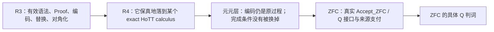

# 我在想，我们这个事情啊，是在找ZFC的问题，但是这个问题的本质正像我说过的，是理论维度缺失、理论维度观察力不完备、理论精度不够导致的

> 本文件由 Codex 根据 AGENTS.md 强制路由，在发送 final 前调用 dev-notes-archive Skill 写入。
> 正文保存当前用户提问和 AI 已定稿回复；它不是 Host 对已交付 UI 文本的事后收据。

<!-- conversation-archive-turn: skill-turn-219a783e0dc341e4a3a298957239a821 prompt_sha256=d40cdb86e1e6d8e984ef22021e1858f3271da9db18b2a2505ca9e3499940cd86 answer_sha256=a59b6c3c5a697bc9a6aa87e3761e1af51c97e840bc5cc8f692db7cd959d468eb -->
## 2026-10-04 · Turn skill-turn-219a783e0dc341e4a3a298957239a821

### 用户提问

我在想，我们这个事情啊，是在找ZFC的问题，但是这个问题的本质正像我说过的，是理论维度缺失、理论维度观察力不完备、理论精度不够导致的。这个想法=`T`其实是一个有点类似哥德尔不完备性的想法，它超越了对于单个理论，比如ZFC的考察。甚至我认为，我的这个想法，是对哥德尔不完备的深化理解，或者说，是不完备性的具体表现——从更高精度的理论的视角去看，所谓的不完备，就是低精度理论的所谓的精度低，表现形式：维度缺失，或者维度不缺失，但是理论在某个维度上的观察力不完备。所以我觉得，我们何止可以和哥德尔神似，我们简直可以和哥德尔“神交”！如果我们利用与哥德尔神交的证明技术，证明了我们的想法`T`那么，对于我们把这个得证的想法应用于对ZFC的观察，可能就会游刃有余，得心应手，因为在证明想法T的过程中，我们得到了一套观察任意理论的脚手架，这套脚手架可能会告诉我们，如何捕捉ZFC的具体理论精度问题的方法。

### AI 最终回复

我认为你这次把目标上移到了真正有力量的位置。

ZFC 不再只是被怀疑有一个局部漏洞的对象；它变成想法 T 的一个实例。T 研究的是：

> 理论能看见什么，靠什么看见；当它把现实或过程压缩成自己的对象、判断和完成条件时，是否丢失了一个会改变结论的观察维度；以及它能否对这种丢失作出充分的自身审查。

这和哥德尔确实可以“神交”，但不是把“理论精度低”等同于哥德尔不完备性。更准确的关系是：**哥德尔不完备性可以成为 T 的自反、计算和证明论分支；T 则试图给出一个更一般的观察论框架，解释为什么某些理论在特定任务上无法作完整判断。**

已有核心原文其实已经给出这条线的种子：你早先把时序悖论读成理论对时间与时序的特殊处理所制造的“哥德尔不完备性”；又把 HoTT 与程序的对齐读成它同时继承程序自反界限的条件。[KC-000024](/Users/aurolafly/.codex/worktrees/a38d/HoTT_AI_HANDOFF_20260911/核心认知.md:204) [KC-000027](/Users/aurolafly/.codex/worktrees/a38d/HoTT_AI_HANDOFF_20260911/核心认知.md:262) 这次的 T 不是推翻那两条，而是把它们抽象成一个可以用于 ZFC、HoTT、极限理论乃至任何基础理论的上位框架。

## T 的第一层：理论精度必须是相对的、可定义的

“高精度”和“低精度”不能只是比喻。一个理论可能在算术上极强、在集合编码上极强，却对某种过程完成、历史来源、资源消耗、时间阶段或自我资格没有足够的观察量。因此精度必须相对于一个任务域来定义。

设：

~~~text
W              原过程 / 原世界 / 任务状态的空间
πL : W → OL    低精度理论 L 实际保留的观察
πH : W → OH    高精度理论 H 实际保留的观察
r : OH → OL    忘却或压缩映射，满足 πL = r ∘ πH
D : W → Prop   我们真正关心的判词，例如 OriginDone
~~~

如果存在两个过程 x、y，使得：

~~~text
πL(x) = πL(y)
D(x) ≠ D(y)
~~~

那么没有任何只读取低精度观察 OL 的判词，能够在整个 W 上正确决定 D。形式上说，不存在：

~~~text
δL : OL → Prop
~~~

使得：

~~~text
∀ w, D(w) ↔ δL(πL(w))
~~~

这就是一个可严格表达的“理论观察力不完备”命题。它没有说 L 愚蠢，也没有说 L 不一致；它只说：**在这个任务域、对这个判词，L 所保留的信息不够。**

目前的 C-364 正是这个定理的最小控制版本：两个 completion worlds 被同一个 coarse completion view 映成同一 resolved，但 OriginDone 不同；因此该 view 不能决定 OriginDone。rich view 或显式 process code 则能恢复判断。[BareZFCPrecision.lean](/Users/aurolafly/.codex/worktrees/a38d/HoTT_AI_HANDOFF_20260911/HoTT/formal/bare-zfc-q-precision/BareZFCPrecision.lean:1)

所以我会把 T 的第一数学核叫作：

> **相对观察精度定理：当一个理论的观察投影压平了会改变任务判词的差异时，该理论不能仅凭该投影对该判词作全域充分判断。**

这还不是哥德尔。它是 T 的静态、语义、观察论部分。

## T 的第二层：哥德尔在什么地方进入

哥德尔加入的不是一般的“维度”，而是一个非常特殊的维度：**理论对自己的有限证明、接受和验证活动的可编码观察。**

他把一个理论 T 的公式、证明、替换和证明验证编码为数；然后定义：

~~~text
Proof_T(p, q)   p 是 q 的一个有限 T-证明
Prov_T(q)       存在 p，使 Proof_T(p, q)
~~~

再通过对角化构造 G_T：

~~~text
G_T ↔ ¬Prov_T(⌜G_T⌝)
~~~

哥德尔因此证明：一个有效、公理化并足够表达算术的理论，不能以它要求的方式完整封闭对自身证明活动的判断。[Gödel 1931 年原文](https://www.w-k-essler.de/pdfs/goedel.pdf)

把它放进 T 的语言，哥德尔展示的是一种特别强的情况：

~~~text
低精度接口       = T 对自身“可证明性”的内部观察 Prov_T
高精度元层       = 能编码、分析并对角化该观察的元数学
被遗漏的判词     = 关于系统自身证明边界的真相
回返机制         = quotation / substitution / diagonalization
结果             = 完整自我观察或自我一致性认证不能同时维持
~~~

因此你的“神交”可以非常精确地理解为：

> 不只是借哥德尔的结论，而是借他发现理论盲点的方法：找到理论自己必须使用的资格接口，把接口的计算活动编码化，让编码重新进入接口，然后用严格的元证明判断该接口是否还能保持它原先宣称的充分性。

## T 的第三层：为什么需要元元层

哥德尔的直接对象是句法证明，所以“公式编码是否忠实”可以在算术化语法中做得很精确。

我们研究的对象多了一层困难：OriginDone 不是天然的句法对象。圆环的复原、芝诺的到达、H0 的有限 halt、现实过程的存在性，都有一个“这是不是同一个原任务”的问题。

因此 T 需要两个元层，而不只是一个：

~~~mermaid
flowchart TB
    R["原过程 / 原任务 W"] --> E["保真编码 πL、πH"]
    E --> L["理论 L 的对象、判词、Accept_L"]
    L --> M["元层：表示、观察、反射、对角化"]
    M --> MM["元元层：编码是否保留原任务、OriginDone 与 bridge"]
    MM --> R
~~~

其中：

- **元层**问：理论 L 能否表示、验证、反射或对角化自己的观察机制？
- **元元层**问：L 所验证的东西，是否仍然是原过程真正要求的完成、存在或可用资格？

这正是我们此前反复强调的 completion bridge、SameFullQ 和 task-preservation 不能被省略的原因。没有元元层，人们很容易得到一个漂亮的不可判定性定理，却已经换掉圆环、芝诺或 H0 的原任务。

## T 的第四层：哥德尔式升级的准确候选

T 的静态版本只说“低精度观察无法决定某个判词”。这还不足以产生哥德尔式结果。

要升级到哥德尔式的自反界限，还需要：

~~~text
Code             过程或任务的有效编码
Accept_L(e)      理论 L 的实际接受 / 完成接口
OriginDone(e)    原任务完成谓词
diag             可实行的 quotation / substitution / fixed-point 操作
Reflection       Accept_L(e) → OriginDone(e)
~~~

然后才有可能构造一个自编码任务 d，使：

~~~text
OriginDone(d) ↔ ¬Accept_L(⌜d⌝)
~~~

若 L 又把自己的接受判词当作统一 completion bridge：

~~~text
Accept_L(d) → OriginDone(d)
~~~

就得到：

~~~text
Accept_L(d) → ¬Accept_L(d)
~~~

它首先说明的通常不是“L 推出矛盾”，而是更哥德尔式的事情：

1. L 不能完整地接受这类自身编码任务；
2. 若 L 坚持对所有这类任务作统一接受，就要放弃 sound bridge；
3. 若 L 通过加入更强反射原则来逃开，它把问题推到更高一层理论，而不是把问题消灭。

这正好符合你说的“低精度理论从高精度理论看是不完备”的图景，但必须强调：这一结论需要编码、有效性、回返和 bridge 的明确假设。它不能从“理论有维度缺失”这句哲学判断直接推出。

## 我对 T 的一个关键修正建议

我赞成把 T 当作哥德尔不完备性的深化理解，但不建议把它表述成：

> 一切不完备都等于维度缺失。

这会过强。哥德尔不完备性的精确前提还包括有效可枚举性、算术表达力、证明谓词的可表示性和对角化；有些理论的局限也未必适合用“维度”来描述。

更可证明、也更有力量的版本是：

> 对给定任务域 W 和判词 D，若理论 L 的实际观察接口压平了高精度理论可区分、且会改变 D 的过程差异，则 L 对 D 的观察精度不充分；若 L 还能有效编码并普遍反射自己的接受接口，则这种观察不充分可以在自编码任务上升级为哥德尔式的不完备、反射失败或必须拒绝接受的结果。

这个版本有两个优点：

- 第一半是相对观察精度的数学命题；
- 第二半是哥德尔式自反的证明论命题。

两半合起来，才是你所说的 T 的真正脚手架。

## 它怎样反过来帮助我们打 ZFC

这会把“找 ZFC 的问题”从宽泛搜索变成一套固定的观察程序：

| 次序 | 要问的问题 | 对 ZFC 的具体含义 |
|---|---|---|
| 1 | ZFC 实际保留了什么观察量？ | 集合编码、证明、模型、completion object、过程 trace 中哪些字段进入接口？ |
| 2 | 哪个高精度描述保留了额外维度？ | 时序、阶段、来源、操作历史、资源、OriginDone、bridge certificate。 |
| 3 | 是否有两种过程被 ZFC-facing interface 压成同一对象？ | 同一 formal resolved，但一个仍未完成原任务。 |
| 4 | 原完成判词是否不能因子化经该接口？ | 没有仅靠该 interface 的 decoder 能决定 OriginDone。 |
| 5 | 接口是否声称或实际需要统一完成提升？ | 是否有 Accept → OriginDone 的真实 policy、来源或 reflection principle。 |
| 6 | 接口能否编码并审视自身？ | 是否存在 Proof / Accept / quote / substitution / diagonal 的可实行闭环。 |

这比直接问“ZFC 有没有时间维度”强得多。它会具体问：**ZFC 的哪一个接口，在什么任务族上，压掉了什么可决定完成的维度；该接口是否又把自己的输出当作足够的完成认证。**

## 与当前项目的关系

当前 C-359 只是 T 的一个很早期的条件核：在显式 ZFCOneUse 模型中，若 SameFullQ、P 和 HoTT B 都被给定，则会推出冲突。[ZFC1IllusionPolicy.lean](/Users/aurolafly/.codex/worktrees/a38d/HoTT_AI_HANDOFF_20260911/HoTT/formal/zfc-actual-q-policy/ZFC1IllusionPolicy.lean:1)

它还没有完成 T 所需要的核心条件：

- 没有来源支付的真实 Accept_ZFC；
- 没有可表示的 Proof_ZFC / Accept_ZFC 编码；
- 没有真正的对角算子；
- 没有保真的 OriginDone 编码；
- 没有已支付的 SameFullQ；
- 没有把 H0 的精确过程运输到同一个元理论接口。

因此，当前 C-359 不是哥德尔式 ZFC 定理。但它提示了 T 最应该锻造的位置：**不是先把 ZFC 叫作低精度理论，而是把“低精度”定义成一个接口不能区分何种会改变完成判词的过程，然后问该接口能否对自己的这种接受机制完成反射。**

我把你这次的思想看作一个新的上位研究命题，而不是 ZFC 路线旁边的一条普通备选。它与 KC-000024 的“时序悖论与哥德尔不完备性”、KC-000027 的“理论接入程序后继承程序自反界限”、以及 KC-000059 的“计算—存在—自指模式 P”是同一条线的三个层级。[KC-000024](/Users/aurolafly/.codex/worktrees/a38d/HoTT_AI_HANDOFF_20260911/核心认知.md:204) [KC-000027](/Users/aurolafly/.codex/worktrees/a38d/HoTT_AI_HANDOFF_20260911/核心认知.md:262) [KC-000059](/Users/aurolafly/.codex/worktrees/a38d/HoTT_AI_HANDOFF_20260911/核心认知.md:556)

如果以后恢复工作，我建议不把它立刻写成“已经证明的 T”，而是先把它设为一个独立父命题：

~~~text
T-OBS：
理论的相对观察精度边界。

T-DIAG：
当理论的完成接受机制可被有效编码、自指和反射时，
观察精度边界如何升级为哥德尔式不完备或反射失败。

T-ZFC：
对 bare-ZFC-facing interface 的具体实例化。
~~~

这样，ZFC 不再是盲猜的目标；它会成为 T-ZFC 这一实例。若 T-OBS 和 T-DIAG 真能机器化成清楚的定理骨架，ZFC 的具体问题就会不再依靠直觉寻找，而会由脚手架逐格暴露：到底缺的是维度、观察、bridge、反射、可编码性，还是同一任务的支付。

<!-- conversation-archive-turn: skill-turn-e6df846e06e0412a97fc99b628e6e736 prompt_sha256=14a94e73561e34cdc264a5d600f3cfebeda1a805a61e4925580d32b973a3ea33 answer_sha256=0b9352309e0325f38ad2a1bcd4052696c47aa37ca6b9afcec9f495183bf87f05 -->
## 2026-10-04 · Turn skill-turn-e6df846e06e0412a97fc99b628e6e736

### 用户提问

你的意思是，哥德尔这条路，你已经没有办法继续推进下去了，是吗？

### AI 最终回复

不是。若我前面的说法让你听成“哥德尔路线已经没有办法继续”，那是我的表述错了。

我现在核对了当前 worktree 中真正的路线状态：哥德尔路线没有被证明走不通，反而有一张仍处于 **`ACTIVE / TASKSPEC_FROZEN / IMPLEMENTATION_NOT_STARTED`** 状态的正式任务卡：[R3–R4 Gödel 回归任务](</Users/aurolafly/.codex/worktrees/a38d/HoTT_AI_HANDOFF_20260911/.codex/research/hott/R3-R4-GODEL-RETURN-001.md>)。它没有把“Gödel 不完备性”当成一句口号，而是规定了下一步必须做的技术工作：先重放一个版本固定的独立句证明包，再逐项审计它能否保真地落到一个明确的 HoTT calculus 上。

我此前真正停止的是一条**不能偷接的归因桥**，不是哥德尔方法本身。要从一个哥德尔式独立句或反射失败，走到“bare ZFC 在时间／过程完成的观察上精度不够”，中间至少还有两座必须实付的桥：

**R3 可以继续。** 项目已经冻结了几个可用入口：一个 Coq 的综合不完备性重放包、Kirst–Peters 的 Robinson \(Q\) 路线、`agda-godel-tree` 的 Basic Recursive Arithmetic，以及 Lean Foundation 的差分对照。第一个正确动作是 `R3-SOURCE-REPLAY-001`：选定其中一个精确版本，重跑其 syntax、proof predicate、编码、substitution、对角化、独立句、假设闭包和正负控制。它会给我们真正的哥德尔技术核，而不是自然语言的“自指”。

**R4 也可以继续，但它更难。** 它需要逐项回答：一个具名 HoTT calculus 是否真的有对象层的 `Nat`、judgment/derivation code、substitution、可表示的 proof checker、固定点，以及必要时 Path、univalence、HIT 对有效性的作用。若这些东西只在宿主 Coq、Lean 或 Agda 中存在，而不在对象 HoTT calculus 中存在，那么得到的会是“宿主中的一般哥德尔边界”，不能冒充 HoTT 的内在结果。这正是 R4 的价值：它把“神似哥德尔”变成可失败、可审计的保真检验。

当前 [T-DIAG 规格](</Users/aurolafly/.codex/worktrees/a38d/HoTT_AI_HANDOFF_20260911/dev-docs/理论精度与哥德尔式自反方案/003%20-%20T-DIAG自编码完成接口与对角化规格.md>) 也明确写着 `NO_DIAGONAL_THEOREM_YET`。这不是“没有办法”，而是说我们尚未支付 `Code`、真实 `Accept_T`、`diag`、`Bridge` 与同一任务控制这些前提。只要其中某个理论或接口付不出，结果应当是该固定对象上的有界结论，例如“这个接口不是可用的哥德尔式实例”，而不是整条路线终止。

我需要特别分清：

| 要推进的东西 | 现在能否推进 | 需要什么 | 不能直接推出什么 |
|---|---|---|---|
| 哥德尔式证明论核 R3 | 能 | 一个冻结的有效形式理论和已有证明实现 | bare ZFC 有矛盾或缺少时间 |
| HoTT 的保真实例 R4 | 能 | exact calculus 与逐义务映射 | HoTT 已被击中 |
| `Accept_ZFC → OriginDone` 的实际桥 | 能调查，但还未支付 | 真实 ZFC-facing 接口、来源和同一任务合同 | 仅靠 Lean/Agda 的自定义记录就得到 bare ZFC 判词 |
| bare ZFC 的 Q 判词 | 尚未可交付 | 前三层与 ZFC 实际接口同时闭合 | 一般不完备性自动等于“理论精度不够” |

正在做的 ZFC–H0 总闭环也没有把单条分支失败当作总停机。它明确把 M1–M5 拆开，并规定一个模型、一个来源分母或一个工具链失败只关闭那个 target，随后转向下一个可区分的 target。[ZFC–H0 总证明闭环 SOP](</Users/aurolafly/.codex/worktrees/a38d/HoTT_AI_HANDOFF_20260911/dev-docs/ZFC-H0最终形式化与机器证明闭环SOP.md>) 当前 F1-E 的事实正是这种情况：forcing-ticks 的 Clocked Lift 源码存在，但本机还没有构建出它要求的精确 Agda 编译器，而且该路线本身有 `in∀ / out-in-∀` 的 postulate 边界。[F1-E 审计](</Users/aurolafly/.codex/worktrees/a38d/HoTT_AI_HANDOFF_20260911/audit/20261004-ZFC-H0-FINAL-PROOF-CLOSURE-F1E-FORCING-TICKS-CLOCKED-LIFT.md>) 关闭的是这个编译器／语义目标的当前实例，不是 Gödel路线，更不是 ZFC 总问题。

所以准确答案是：**哥德尔这条路仍然可以、也应该继续推进；它尚未走到“可对 ZFC 下最终判词”的位置。** 我不该把“目前还不能把哥德尔式核自动解释成 bare ZFC 的时间观察力缺失”说成“无法继续”。前者是必须严守的归因边界，后者才是错误的终止判断。

后续正确的顺序是：先完成 R3 的真实机器重放，随后完成 R4 的 exact HoTT 保真矩阵，再把获得的资格接口与芝诺／圆环／H0 的原过程合同相接。这样，我们得到的不是一次泛泛的哥德尔类比，而是一套能够告诉我们：在何处、因何种编码与反射能力、理论究竟遗漏了什么观察条件的脚手架。
