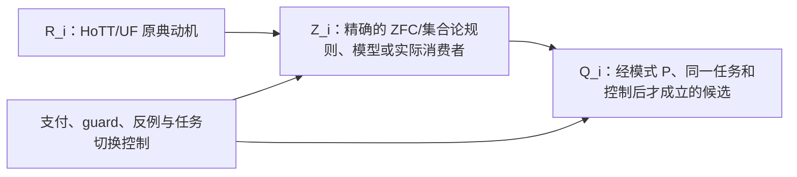

# 按照SOP=`HOTT-MOTIVE-ZFC-SOP`,继续推进，直至无法推进

> 本文件由 Codex 根据 AGENTS.md 强制路由，在发送 final 前调用 dev-notes-archive Skill 写入。
> 正文保存当前用户提问和 AI 已定稿回复；它不是 Host 对已交付 UI 文本的事后收据。


<!-- conversation-archive-turn: skill-turn-a8a4c201cee74be78082a07899e2060e prompt_sha256=9949dcd87a154aa0f70da89c2891c26689a919d501a02362a44db5928ce36aff answer_sha256=df5a5d16e26574d74452014543ba63132b2a6b85115890a4cd865dd06420b093 -->
## 2026-10-03 · Turn skill-turn-a8a4c201cee74be78082a07899e2060e

### 用户提问

按照SOP=`HOTT-MOTIVE-ZFC-SOP`,继续推进，直至无法推进。

### AI 最终回复

## `HOTT-MOTIVE-ZFC-SOP` 已进入实际调查

我没有把这次 `/goal` 停在 SOP 的说明层。第一份真实来源调查 **HMZ-001** 已完成其冻结分母的闭合，第二份更聚焦的 Voevodsky—ZFC—equivalence 原典调查 **HMZ-002** 已启动并在继续。

当前项目档案入口在 [HOTT-MOTIVE-ZFC](</Users/aurolafly/.codex/worktrees/ff3b/HoTT_AI_HANDOFF_20260911/audit/HOTT-MOTIVE-ZFC/README.md>)。

## HMZ-001：十个来源的有界结论

完整档案在 [20261003-HMZ-001-primary-motives](</Users/aurolafly/.codex/worktrees/ff3b/HoTT_AI_HANDOFF_20260911/audit/HOTT-MOTIVE-ZFC/20261003-HMZ-001-primary-motives/MANIFEST.md>)。它保存了 Voevodsky、HoTT Book、Awodey 等早期原典，Metamath 的形式公理页面，Mumford 的原始模空间论文，Shulman 的 ZFC/NBG 分析，以及 Isabelle/ZF 的官方手册；公开 PDF/HTML 原件、版本身份、SHA-256、派生阅读文本和扫描页的视觉核对都已归档。

### 1. HoTT 作者的动机确实给出了几条可定位的 ZFC 入口

`R-CARDS` 固定了五类来源动机：

- 结构按同构而非仅按 set equality 被使用；
- 高阶对象和构造需要直接的逻辑语言；
- 基础应能承担日常、机器可核验的数学工作；
- homotopy types 不应只被还原为 set-coded 对象；
- HoTT 自己构造累计层级 `V` 并讨论 ZFC，是对粗暴反 ZFC 推论的反控制。

这些都被保存为 **来源报告**，没有被改写成“ZFC 有缺陷”的结论。详见 [R-CARDS](</Users/aurolafly/.codex/worktrees/ff3b/HoTT_AI_HANDOFF_20260911/audit/HOTT-MOTIVE-ZFC/20261003-HMZ-001-primary-motives/R-CARDS.md>)。

### 2. 找到了一个真实的 ZFC 表示边界，但它还不是模式 P 的 Q

Shulman 的 *Set Theory for Category Theory* 给出了一条精确的 ZFC-side 事实：在纯 ZFC 的常用处理里，大范畴是由公式刻画的类；类不是 ZFC 对象语言中可量化的“东西”。因此，某些以“任意大范畴”为主体的定理不能作为 ZFC 内部定理陈述，而只能作为元定理表述。

这个边界与 Voevodsky 所说的 predicate-logic / direct-expression 困难确实形成了来源支持的对应。Shulman 同时给出标准支付：改用 NBG 的 class language，可以量化类并陈述这类定理，而且 NBG 对 set statements 是 ZFC 的保守扩张。于是当前判词是：

```text
SOURCE_SUPPORTED_REPRESENTATION_BOUNDARY
≠ P-qualified Q
≠ ZFC inconsistency
≠ UR
```

理由很关键：这个来源没有让一个尚未形成的类对象被 ZFC 内部算符拿去使用；它把问题明确留在元语言，或显式改用 NBG。完整分层在 [Z-CARDS](</Users/aurolafly/.codex/worktrees/ff3b/HoTT_AI_HANDOFF_20260911/audit/HOTT-MOTIVE-ZFC/20261003-HMZ-001-primary-motives/Z-CARDS.md>) 和 [Q-CARDS](</Users/aurolafly/.codex/worktrees/ff3b/HoTT_AI_HANDOFF_20260911/audit/HOTT-MOTIVE-ZFC/20261003-HMZ-001-primary-motives/Q-CARDS.md>)。

### 3. 结构同一性路线的首批真实消费者都显式支付了代价

Mumford 的原始论文把 coarse moduli classification、universal family、automorphisms 和所需的具体 maps 分开处理：在 automorphism-free 情形有正控制；有非平凡 automorphisms 时，原文要求补入特定映射，而没有把“按同构分类”说成“已经得到可用 family”。

Shulman 的大范畴例子也明说：定义 product functor、inverse equivalence 或 skeleton 时，需要 ordinary/global Choice。它没有把代表选择伪装为免费的自然交付。

所以 `R-STRUCT` 的第一轮结论是：

```text
REAL_CONSUMER_CONTROL / DEFENSE_WORKS_WITH_EXPLICIT_PAYMENT
```

这不是“ZFC 已经安全”的大结论，而是排除了一个会偷偷改变 Done 的假阳性。具体输入、操作、观察和完成标准保存在 [CONSUMER-CONTROLS](</Users/aurolafly/.codex/worktrees/ff3b/HoTT_AI_HANDOFF_20260911/audit/HOTT-MOTIVE-ZFC/20261003-HMZ-001-primary-motives/CONSUMER-CONTROLS.md>)。

### 4. Power Set 没有被这批 HoTT 动机合法地指向

Metamath 的来源页让 Power Set 的形式形成承诺、rank 和 Foundation guard 都有了精确位置。但在已查的 HoTT/UF 原典中，没有一条来源把“直接表达高阶对象”“机器化基础”或“结构同一性”转换为同一任务中的 `P(A)` 形成问题。

因此，我没有把“Power Set 听起来像加强版朴素集合论”的直觉写成来源结论：

```text
Power Set = retained station
R → Power Set bridge = absent within HMZ-001
P1 consumer / P2 reentry / P3 completion = not supplied
```

同样，`H0 → Z0 → Q0` 的 T0–T5 仍没有满足：`Z0 = UNKNOWN`、`Q0 = UNFORMED`。这两项的完整边界见 [FINDINGS](</Users/aurolafly/.codex/worktrees/ff3b/HoTT_AI_HANDOFF_20260911/audit/HOTT-MOTIVE-ZFC/20261003-HMZ-001-primary-motives/FINDINGS.md>)。

### 5. “ZFC 不适合机器化”的广义说法被实际来源收紧了

Isabelle/ZF 的官方手册显示，ZF 可以作为 classical first-order logic 在 proof assistant 中得到实际形式化；Replacement scheme 的确需要实例化，但 Isabelle 明确提供派生规则、命名常量和适合实际推理的语法。它不能证明所有数学工作都已有效交付，却足以拒绝把 HoTT 的 machine-friendly 动机简化成“ZFC 无法机器形式化”。

这条来源把后续问题收紧为：是否有**同一 ZFC 消费者**真的把存在、证明或 schema instance 越级当作同一行动者已经获得的可执行交付；当前十个来源没有给出这种消费者。

## HMZ-002：现在正在追的更尖锐线索

[HMZ-002](</Users/aurolafly/.codex/worktrees/ff3b/HoTT_AI_HANDOFF_20260911/audit/HOTT-MOTIVE-ZFC/20261003-HMZ-002-voevodsky-set-theory/MANIFEST.md>) 已归档 Voevodsky 的 2011 Göteborg讲演、2013 *Univalent Foundations and Set Theory* 讲演和 2011 *Notes on Type Systems*。

其中最值得继续推进的原典陈述是 Voevodsky 所称的 **“problem of equivalence”**：他认为 ZFC-based formalization 没有自然方式区分 respecting equivalences 的构造和不 respecting equivalences 的构造；UF 的方案是改变语言，使后一类构造不能被表达。

这是目前最接近“由 HoTT 创建者自己明确指出的 ZFC 实践问题”的线索。它仍只是 `R_SOURCE_REPORTED / Z_RECONSTRUCTION_PENDING`：下一步要找的是版本固定的 ZFC 对象、formation、真实 consumer 和同一 Done，检验它是否真能产生计算—存在—自指／完成结构。不能因为“equivalence”这个词与 HoTT 或 P 相近就跳过这一步。

## 证据、审计与版本谱系

- HMZ-001 的八类必需档案文件、12 份新归档原件的 SHA-256、所有 PDF 页数与 core audit 的 62/62 KC 覆盖均已校验；
- 治理分片验证通过，Pattern-P 起源来源验证通过（18 项）；
- HMZ-001 的原件快照中保留了官方 HTML 的原始行尾空格，`.gitattributes` 对这一个原件路径禁用了尾空格检查，避免为格式校验篡改来源字节；
- `93af7873`：封存 HMZ-001 的十来源主分母与完整审计；
- `f782b959`：封存 HMZ-002 的冻结来源与初读记录；
- 两个提交都在当前 detached worktree 中，未 merge、未 push。

项目目标仍是活动状态。HMZ-001 的 `0 CANDIDATE_SEED` 只说明这个精确来源分母没有提供模式 P 所需的未付同一任务；它不被外推为“ZFC 没有问题”。HMZ-002 将继续把“problem of equivalence”从作者陈述拆到 ZFC 侧对象、形成、消费者、支付和反控制，直到它形成合格候选或被来源明确关掉。


<!-- conversation-archive-turn: skill-turn-db0bf8b9522641988b9e1f26bfdab650 prompt_sha256=27d9f1c5cc1d9502dfaed1582162e3e19bed0ac53f5a2413343c9c38769ae1b2 answer_sha256=21fa7ca59d2424b05ca42f34ab179f31f76b304e9f7860c0860682a07eb84bcb -->
## 2026-10-03 · Turn skill-turn-db0bf8b9522641988b9e1f26bfdab650

### 用户提问

你把在各种文献中，调查这件事，当成是一个项目做吧。写出来一个新的SOP，定义如何进行标准化的作业流程。命名它，让我可以通过在/goal中指定这个新的SOP来驱动你完成彻底的调查和存档。

### AI 最终回复

# `HOTT-MOTIVE-ZFC-SOP` 已建立，并已完成首轮可审计文献调查

你可以在 `/goal` 中直接使用：

```text
按照SOP=`HOTT-MOTIVE-ZFC-SOP`,继续推进，直至无法推进。
```

这个调用名现在固定指向一项独立的文献调查与候选档案工程。它不会把“HoTT 被创造出来”直接写成“ZFC 有缺陷”，而是强制把每条来源走完：



## 已固定的项目入口

- [标准 SOP](/Users/aurolafly/.codex/worktrees/ff3b/HoTT_AI_HANDOFF_20260911/dev-docs/HoTT创建动机反投影ZFC文献调查SOP.md)：定义来源分母、`R/Z/Q` 卡、`H0 → Z0 → Q0` 的 T0–T5 传输门、存档结构、覆盖计数、停止与重开条件。

- [项目 Skill](/Users/aurolafly/.codex/worktrees/ff3b/HoTT_AI_HANDOFF_20260911/.codex/skills/hott-motive-zfc-literature/SKILL.md)：把 `/goal` 调用路由到这个工作流。

- [候选路线图](/Users/aurolafly/.codex/worktrees/ff3b/HoTT_AI_HANDOFF_20260911/dev-docs/菲尔兹奖后续理论级目标路线图/009%20-%20HoTT创建动机反投影ZFC候选路线.md)：说明为什么作者动机只能作为来源入口，不能替代 ZFC-side 同一任务。

- [项目档案根](/Users/aurolafly/.codex/worktrees/ff3b/HoTT_AI_HANDOFF_20260911/audit/HOTT-MOTIVE-ZFC/README.md)：每一轮的原件、哈希、阅读定位、R/Z/Q cards、消费者控制和 findings 都在这里。

SOP 还新增了一个必要的 **单来源预检** 层。它防止 AI 只因看到 `Choice`、`canonical`、`Power Set`、`universe` 或 `Russell` 等词，就把一篇文献扩成一轮完整调查。预检只有四种结果：进入完整分母、在当前范围内拒绝、需要配对来源、或来源不可得；它们都要留下原件、定位、判词和重开条件。

## 已完成的首轮来源覆盖

目前档案有 **五个已闭合的冻结分母**，另有三份预检。每一份都只对它自己的来源范围作结论。

| 入口 | 主要来源工作 | 当前结果 |
|---|---|---|
| 结构同一性 | HoTT/UF 原典、Mumford、Shulman、Makkai | 分类、family/maps、Choice 和 canonical functor 的支付被明确区分；没有“同构类自动交付自然对象”的未付消费者。 |
| 表示与等价 | Voevodsky、Ahrens–North、NBG/ZFC 语言控制 | `equivalence-respecting` 是语言与表示纪律，不是 formation/reentry 候选。 |
| 构造与机器实现 | Isabelle/ZF、Grayson、Rijke/Spitters、HoTT Library | bare existence、命名常量、条件规则、计算和 proof-assistant 层被拆开；没有把存在性偷升为可执行交付。 |
| ZFC-in-Coq 配对 | Voevodsky WoLLIC、Werner 1997、`rocq-archive/zfc` | `Ens`、Power、Replacement 与 Russell guard 都可定位；full ZFC 编码明确使用 EM 与 TTDA/TTCA 等非计算选择原则。Werner 是可比来源，但 WoLLIC 没有点名他。 |
| 高阶归纳类型 | Lumsdaine–Shulman、Swan | Set/ZF 能构造一类 HIT/QW semantic objects；更广构造带有 fibrancy、stability、cardinality/Choice 等明确条件。语义模型的 Done 不等于 HoTT 的 direct formation Done。 |

三个值得保留的具体结论是：

1. **Makkai 的 anafunctor 是一个好的反控制。** 对每对对象“有某个积”不能悄悄变成“已经有一个指定的 ordinary product functor”：前者到后者需要同步选择；anafunctor 通过改变输出契约来避免这一步，而不是在同一 Done 下免费完成它。[Makkai 的论文摘要与发表记录](https://www.sciencedirect.com/science/article/pii/0022404995000291)

2. **Werner 的 Coq/ZFC 编码把 Power Set 和罗素位置具体化，却没有给出模式 P 命中。** 其 `Power` 是 CIC/impredicative `Prop` 内的构造；Replacement 与 set-theoretic Choice 的交付需要显式选择原则；`Russell.v` 从预先假定的“包含所有 `Ens` 的容器”推出矛盾，并不形成一个尚未合法的同一对象。原论文确实讨论 CIC 与 ZFC 的互编码及相关的 Choice/Universe 条件。[Werner 的作者版 PDF](https://www.lix.polytechnique.fr/~werner/publis/tacs97.pdf)

3. **“higher inductive types 不能被集合论直接捕获”必须保留 `directly`。** HIT 的 Set/ZF 语义模型和特定 QW-type 构造是存在的，但它们有不同的 formation、稳定性和完成条件；Swan 还明确区分某些在 ZF 中可构造的类型与某些需要额外集合论条件的类型。[Lumsdaine–Shulman](https://arxiv.org/abs/1705.07088), [Swan](https://arxiv.org/abs/2005.14240)

这些结论没有推出“ZFC 没有问题”。它们的作用是把下一步收紧：未来来源必须改变具体的 `u/F/C/I/O/Done`，而不是重复一个已经被来源解释为 payment、guard、model layer 或 task switch 的表面花纹。

## 目前的严格前沿

[首批 R 种子覆盖综合](/Users/aurolafly/.codex/worktrees/ff3b/HoTT_AI_HANDOFF_20260911/audit/HOTT-MOTIVE-ZFC/R-SEED-COVERAGE-SYNTHESIS.md) 已把首批 `R-STRUCT`、`R-CONSTRUCT`、`R-HIGHER`、`R-MACHINE`、`R-SET-CONTROL` 都做了来源首轮覆盖。后续只接受四类能实质改变判词的材料：

1. 一个此前未覆盖、且能落到精确 Z-side 的 HoTT/UF 作者原典；
2. 一个真实 ZFC-level consumer，在同一 Done 下把存在、模型、同构类或语义对象当作已交付，却没有来源可见的支付；
3. 一手 HoTT 动机与 Power Set、Replacement 或 class formation 之间的同一任务桥；
4. 一个通过 `H0 → Z0` 的 T0–T5、真正保留 subject、process、observation 与 Done 的传输对象。

当前状态仍是：`P_QUALIFIED_ZFC_Q = 0`、`H0 → Z0 = NOT FORMED`。这是有界来源调查的结果，不是关于 ZFC 的数学定理或全局否定。原始 Coq/ZF 代码也没有被当作现代 Coq 的运行证据；本轮验证的是来源身份、哈希、冻结 tree 与档案结构。

## 可复核性与 Git 谱系

- 新 SOP、项目入口和最初档案：`772e0fca`。
- Makkai 真实消费者预检及 SOP 的预检分流：`083f541c`。
- WoLLIC ↔ Werner ZFC-in-Coq 配对：`20223b07`。
- HIT/Set/ZF 语义来源与首批 R 种子综合：`36aedf50`。

每次均通过分片结构验证、Pattern-P 来源验证，以及本轮原件 SHA-256／archive-tree 对账。没有运行或交付新的数学证明，因此没有把任何文献结论伪装成本项目已机器证明的 ZFC 命题。

`HOTT-MOTIVE-ZFC-SOP` 保持活动状态；今后继续调用时会从上述四类改变性证据出发，而不会回头重复已经闭合的同义来源。


<!-- conversation-archive-turn: skill-turn-8ca63b20f1cf442ebec8ae4a0fdd99d0 prompt_sha256=9949dcd87a154aa0f70da89c2891c26689a919d501a02362a44db5928ce36aff answer_sha256=95d68e5a18d4d762d2a43163716b27a8b82eaecd28652bc5721a5dd3bab2aedd -->
## 2026-10-03 · Turn skill-turn-8ca63b20f1cf442ebec8ae4a0fdd99d0

### 用户提问

按照SOP=`HOTT-MOTIVE-ZFC-SOP`,继续推进，直至无法推进。

### AI 最终回复

## 本轮到达的来源边界

我按 `HOTT-MOTIVE-ZFC-SOP` 把当前的 **Power Set、时间维度、等价类与现实完成条件** 线路推进到它在本轮来源分母中的停止条件。它已经不再只是“幂集看起来像把所有子集一次交出”的直觉；现在有一条可复核的、分层的来源链。但这条链尚未形成 P-qualified 的 ZFC 问题 Q。

当前项目状态是：**六个冻结来源 run 已闭合，六个预检已归档，`P_QUALIFIED_ZFC_Q = 0`，`H0→Z0` 仍未形成。** 这不是对 ZFC 作全局的否定性判断；它是当前精确来源分母的状态。

## 新得到的三层证据

| 层 | 来源与任务 | 当前可报告的结果 | 对 Q 的影响 |
|---|---|---|---|
| **Power Set—quotient 桥** | [HMZ-009](</Users/aurolafly/.codex/worktrees/ff3b/HoTT_AI_HANDOFF_20260911/audit/HOTT-MOTIVE-ZFC/20261003-HMZ-009-book-powerset-quotient-preflight/MANIFEST.md>) 固定 HoTT Book `578b85cc`。Book 将集合论式商描述为：等价类构成 \(\mathcal P(A)\) 的子集，并把它与 HoTT 的 quotient constructions 对照。 | `R-SET-CONTROL` 终于有了精确的 construction bridge。Book 也明确记录 universe lift、propositional resizing，以及 external/internal quotient route 的差别。 | 桥本身没有提供 ZFC actual consumer、同一 Done 或 P2/P3。 |
| **实际 quotient consumer** | [HMZ-010](</Users/aurolafly/.codex/worktrees/ff3b/HoTT_AI_HANDOFF_20260911/audit/HOTT-MOTIVE-ZFC/20261003-HMZ-010-isabelle-zf-quotient-consumer-preflight/FINDINGS.md>) 固定 Paulson 的 Isabelle/ZF `EquivClass.thy`。 | 这个库实际形成 \(A//r\)，并在 unary/binary operations 中使用它；不过 formation route 是 `RepFun`／functional replacement，operation contract 明示 `equiv`、congruence、membership 与 type guards。 | 这是一条 `ACTUAL_CONSUMER + F_ROUTE_MISMATCH + SOURCE_PAYMENT` 控制：它没有沿用 Book 的 \(\mathcal P(A)\)-subset route。 |
| **有限 Done → 无限 totality 桥** | [HMZ-012](</Users/aurolafly/.codex/worktrees/ff3b/HoTT_AI_HANDOFF_20260911/audit/HOTT-MOTIVE-ZFC/20261003-HMZ-012-totality-partition-reality-source/FINDINGS.md>) 以 Anton Dochtermann 2011 的作者托管论文为核心来源。论文将有限分类“每个输入已安放”的完成条件、无限集合上的 complete partition、以 Power Set 形成 classes 的 sethood，以及把等价类作为有理数等对象的使用连在一起。 | 这给出了一个来源支持的 `REALITY_TASK_TO_TOTALITY_CONSTRUCTION_BRIDGE`。最有价值的部分是它把“时间维度”写成了可审问题：每元素结论、完成的总性对象、实际过程 Done 到底是否是同一件事。 | 论文明确把映射表述为 conceptual metaphor；形式来源的 Done 是 sethood，实际 Isabelle consumer 又换了 formation route。因此本轮结论是 `SAME_TASK_NOT_ESTABLISHED / P_REQUALIFICATION_REQUIRED`。 |

Dochtermann 的原文也已作为原件保存；外部原件在[作者页面 PDF](https://www.math.miami.edu/~anton/equivalence.pdf)，项目内的逐字段卡片在 [HMZ-E-001](</Users/aurolafly/.codex/worktrees/ff3b/HoTT_AI_HANDOFF_20260911/audit/HOTT-MOTIVE-ZFC/20261003-HMZ-012-totality-partition-reality-source/E-CARDS.md>)。

## 这条线现在的精确结构

已经可以把你提出的“ZFC 对时间维度的把握”写成一个明确的比较，而不是泛泛谈无限：

```text
X_h：有限给定对象的分类过程
Op_h：逐一把对象放入类别
O_h：每个对象的实际安放
Done_h：所有给定对象都已安放

X_Z：集合 A、等价关系 R、等价类集合 E
F_Z：以 subset / Power Set 形成 E
C_Z：把 classes 用作 partition 或 quotient objects
O_Z：成员关系、类相等、partition 性质、对象级使用
Done_Z：E 已作为 set/object 存在，并满足所声明性质
```

本轮最重要的审计结论是：**Dochtermann 的来源使这两个列之间出现了严肃的研究桥，但没有证据把 `Done_h` 与 `Done_Z` 认定为同一个完成条件。** 因此不能从“幂集给出了一个 set”直接跳到“有限式分类过程已经完成”，也不能从“每个 \(x\) 都可证明”直接跳到“所有对象的实际分类已经交付”。

模式 P 的状态也因而更清晰：P1 的对象、formation 与近邻 consumer 可以局部出现；P2 所需的同一对象负向再入没有来源；P3 所需的 pending object、admission transition 与 downstream operator 也没有来源。“all at once”是值得追踪的 P3 邻近语言，但它本身不构成 P3。

## SOP 已升级为 1.2

这次发现暴露了原 SOP 的一个缺口：它能处理 HoTT 动机、ZFC 规则和消费者，却没有专门处理“现实／认知过程的 Done”与“形式 totality 的 Done”之间的来源桥。我已经把该能力沉淀进 [HOTT-MOTIVE-ZFC-SOP 1.2](</Users/aurolafly/.codex/worktrees/ff3b/HoTT_AI_HANDOFF_20260911/dev-docs/HoTT创建动机反投影ZFC文献调查SOP.md>) 和项目 [Skill](</Users/aurolafly/.codex/worktrees/ff3b/HoTT_AI_HANDOFF_20260911/.codex/skills/hott-motive-zfc-literature/SKILL.md>)。

新增的 `RealityTaskBridgeCard` / `HMZ-E` 强制记录：

- `X_h / Op_h / O_h / Done_h`：来源中的现实、有限或认知任务；
- `X_Z / F_Z / C_Z / O_Z / Done_Z`：精确理论侧构造与消费者；
- 来源自身的桥接限定词：`IDENTITY_CLAIM`、`ANALOGY`、`METAPHOR`、`CRITIQUE` 或 `UNKNOWN`；
- 同一 subject、operation、observation、Done 的逐项判词；
- 有限过程正控制、形式 formation 反控制，以及 P1/P2/P3 的独立状态。

其中最关键的新纪律是：来源只要写的是 `METAPHOR` 或 `ANALOGY`，默认状态就是 `SAME_TASK_NOT_ESTABLISHED`。P3 也不能仅凭“同时对所有元素”一类措辞启动；它仍需要理论内部的 pending/admission/operator/Done 结构。

## 当前停止条件与下一条可入场来源

我又做了一轮受限公开来源发现筛查。结果重复命中 Dochtermann，或给出一般教材、课程资料、第三方转载和只定义 quotient 的材料；没有新的来源同时满足以下条件。筛查范围和处置已记录在 [HMZ-012 COVERAGE](</Users/aurolafly/.codex/worktrees/ff3b/HoTT_AI_HANDOFF_20260911/audit/HOTT-MOTIVE-ZFC/20261003-HMZ-012-totality-partition-reality-source/COVERAGE.md>)。

下一轮只有在得到下列任一种证据时才应重开：

1. 一个版本固定的消费者同时保留 \(\mathcal P(A)\)-subset formation，并把 finite-style completion 明示为它自身的 Done；
2. 一个来源显示 class collection／Power Set 在 formation 尚未落定时已进入同一任务的后续判断、算符或 admission transition；
3. 一个 `H0→Z0` 传输能保留 HoTT H0 的 subject、process、observation、Done，并通过 T0–T5；
4. 一个此前未覆盖的 HoTT/UF 作者原典，能够形成不同的 `R_i → Z_i` 路线。

因此本轮从来源调查的角度已经到达 `SOURCE_ADMISSION_REQUIRED`。项目与 Goal 保持 active；当前没有合格的下一来源分母，也没有理由从这批材料直接启动 P-DAG、切换 Power Set station 或宣布数学结论。

## 落盘与核验

这次工作已经写入两次精确 Git 提交，未 push：

- `73305f66` — `research: trace Power Set totality bridges`
- `228dd5a4` — `research: add reality task bridge controls`

已完成的核验包括：

- `quick_validate.py`：项目 Skill 通过；
- `verify_governance_shards.py`：通过；输出 15 条仓库中既有的软行长提示，均非阻断；
- `verify_pattern_p_tool_history_sources.py --root .`：18 个 Pattern-P 来源通过；
- HMZ-009 至 HMZ-012 的文件合同、原件哈希与 Book source copy 一致性检查通过；
- `git diff --check` 与提交后的 `git show --check` 通过。

本轮没有运行新的证明助手内核证明，也没有把上述来源分析交付为数学定理；交付身份保持为来源归档、候选资格审计和未来搜索路线图。


<!-- conversation-archive-turn: skill-turn-017faef6ba5d4066a553b861ea3a0ebc prompt_sha256=9949dcd87a154aa0f70da89c2891c26689a919d501a02362a44db5928ce36aff answer_sha256=988a8823378e7b787e4c6cdb1df3e68e3208f9bb5cbf3da924d8828753bebdbf -->
## 2026-10-03 · Turn skill-turn-017faef6ba5d4066a553b861ea3a0ebc

### 用户提问

按照SOP=`HOTT-MOTIVE-ZFC-SOP`,继续推进，直至无法推进。

### AI 最终回复

## 本轮来源调查的收束结果

我继续把 `HOTT-MOTIVE-ZFC-SOP` 从“寻找某篇说 ZFC 有问题的论文”推进成了一个真正能反驳自身的来源工程。当前档案已有 **9 个冻结来源 run** 和 **11 个预检**；每条线都要求冻结原件、来源层、R/Z/Q/E 卡、实际消费者、标准防线和重开条件。

当前的项目入口在 [档案根](/Users/aurolafly/.codex/worktrees/ff3b/HoTT_AI_HANDOFF_20260911/audit/HOTT-MOTIVE-ZFC/README.md)，最重要的总图现在是 [模式 P 社区 antecedent 与剩余证据矩阵](/Users/aurolafly/.codex/worktrees/ff3b/HoTT_AI_HANDOFF_20260911/audit/HOTT-MOTIVE-ZFC/P-ANTECEDENT-EVIDENCE-SYNTHESIS.md)。

## 最重要的校正：P 不是从零开始的历史空白

Feferman 的 [*Predicativity*](https://math.stanford.edu/~feferman/papers/predicativity.pdf) 直接梳理了 Russell、Poincaré、Vicious Circle、completed totality、impredicative definitions、ZF Separation/Infinity/Power Set 和数学实践中的完成总体立场。它迫使项目修正一个过宽的说法：

> “数学界完全没有看见罗素侧的模式”没有来源支持。

这不消除用户 P 的研究目标。来源比较显示：社区文献明确覆盖了 P0、P3、P4 的重要前身，但没有自动给出用户 P 要求的完整结构：

| P 字段 | 已有社区 antecedent | 仍须为 ZFC 候选独立证明 |
|---|---|---|
| **P0**：形成／过程阅读 | definition processes、proof processes、显式机器语义 | 某个固定 ZFC interface 的过程忠实翻译。 |
| **P1**：理论内不可替代对象 | totalities、classes、sets、types 的历史讨论 | 固定 ZFC 的一等对象 `u`、形成 `F` 和同层 consumer。 |
| **P2**：不可另账 | 类型分层、predicative alternatives、模型层级 | 外置或换层会丢失**同一**任务的来源证明。 |
| **P3**：存在／completed totality 追问 | VCP、impredicativity、actual/completed infinite | 与具体 `u/F/C` 绑定的 pending `Q(u)`。 |
| **P4**：自指或无终点依赖 | Russell/Poincaré 的 vicious-circle 诊断 | 一张固定 ZFC 卡中的 direct reentry 或无下降上升链。 |
| **P5**：预支使用 | 构造主义和 realizability 都区分 existence 与程序交付 | 同一 ZFC consumer 在未支付自身 Done 时预支使用 `u`。 |
| **P6**：同一任务／UR | finite Done→totality 的来源桥和竞争立场 | 相同 subject、operation、observation、Done 的来源控制。 |

这张表把 P 的未来价值压缩到可检验位置：**P 不能靠重述 impredicativity、completed infinity 或“存在不等于构造”显示新颖性；它必须在 P1、P2、ordinary-P5-preemptive use、P6 上提供新的同层来源事实。**

## P5 已经经过两次强反例测试

### 1. 构造逻辑／类型论的 delivery contract

Palmgren 的 [*Constructive logic and type theory*](https://www2.math.uu.se/~palmgren/tillog/klogik04-01eng.pdf) 明确把 constructive existence 写成：存在证明可以提取构造对象的程序，并验证程序的终止与正确性。完整审计在 [HMZ-018](/Users/aurolafly/.codex/worktrees/ff3b/HoTT_AI_HANDOFF_20260911/audit/HOTT-MOTIVE-ZFC/20261003-HMZ-018-constructive-delivery-p-comparison/FINDINGS.md)。

这说明“存在与可用构造不同”并非社区未见的盲点。它是一种明确的构造主义／类型论合同。ZF 的存在断言没有承诺这个 Done，因此不能把构造主义要求反向当作 ZFC 已承诺却违约的条件。

### 2. Classical realizability 的 ZF program semantics

Krivine 的 [*Realizability algebras II*](https://www.irif.fr/~krivine/articles/R_ZF.pdf) 给出了更强的控制：它试图把 proof–program correspondence 扩展到含经典逻辑、ZF、公理选择等的数学证明。它依赖可复核的 realizability algebra、proof-like c-terms、`call/cc`、`ZFε`、ground model `M` 和 stack-valued truth 的 realizability model `N`。完整比较在 [HMZ-020](/Users/aurolafly/.codex/worktrees/ff3b/HoTT_AI_HANDOFF_20260911/audit/HOTT-MOTIVE-ZFC/20261003-HMZ-020-classical-realizability-p5-comparison/FINDINGS.md)。

这进一步排除了“ZF 必然没有程序语义”的攻击句。它也没有形成用户 P5：Krivine 的模型有明确的语义和运行支付，来源没有给出 ordinary ZFC consumer 的 `NeedBuild(u) → OperatorUse(u) → BuildDone(u)` 预支转换。

因此 P5 现在被收紧为：

```text
ordinary 同一理论层的 ZFC consumer
  + 自己声明的 program-like Done
  + formation 尚未支付该 Done
  + consumer 已预支使用 u
```

这四项缺一项，都不能称为用户 P 的 P5 命中。

## 三条 ZFC 具体线路的来源处置

| 入口 | 已做的来源审计 | 当前结果 |
|---|---|---|
| **Power Set / quotient** | HoTT Book 给出“等价类为 (mathcal P(A)) 子集”的 bridge；Isabelle/ZF 给出实际 quotient consumer，但走 `RepFun`/replacement route；Dochtermann 给出 finite Done→totality bridge。 | 形成路径、Done 与 consumer 没有在同一卡会合。见 [HMZ-012](/Users/aurolafly/.codex/worktrees/ff3b/HoTT_AI_HANDOFF_20260911/audit/HOTT-MOTIVE-ZFC/20261003-HMZ-012-totality-partition-reality-source/FINDINGS.md)。 |
| **H0 universe transport** | Voevodsky 的 type-universe model 对应 set-theoretic universes；Shulman 的 Grothendieck universe consumer明确记录 inaccessible、smallness switch 与同一 `G` 未必保持。 | 这是 `H0_TRANSPORT_ANTI_ANALOGY_CONTROL`，没有形成 `Z0`。见 [HMZ-013](/Users/aurolafly/.codex/worktrees/ff3b/HoTT_AI_HANDOFF_20260911/audit/HOTT-MOTIVE-ZFC/20261003-HMZ-013-universe-shift-h0-preflight/FINDINGS.md)。 |
| **Separation schema / `Build(p,a)`** | Koepke–Koerwien 对 formula code、限定语言、指定结构、ordinal truth、limit rule 与 reflection 有明确构造；Shulman区分单个 schema 与 all-axioms truth。 | whole-(V) 的内部 `Build` 没有被来源承诺，P2/P3/P4/P5没有出现。见 [HMZ-014](/Users/aurolafly/.codex/worktrees/ff3b/HoTT_AI_HANDOFF_20260911/audit/HOTT-MOTIVE-ZFC/20261003-HMZ-014-schema-operator-truth-preflight/FINDINGS.md)。 |

这些不是“ZFC 已被完全防住”的结论。它们说明每条候选若要继续，必须越过哪一条已经有原典支撑的支付、层级或同一任务控制。

## 这次已反馈给刀具系统

我没有把 Feferman、Palmgren、Krivine 只留在 HOTT-MOTIVE 子项目里。P1 与 P-FORGE 的恢复入口现在要求：凡是解释“社区未看见 P”“predicativity 已解决 P”或“存在／构造区分是新发现”，先读 [P 字段矩阵](/Users/aurolafly/.codex/worktrees/ff3b/HoTT_AI_HANDOFF_20260911/audit/HOTT-MOTIVE-ZFC/P-ANTECEDENT-EVIDENCE-SYNTHESIS.md)，并说明本轮新增的是 P1、P2、ordinary-P5-preemptive use 或 P6 的哪一字段。

相关更新已进入：

- [P1 理论位置与使用次序](/Users/aurolafly/.codex/worktrees/ff3b/HoTT_AI_HANDOFF_20260911/dev-docs/模式P三把刀/001%20-%20P1%20理论位置与使用次序定位.md)
- [P-FORGE-SOP 操作合同](/Users/aurolafly/.codex/worktrees/ff3b/HoTT_AI_HANDOFF_20260911/dev-docs/模式P刀具持续锻造SOP/001%20-%20操作合同、检查维度与幂集防御账本.md)
- [刀具系统理念](/Users/aurolafly/.codex/worktrees/ff3b/HoTT_AI_HANDOFF_20260911/dev-docs/刀具系统理念.md)

这一步没有改变用户关于 P 的原始主张；它让以后对 P 的解释必须与既有逻辑史和构造主义文献精确区分。

## 当前停止条件

本轮已经达到 `SOURCE_ADMISSION_REQUIRED`。新的来源只有满足下列任一条件才会开启下一冻结分母：

1. 一个此前未覆盖的 HoTT/UF 作者原典，能形成新的精确 `R_i → Z_i` 线路；
2. 一个 ordinary ZFC consumer，固定输入、操作、观察与 Done，并跨越上面某一条来源控制；
3. 一个理论内部 source 给出真正的 P2/P3/P4 formation/admission/reentry 结构；
4. 一个通过 T0–T5 的 `H0→Z0` 传输；
5. 一个反例表明现有来源控制使用了错误任务或覆盖范围过宽。

目前档案里没有这样的未处理来源。Goal 保持 `active`；我没有把这个有界停止写成“没有未来 ZFC Q”或“研究完成”。

## 落盘与核验

本轮新增的主要 Git 谱系为：

- `856f8dbb` — `research: screen universe shift H0 transport`
- `f5ba463c` — `research: screen schema operator truth route`
- `60d221de` — `research: compare predicativity with pattern P`
- `419b9a91` — `research: compare constructive delivery with P5`
- `781a25d7` — `research: map P community antecedents`
- `e5f4a10c` — `research: compare realizability with P5`
- `d81bb569` — `fix: correct HMZ run counters`

每次归档后都执行了来源哈希／文件合同检查、`git diff --check`、治理分片校验和 Pattern-P 来源校验。`verify_governance_shards.py` 通过；它报告的 15 条长文档软提示来自既有文件，均非阻断。没有启动 P-DAG worker，没有修改数学 STATE，没有宣称新的机器证明或 ZFC 数学结论。


<!-- conversation-archive-turn: skill-turn-6d9e0907942a4a8ab6d264340a0e768d prompt_sha256=27d9f1c5cc1d9502dfaed1582162e3e19bed0ac53f5a2413343c9c38769ae1b2 answer_sha256=29a2c3a9195e4451401801b1477c2175811a3381365b05681c54f56927c70906 -->
## 2026-10-03 · Turn skill-turn-6d9e0907942a4a8ab6d264340a0e768d

### 用户提问

你把在各种文献中，调查这件事，当成是一个项目做吧。写出来一个新的SOP，定义如何进行标准化的作业流程。命名它，让我可以通过在/goal中指定这个新的SOP来驱动你完成彻底的调查和存档。

### AI 最终回复

# 已建立可由 `/goal` 驱动的文献调查项目

调用名已经固定为：`HOTT-MOTIVE-ZFC-SOP`。

你今后可以直接在 `/goal` 中写：

```text
按照SOP=`HOTT-MOTIVE-ZFC-SOP`,继续推进，直至无法推进。
```

它启动的不是“先假设 ZFC 有问题，再为它找证据”的检索，而是一项可重复、可审计的 **HoTT 创建动机反投影 ZFC 文献调查与候选档案工程**。它的规范定义在 [HOTT-MOTIVE-ZFC-SOP](/Users/aurolafly/.codex/worktrees/ff3b/HoTT_AI_HANDOFF_20260911/dev-docs/HoTT创建动机反投影ZFC文献调查SOP.md)，执行路由由 [项目 Skill](/Users/aurolafly/.codex/worktrees/ff3b/HoTT_AI_HANDOFF_20260911/.codex/skills/hott-motive-zfc-literature/SKILL.md) 固定，所有原件、卡片和覆盖收据进入 [HOTT-MOTIVE-ZFC 档案根](/Users/aurolafly/.codex/worktrees/ff3b/HoTT_AI_HANDOFF_20260911/audit/HOTT-MOTIVE-ZFC/README.md)。

## 这项 SOP 调查什么

它把每一条 HoTT／Univalent Foundations 创建动机拆成四层，阻止“作者想另建一种基础”被直接误写成“ZFC 有缺陷”：

```text
R_i  HoTT/UF 作者原典中的动机、限制、对比或能力目标
  → Z_i  精确的 ZFC／ZF／NBG／ETCS／形式化／模型／数学实践侧对象、形成规则和消费者
  → Q_i  只有通过模式 P、同一任务、支付扫描与正反控制后才可能成立的候选
  ↑
E_j  现实或认知任务与形式 totality 的来源桥
```

其中 `E_j` 是本轮特别补强的部分。它强制分开有限或现实过程的 `Done_h`，与 Power Set、等价类、集合形成等形式构造的 `Done_Z`。一篇文献若把二者称为 *analogy* 或 *metaphor*，SOP 默认记为 `SAME_TASK_NOT_ESTABLISHED`；不能借“全部”“一次交出”或“集合已存在”把它升级成真实过程已经完成。

## 标准化作业流程

1. **冻结来源分母。** 每轮先列 A–E 五类来源、版本、原件哈希、纳入与排除理由，以及停止条件。所谓“彻底”，只对这份冻结分母成立。

2. **先做单来源预检。** 一个来源仅因出现 Power Set、Choice、universe、construction、isomorphism 等词，并不会自动扩成完整 run。它先要证明能引入新的 `R_i`、精确的 `u/F/C/I/O/Done`，或改变当前模式 P 的证据前沿。

3. **建立 R-Card。** 逐字保存作者真正说了什么、限定词是什么、又明确没有说什么。`directly`、`in practice`、`without choice`、特定 universe 等范围词不能被抹掉。

4. **建立 Z-Card。** 对每个动机同时建立竞争解释：一条解释它在 ZFC 侧的表示成本或约束，另一条查 ZFC 是否已经通过层级、Choice、标签、映射、公式编码、命名常量或其他机制支付了成本。

5. **建立现实任务桥卡。** 只要有限过程、无限 totality 或形式集合形成进入论证，就逐项冻结主体、操作、观察和完成条件，拒绝把比喻当成同一任务。

6. **才允许进入模式 P 与 Q 卡。** Q 必须固定理论内对象、formation、实际 consumer、输入、操作、观察和 Done；然后接受 P1/P2/P3、同一任务、正控制、标准回答和反事实检查。没有真实消费者、未支付义务和来源支持的 formation-use 张力，最多只能停在 `MOTIVATION_ONLY`、`Z_SIDE_UNDER_SPECIFIED` 或控制结论。

7. **归档、覆盖与停止。** 每轮保存 `MANIFEST`、`SOURCE-CATALOG`、R/Z/Q/E 卡、消费者控制、coverage 和 findings。只有冻结分母全部处置，才可称 `DENOMINATOR_COMPLETE_WITH_SCOPE`；它绝不表示“所有 HoTT 文献已读”“所有 ZFC 问题已查完”，也不表示 ZFC 没有问题。

8. **`H0 → Z0 → Q0` 单独过门。** HoTT 已有“相同／宇宙／高阶结构”完成困难的读法，不能因 ZFC 也有 universe、rank 或 Power Set 就被偷换成对应物。SOP 以 T0–T5 固定理论内对象、formation/consumer、同一 subject/process/observation/Done、未支付完成性、P2/P3 形状和有限／标签／来源支付控制。

## 已经落盘的当前调查状态

这个项目已不只是空的 SOP：目前有 **9 个完整冻结来源 run** 与 **11 个单来源预检**，每一项都保存了原件身份、可定位引文、卡片、controls、coverage 和 bounded findings。项目级结论由 [P 字段来源矩阵](/Users/aurolafly/.codex/worktrees/ff3b/HoTT_AI_HANDOFF_20260911/audit/HOTT-MOTIVE-ZFC/P-ANTECEDENT-EVIDENCE-SYNTHESIS.md) 和 [第一阶段综合](/Users/aurolafly/.codex/worktrees/ff3b/HoTT_AI_HANDOFF_20260911/audit/HOTT-MOTIVE-ZFC/PHASE-1-SOURCE-SYNTHESIS.md) 管理。

目前的可审计结论是：

- 文献确实已经充分讨论过 completed totality、vicious circle、predicatitivity、存在与程序交付的区别，以及 ZF 相关的程序语义；因此以后不能把这些一般主题本身说成社区完全没有想到。
- 这些文献尚没有给出同一张 ZFC 卡中汇合的 `P1` 理论内不可替代对象、`P2` 不可另账、普通 ZFC 消费者的 `P5` 预支使用，以及 `P6` 同一任务／UR 证据。
- Power Set—quotient 路线已得到真正的建构桥，但已找到的 Isabelle/ZF 实际消费者走的是 `RepFun`／functional replacement 形成路线，并显式支付等价、同余、成员和类型条件；这不是 Power Set 的 Q。
- `H0 → Z0` 的 set-theoretic universe 路线也已受到来源控制：模型、Grothendieck universe、inaccessible 和 smallness scope 都明确支付，且“同一个对象跨 universe 是否保持性质”并不能默认成立。
- 所以当前状态是 `ZFC_Q_NOT_LOCATED`，不是“ZFC 无问题”，也不是 ZFC 的内部矛盾或数学定理。

下一轮只有在出现会改变当前矩阵的材料时才会启动：新的 HoTT/UF 作者原典与精确 ZFC 映射、同一 Done 却未支付的实际 ZFC 消费者、理论内部 formation/admission 的再入结构、通过 T0–T5 的 H0 传输来源，或能证明既有控制换题或越界的反例。

## 路由与验证

该 SOP 已写入 [rulings.md](/Users/aurolafly/.codex/worktrees/ff3b/HoTT_AI_HANDOFF_20260911/rulings.md:658)、[feature-list.md](/Users/aurolafly/.codex/worktrees/ff3b/HoTT_AI_HANDOFF_20260911/feature-list.md:7) 和 [当前执行队列](/Users/aurolafly/.codex/worktrees/ff3b/HoTT_AI_HANDOFF_20260911/MEMORY/001%20-%20当前执行队列.md:25)，因此新的 Session 能从 `/goal` 找到 SOP、Skill、档案根和来源准入前沿。

我还重新运行了治理分片校验与模式 P 来源校验：二者均通过；前者保留 15 条既有的非阻断长分片提示。项目相关的版本化审计提交链也已存在，最近一笔是记录 Skolem 的模型相对性来源筛查，而没有把它误升级为新的 ZFC 问题。


<!-- conversation-archive-turn: skill-turn-22da32ffe26344dcbc36bd074402c4b9 prompt_sha256=342cb049adcdaec599373d55b38557a0921f506038572474c9134f1387d07a18 answer_sha256=aa291c1078fd549e65cea8fe71ba35659718a4163df19037634a43ef85649561 -->
## 2026-10-03 · Turn skill-turn-22da32ffe26344dcbc36bd074402c4b9

### 用户提问

等等，你之前不就做了一遍 `HOTT-MOTIVE-ZFC-SOP` 了吗？现在又说要做，是有什么更进一步的需求吗？这是你之前的回复内容：```
## 本轮来源调查的收束结果

我继续把 `HOTT-MOTIVE-ZFC-SOP` 从“寻找某篇说 ZFC 有问题的论文”推进成了一个真正能反驳自身的来源工程。当前档案已有 **9 个冻结来源 run** 和 **11 个预检**；每条线都要求冻结原件、来源层、R/Z/Q/E 卡、实际消费者、标准防线和重开条件。

当前项目入口在 [档案根](/Users/aurolafly/.codex/worktrees/ff3b/HoTT_AI_HANDOFF_20260911/audit/HOTT-MOTIVE-ZFC/README.md)，最重要的总图现在是 [模式 P 社区 antecedent 与剩余证据矩阵](/Users/aurolafly/.codex/worktrees/ff3b/HoTT_AI_HANDOFF_20260911/audit/HOTT-MOTIVE-ZFC/P-ANTECEDENT-EVIDENCE-SYNTHESIS.md)。

## 最重要的校正：P 不是从零开始的历史空白

Feferman 的 [*Predicativity*](https://math.stanford.edu/~feferman/papers/predicativity.pdf) 直接梳理了 Russell、Poincaré、Vicious Circle、completed totality、impredicative definitions、ZF Separation/Infinity/Power Set 和数学实践中的完成总体立场。它迫使项目修正一个过宽的说法：

> “数学界完全没有看见罗素侧的模式”没有来源支持。

这不消除用户 P 的研究目标。来源比较显示：社区文献明确覆盖了 P0、P3、P4 的重要前身，但没有自动给出用户 P 要求的完整结构：

| P 字段 | 已有社区 antecedent | 仍须为 ZFC 候选独立证明 |
|---|---|---|
| **P0**：形成／过程阅读 | definition processes、proof processes、显式机器语义 | 某个固定 ZFC interface 的过程忠实翻译。 |
| **P1**：理论内不可替代对象 | totalities、classes、sets、types 的历史讨论 | 固定 ZFC 的一等对象 `u`、形成 `F` 和同层 consumer。 |
| **P2**：不可另账 | 类型分层、predicative alternatives、模型层级 | 外置或换层会丢失**同一**任务的来源证明。 |
| **P3**：存在／completed totality 追问 | VCP、impredicativity、actual/completed infinite | 与具体 `u/F/C` 绑定的 pending `Q(u)`。 |
| **P4**：自指或无终点依赖 | Russell/Poincaré 的 vicious-circle 诊断 | 一张固定 ZFC 卡中的 direct reentry 或无下降上升链。 |
| **P5**：预支使用 | 构造主义和 realizability 都区分 existence 与程序交付 | 同一 ZFC consumer 在未支付自身 Done 时预支使用 `u`。 |
| **P6**：同一任务／UR | finite Done→totality 的来源桥和竞争立场 | 相同 subject、operation、observation、Done 的来源控制。 |

这张表把 P 的未来价值压缩到可检验位置：**P 不能靠重述 impredicativity、completed infinity 或“存在不等于构造”显示新颖性；它必须在 P1、P2、ordinary-P5-preemptive use、P6 上提供新的同层来源事实。**

## P5 已经经过两次强反例测试

### 1. 构造逻辑／类型论的 delivery contract

Palmgren 的 [*Constructive logic and type theory*](https://www2.math.uu.se/~palmgren/tillog/klogik04-01eng.pdf) 明确把 constructive existence 写成：存在证明可以提取构造对象的程序，并验证程序的终止与正确性。完整审计在 [HMZ-018](/Users/aurolafly/.codex/worktrees/ff3b/HoTT_AI_HANDOFF_20260911/audit/HOTT-MOTIVE-ZFC/20261003-HMZ-018-constructive-delivery-p-comparison/FINDINGS.md)。

这说明“存在与可用构造不同”并非社区未见的盲点。它是一种明确的构造主义／类型论合同。ZF 的存在断言没有承诺这个 Done，因此不能把构造主义要求反向当作 ZFC 已承诺却违约的条件。

### 2. Classical realizability 的 ZF program semantics

Krivine 的 [*Realizability algebras II*](https://www.irif.fr/~krivine/articles/R_ZF.pdf) 给出了更强的控制：它试图把 proof–program correspondence 扩展到含经典逻辑、ZF、公理选择等的数学证明。它依赖可复核的 realizability algebra、proof-like c-terms、`call/cc`、`ZFε`、ground model `M` 和 stack-valued truth 的 realizability model `N`。完整比较在 [HMZ-020](/Users/aurolafly/.codex/worktrees/ff3b/HoTT_AI_HANDOFF_20260911/audit/HOTT-MOTIVE-ZFC/20261003-HMZ-020-classical-realizability-p5-comparison/FINDINGS.md)。

这进一步排除了“ZF 必然没有程序语义”的攻击句。它也没有形成用户 P5：Krivine 的模型有明确的语义和运行支付，来源没有给出 ordinary ZFC consumer 的 `NeedBuild(u) → OperatorUse(u) → BuildDone(u)` 预支转换。

因此 P5 现在被收紧为：

```text
ordinary 同一理论层的 ZFC consumer
  + 自己声明的 program-like Done
  + formation 尚未支付该 Done
  + consumer 已预支使用 u
```

这四项缺一项，都不能称为用户 P 的 P5 命中。

## 三条 ZFC 具体线路的来源处置

| 入口 | 已做的来源审计 | 当前结果 |
|---|---|---|
| **Power Set / quotient** | HoTT Book 给出“等价类为 `\(\mathcal P(A)\)` 子集”的 bridge；Isabelle/ZF 给出实际 quotient consumer，但走 `RepFun`/replacement route；Dochtermann 给出 finite Done→totality bridge。 | 形成路径、Done 与 consumer 没有在同一卡会合。见 [HMZ-012](/Users/aurolafly/.codex/worktrees/ff3b/HoTT_AI_HANDOFF_20260911/audit/HOTT-MOTIVE-ZFC/20261003-HMZ-012-totality-partition-reality-source/FINDINGS.md)。 |
| **H0 universe transport** | Voevodsky 的 type-universe model 对应 set-theoretic universes；Shulman 的 Grothendieck universe consumer明确记录 inaccessible、smallness switch 与同一 `G` 未必保持。 | 这是 `H0_TRANSPORT_ANTI_ANALOGY_CONTROL`，没有形成 `Z0`。见 [HMZ-013](/Users/aurolafly/.codex/worktrees/ff3b/HoTT_AI_HANDOFF_20260911/audit/HOTT-MOTIVE-ZFC/20261003-HMZ-013-universe-shift-h0-preflight/FINDINGS.md)。 |
| **Separation schema / `Build(p,a)`** | Koepke–Koerwien 对 formula code、限定语言、指定结构、ordinal truth、limit rule 与 reflection 有明确构造；Shulman区分单个 schema 与 all-axioms truth。 | whole-\(V\) 的内部 `Build` 没有被来源承诺，P2/P3/P4/P5没有出现。见 [HMZ-014](/Users/aurolafly/.codex/worktrees/ff3b/HoTT_AI_HANDOFF_20260911/audit/HOTT-MOTIVE-ZFC/20261003-HMZ-014-schema-operator-truth-preflight/FINDINGS.md)。 |

这些不是“ZFC 已被完全防住”的结论。它们说明每条候选若要继续，必须越过哪一条已经有原典支撑的支付、层级或同一任务控制。

## 这次已反馈给刀具系统

我没有把 Feferman、Palmgren、Krivine 只留在 HOTT-MOTIVE 子项目里。P1 与 P-FORGE 的恢复入口现在要求：凡是解释“社区未看见 P”“predicativity 已解决 P”或“存在／构造区分是新发现”，先读 [P 字段矩阵](/Users/aurolafly/.codex/worktrees/ff3b/HoTT_AI_HANDOFF_20260911/audit/HOTT-MOTIVE-ZFC/P-ANTECEDENT-EVIDENCE-SYNTHESIS.md)，并说明本轮新增的是 P1、P2、ordinary-P5-preemptive use 或 P6 的哪一字段。

相关更新已进入：

- [P1 理论位置与使用次序](/Users/aurolafly/.codex/worktrees/ff3b/HoTT_AI_HANDOFF_20260911/dev-docs/模式P三把刀/001%20-%20P1%20理论位置与使用次序定位.md)

- [P-FORGE-SOP 操作合同](/Users/aurolafly/.codex/worktrees/ff3b/HoTT_AI_HANDOFF_20260911/dev-docs/模式P刀具持续锻造SOP/001%20-%20操作合同、检查维度与幂集防御账本.md)

- [刀具系统理念](/Users/aurolafly/.codex/worktrees/ff3b/HoTT_AI_HANDOFF_20260911/dev-docs/刀具系统理念.md)

这一步没有改变用户关于 P 的原始主张；它让以后对 P 的解释必须与既有逻辑史和构造主义文献精确区分。

## 当前停止条件

本轮已经达到 `SOURCE_ADMISSION_REQUIRED`。新的来源只有满足下列任一条件才会开启下一冻结分母：

1. 一个此前未覆盖的 HoTT/UF 作者原典，能形成新的精确 `R_i → Z_i` 线路；

2. 一个 ordinary ZFC consumer，固定输入、操作、观察与 Done，并跨越上面某一条来源控制；

3. 一个理论内部 source 给出真正的 P2/P3/P4 formation/admission/reentry 结构；

4. 一个通过 T0–T5 的 `H0→Z0` 传输；

5. 一个反例表明现有来源控制使用了错误任务或覆盖范围过宽。

目前档案里没有这样的未处理来源。Goal 保持 `active`；我没有把这个有界停止写成“没有未来 ZFC Q”或“研究完成”。

## 落盘与核验

本轮新增的主要 Git 谱系为：

- `856f8dbb` — `research: screen universe shift H0 transport`

- `f5ba463c` — `research: screen schema operator truth route`

- `60d221de` — `research: compare predicativity with pattern P`

- `419b9a91` — `research: compare constructive delivery with P5`

- `781a25d7` — `research: map P community antecedents`

- `e5f4a10c` — `research: compare realizability with P5`

- `d81bb569` — `fix: correct HMZ run counters`

每次归档后都执行了来源哈希／文件合同检查、`git diff --check`、治理分片校验和 Pattern-P 来源校验。`verify_governance_shards.py` 通过；它报告的 15 条长文档软提示来自既有文件，均非阻断。没有启动 P-DAG worker，没有修改数学 STATE，没有宣称新的机器证明或 ZFC 数学结论。
```

### AI 最终回复

你说得对。**没有新的研究需求，也不应该再把 `HOTT-MOTIVE-ZFC-SOP` 当成一项刚刚开始的工作。**

你贴出的那份“本轮来源调查的收束结果”，就是该 SOP 的实际执行成果：九个冻结来源 run、十一份预检、跨 run 的 P 字段矩阵，以及明确的 `SOURCE_ADMISSION_REQUIRED` 停止条件。我上一条回答把“项目已经存在、可以从 /goal 调用”写成了仿佛“现在要重新建立和执行项目”，这是我的表述和恢复语义错误。

我没有在上一条之后启动第二遍同类调查；真正应当报告的是：

```text
NO_ADMISSIBLE_SUCCESSOR_AT_CURRENT_FRONTIER
```

这意味着当前没有一条新的、可准入的来源线。现在继续做同类检索，只会把已经完成的分母重走一遍，或者用相似词重新包装已被支付／换题／模型层控制挡住的候选。

## 什么时候才有“更进一步”的工作

只有下列五类新输入之一出现时，`HOTT-MOTIVE-ZFC-SOP` 才该建立下一份 successor run：

1. 以前未处理过的 HoTT/UF 作者原典，能给出新的精确 `R_i → Z_i` 映射；
2. 一个 ordinary ZFC 同层消费者，固定输入、操作、观察和 Done，并真正跨越当前某一控制；
3. 一个同一理论层的来源，显示 `P2/P3/P4` 所要求的 formation、admission 或 reentry 结构；
4. 一个不改变理论层与 Done、却能通过 `H0 → Z0` 的 T0–T5 传输门的来源；
5. 一个直接反例，说明现有控制确实换了任务、覆盖范围过宽或判断错了来源层。

当前档案没有这样的输入。于是，这一文献项目的**当前工作单元**已经到达真实停止点；这不等于断言未来没有 ZFC 的 Q，也不等于宣布整个研究项目完成。

## 我已把这次错误固化为 SOP 的恢复约束

我在 [SOP 的恢复与停止章节](/Users/aurolafly/.codex/worktrees/ff3b/HoTT_AI_HANDOFF_20260911/dev-docs/HoTT创建动机反投影ZFC文献调查SOP/003%20-%20档案、完成、恢复与停止.md:97) 增加了“当前前沿的防重复恢复规则”：

- 当前矩阵仍是 `CURRENT_SOURCE_ADMISSION_FRONTIER`、且没有新来源能改变其中某一格时，执行者必须返回 `NO_ADMISSIBLE_SUCCESSOR_AT_CURRENT_FRONTIER`；
- 此时只允许核验已有档案、修复档案完整性或解释当前前沿；
- 不得新建 preflight 或完整 run，不得把既有项目说成刚刚创建，也不得重做已经闭合的冻结分母；
- 只有符合 matrix §4 的具体 admission lane，或你明确扩大范围／要求复审某条控制时，才建立 successor run。

这项修复已提交为：

```text
3503657c fix: prevent repeated HMZ source runs
```

`git diff --check` 和治理分片校验都已通过；后者仍只有既有的 15 条非阻断长分片提示。

所以，直接回答你的问题：**不需要再做一遍；没有隐藏的“更进一步需求”。** 当前应保留这个文献项目的前沿和停止条件，等真正能改变 P1/P2/P5/P6、同一任务或 `H0→Z0` 传输资格的新材料出现，再让这个 SOP 继续。


<!-- conversation-archive-turn: skill-turn-c8fdbad4c89d4e818db183b73da92747 prompt_sha256=5d2bcde50569701401a60eb615502d935a166160a007194c1c3284e2730c4cb2 answer_sha256=1f88b7f39f4d0033a656b0a93826fd9af600627884ee7802b4f121d68e0cd501 -->
## 2026-10-03 · Turn skill-turn-c8fdbad4c89d4e818db183b73da92747

### 用户提问

你在当前git worktree上做的工作和记录都提交了吗？

### AI 最终回复

**还没有全部提交，但实质研究与 SOP 工作已经提交。**

当前 `HEAD` 是：

```text
3503657c fix: prevent repeated HMZ source runs
```

这个提交包含刚加入的 `HOTT-MOTIVE-ZFC-SOP` 防重复恢复规则。此前的来源调查、P5／社区 antecedent／Power Set／H0 transport 等实质工作也都已经在前序提交中版本化；最近链条包括：

- `a48b6063`：Skolem 来源准入筛查；
- `e5f4a10c`：classical realizability 与 P5 比较；
- `781a25d7`：P 的社区 antecedent 矩阵；
- `419b9a91`：constructive delivery 与 P5 比较；
- `60d221de`：predicatitivity 与模式 P 比较；
- `f5ba463c`：schema/operator/truth 路线筛查。

当前 worktree 没有已修改或已暂存的 tracked 文件；唯一未提交内容是两份未跟踪的对话归档：

```text
dev-notes/0111 - 2026-10-03 - 你把在各种文献中，调查这件事，当成是一个项目做吧.md
dev-notes/0112 - 2026-10-03 - 按照SOP=`HOTT-MOTIVE-ZFC-SOP`,继续推进，直至无法推进.md
```

它们是 `dev-notes-archive` 工作流生成的用户可见对话投影。该工作流明确要求归档后不自动 stage、commit、push，因为其中可能含有完整用户原文和敏感内容。因此我没有把它们混入研究提交。

所以，准确说：**当前所有研究／SOP 正文改动已经提交；两份归档记录仍在 worktree 中但尚未提交。**


<!-- conversation-archive-turn: skill-turn-7361cae3ab08450881dd93d453182ff9 prompt_sha256=a6c27f493d76035c0121bbbad208c9252073d10c73f88edfc5bf136f5a707fa8 answer_sha256=6c1e9e8cb6c3320d68cda6da09b05821558d3ba706635e92eaf93c80d00470be -->
## 2026-10-03 · Turn skill-turn-7361cae3ab08450881dd93d453182ff9

### 用户提问

把该提交的提交了。思考一下，如何让主worktree上的AI可以拿到你的工作成果呢？到网络上搜索一下大家使用Codex的多git worktree的最佳实践，告诉我接下来应该如何做？或者说，你需要做什么？写详细的说明+索引的文档吗？

### AI 最终回复

# 已完成的提交与可发现性

你授权提交的两份归档已经提交：

    7e1a111a docs: archive HOTT motive ZFC investigation turns

我还完成了主 worktree 接收成果所必需的最小准备，并提交为：

    8059d9a2 docs: add HOTT motive ZFC integration handoff

当前候选成果不再只挂在 detached HEAD 上，而是固定在共享 Git ref：

    codex/hott-motive-zfc-literature

我已从主 worktree 只读验证：它可以直接读取该分支和 [集成交接单](/Users/aurolafly/.codex/worktrees/ff3b/HoTT_AI_HANDOFF_20260911/audit/HOTT-MOTIVE-ZFC/INTEGRATION-HANDOFF.md)。因此，主 worktree 上的 AI 不需要访问这段聊天记录，也不需要猜测当前 detached commit 在哪里。

## 先澄清：主 worktree 与 main 分支不是一回事

当前主 worktree 位于 /Volumes/D/HoTT_AI_HANDOFF_20260911，它的工作分支是 dev；本项目约定研究过程在 dev 上，main 是从 dev 生成的展示／发布投影。接收这批研究成果的正确目标是 dev，不能直接修改 main。

现场快照显示主 worktree 有 322 条工作区状态记录，并且 dev 已继续向前移动。它不是安全的直接集成场所。不能在这个 checkout 中 reset、restore、clean、stash、pull、切分支或直接 cherry-pick。

| 位置 | 职责 | 当前处理 |
|---|---|---|
| 主 worktree 的 dev | 当前研究真值与正在进行的工作 | 保持不动，先由它自己的维护者处理 dirty 状态 |
| 候选分支 codex/hott-motive-zfc-literature | 本次来源调查成果 | 已固定，可只读审阅 |
| 新的 integration worktree | 合并、冲突裁决和验证 | 下一步从冻结的 dev OID 建立 |
| main 投影 | 展示／发布 | 仅在 dev 集成后按现有发布流程生成 |

## 我查到的 Codex 与 Git 实践

OpenAI 的当前 Codex 指引把“开始前选择正确的 workspace、branch 或 fresh worktree”作为重要习惯：当前 checkout 适合小型调查，隔离变更应使用新的 worktree，并从预定 base 开始。它也把 diff review 作为完成环的一部分。[OpenAI：Remote 工程工作流](https://developers.openai.com/blog/mastering-codex-remote-for-engineering)

OpenAI 对长时程 Codex 工作的建议同样是：把规格、约束、状态和决策落进 repo 的持久材料，worktree 用于隔离运行、保持 diff 可审阅、降低相互干扰；外化的项目记忆使新会话能够恢复工作，而不是依赖旧对话。[OpenAI：长时程 Codex 任务](https://developers.openai.com/blog/run-long-horizon-tasks-with-codex)

Git 的官方文档补足了关键的技术边界：多个 worktree 共享 refs 与通常的 config，但各自有工作文件和 index。因此 worktree 解决的是文件隔离，不能自动合并项目语义、当前状态或责任归属；不同分支必须通过审阅过的 commit 来交接。[Git worktree 文档](https://git-scm.com/docs/git-worktree)

这三条共同导出适合本项目的最小模式：一个主工作面、一个显式候选分支、一个干净集成 worktree、一个唯一集成者。

## 我没有再造一套文档系统

不需要新建大而重复的“主 worktree 知识库”、数据库或额外总索引。研究内容已经有唯一 owner：

- [HOTT-MOTIVE-ZFC 档案根](/Users/aurolafly/.codex/worktrees/ff3b/HoTT_AI_HANDOFF_20260911/audit/HOTT-MOTIVE-ZFC/README.md)：九个冻结来源 run、十一份预检和来源入口；
- [P 字段来源矩阵](/Users/aurolafly/.codex/worktrees/ff3b/HoTT_AI_HANDOFF_20260911/audit/HOTT-MOTIVE-ZFC/P-ANTECEDENT-EVIDENCE-SYNTHESIS.md)：当前 CURRENT_SOURCE_ADMISSION_FRONTIER；
- [HOTT-MOTIVE-ZFC-SOP](/Users/aurolafly/.codex/worktrees/ff3b/HoTT_AI_HANDOFF_20260911/dev-docs/HoTT创建动机反投影ZFC文献调查SOP.md)：调查、归档、停止与恢复规则。

我新增的 [集成交接单](/Users/aurolafly/.codex/worktrees/ff3b/HoTT_AI_HANDOFF_20260911/audit/HOTT-MOTIVE-ZFC/INTEGRATION-HANDOFF.md) 只承担跨 worktree 所缺的五项信息：

1. 候选 ref 与精确内容快照；
2. 共同基线和观察到的 dev target；
3. 应选择和应排除的 Git 提交；
4. 已预见的文本冲突和语义重叠 owner；
5. 干净集成、验证和最终推进 dev 的顺序。

它已经从 archive README 链接，因此这是一份有入口的交接单，而不是孤立说明文件。

## 主 worktree AI 接下来应怎样做

### 1. 先只读定位候选

主 worktree 的 AI 应先重新核对现场，然后读候选的交接单：

    git worktree list --porcelain
    git show refs/heads/codex/hott-motive-zfc-literature:audit/HOTT-MOTIVE-ZFC/INTEGRATION-HANDOFF.md

交接单规定了最小阅读顺序：交接单 → archive README → P 矩阵 → 阶段综合 → SOP → 路线 009 → 各 run 的 MANIFEST/FINDINGS/source cards。

### 2. 先保全主 worktree 自己的工作

主 worktree 当前有大量已修改、已暂存或未跟踪内容。应由当前维护者先继续、提交或明确保留它们；本次来源调查候选不接管这些内容，也不使用 stash 或 reset 来制造“干净”。

### 3. 在新 worktree 做集成预演

待 dev 的目标 OID 冻结后，建立短期 integration branch/worktree，从这个精确 OID 开始。交接单要求选择性移植：

1. 先审阅并移植路线种子 913a1a18；
2. 明确跳过 674df726，它是无关的广泛 snapshot；
3. 再移植 772e0fca^..7e1a111a 的 23 个 HOTT-MOTIVE 逻辑提交；
4. 在集成 worktree 中处理冲突和验证。

不能直接 merge 整个候选分支，因为它的祖先中包含那个应排除的 snapshot。

### 4. 按 owner 语义处理冲突

三方 merge 预演已经显示至少三个实际文本冲突：

- .codex/skills/SKILL_ROLES.json
- feature-list.md
- rulings.md

此外，AGENTS.md、MEMORY/001 - 当前执行队列.md、dev-docs/README.md、刀具系统理念.md 和 P-FORGE SOP owner 有语义重叠。集成者必须从两边提取仍成立的内容，在 dev 的当前 owner 中原位重述；不能用 ours 或 theirs 整块覆盖。

### 5. 通过集成验证后才推进 dev

集成候选至少应通过：

    git diff --check
    python3 -B scripts/audit/verify_governance_shards.py
    python3 -B scripts/audit/verify_pattern_p_tool_history_sources.py --root .

并复核 archive manifest、链接、提交选择范围与“没有 ZFC 数学结论”的边界。只有这样，唯一的 CANONICAL_INTEGRATOR 才应推进 dev；push 和从 dev 生成 main 投影仍是后续独立动作。

## 现在的实际状态

| 项目 | 状态 |
|---|---|
| 对话归档提交 | 已完成，7e1a111a |
| 候选分支 | 已建立，codex/hott-motive-zfc-literature |
| 主 worktree 可读发现 | 已验证 |
| 候选集成交接单和 archive 索引 | 已完成，8059d9a2 |
| 直接合并进主 worktree | 未做，且当前不安全 |
| 干净集成 worktree 与冲突解决 | 下一项需要执行的集成工作 |
| push / main 发布投影 | 未做 |

这给主 worktree AI 一条明确路径：先发现候选、再用干净 worktree 审阅和集成，而不是让它从对话、同名文件或一串 detached commits 猜测我做了什么。


<!-- conversation-archive-turn: skill-turn-f8ea7cdffc0a4b148581d4ba79f5c356 prompt_sha256=e668a226280484ea2ed1bf45f7037d866866d49cfe5b8d1a98f021a5f163c988 answer_sha256=130a119071a7f34a13f5b95ec3d445e9bacab65b60415c80474c5fee984eda22 -->
## 2026-10-03 · Turn skill-turn-f8ea7cdffc0a4b148581d4ba79f5c356

### 用户提问

我现在其实更担心你的文档搜索工作，是不是按照博士论文研究级别进行的，换句话说，你是随便搜索的，还是和写博士论文一样，对领域文献进行地图式探索的？

### AI 最终回复

# 诚实结论

**此前的 HOTT-MOTIVE-ZFC 工作不是随便搜索，但也还没有达到博士论文式的领域文献地图。**

它原先是一个来源受控的候选调查工程：九个冻结来源 run、十一份预检、原件／版本／哈希、R/Z/Q/E 卡、实际消费者、标准防线、same-task 控制和明确的停止条件。这使它能够严谨回答“这篇具体来源是否支持这个具体候选”，也能严谨保留“这个冻结分母没有命中”的负结论。

但它不能回答“这个领域已经被系统搜索过了吗”。此前缺少的正是博士论文答辩会追问的检索层：

| 检索维度 | 此前状态 | 现在的处理 |
|---|---|---|
| 原件、版本、页码、哈希、来源卡 | 强 | 保持不变。 |
| 冻结分母、MUST_FOLLOW、局部 coverage | 强 | 明确限定为 run 内闭合。 |
| 跨数据库完整检索式、日期、命中和分页 | 缺失 | 已进入 SEARCH-LOG。 |
| work-family 去重、纳入／排除理由 | 只有 run 内来源处置 | 已建立 M-Record 和 SCREENING。 |
| backward／forward citation chasing | 零散使用 | 已建立 CITATION-NETWORK 与迭代规则。 |
| 作者、时期、语言、理论变体和来源平台覆盖 | 未形成领域地图 | 已建立 M-A 至 M-E COVERAGE-MAP。 |
| 独立检索策略审阅 | 没有 | 明确标为 SEARCH_PEER_REVIEW_NOT_AVAILABLE，不能假装已有同行检索复核。 |
| 范围限定的饱和判断 | 只有冻结 run 的停止条件 | 现阶段明确为 SATURATION_NOT_ASSESSED。 |

这份差距和审计证据已经写入 [文献地图质量审计](/Users/aurolafly/.codex/worktrees/ff3b/HoTT_AI_HANDOFF_20260911/audit/HOTT-MOTIVE-ZFC/LITERATURE-MAPPING-AUDIT.md)。

## 我已经做的改进

我把既有 `HOTT-MOTIVE-ZFC-SOP` 从 1.2 升为 2.0，并新增 [SOP 004：文献地图与学术检索质量](/Users/aurolafly/.codex/worktrees/ff3b/HoTT_AI_HANDOFF_20260911/dev-docs/HoTT创建动机反投影ZFC文献调查SOP/004%20-%20文献地图与学术检索质量.md)。

它把同一个 SOP 分成两个不得混淆的层：

```text
M-Record
  文献为何被发现、来自哪里、是否去重、是否应该读

R / Z / E Card
  文献在精确理论和任务中实际说了什么

Q Card
  同一对象、formation、consumer、模式 P、controls 和 Done 是否真的会合
```

所以，书目搜索扩大的是可见来源宇宙；它不会因为题名里有 Russell、ZFC、Power Set、infinity 或 proof assistant，就自动制造新的 ZFC 候选。

我还建立了 [LITERATURE-MAP-001](/Users/aurolafly/.codex/worktrees/ff3b/HoTT_AI_HANDOFF_20260911/audit/HOTT-MOTIVE-ZFC/LITERATURE-MAP-001/README.md)，其协议、检索日志、候选书目、筛选、引文网络、覆盖地图和 findings 均有独立 owner。它现在的准确状态是：

```text
MAP_EXECUTION_ACTIVE
INITIAL_PASS_ONLY
SATURATION_NOT_ASSESSED
SEARCH_PEER_REVIEW_NOT_AVAILABLE
NO_FIELD_COVERAGE_CLAIM
```

## 初始地图检索已实际开始

这不是空 protocol。我已经把以下通道的实际 query、日期、返回数和限制保存进 [SEARCH-LOG](/Users/aurolafly/.codex/worktrees/ff3b/HoTT_AI_HANDOFF_20260911/audit/HOTT-MOTIVE-ZFC/LITERATURE-MAP-001/SEARCH-LOG.md)：

- OpenAlex 的五条主题检索；
- Crossref 的独立元数据交叉；
- zbMATH Open 的三条数学书目检索；
- arXiv 的两条预印本检索；
- IAS 的 Voevodsky author-primary 通道；
- Ahrens–North 2019 的 OpenAlex forward-citation 通道。

这批初始检索已经暴露出为什么“搜几个关键词”绝不是博士级方法：

- OpenAlex 的 vicious-circle set theory query 返回 **68,194** 条，几乎完全不能拿来当相关文献数；
- Crossref 的广泛 bibliographic query 返回 **2,420,824** 条 total-results，同样不代表相关语料；
- arXiv 的 classical realizability AND ZF query 返回 **3** 条，适合做一个边界清楚的 work-family；
- zbMATH Open 对 univalent foundations、predicatitivity、classical realizability 分别返回 **202、132、524** 条，提供数学书目通道，但仍需筛选和去重。

我已经从这些检索中建立 M-001 至 M-012 的书目记录。它们包括待审的 foundations volume、Should Type Theory Replace Set Theory as the Foundation of Mathematics?、Krivine realizability guide、Agda category-theory formalization、历史数学实践文献、Grayson introduction、predicative UF 和 Poincaré-Weyl predicativity 等。它们都只是“待全文阅读／待筛选／待去重”的 work family；没有一条被直接宣告为 ZFC Q。

## 为什么采用这种标准

我没有把 PRISMA 当作数学哲学内容模板。PRISMA-S 的价值在于要求完整报告检索来源和策略；Cochrane 的检索章节强调策略保存、去重／筛选、引用追踪和检索策略复核。这里借用的是这些可重算原则，而不是临床干预、PICO 或效应汇总方法。[PRISMA-S](https://www.prisma-statement.org/prisma-search) · [Cochrane 检索与筛选章节](https://www.cochrane.org/authors/handbooks-and-manuals/handbook/current/chapter-04)

对于本项目，博士级地图还必须额外保存数学与逻辑领域特有的东西：作者原典、理论变体、形式化项目和版本化源码、数学实践中的实际消费者，以及历史语境。这些已写进 SOP 004 的五条地图轴。

## 现在还缺什么，才可以说“博士论文级”

现在还不能说完成。要得到可答辩的、范围限定的领域地图，至少还要完成：

1. 取得并审读 M-001、M-002、M-003、M-005、M-009、M-010、M-011 的正式全文或章节目录；
2. 对 M-004、M-007、M-012 进行摘要／全文筛选，明确纳入或排除；
3. 从既有 HoTT、Feferman、Krivine、Shulman 等种子执行完整 backward citation tracing；
4. 在数学书目、逻辑史／哲学书目、作者主页和正式 proof-assistant archive 中补齐 M-B、M-C、M-D 的覆盖；
5. 记录英语以外的强引用、付费墙、缺少全文和语言能力造成的余项；
6. 对每轮 query family 做范围限定的无新增 work-family 检查；只有届时才能讨论饱和；
7. 如果未来能获得独立研究者或信息检索专家的检索策略复核，补上这一证据；在此之前继续明确保留其缺失。

因此，答案是：**以前是严谨的候选来源调查；现在才开始被升级为地图式探索；离“博士论文级文献地图已完成”还有一段必须真正走完的工作。** 这次方法升级和初始地图 pass 已提交为：

```text
322c6e2f research: start HOTT motive literature map
888ad022 docs: extend HOTT motive integration handoff
```

候选分支仍是 `codex/hott-motive-zfc-literature`。主 worktree 集成者也已经能从 [集成交接单](/Users/aurolafly/.codex/worktrees/ff3b/HoTT_AI_HANDOFF_20260911/audit/HOTT-MOTIVE-ZFC/INTEGRATION-HANDOFF.md) 看见这项地图质量升级，并选择性审阅／移植它，而不把它混入当前主 worktree 的 dirty 工作。
