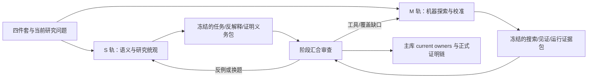

# 统观双轨协作与阶段汇合决策

> 当前身份：`HISTORICAL / SUPERSEDED_FOR_CURRENT_TOPOLOGY`。2026-09-14 用户确认只剩一个 active writer，并要求主项目治理承担跨 Session 连续性；current replacement 是 [统观单工作面与主库连续性决策](统观单工作面与主库连续性决策-20260914.md)。本文件保留双轨时期的理由、Gate 和多 writer 恢复条件，不再决定当前执行队列。

> 资产：`HUMAN_EDITED / HISTORICAL_PROJECT_DECISION / HANDOFF_INTERFACE`
> 日期：2026-09-13
> 决策：**保留两条彼此独立的统观工作线，以冻结输入和证据包阶段汇合；当前不做整体交接，也不合并机器统观分支。**
> 交付状态：`DOCUMENTED / COORDINATION_ACTIVE / MACHINE_INTEGRATION_NOT_ACCEPTED`
> 数学状态：`NO_NEW_MATHEMATICAL_CLAIM`

## 1. 本次要决定什么

当前有两项容易被误认为新旧版本的工作：

1. 主库中的第一次统观尝试：从 Astra 轨迹审计、C11 理论经济账本、P1/P2/P3 回溯、候选构造、消费者搜索和 T3 形式化逐步形成，之后经过两轮独立审计并完成 current truth 修复；
2. `/Volumes/D/HoTT-machine-overview` 中的第二次系统化机器统观：先形成 M0–M5 方案，再实现 M0/M1 的 L1 校准器，并对实现进行两轮独立审计和修复。

本次决定的不是哪个 AI 更可信，而是两种认知与验证能力应该如何组合：是否让机器统观线整体接管第一线，是否永久分离，或是否建立有边界的双轨协作。

## 2. 证据快照与时效边界

本决定以以下固定证据为准：

| 对象 | 固定身份 | 当前可支持的判断 |
|---|---|---|
| 主库第一次统观线 | main commit `22cb3636109b64371a7eb131eda33eec4a3d6984`；STATE revision 126 | C11、方向/全景、两轮审计整改和 proof/run/index 证据入口已经在主库 current owners 中收敛；研究问题仍开放 |
| 机器统观完整方案 | 导入索引 SHA-256 `02af1e417a8d95496a31b7f20052f73cd4373ff01b2332bab0bf4159f54dff19`，索引 + 9 分片 | 目标、六线、M0–M5、搜索与证据合同是完整设计；文档不等于全系统已实现 |
| M1 稳定实现身份 | worktree branch `feat/machine-overview-m1`；实现 commit `56c4306`；文档 HEAD `2705847db5893bbbdfae21abb58c5a01beff6e27` | L1 有限文法校准链真实存在；原七项触发已修；不能推出 M0/M1 完整验收或 M2–M5 已实现 |
| 最新独立复审 | 导入索引 SHA-256 `af8f721de5e5eb42354401ae8bfee865cc22b6f352d87f7dc5224a6d96b20666` | 判定 `REQUEST_CHANGES`：5 项 P1、3 项 P2 尚未闭合；正常 Agda ground instance 仍有效 |
| 活动现场 | 2026-09-13T16:34:11Z 只读观察 | worktree 在 `2705847` 上有 6 个 tracked 实现文件修改和未跟踪 v2 profile/task/grammar/legacy 资产；说明另一 AI 正在修复，未提交字节不作为已验收事实 |

全部外部文档已按字节导入 [`audit/imports/machine-overview-strategy-20260913/`](../../audit/imports/machine-overview-strategy-20260913/)，文件身份见同目录 `IMPORT.json`。外部 worktree 的后续提交、测试、审计或状态变化会使本表的活动现场失效；使用前必须重新核 HEAD、dirty 和最新审计。

## 3. 两条工作线实际解决不同问题

| 维度 | 第一次统观线（主库） | 机器统观线（独立 worktree） |
|---|---|---|
| 核心责任 | 理解用户问题意识，提出与反驳研究候选，保持同任务和现实对应，决定哪些命题值得形式化 | 固定 profile/TaskSpec/grammar，在声明范围内生成、求解、缩减、核验、保存和重放候选 |
| 当前最强能力 | C11 v2 可修订账本、候选失败史、方向/成果全景、两轮审计整改、正式数学证据门禁 | M0/M1 的 L1 有类型有限搜索与原生 Agda 校准；输入绑定、超时和恢复骨架 |
| 当前主要弱点 | 人工选题容易受既有候选和训练先验影响；不能系统枚举声明空间 | 只实际覆盖 L1 校准；TaskSpec 与现实对应仍依赖外部判断；validator 与证据闭包尚在修复 |
| 独有价值 | 能判断问题有没有被换掉、现实任务是否值得比较、失败是否仍有研究意义 | 能暴露人工未枚举的组合、保存完整搜索边界、用反例反馈约束后续候选 |
| 不能替代的部分 | 不能用人工报告冒充搜索空间覆盖 | 不能让机器的标签或当前 validator 自动决定哲学忠实性、现实对应或全局研究价值 |

两条线的共同目标相同，认识论角色不同。机器线的设计本身也明确承认：TaskSpec、同任务关系和现实对应需要可修订输入与独立审查。因此，即使 M0–M5 全部实现，它仍是研究仪器和候选生成系统，不能自动取代主库对原问题的理解与最终研究判断。

## 4. 选择：受控双轨、阶段汇合

本项目采用以下拓扑：

### 4.1 S 轨：语义与研究统观

S 轨留在 `/Volumes/D/HoTT_AI_HANDOFF_20260911`，由当前接管者维护。它负责：

- 按四件套保持用户问题意识与全部历史方向；
- 从 C11 v2 和其它来源主动提出新候选，但不把任何坐标当成准入或穷尽 Gate；
- 固定现实任务、理论化步骤、输入信息、完成标准、量词和最强反解释；
- 判断候选是否换题、是否退化为旧机制、是否需要新的 HoTT 规则或现实证据；
- 将真正需要交付为数学结论的命题送入主库 F-011 proof/source/run/index 门禁；
- 维护主库唯一 current truth，并独立审查机器线交付的候选。

S 轨的近期探索优先放在机器线尚未实际覆盖、且第一轮审计恢复研究资格的部分：时间与运动结构、B 方向的真实交付转换、以及与具体消费者绑定的自反问题。它不继续把同一 L1 delay 校准变体当作主要发现工作。

### 4.2 M 轨：机器探索与校准

M 轨留在 `/Volumes/D/HoTT-machine-overview`，由另一个对话窗口中的 AI 继续维护。它负责：

- 先关闭最新复审的 P1-1～P1-5，并对 P2-1～P2-3 给出实现或明确处置；
- 保留旧失败、旧 run 与审计反例，不通过删除证据使 validator 变绿；
- 以 clean commit 或完整 runner manifest 固定实际执行字节；
- 在独立复审接受 M0/M1 后，再扩大到 M2 和未覆盖研究线；
- 优先把有类型生成、反例反馈和范围耗尽报告用于 L2 局部到整体／量词完成，或 L6 补偿组合，形成与 S 轨当前 L3/B/消费者研究互补的结果；
- 把输出交成冻结证据包，不直接改主库 STATE、方向、全景或数学矩阵。

M 轨不负责宣布 HoTT 非现实性悖论已经成立，也不负责替用户或主库自动决定现实任务是否合理。其 `validate=VALID` 只能支持 validator 实际重算并核验的范围。

### 4.3 阶段汇合者

阶段汇合由主库当前维护者承担，并对两个输入都保持审计距离。汇合者负责：

1. 核固定提交、文档哈希、TaskSpec 与 run 身份；
2. 分别审查数学有效性、任务保持、现实对应、研究新颖性和证据恢复；
3. 接受、降级、驳回或发回修订；
4. 只有在证据达到主库相应状态时，才更新方向、全景、STATE 或正式数学索引。

同一个 AI 可以在不同时段承担某个角色，但同一结果不能用作者自己的自评代替汇合审查。用户若以后指定另一位汇合者，角色可以更换；真值 owner 与验收合同不随角色名称改变。

### 4.4 当前 worktree 与通信落实

当前 `非自动化统观` Codex 任务启动于 detached 审计 worktree `/Users/aurolafly/.codex/worktrees/eb7b/HoTT_AI_HANDOFF_20260911`（`fc79094a…`），但 S 轨的 current 项目写入和提交均通过显式 `workdir` 落在 `/Volumes/D/HoTT_AI_HANDOFF_20260911` 的 `main`；前者不是 current truth owner。M 轨只写 `/Volumes/D/HoTT-machine-overview` 的 `feat/machine-overview-m1`。三者共享 Git common-dir，但工作文件与 index 独立。

未来通信使用双通道：Codex 任务消息传递控制意图和 locator，exact Git commit 与不可变证据包传递可审计事实。当前已发现 M 轨任务 `机器统观`（task ID `01a09a72-aeb6-7a50-81d6-d24f43c5e912`），但尚未发送握手；完整消息字段、授权、状态机、并发和失败恢复见[统观双轨 AI 通信与证据交换合同](../design/detailed/统观双轨AI通信与证据交换合同-20260913.md)。

## 5. 为什么当前不做整体交接

整体交接会丢掉三项仍不可替代的责任：

1. **问题忠实性。** 第一线的严重错误 F1、F3、F4 都说明：即使形式代码能运行，命题对象、量词、穷尽含义和 current owner 仍可能漂移。机器线最新复审又在 correspondence 中复现了相同类型的风险。
2. **研究广度。** 当前机器实现只覆盖 L1 校准；M2–M5 和 L2–L6 的真实执行入口未完成。让它接管全部统观，会把设计中的未来覆盖误当成当前能力。
3. **独立证据。** 两条线若过早使用同一筛选规则、同一解释和同一 validator，会形成相关错误；保留不同生成方式能使一条线成为另一条的反例来源。

当前也存在直接工程阻塞：机器 worktree 正有活动 dirty 修改，最新稳定审计是 `REQUEST_CHANGES`。在新 clean commit 和独立复审以前，任何分支合并都会把未验收修复与主库 current truth 混在一起。

## 6. 为什么也不永久完全分离

永久分离会产生另一组损失：

- S 轨会继续依赖人工枚举，无法利用机器对候选空间、反例和范围的系统记录；
- M 轨会重复建设 C11、Theory Schema、proof capture 和 current truth，形成竞争 owner；
- 两边可能在不同名字下反复证明同一边界，无法用已知反例剪除真正重复；
- 机器发现的有价值关系无法进入正式证明链，S 轨的语义反例也无法改进搜索 grammar 和评价器。

所以共享的对象应当是**冻结输入、反例和证据**，而不是活动工作树或未经审查的当前状态。

## 7. 双轨交换包：最小必需内容

每次汇合只要求一份能够复核的交付，不新建第二套治理平台。可以使用现有 JSON/Markdown/run 结构；字段名称以后由机器线版本化，但语义上至少包含：

| 类别 | 必需内容 |
|---|---|
| 来源身份 | 产出 worktree、branch、exact commit、dirty/untracked 状态；若 dirty，提供参与执行的完整 source manifest 或 patch |
| 研究身份 | L1–L6 研究线；关联的 KC、C11 行或新轴；`calibration / known_mechanism / new_to_project / literature_pending` |
| 理论身份 | profile、工具链、库、规则、选项、完整相关源码与依赖哈希 |
| 任务身份 | TaskSpec revision/hash；现实侧输入、允许信息、环境、公平性、观察、完成标准、量词、资源、禁止额外信息 |
| 搜索身份 | grammar revision/hash、预算、是否完备枚举、剪枝、种子、unsupported 面、实际覆盖与停止原因 |
| 候选身份 | 原 AST、缩减轨迹、最终 AST/hash、关键差异、正控制、负控制、反解释和未解决义务 |
| 运行证据 | command、cwd、environment、stdout/stderr、exit/status、attempt/recovery、runner manifest、artifact roster 与哈希 |
| 分层结论 | 形式合法性、数学证据、任务保持、现实对应、研究关系、执行状态六轴分别给出，不合并成一个 PASS |

S 轨交给 M 轨的任务包也必须先冻结，不允许在看到搜索结果后静默更改成功标准。发现原 TaskSpec 不忠实，可以建立新 revision；旧输入与失败仍保留。

## 8. 三道汇合 Gate

### Gate A：机器工具可以被信任到 M0/M1 的声明范围

只有以下条件同时满足，才允许讨论把 machine-overview 代码并入主库：

- 最新复审 P1-1～P1-5 全部有直接回归与真实运行证据；
- P2-1～P2-3 已修复或被逐项限定为不影响拟合并范围；
- 原 29 项测试、最新邻近反例、三族保存证据校验和至少一个 fresh native run 均通过；
- validator 从原始输入重算关键语义和状态，不能信任可伪造标签或任意 legacy marker；
- 运行绑定 clean commit 或完整、可重建的 runner/config/registry manifest；
- 有新的独立复审给出 `ACCEPT_WITH_SCOPE` 或同等明确判定；
- worktree 无活动写者，目标 commit、源分支和主库目标 HEAD 已重新冻结。

在 Gate A 前，机器线是 `IMPLEMENTED_IN_ACTIVE_WORKTREE / AUDIT_REQUEST_CHANGES`，不进入主库，不作为 current verifier。

### Gate B：一个机器候选可以影响当前研究判断

候选进入主库方向/全景前必须：

- TaskSpec 与成功标准在结果前冻结；
- 候选确实来自声明 grammar，范围耗尽或预算停止表述准确；
- 数学命题由相称内核核验，且 proof 绑定的就是当前任务中的精确命题；
- 任务保持与现实对应由独立审查给出，`UNRESOLVED` 可以保留但不能升级；
- 与已知 proof package 和失败台账比较，区分校准、旧机制新参数、项目内新关系和原创性未知；
- 主库若把它交付成数学结论，另走 F-011，不以 machine-overview 探索收据替代正式 source/run/index。

Gate B 允许有价值的负结果进入全景，但每个负结论仍绑定 profile、grammar、预算和未支持面。

### Gate C：是否重新考虑单线接管或全面合并

只有机器线至少完成以下阶段，才重新讨论它是否能承担更多统观责任：

- M2：至少一个不能由纯有限枚举替代的任务真实通过，并有反控制；
- M3：L1–L6 每条都有实际运行入口和完整案例链，未支持面仍可见；
- M4：冻结搜索器后，在留出任务上完成同预算比较、消融与错误升级率评估，显示它增加的是有效研究认识，而不是候选数量；
- 至少一次机器候选经过 Gate B 被主库独立接受，且另一次被正确驳回或降级，证明反馈链能处理正反两类结果。

即使 Gate C 通过，机器线也只可能接管更多生成和验证工作；原始问题解释、现实对应和最终 current truth 的独立审查仍需保留。是否改变这一边界只能由用户以新裁定决定。

## 9. 给另一个 AI 的直接执行说明

另一个 AI 读取本文件后，应按以下顺序继续，不需要接管或修改主库：

1. 以 `/Volumes/D/HoTT-machine-overview` 当前活动 worktree 为唯一写入区，先重新记录 HEAD、dirty、全部未跟踪资产和参与运行的源码哈希；不要覆盖其他 AI 的在途修改。
2. 把导入的最新复审 `20260913-M1自动化统观修复复审` 作为当前验收基线。旧 `交接说明-机器统观M1-20260913.md` 中“可以可靠回答证据完整性”的句子已经被该复审否定，不能继续作为 current 状态。
3. 完成 P1-1～P1-5，再处理 P2-1～P2-3。每个缺陷保留最小复现、修复、负向回归和新运行证据；不要删除原失败。
4. 在实现稳定后形成一个 clean commit；重新运行完整验收；由独立审查者复核。没有新的 `ACCEPT_WITH_SCOPE` 前，不进入 M2/M3，不请求主线合并。
5. Gate A 通过后，优先选择 L2 或 L6 的一个新 TaskSpec，冻结任务以后再扩展 grammar/后端。不要继续以 L1 数字变体充当系统广度，也不要把 S 轨正在做的 L3/B 候选直接照抄成“独立发现”。
6. 交付时提供第 7 节的最小交换内容，并明确哪些是 `calibration`、哪些是新的项目关系、哪些仍需现实对应或文献审查。
7. 不直接写 `/Volumes/D/HoTT_AI_HANDOFF_20260911` 的 STATE、方向、全景、C11 或 claim matrix；由阶段汇合者在 Gate B 后决定是否导入。

如果另一 AI 已经在本文件形成前完成了一个新提交，先以新提交和新审计重建现场；本说明中的 `2705847 + dirty` 只是一条历史观察，不能覆盖更新证据。

## 10. S 轨接下来的工作边界

当前接管者继续主库第一统观线，但不与 M 轨抢同一个 M1 修复任务：

1. 保持 C11 v2 为启发和审查账本，不新增排他 Gate；
2. 从 L3 时间/运动结构与 B 方向选择一个同任务可反驳候选，或审查一个固定真实 consumer；
3. 候选必须明确理论版本、现实活动、输入信息、完成方式、量词和反解释；
4. 需要数学结论时完成主库机器证明门禁；没有相称证明就保持问题、候选或 paper-only；
5. 在 M 轨交付第一个 Gate B 包时暂停局部深化，优先做独立汇合审查。

这使两条线在当前阶段获得不同的探索压力：S 轨测试问题生成和语义忠实性，M 轨测试系统搜索、证据闭包和范围诚实性。

## 11. 重新审视条件与失败处置

以下事件触发重新评估本决定：

- M 轨通过 Gate C，并在多个研究线显示可复现的有效探索增益；
- S 轨连续产生只有机器系统才能处理的组合规模，且人工语义审查成为唯一瓶颈；
- 两轨反复生成同一机制而没有独立增益，需要调整任务分区；
- 新证据证明某条线的 current owner、证据链或现实对应系统性失真；
- 用户明确改变接管、合并或独立性要求。

发生冲突时保留两侧 exact input、commit、run 和解释；不在任一活动工作树用 `ours/theirs` 覆盖。无法裁定的结论保持并列与降级状态，等待新证据或用户决定。

## 12. 决策结论

本轮拒绝两个极端：不把第一次统观线整体交给尚未完成 M0/M1 验收的机器工具，也不让两项工作永久互不相干。当前执行结构是：

- **S 轨继续独立研究；**
- **M 轨继续独立修复和机器探索；**
- **两轨只通过冻结任务与证据包阶段汇合；**
- **主库保持唯一 current truth；**
- **达到 Gate A/B/C 后分层讨论代码集成、结果吸收和职责变化。**

这份文件就是给另一 AI 的完整协作交接入口。它交接的是工作边界、输入、输出和验收，不把主库第一线的所有权交给机器统观线。

## 13. 证据入口

- 第一次统观线当前技术报告：[`audit/统观工作技术报告-20260913.md`](../../audit/统观工作技术报告-20260913.md)
- 第二轮接管整改：[`audit/独立审计第二轮整改与接管-20260913.md`](../../audit/独立审计第二轮整改与接管-20260913.md)
- 机器统观方法说明：[`audit/imports/machine-overview-strategy-20260913/20260913-机器辅助统观与HoTT候选搜索方法.md`](../../audit/imports/machine-overview-strategy-20260913/20260913-机器辅助统观与HoTT候选搜索方法.md)
- M0–M5 完整方案：[`audit/imports/machine-overview-strategy-20260913/HoTT非现实性悖论机器统观完整方案.md`](../../audit/imports/machine-overview-strategy-20260913/HoTT非现实性悖论机器统观完整方案.md)
- M1 交接快照：[`audit/imports/machine-overview-strategy-20260913/交接说明-机器统观M1-20260913.md`](../../audit/imports/machine-overview-strategy-20260913/交接说明-机器统观M1-20260913.md)
- 最新 M1 修复复审：[`audit/imports/machine-overview-strategy-20260913/20260913-M1自动化统观修复复审.md`](../../audit/imports/machine-overview-strategy-20260913/20260913-M1自动化统观修复复审.md)
- 导入身份：[`audit/imports/machine-overview-strategy-20260913/IMPORT.json`](../../audit/imports/machine-overview-strategy-20260913/IMPORT.json)
