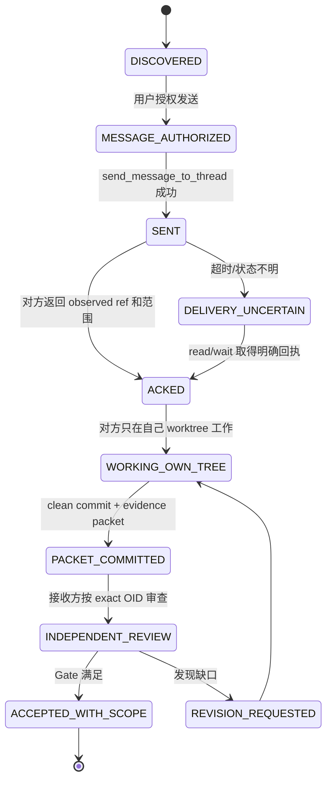

# 统观双轨 AI 通信与证据交换合同

> 合同版本：`overview-dual-track-communication/v1`
> 资产：`HUMAN_EDITED / CURRENT_DETAILED_DESIGN`
> 设计状态：`DESIGN_COMPLETE_WITH_DISCOVERED_CONTROL_CHANNEL`
> 运行状态：`LIVE_HANDSHAKE_NOT_STARTED`
> 数学状态：`NO_MATHEMATICAL_CLAIM`

## 1. 目的

本合同把“两个 AI 以后如何通信”分成两个不能互相替代的通道：

1. **控制通道**传递任务、状态、commit、证据包位置、请求和回执；
2. **证据通道**保存能够独立复核的源码、TaskSpec、run、报告、失败和 Git 历史。

一条 Codex 消息可以通知对方有新结果，但不能证明结果正确或已经被接收。一份文件或 commit 可以保存证据，但若接收者没有得到通知、没有核对身份，也不能冒充双方已经完成通信。

## 2. 当前任务与 worktree 身份

截至 2026-09-13 本轮只读核对，三个 worktree 共享同一个 Git common-dir：

`/Volumes/D/HoTT_AI_HANDOFF_20260911/.git`

| 角色/用途 | Codex 任务 | 启动 cwd / Git 身份 | 写入所有权 |
|---|---|---|---|
| S 轨当前任务 | 标题 `非自动化统观`；task ID `01a09b1e-c809-7453-89fa-7b5f01115d35` | `/Users/aurolafly/.codex/worktrees/eb7b/HoTT_AI_HANDOFF_20260911`；detached `fc79094a…`；该目录保存前期独立审计在途资产 | **不作为 current 项目写入根**；只作本任务的启动/审计 worktree 和历史证据来源 |
| S 轨项目维护根 / 集成目标 | 同一当前任务通过显式 `workdir` 操作 | `/Volumes/D/HoTT_AI_HANDOFF_20260911`；branch `main`；本合同建立前 HEAD `510466c…` | 当前 S 轨与主库 current truth 的唯一写入根 |
| M 轨任务 | 标题 `机器统观`；task ID `01a09a72-aeb6-7a50-81d6-d24f43c5e912` | Codex task cwd 为 `/Volumes/D/HoTT_AI_HANDOFF_20260911`；实际机器实现 worktree 为 `/Volumes/D/HoTT-machine-overview`，branch `feat/machine-overview-m1`，稳定 HEAD `2705847…` | M 轨只写 `/Volumes/D/HoTT-machine-overview`；不得直接写主库 current owners |

Codex 任务的 `cwd` 只表示任务启动目录，不能单独证明它实际修改了哪个 worktree。每次跨任务消息和交付都必须显式写 `write_root`、branch、exact commit 与 dirty 状态。

所有 worktree 共享 refs/objects 和默认 repo config，但各自有独立工作文件和 index。共享 common-dir 不等于文件自动同步，也不等于任一 AI 可以修改另一工作树。

## 3. 项目内治理接受状态

S 轨的 current 项目操作以 `/Volumes/D/HoTT_AI_HANDOFF_20260911` 为根，并实际执行该根的项目治理：

- 读取并遵循根 `AGENTS.md`；
- 完整加载项目本地 `hott-local-session-governance`、`LOAD_SET.json`、`PROTOCOL.md` 和 `STATE.json`；
- 按固定顺序全文加载四件套；
- 使用 governance profile、stable record query/hydration、36-KC 回评和 canonical checkpoint；
- 数学交付继续受 F-011 proof/source/run/index 门禁约束。

这说明当前操作流程接受并执行了项目内治理。工具只能证明文件、checkpoint、validator 和公开回评存在，不能认证模型的永久理解，也不能保证未来 turn 不重新发生漂移；新 Session、压缩或工作根变化后仍须重新加载。

## 4. 控制通道：Codex 任务消息

Codex App 已能同时发现两个任务，并提供只读状态与跨任务消息能力：

- 发现/重定位：`list_threads`；
- 只读检查：`read_thread`；
- 等待状态变化：`wait_threads`；
- 发送任务消息：`send_message_to_thread`。

当前 M 轨任务 locator 为：

```text
title: 机器统观
thread_id: 01a09a72-aeb6-7a50-81d6-d24f43c5e912
host_id: local
status_at_discovery: active
```

标题是给人阅读的定位信息；实际发送和等待使用 thread ID。若任务被 fork、handoff、归档后恢复或重新创建，必须先用 `list_threads` 重定位，不能仅凭标题猜 ID。

### 4.1 最小控制消息

每条跨任务消息使用简短、完整的人类可读文本，并至少包含：

| 字段 | 含义 |
|---|---|
| `protocol` | 固定为 `overview-dual-track-communication/v1` |
| `from` / `to` | 发送、接收的轨道和 task ID |
| `purpose` | 本消息要触发的一个有界动作，或只读状态请求 |
| `write_root` | 接收者获准写入的唯一 worktree；不得省略 |
| `source_ref` | 发送方 exact commit OID；branch 名只作导航 |
| `packet` | repo 相对路径或绝对只读路径，以及 SHA-256；没有证据包时写 `NONE` |
| `requested_action` | `READ_ONLY_REVIEW`、`IMPLEMENT_IN_OWN_WORKTREE`、`REPLY_STATUS` 或其它精确动作 |
| `prohibited_actions` | 至少写清不得修改的另一 worktree、不得 merge/push/tag 等边界 |
| `reply_contract` | 要求返回 observed ref、结果状态、产物路径/hash、验证与未决；若无需回复则明确写 `NO_REPLY_REQUIRED` |

消息不携带隐藏推理、凭据或大段证据正文。完整材料留在 Git/文件证据通道，消息只传 locator 和动作。

### 4.2 授权

跨任务发送会在另一个用户可见任务中新增一条消息并可能改变其当前工作，因此属于外部通信动作。当前只完成了任务发现，**尚未发送握手消息**。第一次发送需要用户明确授权；授权一旦给出，在同一已定义范围内可以持续用于状态请求、交付和回执，不重复索取。扩大任务、权限、目标 worktree、merge/push/tag 或其它副作用时另行判断。

只读 `list_threads`、`read_thread` 和 `wait_threads` 不等于发送，也不改变对方任务目标；它们的状态摘要只是导航，不替代 Git 和运行证据。

## 5. 证据通道：exact commit 与不可变证据包

双轨的 durable communication 以 Git 和项目文件为准：

- S 轨在 `main` 形成自己的 commit；M 轨可以用 `git show <exact-main-oid>:<path>` 读取，无需切换或修改其工作树；
- M 轨在 `feat/machine-overview-m1` 形成 clean commit；S 轨可以用 `git show <exact-machine-oid>:<path>` 独立审读；
- 活动 dirty 文件可以用于进度说明，但不能成为 Gate A/B 的接受证据；需要交付时必须形成 clean commit，或按合同给出参与执行的完整 source manifest/patch；
- 外部文档或非 Git 原件按字节导入 `audit/imports/`，以 manifest 固定源路径、字节数、SHA-256 和适用状态；
- 数学结论仍进入主库唯一的 `HoTT/formal/`、`HoTT/verification/runs/` 和 `HoTT/CLAIM_EVIDENCE_MATRIX.md`，机器探索器不建立竞争矩阵。

证据包的研究/理论/任务/搜索/候选/运行/六轴状态内容由[统观双轨协作与阶段汇合决策](../../decisions/统观双轨协作与阶段汇合决策-20260913.md)第 7 节规定。本合同只拥有传输、身份、回执和失败恢复语义。

## 6. 通信握手与交付状态机



状态含义：

- `SENT` 只证明消息工具报告已发送，不证明对方阅读、同意或完成；
- `ACKED` 必须包含接收者实际观察到的 source OID、packet hash、写入根和任务范围；
- `WORKING_OWN_TREE` 不允许发送方同时写同一路径；
- `PACKET_COMMITTED` 不等于通过独立审查；
- `ACCEPTED_WITH_SCOPE` 必须引用审查证据和适用 Gate。

## 7. 标准握手文本

首次获准发送时，S 轨向 M 轨使用以下内容，并用当时真实 OID/hash 替换尖括号：

```text
protocol: overview-dual-track-communication/v1
from: S-track / 01a09b1e-c809-7453-89fa-7b5f01115d35
to: M-track / 01a09a72-aeb6-7a50-81d6-d24f43c5e912
purpose: Establish the dual-track boundary and ask you to continue the current M1 audit repair in your own worktree.
write_root: /Volumes/D/HoTT-machine-overview
source_ref: <exact main commit>
packet: docs/decisions/统观双轨协作与阶段汇合决策-20260913.md / sha256 <hash>
requested_action: READ_ONLY_REVIEW, then IMPLEMENT_IN_OWN_WORKTREE within the existing P1/P2 repair scope.
prohibited_actions: Do not modify /Volumes/D/HoTT_AI_HANDOFF_20260911 current owners; do not merge, push or tag; preserve failures and active dirty work.
reply_contract: Return ACK with observed source_ref, your HEAD/dirty status, accepted scope, conflicts, and the next evidence-producing action. Later return a clean commit, evidence paths/hashes, tests, audit status and unresolved items.
```

M 轨回复至少包含：

```text
protocol / in_reply_to
observed_source_ref / observed_packet_sha256
own_write_root / own_head / dirty_summary
scope: ACCEPTED | ACCEPTED_WITH_CONFLICTS | REJECTED
conflicts / unknowns
next_action / expected_evidence
```

回复中的时间估计、完成自述或测试计数不自动提高证据等级。

## 8. 轮询、背压与并发

- 不持续高频轮询活动任务；单任务用 `wait_threads` 的 cursor 等待状态变化，超时后退避；
- 对方正在采样或执行长工具调用时，非紧急补充消息等待消息边界，不重复发送同一请求；
- 新用户输入优先于跨任务等待；用户改变范围后，旧消息未完成部分需重新判断；
- 同一工作树同一时间只有一个确定写者；接收者发现 write root 与现场所有权冲突时回复 `ACCEPTED_WITH_CONFLICTS` 或 `REJECTED`，不自动 stash/reset/clean；
- Git branch 名可能移动，消费证据始终绑定 exact OID；读取共享 ref 前后若 OID 变化，旧审查失效。

## 9. 失败与恢复

| 失败 | 处置 |
|---|---|
| 找不到目标 task ID | 重新 `list_threads`；按标题、project、host、cwd 和近期状态共同定位；不能向猜测 ID 发送 |
| 发送工具报错 | 保存本地待发文本，不声称已通知；修复工具或由用户手工转发 |
| 发送后超时 | 标 `DELIVERY_UNCERTAIN`；用 `read_thread`/`wait_threads` 核明确状态，不重复触发相同工作 |
| 对方正在执行不兼容目标 | 不打断或覆写；向用户报告冲突，保留双方现场 |
| packet hash/OID 不符 | 拒绝 ACK 或结果吸收；重新发送/读取正确身份 |
| 对方只有 dirty 结果 | 保留为进度；等待 clean commit 或完整 dirty manifest，不能合并 |
| 任务被 fork/handoff | 旧 ID 保留历史；重新发现新 task，发送包含 lineage 的新握手 |
| 控制消息与证据冲突 | 以 exact code/run/Git 对实际状态作判断；消息自述降级并发回修订 |

## 10. 验收与当前边界

本合同的设计完成判据是：任务和 worktree 身份明确；控制/证据通道分离；消息字段、授权、握手、状态、并发与失败恢复可执行；双方不需要猜写入根或证据位置。

当前只支持：

- 三 worktree 与 shared common-dir 已机械核对；
- `非自动化统观` 与 `机器统观` 两个 task ID 已由 Codex App 发现；
- S 轨项目治理执行证据、main commit 和 M 轨 active dirty 状态可回查；
- 设计与标准握手文本已落盘。

当前尚不支持：

- 未获用户发送授权，故没有 `SENT` 或 `ACKED` 收据；
- 未验证另一个 AI 是否接受本合同；
- 未取得 M 轨当前修复的 clean commit 或新独立审计；
- 没有建立常驻 daemon、共享消息数据库或自动 merge；这些不是当前通信所需。
