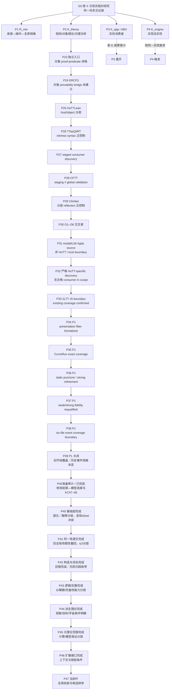

<!-- governance-shard:v2
logical_id: GOAL3-WORK-PATH-TREE
shard_id: 001
index: ../goal-3-工作路径树.md
-->

# 原初目标与当前工作树

## 1. 根节点：研究想寻找什么

```text
G0  现实相对 HoTT 研究的原初目标
│
├─ 不预设 HoTT 有内部矛盾、实现错误或现实失配；这些是待检验的不同结果类别。
├─ 用户的原圆环 X₀ 是校准与回接基准；一般机制可先用另一个固定任务 X_T 发现。
├─ 首先充分检视HoTT的规则、构造、假设和关键交互；由此选择靶前提T及其经济收益。
├─ 设计专门使 T 起作用的过程 X_T，再固定 Input、Operation、Observation、Done_w、Done_s。
└─ 寻找或排除一条完整见证链：
   R_min / K_theory / K_app / K_engine
   → 理论或实现的具体承诺
   → 在同一任务中可检验的失配、边界、反模型或错误
   → 相称的机器证明与现实解释。
```

根节点不等于“尽可能找有趣的 HoTT 反射话题”。一个子任务只有在减少上述链中的明确未知时才有资格继续。`RealitySame` 是判词层锚，不能跳过具体任务合同或理论承诺；`√2`、一般 Gödel/Löb、host reflection、staging 和工具拒绝只能是校准、对照或候选来源，不能冒充原 `X₀`。靶前提是可撤回的发现假说，最终病因仍由构造、反解释与同任务证明决定。

## 2. 四根分支及当前资格

| 节点 | 目标链边 | 已获事实 | 未闭合义务 / 重开条件 | 当前状态 |
|---|---|---|---|---|
| `P1 / R_min` | 来源—操作—复原敏感的共同强任务 | `RichCurve`、Denotes/Satisfies、操作与双 Done 已在有限范围固定；P34–P38 分别核对 fiber、过程、弱强去点和静态来源；P39 确认用户可检查的端部／过程要求已由 P7/ABX 字段覆盖，额外历史事件 Done 尚未独立规定。 | 只有独立的新 Operation/Observation/Done、同任务反例或真实 K 才重开这条来源事件延伸。 | `P39_CLOSED_WITH_SCOPE / HISTORICAL_EVENT_SPEC_UNDERDETERMINED` |
| `P2 / K_theory` | HoTT 规则、定理或模型是否实际作强桥 | SIP、定向层、CFTT、HoTTLean、QIIRT、反射来源等已给出多个有界防线/层级区分；P33 已由既有 2LTT 资产覆盖。 | 一个具体 calculus/定理/模型真正把弱结果提升为原强 Done；新的 P2 ingress 必须不同于已闭合反射/2LTT 分母。 | `P2_REFLECTION_SUBLINE_CLOSED_BY_COVERAGE` |
| `P3 / K_app / ABX` | 实际库/论文/应用是否把弱结果当作强任务完成 | 多个版本冻结消费者分母未发现 K；ABX 合同、H/R/U/K 区分已建立。 | 先有靶前提与针对性过程，才据此寻找实际消费者；队列论文保留为已发现的来源候选／防线对照，不单凭新来源立题。 | `PAUSED_PENDING_TARGETED_TASK` |
| `P4 / K_engine` | proof assistant 是否偏离其声明的规则 | 历史“拒签”未形成规则语义—实现差异。 | 可重放的错误接受、错误拒绝或实现—规则差异。 | `NOT_TRIGGERED` |

## 3. 从根到当前叶的路径



这条路径并不说明 P2 已经最有希望得到“击落”结论。它只记录为什么当前连续的 P23–P32 仍在检验 `K_theory` 的一个明确缺口：对象 syntax、可证明性、反射、soundness、层级和实际任务之间能否形成完整链。P30 已证明这种链不能由单一词汇或单个工具现象推定；P33 的目的正是检验一个社区承认的 outer-layer 边界，而不是把它预设成缺陷。

## 3A. 当前航向审计：P2 已有局部偏航，P33 必须过门

2026-09-21 的根—叶复核给出以下裁决：**整个项目没有失去根目标，但 P2 的连续反射来源审计已出现局部路径依赖。** 这不是否定 P23–P32 全部价值，而是区分哪些单元减少了真实未知，哪些只能作为一次性校准。

| 路段 | 对 G0 的关系 | 审计裁决 |
|---|---|---|
| P23–P26 | 将“自元理论”从模糊叙述分解为对象 syntax、可证明性、reflection 与 host/object 的可检验义务。 | `ALIGNED / NECESSARY_QUALIFICATION` |
| P27–P30 | 以实际 staging、object `prov` 正控制和 O1–O6 交叉表排除假阳性。 | `ALIGNED / BOUNDED_CONTROL_COMPLETE` |
| P31 | 非 HoTT modal/Löb Agda source 证明“这种 syntax 可以出现”，但没有原 X、HoTT 或 O6 连接。 | `LIMITED_TANGENT / NO_FURTHER_GENERIC_MODAL_DESCENT` |
| P32 | 用严格 HoTT-specific 双条件检索纠正了 P31 的泛化风险，但未发现合格 consumer。 | `CORRECTIVE_DISCOVERY / CLOSE_WITH_SCOPE` |
| P33 | v5 当前 primary sections 确认既有 2LTT boundary；本地已有 theorem control、crisp/base-change 防线与 natural-consumer 缺口。 | `CLOSED_BY_EXACT_COVERAGE / P2_GATE_NOT_PASSED` |
| P34 | 从 P33 覆盖裁决回到 P1；在相同 agda-unimath 后端定义 `PresentationFiber A = Σ RichCurve (Bare r ＝ A)`，并以端点闭合证明同一裸 carrier fiber 中的两个 presentation 相异。 | `CLOSE_WITH_SCOPE / C-326 / P35_SELECTED` |
| P35 | 将 P34 fiber成员与 C-320 `CurveRun`、`fullTransportPath` 逐项对照；现有资产已覆盖所声明的 process/endpoint `Done_P35`，所以未新增 wrapper。 | `CLOSE_WITH_SCOPE / EXACT_COVERAGE_WITH_SCOPE / P36_SELECTED` |
| P36 | 审计实际圆与 east 的静态去点、`StrongPuncture` 细化与 supplied-source contract；普通弱去点已定义，但 `mRich` 是强域，且无 provenance event。 | `CLOSE_WITH_SCOPE / PARTIAL_REUSE / P37_SELECTED` |
| P37 | 用 C-283–C-290/C-307–C-308 和 weak final coverage 复资格化原普通 M；强域结果不能无条件代替弱域，现有条件性结论已完整覆盖。 | `CLOSE_WITH_SCOPE / EXACT_COVERAGE_BY_EXISTING_ASSETS / P38_SELECTED` |
| P38 | 在六个固定模块中逐项比较实际静态去点、强细化、过程和标签：静态去点已有定义，历史事件桥无显式接口。不能外推全库不存在或不可表达。 | `CLOSE_WITH_SCOPE / PARTIAL_REUSE_WITHIN_SIX_MODULES / P39_GATE_SELECTED` |
| P39 | 原文“固定两端、其余变形”的可检查部分已由 P7/ABX 与实际代码覆盖；额外历史事件 Done 未独立规定。继续添加 record 只会重复。 | `CLOSE_WITH_SCOPE / SWITCH_BRANCH / NO_NEW_MATH_CLAIM` |
| P40 | 来源身份及C01–C04源文检视完成；F1解释加强被收窄，Id/set来源冲突触发P41。 | `SOURCE_REVIEW_COMPLETE_WITH_SCOPE / P41_NEXT`，证据：HoTT理论充分检视001/002 |
| P41 | 完成Id/set、isEquiv/ua、η/J与结构观察源文核对，撤回旧C-01全局资格并定位依赖。 | `CLOSED_WITH_SCOPE / P42_NEXT`；HoTT理论充分检视003 |
| P42 | 核归纳、HIT、截断／商的形成、消去与存在，旧A03/A11/E02/E04归因无来源支持，E03补条件。 | `CLOSED_WITH_SCOPE / P43_NEXT`；HoTT理论充分检视004；revisit_if=真实过程桥或新规则 |
| P43 | 核可选逻辑、Ω四路线、两种实数/模数/紧致性，复用第四弹与P17，纠正Schema HIIT术语。 | `CLOSED_WITH_SCOPE / P44_NEXT`；HoTT理论充分检视005；revisit_if=真实能力桥或不同宇宙/公理合同 |
| P44 | 核合成同伦、模态/Whitehead、Rezk及基数/序数/V，明确普适性的目标与层级条件。 | `CLOSED_WITH_SCOPE / P45_NEXT`；HoTT理论充分检视006；revisit_if=新任务桥或侧条件反例 |
| P45 | 核计算、元理论、模型/initiality的精确系统与范围，旧B01/B02归因收窄。 | `CLOSED_WITH_SCOPE / P46_NEXT`；HoTT理论充分检视007；revisit_if=新演算差异或实际保证冲突 |
| P46 | 核Cubical具体规则与相关扩展实际条件，复用既有2LTT/guard/cost控制。 | `CLOSED_WITH_SCOPE / P47_NEXT`；HoTT理论充分检视008；revisit_if=候选实际调用未核扩展或兼容桥 |
| P47 | 按006逐域整合语义审查、旧资格、遗漏与排序。 | `NEXT_SYNTHESIS`；新证据是跨波次比较，不再新增同型来源扫描 |
| P40准备审计 | 用户要求回顾机器统观并将两段原文纳入core；确认代理模型连接缺口、前提解释加强和I探针叙述越级，保存KC47–48并改SOP；不增加新数学结果。 | `CLOSE_WITH_SCOPE / P40_SELECTION_NOT_RUN`，证据：`audit/机器统观目标与针对性策略审计-20260922.md`；revisit_if=取得旧缺失保真桥或新原生反例 |

P33 已通过一次有界当前 v5 核对：相关 primary sections 与本地 2LTT boundary、C-227–C-232 kernel control、crisp/base-change 防线及 natural-consumer 缺口一致。因此它按 `EXACT_COVERAGE` 关闭；不得继续扩展 P2 反射文献链。P34 随后以 C-326 建立了最小 same-backend presentation fiber，但它本身只闭合静态 P1 数据的一个边。P35 再确认既有 `CurveRun` 已含 fiberwise operation/endpoint `Done_P35` 合同，因此按 `EXACT_COVERAGE_WITH_SCOPE` 停止，没有重包装为新 record。P36 发现 `RealCircle` 上固定点的静态排除已定义，但实际 `mRich` 使用 `StrongPuncture`，弱→强需要 `Lift`，而 `Input.source` 没有历史 provenance event。P37 用已有资产确认普通弱 M 的条件性边界已经完整覆盖。P38 在六模块范围确认静态去点操作已有定义，历史事件桥没有显式接口；它不能推出全库无桥或 HoTT 不可表达。P39 一次核对后关闭同义字段延伸：可检查的端部／过程合同已覆盖，独立历史事件 Done 未定。用户随后指出 P40 的来源先行顺序忽略了悖论构造的靶点；P40先经靶点纠正与统观回顾，随后按用户最新裁定改为理论充分检视；候选排序后置，尚未找到K。不得把 2LTT 的分层设计、C-326、P35–P39 的范围判词称为 HoTT 缺陷、现实失配或圆环命中。

## 4. 当前叶与替代叶比较

| Leaf | 为什么现在有资格 | 为什么不是结论 | 下一次反思必须比较什么 |
|---|---|---|---|
| `P40 / 理论充分检视` | Schema与PREMISE已有地图，源文语义与交互仍有缺口；用户明确要求优先。 | 只读目录／任意选三条不足以构成充分检视；也不能无限编百科。 | 按总体方案006广度复核与关键交互审查，明确排除与未知，再排序靶前提。 |
| `P1 object-theory continuation` | 原 X 与 `R_min` 已可表达；新来源／事件规格仍可能出现。 | 当前可检查字段已覆盖，历史事件没有独立 Done。 | 仅有新 Operation/Observation/Done 或反例才重开；不重写 RichCurve。 |
| `P3 ABX reopen` | 最接近原圆环的实际使用问题。 | 当前没有圆环 K，不能靠重复 scan 重开。 | 是否出现具体版本、调用点、强 Done 语句或更强 R。 |
| `P4 engine audit` | 能直接检验实现忠实性。 | 当前没有 semantic trigger。 | 是否出现可重放的规则—实现差异，而非一次拒签/超时。 |

## 5. 节点与边的维护协议

每次 wave 在开始与结束时，维护者必须：

1. 从 `G0` 复述本 wave 欲减少的**唯一未闭合义务**；
2. 在本树中定位当前 leaf 与至少两个替代 leaf；
3. 为每条新边写明 `from → to`、触发证据、被排除的替代、`revisit_if` 和对应报告 locator；
4. 只在证据改变资格、分支顺序或当前 leaf 时改树；纯重跑、文案调整和无新增事实不新增节点；
5. 若当前 `STATE` 的 next action 改变，树不是替代收据：必须先走 canonical checkpoint；
6. 若树显示当前工作已脱离 `G0`、替换了原 `X`、或连续两个 wave 只沿同一关键词加深，则将当前 leaf 标为 `DRIFT_REVIEW_REQUIRED` 并比较四根分支后重选。

树记录的是研究路径的理由，不记录隐藏推理，也不把“路径上有很多节点”当作研究成果。
