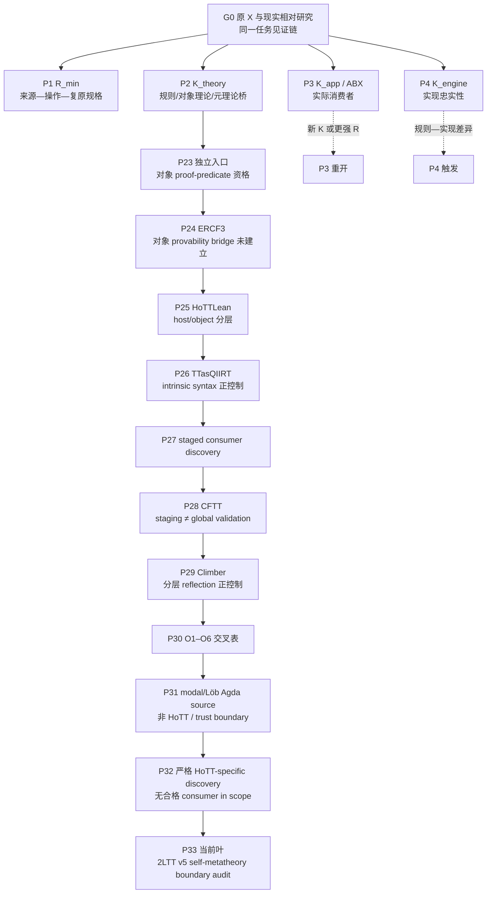

<!-- governance-shard:v2
logical_id: GOAL3-WORK-PATH-TREE
shard_id: 001
index: ../goal-3-工作路径树.md
-->

# 原初目标与当前工作树

## 1. 根节点：研究想寻找什么

```text
G0  现实相对 HoTT 研究的原初目标
│
├─ 不预设 HoTT 有内部矛盾、实现错误或现实失配；这些是待检验的不同结果类别。
├─ 固定用户的原圆环 X：圆去点、开区间呈现、两端闭合/复原过程。
├─ 固定同一任务合同：Input、Operation、Observation、Done_w、Done_s。
└─ 寻找或排除一条完整见证链：
   R_min / K_theory / K_app / K_engine
   → 理论或实现的具体承诺
   → 在同一任务中可检验的失配、边界、反模型或错误
   → 相称的机器证明与现实解释。
```

根节点不等于“尽可能找有趣的 HoTT 反射话题”。一个子任务只有在减少上述链中的明确未知时才有资格继续。`RealitySame` 是判词层锚，不能跳过具体任务合同或理论承诺；`√2`、一般 Gödel/Löb、host reflection、staging 和工具拒绝只能是校准、对照或候选来源，除非被证明接入原 `X`。

## 2. 四根分支及当前资格

| 节点 | 目标链边 | 已获事实 | 未闭合义务 / 重开条件 | 当前状态 |
|---|---|---|---|---|
| `P1 / R_min` | 来源—操作—复原敏感的共同强任务 | `RichCurve`、Denotes/Satisfies、操作与双 Done 已在有限范围固定；裸 H/U 不自动恢复强字段。 | 完整对象理论、与既有数学结构的关系，或用户认可的更强 `R_origin`。 | `AVAILABLE_AS_OBJECT_THEORY_BRANCH` |
| `P2 / K_theory` | HoTT 规则、定理或模型是否实际作强桥 | SIP、定向层、CFTT、HoTTLean、QIIRT、反射来源等已给出多个有界防线/层级区分。 | 一个具体 calculus/定理/模型真正把弱结果提升为原强 Done，或 2LTT 等明确边界的精确范围。 | `ACTIVE_CURRENT_LEAF_LINE` |
| `P3 / K_app / ABX` | 实际库/论文/应用是否把 H/U 当作原任务完成 | 多个版本冻结消费者分母未发现 K；ABX 合同、H/R/U/K 区分已建立。 | 新版本冻结的实际 K，或被用户接受的更强 `R_origin`；命中后才做失配形式化。 | `PAUSED_WITH_REOPEN_CONDITIONS` |
| `P4 / K_engine` | proof assistant 是否偏离其声明的规则 | 历史“拒签”未形成规则语义—实现差异。 | 可重放的错误接受、错误拒绝或实现—规则差异。 | `NOT_TRIGGERED` |

## 3. 从根到当前叶的路径



这条路径并不说明 P2 已经最有希望得到“击落”结论。它只记录为什么当前连续的 P23–P32 仍在检验 `K_theory` 的一个明确缺口：对象 syntax、可证明性、反射、soundness、层级和实际任务之间能否形成完整链。P30 已证明这种链不能由单一词汇或单个工具现象推定；P33 的目的正是检验一个社区承认的 outer-layer 边界，而不是把它预设成缺陷。

## 4. 当前叶与替代叶比较

| Leaf | 为什么现在有资格 | 为什么不是结论 | 下一次反思必须比较什么 |
|---|---|---|---|
| `P33 / 2LTT v5 boundary audit` | P32 发现 2LTT v5 是当前一手、明确讨论 inner HoTT 与 outer strict metatheory 的边界来源。 | outer layer 的使用不自动表示 HoTT 矛盾、实际 K 或现实失配。 | P33 是否减少 O1–O6/P2 义务；若只复述已知分层，回到 P1/P3 或新 source ingress。 |
| `P1 object-theory continuation` | 原 X 与 `R_min` 已可表达，仍可发展为独立数学对象。 | 富化结构本身不指控 HoTT。 | 是否有独立数学不变量或保真 bridge，而不是重写已有 RichCurve 控制。 |
| `P3 ABX reopen` | 最接近原圆环的实际使用问题。 | 当前没有新 K，不能靠重复 scan 重开。 | 是否出现具体版本、调用点、强 Done 语句或更强 R。 |
| `P4 engine audit` | 能直接检验实现忠实性。 | 当前没有 semantic trigger。 | 是否出现可重放的规则—实现差异，而非一次拒签/超时。 |

## 5. 节点与边的维护协议

每次 wave 在开始与结束时，维护者必须：

1. 从 `G0` 复述本 wave 欲减少的**唯一未闭合义务**；
2. 在本树中定位当前 leaf 与至少两个替代 leaf；
3. 为每条新边写明 `from → to`、触发证据、被排除的替代、`revisit_if` 和对应报告 locator；
4. 只在证据改变资格、分支顺序或当前 leaf 时改树；纯重跑、文案调整和无新增事实不新增节点；
5. 若当前 `STATE` 的 next action 改变，树不是替代收据：必须先走 canonical checkpoint；
6. 若树显示当前工作已脱离 `G0`、替换了原 `X`、或连续两个 wave 只沿同一关键词加深，则将当前 leaf 标为 `DRIFT_REVIEW_REQUIRED` 并比较四根分支后重选。

树记录的是研究路径的理由，不记录隐藏推理，也不把“路径上有很多节点”当作研究成果。
