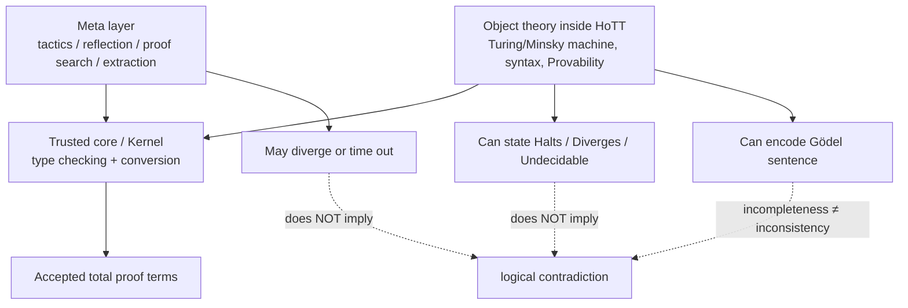
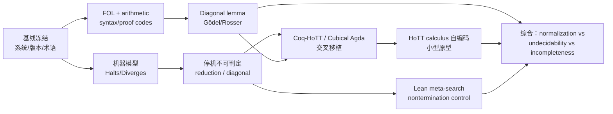

# 在 HoTT 中寻找“不可停机—不完备性边界”的研究方案：从计算性限制到 Gödel 型自指的可执行路线

## Executive Summary

本研究建议首先对目标做一个关键的概念校正：**“HoTT 非现实性悖论”以及“完成机器统观”并不是目前 HoTT、证明论或可计算性理论中的标准术语**。因此，最稳妥的做法不是预设 HoTT 中存在一种尚未发现的“矛盾”，而是把它操作化为一个可检验的研究纲领：

> **HoTT 非现实性边界问题**：在一个具有明确代码、内核、归约规则与有效语法的 HoTT/Univalent Type Theory 实现中，寻找那些能够形式化表达、但不存在统一总算法加以判定、证明搜索或计算的命题族；进一步研究这种不可计算性是否能够通过对形式系统自身语法与可证明性的编码，上升为 Gödel/Rosser 型不完备性定理。

这一重述很重要，因为 **non-termination、undecidability、incompleteness 与 paradox 是四种不同现象**。Turing 的经典工作给出算法可判定性的边界，而 Gödel 的工作给出足够强、有效公理化形式系统的可证明性边界；后来的机械化工作已经在 Coq 中完整验证过 Gödel–Rosser 不完备性，并把公式、证明和原始递归代码都编码为自然数。citeturn12search5turn18search3turn21search0

最核心的预期结论是：

**第一，不能把“一个被内核接受的 HoTT 证明项自己永远归约不停”作为首选目标。** 对具有正常化/终止纪律的构造型依赖类型论而言，这恰好通常是内核设计试图排除的行为。Cubical Type Theory 不仅为 univalence 给出了计算解释，而且已有 normalization 结果；Cubical Agda 则把 computational univalence 和 higher inductive types 直接纳入语言的 cubical mode。citeturn20search1turn20academia32turn2search0 Agda 的内部语言在进入后端前执行 termination、coverage 和 positivity 等安全检查。citeturn18search25turn18search1 因而，**真正的不可停机应主要表示为对象语言中的“某台抽象机器没有有限停机证据”、或元层证明搜索/解释器的发散，而不是期待一个合法核心 proof term 无限 β/ι/δ 归约。**

**第二，“机器证明不能停机”不是逻辑悖论。** 一个 proof-search 程序可以在不存在证明时永久枚举，而只要它找到候选 proof term 后仍交给 kernel 检验，搜索器不终止并不会推出 `False`。Lean 官方甚至明确允许 `partial` 定义作为对内核不透明的常量，同时保留可执行代码；这恰好说明“外层程序可能不终止”与“逻辑内核必须保持可靠”可以严格分层。citeturn26search0turn26search2

**第三，最有学术价值的“HoTT 中的 Gödel 不完备性”应当分成两个层次。**

一条是**内部化路线**：在 Cubical Agda 或 Coq-HoTT 中编码一个足够强的有效形式理论 \(T\)，形式化其语法、证明检查器、Gödel 编码、替换和 provability predicate，再构造

\[
G_T \;\simeq\; \neg \mathrm{Prov}_T(\ulcorner G_T\urcorner).
\]

O'Connor 已在普通 Coq 中机械验证 Gödel–Rosser 不完备性；Kirst、Hermes 等随后形成了更系统的 synthetic computability / mechanised metamathematics 路线，因此这里真正的新工作，是**把这些证明工程迁移至 genuinely HoTT-compatible 的层级，并精确测量 univalence、truncation、higher paths、无 UIP 环境到底改变了什么**。citeturn21search0turn22search0turn22search3

另一条是**元理论路线**：把选定的 HoTT calculus 自身视为一个有效给出的形式系统，编码其语法与 proof-checking relation，并研究在何种一致性、有效可枚举性及算术表达能力假设下，它本身满足 Gödel 型不完备性。此路线比“在 HoTT 内证明 PA 不完备”更接近“HoTT 自身的 Gödel 定理”，但也明显更困难，因为它要求将 universe、dependent substitution、conversion、univalence/HIT rules 等纳入形式化 syntax，并严格区分“对象 HoTT”和证明这一事实所使用的 meta-theory。

**第四，实验平台应以 Cubical Agda + Coq-HoTT 为主，Lean 4 为控制组。** Cubical Agda 对 univalence/HIT 有直接计算支持；Coq-HoTT 已正式化大量 HoTT、univalence、HIT、synthetic homotopy theory；Lean 4 当前核心则采用 proof irrelevance，并不是将 `Eq` 本身作为带高阶路径结构的 HoTT identity type，因此不宜称为原生 HoTT 实现，但它非常适合实现 proof-search divergence、反射、元编程和 Gödel 编码的工程对照组。citeturn20search1turn18search4turn18search6

**第五，推荐的最终研究成果不是寻找“HoTT 被不可停机击穿”的反例，而是建立一个三层边界图：**

\[
\boxed{\text{Core normalization}}
\quad\neq\quad
\boxed{\text{Object-level undecidability}}
\quad\neq\quad
\boxed{\text{Meta-level proof-search nontermination}}
\]

并进一步证明其中哪些 undecidability phenomena 能通过 self-reference / diagonalization 提升为 incompleteness。Cubical type theory 的 normalization 结果与 Coq 中已经成熟的 synthetic undecidability 文献共同强烈支持这一研究结构。citeturn20academia32turn22search0turn22academia12

**建议主线优先级：**

| 优先级 | 研究任务 | 成功判据 |
|---|---|---|
| A | Cubical Agda 中形式化确定性机器及 `Halts` | 获得内部可检查的停机/发散命题与具体例子 |
| A | 证明不存在统一 `Dec Halts` | 机械化 reduction/diagonal theorem，而非依赖运行超时 |
| A | Coq-HoTT 中移植 Gödel/Rosser 核心 | 得到对象理论 \(T\) 的 machine-checked incompleteness theorem |
| B | 编码选定 HoTT calculus 的 syntax/provability | 初步得到 diagonal lemma 或 theoremhood undecidability |
| B | Lean 元程序构造发散 proof search | 明确演示 kernel termination 与 search divergence 的分离 |
| C | 分析 univalence/HIT 对上述结论的作用 | 证明它们是“背景结构”“关键条件”还是“无关变量” |

最可能的高价值结论不是“发现矛盾”，而是：

> **HoTT 可以拥有强计算意义，同时在其内部表达不可判定问题；其可信内核可以停机检查给定证明，而不存在一个保证对所有问题都停机并正确回答“是否可证明”的全局机器。**

这与 Gödel/Turing 的限制相容，而不是对 HoTT 的否定。Cubical Type Theory 对 univalence 的构造性计算解释尤其意味着，“出现不可判定问题”本身不能被解释成 univalence 或 HoTT 的“非现实性”。citeturn20search1turn19search2turn20academia32


## 研究问题、术语与可证伪假设

研究首先需要把“悖论”拆成五个可以机械验证的命题层级。

**层级 A：某个具体程序不停止。**

设一个机器 \(M\)、输入 \(x\)、确定性 transition function

\[
\delta_M:\mathrm{Config}\to\mathrm{Config}.
\]

定义

\[
\mathrm{Halts}(M,x)
\;:=\;
\left\|
\sum_{n:\mathbb N}
  \mathrm{Final}(\delta_M^n(\mathrm{init}(x)))
\right\|_{-1}.
\]

这里用 propositional truncation 的原因是：“存在某个停机时间”通常只需要作为 mere proposition，而不希望不同停机证据本身产生额外 higher structure。HoTT 将 propositions/types/identity paths 置于 homotopical hierarchy 中，而 Cubical Agda 对路径、transport、Glue、HIT 等给出了实际语言设施。citeturn20search9turn2search0

对于一个确定且 halt 状态吸收的机器，可以进一步定义

\[
\mathrm{Diverges}(M,x)
:=\prod_{n:\mathbb N}
   \neg\,\mathrm{Final}(\delta_M^n(\mathrm{init}(x))).
\]

这是一个完全合法的数学命题。证明某个特别简单的 loop machine 满足它没有任何悖论性。

**层级 B：不存在统一停机判定器。**

真正对应 Turing 边界的是否定

\[
\neg\left(
\prod_{M,x}
\mathrm{Dec}(\mathrm{Halts}(M,x))
\right),
\]

其中机器表示必须足够强，例如 universal register machine、Minsky machine、untyped λ-calculus 或 Turing machine。Turing 1936/37 的经典工作确立了这类算法不可判定性的范式；在 Coq 世界中，Hilbert's Tenth Problem、Minsky machines、λ-calculus halting、Turing simulation 等已经形成可复用的机械化 reduction 链。citeturn12search5turn21academia34turn21academia33

**层级 C：证明搜索不停止。**

设

\[
\mathrm{search} : \mathrm{Goal}\to \mathrm{Partial}\,\mathrm{Proof}.
\]

一个 sound enumerator 可以不断枚举 proof terms：

\[
p_0,p_1,p_2,\ldots
\]

并让 kernel 检查

\[
\mathrm{check}(p_i,G).
\]

若 \(G\) 有证明，搜索可能最终找到它；若 \(G\) 不可证明，它完全可能永远运行。这只是 theoremhood semi-decision 的计算行为。**有限时间 timeout 绝不能成为“不停机”的数学证明**：实验只能观察到“截至资源界限尚未终止”，真正的 non-halting 结论必须来自 invariant、reduction 或 diagonal argument。

因此本项目必须从第一天就把下列两种记录分开：

\[
\texttt{TIMEOUT\_OBSERVED}
\quad\neq\quad
\texttt{NONHALTING\_PROVED}.
\]

**层级 D：Gödel 不完备。**

这里研究的不是某个 evaluator 是否停止，而是某个形式理论 \(T\) 是否存在 sentence \(G_T\)，使得在适当条件下

\[
T\nvdash G_T
\]

乃至 Rosser 形式的

\[
T\nvdash G_T
\quad\text{且}\quad
T\nvdash \neg G_T.
\]

Gödel 1931 原文讨论的是可有效处理并能表达足够算术的形式系统；机械化版本中，O'Connor 具体构造了公式、proof code、primitive recursive functions 与 representability，并在 Coq 中验证 Gödel–Rosser。citeturn18search3turn21search0

**层级 E：真正的悖论/不一致。**

只有当能够在被研究逻辑中构造

\[
p:\bot
\]

或从规则推出某个实际 contradiction，才应称其为 consistency-breaking paradox。

因此，项目的第一条否证标准是：

> 若“机器无法判定所有 HoTT 定理”仅意味着 theoremhood undecidable，则不得把它报告为 HoTT inconsistency。

第二条否证标准是：

> 若只能令 tactic、elaborator、external interpreter 或 `partial` program 发散，而 kernel 不接受一个矛盾 proof term，则不得把它报告为逻辑悖论。

第三条否证标准是：

> 若现象已经在 ordinary dependent type theory / first-order arithmetic 中存在，而不依赖 univalence 或 higher paths，则不得把它命名为“HoTT 特有悖论”。

这一点尤其重要：Cubical Type Theory 给 univalence 一个 constructive computational interpretation，而 normalization theorem 又证明了 univalent cubical type theory 的强元理论性质；所以“有 univalence ⇒ computation collapses”不是目前文献支持的方向。citeturn20search1turn20academia32

本项目应围绕以下四个明确问题开展：

| 研究问题 | 可实验/可证明版本 |
|---|---|
| HoTT 内能否表达 non-halting？ | 构造 `Machine`, `Halts`, `Diverges` |
| HoTT 内能否证明 halting undecidable？ | `¬ ((M x) → Dec (Halts M x))` |
| 能否在 HoTT 中做 Gödel diagonalization？ | 编码 syntax、substitution、provability、fixed point |
| 能否把不完备性提升到 HoTT calculus 自身？ | 编码 HoTT proof system 的有效 syntax/checking relation |

由此，本报告建议暂时将用户提出的“HoTT 非现实性悖论”定义为一个**工作术语**：

> **HoTT non-reality boundary witness**：一种在 HoTT 形式框架中机械证明的结果，表明不存在统一有限计算过程能够解决某类内部可表达的证明、停机或语义判定问题。

这样既保存了原问题的探索性，也不会预先把 undecidability 错称为 inconsistency。


## 实现生态、归约模型与平台比较

HoTT 的实现不能被视为同一种逻辑的三个语法皮肤。**Cubical Agda、Coq-HoTT 和 Lean 4 在 identity、univalence、recursion 和 meta-programming 的位置上有本质差异。**

Cubical Agda 是首选对象语言平台。Agda 官方 cubical mode 明确提供 computational univalence 和 higher inductive types，并暴露 interval、path、transport、homogeneous composition、Glue 等构造。citeturn2search0turn18search5 Cubical Agda 官方 library 将自身描述为 Cubical Agda 的标准库，并明确列出其理论基础是 CCHM Cubical Type Theory 以及之后的 HIT 工作。citeturn23search3

对可复现实验，不应直接采用“所有软件最新 master”。截至本报告日期，Cubical library 的 `v0.9` release 明确与 Agda `v2.8.0` 配套；当前 library master 也列出 `v2.8.0` 为已知工作的 Agda 版本。citeturn23search1turn23search3 因而第一阶段建议冻结为 **Agda 2.8.0 + cubical v0.9**，而不是因为 Agda 文档已有 2.9.0 就未经验证地混合版本。

Coq-HoTT 是第二主平台。Bauer、Gross、Lumsdaine、Shulman、Sozeau、Spitters 的 HoTT Library 工作明确报告了在 Coq 中对基础 HoTT、univalence、higher inductive types、synthetic homotopy theory、category theory 和 modalities 的广泛形式化。citeturn18search4turn18search0 它的优势是可以接近成熟的 Coq/Rocq metatheory 与 undecidability ecosystem：已有 Gödel、first-order incompleteness、Hilbert's Tenth Problem、synthetic computability、MetaCoq extraction 等大量工程成果。citeturn21search0turn22search0turn21academia34turn21academia33

不过 Coq-HoTT 和 Cubical Agda 的一个关键实验变量不能被忽略：Coq-HoTT 的 univalence 不是“Coq kernel 原生的 cubical computation rule”，而 Cubical Agda 的目标正是计算型 univalence。Cubical Type Theory 的原始工作明确以给 univalence 构造性计算解释为设计目标。citeturn20search1 因此可以设计一个非常有价值的 A/B 实验：

\[
\text{axiomatic/library HoTT}
\quad\text{vs.}\quad
\text{computational cubical HoTT}.
\]

当前 Rocq/Coq 生态也正在变化：Coq 已更名为 Rocq，Rocq 官方站点截至 2026 年 9 月列出的最新 prover release 是 9.2.0，并说明 MetaRocq 中存在对核心类型理论以及 reference checker 的形式化。citeturn23search2 **但不能据此假定 Coq-HoTT 已立即兼容 Rocq 9.2.0**；应以 Coq-HoTT CI/opam constraints 实际验证出的版本作为实验锁定版本。

Lean 4 则应定位为**元逻辑与 proof-search 控制平台**，而非本项目主要的 HoTT host。Lean 官方文档明确说明其类型系统具有 definitional proof irrelevance：同一 proposition 的任意两个 proofs 在 definitional equality 下不可区分。citeturn18search6 因而它的 `Eq` 并不直接承载 HoTT 中 identity path 的高阶证明结构。另一方面，Lean 对 recursive definitions、partial functions 和 metaprogramming 的工程支持十分适合研究“证明搜索为什么可能不停止”。普通 recursive functions 必须通过 structural/well-founded termination 等方式使逻辑安全；`partial` 定义则对 kernel 不透明而仍可编译执行。citeturn26search0turn26search2

截至 2026 年 8 月的 Lean 4.33 release line 还特别修复了若干与 `partial` 和 metaprogramming 跨 module boundary 有关的 soundness 问题，这再次说明实验必须固定具体 patch version，而不能只记录“Lean 4”。citeturn26search14

综合比较如下：

| 系统 | HoTT 贴合度 | Univalence / HIT | 核心递归与归约 | 反射 / 元编程 | 制造“实际发散”的位置 | 文献/代码资源 | 本项目角色 |
|---|---|---|---|---|---|---|---|
| **Cubical Agda** | **最高** | computational univalence；原生 cubical primitives；HIT 支持 citeturn2search0turn23search3 | termination / coverage / positivity 检查；cubical computation citeturn18search25turn18search1 | reflection、macro、Auto 等工具存在于 Agda 生态 citeturn18search21 | 外部/meta 搜索器；或对象化 machine relation | Cubical library 活跃，HoTT 资源丰富 citeturn23search3 | **主要实验平台** |
| **Coq-HoTT / Rocq** | **高** | HoTT library formalizes univalence/HIT，但不是 cubical kernel computation citeturn18search4 | CIC kernel；guarded recursion；独立 proof checking | Ltac/Ltac2、MetaRocq、quotation/erasure | tactic、extracted λ-calculus、对象 machine | Gödel/undecidability 工程最成熟 citeturn21search0turn22search0 | **主要交叉验证平台** |
| **Lean 4** | 低于前两者；非原生 HoTT identity | 不作为本研究的 computational HoTT host | structural、well-founded、`partial_fixpoint`、opaque `partial` citeturn26search0 | 非常强；适合 tactic/search experiments | `partial`/Meta/IO 层，可显式构造发散搜索 | 已有 Lean 4 形式逻辑/不完备性项目 citeturn22search2 | **控制组与元编程平台** |
| **传统 HoTT-Agda** | 历史价值高 | 早期开发使用 postulates/HIT encoding | 受普通 Agda 机制约束 | Agda reflection | meta 层 | 对历史比较有价值 | 复现实验，不作新主线 |

这里有一个必须贯穿研究始终的三层架构：



这张图直接给出了“机器证明不能停机”问题的答案：

> **proof search 不停机可以是研究对象，但不是悖论本身。**

它最适合成为如下定理的实验表现：

\[
\neg\exists S:
\mathrm{Sentence}\to\mathrm{Bool}.
\quad
\forall\varphi,\;
S(\varphi)=\mathrm{true}
\leftrightarrow
T\vdash\varphi,
\]

而不是声称

\[
\mathrm{search}(\varphi)\uparrow
\Rightarrow \bot.
\]


## 技术路线与初步实现

本项目应至少并行维护两条真正独立的技术路径，并增加一条 meta-level 对照路线。这样可以避免把“停机不可判定”与“Gödel 自指”混在同一个实现失败点上。

**路线 A：在 Cubical Agda 中直接编码机器停机问题。**

推荐起点不是完整单带 Turing machine，而是 deterministic two-counter/Minsky machine。原因是 configuration 很小，step function 可计算，程序有限编码简单，却仍足以承担通用计算/reduction 工作。Coq 中已有以 Minsky machines 为核心的 synthetic computability 与 Hilbert's Tenth Problem formalization，因此这一选择有成熟理论先例。citeturn21academia34

第一阶段数据结构可以写成：

```agda
{-# OPTIONS --cubical --safe #-}

data Instr : Type where
  inc0  : Label → Instr
  inc1  : Label → Instr
  dec0  : Label → Label → Instr
  dec1  : Label → Label → Instr
  halt  : Instr

record Config : Type where
  constructor cfg
  field
    pc : Label
    r0 : ℕ
    r1 : ℕ

step : Program → Config → Config
step P c = -- lookup instruction at pc and execute one step

iterate : ℕ → (Config → Config) → Config → Config
iterate zero    f c = c
iterate (suc n) f c = iterate n f (f c)

isFinal : Program → Config → Bool
isFinal P c = -- instruction at c.pc is halt
```

这里所有实际 Agda 函数都应保持 total。Agda 对终止、coverage、strict positivity 有显式检查，因此不要通过关闭这些检查来伪造核心结果。citeturn18search1turn18search25

HoTT 层的停机 proposition 则定义为：

```agda
open import Cubical.HITs.PropositionalTruncation

Halts : Program → Config → Type
Halts P c₀ =
  ∥ Σ[ n ∈ ℕ ] (isFinal P (iterate n (step P) c₀) ≡ true) ∥₁
```

为了便于证明具体发散实例，可另定义不需要截断的 step-index property：

```agda
DoesNotHaltWithin : ℕ → Program → Config → Type
DoesNotHaltWithin n P c₀ =
  isFinal P (iterate n (step P) c₀) ≡ false

Diverges : Program → Config → Type
Diverges P c₀ =
  (n : ℕ) → DoesNotHaltWithin n P c₀
```

第一个 smoke test 应是一个显然的循环程序：

```text
L0: INC r0; GOTO L1
L1: DEC r0; GOTO L0 ELSE GOTO L0
```

目标是机械证明：

```agda
loop-diverges : Diverges loopProgram initial
```

这是“non-halting proof object”的正确含义：**证明项本身正常终止，但它证明另一台形式机器在任何有限步数后都没有进入 halt state。**

第二阶段再定义：

```agda
record Decider (P : A → Type) : Type where
  field decide : (x : A) → Dec (P x)
```

并把目标提升为：

```agda
NoUniversalHaltingDecider :
  ¬ ((P : Program) → (c : Config) → Dec (Halts P c))
```

证明方法有两种。

一种是完整 diagonal route：建立 program enumeration、code/decode 和 universal evaluator，假设 `H` 是 halting decider，构造程序

```text
D(e):
    if H(e,e) = YES
       then LOOP
       else HALT
```

再取自身编码 `d = code(D)`：

```text
H(d,d) = YES  ⇒ D(d) loops
H(d,d) = NO   ⇒ D(d) halts
```

两支均矛盾。

其依赖图为：

```text
ProgramCode
   ↓ decode
Universal machine
   ↓
step-indexed simulation
   ↓
Halts
   ↓
assume Dec(Halts)
   ↓
construct diagonal D
   ↓
D(code D)
   ↓
⊥
```

这一方案工程量较大，但与“寻找自指不可停机命题”的原始目标最接近。

第二种是 reduction route：先形式化一个已有标准 undecidable relation，再构造 many-one reduction 至 `Halts`。Coq 社区已经机械化大量这类 reduction；Kirst–Hermes 以及 Coq Library of Undecidable Problems 展示了 synthetic reduction 的成熟用法。citeturn22search0

**路线 A 的关键预期困难**是：Cubical Agda 的“HoTT 部分”对 undecidability proof 本身可能并不重要。这反而是值得报告的负结果。如果最终整个 theorem 都停留在 set-level / proposition-level，则应明确写成：

> Halting undecidability is *formalizable in HoTT*, but is not *caused by higher homotopy structure*.

这个区分将是研究成果，而不是失败。

**路线 B：在 Coq-HoTT 中内部化 Gödel/Rosser。**

这是最接近“寻找 HoTT 中的 Gödel 不完备性”的路线。

O'Connor 已经在 Coq 中走通一个极其重要的工程链：

\[
\text{FOL syntax}
\to
\text{primitive recursion}
\to
\text{Gödel encoding}
\to
\text{proof coding}
\to
\text{representability}
\to
\text{Gödel–Rosser}.
\]

其工作明确将 formulas 与 proofs 编为自然数，并证明操作这些 codes 的函数是 primitive recursive。citeturn21search0

Coq-HoTT 版本不建议一开始就把 **Coq-HoTT 自己**作为理论 \(T\)。第一阶段应使用对象理论，例如 Robinson-style arithmetic 或弱 PA fragment：

```text
Inductive Term :=
| Var  : Nat -> Term
| Zero : Term
| Succ : Term -> Term
| Add  : Term -> Term -> Term
| Mul  : Term -> Term -> Term.

Inductive Formula :=
| Eq    : Term -> Term -> Formula
| Bot   : Formula
| Imp   : Formula -> Formula -> Formula
| All   : Formula -> Formula.
```

在 HoTT 风格伪代码中定义 proof relation：

```text
ProofCode : Type
Sentence  : Type

checkProof : Theory -> ProofCode -> Sentence -> Bool

Provable(T, φ)
  := ∥ Σ p : ProofCode, checkProof T p φ = true ∥
```

然后实现：

```text
encodeTerm    : Term    → Nat
encodeFormula : Formula → Nat
encodeProof   : Proof   → Nat

substCode :
    FormulaCode → Var → TermCode → FormulaCode

diagCode :
    UnaryFormulaCode → SentenceCode
```

核心 fixed-point lemma 目标是：

\[
\forall\psi(x)\;
\exists G\;
T\vdash
G\leftrightarrow
\psi(\ulcorner G\urcorner).
\]

令

\[
\psi(x)\equiv
\neg\mathrm{Bew}_T(x)
\]

即得到 Gödel sentence：

\[
T\vdash
G\leftrightarrow
\neg \mathrm{Bew}_T(\ulcorner G\urcorner).
\]

机械化伪代码可组织为：

```coq
(* schematic Coq/HoTT pseudocode *)

Definition Provable (T : Theory) (φ : Sentence) : Type :=
  Trunc (-1)
    { p : ProofCode &
      checkProof T p φ = true }.

Definition Bew (T : Theory) (n : nat) : Type :=
  Trunc (-1)
    { p : ProofCode &
      checkProofCode T p n = true }.

Theorem diagonal :
  forall psi : Formula1,
    { G : Sentence &
      Derives T
        (Iff G (instantiate psi (quote G))) }.

Definition notBew : Formula1 :=
  fun x => Neg (BewFormula T x).

Definition G : Sentence :=
  fixedPoint notBew.

Theorem goedel_fixed_point :
  Derives T
    (Iff G (Neg (BewFormula T (quote G)))).
```

这段代码中的 `Trunc (-1)` 很重要：在 HoTT 中，我们通常只需要“存在某个 proof code”，不希望 Gödel theorem 意外依赖“有多少条 proof path”。

第二阶段证明第一不完备性：

```text
Consistency T
    ->
¬ Provable T G
```

再逐渐提升到 Rosser 版本，从更强的 ω-consistency/soundness 前提降低到普通 consistency 类型的条件。O'Connor 的 Coq formalization 已经证明了 constructive Gödel–Rosser，并因此是此处最直接的 baseline。citeturn21search0

Kirst 与 Hermes 的 synthetic incompleteness 工作进一步说明，可以不把所有 computability 都建立在某个低层机器编码上，而利用 constructive type theory 中 definable functions 的可计算性组织 reduction 和 incompleteness。citeturn22search0turn22academia12

**真正的新阶段**是从

\[
\mathrm{HoTT}\vdash
\text{“对象理论 }T\text{ 不完备”}
\]

推进到

\[
\text{MetaTheory}\vdash
\text{“某个有效 HoTT calculus 本身不完备”}.
\]

这时必须定义类似：

```text
HoTTRawTerm
HoTTContext
HoTTJudgement
HoTTDerivation

checkHoTT :
    HoTTDerivation →
    HoTTJudgement →
    Bool
```

并编码：

\[
\mathrm{Prov}_{HoTT}(n)
:=
\exists p\,
\mathrm{Check}_{HoTT}(p,n).
\]

然而这里会立即遭遇 universe levels、dependent substitution、conversion、judgmental equality、cubical dimensions、composition operations、HIT rules 等复杂问题。Cubical Type Theory 的 syntax 与 normalization theory 可以提供数学基础，而 MetaRocq 所体现的“把 proof assistant 自身核心类型论再形式化”的方法论则是重要工程参照。citeturn20search1turn20academia32turn23search2

因此路线 B 应严格分成：

```text
B1  HoTT proves incompleteness of arithmetic T
B2  HoTT formalizes generic effective proof systems
B3  Instantiate generic theorem to a small HoTT calculus
B4  Only then attempt Cubical/Coq-HoTT-sized calculus
```

直接从 B1 跳 B4 风险极高。

**路线 C：Lean 4 中构造“不会停机的证明搜索器”作为对照实验。**

Lean 4 的价值在于可以非常干净地表现“search divergence 与 kernel soundness 是两件事”。

例如：

```lean
/--
Conceptual code: enumerate larger and larger proof terms.
If the goal is provable and enumeration is fair, it may eventually return.
For an unprovable goal it may run forever.
-/
partial def enumerateProofs
    (goal : Expr)
    (depth : Nat := 0) : MetaM Expr := do

  match ← tryAllProofTermsUpTo goal depth with
  | some proof =>
      return proof

  | none =>
      enumerateProofs goal (depth + 1)
```

Lean 官方设计允许 `partial` function 作为对 kernel 不透明但可执行的定义；ordinary recursive definitions 则必须满足相应 termination discipline。citeturn26search0turn26search2

对应 tactic 可以是：

```lean
elab "search_forever" : tactic => do
  let goal ← getMainGoal
  let target ← goal.getType

  let candidate ← enumerateProofs target

  -- kernel-facing step:
  goal.assign candidate
```

这里最重要的实验不是让程序真的占满服务器，而是建立如下矩阵：

| Goal 类别 | search 行为 | kernel 行为 |
|---|---|---|
| 小且可证 | 搜索结束 | proof 被接受 |
| 可证但搜索空间巨大 | 可能 timeout | 无 proof 被提交 |
| 不可证 | fair enumerator 可永远运行 | kernel 始终无矛盾 |
| 搜索器生成坏 term | 搜索可以返回 | kernel 拒绝 |

这提供了“机器证明不能停机”最精确的解释：

> **不能保证 proof synthesis 停机，不等于不能保证 proof verification。**

如果想研究真正的 executable divergence，还可以将 verified total functions 从 Coq/Rocq 抽取到 untyped call-by-value λ-calculus。Forster 与 Kunze 的 MetaCoq 工作已经给出 certified extraction、step-indexed self-interpreter、到 λ-calculus halting problem 的 reduction，以及 Turing-machine simulation。citeturn21academia33 这提供了一条非常干净的“边界穿越”实验：

\[
\text{total source calculus}
\longrightarrow
\text{encoded partial/untyped target computation}.
\]

这比试图让 trusted HoTT kernel 自身陷入真正的无限 reduction 更具有理论意义。


## 可执行研究计划、里程碑与复现实验

整个计划建议按约二十周的初始研究周期组织，但每一个阶段都应产生独立、可发表或可复用的 artifact，而不是等到最后一次性判断“有没有找到悖论”。



建议时间线如下：

| 阶段 | 时间 | 工程产物 | Go/No-Go 判据 |
|---|---:|---|---|
| 基线与术语 | 第 1–2 周 | pinned environments；literature map；definitions.md | 三系统可 CI build |
| 直接停机编码 | 第 3–5 周 | Cubical Agda `Machine.agda` | 具体 halt/loop examples 全部 machine-checked |
| 不可判定性 | 第 6–9 周 | `HaltingUndecidable.agda` 或 reduction library | theorem 不依赖 timeout |
| Gödel 编码 | 第 4–10 周并行 | syntax/substitution/proof checker | quotation/substitution tests 全过 |
| Fixed point/Rosser | 第 11–14 周 | `Diagonal.*`, `Incompleteness.*` | 得到 machine-checked incompleteness statement |
| HoTT 移植比较 | 第 15–17 周 | Coq-HoTT / Cubical 对照 | 记录 UIP/K/univalence 依赖 |
| 小型 HoTT 自编码 | 第 18–20 周 | mini-HoTT calculus prototype | 至少证明 syntax/checking 可有效化 |
| 综合 | 之后 | paper + artifact | 可复现实验与负结果完整 |

**环境配置。**

普通科研服务器已经足够。建议基线为 8–16 CPU cores、32 GB RAM、约 50 GB 可用空间；这只是为了 parallel CI、多个 compiler toolchains 与 profiling 的工程余量，而不是理论所需的特殊硬件。

推荐 repository：

```text
hott-incompleteness/
├── README.md
├── CITATION.cff
├── flake.nix / Dockerfile
├── manifests/
│   ├── toolchains.lock
│   └── experiment-schema.json
├── agda/
│   ├── Machine.agda
│   ├── Halting.agda
│   ├── Diagonal.agda
│   └── Tests/
├── coq-hott/
│   ├── Syntax.v
│   ├── Coding.v
│   ├── Provability.v
│   ├── Diagonal.v
│   └── Rosser.v
├── lean/
│   ├── Search.lean
│   └── MetaExperiments.lean
├── scripts/
│   ├── reproduce.sh
│   └── benchmark.py
├── experiments/
│   └── results.jsonl
└── notes/
    ├── negative-results.md
    ├── assumptions.md
    └── research-log.md
```

Cubical Agda baseline 应优先锁定官方 library 已测试的 **cubical v0.9 + Agda v2.8.0**。citeturn23search1turn23search3 Rocq 当前官方最新 prover 为 9.2.0，但 Coq-HoTT 应根据实际 CI compatibility 固定，不应假设 latest=compatible。citeturn23search2 Lean 应使用稳定 patch release，并在 artifact 中精确记录 commit/toolchain，而非只写 `lean:4`；近期 release 已出现与 `partial`/metaprogramming 安全边界相关的修复，因此这一点不是形式主义。citeturn26search14

**每次实验必须记录以下字段：**

```json
{
  "experiment": "agda-halting-diagonal-001",
  "git_commit": "...",
  "tool": "Agda",
  "tool_version": "2.8.0",
  "library_commit": "...",
  "safe_mode": true,
  "command": "...",
  "timeout_seconds": 600,
  "wall_seconds": 18.42,
  "max_rss_mb": 912,
  "result": "KERNEL_ACCEPTED",
  "axioms_or_postulates": [],
  "notes": "..."
}
```

`result` 应至少区分：

```text
KERNEL_ACCEPTED
KERNEL_REJECTED
SEARCH_TIMEOUT
SEARCH_DIVERGENCE_PROVED
NORMALIZATION_SLOW
UNSAFE_FEATURE_USED
POSTULATE_DEPENDENT
COMPILER_ERROR
```

其中 **`SEARCH_TIMEOUT` 永远不能自动升级为 `SEARCH_DIVERGENCE_PROVED`**。

Agda 官方本身提供 performance profiling，可区分 parsing、type checking、termination checking 等阶段，因此有必要同时记录“计算真的慢”与“termination checker 无法证明终止”这两种完全不同的情况。citeturn18search29

**可信计算基审计也必须自动化。**

Agda 分支优先保持 `--safe`；Agda 官方安全模式明确限制会危及逻辑一致性或破坏检查假设的功能。citeturn18search17

Coq-HoTT 分支每个最终 theorem 应记录 assumptions/postulates，尤其区分 univalence、HIT-related assumptions 与对象理论公理。

Lean 分支必须标记：

```text
kernel-safe theorem
partial definition
unsafe definition
meta code
external executable
```

因为 Lean 明确将 `partial` 的逻辑表现设计成 opaque，从而允许执行层不终止而不把任意递归方程加入 kernel definitional equality。citeturn26search0turn26search2

**主要实验组建议如下：**

| 实验 | 输入 | 输出 | 研究问题 |
|---|---|---|---|
| E1 | 简单 halt machine | `Halts M x` proof | 停机见证是否自然表达 |
| E2 | 显式 loop machine | `Diverges M x` proof | 不停机能否由 terminating proof 证明 |
| E3 | bounded interpreter | runtime/normalization profile | 对象机器模拟成本 |
| E4 | hypothetical halting decider | diagonal contradiction | 可否内部证明 undecidability |
| E5 | enumerable proof system | universal proof search | 搜索 termination 与 theoremhood |
| E6 | Gödel code/substitution | fixed point sentence | self-reference 工程可行性 |
| E7 | Rosser construction | incompleteness theorem | “HoTT 中 Gödel”第一阶段 |
| E8 | same theorem in Coq-HoTT/Cubical Agda | proof dependency diff | HoTT-specific effects |
| E9 | Lean partial search | deliberate divergence | kernel/search 分层 |
| E10 | mini-HoTT syntax encoding | provability relation | HoTT 自身 incompleteness 的入口 |

**风险与缓解。**

最大的理论风险是“研究最后发现所有 undecidability proof 都发生在 hSet/proposition 层，higher structure 没有发挥作用”。这不是失败，而是必须保留的零假设：

\[
H_0:
\quad
\text{HoTT-specific structure is irrelevant to the incompleteness mechanism}.
\]

只有在实验中发现 univalence、truncation 或 higher identity 对 coding/fixed-point theorem 产生必要影响，才拒绝 \(H_0\)。

第二个风险是把 resource exhaustion 误解成理论 nontermination。缓解方法是：benchmark 结果与 formal theorem 永远放在不同目录；任何“cannot halt”结论必须链接到 formal proof object，而不能只链接日志。

第三个风险是 Coq-HoTT compatibility 与现代 Rocq 的工程漂移。缓解方法是不追求所有平台都处于最新版本，而追求 **pinned, reproducible, archived** toolchains。

第四个风险是 Gödel proof engineering 迅速膨胀。O'Connor 的 formalization 和后续 Coq mechanised metamathematics 已经说明 syntax coding、representability 和 substitution 才是真正的工程主体，而“写出一句 `G ↔ ¬Prov(G)`”只是表面。citeturn21search0turn22search0 缓解策略应是先复用 object-level FOL metatheory，再逐层移植到 HoTT-compatible foundations。

第五个风险是“不小心证明的是 meta-theory 对 object theory 的不完备，而论文标题却称 HoTT 自己不完备”。因此每条 theorem 都建议附：

```text
OBJECT THEORY:
META THEORY:
TRUSTED KERNEL:
ADDITIONAL AXIOMS:
EFFECTIVITY ASSUMPTION:
CONSISTENCY/SOUNDNESS ASSUMPTION:
```

这是整个项目最重要的学术质量控制之一。


## 核心文献与源码索引

下面列出建议作为项目“最低文献基线”的二十项工作。选择原则是优先原始论文、正式会议/期刊、官方文档和官方代码库，而非二手解释。

| 文献/资源 | 核心内容 | 对本项目的直接作用 |
|---|---|---|
| **Gödel, 1931, “Über formal unentscheidbare Sätze …”** | 不完备性原始工作；正式发表于 *Monatshefte für Mathematik und Physik* 38, 173–198。citeturn18search3 | 定义什么才可称 Gödel 型 incompleteness；路线 B 理论起点 |
| **Turing, 1936/37, “On Computable Numbers, with an Application to the Entscheidungsproblem”** | 可计算性及 Entscheidungsproblem 的经典原始工作。citeturn12search5 | 路线 A 的历史和数学基准 |
| **The Univalent Foundations Program, HoTT Book, 2013** | 系统呈现 HoTT、univalence、higher inductive types 与 homotopical interpretation。citeturn20search9 | 固定本项目的 HoTT 术语、h-level、truncation 与 identity 基础 |
| **Cohen, Coquand, Huber, Mörtberg, Cubical Type Theory** | 提供 cubical sets 基础上的 type theory；univalence 可证明且具有构造性语义，并讨论 HIT。citeturn20search1turn20search4 | 反驳“univalence 天生破坏计算”的简单假设；Cubical Agda 理论底座 |
| **Angiuli, Harper, Wilson, Computational Higher Type Theory I** | 提供 higher-dimensional type theory 的 computational meaning explanation，并证明 computational canonicity。citeturn19search2 | 建立“HoTT 计算性”与“外部 undecidability”可以共存的理论背景 |
| **Sterling & Angiuli, Normalization for Cubical Type Theory, 2021** | 证明 univalent Cartesian cubical type theory normalization；得到 judgmental equality decidability 等推论。citeturn20academia32 | 本报告判断“不要追求合法核心 term 自身无限 reduction”的最关键依据之一 |
| **Vezzosi, Mörtberg, Abel, Cubical Agda** | Cubical Agda 的核心语言/实现工作；官方 Cubical library 明确以此作为理论背景。citeturn23search3 | 主要实验平台的实现依据 |
| **Bauer et al., The HoTT Library: A formalization of HoTT in Coq** | 在 Coq 中形式化基础 HoTT、univalence、HIT、synthetic homotopy theory 等。citeturn18search4turn18search0 | Coq-HoTT 主平台与跨系统复现基准 |
| **O'Connor, Essential Incompleteness of Arithmetic Verified by Coq, 2005/06** | Coq 中构造性机械验证 Gödel–Rosser；公式/证明编码为自然数；primitive recursive representability。citeturn21search0 | 路线 B 最直接的前驱项目；建议从其架构而非从零发明 |
| **Kirst & Hermes, Synthetic Undecidability and Incompleteness …, ITP 2021** | Coq 中机械化 PA/ZF 等的一阶 undecidability/incompleteness，采用 synthetic computability 和 many-one reductions。citeturn22search0 | 把“停机不可判定”与“一阶理论不完备”连接起来的现代模板 |
| **Kirst & Peters, Gödel's Theorem Without Tears, CSL 2023** | 以 synthetic computability 重构 essential incompleteness。citeturn22search3 | 路线 B 的简化版/第二实现路线，可用于减少低层 Gödel 编码负担 |
| **Larchey-Wendling & Forster, Hilbert's Tenth Problem in Coq** | 在 Coq 中形式化 DPRM；连接 recursively enumerable problems、Minsky machines、FRACTRAN、μ-recursion。citeturn21academia34 | 路线 A 选择 Minsky machine 与 reduction infrastructure 的依据 |
| **Forster & Kunze, Certifying Extraction … to CBV λ-calculus, 2019** | MetaCoq 中 certified extraction；包含 step-indexed self-interpreter、halting reduction 和 TM simulation。citeturn21academia33 | 最适合研究“total proof language → partial/untyped target computation”边界 |
| **Forster, Kirst, Mück, Oracle Computability and Turing Reducibility in CIC, 2023** | 在 CIC 内发展 synthetic oracle computability 与 Turing reducibility；强调 constructive systems 中 definable functions 的计算意义。citeturn22academia12 | 路线 A/B 的现代 synthetic computability 理论基础 |
| **Annenkov et al., Extracting Functional Programs from Coq, in Coq, 2021** | 基于 MetaCoq certified erasure 构建验证过的 extraction pipeline。citeturn21academia35 | 研究 kernel-total / extracted-runtime 行为差异 |
| **MetaRocq / Rocq core formalization** | Rocq 官方说明其核心 type theory 在 MetaRocq 中得到形式化，并有 reference checker。citeturn23search2 | 路线 B 后期“形式系统自编码”方法学参照 |
| **Agda Cubical language reference** | 官方确认 cubical mode 加入 computational univalence、HIT 相关语言设施。citeturn2search0 | 防止把旧 HoTT-Agda 的 postulate 模型误当作现代 Cubical Agda |
| **Agda termination/core-language documentation** | 说明 termination checker 以及 internal syntax 前的 termination/coverage/positivity checks。citeturn18search1turn18search25 | 解释为什么直接构造 general core-level nontermination 会被设计上排除 |
| **Lean Reference Manual: Recursive Definitions / partial** | ordinary recursive definitions 需 termination discipline；`partial` 可作为 kernel-opaque executable constant；还有 `partial_fixpoint`。citeturn26search0turn26search2 | 路线 C 的规范依据；清晰展示 logic/runtime 分层 |
| **FormalizedFormalLogic/Foundation, Lean 4** | 当前 Lean 4 形式逻辑项目已包含 first/second incompleteness、Gödel–Rosser 等主题。citeturn22search2 | Lean 控制组；可用于检查 Gödel coding 的跨系统一致性 |

另有一个对本项目非常切题的近期思想方向：Vestrucci 对 diagonalization 的研究强调将 Gödel sentence construction 看作显式 code transformation，并区分导致 genuine paradox 的 diagonalization 与导致 limitative result 的 diagonalization。这个区分与本研究“不要把 self-reference 自动等同于 contradiction”的方法完全一致。citeturn7search4

从文献结构来看，目前已经有三组分别成熟的成果：

\[
\text{HoTT / cubical computation}
\]

由 CCHM、Computational Higher Type Theory、Cubical Agda、Normalization 等支持；citeturn20search1turn19search2turn20academia32

\[
\text{machine-checked undecidability}
\]

由 Hilbert's Tenth Problem、synthetic undecidability、oracle computability 等支持；citeturn21academia34turn22search0turn22academia12

以及

\[
\text{machine-checked incompleteness}
\]

由 O'Connor、Kirst–Hermes、Kirst–Peters 等支持。citeturn21search0turn22search0turn22search3

**真正尚值得投入研究的问题，是这三个成熟领域的交叉点。** 换言之，项目不应重新证明 Gödel 或重新实现 HoTT，而应研究：

\[
\boxed{
\text{Computational HoTT}
+
\text{Synthetic computability}
+
\text{Formalized incompleteness}
}
\]

在同一 machine-checked framework 中相遇后，哪些现象是 HoTT-specific 的，哪些只是一般有效形式系统共同拥有的边界。


## 评价标准、哲学含义与“非现实性悖论”的限制

这一研究最容易发生的概念错误，是把下面三个句子视为同一件事：

> “存在程序永远不停止。”

> “不存在算法判定所有程序是否停止。”

> “存在形式系统无法判定的句子。”

它们不是同一个 theorem。

更不能再向前跳一步，把它们直接解释成：

> “形式数学因此是不真实的。”

Gödel 不完备性说的是特定形式系统的 syntactic provability limitation，而不是“某个真理不存在”或“数学系统产生了矛盾”。Turing undecidability 说的是不存在某种统一算法，而不是每个具体实例都无法分析。机械化 Gödel/Rosser 和 Coq synthetic undecidability 文献恰好展示了这一点：一个相对强的 proof assistant 完全可以机械证明一个较弱对象系统具有不可判定或不完备性。citeturn21search0turn22search0

因此，“HoTT 中机器不能停机”至少有四种哲学上不同的读法：

| 现象 | 正确解释 | 是否称为 paradox |
|---|---|---:|
| 一个 loop machine 不停机 | 某个程序的 operational property | 否 |
| Halting problem undecidable | 不存在统一总 decider | 否 |
| proof search 在某目标上发散 | search algorithm 的限制 | 否 |
| Gödel sentence 独立于 \(T\) | \(T\) 的表达力超过其可完全证明性 | 否 |
| 从 HoTT rules 推出 `⊥` | consistency failure | **是，才接近真正悖论** |

这给“非现实性”一个更谨慎也更有价值的哲学解释：

> **形式系统的“现实性”不能等同于存在一台能穷尽其所有数学后果的机器。**

相反，一个系统可以同时满足：

\[
\text{proof checking effective},
\]

\[
\text{programs in trusted core normalizing},
\]

\[
\text{yet global theoremhood undecidable}.
\]

这三者没有矛盾。

甚至从计算型 HoTT 的角度看，这种结构非常自然。Cubical Type Theory 的研究目标之一就是恢复 univalence 的 computation content，而 normalization 工作表明加入 univalent cubical structure 并不迫使整个 core calculus 变成随意发散的语言。citeturn20search1turn20academia32

因此本项目应把 **normalization** 与 **completeness** 明确放在两个正交坐标轴：

\[
\begin{array}{c|c}
\textbf{Normalization} &
\text{“给我一个 term，它的 computation 是否良好？”}
\\[4pt]
\hline
\textbf{Completeness/Decidability} &
\text{“给我一个 proposition，是否一定有算法决定它有无 proof？”}
\end{array}
\]

一个 system 完全可能在第一轴表现非常好，在第二轴仍受到 Gödel/Turing 限制。

还有一个与 HoTT 特别相关的限制：**higher identity structure 不应被象征性地解释成“逻辑模糊”或“现实不确定”。** HoTT Book 和 cubical literature 的 identity/path interpretation 是严格数学结构，不是关于物理世界是否“真实”的本体论结论。citeturn20search9turn20search1

研究中可以讨论 philosophical implications，但应设立一条证据边界：

```text
Formal theorem
    ↓ legitimately supports
claim about a formal system
    ↓ possibly motivates
philosophical interpretation
    ✗ does not automatically prove
claim about physical reality / consciousness / universe
```

同样，自指也必须去神秘化。Gödel construction 的关键不是一句模糊的“这个句子说自己不可证明”，而是一整套 effective coding、substitution 与 representability machinery。O'Connor 的 Coq formalization正是这种工程化理解的典型。citeturn21search0 近期 diagonalization 工作同样强调显式 code transformers 与层次区分，以避免将 limitative diagonal arguments 和 genuine paradox 混为一谈。citeturn7search4

因此建议将最终论文中的结果分级：

**Level R0 — operational observation**

> 某个 tactic 在 24h timeout。

没有理论 non-halting 结论。

**Level R1 — certified divergence instance**

\[
\mathrm{Diverges}(M,x).
\]

已有正式证明，但只是具体程序。

**Level R2 — certified undecidability**

\[
\neg\prod_{M,x}\mathrm{Dec}(\mathrm{Halts}(M,x)).
\]

得到 Turing-style boundary。

**Level R3 — internal incompleteness**

\[
\mathrm{HoTT}\vdash
\mathrm{Incomplete}(T).
\]

这是合理的“HoTT 中形式化 Gödel 不完备性”。

**Level R4 — incompleteness of a formal HoTT calculus**

\[
M\vdash
\mathrm{Incomplete}(\mathrm{HoTT}_0).
\]

其中 \(M\) 是明确说明的 meta-theory，\(\mathrm{HoTT}_0\) 是明确编码的有效形式系统。这才是最严格意义上接近“HoTT 自己的不完备性”的结果。

**Level R5 — contradiction in trusted HoTT**

\[
\mathrm{HoTT}\vdash\bot.
\]

只有达到这一等级，才有理由使用“HoTT paradox / inconsistency”这样的语言。

在没有 R5 证据前，建议论文和代码仓库使用：

> **Computability and Incompleteness Boundaries of HoTT**

或

> **Machine-Checked Limits of Proof Search in Homotopy Type Theory**

而将“非现实性悖论”保留为研究动机，而不是研究结论。


## 决策机制与下一步短期任务

研究应采用持续更新而非“一次性寻找悖论”的策略。每两周制作一份 **evidence ledger**，其中所有假设分为：

```text
SUPPORTED
REFUTED
OPEN
ENGINEERING-BLOCKED
VERSION-DEPENDENT
```

例如第一版 ledger 可以是：

| 假设 | 当前状态 | 更新触发条件 |
|---|---|---|
| HoTT core 可合法定义 general divergent proof term | **很可能 REFUTED/错误目标** | 找到 trusted cubical calculus 中真实 counterexample |
| HoTT 可内部表达 non-halting proposition | **SUPPORTED** | Cubical Agda prototype 完成 |
| HoTT 可证明对象算术理论 Gödel-incomplete | **高度可行** | Coq-HoTT port 成功 |
| univalence 是 incompleteness 的必要来源 | **目前无证据；默认否** | 出现无法在非-univalent fragment 复现的关键 lemma |
| proof search 可以发散而 kernel sound | **SUPPORTED** | Lean/Coq meta experiment |
| 能对完整 Cubical Agda 自身做 Gödel coding | **OPEN，高风险** | mini-calculus self-encoding 成功 |

所有失败实验都应进入 `negative-results.md`，特别记录：

```text
goal
hypothesis
system/version
exact command
failure class
whether theoretical or engineering
what was learned
next falsification test
```

这是本项目的重要研究资产。对于“寻找悖论”这类容易 confirmation bias 的课题，**失败案例比成功截图更重要**。

短期最值得立即执行的任务只有五项：

1. **冻结三平台基线并创建复现实验仓库。** Cubical Agda 首先固定 Agda 2.8.0 + cubical v0.9；Coq-HoTT 根据其实际 CI/opam compatibility 固定；Lean 固定当前稳定 patch，并把完整 compiler/library hashes 写入 lock manifest。Cubical v0.9 与 Agda 2.8.0 的配套关系有官方 repository 记录。citeturn23search1turn23search3

2. **用 Cubical Agda 完成最小 `Machine → Halts → Diverges` prototype。** 先证明一个显然停机实例和一个显然循环实例，不实现 universal machine。所有定义保持 `--safe`，使第一个 artifact 从一开始就不依赖关闭 termination/positivity checks。Agda 的这些检查属于其核心安全流程。citeturn18search17turn18search25

3. **在 Coq-HoTT 中做 O'Connor 路线的 feasibility port。** 只迁移 syntax、quotation、substitution 和 `Provable` 四层，不立即重做全部 Rosser proof；逐 lemma 标记哪些地方依赖 UIP/K、proof irrelevance、classical logic 或 Coq standard prelude。O'Connor 的原始 Coq formalization提供了明确基准。citeturn21search0

4. **建立 Lean 4 的 proof-search divergence control experiment。** 实现一个 fair depth-bounded enumerator 加 `partial` 外循环，验证三个事实：有证明时能返回、无 proof 时允许外层不终止、任何返回 term 仍须通过 kernel。Lean 官方对 `partial` 与 termination 的语义给出了明确边界。citeturn26search0turn26search2

5. **在上述原型完成后才启动“HoTT 自身 Gödel 化”。** 第一目标不是完整 Cubical Agda，而是定义一个极小 dependent/cubical calculus `MiniHoTT`，为它建立 `RawTerm`、substitution、derivation encoding 与 decidable proof checking；成功后再研究 fixed-point machinery 是否能够实例化到该 calculus。Cubical syntax/normalization 与 MetaRocq 的 self-formalization 思路分别为这一步提供理论和工程参照。citeturn20academia32turn23search2

**最终建议的判定标准非常明确：**

若研究只发现 tactic timeout，则结果是工程性观察；

若证明具体机器永不停止，则得到 certified nontermination；

若证明不存在 halting decider，则得到 computability barrier；

若构造 \(G_T\) 并证明其独立性，则得到 Gödel-style incompleteness；

若这一 \(T\) 是严格编码的有效 HoTT calculus，则得到真正意义上的 **“HoTT 的不完备性定理”**；

而只有在 trusted rules 中得到 `⊥`，才应把结果称为 **HoTT 悖论**。

根据现有 HoTT、Cubical Type Theory、Coq mechanical metamathematics 和 synthetic computability 文献，最有根据、也最值得执行的研究假说不是“HoTT 内藏有一个因机器不停机而产生的矛盾”，而是：

\[
\boxed{
\text{HoTT 可以保持计算性与正常化，
同时像其他足够强的有效形式系统一样，
拥有不可判定与不完备的全局边界。}
}
\]

Cubical normalization、Coq 中机械验证的不完备性以及 CIC 中的 synthetic computability 分别从三个方向支持这一研究假说。citeturn20academia32turn21search0turn22academia12